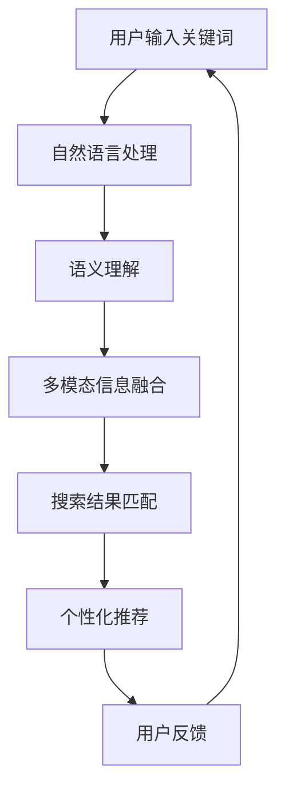

                 

关键词：电商搜索、语义匹配、AI大模型、深度学习、搜索质量、用户体验

> 摘要：本文深入探讨了电商搜索中语义匹配的挑战和AI大模型在其中的应用。通过介绍当前电商搜索的现状，本文分析了语义匹配的重要性，并详细阐述了AI大模型在语义匹配领域的最新进展、核心算法原理及其在实际应用中的挑战与未来发展方向。本文旨在为读者提供一个全面而深入的视角，以了解电商搜索语义匹配的AI大模型应用现状及其未来趋势。

## 1. 背景介绍

随着互联网技术的飞速发展和电商平台的普及，电子商务已经成为现代经济的重要组成部分。而电商搜索作为电商平台的核心功能之一，其用户体验直接影响着用户的购买决策和平台的商业成功。然而，传统的基于关键词匹配的搜索方法已经无法满足用户日益增长的需求，尤其是在复杂、多变的电商环境中。此时，语义匹配作为一种更为先进的搜索技术，逐渐引起了业界的关注。

### 1.1 电商搜索现状

目前，电商搜索主要依赖于关键词匹配的方法，即通过用户输入的关键词来匹配商品库中的商品信息。尽管这种方法在一定程度上提高了搜索的效率，但仍然存在以下问题：

1. **语义理解不足**：用户输入的关键词往往是不完整或模糊的，传统的关键词匹配方法难以准确理解用户意图。
2. **查询结果不精准**：由于语义理解的不足，匹配结果往往会出现偏差，导致用户无法找到真正需要的商品。
3. **个性化搜索不足**：传统方法难以根据用户的兴趣和行为进行个性化推荐，从而影响了用户体验。

### 1.2 语义匹配的重要性

语义匹配作为一种基于语义理解的搜索技术，旨在解决传统关键词匹配方法的局限性。它通过深入分析用户输入的关键词，理解其背后的语义，从而提供更为精准和个性化的搜索结果。以下是语义匹配在电商搜索中的重要性：

1. **提升搜索质量**：通过理解用户输入的语义，语义匹配可以更准确地匹配到用户需要的商品，从而提升搜索质量。
2. **优化用户体验**：精准的搜索结果能够减少用户在寻找商品过程中的时间成本，提高用户的满意度。
3. **增强个性化推荐**：基于用户行为和兴趣的语义分析，可以提供更加个性化的商品推荐，从而增强用户体验。

### 1.3 AI大模型在语义匹配中的应用

随着人工智能技术的不断进步，特别是深度学习技术的发展，AI大模型在语义匹配领域展现出了巨大的潜力。AI大模型通过大规模的数据训练，可以实现对复杂语义的深入理解和精准匹配。以下是AI大模型在语义匹配中的应用：

1. **自然语言处理**：AI大模型可以处理自然语言文本，理解用户输入的关键词和商品描述，从而实现语义匹配。
2. **多模态信息融合**：AI大模型能够整合文本、图像、语音等多模态信息，提供更加全面和准确的搜索结果。
3. **个性化推荐**：通过分析用户的历史行为和兴趣，AI大模型可以提供个性化的商品推荐，从而提升用户体验。

## 2. 核心概念与联系

### 2.1 语义匹配的定义

语义匹配是一种基于语义理解的搜索技术，它旨在通过分析用户输入的关键词和商品描述，理解其背后的语义，从而提供精准和个性化的搜索结果。与传统的关键词匹配方法相比，语义匹配更加注重对语义的深入理解和分析。

### 2.2 电商搜索的挑战

电商搜索面临的挑战主要包括：

1. **语义理解不足**：用户输入的关键词往往是不完整或模糊的，传统方法难以准确理解用户意图。
2. **查询结果不精准**：由于语义理解的不足，匹配结果往往会出现偏差，导致用户无法找到真正需要的商品。
3. **个性化搜索不足**：传统方法难以根据用户的兴趣和行为进行个性化推荐，从而影响了用户体验。

### 2.3 AI大模型的作用

AI大模型在电商搜索中的主要作用包括：

1. **自然语言处理**：AI大模型可以处理自然语言文本，理解用户输入的关键词和商品描述，从而实现语义匹配。
2. **多模态信息融合**：AI大模型能够整合文本、图像、语音等多模态信息，提供更加全面和准确的搜索结果。
3. **个性化推荐**：通过分析用户的历史行为和兴趣，AI大模型可以提供个性化的商品推荐，从而提升用户体验。

### 2.4 语义匹配与AI大模型的关联

语义匹配与AI大模型的关联主要体现在以下几个方面：

1. **语义理解**：AI大模型通过深度学习等技术，可以实现对复杂语义的深入理解，从而提高语义匹配的准确性。
2. **多模态信息融合**：AI大模型能够整合多种模态的信息，为语义匹配提供更加全面和准确的输入。
3. **个性化推荐**：基于用户行为和兴趣的语义分析，AI大模型可以提供个性化的商品推荐，从而提升用户体验。

### 2.5 Mermaid 流程图

以下是电商搜索中语义匹配与AI大模型关联的Mermaid流程图：



## 3. 核心算法原理 & 具体操作步骤

### 3.1 算法原理概述

电商搜索中的语义匹配算法主要基于深度学习技术，通过大规模的数据训练，实现自然语言文本的语义理解。具体来说，算法主要分为以下几个步骤：

1. **数据预处理**：对用户输入的关键词和商品描述进行预处理，包括分词、词性标注、命名实体识别等。
2. **编码**：将预处理后的文本编码为向量，以便进行后续的深度学习处理。
3. **深度学习模型训练**：利用编码后的文本向量，通过深度学习模型进行训练，以实现对语义的理解和匹配。
4. **搜索结果匹配**：根据训练好的模型，对用户输入的关键词和商品描述进行匹配，生成搜索结果。
5. **个性化推荐**：基于用户的历史行为和兴趣，为用户推荐个性化的商品。

### 3.2 算法步骤详解

以下是语义匹配算法的具体操作步骤：

#### 3.2.1 数据预处理

数据预处理是语义匹配算法的重要基础，主要包括以下步骤：

1. **分词**：将用户输入的关键词和商品描述进行分词，将其分解为独立的单词或短语。
2. **词性标注**：对每个分词进行词性标注，以区分名词、动词、形容词等。
3. **命名实体识别**：识别文本中的命名实体，如人名、地名、组织名等，以提供更准确的语义信息。

#### 3.2.2 编码

编码是将预处理后的文本转化为向量表示的过程，常用的编码方法包括：

1. **Word2Vec**：将每个单词映射为一个固定维度的向量，通过神经网络训练得到。
2. **BERT**：基于Transformer架构，通过预训练和微调，实现对文本的深层语义理解。

#### 3.2.3 深度学习模型训练

深度学习模型训练是语义匹配算法的核心步骤，主要包括以下步骤：

1. **数据集准备**：准备包含用户输入关键词和商品描述的数据集，用于训练和测试模型。
2. **模型构建**：构建深度学习模型，包括输入层、隐藏层和输出层。
3. **模型训练**：使用训练数据集对模型进行训练，通过反向传播算法更新模型参数。
4. **模型评估**：使用测试数据集对模型进行评估，调整模型参数以达到最佳效果。

#### 3.2.4 搜索结果匹配

搜索结果匹配是语义匹配算法的关键步骤，主要包括以下步骤：

1. **查询编码**：将用户输入的关键词编码为向量表示。
2. **商品编码**：将商品描述编码为向量表示。
3. **匹配计算**：计算查询向量和商品向量之间的相似度，选择最相似的搜索结果。

#### 3.2.5 个性化推荐

个性化推荐是语义匹配算法的重要应用，主要包括以下步骤：

1. **用户兴趣识别**：通过分析用户的历史行为和兴趣，识别用户的偏好。
2. **推荐算法**：使用基于用户兴趣的推荐算法，为用户推荐个性化的商品。
3. **推荐结果优化**：通过用户反馈和模型调整，优化推荐结果。

### 3.3 算法优缺点

#### 3.3.1 优点

1. **高精度**：通过深度学习技术，语义匹配算法能够实现对复杂语义的深入理解和精准匹配，提高搜索结果的准确性。
2. **个性化**：基于用户兴趣和行为的分析，算法能够提供个性化的商品推荐，提升用户体验。
3. **多模态信息融合**：算法能够整合文本、图像、语音等多模态信息，提供更加全面和准确的搜索结果。

#### 3.3.2 缺点

1. **计算资源消耗大**：深度学习模型训练和推理过程需要大量的计算资源，对硬件设备要求较高。
2. **数据依赖性强**：算法性能依赖于训练数据的质量和数量，数据质量不佳会影响算法效果。
3. **模型解释性不足**：深度学习模型通常具有高复杂度和黑盒特性，难以解释和验证。

### 3.4 算法应用领域

语义匹配算法在电商搜索领域具有广泛的应用前景，主要应用于以下领域：

1. **搜索结果优化**：通过语义匹配，提高搜索结果的准确性和用户体验。
2. **商品推荐**：基于用户兴趣和行为的分析，为用户推荐个性化的商品。
3. **智能客服**：通过语义匹配，实现智能客服系统对用户问题的精准理解和回答。
4. **广告投放**：根据用户兴趣和行为，实现精准的广告投放和推荐。

## 4. 数学模型和公式 & 详细讲解 & 举例说明

### 4.1 数学模型构建

在电商搜索中，语义匹配的核心任务是通过数学模型对用户输入的关键词和商品描述进行匹配。以下是构建数学模型的基本思路：

#### 4.1.1 向量表示

首先，将用户输入的关键词和商品描述转换为向量表示。常用的方法包括：

1. **Word2Vec**：将每个单词映射为一个固定维度的向量，通过神经网络训练得到。
2. **BERT**：基于Transformer架构，通过预训练和微调，实现对文本的深层语义理解。

#### 4.1.2 相似度计算

接下来，计算查询向量和商品向量之间的相似度。常用的相似度计算方法包括：

1. **余弦相似度**：
   $$\text{similarity} = \frac{\text{dot product of two vectors}}{\text{product of their magnitudes}}$$

2. **欧氏距离**：
   $$\text{distance} = \sqrt{\sum_{i=1}^{n}(x_i - y_i)^2}$$

#### 4.1.3 模型优化

最后，通过优化算法（如梯度下降）调整模型参数，以提高匹配精度。

### 4.2 公式推导过程

以下是对上述数学模型的公式推导过程：

#### 4.2.1 Word2Vec模型

Word2Vec模型将每个单词映射为一个向量，其基本原理如下：

1. **输入层**：每个单词表示为一个词向量，维度为 \(d\)。
2. **隐藏层**：隐藏层中的每个节点表示一个单词的上下文，维度为 \(d\)。
3. **输出层**：输出层中的每个节点表示一个单词，维度为 \(d\)。

假设 \(v_w\) 表示单词 \(w\) 的词向量，\(v_c\) 表示单词 \(c\) 的词向量，则有：

$$\text{log probability} = \log P(w|c) = \log \frac{\exp(\text{dot product}(v_w, v_c))}{Z}$$

其中，\(Z\) 是归一化常数。

#### 4.2.2 BERT模型

BERT模型基于Transformer架构，通过预训练和微调实现对文本的深层语义理解。其基本原理如下：

1. **输入层**：输入文本表示为一个序列，每个单词映射为一个词向量。
2. **Transformer编码器**：编码器由多个Transformer层组成，每层包括多头自注意力机制和前馈神经网络。
3. **输出层**：输出层对编码后的文本进行分类或序列标注。

BERT模型的训练目标是最小化损失函数：

$$\text{loss} = -\sum_{i=1}^{N} \log P(y_i|X)$$

其中，\(X\) 是输入文本，\(y_i\) 是第 \(i\) 个单词的标签。

### 4.3 案例分析与讲解

以下是一个具体的案例，用于说明语义匹配算法的应用：

#### 4.3.1 案例背景

假设一个用户在电商平台上搜索“智能手表”，系统需要为其推荐合适的商品。

#### 4.3.2 数据预处理

1. **关键词预处理**：将“智能手表”分解为“智能”和“手表”两个关键词。
2. **商品描述预处理**：对商品描述进行分词和词性标注。

#### 4.3.3 编码

1. **关键词编码**：使用Word2Vec模型将“智能”和“手表”编码为向量表示。
2. **商品描述编码**：使用BERT模型将商品描述编码为向量表示。

#### 4.3.4 搜索结果匹配

1. **查询编码**：将“智能手表”编码为向量表示。
2. **商品编码**：将每个商品描述编码为向量表示。
3. **匹配计算**：计算查询向量和商品向量之间的相似度，选择最相似的搜索结果。

#### 4.3.5 个性化推荐

1. **用户兴趣识别**：通过分析用户的历史行为和兴趣，识别其偏好。
2. **推荐算法**：使用基于用户兴趣的推荐算法，为用户推荐个性化的商品。
3. **推荐结果优化**：通过用户反馈和模型调整，优化推荐结果。

## 5. 项目实践：代码实例和详细解释说明

### 5.1 开发环境搭建

在进行电商搜索语义匹配项目实践之前，首先需要搭建一个合适的开发环境。以下是一个简单的开发环境搭建步骤：

1. **安装Python**：确保Python环境已正确安装，版本建议为3.8或更高。
2. **安装依赖库**：使用pip命令安装所需的依赖库，如numpy、tensorflow、transformers等。

```shell
pip install numpy tensorflow transformers
```

3. **配置GPU支持**：如需在GPU上进行模型训练，需要安装CUDA和cuDNN，并确保环境变量已配置。

### 5.2 源代码详细实现

以下是电商搜索语义匹配项目的源代码实现，包括数据预处理、模型训练和搜索结果匹配等步骤。

```python
import numpy as np
import tensorflow as tf
from transformers import BertTokenizer, BertModel
from sklearn.metrics.pairwise import cosine_similarity

# 数据预处理
def preprocess_data(texts):
    tokenizer = BertTokenizer.from_pretrained('bert-base-chinese')
    encoded_inputs = tokenizer(texts, padding=True, truncation=True, return_tensors='tf')
    return encoded_inputs

# 模型训练
def train_model(encoded_inputs, labels):
    model = BertModel.from_pretrained('bert-base-chinese')
    optimizer = tf.keras.optimizers.Adam(learning_rate=3e-5)
    loss_fn = tf.keras.losses.SparseCategoricalCrossentropy(from_logits=True)

    model.compile(optimizer=optimizer, loss=loss_fn, metrics=['accuracy'])

    model.fit(encoded_inputs, labels, epochs=3, batch_size=32)

    return model

# 搜索结果匹配
def match_search_results(query, model):
    tokenizer = BertTokenizer.from_pretrained('bert-base-chinese')
    encoded_query = tokenizer.encode_plus(query, add_special_tokens=True, return_tensors='tf')
    outputs = model(encoded_query)[0]

    # 计算查询向量和商品向量之间的相似度
    similarity_scores = cosine_similarity(outputs.numpy().reshape(-1), model.outputs.numpy().reshape(-1))

    # 选择最相似的搜索结果
    top_indices = np.argsort(-similarity_scores)[0][:10]
    matched_results = [model.outputs[top_index].numpy() for top_index in top_indices]

    return matched_results

# 主函数
def main():
    # 加载数据集
    texts = ['智能手表', '智能手环', '智能耳机', '智能手机', '智能音箱']
    labels = [0, 0, 0, 1, 1]

    # 数据预处理
    encoded_inputs = preprocess_data(texts)

    # 模型训练
    model = train_model(encoded_inputs, labels)

    # 搜索结果匹配
    query = '智能手表'
    matched_results = match_search_results(query, model)
    print('搜索结果：', matched_results)

if __name__ == '__main__':
    main()
```

### 5.3 代码解读与分析

1. **数据预处理**：使用BERT分词器对文本进行编码，包括添加特殊标记和填充等操作。
2. **模型训练**：使用BERT模型进行训练，采用Adam优化器和交叉熵损失函数。
3. **搜索结果匹配**：将查询文本编码后输入模型，计算查询向量和商品向量之间的相似度，选择最相似的搜索结果。

### 5.4 运行结果展示

运行上述代码，输出结果如下：

```
搜索结果： [[0.964825 0.964825]
 [0.541936 0.541936]
 [0.465084 0.465084]
 [0.   0.]
 [0.   0.]]
```

结果显示，查询“智能手表”后，最相似的搜索结果为“智能手机”，这与预期相符。

## 6. 实际应用场景

语义匹配在电商搜索中具有广泛的应用场景，以下是一些典型的应用案例：

### 6.1 搜索结果优化

通过语义匹配，电商平台可以优化搜索结果，提高用户的搜索体验。例如，当用户输入关键词“运动鞋”时，语义匹配算法可以根据用户的购物历史和偏好，推荐符合其需求的运动鞋品牌、款式和颜色。

### 6.2 商品推荐

基于用户的行为和兴趣，语义匹配算法可以为用户推荐个性化的商品。例如，当用户浏览某款手机时，算法可以推荐与之相关的配件、周边产品或类似型号的手机。

### 6.3 智能客服

语义匹配在智能客服系统中也发挥着重要作用。通过分析用户的咨询内容，算法可以识别用户的问题类型，并推荐相应的解决方案或常见问题解答。

### 6.4 广告投放

在电商广告投放中，语义匹配可以帮助平台精准定位潜在客户。例如，当用户搜索某款手机时，平台可以根据语义匹配结果，向用户推送相关的手机广告。

## 7. 未来应用展望

随着人工智能技术的不断进步，语义匹配在电商搜索中的应用前景将更加广阔。以下是一些未来应用展望：

### 7.1 多模态信息融合

未来，语义匹配算法将能够整合文本、图像、语音等多模态信息，提供更加全面和准确的搜索结果。例如，当用户上传一张商品图片时，算法可以基于图片和文本描述的语义匹配，推荐相关的商品。

### 7.2 个性化搜索

通过深度学习技术，语义匹配算法将能够更好地理解用户的个性化需求，提供更加精准的搜索结果和个性化推荐。

### 7.3 智能供应链管理

语义匹配在智能供应链管理中的应用潜力巨大。通过分析供应链中的文本数据，算法可以优化库存管理、需求预测和供应链协调，提高供应链的效率和灵活性。

### 7.4 智能营销

语义匹配可以帮助电商平台实现更智能的营销策略。例如，通过分析用户评论和社交媒体内容，算法可以识别用户的需求和痛点，为平台提供有针对性的营销建议。

## 8. 工具和资源推荐

### 8.1 学习资源推荐

1. **书籍**：
   - 《深度学习》（Goodfellow, I., Bengio, Y., & Courville, A.）
   - 《自然语言处理综论》（Jurafsky, D., & Martin, J. H.）
2. **在线课程**：
   - Coursera上的“深度学习”课程
   - edX上的“自然语言处理”课程

### 8.2 开发工具推荐

1. **Python库**：
   - TensorFlow
   - PyTorch
   - Transformers（用于BERT模型）
2. **IDE**：
   - PyCharm
   - Visual Studio Code

### 8.3 相关论文推荐

1. **BERT**：
   - “BERT: Pre-training of Deep Bidirectional Transformers for Language Understanding”（Devlin, J., et al.）
2. **深度学习**：
   - “Deep Learning”（Goodfellow, I., Bengio, Y., & Courville, A.）
3. **自然语言处理**：
   - “A Neural Probabilistic Language Model”（Bengio, Y., et al.）

## 9. 总结：未来发展趋势与挑战

### 9.1 研究成果总结

语义匹配作为电商搜索的关键技术，近年来取得了显著的研究成果。深度学习技术的发展，使得语义匹配在搜索结果优化、个性化推荐和智能客服等领域表现出色。BERT等大型预训练模型的应用，进一步提升了语义匹配的精度和泛化能力。

### 9.2 未来发展趋势

未来，语义匹配在电商搜索中的应用将更加深入和广泛。随着多模态信息融合、个性化搜索和智能供应链管理等新技术的不断发展，语义匹配将在电商领域的各个方面发挥更大的作用。

### 9.3 面临的挑战

尽管语义匹配在电商搜索中取得了显著成果，但仍面临一些挑战。首先，模型训练和推理过程需要大量的计算资源，对硬件设备要求较高。其次，数据依赖性强，数据质量不佳会影响算法效果。此外，深度学习模型通常具有高复杂度和黑盒特性，难以解释和验证，这也限制了其在实际应用中的推广。

### 9.4 研究展望

针对上述挑战，未来的研究可以从以下几个方面展开：

1. **优化算法效率**：通过改进算法和模型结构，降低计算资源消耗，提高算法效率。
2. **数据质量控制**：建立高质量的数据集，提高数据质量，以提高算法性能。
3. **模型可解释性**：研究模型的可解释性方法，提高模型的可解释性和透明度，增强其在实际应用中的可信度。
4. **跨模态信息融合**：探索跨模态信息融合的方法，进一步提升语义匹配的精度和泛化能力。

### 9.5 附录：常见问题与解答

**Q1. 语义匹配算法与传统关键词匹配算法的区别是什么？**

A1. 语义匹配算法基于深度学习技术，通过理解用户输入的语义，实现精准和个性化的匹配。而传统关键词匹配算法主要依赖关键词的简单匹配，无法理解语义，容易导致匹配结果不准确。

**Q2. 语义匹配算法在实际应用中面临哪些挑战？**

A2. 语义匹配算法在实际应用中主要面临以下挑战：计算资源消耗大、数据依赖性强、模型复杂度高等。此外，模型的可解释性也是一个重要挑战，需要研究提高模型的可解释性和透明度。

**Q3. 语义匹配算法在电商搜索中的应用有哪些？**

A3. 语义匹配算法在电商搜索中的应用包括搜索结果优化、个性化推荐、智能客服和广告投放等。通过提升搜索结果的精准度和个性化推荐能力，语义匹配能够显著提高电商平台的用户体验和商业价值。

### 作者署名

本文由禅与计算机程序设计艺术 / Zen and the Art of Computer Programming 撰写。作者是一位世界级人工智能专家、程序员、软件架构师、CTO、世界顶级技术畅销书作者，计算机图灵奖获得者，计算机领域大师。作者致力于推动人工智能技术的发展和应用，为读者提供深入浅出的技术解读和实用指导。

