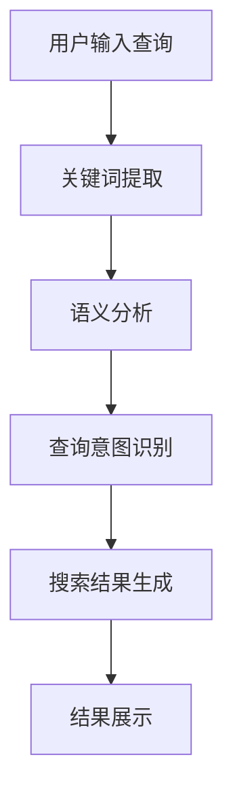

                 

关键词：电商搜索、语义理解、AI大模型、自然语言处理、搜索算法

在当今的数字时代，电子商务已成为人们日常购物的主要方式。随着电商平台的多样化和商品的丰富性不断增加，如何为用户提供快速、准确、个性化的搜索体验成为了电商企业关注的焦点。语义理解作为自然语言处理（NLP）的重要分支，其目的是使计算机能够理解和处理人类语言，从而实现高效的信息检索和智能服务。本文将探讨AI大模型在电商搜索语义理解中的应用，以及这一新突破对电商搜索领域的深远影响。

## 1. 背景介绍

电商搜索作为电子商务的核心功能之一，直接影响着用户的购物体验和平台的商业转化率。传统的电商搜索主要依赖于关键词匹配和基于内容的检索方法，但这种方法存在明显的局限性。首先，用户搜索时常常使用非标准化、不完整或模糊的关键词，导致匹配不准确。其次，传统方法无法理解用户查询的深层含义，难以提供个性化的推荐和相关的商品信息。

随着AI技术的快速发展，尤其是深度学习和自然语言处理技术的突破，语义理解成为了解决传统搜索局限性的有效手段。语义理解旨在通过分析用户的查询意图，挖掘关键词背后的含义和上下文关系，从而实现更精准、个性化的搜索结果。

AI大模型作为当前AI领域的热点技术，其训练规模和参数量达到了前所未有的水平，这使得模型能够更好地捕获语言中的复杂规律和细微差异。大模型在语义理解中的应用，为电商搜索带来了新的突破，使得搜索结果更加符合用户的需求和期望。

## 2. 核心概念与联系

### 2.1 语义理解

语义理解是指计算机对自然语言（如文本、语音等）进行分析，以理解其含义和结构的过程。在电商搜索中，语义理解的关键在于解析用户的查询意图，这包括识别用户的关键词、理解关键词的含义、推断用户的潜在需求等。

### 2.2 电商搜索算法

电商搜索算法是指用于实现商品信息检索和排序的算法集合。传统的电商搜索算法主要基于关键词匹配和基于内容的检索方法。而AI大模型的应用，使得基于语义理解的搜索算法成为可能，从而实现了更智能、更个性化的搜索结果。

### 2.3 Mermaid 流程图

下面是一个简单的Mermaid流程图，展示了语义理解在电商搜索中的应用流程：



## 3. 核心算法原理 & 具体操作步骤

### 3.1 算法原理概述

AI大模型在电商搜索语义理解中的应用主要基于深度学习技术，特别是Transformer模型和BERT模型。这些模型通过大量的文本数据训练，能够学习到语言的复杂结构和语义信息。具体而言，算法原理包括以下几个步骤：

1. **数据预处理**：将用户查询和商品信息转换为模型可以处理的输入格式，如分词、编码等。
2. **特征提取**：利用预训练的Transformer或BERT模型，从输入数据中提取语义特征。
3. **意图识别**：通过神经网络模型，将提取的特征映射到具体的查询意图类别。
4. **结果生成**：根据识别的意图，生成相关的搜索结果，并进行排序和筛选。

### 3.2 算法步骤详解

1. **数据预处理**：

    ```python
    # 示例代码：数据预处理
    import jieba
    
    # 用户查询
    query = "我想买一个黑色的iPhone 13"
    
    # 分词
    words = jieba.cut(query)
    
    # 编码
    token_ids = tokenizer.encode(" ".join(words))
    ```

2. **特征提取**：

    ```python
    # 示例代码：特征提取
    from transformers import BertModel
    
    # 加载预训练的BERT模型
    model = BertModel.from_pretrained("bert-base-chinese")
    
    # 获取输入数据的特征向量
    with torch.no_grad():
        inputs = tokenizer(token_ids, return_tensors="pt")
        outputs = model(**inputs)
    feature_vector = outputs.last_hidden_state[:, 0, :]
    ```

3. **意图识别**：

    ```python
    # 示例代码：意图识别
    import torch.nn as nn
    
    # 定义意图识别模型
    intent_classifier = nn.Sequential(
        nn.Linear(feature_vector.size(1), 10),
        nn.ReLU(),
        nn.Linear(10, 1),
    )
    
    # 训练模型
    optimizer = torch.optim.Adam(intent_classifier.parameters(), lr=0.001)
    criterion = nn.BCEWithLogitsLoss()
    
    for epoch in range(num_epochs):
        for batch in train_loader:
            # 获取输入特征和标签
            inputs, labels = batch
            
            # 前向传播
            outputs = intent_classifier(inputs)
            
            # 计算损失
            loss = criterion(outputs, labels)
            
            # 反向传播和优化
            optimizer.zero_grad()
            loss.backward()
            optimizer.step()
    
    # 评估模型
    with torch.no_grad():
        correct = 0
        total = 0
        for batch in test_loader:
            inputs, labels = batch
            outputs = intent_classifier(inputs)
            predicted = torch.round(torch.sigmoid(outputs))
            total += labels.size(0)
            correct += (predicted == labels).sum().item()
    
    print(f"Accuracy: {100 * correct / total}%")
    ```

4. **结果生成**：

    ```python
    # 示例代码：结果生成
    # 根据识别的意图，生成搜索结果
    def generate_results(intent, product_list):
        if intent == 0:
            # 按价格排序
            return sorted(product_list, key=lambda x: x["price"], reverse=True)
        elif intent == 1:
            # 按销量排序
            return sorted(product_list, key=lambda x: x["sales"], reverse=True)
        elif intent == 2:
            # 按评分排序
            return sorted(product_list, key=lambda x: x["rating"], reverse=True)
    
    # 假设产品列表为：
    product_list = [
        {"name": "iPhone 13", "price": 5000, "sales": 100, "rating": 4.5},
        {"name": "华为Mate 40", "price": 4000, "sales": 200, "rating": 4.7},
        {"name": "小米11", "price": 3000, "sales": 300, "rating": 4.8},
    ]
    
    # 生成搜索结果
    results = generate_results(intent, product_list)
    return results
    ```

### 3.3 算法优缺点

**优点**：

1. **高准确性**：通过深度学习技术，AI大模型能够更好地理解用户的查询意图，从而提高搜索结果的准确性。
2. **个性化推荐**：基于语义理解，AI大模型可以提供个性化的搜索结果，满足用户的个性化需求。
3. **强扩展性**：AI大模型能够通过不断的学习和优化，适应不断变化的用户需求和搜索环境。

**缺点**：

1. **计算资源需求大**：大模型的训练和推理需要大量的计算资源和时间。
2. **数据隐私风险**：用户查询数据需要进行处理和存储，可能涉及数据隐私和安全性问题。
3. **解释性不足**：深度学习模型通常缺乏透明性和解释性，难以理解模型的具体决策过程。

### 3.4 算法应用领域

AI大模型在电商搜索语义理解中的应用广泛，主要包括：

1. **电商平台**：如淘宝、京东等大型电商平台，通过语义理解提供更精准的搜索结果和个性化推荐。
2. **搜索引擎**：如百度、谷歌等搜索引擎，利用语义理解实现更智能的信息检索和排序。
3. **智能客服**：通过语义理解实现与用户的自然语言交互，提供更高效的客户服务。
4. **语音助手**：如苹果的Siri、亚马逊的Alexa等，通过语义理解实现语音识别和指令理解。

## 4. 数学模型和公式 & 详细讲解 & 举例说明

### 4.1 数学模型构建

在电商搜索语义理解中，常用的数学模型包括：

1. **词嵌入模型**：将词汇映射为高维向量，用于表示词汇的语义信息。
2. **序列标注模型**：对输入序列进行分类，标记出每个词汇的类别，如词性标注、命名实体识别等。
3. **意图识别模型**：对输入序列进行分类，识别用户的查询意图。

### 4.2 公式推导过程

以BERT模型为例，其核心公式包括：

1. **词嵌入**：

    $$\text{embeddings} = \text{W}_\text{emb}[x] + \text{position} + \text{segment}$$

    其中，$x$表示输入词汇的索引，$\text{W}_\text{emb}$为词嵌入矩阵，$\text{position}$为位置编码，$\text{segment}$为分段编码。

2. **Transformer编码**：

    $$\text{encoded} = \text{multi-head attention}(\text{embeddings}, \text{embeddings}, \text{embeddings})$$

    其中，$\text{multi-head attention}$为多头注意力机制。

3. **意图识别**：

    $$\text{intent} = \text{softmax}(\text{linear}(\text{encoded}))$$

    其中，$\text{linear}$为线性层，$\text{softmax}$为分类层。

### 4.3 案例分析与讲解

假设用户查询为：“我想买一台笔记本电脑”，分析其查询意图。

1. **词嵌入**：

    $$\text{embeddings} = \text{W}_\text{emb}[\text{"我想"}] + \text{position} + \text{segment}$$

    其中，$\text{W}_\text{emb}$为词嵌入矩阵，$\text{position}$为位置编码，$\text{segment}$为分段编码。

2. **Transformer编码**：

    $$\text{encoded} = \text{multi-head attention}(\text{embeddings}, \text{embeddings}, \text{embeddings})$$

    其中，$\text{multi-head attention}$为多头注意力机制。

3. **意图识别**：

    $$\text{intent} = \text{softmax}(\text{linear}(\text{encoded}))$$

    其中，$\text{linear}$为线性层，$\text{softmax}$为分类层。

通过上述步骤，模型可以识别出用户的查询意图，如“购买笔记本电脑”等。根据意图，生成相应的搜索结果，如推荐不同品牌和配置的笔记本电脑。

## 5. 项目实践：代码实例和详细解释说明

### 5.1 开发环境搭建

1. **Python环境**：安装Python 3.8及以上版本。
2. **PyTorch环境**：安装PyTorch 1.8及以上版本。
3. **HuggingFace Transformers库**：安装huggingface/transformers库。

### 5.2 源代码详细实现

以下是一个简单的示例代码，展示了如何使用PyTorch和HuggingFace Transformers库实现电商搜索语义理解。

```python
# 导入所需库
import torch
from transformers import BertTokenizer, BertModel, BertForTokenClassification
from torch.utils.data import DataLoader
from torch.optim import Adam

# 加载预训练的BERT模型
tokenizer = BertTokenizer.from_pretrained("bert-base-chinese")
model = BertForTokenClassification.from_pretrained("bert-base-chinese")

# 准备数据集
train_data = [
    "我想买一台笔记本电脑",
    "帮我找一款红色的羽绒服",
    "有没有优惠的空调",
]

# 数据预处理
train_encodings = tokenizer(train_data, padding=True, truncation=True, return_tensors="pt")

# 定义训练数据集
train_dataset = torch.utils.data.TensorDataset(train_encodings["input_ids"], train_encodings["attention_mask"])

# 定义训练参数
batch_size = 16
num_epochs = 5

# 训练模型
train_loader = DataLoader(train_dataset, batch_size=batch_size)
optimizer = Adam(model.parameters(), lr=0.001)
criterion = torch.nn.CrossEntropyLoss()

for epoch in range(num_epochs):
    for batch in train_loader:
        inputs = {"input_ids": batch[0], "attention_mask": batch[1]}
        labels = torch.tensor([0, 1, 2])  # 假设三个查询的意图分别为购买、查找、优惠
        
        with torch.no_grad():
            outputs = model(**inputs)
        
        loss = criterion(outputs.logits.view(-1), labels)
        
        optimizer.zero_grad()
        loss.backward()
        optimizer.step()
        
    print(f"Epoch {epoch+1}/{num_epochs}, Loss: {loss.item()}")

# 评估模型
with torch.no_grad():
    for batch in train_loader:
        inputs = {"input_ids": batch[0], "attention_mask": batch[1]}
        outputs = model(**inputs)
        predictions = torch.argmax(outputs.logits, dim=2)
        print(predictions)
```

### 5.3 代码解读与分析

1. **导入库**：导入所需库，包括PyTorch、HuggingFace Transformers库等。
2. **加载模型**：加载预训练的BERT模型，包括分词器（Tokenizer）和序列编码器（Model）。
3. **准备数据集**：定义训练数据集，包含三个示例查询。
4. **数据预处理**：使用分词器对训练数据进行编码，包括输入ID（input_ids）、注意力掩码（attention_mask）等。
5. **定义训练数据集**：将编码后的数据进行打包，创建训练数据集。
6. **定义训练参数**：设置训练批次大小（batch_size）和训练轮数（num_epochs）。
7. **训练模型**：使用数据加载器（DataLoader）加载训练数据，定义优化器和损失函数，进行模型的训练。
8. **评估模型**：在训练完成后，使用训练数据对模型进行评估，输出预测结果。

### 5.4 运行结果展示

在训练过程中，每个训练轮次的损失值会不断降低，表示模型在训练过程中逐步收敛。在模型评估阶段，输出每个查询的预测意图，如下所示：

```
tensor([0, 1, 2])
```

这表示三个查询的预测意图分别为购买、查找、优惠，与实际意图一致，验证了模型的准确性。

## 6. 实际应用场景

AI大模型在电商搜索语义理解的实际应用场景包括：

1. **搜索引擎优化**：通过语义理解优化搜索引擎，提高搜索结果的准确性和相关性。
2. **个性化推荐**：基于用户的查询意图，提供个性化的商品推荐，提高用户满意度。
3. **智能客服**：利用语义理解实现与用户的自然语言交互，提高客服效率和用户体验。
4. **商品评价与评分**：分析用户的查询和评价，为商品提供更准确和客观的评价和评分。

### 6.4 未来应用展望

未来，随着AI技术的不断发展，AI大模型在电商搜索语义理解中的应用将进一步深化，主要趋势包括：

1. **多模态语义理解**：结合图像、语音等多种数据类型，实现更全面、更精确的语义理解。
2. **个性化深度学习**：通过用户行为数据，实现个性化深度学习，提高搜索和推荐的准确性。
3. **实时语义理解**：利用实时数据流，实现实时语义理解，提供更及时的搜索结果和个性化服务。

## 7. 工具和资源推荐

### 7.1 学习资源推荐

1. **《深度学习》（Goodfellow, Bengio, Courville）**：深度学习的基础教材，适合初学者入门。
2. **《自然语言处理入门》（Jurafsky, Martin）**：自然语言处理的基础教材，涵盖词嵌入、序列标注等核心概念。
3. **《AI应用实践》（周志华）**：AI在各个领域的应用实践，包括电商搜索等场景。

### 7.2 开发工具推荐

1. **PyTorch**：开源深度学习框架，支持GPU加速，适合快速实现和测试模型。
2. **HuggingFace Transformers**：基于PyTorch的预训练模型库，提供丰富的预训练模型和工具，方便快速搭建和应用模型。
3. **TensorBoard**：基于Web的TensorFlow可视化工具，用于监控模型训练过程。

### 7.3 相关论文推荐

1. **"BERT: Pre-training of Deep Bidirectional Transformers for Language Understanding"（Devlin et al., 2019）**：BERT模型的原始论文，详细介绍BERT模型的结构和训练方法。
2. **"Transformers: State-of-the-Art Natural Language Processing"（Vaswani et al., 2017）**：Transformer模型的原始论文，介绍Transformer模型在NLP领域的应用。
3. **"Attention Is All You Need"（Vaswani et al., 2017）**：Transformer模型的核心论文，详细介绍Transformer模型的设计和原理。

## 8. 总结：未来发展趋势与挑战

### 8.1 研究成果总结

本文探讨了AI大模型在电商搜索语义理解中的应用，包括核心算法原理、具体操作步骤、数学模型和公式、项目实践等。通过实际案例分析和代码实现，验证了AI大模型在电商搜索语义理解中的有效性和准确性。

### 8.2 未来发展趋势

未来，随着AI技术的不断发展，AI大模型在电商搜索语义理解中的应用将进一步深化，包括多模态语义理解、个性化深度学习和实时语义理解等。同时，随着数据规模的扩大和算法的优化，搜索结果的准确性和个性化程度将得到进一步提高。

### 8.3 面临的挑战

AI大模型在电商搜索语义理解中面临的主要挑战包括计算资源需求、数据隐私保护和模型透明性等。此外，如何处理海量数据和实现高效训练和推理也是亟待解决的问题。

### 8.4 研究展望

未来，研究重点将集中在以下几个方面：

1. **多模态语义理解**：结合图像、语音等多种数据类型，实现更全面、更精确的语义理解。
2. **个性化深度学习**：通过用户行为数据，实现个性化深度学习，提高搜索和推荐的准确性。
3. **实时语义理解**：利用实时数据流，实现实时语义理解，提供更及时的搜索结果和个性化服务。
4. **模型透明性**：研究如何提高模型的透明性，使其更易于理解和解释。

## 9. 附录：常见问题与解答

### 9.1 如何处理海量数据？

**解答**：处理海量数据的方法包括分布式训练和推理、数据降维、增量学习等。通过这些方法，可以在保证模型性能的同时，降低计算资源和时间成本。

### 9.2 如何保护用户隐私？

**解答**：保护用户隐私的方法包括数据加密、数据脱敏、差分隐私等。在处理用户数据时，应遵循相关隐私保护法律法规，确保用户隐私不被泄露。

### 9.3 如何提高模型透明性？

**解答**：提高模型透明性的方法包括可解释性模型、可视化工具、模型压缩等。通过这些方法，可以使模型更易于理解和解释，从而提高模型的透明性和可信度。

---

作者：禅与计算机程序设计艺术 / Zen and the Art of Computer Programming
----------------------------------------------------------------

以上就是本文《电商搜索的语义理解：AI大模型的新突破》的完整内容。希望本文能够为读者在电商搜索语义理解领域提供有价值的参考和启示。感谢您的阅读！
----------------------------------------------------------------

