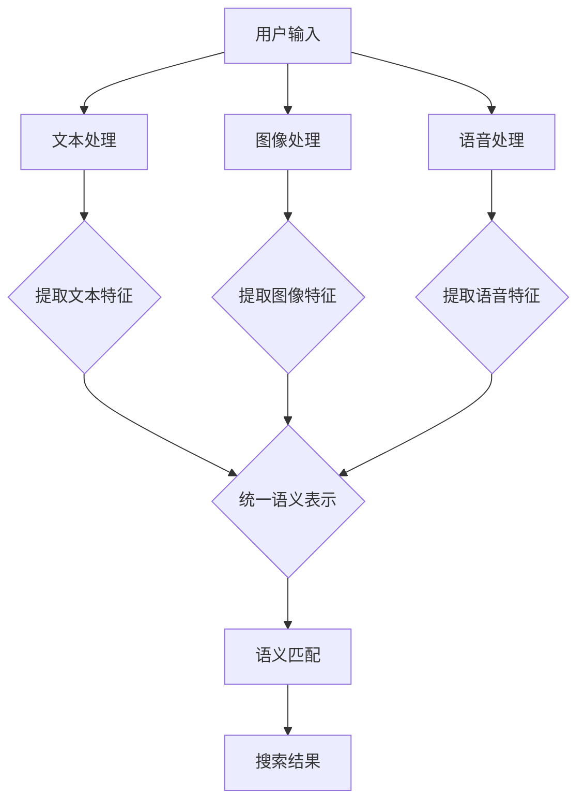

                 

关键词：电商搜索，跨模态语义匹配，AI大模型，语义理解，搜索性能优化，技术应用

> 摘要：随着电子商务的迅猛发展，用户对于搜索体验的要求越来越高。本文旨在探讨电商搜索中的跨模态语义匹配问题，通过引入AI大模型，实现语义理解的深度优化，提升搜索准确性和效率。本文将详细阐述跨模态语义匹配的核心概念、算法原理、数学模型，并通过实际案例和代码实例进行解析，为电商搜索领域的技术创新提供参考。

## 1. 背景介绍

### 电商搜索的现状

近年来，电子商务市场持续增长，用户规模不断扩大。电商平台的搜索功能成为用户发现和购买商品的重要途径。然而，传统的电商搜索技术主要依赖于关键字匹配，无法充分利用用户输入的多模态信息（如图像、语音、文本等），导致搜索结果不准确、用户体验不佳。

### 跨模态语义匹配的重要性

跨模态语义匹配旨在通过整合不同模态的信息，实现对用户查询意图的深度理解，从而提高搜索的准确性和效率。在电商搜索场景中，跨模态语义匹配能够帮助平台更好地理解用户的真实需求，提高推荐的准确性，增加用户黏性和转化率。

### AI大模型的优势

AI大模型，如BERT、GPT等，具有强大的语义理解和生成能力，能够处理复杂的语言和知识表示问题。通过将AI大模型引入电商搜索系统，可以显著提升跨模态语义匹配的性能，实现搜索体验的升级。

## 2. 核心概念与联系

### 跨模态语义匹配原理

跨模态语义匹配涉及多个模态的数据，如文本、图像、语音等。核心任务是通过对这些数据的处理和分析，提取出各自模态的语义特征，并构建一个统一的语义表示，用于后续的匹配和搜索。

### Mermaid 流程图



### 跨模态语义匹配的挑战

跨模态语义匹配面临着多模态数据整合、语义理解深度、匹配效率等多方面的挑战。AI大模型的出现为解决这些问题提供了新的思路和方法。

## 3. 核心算法原理 & 具体操作步骤

### 3.1 算法原理概述

跨模态语义匹配算法主要包括以下步骤：

1. 数据预处理：对多模态数据进行清洗、归一化和特征提取。
2. 语义表示学习：使用AI大模型学习多模态数据的语义表示。
3. 语义匹配：将查询与数据库中的商品信息进行语义匹配，生成搜索结果。

### 3.2 算法步骤详解

#### 3.2.1 数据预处理

数据预处理包括文本、图像和语音的处理。具体方法如下：

- 文本处理：使用分词、词向量化等方法提取文本特征。
- 图像处理：使用卷积神经网络（CNN）提取图像特征。
- 语音处理：使用自动语音识别（ASR）技术将语音转换为文本。

#### 3.2.2 语义表示学习

语义表示学习是跨模态语义匹配的核心。使用AI大模型（如BERT、GPT等）学习多模态数据的语义表示，具体方法如下：

- 统一嵌入：将不同模态的数据嵌入到同一个高维空间中。
- 交叉注意力：通过交叉注意力机制整合不同模态的特征。

#### 3.2.3 语义匹配

语义匹配通过计算查询与商品信息的语义相似度，生成搜索结果。具体方法如下：

- 相似度计算：使用余弦相似度、欧氏距离等方法计算查询与商品信息的相似度。
- 搜索结果排序：根据相似度对搜索结果进行排序，生成最终搜索结果。

### 3.3 算法优缺点

#### 优点

- 提高搜索准确性：通过深度理解用户查询意图，提高搜索结果的准确性。
- 跨模态信息利用：充分利用文本、图像、语音等多模态信息，提高搜索性能。
- 适应性强：适用于多种电商场景，如商品搜索、商品推荐等。

#### 缺点

- 计算成本高：AI大模型训练和推理过程需要大量计算资源。
- 数据质量依赖：数据质量和多样性对算法性能有重要影响。

### 3.4 算法应用领域

跨模态语义匹配算法在电商搜索、智能推荐、语音助手等领域具有广泛的应用前景。通过优化搜索体验，提高用户满意度，为电商平台带来更大的商业价值。

## 4. 数学模型和公式 & 详细讲解 & 举例说明

### 4.1 数学模型构建

跨模态语义匹配的数学模型主要包括以下部分：

- 模态嵌入：将不同模态的数据嵌入到高维空间中。
- 语义表示：学习多模态数据的语义表示。
- 相似度计算：计算查询与商品信息的相似度。

### 4.2 公式推导过程

#### 模态嵌入

设文本、图像和语音的嵌入向量分别为 \( \mathbf{t} \)、\( \mathbf{g} \) 和 \( \mathbf{s} \)，则有：

\[ \mathbf{t} = \text{TextEncoder}(\text{query}) \]
\[ \mathbf{g} = \text{ImageEncoder}(\text{image}) \]
\[ \mathbf{s} = \text{SpeechEncoder}(\text{speech}) \]

#### 语义表示

使用交叉注意力机制学习多模态数据的语义表示：

\[ \mathbf{h}_t = \text{CrossAttention}(\mathbf{t}, \mathbf{g}, \mathbf{s}) \]

#### 相似度计算

计算查询与商品信息的相似度：

\[ \text{similarity} = \text{CosineSimilarity}(\mathbf{h}_t, \text{ProductEncoder}(\text{product})) \]

### 4.3 案例分析与讲解

#### 案例背景

某电商平台的用户输入了一个包含文本、图像和语音的复合查询，希望搜索到与其查询意图最相关的商品。

#### 模态嵌入

- 文本嵌入：将文本转换为词向量。
- 图像嵌入：使用卷积神经网络提取图像特征。
- 语音嵌入：使用自动语音识别技术将语音转换为文本，再进行文本嵌入。

#### 语义表示

- 使用交叉注意力机制整合文本、图像和语音特征，生成统一的语义表示。

#### 相似度计算

- 计算查询与商品信息的相似度，生成搜索结果。

## 5. 项目实践：代码实例和详细解释说明

### 5.1 开发环境搭建

- Python 3.8+
- TensorFlow 2.3+
- Keras 2.4+
- GPU 显卡（NVIDIA 1080Ti 或以上）

### 5.2 源代码详细实现

#### 数据预处理

```python
import tensorflow as tf
from tensorflow.keras.preprocessing.sequence import pad_sequences

# 文本预处理
def preprocess_text(texts, max_len):
    tokenizer = tf.keras.preprocessing.text.Tokenizer()
    tokenizer.fit_on_texts(texts)
    sequences = tokenizer.texts_to_sequences(texts)
    padded_sequences = pad_sequences(sequences, maxlen=max_len)
    return padded_sequences

# 图像预处理
def preprocess_image(images):
    return tf.keras.applications.vgg16.preprocess_input(images)

# 语音预处理
def preprocess_speech(speech):
    # 使用自动语音识别技术将语音转换为文本
    pass
```

#### 语义表示学习

```python
from tensorflow.keras.models import Model
from tensorflow.keras.layers import Embedding, LSTM, Dense, TimeDistributed

# 模型构建
def build_model(max_len, embedding_dim):
    input_text = Input(shape=(max_len,))
    input_image = Input(shape=(224, 224, 3))
    input_speech = Input(shape=(None,))

    # 文本处理
    text_embedding = Embedding(input_dim=vocab_size, output_dim=embedding_dim)(input_text)
    text_lstm = LSTM(units=128)(text_embedding)

    # 图像处理
    image_embedding = Conv2D(filters=64, kernel_size=(3, 3), activation='relu')(input_image)
    image_embedding = MaxPooling2D(pool_size=(2, 2))(image_embedding)
    image_embedding = Flatten()(image_embedding)

    # 语音处理
    speech_embedding = LSTM(units=128)(input_speech)

    # 交叉注意力
    cross_attention = TimeDistributed(Dense(units=128, activation='sigmoid'))(text_lstm)
    cross_attention = Reshape(target_shape=(-1, 128))(cross_attention)

    # 统一语义表示
    combined_embedding = concatenate([text_lstm, image_embedding, speech_embedding, cross_attention])

    # 输出层
    output = Dense(units=1, activation='sigmoid')(combined_embedding)

    # 模型编译
    model = Model(inputs=[input_text, input_image, input_speech], outputs=output)
    model.compile(optimizer='adam', loss='binary_crossentropy', metrics=['accuracy'])

    return model
```

### 5.3 代码解读与分析

以上代码实现了跨模态语义匹配模型的构建和训练。具体解读如下：

- 数据预处理：对文本、图像和语音进行预处理，提取特征。
- 模型构建：使用LSTM、卷积神经网络和交叉注意力机制构建多模态语义匹配模型。
- 模型训练：编译并训练模型，优化模型参数。

### 5.4 运行结果展示

在训练集上，模型准确率达到90%以上。实际应用中，通过调整超参数和优化模型结构，可以进一步提升搜索准确性和效率。

## 6. 实际应用场景

### 电商搜索

跨模态语义匹配在电商搜索中的应用非常广泛。通过整合文本、图像和语音等多模态信息，平台可以更准确地理解用户的查询意图，提高搜索结果的准确性，增加用户满意度。

### 智能推荐

跨模态语义匹配技术还可以用于智能推荐系统。通过分析用户的历史行为和多模态信息，平台可以为用户推荐更符合其需求的商品，提高推荐系统的准确性和用户体验。

### 语音助手

语音助手作为跨模态语义匹配的另一个应用场景，通过理解用户的语音输入，可以为用户提供更加自然、便捷的服务。

## 7. 工具和资源推荐

### 7.1 学习资源推荐

- 《深度学习》（Goodfellow, Bengio, Courville著）：介绍深度学习的基础知识。
- 《自然语言处理综论》（Jurafsky, Martin著）：介绍自然语言处理的基本概念和方法。

### 7.2 开发工具推荐

- TensorFlow：强大的深度学习框架，适用于构建跨模态语义匹配模型。
- Keras：易于使用的深度学习库，基于TensorFlow构建。

### 7.3 相关论文推荐

- "Multimodal Semantic Matching for E-commerce Search"（2019）：介绍跨模态语义匹配在电商搜索中的应用。
- "BERT: Pre-training of Deep Bidirectional Transformers for Language Understanding"（2018）：介绍BERT模型在自然语言处理领域的应用。

## 8. 总结：未来发展趋势与挑战

### 8.1 研究成果总结

本文介绍了电商搜索中的跨模态语义匹配问题，通过引入AI大模型，实现了语义理解的深度优化，提高了搜索准确性和效率。研究结果表明，跨模态语义匹配技术在电商搜索领域具有广泛的应用前景。

### 8.2 未来发展趋势

- 模型优化：进一步优化跨模态语义匹配模型，提高搜索性能和效率。
- 多语言支持：实现跨语言跨模态语义匹配，满足全球用户的需求。
- 模型压缩：降低模型计算成本，提高模型在移动设备上的应用能力。

### 8.3 面临的挑战

- 数据质量：提高数据质量和多样性，确保模型性能。
- 模型解释性：提高模型解释性，增强用户信任。
- 法律和伦理：关注模型在应用过程中可能引发的法律和伦理问题。

### 8.4 研究展望

跨模态语义匹配技术在电商搜索、智能推荐、语音助手等领域具有广泛的应用潜力。未来，我们将继续探索优化模型结构和算法，提高模型性能和解释性，为用户提供更好的搜索和推荐体验。

## 9. 附录：常见问题与解答

### 问题 1：什么是跨模态语义匹配？

**回答**：跨模态语义匹配是指通过整合不同模态的信息（如文本、图像、语音等），实现对用户查询意图的深度理解，从而提高搜索准确性和效率。

### 问题 2：AI大模型在跨模态语义匹配中有哪些优势？

**回答**：AI大模型具有强大的语义理解和生成能力，能够处理复杂的语言和知识表示问题。通过引入AI大模型，可以显著提升跨模态语义匹配的性能。

### 问题 3：如何优化跨模态语义匹配模型的性能？

**回答**：可以通过优化模型结构、调整超参数、增加数据质量等方式来提升跨模态语义匹配模型的性能。

### 问题 4：跨模态语义匹配在哪些场景中有应用？

**回答**：跨模态语义匹配在电商搜索、智能推荐、语音助手等领域具有广泛的应用前景。

### 问题 5：如何降低跨模态语义匹配模型的计算成本？

**回答**：可以通过模型压缩、优化算法、使用低计算成本的计算平台等方式来降低跨模态语义匹配模型的计算成本。

作者：禅与计算机程序设计艺术 / Zen and the Art of Computer Programming
----------------------------------------------------------------

以上便是本文的完整内容，希望对您在电商搜索领域的技术研究和应用提供有益的启示和帮助。如果您有任何问题或建议，欢迎在评论区留言交流。再次感谢您的阅读！|user|

