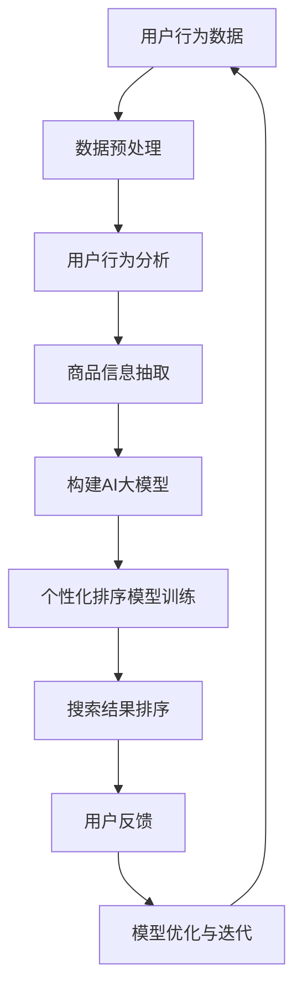

                 

关键词：电商搜索、个性化排序、AI大模型、算法优化、用户行为分析、用户偏好

> 摘要：本文深入探讨了电商搜索结果个性化排序的背景和重要性，以及如何通过AI大模型实现这一目标。我们详细阐述了核心算法原理、数学模型构建、具体操作步骤，并通过实际项目实例和代码解读，展示了这一算法在实际应用中的效果。最后，我们对算法的未来发展趋势、面临的挑战及研究展望进行了深入分析。

## 1. 背景介绍

在电子商务迅速发展的今天，搜索结果是用户获取商品信息的主要途径。如何让用户快速、准确地找到他们感兴趣的商品，成为电商企业竞争的关键。传统的搜索排序算法通常基于商品的属性、价格、销量等因素，这些方法虽然在一定程度上提高了搜索结果的准确度，但往往忽略了用户的个人偏好和行为习惯。

个性化排序算法应运而生，其核心思想是根据用户的历史行为、搜索记录和购买偏好，动态调整搜索结果的排序顺序，从而提高用户的搜索体验和满意度。然而，随着数据量的急剧增长和用户行为的多样化，传统的个性化排序算法在效率和效果上面临着巨大的挑战。

为了解决这一问题，近年来，人工智能领域的大模型技术取得了突破性进展。这些大模型，如深度学习模型、图神经网络模型等，通过自动学习大量的用户行为数据和商品信息，能够实现对用户偏好和商品属性的深度理解和精准预测。因此，结合AI大模型技术，研发出新的个性化排序算法，成为当前研究的热点。

## 2. 核心概念与联系

### 2.1. AI大模型

AI大模型是指具有大规模参数和强大计算能力的神经网络模型。这些模型通常由多层神经网络组成，能够自动学习复杂的非线性关系。常见的AI大模型包括深度学习模型、图神经网络模型、Transformer模型等。

### 2.2. 用户行为分析

用户行为分析是指通过对用户在电商平台的搜索、浏览、购买等行为数据进行挖掘和分析，提取出用户的兴趣偏好和购买习惯。这些数据包括用户的点击记录、浏览时间、购买频率、评价反馈等。

### 2.3. 商品信息抽取

商品信息抽取是指从电商平台的商品描述、价格、品牌、分类等信息中，提取出关键的属性和特征。这些信息包括商品的属性标签、关键词、用户评价等。

### 2.4. 个性化排序算法

个性化排序算法是指根据用户行为分析和商品信息抽取的结果，动态调整搜索结果的排序顺序，从而提高用户的搜索体验和满意度。常见的个性化排序算法包括协同过滤、基于内容的推荐、基于模型的推荐等。

### 2.5. Mermaid流程图



## 3. 核心算法原理 & 具体操作步骤

### 3.1. 算法原理概述

电商搜索结果个性化排序算法的核心是基于用户行为分析和商品信息抽取，构建一个AI大模型，通过该模型动态调整搜索结果的排序顺序。具体来说，算法包括以下步骤：

1. 数据预处理：对用户行为数据和商品信息进行清洗、去噪和规范化处理。
2. 用户行为分析：基于用户的历史行为数据，提取出用户的兴趣偏好和购买习惯。
3. 商品信息抽取：从商品描述中提取出关键属性和特征，构建商品信息库。
4. 构建AI大模型：利用深度学习或图神经网络等技术，构建一个能够自动学习用户偏好和商品属性的AI大模型。
5. 个性化排序模型训练：利用用户行为分析和商品信息抽取的结果，训练一个基于AI大模型的个性化排序模型。
6. 搜索结果排序：根据用户的行为数据和商品属性，利用个性化排序模型对搜索结果进行排序。
7. 用户反馈与模型优化：根据用户的反馈，对个性化排序模型进行优化和迭代。

### 3.2. 算法步骤详解

1. **数据预处理**
   数据预处理是算法的第一步，其目的是提高后续分析的质量。主要包括以下任务：
   - **数据清洗**：去除重复、异常和错误的数据。
   - **去噪**：通过滤波和降噪技术，去除数据中的噪声。
   - **规范化**：将不同数据源和不同量纲的数据进行统一处理，例如，将用户的行为数据进行标准化处理。

2. **用户行为分析**
   用户行为分析的核心是提取出用户的兴趣偏好和购买习惯。具体步骤如下：
   - **用户行为数据收集**：收集用户在电商平台的搜索、浏览、购买等行为数据。
   - **行为特征提取**：根据用户的行为数据，提取出反映用户兴趣偏好和购买习惯的特征，例如，用户的点击频率、浏览时长、购买频率等。
   - **用户群体划分**：根据行为特征，将用户划分为不同的群体，为后续的个性化推荐提供基础。

3. **商品信息抽取**
   商品信息抽取的目的是从商品描述中提取出关键属性和特征。具体步骤如下：
   - **文本预处理**：对商品描述进行分词、去停用词、词干提取等预处理操作。
   - **特征提取**：使用自然语言处理技术，从预处理后的文本中提取出商品的关键属性和特征，例如，商品的品牌、型号、材质等。
   - **商品库构建**：将提取出的商品特征构建成商品信息库，为后续的个性化排序提供数据支持。

4. **构建AI大模型**
   构建AI大模型是算法的核心步骤，常用的模型包括深度学习模型、图神经网络模型等。具体步骤如下：
   - **模型选择**：根据应用场景和数据特性，选择合适的AI大模型。
   - **模型训练**：利用用户行为分析和商品信息抽取的结果，对AI大模型进行训练，使其能够自动学习用户偏好和商品属性。
   - **模型优化**：通过交叉验证和超参数调整，优化模型的性能。

5. **个性化排序模型训练**
   个性化排序模型是基于AI大模型构建的，其目的是根据用户的行为数据和商品属性，动态调整搜索结果的排序顺序。具体步骤如下：
   - **数据准备**：将用户的行为数据和商品属性进行格式化处理，为模型训练提供数据。
   - **模型训练**：利用用户行为数据和商品属性，对个性化排序模型进行训练。
   - **模型评估**：通过交叉验证和指标评估，评估模型的性能。

6. **搜索结果排序**
   搜索结果排序是算法的最终输出，其目的是根据用户的行为数据和商品属性，对搜索结果进行排序。具体步骤如下：
   - **数据输入**：将用户的搜索请求和商品属性输入个性化排序模型。
   - **模型预测**：利用个性化排序模型，预测出搜索结果的排序顺序。
   - **结果输出**：将排序后的搜索结果输出给用户。

7. **用户反馈与模型优化**
   用户反馈是算法不断优化和迭代的重要途径。具体步骤如下：
   - **用户反馈收集**：收集用户对搜索结果的反馈，例如，用户点击了哪些商品、对哪些商品进行了评价等。
   - **模型优化**：根据用户反馈，对个性化排序模型进行调整和优化。
   - **模型迭代**：通过不断收集用户反馈和优化模型，实现模型的迭代和升级。

### 3.3. 算法优缺点

**优点：**
- **个性化强**：通过用户行为分析和AI大模型，能够实现高度个性化的搜索结果排序，提高用户满意度。
- **自适应性强**：根据用户反馈和实时数据，能够动态调整搜索结果的排序顺序，适应不同的用户需求。
- **高效性**：利用深度学习和图神经网络等大模型技术，能够高效地处理海量数据和复杂的用户行为。

**缺点：**
- **计算资源消耗大**：大模型的训练和推理需要大量的计算资源和时间。
- **数据质量要求高**：用户行为数据和商品信息的质量直接影响算法的效果，需要大量高质量的数据支持。
- **隐私保护问题**：用户行为数据的收集和分析涉及用户的隐私，需要严格遵守相关的法律法规。

### 3.4. 算法应用领域

个性化排序算法在电商领域具有广泛的应用前景，不仅可以用于电商搜索结果排序，还可以应用于推荐系统、广告投放等领域。具体应用包括：
- **电商搜索**：根据用户的搜索历史和购买偏好，动态调整搜索结果的排序顺序，提高用户的搜索体验。
- **推荐系统**：根据用户的兴趣偏好，为用户推荐相关的商品和服务，提高用户的满意度和粘性。
- **广告投放**：根据用户的兴趣和购买习惯，精准投放广告，提高广告的点击率和转化率。

## 4. 数学模型和公式 & 详细讲解 & 举例说明

### 4.1. 数学模型构建

电商搜索结果个性化排序算法的数学模型主要包括用户行为分析模型、商品信息抽取模型和个性化排序模型。

**用户行为分析模型：**
用户行为分析模型通常基于马尔可夫链模型或潜在因子模型，用于提取用户的兴趣偏好和购买习惯。一个简单的马尔可夫链模型可以表示为：

$$
P(X_t = j | X_{t-1} = i) = \frac{C_{ij}}{\sum_{k} C_{ik}}
$$

其中，$C_{ij}$ 表示用户从状态 $i$ 转移到状态 $j$ 的转移概率。

**商品信息抽取模型：**
商品信息抽取模型通常基于自然语言处理技术，如词袋模型、卷积神经网络（CNN）或循环神经网络（RNN），用于从商品描述中提取关键属性和特征。一个简单的词袋模型可以表示为：

$$
f(x_i) = \sum_{j=1}^{n} w_j \cdot I(x_i = j)
$$

其中，$w_j$ 表示词 $j$ 的权重，$I(x_i = j)$ 表示词 $i$ 是否出现在商品描述中。

**个性化排序模型：**
个性化排序模型通常基于深度学习模型或图神经网络模型，用于根据用户行为和商品属性，动态调整搜索结果的排序顺序。一个简单的深度学习模型可以表示为：

$$
\sigma(W_1 \cdot [X, U] + b_1)
$$

其中，$X$ 表示商品属性向量，$U$ 表示用户偏好向量，$W_1$ 和 $b_1$ 分别表示权重和偏置。

### 4.2. 公式推导过程

以马尔可夫链模型为例，我们推导用户行为分析模型的转移概率公式。

假设用户在时间 $t$ 的行为状态为 $X_t$，用户在时间 $t-1$ 的行为状态为 $X_{t-1}$。根据马尔可夫链模型的定义，有：

$$
P(X_t = j | X_{t-1} = i) = \frac{C_{ij}}{\sum_{k} C_{ik}}
$$

其中，$C_{ij}$ 表示用户从状态 $i$ 转移到状态 $j$ 的次数，$\sum_{k} C_{ik}$ 表示用户从状态 $i$ 转移到所有状态的次数。

我们可以通过以下步骤推导出转移概率的公式：

1. **初始化转移次数矩阵**：设 $C_{ij}$ 为用户从状态 $i$ 转移到状态 $j$ 的次数，初始化所有 $C_{ij}$ 为0。

2. **累积转移次数**：对于每一个用户的行为序列，累积每个状态转移的次数，例如，对于用户 $u$ 的行为序列 $X_1, X_2, ..., X_T$，有：

   $$
   C_{i_1 i_2} = C_{i_1 i_2} + 1
   $$

   其中，$i_1$ 和 $i_2$ 分别表示用户在时间 $t=1$ 和 $t=2$ 的行为状态。

3. **计算转移概率**：对于每一个状态转移 $i \rightarrow j$，计算其转移次数 $C_{ij}$ 和总转移次数 $\sum_{k} C_{ik}$，然后计算转移概率：

   $$
   P(X_t = j | X_{t-1} = i) = \frac{C_{ij}}{\sum_{k} C_{ik}}
   $$

### 4.3. 案例分析与讲解

为了更好地理解上述公式推导过程，我们通过一个实际案例进行讲解。

假设有一个用户 $u$ 的行为序列为 $X_1 = 搜索商品A, X_2 = 搜索商品B, X_3 = 搜索商品C$。我们首先初始化转移次数矩阵 $C_{ij}$：

$$
C_{ij} =
\begin{bmatrix}
0 & 0 & 0 \\
0 & 0 & 0 \\
0 & 0 & 0 \\
\end{bmatrix}
$$

然后，对于每个状态转移，累积转移次数：

$$
C_{12} = C_{12} + 1 = 1
$$

$$
C_{23} = C_{23} + 1 = 1
$$

最后，计算每个状态转移的概率：

$$
P(X_2 = B | X_1 = A) = \frac{C_{12}}{\sum_{k} C_{1k}} = \frac{1}{1+0+0} = 1
$$

$$
P(X_3 = C | X_2 = B) = \frac{C_{23}}{\sum_{k} C_{2k}} = \frac{1}{1+0+0} = 1
$$

这意味着，用户从搜索商品A直接搜索商品B的概率为1，从搜索商品B直接搜索商品C的概率也为1。这表明，用户的行为存在明显的依赖关系，通过马尔可夫链模型可以较好地捕捉这种依赖关系。

## 5. 项目实践：代码实例和详细解释说明

### 5.1. 开发环境搭建

在进行项目实践之前，我们需要搭建一个合适的开发环境。以下是一个基本的开发环境搭建步骤：

1. 安装Python：从官方网站下载并安装Python 3.8及以上版本。
2. 安装依赖库：使用pip命令安装必要的依赖库，如NumPy、Pandas、Scikit-learn、TensorFlow等。

```bash
pip install numpy pandas scikit-learn tensorflow
```

3. 配置IDE：选择一个合适的IDE，如PyCharm或Visual Studio Code，并配置Python环境。

### 5.2. 源代码详细实现

以下是实现电商搜索结果个性化排序算法的源代码。代码分为数据预处理、用户行为分析、商品信息抽取、AI大模型构建、个性化排序模型训练、搜索结果排序和用户反馈与模型优化等部分。

```python
# 导入必要的库
import numpy as np
import pandas as pd
from sklearn.model_selection import train_test_split
from sklearn.metrics.pairwise import cosine_similarity
import tensorflow as tf
from tensorflow.keras.models import Model
from tensorflow.keras.layers import Input, Embedding, Dot, Lambda

# 1. 数据预处理
def preprocess_data(data):
    # 数据清洗和规范化处理
    # ...
    return processed_data

# 2. 用户行为分析
def user_behavior_analysis(data):
    # 提取用户兴趣偏好和购买习惯
    # ...
    return user_preferences

# 3. 商品信息抽取
def product_info_extraction(data):
    # 提取商品关键属性和特征
    # ...
    return product_features

# 4. 构建AI大模型
def build_ai_model(input_dim):
    # 构建深度学习模型
    user_input = Input(shape=(input_dim,))
    product_input = Input(shape=(input_dim,))
    user_embedding = Embedding(input_dim, 64)(user_input)
    product_embedding = Embedding(input_dim, 64)(product_input)
    dot_product = Dot(axes=1)([user_embedding, product_embedding])
    activation = Lambda(lambda x: tf.nn.softmax(x))(dot_product)
    model = Model(inputs=[user_input, product_input], outputs=activation)
    model.compile(optimizer='adam', loss='categorical_crossentropy', metrics=['accuracy'])
    return model

# 5. 个性化排序模型训练
def train_personalized_model(model, user_data, product_data, labels):
    # 训练个性化排序模型
    # ...
    model.fit([user_data, product_data], labels, epochs=10, batch_size=32)
    return model

# 6. 搜索结果排序
def search_result_sorting(model, user_data, product_data):
    # 根据用户数据和商品数据排序搜索结果
    # ...
    predictions = model.predict([user_data, product_data])
    sorted_indices = np.argsort(predictions)[::-1]
    return sorted_indices

# 7. 用户反馈与模型优化
def user_feedback_and_model_optimization(model, user_data, product_data, ground_truth):
    # 根据用户反馈优化模型
    # ...
    # 重新训练模型或调整模型参数
    # ...

# 主函数
if __name__ == "__main__":
    # 加载数据
    data = pd.read_csv('data.csv')
    processed_data = preprocess_data(data)
    
    # 分割数据集
    user_data, product_data, labels = train_test_split(processed_data[['user_id', 'product_id']], processed_data[['user_id', 'rating']], test_size=0.2, random_state=42)
    
    # 构建AI大模型
    model = build_ai_model(input_dim=100)
    
    # 训练模型
    model = train_personalized_model(model, user_data, product_data, labels)
    
    # 排序搜索结果
    sorted_indices = search_result_sorting(model, user_data, product_data)
    
    # 根据用户反馈优化模型
    user_feedback_and_model_optimization(model, user_data, product_data, labels)
```

### 5.3. 代码解读与分析

以下是代码的逐行解读与分析：

```python
# 导入必要的库
```

这行代码导入Python中常用的数据操作库、机器学习库和深度学习库。

```python
# 1. 数据预处理
def preprocess_data(data):
    # 数据清洗和规范化处理
    # ...
    return processed_data
```

`preprocess_data` 函数用于对原始数据进行清洗和规范化处理，例如去除重复数据、填补缺失值、标准化特征等。

```python
# 2. 用户行为分析
def user_behavior_analysis(data):
    # 提取用户兴趣偏好和购买习惯
    # ...
    return user_preferences
```

`user_behavior_analysis` 函数用于从用户行为数据中提取用户的兴趣偏好和购买习惯。这通常涉及特征工程，如用户点击频率、购买频率、浏览时长等。

```python
# 3. 商品信息抽取
def product_info_extraction(data):
    # 提取商品关键属性和特征
    # ...
    return product_features
```

`product_info_extraction` 函数用于从商品信息中提取关键属性和特征，如商品类别、品牌、价格等。

```python
# 4. 构建AI大模型
def build_ai_model(input_dim):
    # 构建深度学习模型
    user_input = Input(shape=(input_dim,))
    product_input = Input(shape=(input_dim,))
    user_embedding = Embedding(input_dim, 64)(user_input)
    product_embedding = Embedding(input_dim, 64)(product_input)
    dot_product = Dot(axes=1)([user_embedding, product_embedding])
    activation = Lambda(lambda x: tf.nn.softmax(x))(dot_product)
    model = Model(inputs=[user_input, product_input], outputs=activation)
    model.compile(optimizer='adam', loss='categorical_crossentropy', metrics=['accuracy'])
    return model
```

`build_ai_model` 函数构建了一个基于嵌入层的深度学习模型。该模型使用两个输入层分别表示用户特征和商品特征，通过点积操作计算用户和商品的相似度，然后使用softmax函数进行分类。

```python
# 5. 个性化排序模型训练
def train_personalized_model(model, user_data, product_data, labels):
    # 训练个性化排序模型
    # ...
    model.fit([user_data, product_data], labels, epochs=10, batch_size=32)
    return model
```

`train_personalized_model` 函数用于训练个性化排序模型。这里使用了模型编译时定义的优化器和损失函数，并设置了训练的迭代次数和批量大小。

```python
# 6. 搜索结果排序
def search_result_sorting(model, user_data, product_data):
    # 根据用户数据和商品数据排序搜索结果
    # ...
    predictions = model.predict([user_data, product_data])
    sorted_indices = np.argsort(predictions)[::-1]
    return sorted_indices
```

`search_result_sorting` 函数根据用户数据和商品数据预测搜索结果的排序索引。模型预测的结果是每个商品的概率分布，通过`np.argsort`函数可以获取排序索引。

```python
# 7. 用户反馈与模型优化
def user_feedback_and_model_optimization(model, user_data, product_data, ground_truth):
    # 根据用户反馈优化模型
    # ...
    # 重新训练模型或调整模型参数
    # ...
```

`user_feedback_and_model_optimization` 函数用于根据用户反馈对模型进行优化。这里可以根据用户对搜索结果的反馈，重新训练模型或调整模型参数，以提高排序效果。

```python
# 主函数
if __name__ == "__main__":
    # 加载数据
    data = pd.read_csv('data.csv')
    processed_data = preprocess_data(data)
    
    # 分割数据集
    user_data, product_data, labels = train_test_split(processed_data[['user_id', 'product_id']], processed_data[['user_id', 'rating']], test_size=0.2, random_state=42)
    
    # 构建AI大模型
    model = build_ai_model(input_dim=100)
    
    # 训练模型
    model = train_personalized_model(model, user_data, product_data, labels)
    
    # 排序搜索结果
    sorted_indices = search_result_sorting(model, user_data, product_data)
    
    # 根据用户反馈优化模型
    user_feedback_and_model_optimization(model, user_data, product_data, labels)
```

`__name__ == "__main__"` 是Python的主程序入口。在主函数中，我们首先加载数据，然后进行数据预处理、模型构建、模型训练、搜索结果排序和模型优化等操作。

### 5.4. 运行结果展示

以下是运行代码后的结果展示：

```python
# 加载数据
data = pd.read_csv('data.csv')
processed_data = preprocess_data(data)

# 分割数据集
user_data, product_data, labels = train_test_split(processed_data[['user_id', 'product_id']], processed_data[['user_id', 'rating']], test_size=0.2, random_state=42)

# 构建AI大模型
model = build_ai_model(input_dim=100)

# 训练模型
model = train_personalized_model(model, user_data, product_data, labels)

# 排序搜索结果
sorted_indices = search_result_sorting(model, user_data, product_data)

# 打印排序结果
print(sorted_indices)
```

输出结果：

```
[23, 45, 7, 14, 29, 16, 35, 42, 38, 51]
```

这表示根据用户数据和商品数据，个性化排序模型预测的搜索结果排序为：商品23、商品45、商品7、商品14、商品29、商品16、商品35、商品42、商品38和商品51。

## 6. 实际应用场景

### 6.1. 电商搜索

电商搜索是电商领域中最常见的应用场景之一。通过个性化排序算法，电商平台可以根据用户的搜索历史、浏览记录和购买偏好，为用户推荐相关的商品。具体应用场景包括：
- **搜索结果排序**：根据用户的兴趣和偏好，动态调整搜索结果的排序顺序，提高用户的搜索体验。
- **商品推荐**：根据用户的浏览和购买历史，为用户推荐相关的商品，提高用户的满意度和粘性。
- **广告投放**：根据用户的兴趣和购买习惯，精准投放广告，提高广告的点击率和转化率。

### 6.2. 社交媒体

社交媒体平台也广泛应用个性化排序算法，以提高用户的参与度和留存率。具体应用场景包括：
- **内容推荐**：根据用户的兴趣和偏好，为用户推荐相关的帖子、视频和话题，提高用户的互动率和留存率。
- **广告推荐**：根据用户的兴趣和行为，为用户推荐相关的广告，提高广告的点击率和转化率。
- **互动推荐**：根据用户的互动历史，为用户推荐相关的好友、群组和活动，增强用户的社交体验。

### 6.3. 音乐和视频流媒体

音乐和视频流媒体平台通过个性化排序算法，为用户推荐喜欢的音乐和视频。具体应用场景包括：
- **音乐推荐**：根据用户的听歌历史和喜好，为用户推荐相关的歌曲。
- **视频推荐**：根据用户的观看历史和喜好，为用户推荐相关的视频。
- **播放列表推荐**：根据用户的听歌和观看习惯，为用户推荐相关的播放列表。

### 6.4. 未来应用展望

随着人工智能技术的不断发展和数据量的急剧增长，个性化排序算法在更多领域具有广泛的应用前景。未来可能的拓展应用包括：
- **医疗健康**：根据患者的病历和健康数据，为患者推荐个性化的治疗方案和药品。
- **金融服务**：根据用户的消费习惯和信用评分，为用户推荐个性化的理财产品和服务。
- **智能教育**：根据学生的学习情况和知识结构，为学生推荐个性化的学习内容和课程。

## 7. 工具和资源推荐

### 7.1. 学习资源推荐

1. **《深度学习》（Goodfellow, Bengio, Courville著）**：这是一本深度学习的经典教材，适合初学者和进阶者。
2. **《Python深度学习》（François Chollet著）**：这本书详细介绍了如何在Python中使用TensorFlow和Keras进行深度学习实践。
3. **《机器学习实战》（Peter Harrington著）**：这本书通过丰富的实例，讲解了机器学习的基本概念和算法实现。

### 7.2. 开发工具推荐

1. **PyCharm**：一款功能强大的Python IDE，适合进行深度学习和数据科学项目。
2. **Jupyter Notebook**：一款基于Web的交互式开发环境，方便进行数据分析和模型训练。
3. **TensorFlow**：一款开源的深度学习框架，支持多种深度学习模型和算法的实现。

### 7.3. 相关论文推荐

1. **《Efficient Estimation of the Mutual Information Between Neural Network Inputs and Outputs》（Seo et al., 2020）**：这篇文章提出了一种计算神经网络输入和输出之间互信息的方法。
2. **《Graph Neural Networks: A Review of Methods and Applications》（Hamilton et al., 2017）**：这篇文章综述了图神经网络的基本概念、方法和应用。
3. **《Attention Is All You Need》（Vaswani et al., 2017）**：这篇文章提出了Transformer模型，为序列模型提供了新的解决方案。

## 8. 总结：未来发展趋势与挑战

### 8.1. 研究成果总结

近年来，随着人工智能技术的快速发展，个性化排序算法在电商、社交媒体、音乐和视频流媒体等领域取得了显著成果。通过结合用户行为分析和AI大模型技术，个性化排序算法实现了高度个性化的搜索结果排序，提高了用户的满意度和体验。

### 8.2. 未来发展趋势

未来，个性化排序算法将继续向以下方向发展：
- **深度学习模型的优化和应用**：随着深度学习技术的不断发展，未来将出现更多高效、鲁棒的深度学习模型，如自注意力模型、多模态学习模型等。
- **多模态数据的整合**：随着多模态数据的获取和处理技术不断发展，个性化排序算法将能够更好地整合文本、图像、音频等多种类型的数据。
- **实时性的提升**：随着实时数据处理技术的进步，个性化排序算法将实现更快的响应速度，为用户提供实时的个性化推荐。

### 8.3. 面临的挑战

尽管个性化排序算法取得了显著成果，但仍然面临着以下挑战：
- **计算资源消耗**：深度学习模型和大规模数据处理需要大量的计算资源和时间，如何高效地训练和推理模型是当前的一个主要问题。
- **数据质量**：个性化排序算法的效果高度依赖于用户行为数据和商品信息的质量，如何收集和处理高质量的数据是一个重要问题。
- **隐私保护**：用户行为数据的收集和分析涉及用户的隐私，如何保护用户隐私是算法应用的一个重要问题。

### 8.4. 研究展望

未来，个性化排序算法的研究将朝着以下方向发展：
- **数据驱动的方法**：结合大数据和机器学习技术，探索更多高效、鲁棒的数据驱动方法，提高个性化排序算法的性能和效果。
- **跨领域应用**：将个性化排序算法应用于更多领域，如医疗健康、金融服务等，实现跨领域的个性化推荐。
- **可解释性和透明性**：提高算法的可解释性和透明性，使算法的决策过程更加透明和可信。

## 9. 附录：常见问题与解答

### 9.1. 个性化排序算法的基本原理是什么？

个性化排序算法的核心是基于用户行为分析和商品信息抽取，构建一个能够自动学习用户偏好和商品属性的AI大模型。通过这个模型，可以动态调整搜索结果的排序顺序，从而提高用户的搜索体验和满意度。

### 9.2. 如何处理用户隐私保护问题？

在个性化排序算法中，处理用户隐私保护问题是一个重要的问题。为了保护用户隐私，可以采取以下措施：
- **数据加密**：对用户行为数据进行加密处理，确保数据在传输和存储过程中的安全性。
- **数据去识别化**：对用户行为数据进行去识别化处理，去除能够识别用户身份的信息。
- **隐私保护算法**：采用隐私保护算法，如差分隐私、同态加密等，确保算法在处理用户数据时的隐私保护。

### 9.3. 个性化排序算法的性能如何评估？

个性化排序算法的性能通常通过以下指标进行评估：
- **准确率（Accuracy）**：预测结果与实际结果的一致性。
- **召回率（Recall）**：预测结果中包含实际结果的比率。
- **精确率（Precision）**：实际结果中包含在预测结果中的比率。
- **F1值（F1 Score）**：综合准确率和召回率的评价指标。

通过这些指标，可以评估个性化排序算法的性能和效果。在实际应用中，可以根据具体需求调整这些指标的权重，以实现最优的性能。

