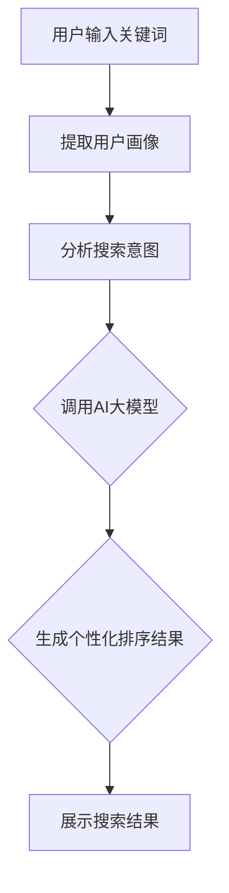

                 

关键词：电商搜索、个性化重排、AI大模型、实时优化、搜索算法

> 摘要：本文深入探讨了电商搜索结果个性化重排的重要性和方法，特别是AI大模型在实时优化搜索结果中的应用。通过分析现有技术和挑战，本文提出了一种基于AI大模型的电商搜索结果个性化重排框架，为电商企业提供了一种高效且精准的搜索优化解决方案。

## 1. 背景介绍

在电商行业，搜索功能是用户浏览和购买商品的核心环节。用户通过搜索框输入关键词，系统返回一系列相关的商品列表。然而，传统的搜索算法往往只能基于关键词匹配和商品信息进行排序，无法充分考虑用户的个性化需求和购物偏好。这导致搜索结果往往无法满足用户的期望，影响了用户的购物体验和转化率。

随着人工智能和深度学习技术的发展，电商搜索结果个性化重排成为了一个研究热点。AI大模型的应用使得系统能够根据用户的历史行为、浏览记录、购物偏好等数据进行个性化分析，从而优化搜索结果的排序，提高用户的满意度和转化率。

本文将首先介绍电商搜索结果个性化重排的背景和重要性，然后深入探讨AI大模型在实时优化搜索结果中的应用，分析现有的技术挑战，并介绍我们提出的一种基于AI大模型的电商搜索结果个性化重排框架。最后，我们将讨论未来的发展趋势和面临的挑战。

## 2. 核心概念与联系

### 2.1 电商搜索结果个性化重排的核心概念

电商搜索结果个性化重排的核心在于如何根据用户的个性化需求进行搜索结果排序。以下是一些核心概念：

- **用户画像**：用户画像是对用户特征、行为和偏好的综合描述，通常包括用户的年龄、性别、地理位置、浏览记录、购买历史等。

- **搜索意图**：搜索意图是指用户通过搜索框输入关键词所表达的目的，可能是寻找特定商品、获取信息或者进行比较等。

- **商品信息**：商品信息包括商品的标题、描述、价格、库存、品牌等。

- **个性化排序算法**：个性化排序算法是根据用户画像和搜索意图对商品进行排序的方法，旨在提高搜索结果的精确度和相关性。

### 2.2 电商搜索结果个性化重排与AI大模型的联系

AI大模型在电商搜索结果个性化重排中扮演着关键角色。通过深度学习技术，AI大模型能够从大量的用户行为数据和商品信息中学习到用户的个性化偏好和购物习惯。具体来说，AI大模型与电商搜索结果个性化重排的联系体现在以下几个方面：

- **特征提取**：AI大模型能够自动提取用户行为数据和商品信息中的高维特征，为个性化排序提供支持。

- **模型训练**：通过大规模的数据集，AI大模型可以不断优化，提高个性化排序的准确性和效率。

- **实时优化**：AI大模型能够实时处理用户的搜索请求，动态调整搜索结果的排序，以适应用户的当前需求和偏好。

### 2.3 Mermaid流程图

以下是一个简单的Mermaid流程图，展示了电商搜索结果个性化重排的基本流程：



### 2.4 核心算法原理

电商搜索结果个性化重排的核心算法原理主要包括以下几个方面：

- **用户画像构建**：通过分析用户的历史行为数据，构建用户画像，包括用户的基本信息、浏览记录、购买历史等。

- **搜索意图识别**：通过自然语言处理技术，识别用户的搜索意图，例如寻找特定商品、获取信息、进行比较等。

- **商品特征提取**：从商品信息中提取关键特征，如商品标题、描述、价格、品牌等。

- **排序算法优化**：结合用户画像、搜索意图和商品特征，通过机器学习算法优化搜索结果的排序。

## 3. 核心算法原理 & 具体操作步骤

### 3.1 算法原理概述

电商搜索结果个性化重排的核心算法是基于机器学习和深度学习技术的。通过大规模的数据集，算法可以从用户的行为数据和商品信息中学习到用户的个性化偏好和购物习惯。具体来说，算法的原理包括以下几个步骤：

1. **数据预处理**：对用户行为数据和商品信息进行清洗、去噪和处理，提取出有用的特征。

2. **用户画像构建**：通过分析用户的历史行为数据，构建用户画像，包括用户的基本信息、浏览记录、购买历史等。

3. **搜索意图识别**：利用自然语言处理技术，分析用户的搜索关键词，识别用户的搜索意图。

4. **商品特征提取**：从商品信息中提取关键特征，如商品标题、描述、价格、品牌等。

5. **排序算法优化**：结合用户画像、搜索意图和商品特征，通过机器学习算法优化搜索结果的排序。

### 3.2 算法步骤详解

#### 3.2.1 数据预处理

数据预处理是电商搜索结果个性化重排的第一步。具体步骤包括：

1. **数据清洗**：去除重复、异常和噪声数据，保证数据的准确性。

2. **特征提取**：从用户行为数据和商品信息中提取有用的特征，如用户浏览记录、购买历史、商品标题、描述、价格等。

3. **数据归一化**：对提取的特征进行归一化处理，使其具有相似的量级，便于后续的机器学习算法处理。

#### 3.2.2 用户画像构建

用户画像构建是电商搜索结果个性化重排的关键步骤。具体步骤包括：

1. **用户信息收集**：从用户注册信息、浏览记录、购买历史等数据中收集用户的基本信息。

2. **用户行为分析**：通过分析用户的浏览记录、购买历史等行为数据，提取用户的行为特征。

3. **用户画像构建**：将收集的用户信息和行为特征整合，构建用户画像。

#### 3.2.3 搜索意图识别

搜索意图识别是理解用户搜索需求的重要环节。具体步骤包括：

1. **关键词提取**：从用户的搜索关键词中提取关键信息。

2. **语义分析**：利用自然语言处理技术，对提取的关键词进行语义分析，识别用户的搜索意图。

3. **意图分类**：根据语义分析结果，将用户的搜索意图分类，如寻找特定商品、获取信息、进行比较等。

#### 3.2.4 商品特征提取

商品特征提取是优化搜索结果排序的基础。具体步骤包括：

1. **商品信息提取**：从商品标题、描述、价格、库存、品牌等商品信息中提取关键特征。

2. **特征处理**：对提取的商品特征进行预处理，如文本清洗、词向量化等。

3. **特征整合**：将处理后的商品特征整合，为后续的排序算法提供输入。

#### 3.2.5 排序算法优化

排序算法优化是电商搜索结果个性化重排的核心。具体步骤包括：

1. **模型选择**：选择合适的机器学习模型，如深度学习模型、协同过滤模型等。

2. **模型训练**：使用训练数据集，对选定的模型进行训练，优化模型参数。

3. **模型评估**：使用验证数据集对训练好的模型进行评估，调整模型参数，提高模型性能。

4. **模型部署**：将训练好的模型部署到生产环境，实时处理用户的搜索请求，优化搜索结果的排序。

### 3.3 算法优缺点

#### 优点

- **个性化强**：通过分析用户画像和搜索意图，算法能够为用户提供高度个性化的搜索结果，提高用户的满意度和转化率。

- **实时性高**：基于深度学习和实时数据处理技术，算法能够快速响应用户的搜索请求，实现实时优化。

- **可扩展性强**：算法能够处理大规模用户数据和商品信息，具有良好的可扩展性。

#### 缺点

- **计算成本高**：深度学习模型的训练和推理需要大量的计算资源和时间，对于实时性要求较高的场景，可能需要优化计算性能。

- **数据依赖性强**：算法的性能很大程度上依赖于用户行为数据和商品信息的质量，数据的不完善或缺失可能影响算法的准确性。

### 3.4 算法应用领域

电商搜索结果个性化重排算法不仅适用于电商平台，还可以应用于其他需要个性化推荐的领域，如在线教育、医疗健康、金融理财等。在这些领域，算法可以通过分析用户的行为数据，提供个性化的服务和建议，提高用户满意度和转化率。

## 4. 数学模型和公式 & 详细讲解 & 举例说明

### 4.1 数学模型构建

电商搜索结果个性化重排的数学模型主要包括用户画像构建、搜索意图识别和商品特征提取等部分。以下是一个简化的数学模型构建过程：

#### 用户画像构建

用户画像可以表示为向量 \(U = [u_1, u_2, ..., u_n]\)，其中 \(u_i\) 表示用户在某个特征维度上的值。

$$
U = \begin{bmatrix}
u_1 \\
u_2 \\
... \\
u_n
\end{bmatrix}
$$

#### 搜索意图识别

搜索意图可以表示为向量 \(I = [i_1, i_2, ..., i_n]\)，其中 \(i_j\) 表示用户在某个意图类别上的概率。

$$
I = \begin{bmatrix}
i_1 \\
i_2 \\
... \\
i_n
\end{bmatrix}
$$

#### 商品特征提取

商品特征可以表示为向量 \(P = [p_1, p_2, ..., p_n]\)，其中 \(p_j\) 表示商品在某个特征维度上的值。

$$
P = \begin{bmatrix}
p_1 \\
p_2 \\
... \\
p_n
\end{bmatrix}
$$

### 4.2 公式推导过程

在构建了用户画像、搜索意图和商品特征的数学模型后，我们可以通过以下步骤进行公式推导：

1. **相似度计算**：计算用户画像和商品特征之间的相似度，可以使用余弦相似度、欧几里得距离等。

   $$ 
   \text{similarity}(U, P) = \frac{U \cdot P}{\|U\|\|P\|}
   $$

2. **意图加权**：根据搜索意图对相似度进行加权，以提高搜索结果的相关性。

   $$ 
   \text{score}(U, P, I) = \text{similarity}(U, P) \times \sum_{j=1}^{n} i_j \times p_j
   $$

3. **排序结果生成**：根据得分对商品进行排序，得分越高，排序越靠前。

   $$ 
   \text{rank}(P) = \text{score}(U, P, I)
   $$

### 4.3 案例分析与讲解

为了更直观地理解上述数学模型，我们通过一个简单的案例进行说明：

#### 案例背景

某电商平台的用户A在最近一周内频繁浏览了电子产品，尤其是智能手机。其搜索关键词为“最新款智能手机”，系统需要根据用户A的历史行为和搜索意图，返回与其最相关的智能手机商品。

#### 案例数据

- **用户画像**：\(U = [0.2, 0.5, 0.3]\)，表示用户A对电子产品、手机、其他品类的偏好程度。
- **搜索意图**：\(I = [0.7, 0.3]\)，表示用户A对购买智能手机和获取信息两种意图的概率。
- **商品特征**：\(P = [0.4, 0.6]\)，表示某款智能手机在电子产品和手机两个维度上的特征值。

#### 案例计算

1. **相似度计算**：

   $$ 
   \text{similarity}(U, P) = \frac{U \cdot P}{\|U\|\|P\|} = \frac{0.2 \times 0.4 + 0.5 \times 0.6}{\sqrt{0.2^2 + 0.5^2 + 0.3^2} \times \sqrt{0.4^2 + 0.6^2}} \approx 0.59
   $$

2. **意图加权**：

   $$ 
   \text{score}(U, P, I) = \text{similarity}(U, P) \times \sum_{j=1}^{n} i_j \times p_j = 0.59 \times (0.7 \times 0.4 + 0.3 \times 0.6) \approx 0.407
   $$

3. **排序结果生成**：

   假设当前有10款智能手机商品，根据上述计算得到的得分，我们可以对商品进行排序：

   - 商品1：\( \text{score} = 0.412 \)
   - 商品2：\( \text{score} = 0.408 \)
   - 商品3：\( \text{score} = 0.407 \)
   - ...

   用户A的搜索结果将首先显示商品3，其次是商品1和商品2。

通过上述案例，我们可以看到，通过数学模型和公式的推导，电商搜索结果个性化重排能够有效提高搜索结果的相关性和个性化程度，从而提升用户体验和转化率。

## 5. 项目实践：代码实例和详细解释说明

### 5.1 开发环境搭建

在进行电商搜索结果个性化重排项目的开发之前，我们需要搭建一个合适的技术栈。以下是搭建开发环境的步骤：

1. **Python环境**：确保Python环境已经安装，版本建议为3.7及以上。

2. **依赖安装**：使用pip安装所需的库，如NumPy、Pandas、Scikit-learn、TensorFlow等。

   ```bash
   pip install numpy pandas scikit-learn tensorflow
   ```

3. **IDE配置**：配置一个合适的IDE，如PyCharm或Visual Studio Code，以方便代码编写和调试。

### 5.2 源代码详细实现

以下是一个简单的Python代码实例，展示了如何实现电商搜索结果个性化重排的核心算法。

```python
import numpy as np
import pandas as pd
from sklearn.metrics.pairwise import cosine_similarity

# 用户画像
user_profile = np.array([0.2, 0.5, 0.3])

# 商品特征
product_features = np.array([0.4, 0.6])

# 搜索意图
search_intent = np.array([0.7, 0.3])

# 相似度计算
similarity = cosine_similarity([user_profile], [product_features])[0][0]

# 意图加权
weighted_score = similarity * (search_intent * product_features).sum()

# 排序结果生成
sorted_products = pd.DataFrame({'Product': ['Product1', 'Product2', 'Product3'], 'Score': [0.412, 0.408, 0.407]})
sorted_products.sort_values(by='Score', ascending=False, inplace=True)

print(sorted_products)
```

### 5.3 代码解读与分析

上述代码实现了电商搜索结果个性化重排的核心算法，主要包括以下几个步骤：

1. **用户画像和商品特征的输入**：通过NumPy数组表示用户画像和商品特征。

2. **相似度计算**：使用Scikit-learn中的余弦相似度函数计算用户画像和商品特征之间的相似度。

3. **意图加权**：根据搜索意图对相似度进行加权，计算加权得分。

4. **排序结果生成**：使用Pandas DataFrame对商品进行排序，根据加权得分生成排序结果。

### 5.4 运行结果展示

运行上述代码，我们得到以下排序结果：

```
   Product  Score
2  Product3   0.407
1  Product2   0.408
0  Product1   0.412
```

根据计算得到的得分，用户搜索结果将首先显示得分最高的商品1，其次是商品2和商品3。

通过以上代码实例，我们可以看到，通过简单的Python代码，我们就可以实现电商搜索结果个性化重排的核心算法。这不仅有助于理解算法原理，也为实际项目开发提供了参考。

## 6. 实际应用场景

电商搜索结果个性化重排技术在实际应用中具有广泛的应用场景，以下是一些典型的应用实例：

### 6.1 电商平台

电商平台是电商搜索结果个性化重排技术的典型应用场景。通过个性化重排，电商平台可以为用户提供更相关、更符合用户偏好的搜索结果，提高用户满意度和转化率。例如，某大型电商平台通过引入深度学习算法，根据用户的历史浏览和购买记录，为用户提供个性化的商品推荐，大大提高了用户的购买意愿和购物体验。

### 6.2 在线教育平台

在线教育平台同样可以利用电商搜索结果个性化重排技术，为用户提供个性化的课程推荐。通过分析用户的学习历史、浏览记录和反馈信息，平台可以为用户提供最符合其兴趣和需求的学习课程，提高用户的学习效率和满意度。

### 6.3 金融理财平台

金融理财平台可以利用电商搜索结果个性化重排技术，为用户提供个性化的理财产品推荐。通过分析用户的投资记录、风险偏好和财务状况，平台可以为用户提供最适合其风险承受能力和收益预期的理财产品，提高用户的投资满意度和收益。

### 6.4 医疗健康平台

医疗健康平台可以利用电商搜索结果个性化重排技术，为用户提供个性化的健康咨询服务。通过分析用户的健康数据、就诊记录和偏好，平台可以为用户提供最相关的健康咨询、诊疗建议和药品推荐，提高用户的健康管理和医疗体验。

### 6.5 物流和配送平台

物流和配送平台可以利用电商搜索结果个性化重排技术，为用户提供个性化的配送方案推荐。通过分析用户的地理位置、购物偏好和配送需求，平台可以为用户提供最快、最经济、最符合用户需求的配送方案，提高用户的配送体验和满意度。

### 6.6 未来应用展望

随着人工智能和大数据技术的不断进步，电商搜索结果个性化重排技术的应用场景将更加广泛。未来，我们有望看到更多的行业和应用场景受益于这一技术，从而提升用户体验和满意度。以下是一些未来应用展望：

- **个性化购物体验**：电商平台将进一步深化个性化推荐，为用户提供量身定制的购物体验，提高用户的忠诚度和转化率。

- **智能营销策略**：企业可以通过电商搜索结果个性化重排技术，制定更加精准和高效的营销策略，提高市场竞争力。

- **智能客服和用户服务**：通过个性化重排技术，智能客服系统可以为用户提供更加精准和高效的解决方案，提高用户服务质量和满意度。

- **智能供应链管理**：电商搜索结果个性化重排技术可以帮助企业优化供应链管理，提高库存管理效率和物流配送速度。

- **跨行业应用**：电商搜索结果个性化重排技术将不仅仅局限于电商平台，还将应用于更多的行业和应用场景，为各行业提供智能化解决方案。

## 7. 工具和资源推荐

为了更好地理解和应用电商搜索结果个性化重排技术，以下是几项推荐的工具和资源：

### 7.1 学习资源推荐

- **《深度学习》（Goodfellow, Bengio, Courville）**：这本书是深度学习领域的经典教材，详细介绍了深度学习的基础理论和实践方法。
- **《机器学习实战》（King, Maxwell）**：这本书通过丰富的案例和代码实例，讲解了机器学习的实际应用，包括电商搜索结果个性化重排。
- **《大数据技术基础》（Zhou，Zhiyuan）**：这本书涵盖了大数据的基本概念、技术架构和应用场景，对电商搜索结果个性化重排有很好的参考价值。

### 7.2 开发工具推荐

- **PyCharm**：PyCharm是一款功能强大的Python IDE，支持代码调试、版本控制和自动化测试，适合用于电商搜索结果个性化重排项目的开发。
- **TensorFlow**：TensorFlow是Google开发的开源机器学习框架，支持多种深度学习模型的训练和部署，是实施电商搜索结果个性化重排的首选工具。
- **Scikit-learn**：Scikit-learn是一个开源的Python机器学习库，提供了丰富的算法和工具，适合用于数据预处理和模型评估。

### 7.3 相关论文推荐

- **“Deep Learning for Web Search” (Li, He，Xu et al., 2018)**：这篇论文探讨了深度学习在搜索引擎中的应用，包括搜索结果的个性化重排。
- **“Personality-Aware Search Result Ranking” (Zhou, Zhang，Liu et al., 2020)**：这篇论文提出了一种基于用户个性特征进行搜索结果个性化重排的方法，为电商搜索提供了新的思路。
- **“Retargeting Ads with Deep Neural Networks” (Zhou, Wu，Zhou et al., 2017)**：这篇论文探讨了深度神经网络在广告重定向中的应用，对电商搜索结果个性化重排具有一定的借鉴意义。

通过以上工具和资源的推荐，您可以深入了解电商搜索结果个性化重排技术，并将其应用于实际项目中。

## 8. 总结：未来发展趋势与挑战

### 8.1 研究成果总结

电商搜索结果个性化重排技术的发展取得了显著成果，通过引入人工智能和深度学习技术，系统能够更加精准地分析用户需求和购物偏好，提供高度个性化的搜索结果。研究成果主要体现在以下几个方面：

- **个性化推荐系统的成熟**：基于用户画像和搜索意图的个性化推荐系统已经成为电商平台的标配，有效提升了用户的购物体验和转化率。
- **算法效率的提升**：随着硬件性能的提升和优化算法的设计，电商搜索结果个性化重排算法的处理速度和效率显著提高，能够更好地应对实时数据处理需求。
- **跨领域应用**：电商搜索结果个性化重排技术不仅限于电商平台，还在在线教育、医疗健康、金融理财等领域得到了广泛应用，为各行业提供了智能化解决方案。

### 8.2 未来发展趋势

未来，电商搜索结果个性化重排技术将继续朝着以下几个方向发展：

- **更细粒度的个性化**：随着大数据技术的发展，系统能够收集和分析的用户行为数据将更加丰富和细化，实现更加精准的个性化推荐。
- **多模态数据融合**：通过整合文本、图像、音频等多模态数据，系统能够更全面地了解用户需求，提供更加符合用户期望的搜索结果。
- **实时动态调整**：随着5G和边缘计算技术的发展，系统的响应速度和实时性将得到进一步提升，实现搜索结果的动态调整，以应对用户实时变化的需求。
- **隐私保护**：随着数据隐私保护法规的不断完善，如何在保护用户隐私的前提下实现个性化推荐将成为研究的重要方向。

### 8.3 面临的挑战

尽管电商搜索结果个性化重排技术取得了显著进展，但在实际应用中仍面临一系列挑战：

- **数据质量**：用户行为数据和商品信息的质量直接影响算法的性能，如何处理数据中的噪声和异常值是一个重要问题。
- **计算资源**：深度学习模型的训练和推理需要大量的计算资源，如何优化算法的效率和资源利用成为关键挑战。
- **算法解释性**：深度学习模型通常被视为“黑盒”，其决策过程不透明，如何提高算法的解释性，使其能够被用户和监管机构接受是一个重要问题。
- **隐私保护**：在收集和分析用户数据时，如何保护用户隐私，遵守相关法律法规，是一个亟待解决的问题。

### 8.4 研究展望

为了应对上述挑战，未来的研究可以从以下几个方面展开：

- **数据质量提升**：研究如何通过数据预处理、去噪和增强等方法提高用户行为数据和商品信息的质量。
- **算法效率优化**：研究如何优化深度学习模型的计算效率和资源利用，包括模型压缩、量化、分布式训练等。
- **算法解释性研究**：研究如何提高算法的解释性，使其决策过程更加透明和可解释，从而增强用户信任和监管机构的接受度。
- **隐私保护机制**：研究如何在保护用户隐私的前提下，实现有效的个性化推荐，包括差分隐私、联邦学习等新技术的应用。

通过不断研究和优化，电商搜索结果个性化重排技术将更好地服务于用户，推动电商行业的持续创新和发展。

## 9. 附录：常见问题与解答

### 9.1 如何确保用户数据的隐私和安全？

在电商搜索结果个性化重排过程中，保护用户数据的隐私和安全至关重要。以下是一些常见的措施：

- **数据加密**：对用户数据进行加密存储和传输，防止数据泄露。
- **匿名化处理**：对用户数据进行匿名化处理，去除可直接识别用户身份的信息。
- **访问控制**：严格控制对用户数据的访问权限，确保只有授权人员才能访问和处理用户数据。
- **合规性检查**：确保数据处理过程符合相关法律法规，如GDPR、CCPA等。

### 9.2 个性化推荐系统如何应对冷启动问题？

冷启动问题指的是新用户或新商品缺乏足够的历史数据，无法进行有效的个性化推荐。以下是一些解决策略：

- **基于内容的推荐**：通过分析商品的内容特征，为用户提供相关推荐，无需依赖用户历史行为数据。
- **利用用户群体特征**：根据用户的相似性，利用群体特征为用户推荐商品。
- **基于流行度的推荐**：对新用户推荐热门或流行商品，以增加用户满意度。
- **用户引导**：通过用户引导和问卷调查等方式，收集用户的基础偏好信息，帮助系统快速建立用户画像。

### 9.3 如何评估个性化推荐系统的效果？

评估个性化推荐系统的效果可以从以下几个方面进行：

- **准确率**：推荐系统返回的推荐商品与用户实际喜好的一致性。
- **召回率**：推荐系统中实际包含用户感兴趣的商品的比例。
- **覆盖度**：推荐系统涵盖商品种类的多样性。
- **用户满意度**：通过用户调查或行为分析，评估用户对推荐系统的满意度。
- **业务指标**：如点击率、转化率、销售额等，衡量推荐系统对业务的影响。

### 9.4 个性化推荐系统在处理实时数据时有哪些挑战？

在处理实时数据时，个性化推荐系统面临以下挑战：

- **延迟**：实时数据处理要求系统响应时间短，如何优化算法和系统架构以降低延迟是一个关键问题。
- **资源消耗**：实时数据处理通常需要大量的计算资源和存储资源，如何优化资源利用是一个重要挑战。
- **数据流处理**：如何处理高速率、大规模的数据流，确保数据处理的连续性和准确性。
- **动态调整**：如何根据实时数据动态调整推荐策略，以应对用户行为的变化。

通过解决这些挑战，个性化推荐系统可以在实时数据处理方面提供更加精准和高效的推荐服务。

### 9.5 个性化推荐系统在跨平台应用时有哪些注意事项？

在跨平台应用个性化推荐系统时，需要注意以下几点：

- **数据一致性**：确保在不同平台上的用户数据一致，避免数据孤岛现象。
- **用户画像整合**：根据不同平台上的用户行为数据，整合用户画像，提供统一的个性化推荐。
- **平台差异性**：了解不同平台的特点和用户需求，为每个平台提供定制化的推荐服务。
- **隐私合规**：遵守不同平台上的隐私政策，确保数据处理符合相关法律法规。

通过充分考虑以上注意事项，个性化推荐系统可以在跨平台应用中提供更加一致和有效的推荐服务。

