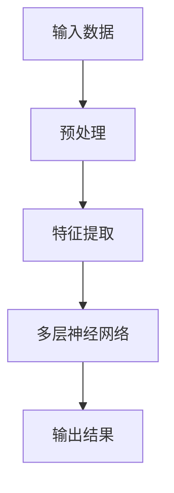
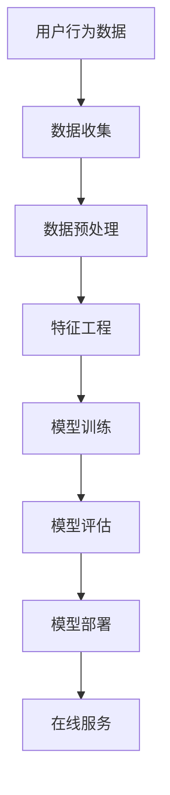

                 

随着人工智能技术的不断进步，尤其是大模型（Large Models）的出现，电商行业正迎来一场深刻的变革。本文将探讨AI大模型在电商行业中的应用，分析其带来的机遇与挑战，以及未来发展的趋势。

## 文章关键词
- AI大模型
- 电商行业
- 机遇与挑战
- 应用场景
- 发展趋势

## 摘要
本文首先介绍了AI大模型的基本概念和在电商行业的应用背景，接着深入探讨了AI大模型在电商领域的核心应用，包括个性化推荐、图像识别和自然语言处理等方面。随后，文章分析了AI大模型带来的机遇与挑战，并展望了未来的发展方向。

## 1. 背景介绍

### 1.1 AI大模型的发展

AI大模型是指通过深度学习技术训练出的，拥有海量参数的复杂神经网络。这些模型通常包含数亿甚至数万亿个参数，能够处理大量的数据，并在各种任务中表现出色。近年来，得益于计算能力的提升、海量数据的积累和优化算法的涌现，AI大模型取得了显著的进展。

### 1.2 电商行业的发展

电商行业作为数字经济的重要组成部分，近年来呈现出蓬勃发展的态势。随着消费者需求的不断变化和线上购物的普及，电商企业需要不断优化用户体验，提高运营效率，以保持竞争力。AI大模型的出现为电商行业提供了新的工具和解决方案。

## 2. 核心概念与联系

### 2.1 大模型原理

大模型主要依赖于深度学习技术，其核心是多层神经网络。通过多层次的神经网络结构，大模型可以自动提取数据中的特征，并实现复杂的任务。以下是一个简单的Mermaid流程图，展示了大模型的基本原理：



### 2.2 电商行业应用架构

在电商行业中，AI大模型的应用架构通常包括数据收集、数据预处理、模型训练和模型部署等环节。以下是一个简化的Mermaid流程图，展示了电商行业应用AI大模型的架构：



## 3. 核心算法原理 & 具体操作步骤

### 3.1 算法原理概述

AI大模型的核心算法是基于深度学习的神经网络模型。神经网络由大量的神经元（节点）和连接（边）组成，通过学习输入数据，模型能够自动提取特征并实现预测或分类任务。

### 3.2 算法步骤详解

#### 3.2.1 数据收集

首先，需要收集与电商业务相关的数据，包括用户行为数据、商品数据、交易数据等。

#### 3.2.2 数据预处理

对收集到的数据进行分析和清洗，去除异常值、缺失值，并进行归一化处理。

#### 3.2.3 特征工程

根据业务需求，提取有用的特征，例如用户浏览记录、购买历史、商品属性等。

#### 3.2.4 模型训练

使用训练集数据，通过优化算法（如梯度下降）对神经网络模型进行训练，调整模型参数，使其能够对未知数据进行准确的预测。

#### 3.2.5 模型评估

使用验证集数据对训练好的模型进行评估，检查模型的泛化能力。

#### 3.2.6 模型部署

将训练好的模型部署到线上环境，提供实时服务。

### 3.3 算法优缺点

#### 优点：

- **强大的数据处理能力**：大模型能够处理海量数据，提取出复杂的信息。
- **高效的预测性能**：通过深度学习，大模型能够实现高效、准确的预测。
- **自适应性强**：大模型能够根据业务需求进行调整和优化。

#### 缺点：

- **计算资源消耗大**：大模型的训练和部署需要大量的计算资源。
- **数据隐私问题**：在处理用户数据时，存在数据隐私和安全问题。
- **可解释性差**：大模型的预测结果往往缺乏可解释性，难以理解其决策过程。

### 3.4 算法应用领域

AI大模型在电商行业中的应用非常广泛，包括但不限于以下几个方面：

- **个性化推荐**：通过分析用户历史行为和偏好，为用户提供个性化的商品推荐。
- **图像识别**：识别和分类商品图片，提高商品管理的效率。
- **自然语言处理**：处理用户评论和搜索请求，实现智能客服和智能搜索。

## 4. 数学模型和公式 & 详细讲解 & 举例说明

### 4.1 数学模型构建

AI大模型的核心是多层感知机（MLP），其数学模型可以表示为：

$$
\text{Output} = \sigma(\text{Weight} \cdot \text{Input} + \text{Bias})
$$

其中，$\sigma$ 是激活函数，常用的有 Sigmoid、ReLU 等；Weight 和 Bias 分别是模型的权重和偏置。

### 4.2 公式推导过程

多层感知机的推导过程基于链式法则，以下是一个简化的推导：

$$
\begin{aligned}
\frac{dL}{dW} &= \frac{dL}{da} \cdot \frac{da}{dz} \cdot \frac{dz}{dW} \\
\frac{dL}{dB} &= \frac{dL}{da} \cdot \frac{da}{dz} \cdot \frac{dz}{dB}
\end{aligned}
$$

其中，$L$ 是损失函数，$a$ 是激活值，$z$ 是中间层的输出。

### 4.3 案例分析与讲解

假设我们使用一个简单的多层感知机对商品进行分类，输入特征为商品的价格和评价数，输出为是否购买的二分类结果。我们可以构建如下的数学模型：

$$
\text{Output} = \sigma(W_1 \cdot \text{Input} + B_1)
$$

其中，$\text{Input} = [\text{Price}, \text{Rating}]$，$W_1$ 和 $B_1$ 分别是权重和偏置。

通过训练数据，我们可以得到最优的 $W_1$ 和 $B_1$，从而实现商品分类。

## 5. 项目实践：代码实例和详细解释说明

### 5.1 开发环境搭建

在本次项目中，我们将使用 Python 编写代码，依赖的主要库包括 TensorFlow、Keras 和 Pandas。

### 5.2 源代码详细实现

以下是商品分类的完整代码实现：

```python
import tensorflow as tf
from tensorflow.keras.layers import Dense, Input
from tensorflow.keras.models import Model
from tensorflow.keras.optimizers import Adam
from sklearn.model_selection import train_test_split
import pandas as pd

# 读取数据
data = pd.read_csv('data.csv')
X = data[['Price', 'Rating']]
y = data['Purchased']

# 数据预处理
X_train, X_test, y_train, y_test = train_test_split(X, y, test_size=0.2, random_state=42)

# 构建模型
input_ = Input(shape=(2,))
dense_1 = Dense(10, activation='relu')(input_)
output = Dense(1, activation='sigmoid')(dense_1)

model = Model(inputs=input_, outputs=output)

# 编译模型
model.compile(optimizer=Adam(learning_rate=0.001), loss='binary_crossentropy', metrics=['accuracy'])

# 训练模型
model.fit(X_train, y_train, batch_size=32, epochs=10, validation_data=(X_test, y_test))

# 评估模型
loss, accuracy = model.evaluate(X_test, y_test)
print(f'Accuracy: {accuracy * 100:.2f}%')
```

### 5.3 代码解读与分析

这段代码首先读取数据，然后进行数据预处理。接下来，使用 Keras 框架构建了一个简单的多层感知机模型，并编译模型。最后，使用训练数据对模型进行训练，并在测试数据上评估模型的性能。

## 6. 实际应用场景

### 6.1 个性化推荐

通过分析用户的历史行为和偏好，AI大模型可以为用户提供个性化的商品推荐。例如，根据用户的浏览记录和购买历史，为用户推荐可能感兴趣的商品。

### 6.2 图像识别

在电商平台上，AI大模型可以用于图像识别，帮助用户快速找到所需的商品。例如，用户可以上传一张商品图片，AI大模型可以识别并展示与该图片相似的商品。

### 6.3 自然语言处理

AI大模型可以处理用户的评论和搜索请求，实现智能客服和智能搜索。例如，通过分析用户评论，AI大模型可以识别用户对商品的评价，并根据这些评价提供改进建议。

## 7. 工具和资源推荐

### 7.1 学习资源推荐

- 《深度学习》（Goodfellow, Bengio, Courville）：这是一本经典的深度学习教材，涵盖了深度学习的各个方面。
- 《Python深度学习》（François Chollet）：这本书详细介绍了使用 Python 和 TensorFlow 实现深度学习的各种技术。

### 7.2 开发工具推荐

- TensorFlow：这是一个强大的开源深度学习框架，适合用于构建和训练AI大模型。
- Jupyter Notebook：这是一个交互式的计算环境，非常适合进行深度学习和数据科学实验。

### 7.3 相关论文推荐

- "Distributed Representations of Words and Phrases and their Compositionality"（Word2Vec）: 这篇论文介绍了词嵌入技术，为自然语言处理提供了新的方法。
- "Understanding Deep Learning Requires Rethinking Generalization"（Deep Learning 的泛化性）：这篇论文探讨了深度学习的泛化性问题，为深度学习的发展提供了新的视角。

## 8. 总结：未来发展趋势与挑战

### 8.1 研究成果总结

近年来，AI大模型在电商行业取得了显著的成果，为个性化推荐、图像识别和自然语言处理等领域带来了新的机遇。通过深度学习技术，AI大模型能够处理大量数据，实现高效、准确的预测。

### 8.2 未来发展趋势

未来，AI大模型在电商行业的应用将更加广泛和深入。随着计算能力的提升和数据的积累，AI大模型将不断优化，实现更加精准的预测和更好的用户体验。

### 8.3 面临的挑战

尽管AI大模型在电商行业具有巨大的潜力，但同时也面临一些挑战，包括数据隐私、计算资源消耗和模型可解释性等。如何平衡这些挑战，实现AI大模型的安全、高效应用，是未来研究的重要方向。

### 8.4 研究展望

未来，AI大模型的研究将更加注重跨学科的合作，结合计算机科学、数据科学和心理学等领域的知识，探索AI大模型在电商行业的更广泛应用。同时，研究将更加关注AI大模型的可解释性和可解释性，提高模型的透明度和可信度。

## 9. 附录：常见问题与解答

### 9.1 什么是AI大模型？

AI大模型是指通过深度学习技术训练出的，拥有海量参数的复杂神经网络。这些模型通常包含数亿甚至数万亿个参数，能够处理大量的数据，并在各种任务中表现出色。

### 9.2 AI大模型在电商行业有哪些应用？

AI大模型在电商行业的主要应用包括个性化推荐、图像识别和自然语言处理等方面，能够为用户提供更加精准、高效的购物体验。

### 9.3 如何平衡AI大模型带来的挑战？

可以通过以下方式平衡AI大模型带来的挑战：

- **数据隐私保护**：采用数据加密、去识别化等技术，确保用户数据的安全。
- **优化计算资源**：使用分布式计算、硬件加速等技术，提高计算效率。
- **提高模型可解释性**：通过可视化、解释性算法等手段，提高模型的透明度和可信度。

作者：禅与计算机程序设计艺术 / Zen and the Art of Computer Programming

----------------------------------------------------------------

以上是文章的完整内容，希望对您有所帮助。如果您有任何问题或建议，请随时告诉我。

