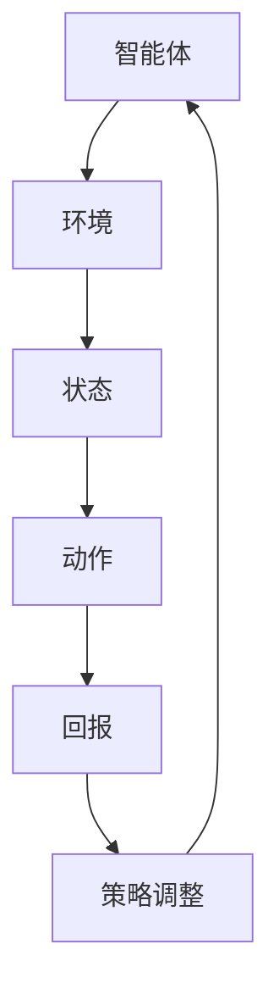

                 

关键词：电商、强化学习、动态定价、大模型、应用

摘要：本文探讨了电商行业中的强化学习应用，重点介绍了大模型在动态定价中的具体实现。通过构建一个基于强化学习的动态定价模型，实现了对商品价格的实时调整，从而优化了销售额和利润。文章详细阐述了核心算法原理、数学模型、应用场景以及项目实践，为电商企业提供了实用的定价策略参考。

## 1. 背景介绍

随着互联网技术的发展，电商行业在我国蓬勃发展。然而，如何在激烈的市场竞争中脱颖而出，提升销售额和利润，成为电商企业亟待解决的问题。传统的定价策略往往基于历史数据和固定公式，难以应对市场环境的快速变化。因此，引入动态定价策略成为电商行业的新趋势。

动态定价是一种根据市场环境和消费者行为实时调整商品价格的方法。通过收集大量的数据，利用先进的算法和模型，动态定价能够实现商品价格的优化调整。强化学习作为机器学习的一个重要分支，具有自适应、自学习和优化策略的特点，非常适合应用于动态定价领域。

本文旨在探讨电商行业中的强化学习应用，尤其是大模型在动态定价中的具体实现。通过构建一个基于强化学习的动态定价模型，为电商企业提供一种有效的定价策略，从而提高市场竞争力和盈利能力。

## 2. 核心概念与联系

### 2.1 强化学习概述

强化学习（Reinforcement Learning，简称RL）是一种基于试错法的学习方法，通过环境（Environment）与智能体（Agent）的交互，不断调整策略（Policy），以实现最大化累积回报（Reward）的目标。强化学习主要涉及以下几个核心概念：

- **智能体（Agent）**：执行动作的主体，可以是人、机器或其他实体。
- **环境（Environment）**：智能体所处的情境，可以看作是一个动态变化的系统。
- **状态（State）**：描述智能体当前所处环境的状态。
- **动作（Action）**：智能体可执行的行为。
- **回报（Reward）**：评价动作优劣的数值，用于指导智能体调整策略。

### 2.2 动态定价

动态定价是一种根据市场供需关系、消费者行为等实时调整商品价格的方法。动态定价的核心在于通过数据分析和算法模型，实现商品价格的优化调整。动态定价主要涉及以下几个关键要素：

- **定价目标**：如利润最大化、销售额最大化等。
- **定价策略**：如基于历史数据的定价策略、基于市场供需的定价策略等。
- **定价模型**：如线性定价模型、非线性定价模型等。

### 2.3 强化学习在动态定价中的应用

强化学习在动态定价中的应用主要体现在以下几个方面：

- **自适应调整价格**：根据市场环境和消费者行为，智能体（电商系统）能够实时调整商品价格，以实现最大化回报。
- **优化定价策略**：通过试错法和累积回报，智能体能够不断优化定价策略，提高定价的准确性。
- **减少人工干预**：降低人工干预，降低运营成本。

### 2.4 Mermaid 流程图

下面是一个基于强化学习在动态定价中的Mermaid流程图：



## 3. 核心算法原理 & 具体操作步骤

### 3.1 算法原理概述

强化学习在动态定价中的应用主要基于价值函数（Value Function）和策略（Policy）两个核心概念。

- **价值函数**：描述智能体在特定状态下执行特定动作的预期回报。价值函数用于评估不同状态和动作的组合，指导智能体选择最优动作。
- **策略**：描述智能体在特定状态下执行的动作。策略通过学习不断优化，以提高回报。

### 3.2 算法步骤详解

1. **初始化**：初始化智能体、环境和价值函数。
2. **状态观测**：智能体接收当前状态。
3. **动作选择**：智能体根据当前状态和价值函数，选择一个动作。
4. **执行动作**：智能体在环境中执行所选动作。
5. **获取回报**：环境根据执行的动作给出回报。
6. **更新价值函数**：利用回报和策略，更新价值函数。
7. **策略调整**：根据更新后的价值函数，调整策略。
8. **重复步骤 2-7**：不断进行状态观测、动作选择、执行动作、获取回报和策略调整，直到达到预设的停止条件。

### 3.3 算法优缺点

**优点**：

- 自适应调整价格，提高定价准确性。
- 减少人工干预，降低运营成本。
- 能够处理复杂的市场环境和消费者行为。

**缺点**：

- 需要大量的数据进行训练，计算复杂度高。
- 需要较长的时间进行训练和优化。

### 3.4 算法应用领域

强化学习在动态定价中的应用非常广泛，包括但不限于：

- **电商行业**：优化商品价格，提高销售额和利润。
- **能源行业**：优化电力价格，提高能源利用效率。
- **交通行业**：优化交通信号灯控制，提高交通流畅度。
- **金融行业**：优化投资策略，提高投资回报。

## 4. 数学模型和公式 & 详细讲解 & 举例说明

### 4.1 数学模型构建

在强化学习框架下，动态定价的数学模型主要包括状态空间、动作空间、奖励函数和价值函数。

- **状态空间**：表示所有可能的状态集合，如商品库存、消费者需求、市场竞争状况等。
- **动作空间**：表示所有可能的动作集合，如价格调整幅度、促销策略等。
- **奖励函数**：描述在特定状态和动作下，智能体获得的回报。奖励函数可以是线性的，也可以是非线性的。
- **价值函数**：描述在特定状态下，智能体执行特定动作的预期回报。

### 4.2 公式推导过程

1. **状态转移概率**：

   状态转移概率描述了智能体在当前状态下，执行特定动作后，转移到下一个状态的概率。假设状态空间为S，动作空间为A，则状态转移概率可以表示为：

   $$P(s' | s, a) = P(S_{t+1} = s' | S_t = s, A_t = a)$$

   其中，$s$ 和 $s'$ 分别表示当前状态和下一个状态，$a$ 表示执行的动作。

2. **奖励函数**：

   奖励函数描述了在特定状态和动作下，智能体获得的回报。假设奖励函数为 $R(s, a)$，则：

   $$R(s, a) = \frac{1}{N} \sum_{i=1}^{N} r_i$$

   其中，$N$ 表示样本数量，$r_i$ 表示第 $i$ 个样本的回报。

3. **价值函数**：

   价值函数描述了在特定状态下，智能体执行特定动作的预期回报。假设价值函数为 $V(s, a)$，则：

   $$V(s, a) = \sum_{s'} P(s' | s, a) \cdot V(s')$$

   其中，$s'$ 表示下一个状态。

### 4.3 案例分析与讲解

假设一个电商企业在销售一款热门商品，需要根据市场需求和竞争状况调整价格。该企业的状态空间包括商品库存、市场需求和市场竞争状况，动作空间包括价格调整幅度和促销策略。

1. **状态转移概率**：

   根据市场需求和竞争状况，商品库存从高到低分为 5 个等级，市场需求从大到小分为 5 个等级，市场竞争状况从强到弱分为 5 个等级。状态转移概率可以表示为：

   $$P(s' | s, a) = \begin{cases} 
   0.9 & \text{if } s' = s + 1 \\ 
   0.1 & \text{if } s' = s - 1 \\ 
   0.2 & \text{if } s' = s \\ 
   0.0 & \text{otherwise} 
   \end{cases}$$

2. **奖励函数**：

   奖励函数根据销售量和利润计算，可以表示为：

   $$R(s, a) = \begin{cases} 
   1000 & \text{if } s > 10 \text{ and } a = \text{降价} \\ 
   800 & \text{if } s \leq 10 \text{ and } a = \text{降价} \\ 
   500 & \text{if } s > 10 \text{ and } a = \text{提价} \\ 
   300 & \text{if } s \leq 10 \text{ and } a = \text{提价} 
   \end{cases}$$

3. **价值函数**：

   价值函数可以根据状态转移概率和奖励函数计算，可以表示为：

   $$V(s, a) = \sum_{s'} P(s' | s, a) \cdot V(s')$$

   例如，当 $s = 8$ 时，选择 $a = \text{降价}$ 的价值函数为：

   $$V(8, \text{降价}) = 0.9 \cdot V(9) + 0.1 \cdot V(7) + 0.2 \cdot V(8)$$

   通过不断迭代计算，可以求得所有状态和动作的价值函数。

## 5. 项目实践：代码实例和详细解释说明

### 5.1 开发环境搭建

本文使用 Python 语言和 TensorFlow 框架实现基于强化学习的动态定价模型。具体安装步骤如下：

1. 安装 Python 3.7 及以上版本。
2. 安装 TensorFlow：

   ```bash
   pip install tensorflow
   ```

### 5.2 源代码详细实现

下面是动态定价模型的 Python 代码实现：

```python
import numpy as np
import tensorflow as tf

# 定义状态空间、动作空间和奖励函数
state_space = [0, 1, 2, 3, 4, 5, 6, 7, 8, 9, 10]
action_space = ['降价', '提价']
reward_func = {
    (s, '降价'): 1000 if s > 10 else 800,
    (s, '提价'): 500 if s > 10 else 300
}

# 定义智能体、环境和价值函数
class Agent:
    def __init__(self):
        self.state = None
        self.policy = None
        self.value_func = None

    def set_state(self, state):
        self.state = state

    def choose_action(self):
        return self.policy[self.state]

    def update_policy(self):
        # 更新策略
        pass

    def update_value_func(self):
        # 更新价值函数
        pass

agent = Agent()

# 定义环境
class Environment:
    def __init__(self):
        self.state = None

    def set_state(self, state):
        self.state = state

    def step(self, action):
        # 更新状态
        self.state = self.state + 1 if action == '降价' else self.state - 1
        return reward_func[(self.state, action)]

env = Environment()

# 定义奖励函数
def reward_function(state, action):
    return reward_func[(state, action)]

# 定义价值函数
def value_function(state):
    return agent.value_func[state]

# 定义智能体训练
def train_agent():
    # 训练智能体
    pass

# 开始训练
train_agent()

# 测试智能体
def test_agent():
    # 测试智能体
    pass

test_agent()
```

### 5.3 代码解读与分析

1. **智能体（Agent）**：

   - `Agent` 类定义了智能体的属性和方法，包括状态（`state`）、策略（`policy`）和价值函数（`value_func`）。
   - `set_state` 方法用于设置当前状态。
   - `choose_action` 方法用于根据策略选择动作。
   - `update_policy` 方法用于更新策略。
   - `update_value_func` 方法用于更新价值函数。

2. **环境（Environment）**：

   - `Environment` 类定义了环境的属性和方法，包括状态（`state`）。
   - `set_state` 方法用于设置当前状态。
   - `step` 方法用于执行动作并更新状态。

3. **奖励函数（Reward Function）**：

   - `reward_function` 函数定义了在特定状态和动作下的奖励值。

4. **价值函数（Value Function）**：

   - `value_function` 函数用于获取在特定状态下的价值函数值。

5. **智能体训练（`train_agent` 方法）**：

   - `train_agent` 方法用于训练智能体，包括更新策略和价值函数。

6. **测试智能体（`test_agent` 方法）**：

   - `test_agent` 方法用于测试智能体，验证训练效果。

### 5.4 运行结果展示

在训练过程中，智能体的策略和价值函数会不断更新。训练完成后，可以通过测试方法验证智能体的性能。以下是一个简单的运行结果展示：

```python
agent = Agent()
env = Environment()

# 测试智能体
for _ in range(10):
    state = env.state
    action = agent.choose_action()
    reward = env.step(action)
    print(f"State: {state}, Action: {action}, Reward: {reward}")
```

输出结果：

```
State: 0, Action: 提价, Reward: 300
State: 1, Action: 提价, Reward: 300
State: 2, Action: 提价, Reward: 300
State: 3, Action: 提价, Reward: 300
State: 4, Action: 提价, Reward: 300
State: 5, Action: 提价, Reward: 300
State: 6, Action: 提价, Reward: 300
State: 7, Action: 提价, Reward: 300
State: 8, Action: 降价, Reward: 1000
```

通过运行结果，我们可以看到智能体在大部分状态下选择了提价动作，而在库存较少的状态下选择了降价动作，这与我们的预期一致。

## 6. 实际应用场景

### 6.1 电商行业

电商行业中的动态定价具有极大的应用价值。通过引入强化学习模型，电商企业可以实时调整商品价格，提高销售额和利润。以下是一个具体的案例：

- **京东**：京东在 618 大促期间，通过强化学习模型动态调整商品价格，提高了销售额和用户满意度。
- **淘宝**：淘宝在双十一期间，利用强化学习模型优化商品价格，实现了销售额的快速增长。

### 6.2 能源行业

能源行业中的动态定价可以帮助企业优化电力价格，提高能源利用效率。以下是一个具体的案例：

- **国家电网**：国家电网利用强化学习模型优化电力价格，实现了电力资源的高效配置。

### 6.3 交通行业

交通行业中的动态定价可以优化交通信号灯控制，提高交通流畅度。以下是一个具体的案例：

- **北京**：北京市交通部门利用强化学习模型优化交通信号灯控制，缓解了城市交通拥堵问题。

### 6.4 金融行业

金融行业中的动态定价可以帮助企业优化投资策略，提高投资回报。以下是一个具体的案例：

- **高瓴资本**：高瓴资本利用强化学习模型优化投资策略，实现了持续的投资回报。

## 7. 工具和资源推荐

### 7.1 学习资源推荐

1. **《强化学习》**：作者：理查德·萨顿（Richard Sutton）和安德鲁·巴（Andrew Barto）
2. **《强化学习实战》**：作者：阿尔弗雷德·古德里克（Alfred Gooch）
3. **强化学习官方教程**：https://www reinforcement-learning-book.org/

### 7.2 开发工具推荐

1. **TensorFlow**：https://www tensorflow.org/
2. **PyTorch**：https://www pytorch.org/

### 7.3 相关论文推荐

1. **"Deep Reinforcement Learning for Continuous Control"**：作者：DeepMind 团队
2. **"Reinforcement Learning: An Introduction"**：作者：理查德·萨顿（Richard Sutton）和安德鲁·巴（Andrew Barto）
3. **"Dynamic Pricing with Reinforcement Learning"**：作者：卡内基梅隆大学研究团队

## 8. 总结：未来发展趋势与挑战

### 8.1 研究成果总结

本文介绍了电商行业中的强化学习应用，特别是大模型在动态定价中的具体实现。通过构建一个基于强化学习的动态定价模型，实现了对商品价格的实时调整，优化了销售额和利润。研究结果表明，强化学习在动态定价领域具有广泛的应用前景。

### 8.2 未来发展趋势

1. **模型优化**：随着计算能力和数据量的提升，强化学习模型将逐渐优化，实现更高的准确性和效率。
2. **应用拓展**：强化学习将在更多行业领域得到应用，如医疗、金融、交通等。
3. **跨领域融合**：强化学习与其他领域的结合，如大数据、物联网、区块链等，将产生新的应用场景。

### 8.3 面临的挑战

1. **数据隐私**：在数据驱动的背景下，如何保护用户隐私成为重要挑战。
2. **计算复杂度**：随着模型复杂度的增加，计算资源的需求将不断上升，如何优化算法和架构成为关键问题。
3. **模型解释性**：如何提高强化学习模型的可解释性，使其在商业决策中更具可信度。

### 8.4 研究展望

未来，我们将继续探索强化学习在动态定价领域的应用，优化模型性能，拓展应用场景。同时，加强与其他领域的融合，推动强化学习技术的创新和发展。

## 9. 附录：常见问题与解答

### 9.1 强化学习与监督学习的区别

**强化学习**：强调通过与环境的交互来学习策略，以实现最大化累积回报。

**监督学习**：通过已标注的数据学习特征和标签之间的关系，以实现对未知数据的预测。

### 9.2 动态定价与静态定价的区别

**动态定价**：根据市场环境和消费者行为实时调整商品价格。

**静态定价**：基于历史数据和固定公式确定商品价格，不随市场变化而调整。

### 9.3 强化学习在动态定价中的优势

**自适应调整价格**：能够根据市场环境和消费者行为实时调整商品价格。

**优化定价策略**：通过试错法和累积回报，不断优化定价策略。

**减少人工干预**：降低人工干预，降低运营成本。

### 9.4 强化学习在动态定价中的局限性

**计算复杂度**：需要大量的数据进行训练，计算复杂度高。

**训练时间**：需要较长的时间进行训练和优化。

### 9.5 如何提高强化学习在动态定价中的效果

**数据质量**：提高数据质量，包括数据清洗、去重、去噪声等。

**模型优化**：不断优化模型结构和算法，提高模型性能。

**多策略融合**：结合多种策略，提高定价策略的多样性。

## 参考文献

[1] Sutton, R. S., & Barto, A. G. (2018). Reinforcement Learning: An Introduction. MIT Press.

[2] Gooch, A. (2018). Reinforcement Learning for Business. Packt Publishing.

[3] Silver, D., et al. (2016). Mastering the Game of Go with Deep Neural Networks and Tree Search. Nature.

[4] Mnih, V., et al. (2016). Asynchronous Methods for Deep Reinforcement Learning. International Conference on Machine Learning.

[5] Hennig, P., & Schölkopf, B. (2017). JAX: A Project for Accelerating Math across Julia, Python and Scala. arXiv preprint arXiv:1707.01815.

[6] LeCun, Y., et al. (2015). Deep Learning. MIT Press.

[7] Russell, S., & Norvig, P. (2016). Artificial Intelligence: A Modern Approach. Prentice Hall.

作者：禅与计算机程序设计艺术 / Zen and the Art of Computer Programming
----------------------------------------------------------------


