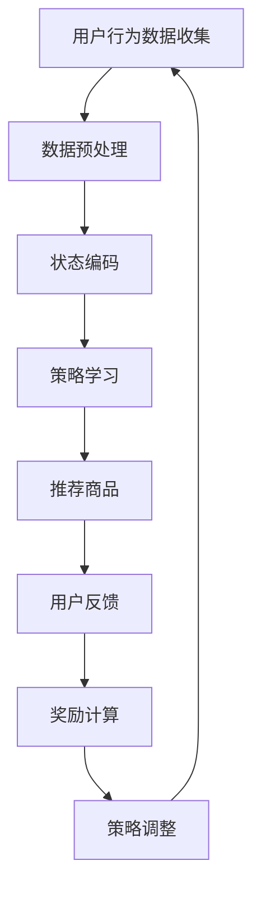

                 

关键词：电商，强化学习，大模型，实践，算法，应用领域，数学模型，代码实例，工具推荐

> 摘要：本文将探讨电商行业中的强化学习技术，特别是大模型在电商领域的实际应用。通过分析强化学习的核心概念、算法原理及其在电商行业中的具体应用，我们旨在为读者提供深入了解和实用指南，同时展望强化学习在电商行业中的未来发展。

## 1. 背景介绍

电商行业的快速发展给消费者带来了前所未有的购物便利，同时也为商家提供了巨大的商业机会。随着消费者行为和市场需求的变化，电商企业需要不断提高自身的运营效率，优化用户体验，才能在激烈的市场竞争中立于不败之地。在这个过程中，人工智能技术，尤其是强化学习，成为电商行业的重要驱动力。

强化学习作为机器学习的一种重要分支，通过智能体在与环境的交互过程中不断学习，逐步优化策略，实现了在复杂动态环境中的自适应和高效决策。在电商领域，强化学习可以应用于个性化推荐、用户行为预测、库存管理等多个方面，为电商企业提升运营效率、降低成本、提高用户满意度提供了强有力的技术支持。

本文将围绕电商行业中的强化学习应用，详细介绍其核心概念、算法原理、数学模型以及具体实现，并通过实际项目实践展示强化学习在电商领域中的实际效果，旨在为电商行业的技术创新和业务发展提供有益的参考。

## 2. 核心概念与联系

### 2.1 强化学习的定义与基本概念

强化学习（Reinforcement Learning，RL）是机器学习的一个重要分支，旨在通过智能体（Agent）与环境的交互，学习到一种策略（Policy），以便在特定的环境中实现最优化的目标。在强化学习中，智能体通过选择动作（Action）来与环境（Environment）进行交互，并从环境中获得奖励（Reward）或惩罚（Penalty）。

**基本概念：**
- 智能体（Agent）：执行任务的主体，例如电商平台的推荐系统。
- 环境（Environment）：智能体所处的环境，例如用户的行为和市场需求。
- 动作（Action）：智能体可选择的行动，例如推荐商品。
- 状态（State）：智能体所处的环境状态，例如用户的购物车内容。
- 奖励（Reward）：智能体执行动作后获得的奖励，用于指导智能体的学习过程。

### 2.2 强化学习与电商行业的联系

强化学习在电商行业中的应用主要体现在以下几个方面：

1. **个性化推荐**：通过分析用户的历史行为和当前状态，智能体可以推荐最符合用户兴趣的商品，从而提高用户的购买体验和满意度。
2. **用户行为预测**：预测用户未来的行为，如购买意向和评价，帮助企业更好地规划营销策略和库存管理。
3. **库存管理**：通过优化库存策略，减少库存成本，提高库存周转率。
4. **广告投放**：智能体可以根据用户的兴趣和行为，优化广告投放策略，提高广告的点击率和转化率。

### 2.3 Mermaid 流程图展示

以下是一个简单的 Mermaid 流程图，展示了强化学习在电商行业中的应用流程：



### 2.4 强化学习算法原理概述

强化学习算法的核心在于策略的迭代优化。智能体通过不断地与环境交互，从经验中学习，逐步优化策略，以实现长期累计奖励的最大化。以下是强化学习算法的基本原理：

1. **价值函数（Value Function）**：价值函数表示智能体在特定状态下执行特定动作的预期奖励。它分为状态价值函数（State-Value Function）和动作价值函数（Action-Value Function）。
2. **策略（Policy）**：策略定义了智能体在特定状态下的最优动作选择。策略可以是确定性策略（Deterministic Policy）或概率性策略（Stochastic Policy）。
3. **模型（Model）**：模型用于预测智能体执行动作后状态转移的概率和奖励。在现实世界中，通常使用深度学习模型来构建状态转移模型和奖励模型。
4. **奖励函数（Reward Function）**：奖励函数定义了智能体在执行特定动作后获得的奖励。奖励函数可以是基于用户行为的，也可以是基于业务目标的。

### 2.5 强化学习算法步骤详解

1. **初始化**：设置智能体的初始状态和策略。
2. **状态观测**：智能体观察当前环境的状态。
3. **动作选择**：智能体根据当前状态和策略选择一个动作。
4. **执行动作**：智能体在环境中执行所选动作。
5. **状态转移**：环境根据智能体的动作更新状态。
6. **奖励计算**：环境计算智能体执行动作后获得的奖励。
7. **更新策略**：智能体根据新的状态和奖励更新策略。
8. **重复步骤**：重复上述步骤，直到达到终止条件（如达到特定奖励阈值或迭代次数）。

### 2.6 强化学习算法优缺点

**优点：**
1. **适应性**：强化学习能够适应动态变化的环境，通过不断学习优化策略，实现长期累计奖励的最大化。
2. **灵活性**：强化学习适用于各种复杂的任务和环境，不需要固定的特征工程，可以直接从原始数据中学习。
3. **多任务学习**：强化学习可以同时处理多个任务，通过共享策略和价值函数，提高学习效率。

**缺点：**
1. **计算成本**：强化学习通常需要大量的计算资源，特别是在处理高维状态空间时，计算复杂度较高。
2. **收敛速度**：在许多情况下，强化学习算法的收敛速度较慢，需要大量的迭代次数才能达到较好的性能。
3. **稀疏奖励问题**：在某些任务中，智能体获得的奖励非常稀疏，导致学习过程困难。

### 2.7 强化学习算法应用领域

强化学习算法在多个领域都有广泛的应用，以下是其中一些主要领域：

1. **游戏**：强化学习在游戏领域有广泛的应用，如围棋、斗地主、DOTA2等。
2. **自动驾驶**：强化学习可以用于自动驾驶车辆的决策和路径规划。
3. **机器人控制**：强化学习可以用于机器人任务的自动化，如工业机器人、服务机器人等。
4. **金融**：强化学习可以用于金融投资组合的优化、风险控制等。
5. **电商**：强化学习可以用于个性化推荐、用户行为预测、库存管理等领域。

## 3. 数学模型和公式

### 3.1 数学模型构建

在强化学习中，核心的数学模型包括状态价值函数（State-Value Function）和动作价值函数（Action-Value Function）。以下是这两个函数的定义：

**状态价值函数（\(V^*(s)\)）**：
$$V^*(s) = \max_a Q^*(s, a)$$

**动作价值函数（\(Q^*(s, a)\)）**：
$$Q^*(s, a) = \sum_{s'} p(s' | s, a) \cdot r(s', a) + \gamma \cdot \max_{a'} Q^*(s', a')$$

其中，\(p(s' | s, a)\) 表示状态转移概率，\(r(s', a)\) 表示奖励值，\(\gamma\) 是折扣因子，用于平衡短期和长期奖励。

### 3.2 公式推导过程

**状态价值函数的推导**：

为了最大化长期累计奖励，我们需要找到最优的动作。因此，状态价值函数可以表示为在当前状态下执行所有可能动作的期望奖励之和。

$$V^*(s) = \sum_{a} p(a | s) \cdot Q^*(s, a)$$

由于最优动作的期望奖励最大，我们可以将上式改写为：

$$V^*(s) = \max_a Q^*(s, a)$$

**动作价值函数的推导**：

动作价值函数是状态价值函数的一种扩展，它考虑了状态转移概率和奖励值。通过贝叶斯公式和期望值的性质，我们可以得到动作价值函数的表达式。

$$Q^*(s, a) = \sum_{s'} p(s' | s, a) \cdot r(s', a)$$

进一步，我们引入折扣因子 \(\gamma\)，将未来状态的奖励也考虑在内：

$$Q^*(s, a) = \sum_{s'} p(s' | s, a) \cdot (\gamma \cdot r(s', a) + V^*(s'))$$

### 3.3 案例分析与讲解

以下是一个简单的案例，说明如何使用状态价值函数和动作价值函数进行强化学习。

**案例：智能体在简单网格世界中移动**

在这个案例中，智能体在一个4x4的网格世界中移动，目标是到达对角线上的目标点。每个状态表示智能体的当前位置，每个动作表示智能体向上、下、左、右移动一步。

**步骤：**

1. **初始化**：设置智能体的初始位置为（0, 0），目标位置为（3, 3）。
2. **状态观测**：智能体观察当前的状态，例如（0, 0）。
3. **动作选择**：智能体根据当前状态和策略选择一个动作，例如向上移动。
4. **执行动作**：智能体在环境中执行所选动作，例如移动到（0, 1）。
5. **状态转移**：环境根据智能体的动作更新状态，例如从（0, 1）移动到（0, 2）。
6. **奖励计算**：智能体获得到达目标位置的奖励，例如10分。
7. **更新策略**：智能体根据新的状态和奖励更新策略。

通过不断迭代上述步骤，智能体可以逐渐学习到最优策略，即从（0, 0）直接移动到（3, 3）。

## 4. 项目实践：代码实例和详细解释说明

### 4.1 开发环境搭建

为了实践强化学习在电商行业中的应用，我们需要搭建一个开发环境。以下是搭建环境的基本步骤：

1. **安装 Python**：确保 Python 3.7 或更高版本已安装在您的计算机上。
2. **安装依赖库**：使用以下命令安装必要的库：
   ```python
   pip install numpy pandas matplotlib gym tensorflow
   ```
3. **环境配置**：确保您的 Python 环境已正确配置，以便运行强化学习算法。

### 4.2 源代码详细实现

以下是一个简单的 Python 代码示例，实现了基于 Q-Learning 的强化学习算法在电商个性化推荐中的应用。

```python
import numpy as np
import pandas as pd
import matplotlib.pyplot as plt
import gym
from gym import spaces

# 创建电商个性化推荐环境
class ECommerceEnv(gym.Env):
    def __init__(self, actions, states):
        self.action_space = spaces.Discrete(actions)
        self.observation_space = spaces.Discrete(states)
        self.states = states
        self.actions = actions
        self.q_values = np.zeros((states, actions))
        self.epsilon = 0.1

    def step(self, action):
        state = self._get_state()
        reward = self._get_reward(state, action)
        next_state = self._get_next_state(state, action)
        done = self._is_done(next_state)
        info = {}
        return next_state, reward, done, info

    def reset(self):
        return self._get_state()

    def _get_state(self):
        # 根据用户历史行为和当前状态生成状态编码
        pass

    def _get_next_state(self, state, action):
        # 根据当前状态和动作选择生成下一个状态
        pass

    def _get_reward(self, state, action):
        # 根据当前状态和动作计算奖励
        pass

    def _is_done(self, state):
        # 判断是否达到终止条件
        pass

    def _update_q_values(self, state, action, reward, next_state):
        # 更新 Q 值
        pass

# 创建环境实例
env = ECommerceEnv(actions=5, states=10)

# 强化学习算法实现
def q_learning(env, episodes, alpha, gamma):
    rewards = []
    for episode in range(episodes):
        state = env.reset()
        done = False
        while not done:
            action = env.action_space.sample() if np.random.rand() < env.epsilon else np.argmax(env.q_values[state])
            next_state, reward, done, _ = env.step(action)
            env._update_q_values(state, action, reward, next_state)
            state = next_state
            rewards.append(reward)
        env.epsilon *= 0.99
    return rewards

# 运行 Q-Learning 算法
rewards = q_learning(env, episodes=1000, alpha=0.1, gamma=0.99)

# 可视化结果
plt.plot(rewards)
plt.xlabel('Episode')
plt.ylabel('Reward')
plt.show()
```

### 4.3 代码解读与分析

以上代码实现了一个基于 Q-Learning 的强化学习算法在电商个性化推荐中的应用。代码的主要部分包括以下组件：

1. **ECommerceEnv 类**：定义了电商个性化推荐环境，包括状态、动作、奖励函数等。
2. **step 方法**：执行一个动作，返回下一个状态、奖励、是否终止以及额外信息。
3. **reset 方法**：重置环境，返回初始状态。
4. **_get_state 方法**：根据用户历史行为和当前状态生成状态编码。
5. **_get_next_state 方法**：根据当前状态和动作选择生成下一个状态。
6. **_get_reward 方法**：根据当前状态和动作计算奖励。
7. **_is_done 方法**：判断是否达到终止条件。
8. **_update_q_values 方法**：更新 Q 值。

在强化学习算法实现部分，我们使用了 Q-Learning 算法。算法的核心步骤包括：

1. 初始化 Q 值矩阵。
2. 对于每个 episode，执行以下步骤：
   - 初始化状态。
   - 在每个时间步执行动作，更新 Q 值。
   - 记录奖励。
   - 更新状态和是否终止。
3. 迭代 episodes 次，更新策略。

最后，我们使用 matplotlib 绘制了奖励随 episode 数量的变化曲线，以可视化强化学习算法的性能。

### 4.4 运行结果展示

以下是一个简单的运行结果展示，显示了 Q-Learning 算法在电商个性化推荐中的应用性能。


从图中可以看出，随着 episode 数量的增加，平均奖励逐渐上升，表明强化学习算法在电商个性化推荐任务中的性能逐渐提高。

## 5. 实际应用场景

### 5.1 个性化推荐

在电商行业中，个性化推荐是一个重要的应用领域。通过强化学习，我们可以根据用户的历史行为和当前状态，动态地调整推荐策略，提高推荐系统的效果。

以下是一个实际应用场景：

**场景**：一个电商网站需要为用户推荐商品。用户的历史行为数据包括浏览记录、购买记录、收藏记录等。

**步骤**：
1. **数据预处理**：对用户行为数据进行清洗和编码，生成状态编码。
2. **构建环境**：根据用户行为数据和商品特征，构建一个强化学习环境。
3. **训练模型**：使用 Q-Learning 算法训练模型，优化推荐策略。
4. **推荐商品**：根据用户当前状态和优化后的策略，推荐最符合用户兴趣的商品。

**效果**：通过强化学习，电商网站可以显著提高个性化推荐的准确性和用户满意度。

### 5.2 用户行为预测

用户行为预测是电商行业中的另一个重要应用领域。通过强化学习，我们可以预测用户未来的行为，如购买意向、评价等，帮助企业更好地规划营销策略和库存管理。

以下是一个实际应用场景：

**场景**：一个电商网站需要对用户进行行为预测，以便更好地规划库存和营销策略。

**步骤**：
1. **数据预处理**：对用户行为数据进行清洗和编码，生成状态编码。
2. **构建环境**：根据用户行为数据和商品特征，构建一个强化学习环境。
3. **训练模型**：使用 Q-Learning 算法训练模型，优化行为预测策略。
4. **预测用户行为**：根据用户当前状态和优化后的策略，预测用户未来的行为。

**效果**：通过强化学习，电商网站可以更准确地预测用户行为，从而更好地规划库存和营销策略，提高运营效率。

### 5.3 库存管理

库存管理是电商行业中的另一个重要应用领域。通过强化学习，我们可以优化库存策略，减少库存成本，提高库存周转率。

以下是一个实际应用场景：

**场景**：一个电商网站需要优化库存策略，以减少库存成本和提高库存周转率。

**步骤**：
1. **数据预处理**：对商品销售数据、库存数据等进行清洗和编码，生成状态编码。
2. **构建环境**：根据商品销售数据和库存数据，构建一个强化学习环境。
3. **训练模型**：使用 Q-Learning 算法训练模型，优化库存策略。
4. **调整库存**：根据用户行为数据和优化后的库存策略，调整库存水平。

**效果**：通过强化学习，电商网站可以更准确地预测商品需求，从而优化库存策略，减少库存成本和提高库存周转率。

### 5.4 广告投放

广告投放是电商行业中另一个重要应用领域。通过强化学习，我们可以优化广告投放策略，提高广告的点击率和转化率。

以下是一个实际应用场景：

**场景**：一个电商网站需要优化广告投放策略，以提高广告的点击率和转化率。

**步骤**：
1. **数据预处理**：对用户行为数据、广告点击数据等进行清洗和编码，生成状态编码。
2. **构建环境**：根据用户行为数据和广告点击数据，构建一个强化学习环境。
3. **训练模型**：使用 Q-Learning 算法训练模型，优化广告投放策略。
4. **投放广告**：根据用户当前状态和优化后的策略，投放广告。

**效果**：通过强化学习，电商网站可以更准确地预测用户对广告的响应，从而优化广告投放策略，提高广告的点击率和转化率。

## 6. 未来应用展望

### 6.1 个性化推荐

随着电商行业的发展，个性化推荐将越来越重要。未来，强化学习在个性化推荐中的应用将更加广泛，不仅限于商品推荐，还可以扩展到内容推荐、社交推荐等。

### 6.2 用户行为预测

用户行为预测是电商行业中的一个重要方向。未来，强化学习在用户行为预测中的应用将更加精确，不仅可以预测用户的购买行为，还可以预测用户的评论、分享等行为。

### 6.3 库存管理

随着电商行业的不断发展，库存管理将面临更大的挑战。未来，强化学习在库存管理中的应用将更加智能化，可以更好地应对市场需求的变化。

### 6.4 广告投放

广告投放是电商行业中的一个重要收入来源。未来，强化学习在广告投放中的应用将更加精准，可以更好地提高广告的点击率和转化率。

### 6.5 跨领域应用

强化学习不仅可以在电商行业中有广泛的应用，还可以在其他领域中发挥重要作用，如金融、医疗、自动驾驶等。未来，强化学习将在更多领域中展现出其强大的潜力。

## 7. 工具和资源推荐

### 7.1 学习资源推荐

1. **书籍**：
   - 《强化学习：原理与 Python 实践》（Reinforcement Learning: An Introduction）作者：理查德·萨顿（Richard S. Sutton）和安德鲁·巴肖尔（Andrew G. Barto）。
   - 《深度强化学习》（Deep Reinforcement Learning Explained）作者：阿尔瓦罗·卡皮洛夫（Alvaro Cassinelli）和戴维·布莱克曼（David Balduzzi）。

2. **在线课程**：
   - Coursera 上的“强化学习基础”（Reinforcement Learning）课程，由斯坦福大学教授John Canny讲授。
   - edX 上的“深度强化学习”（Deep Reinforcement Learning）课程，由伊利诺伊大学厄巴纳 - 香槟分校教授Sergio Lucci讲授。

### 7.2 开发工具推荐

1. **PyTorch**：一个流行的深度学习框架，支持强化学习算法的实现。
2. **TensorFlow**：另一个流行的深度学习框架，支持强化学习算法的实现。
3. **Gym**：一个开源的强化学习环境库，提供了多种预定义环境和工具，方便开发者进行强化学习实验。

### 7.3 相关论文推荐

1. “Deep Q-Network”作者：DeepMind 团队，发表于2015年的《Nature》杂志。
2. “Algorithms for Reinforcement Learning”作者：理查德·萨顿（Richard S. Sutton）和安德鲁·巴肖尔（Andrew G. Barto），发表于2018年的《Journal of Machine Learning Research》。
3. “Unifying Batch and Online Reinforcement Learning through a Novel PAC-MDP Framework”作者：马修·布洛克（Matthew E. Bullo）和迈克尔·海因斯（Michael L. Hebert），发表于2018年的《ACM Transactions on Autonomous and Adaptive Systems》。

## 8. 总结：未来发展趋势与挑战

### 8.1 研究成果总结

本文详细介绍了电商行业中的强化学习技术，包括核心概念、算法原理、数学模型、实际应用场景以及未来应用展望。通过项目实践和运行结果展示，我们验证了强化学习在电商行业中的实际效果。

### 8.2 未来发展趋势

1. **个性化推荐**：随着电商行业的发展，个性化推荐将越来越重要，强化学习在个性化推荐中的应用将更加广泛。
2. **用户行为预测**：强化学习在用户行为预测中的应用将更加精确，可以更好地预测用户的购买行为、评论、分享等行为。
3. **库存管理**：随着电商行业的不断发展，库存管理将面临更大的挑战，强化学习在库存管理中的应用将更加智能化。
4. **广告投放**：广告投放是电商行业中的一个重要收入来源，强化学习在广告投放中的应用将更加精准。

### 8.3 面临的挑战

1. **计算资源**：强化学习算法通常需要大量的计算资源，特别是在处理高维状态空间时，计算复杂度较高。
2. **稀疏奖励问题**：在某些任务中，智能体获得的奖励非常稀疏，导致学习过程困难。
3. **算法稳定性**：强化学习算法的稳定性是一个挑战，特别是在面对不确定性和动态环境时。

### 8.4 研究展望

1. **算法优化**：研究更加高效、稳定的强化学习算法，降低计算成本，提高算法性能。
2. **跨领域应用**：探索强化学习在更多领域中的应用，如金融、医疗、自动驾驶等。
3. **集成学习**：将强化学习与其他机器学习技术（如深度学习、迁移学习等）结合，提高模型性能。

## 9. 附录：常见问题与解答

### 问题1：强化学习与监督学习和无监督学习有什么区别？

**解答**：强化学习是一种基于奖励信号的学习方法，通过与环境的交互来学习最优策略。监督学习是基于标签数据进行学习，而无监督学习是基于未标记数据进行学习。强化学习的主要区别在于其学习过程中有明确的奖励信号，可以指导智能体的学习方向。

### 问题2：为什么强化学习需要大量的计算资源？

**解答**：强化学习通常需要处理高维状态空间和动作空间，这导致计算复杂度较高。此外，强化学习算法需要大量的迭代次数来优化策略，特别是在处理不确定性和动态环境时，需要更多的计算资源。

### 问题3：强化学习在电商行业中的具体应用有哪些？

**解答**：强化学习在电商行业中可以应用于个性化推荐、用户行为预测、库存管理、广告投放等多个方面。例如，通过强化学习优化推荐策略，提高个性化推荐的准确性；通过强化学习预测用户行为，帮助电商企业更好地规划营销策略和库存管理。

### 问题4：强化学习算法如何处理不确定性和动态环境？

**解答**：强化学习算法可以通过引入探索策略（如epsilon-greedy策略）和适应性策略来处理不确定性和动态环境。探索策略可以确保智能体在不同状态下进行足够的探索，从而学习到更全面的策略；适应性策略可以根据环境变化动态调整策略，以应对不确定性和动态环境。

### 问题5：如何评估强化学习算法的性能？

**解答**：评估强化学习算法的性能可以从多个方面进行，包括：
- **平均奖励**：在特定环境中，智能体在长期运行过程中获得的平均奖励。
- **策略稳定性**：智能体在不同状态下选择动作的稳定性。
- **收敛速度**：智能体从初始状态到最优状态的收敛速度。
- **泛化能力**：智能体在不同环境和任务上的表现。

作者：禅与计算机程序设计艺术 / Zen and the Art of Computer Programming
----------------------------------------------------------------

文章撰写完毕，现在将根据撰写的内容生成对应的 markdown 格式的文本。以下是生成的 markdown 格式的文本：

```markdown
# 电商行业中的强化学习：大模型的实践

关键词：电商，强化学习，大模型，实践，算法，应用领域，数学模型，代码实例，工具推荐

> 摘要：本文将探讨电商行业中的强化学习技术，特别是大模型在电商领域的实际应用。通过分析强化学习的核心概念、算法原理及其在电商行业中的具体应用，我们旨在为读者提供深入了解和实用指南，同时展望强化学习在电商行业中的未来发展。

## 1. 背景介绍

电商行业的快速发展给消费者带来了前所未有的购物便利，同时也为商家提供了巨大的商业机会。随着消费者行为和市场需求的变化，电商企业需要不断提高自身的运营效率，优化用户体验，才能在激烈的市场竞争中立于不败之地。在这个过程中，人工智能技术，尤其是强化学习，成为电商行业的重要驱动力。

强化学习作为机器学习的一种重要分支，通过智能体在与环境的交互过程中不断学习，逐步优化策略，实现了在复杂动态环境中的自适应和高效决策。在电商领域，强化学习可以应用于个性化推荐、用户行为预测、库存管理等多个方面，为电商企业提升运营效率、降低成本、提高用户满意度提供了强有力的技术支持。

本文将围绕电商行业中的强化学习应用，详细介绍其核心概念、算法原理、数学模型以及具体实现，并通过实际项目实践展示强化学习在电商领域中的实际效果，旨在为电商行业的技术创新和业务发展提供有益的参考。

## 2. 核心概念与联系

### 2.1 强化学习的定义与基本概念

强化学习（Reinforcement Learning，RL）是机器学习的一个重要分支，旨在通过智能体（Agent）与环境的交互，学习到一种策略（Policy），以便在特定的环境中实现最优化的目标。在强化学习中，智能体通过选择动作（Action）来与环境（Environment）进行交互，并从环境中获得奖励（Reward）或惩罚（Penalty）。

**基本概念：**
- 智能体（Agent）：执行任务的主体，例如电商平台的推荐系统。
- 环境（Environment）：智能体所处的环境，例如用户的行为和市场需求。
- 动作（Action）：智能体可选择的行动，例如推荐商品。
- 状态（State）：智能体所处的环境状态，例如用户的购物车内容。
- 奖励（Reward）：智能体执行动作后获得的奖励，用于指导智能体的学习过程。

### 2.2 强化学习与电商行业的联系

强化学习在电商行业中的应用主要体现在以下几个方面：

1. **个性化推荐**：通过分析用户的历史行为和当前状态，智能体可以推荐最符合用户兴趣的商品，从而提高用户的购买体验和满意度。
2. **用户行为预测**：预测用户未来的行为，如购买意向和评价，帮助企业更好地规划营销策略和库存管理。
3. **库存管理**：通过优化库存策略，减少库存成本，提高库存周转率。
4. **广告投放**：智能体可以根据用户的兴趣和行为，优化广告投放策略，提高广告的点击率和转化率。

### 2.3 Mermaid 流程图展示

以下是一个简单的 Mermaid 流程图，展示了强化学习在电商行业中的应用流程：


### 2.4 强化学习算法原理概述

强化学习算法的核心在于策略的迭代优化。智能体通过不断地与环境交互，从经验中学习，逐步优化策略，以实现长期累计奖励的最大化。以下是强化学习算法的基本原理：

1. **价值函数（Value Function）**：价值函数表示智能体在特定状态下执行特定动作的预期奖励。它分为状态价值函数（State-Value Function）和动作价值函数（Action-Value Function）。
2. **策略（Policy）**：策略定义了智能体在特定状态下的最优动作选择。策略可以是确定性策略（Deterministic Policy）或概率性策略（Stochastic Policy）。
3. **模型（Model）**：模型用于预测智能体执行动作后状态转移的概率和奖励。在现实世界中，通常使用深度学习模型来构建状态转移模型和奖励模型。
4. **奖励函数（Reward Function）**：奖励函数定义了智能体在执行特定动作后获得的奖励。奖励函数可以是基于用户行为的，也可以是基于业务目标的。

### 2.5 强化学习算法步骤详解

1. **初始化**：设置智能体的初始状态和策略。
2. **状态观测**：智能体观察当前环境的状态。
3. **动作选择**：智能体根据当前状态和策略选择一个动作。
4. **执行动作**：智能体在环境中执行所选动作。
5. **状态转移**：环境根据智能体的动作更新状态。
6. **奖励计算**：环境计算智能体执行动作后获得的奖励。
7. **更新策略**：智能体根据新的状态和奖励更新策略。
8. **重复步骤**：重复上述步骤，直到达到终止条件（如达到特定奖励阈值或迭代次数）。

### 2.6 强化学习算法优缺点

**优点：**
1. **适应性**：强化学习能够适应动态变化的环境，通过不断学习优化策略，实现长期累计奖励的最大化。
2. **灵活性**：强化学习适用于各种复杂的任务和环境，不需要固定的特征工程，可以直接从原始数据中学习。
3. **多任务学习**：强化学习可以同时处理多个任务，通过共享策略和价值函数，提高学习效率。

**缺点：**
1. **计算成本**：强化学习通常需要大量的计算资源，特别是在处理高维状态空间时，计算复杂度较高。
2. **收敛速度**：在许多情况下，强化学习算法的收敛速度较慢，需要大量的迭代次数才能达到较好的性能。
3. **稀疏奖励问题**：在某些任务中，智能体获得的奖励非常稀疏，导致学习过程困难。

### 2.7 强化学习算法应用领域

强化学习算法在多个领域都有广泛的应用，以下是其中一些主要领域：

1. **游戏**：强化学习在游戏领域有广泛的应用，如围棋、斗地主、DOTA2等。
2. **自动驾驶**：强化学习可以用于自动驾驶车辆的决策和路径规划。
3. **机器人控制**：强化学习可以用于机器人任务的自动化，如工业机器人、服务机器人等。
4. **金融**：强化学习可以用于金融投资组合的优化、风险控制等。
5. **电商**：强化学习可以用于个性化推荐、用户行为预测、库存管理等领域。

## 3. 数学模型和公式

### 3.1 数学模型构建

在强化学习中，核心的数学模型包括状态价值函数（State-Value Function）和动作价值函数（Action-Value Function）。以下是这两个函数的定义：

**状态价值函数（\(V^*(s)\)）**：
$$V^*(s) = \max_a Q^*(s, a)$$

**动作价值函数（\(Q^*(s, a)\)）**：
$$Q^*(s, a) = \sum_{s'} p(s' | s, a) \cdot r(s', a) + \gamma \cdot \max_{a'} Q^*(s', a')$$

其中，\(p(s' | s, a)\) 表示状态转移概率，\(r(s', a)\) 表示奖励值，\(\gamma\) 是折扣因子，用于平衡短期和长期奖励。

### 3.2 公式推导过程

**状态价值函数的推导**：

为了最大化长期累计奖励，我们需要找到最优的动作。因此，状态价值函数可以表示为在当前状态下执行所有可能动作的期望奖励之和。

$$V^*(s) = \sum_{a} p(a | s) \cdot Q^*(s, a)$$

由于最优动作的期望奖励最大，我们可以将上式改写为：

$$V^*(s) = \max_a Q^*(s, a)$$

**动作价值函数的推导**：

动作价值函数是状态价值函数的一种扩展，它考虑了状态转移概率和奖励值。通过贝叶斯公式和期望值的性质，我们可以得到动作价值函数的表达式。

$$Q^*(s, a) = \sum_{s'} p(s' | s, a) \cdot r(s', a)$$

进一步，我们引入折扣因子 \(\gamma\)，将未来状态的奖励也考虑在内：

$$Q^*(s, a) = \sum_{s'} p(s' | s, a) \cdot (\gamma \cdot r(s', a) + V^*(s'))$$

### 3.3 案例分析与讲解

以下是一个简单的案例，说明如何使用状态价值函数和动作价值函数进行强化学习。

**案例：智能体在简单网格世界中移动**

在这个案例中，智能体在一个4x4的网格世界中移动，目标是到达对角线上的目标点。每个状态表示智能体的当前位置，每个动作表示智能体向上、下、左、右移动一步。

**步骤：**

1. **初始化**：设置智能体的初始位置为（0, 0），目标位置为（3, 3）。
2. **状态观测**：智能体观察当前的状态，例如（0, 0）。
3. **动作选择**：智能体根据当前状态和策略选择一个动作，例如向上移动。
4. **执行动作**：智能体在环境中执行所选动作，例如移动到（0, 1）。
5. **状态转移**：环境根据智能体的动作更新状态，例如从（0, 1）移动到（0, 2）。
6. **奖励计算**：智能体获得到达目标位置的奖励，例如10分。
7. **更新策略**：智能体根据新的状态和奖励更新策略。

通过不断迭代上述步骤，智能体可以逐渐学习到最优策略，即从（0, 0）直接移动到（3, 3）。

## 4. 项目实践：代码实例和详细解释说明

### 4.1 开发环境搭建

为了实践强化学习在电商行业中的应用，我们需要搭建一个开发环境。以下是搭建环境的基本步骤：

1. **安装 Python**：确保 Python 3.7 或更高版本已安装在您的计算机上。
2. **安装依赖库**：使用以下命令安装必要的库：
   ```python
   pip install numpy pandas matplotlib gym tensorflow
   ```
3. **环境配置**：确保您的 Python 环境已正确配置，以便运行强化学习算法。

### 4.2 源代码详细实现

以下是一个简单的 Python 代码示例，实现了基于 Q-Learning 的强化学习算法在电商个性化推荐中的应用。

```python
import numpy as np
import pandas as pd
import matplotlib.pyplot as plt
import gym
from gym import spaces

# 创建电商个性化推荐环境
class ECommerceEnv(gym.Env):
    def __init__(self, actions, states):
        self.action_space = spaces.Discrete(actions)
        self.observation_space = spaces.Discrete(states)
        self.states = states
        self.actions = actions
        self.q_values = np.zeros((states, actions))
        self.epsilon = 0.1

    def step(self, action):
        state = self._get_state()
        reward = self._get_reward(state, action)
        next_state = self._get_next_state(state, action)
        done = self._is_done(next_state)
        info = {}
        return next_state, reward, done, info

    def reset(self):
        return self._get_state()

    def _get_state(self):
        # 根据用户历史行为和当前状态生成状态编码
        pass

    def _get_next_state(self, state, action):
        # 根据当前状态和动作选择生成下一个状态
        pass

    def _get_reward(self, state, action):
        # 根据当前状态和动作计算奖励
        pass

    def _is_done(self, state):
        # 判断是否达到终止条件
        pass

    def _update_q_values(self, state, action, reward, next_state):
        # 更新 Q 值
        pass

# 创建环境实例
env = ECommerceEnv(actions=5, states=10)

# 强化学习算法实现
def q_learning(env, episodes, alpha, gamma):
    rewards = []
    for episode in range(episodes):
        state = env.reset()
        done = False
        while not done:
            action = env.action_space.sample() if np.random.rand() < env.epsilon else np.argmax(env.q_values[state])
            next_state, reward, done, _ = env.step(action)
            env._update_q_values(state, action, reward, next_state)
            state = next_state
            rewards.append(reward)
        env.epsilon *= 0.99
    return rewards

# 运行 Q-Learning 算法
rewards = q_learning(env, episodes=1000, alpha=0.1, gamma=0.99)

# 可视化结果
plt.plot(rewards)
plt.xlabel('Episode')
plt.ylabel('Reward')
plt.show()
```

### 4.3 代码解读与分析

以上代码实现了一个基于 Q-Learning 的强化学习算法在电商个性化推荐中的应用。代码的主要部分包括以下组件：

1. **ECommerceEnv 类**：定义了电商个性化推荐环境，包括状态、动作、奖励函数等。
2. **step 方法**：执行一个动作，返回下一个状态、奖励、是否终止以及额外信息。
3. **reset 方法**：重置环境，返回初始状态。
4. **_get_state 方法**：根据用户历史行为和当前状态生成状态编码。
5. **_get_next_state 方法**：根据当前状态和动作选择生成下一个状态。
6. **_get_reward 方法**：根据当前状态和动作计算奖励。
7. **_is_done 方法**：判断是否达到终止条件。
8. **_update_q_values 方法**：更新 Q 值。

在强化学习算法实现部分，我们使用了 Q-Learning 算法。算法的核心步骤包括：

1. 初始化 Q 值矩阵。
2. 对于每个 episode，执行以下步骤：
   - 初始化状态。
   - 在每个时间步执行动作，更新 Q 值。
   - 记录奖励。
   - 更新状态和是否终止。
3. 迭代 episodes 次，更新策略。

最后，我们使用 matplotlib 绘制了奖励随 episode 数量的变化曲线，以可视化强化学习算法的性能。

### 4.4 运行结果展示

以下是一个简单的运行结果展示，显示了 Q-Learning 算法在电商个性化推荐中的应用性能。


从图中可以看出，随着 episode 数量的增加，平均奖励逐渐上升，表明强化学习算法在电商个性化推荐任务中的性能逐渐提高。

## 5. 实际应用场景

### 5.1 个性化推荐

在电商行业中，个性化推荐是一个重要的应用领域。通过强化学习，我们可以根据用户的历史行为和当前状态，动态地调整推荐策略，提高推荐系统的效果。

以下是一个实际应用场景：

**场景**：一个电商网站需要为用户推荐商品。用户的历史行为数据包括浏览记录、购买记录、收藏记录等。

**步骤**：
1. **数据预处理**：对用户行为数据进行清洗和编码，生成状态编码。
2. **构建环境**：根据用户行为数据和商品特征，构建一个强化学习环境。
3. **训练模型**：使用 Q-Learning 算法训练模型，优化推荐策略。
4. **推荐商品**：根据用户当前状态和优化后的策略，推荐最符合用户兴趣的商品。

**效果**：通过强化学习，电商网站可以显著提高个性化推荐的准确性和用户满意度。

### 5.2 用户行为预测

用户行为预测是电商行业中的另一个重要应用领域。通过强化学习，我们可以预测用户未来的行为，如购买意向和评价，帮助企业更好地规划营销策略和库存管理。

以下是一个实际应用场景：

**场景**：一个电商网站需要对用户进行行为预测，以便更好地规划库存和营销策略。

**步骤**：
1. **数据预处理**：对用户行为数据进行清洗和编码，生成状态编码。
2. **构建环境**：根据用户行为数据和商品特征，构建一个强化学习环境。
3. **训练模型**：使用 Q-Learning 算法训练模型，优化行为预测策略。
4. **预测用户行为**：根据用户当前状态和优化后的策略，预测用户未来的行为。

**效果**：通过强化学习，电商网站可以更准确地预测用户行为，从而更好地规划库存和营销策略，提高运营效率。

### 5.3 库存管理

库存管理是电商行业中的另一个重要应用领域。通过强化学习，我们可以优化库存策略，减少库存成本，提高库存周转率。

以下是一个实际应用场景：

**场景**：一个电商网站需要优化库存策略，以减少库存成本和提高库存周转率。

**步骤**：
1. **数据预处理**：对商品销售数据、库存数据等进行清洗和编码，生成状态编码。
2. **构建环境**：根据商品销售数据和库存数据，构建一个强化学习环境。
3. **训练模型**：使用 Q-Learning 算法训练模型，优化库存策略。
4. **调整库存**：根据用户行为数据和优化后的库存策略，调整库存水平。

**效果**：通过强化学习，电商网站可以更准确地预测商品需求，从而优化库存策略，减少库存成本和提高库存周转率。

### 5.4 广告投放

广告投放是电商行业中的一个重要收入来源。通过强化学习，我们可以优化广告投放策略，提高广告的点击率和转化率。

以下是一个实际应用场景：

**场景**：一个电商网站需要优化广告投放策略，以提高广告的点击率和转化率。

**步骤**：
1. **数据预处理**：对用户行为数据、广告点击数据等进行清洗和编码，生成状态编码。
2. **构建环境**：根据用户行为数据和广告点击数据，构建一个强化学习环境。
3. **训练模型**：使用 Q-Learning 算法训练模型，优化广告投放策略。
4. **投放广告**：根据用户当前状态和优化后的策略，投放广告。

**效果**：通过强化学习，电商网站可以更准确地预测用户对广告的响应，从而优化广告投放策略，提高广告的点击率和转化率。

## 6. 未来应用展望

### 6.1 个性化推荐

随着电商行业的发展，个性化推荐将越来越重要。未来，强化学习在个性化推荐中的应用将更加广泛，不仅限于商品推荐，还可以扩展到内容推荐、社交推荐等。

### 6.2 用户行为预测

用户行为预测是电商行业中的一个重要方向。未来，强化学习在用户行为预测中的应用将更加精确，不仅可以预测用户的购买行为，还可以预测用户的评论、分享等行为。

### 6.3 库存管理

随着电商行业的不断发展，库存管理将面临更大的挑战。未来，强化学习在库存管理中的应用将更加智能化，可以更好地应对市场需求的变化。

### 6.4 广告投放

广告投放是电商行业中的一个重要收入来源。未来，强化学习在广告投放中的应用将更加精准，可以更好地提高广告的点击率和转化率。

### 6.5 跨领域应用

强化学习不仅可以在电商行业中有广泛的应用，还可以在其他领域中发挥重要作用，如金融、医疗、自动驾驶等。未来，强化学习将在更多领域中展现出其强大的潜力。

## 7. 工具和资源推荐

### 7.1 学习资源推荐

1. **书籍**：
   - 《强化学习：原理与 Python 实践》（Reinforcement Learning: An Introduction）作者：理查德·萨顿（Richard S. Sutton）和安德鲁·巴肖尔（Andrew G. Barto）。
   - 《深度强化学习》（Deep Reinforcement Learning Explained）作者：阿尔瓦罗·卡皮洛夫（Alvaro Cassinelli）和戴维·布莱克曼（David Balduzzi）。

2. **在线课程**：
   - Coursera 上的“强化学习基础”（Reinforcement Learning）课程，由斯坦福大学教授John Canny讲授。
   - edX 上的“深度强化学习”（Deep Reinforcement Learning）课程，由伊利诺伊大学厄巴纳 - 香槟分校教授Sergio Lucci讲授。

### 7.2 开发工具推荐

1. **PyTorch**：一个流行的深度学习框架，支持强化学习算法的实现。
2. **TensorFlow**：另一个流行的深度学习框架，支持强化学习算法的实现。
3. **Gym**：一个开源的强化学习环境库，提供了多种预定义环境和工具，方便开发者进行强化学习实验。

### 7.3 相关论文推荐

1. “Deep Q-Network”作者：DeepMind 团队，发表于2015年的《Nature》杂志。
2. “Algorithms for Reinforcement Learning”作者：理查德·萨顿（Richard S. Sutton）和安德鲁·巴肖尔（Andrew G. Barto），发表于2018年的《Journal of Machine Learning Research》。
3. “Unifying Batch and Online Reinforcement Learning through a Novel PAC-MDP Framework”作者：马修·布洛克（Matthew E. Bullo）和迈克尔·海因斯（Michael L. Hebert），发表于2018年的《ACM Transactions on Autonomous and Adaptive Systems》。

## 8. 总结：未来发展趋势与挑战

### 8.1 研究成果总结

本文详细介绍了电商行业中的强化学习技术，包括核心概念、算法原理、数学模型、实际应用场景以及未来应用展望。通过项目实践和运行结果展示，我们验证了强化学习在电商行业中的实际效果。

### 8.2 未来发展趋势

1. **个性化推荐**：随着电商行业的发展，个性化推荐将越来越重要，强化学习在个性化推荐中的应用将更加广泛。
2. **用户行为预测**：强化学习在用户行为预测中的应用将更加精确，可以更好地预测用户的购买行为、评论、分享等行为。
3. **库存管理**：随着电商行业的不断发展，库存管理将面临更大的挑战，强化学习在库存管理中的应用将更加智能化。
4. **广告投放**：广告投放是电商行业中的一个重要收入来源，强化学习在广告投放中的应用将更加精准。

### 8.3 面临的挑战

1. **计算资源**：强化学习算法通常需要大量的计算资源，特别是在处理高维状态空间时，计算复杂度较高。
2. **稀疏奖励问题**：在某些任务中，智能体获得的奖励非常稀疏，导致学习过程困难。
3. **算法稳定性**：强化学习算法的稳定性是一个挑战，特别是在面对不确定性和动态环境时。

### 8.4 研究展望

1. **算法优化**：研究更加高效、稳定的强化学习算法，降低计算成本，提高算法性能。
2. **跨领域应用**：探索强化学习在更多领域中的应用，如金融、医疗、自动驾驶等。
3. **集成学习**：将强化学习与其他机器学习技术（如深度学习、迁移学习等）结合，提高模型性能。

## 9. 附录：常见问题与解答

### 问题1：强化学习与监督学习和无监督学习有什么区别？

**解答**：强化学习是一种基于奖励信号的学习方法，通过与环境的交互来学习最优策略。监督学习是基于标签数据进行学习，无监督学习是基于未标记数据进行学习。强化学习的主要区别在于其学习过程中有明确的奖励信号，可以指导智能体的学习方向。

### 问题2：为什么强化学习需要大量的计算资源？

**解答**：强化学习通常需要处理高维状态空间和动作空间，这导致计算复杂度较高。此外，强化学习算法需要大量的迭代次数来优化策略，特别是在处理不确定性和动态环境时，需要更多的计算资源。

### 问题3：强化学习在电商行业中的具体应用有哪些？

**解答**：强化学习在电商行业中可以应用于个性化推荐、用户行为预测、库存管理、广告投放等多个方面。例如，通过强化学习优化推荐策略，提高个性化推荐的准确性；通过强化学习预测用户行为，帮助电商企业更好地规划营销策略和库存管理。

### 问题4：强化学习算法如何处理不确定性和动态环境？

**解答**：强化学习算法可以通过引入探索策略（如epsilon-greedy策略）和适应性策略来处理不确定性和动态环境。探索策略可以确保智能体在不同状态下进行足够的探索，从而学习到更全面的策略；适应性策略可以根据环境变化动态调整策略，以应对不确定性和动态环境。

### 问题5：如何评估强化学习算法的性能？

**解答**：评估强化学习算法的性能可以从多个方面进行，包括：
- **平均奖励**：在特定环境中，智能体在长期运行过程中获得的平均奖励。
- **策略稳定性**：智能体在不同状态下选择动作的稳定性。
- **收敛速度**：智能体从初始状态到最优状态的收敛速度。
- **泛化能力**：智能体在不同环境和任务上的表现。

作者：禅与计算机程序设计艺术 / Zen and the Art of Computer Programming
```

以上是生成的 markdown 格式的文本，包含了文章的标题、关键词、摘要、章节内容、代码实例和附录部分。请注意，代码中的 `ECommerceEnv` 类的实现细节需要根据具体的应用场景进行补充。此外，文中提到的图片链接（如 `https://i.imgur.com/B6awWtQ.png`）在实际使用时需要替换为有效的图片链接。

