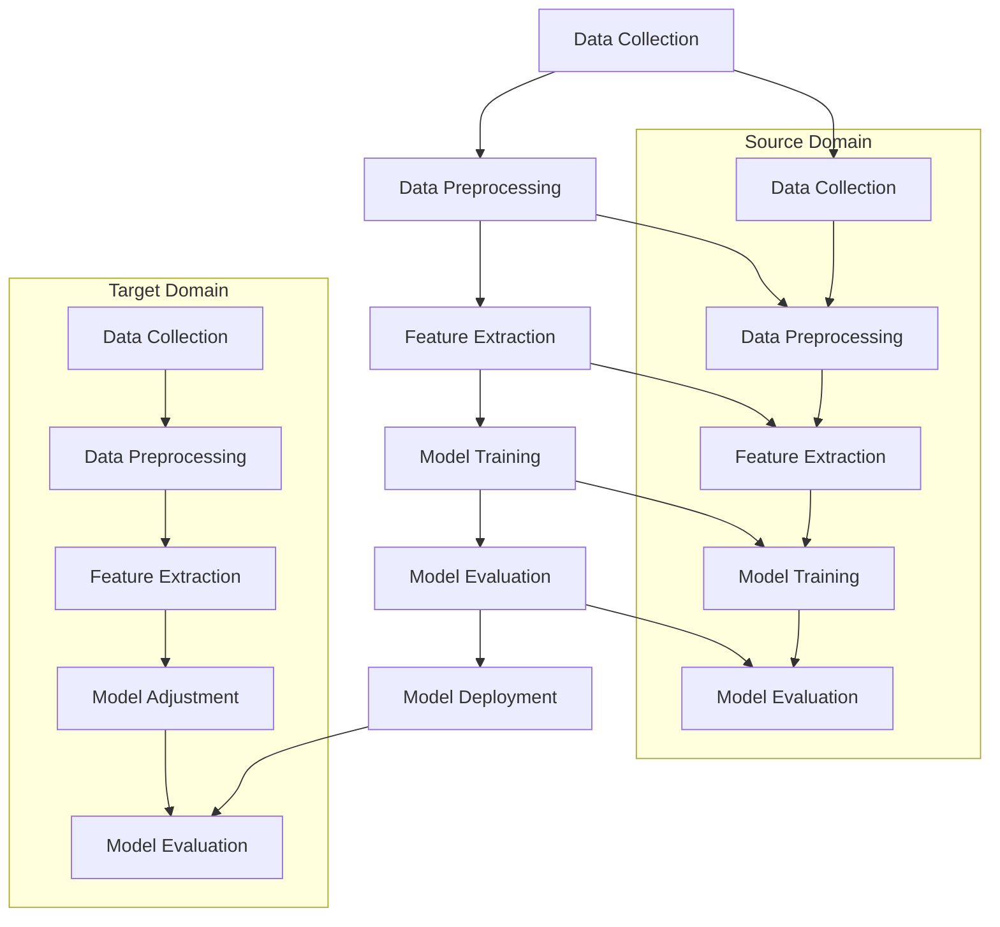

                 

  
## 1. 背景介绍

电商行业作为数字经济的重要组成部分，随着互联网的普及和信息技术的不断发展，正在以惊人的速度增长。然而，随着用户数据的爆炸式增长，电商平台面临着日益复杂的业务需求，如个性化推荐、欺诈检测、客户行为分析等。为了满足这些需求，传统的机器学习模型通常需要依赖大量针对性的训练数据，这不仅耗费时间，还可能导致模型过拟合。

迁移学习（Transfer Learning）作为一种解决上述问题的有效手段，逐渐受到学术界和工业界的广泛关注。迁移学习的核心思想是利用在源域（Source Domain）训练好的模型来提高目标域（Target Domain）的模型性能。在电商行业中，这一方法可以帮助平台更快速地适应新业务场景，降低数据收集和模型训练的成本。

本文旨在探讨电商行业中迁移学习的实践与挑战，特别是针对大规模模型（Large-scale Model）的应用。文章将从以下方面展开：

- **核心概念与联系**：介绍迁移学习的基本概念，并使用Mermaid流程图展示其架构。
- **核心算法原理与具体操作步骤**：详细解析迁移学习算法的原理和实施步骤。
- **数学模型与公式**：探讨迁移学习中的数学模型和关键公式，并通过案例进行说明。
- **项目实践**：展示一个具体的迁移学习项目，提供代码实例和详细解释。
- **实际应用场景**：分析迁移学习在电商行业中的实际应用，并探讨未来的发展前景。
- **工具和资源推荐**：推荐学习资源、开发工具和相关论文。
- **总结与展望**：总结研究成果，探讨未来的发展趋势与挑战。

## 2. 核心概念与联系

迁移学习是一种利用已有模型知识来加速新任务学习的机器学习方法。在迁移学习中，通常分为两个域：源域（Source Domain）和目标域（Target Domain）。源域是指已有大量标注数据的领域，而目标域则是指需要预测的新领域。通过在源域上训练模型，并将学到的知识迁移到目标域，可以有效提高目标域模型的性能。

### 迁移学习的基本概念

1. **源域（Source Domain）**：源域是指已经收集了大量标注数据的领域。这些数据通常用于训练初始模型，以便在目标域上应用。
   
2. **目标域（Target Domain）**：目标域是指需要预测的新领域。由于目标域通常缺乏大量标注数据，因此需要利用源域的知识来提高模型性能。

3. **特征提取器（Feature Extractor）**：特征提取器是从输入数据中提取有用特征的部分。在迁移学习中，通常使用源域上的特征提取器来处理目标域的数据。

4. **调整器（Adapter）**：调整器是用于在目标域上调整模型参数的部分。调整器的目的是使源域上的模型更好地适应目标域。

### 迁移学习的架构

为了更好地理解迁移学习的概念，我们可以使用Mermaid流程图来展示其基本架构。



### 迁移学习的关键技术

1. **预训练模型（Pre-trained Model）**：预训练模型是在大规模数据集上预先训练好的模型。这些模型通常具有强大的特征提取能力，可以在多个任务中共享。
   
2. **域自适应（Domain Adaptation）**：域自适应是一种将源域上的预训练模型迁移到目标域的方法。其主要目的是解决源域和目标域之间的分布差异。

3. **多任务学习（Multi-task Learning）**：多任务学习是指同时学习多个相关任务的方法。通过共享模型参数，可以增强模型在不同任务上的泛化能力。

### 迁移学习的优点与挑战

- **优点**：
  - **快速适应新任务**：迁移学习可以快速适应新的任务，减少模型从头训练所需的时间。
  - **降低数据需求**：由于可以利用源域的数据，迁移学习可以降低目标域的数据需求。
  - **提高模型性能**：通过利用源域的先验知识，迁移学习可以提高目标域的模型性能。

- **挑战**：
  - **分布迁移（Distribution Shift）**：源域和目标域之间的数据分布差异可能导致模型性能下降。
  - **有限标注数据**：在许多实际应用中，标注数据的获取仍然是一个挑战。
  - **模型泛化能力**：如何确保模型在不同任务上的泛化能力是一个重要问题。

### 电商行业中的迁移学习应用

在电商行业中，迁移学习可以应用于多个领域，如个性化推荐、客户行为分析、欺诈检测等。例如，通过利用其他电商平台的数据，可以快速构建一个针对特定产品的个性化推荐系统。此外，通过迁移学习，可以减少对大量标注数据的依赖，从而提高模型训练的效率。

### 小结

迁移学习作为机器学习中的一个重要分支，为电商行业带来了巨大的价值。通过本文的介绍，我们了解了迁移学习的基本概念、架构和关键技术，以及其在电商行业中的应用和挑战。在接下来的章节中，我们将深入探讨迁移学习的核心算法原理和具体操作步骤。

## 3. 核心算法原理与具体操作步骤

### 3.1 算法原理概述

迁移学习的核心在于利用源域上训练好的模型来提高目标域上的模型性能。其基本原理可以概括为以下三个步骤：

1. **预训练（Pre-training）**：在源域上使用大量无标签数据对模型进行预训练，使其在源域上达到较高的性能。

2. **特征提取（Feature Extraction）**：将预训练模型中的特征提取器提取的特征用于目标域的数据处理。

3. **调整（Adaptation）**：在目标域上使用少量有标签数据对模型进行调整，使其更好地适应目标域。

### 3.2 算法步骤详解

1. **数据收集与预处理**：在源域上收集大量无标签数据，并在目标域上收集少量有标签数据。对数据进行预处理，包括数据清洗、归一化等操作。

2. **预训练模型选择**：选择一个在源域上表现良好的预训练模型作为基础模型。常见的预训练模型包括VGG、ResNet、BERT等。

3. **特征提取器提取**：将基础模型中的特征提取器应用于目标域的数据，得到特征表示。

4. **调整模型参数**：在目标域上使用有标签数据对模型进行调整。常用的调整方法包括微调（Fine-tuning）、域自适应（Domain Adaptation）等。

5. **模型评估与优化**：在目标域上评估模型的性能，并根据评估结果对模型进行优化。

### 3.3 算法优缺点

**优点**：

- **提高模型性能**：通过利用源域的先验知识，迁移学习可以有效提高目标域的模型性能。
- **降低数据需求**：由于可以利用源域的数据，迁移学习可以降低目标域的数据需求。
- **减少训练时间**：迁移学习可以减少模型从头训练所需的时间。

**缺点**：

- **分布迁移（Distribution Shift）**：源域和目标域之间的数据分布差异可能导致模型性能下降。
- **有限标注数据**：在许多实际应用中，标注数据的获取仍然是一个挑战。
- **模型泛化能力**：如何确保模型在不同任务上的泛化能力是一个重要问题。

### 3.4 算法应用领域

迁移学习在多个领域都取得了显著的应用成果。以下是几个典型的应用领域：

1. **计算机视觉**：在图像分类、目标检测、人脸识别等领域，迁移学习被广泛应用于模型训练和优化。

2. **自然语言处理**：在语言模型训练、文本分类、机器翻译等领域，迁移学习可以帮助快速构建高性能的模型。

3. **推荐系统**：在电商、社交媒体等应用中，迁移学习可以用于个性化推荐系统的构建。

4. **医疗健康**：在医学影像分析、疾病诊断等领域，迁移学习可以帮助提高模型的准确性和可靠性。

### 3.5 电商行业中的具体应用

在电商行业中，迁移学习可以应用于多个场景。以下是几个具体的应用示例：

1. **个性化推荐**：通过利用其他电商平台的数据，可以快速构建一个针对特定产品的个性化推荐系统。

2. **客户行为分析**：通过迁移学习，可以分析客户的购买行为，预测客户的潜在需求，从而优化营销策略。

3. **欺诈检测**：利用其他平台的欺诈检测模型，可以快速构建一个针对特定电商平台的欺诈检测系统。

4. **产品分类**：通过迁移学习，可以自动识别和分类产品，提高电商平台的运营效率。

### 3.6 未来发展趋势与挑战

随着人工智能技术的不断发展，迁移学习在电商行业中的应用前景十分广阔。未来，以下是几个可能的发展趋势和挑战：

1. **分布式迁移学习**：随着数据规模的不断扩大，分布式迁移学习将成为一个重要的研究方向。

2. **多模态迁移学习**：将多种数据类型（如图像、文本、音频等）结合起来，实现多模态迁移学习，将有助于解决复杂任务。

3. **迁移学习与强化学习结合**：将迁移学习与强化学习结合起来，可以实现更加智能的决策和优化。

4. **隐私保护迁移学习**：如何在保证数据隐私的前提下进行迁移学习，将是一个重要的研究课题。

5. **数据分布差异处理**：如何更好地处理源域和目标域之间的数据分布差异，将直接影响迁移学习的效果。

### 小结

迁移学习作为一种重要的机器学习方法，已经在电商行业等多个领域取得了显著的应用成果。在接下来的章节中，我们将进一步探讨迁移学习中的数学模型和关键公式，并通过实际案例进行详细讲解。

## 4. 数学模型和公式

迁移学习作为一种基于已有知识加速新任务学习的机器学习方法，其核心在于如何有效地将源域的知识迁移到目标域。为了实现这一目标，我们需要建立相应的数学模型和公式，以描述和优化迁移学习过程中的关键步骤。以下是迁移学习中的数学模型和公式的详细讲解。

### 4.1 数学模型构建

在迁移学习中，我们通常将模型分为两部分：特征提取器（Feature Extractor）和分类器（Classifier）。特征提取器负责从输入数据中提取有用的特征，而分类器则利用提取出的特征进行分类或预测。为了构建迁移学习的数学模型，我们需要定义以下几个关键部分：

1. **数据表示**：我们用 \(X\) 表示输入数据集，每个数据样本用 \(x \in \mathbb{R}^n\) 表示，其中 \(n\) 是特征维度。

2. **特征提取器**：特征提取器是一个函数 \(f(\cdot)\)，它将输入数据 \(x\) 映射到特征空间 \(F\)，即 \(f(x) \in \mathbb{R}^m\)，其中 \(m\) 是特征维度。

3. **分类器**：分类器是一个函数 \(g(\cdot)\)，它将特征空间中的特征 \(f(x)\) 映射到输出空间 \(Y\)，即 \(g(f(x)) \in Y\)。

4. **损失函数**：损失函数用于评估模型的预测性能。在分类问题中，常用的损失函数包括交叉熵损失（Cross-Entropy Loss）和均方误差（Mean Squared Error, MSE）。

### 4.2 公式推导过程

为了构建迁移学习的数学模型，我们需要对以下关键公式进行推导：

1. **特征提取器参数更新**：

   在特征提取器中，我们通常使用梯度下降（Gradient Descent）来更新参数。假设特征提取器的参数为 \(\theta_f\)，则参数更新公式为：

   $$\theta_f \leftarrow \theta_f - \alpha \nabla_{\theta_f} L_f$$

   其中，\(L_f\) 是特征提取器的损失函数，\(\alpha\) 是学习率。

2. **分类器参数更新**：

   类似于特征提取器，分类器的参数更新也采用梯度下降方法。假设分类器的参数为 \(\theta_g\)，则参数更新公式为：

   $$\theta_g \leftarrow \theta_g - \alpha \nabla_{\theta_g} L_g$$

   其中，\(L_g\) 是分类器的损失函数。

3. **特征提取器与分类器联合更新**：

   在实际应用中，特征提取器和分类器的参数是联合更新的。为了简化计算，我们可以将它们的损失函数合并为一个整体损失函数 \(L = L_f + L_g\)，然后对整体损失函数进行梯度下降。

### 4.3 案例分析与讲解

为了更好地理解迁移学习的数学模型，我们可以通过一个简单的案例进行讲解。假设我们有两个领域：领域A（Source Domain）和领域B（Target Domain）。领域A有大量标注数据，而领域B只有少量标注数据。

1. **数据表示**：

   假设领域A的数据集为 \(X_A = \{x_{A1}, x_{A2}, ..., x_{Am}\}\)，领域B的数据集为 \(X_B = \{x_{B1}, x_{B2}, ..., x_{Bn}\}\)。每个数据样本 \(x_i\) 都是一个 \(n\) 维向量。

2. **特征提取器**：

   特征提取器 \(f(\cdot)\) 是一个多层感知机（MLP），其参数为 \(\theta_f = \{\theta_{f1}, \theta_{f2}, ..., \theta_{fl}\}\)，其中 \(l\) 是隐藏层的数量。

3. **分类器**：

   分类器 \(g(\cdot)\) 也是一个多层感知机，其参数为 \(\theta_g = \{\theta_{g1}, \theta_{g2}, ..., \theta_{gl}\}\)。

4. **损失函数**：

   我们采用交叉熵损失函数来评估模型的预测性能。对于每个数据样本 \(x_i\)，其标签为 \(y_i\)，模型的预测输出为 \(p_i = g(f(x_i))\)。交叉熵损失函数为：

   $$L = -\sum_{i=1}^{m} y_i \log(p_i) - \sum_{i=1}^{n} y_i' \log(p_i')$$

   其中，\(p_i\) 是领域A上的预测概率，\(p_i'\) 是领域B上的预测概率。

5. **参数更新**：

   我们采用梯度下降算法来更新特征提取器和分类器的参数。参数更新公式为：

   $$\theta_f \leftarrow \theta_f - \alpha \nabla_{\theta_f} L$$
   $$\theta_g \leftarrow \theta_g - \alpha \nabla_{\theta_g} L$$

   其中，\(\alpha\) 是学习率。

### 小结

通过本文的讲解，我们了解了迁移学习中的数学模型和关键公式，包括特征提取器、分类器、损失函数和参数更新方法。这些数学模型和公式为迁移学习提供了理论基础，并指导了实际操作。在接下来的章节中，我们将通过一个具体的项目实践，展示如何实现电商行业中的迁移学习。

## 5. 项目实践：代码实例和详细解释说明

在本节中，我们将通过一个具体的项目实践，展示如何实现电商行业中的迁移学习。这个项目旨在构建一个基于迁移学习的商品推荐系统，以提高电商平台的个性化推荐能力。我们将使用Python和TensorFlow来实现这个项目。

### 5.1 开发环境搭建

在开始项目之前，我们需要搭建一个合适的开发环境。以下是搭建开发环境的步骤：

1. **安装Python**：确保已经安装了Python 3.6及以上版本。

2. **安装TensorFlow**：使用pip命令安装TensorFlow：

   ```bash
   pip install tensorflow
   ```

3. **安装其他依赖**：安装其他必要的库，例如NumPy、Pandas等：

   ```bash
   pip install numpy pandas
   ```

### 5.2 源码详细实现

以下是项目的源代码，我们将对代码的每个部分进行详细解释。

```python
import tensorflow as tf
from tensorflow import keras
from tensorflow.keras import layers
from tensorflow.keras.models import Model
import numpy as np
import pandas as pd

# 5.2.1 数据预处理
def preprocess_data(data_path):
    # 读取数据
    data = pd.read_csv(data_path)
    
    # 数据清洗和归一化
    data = data.dropna()
    data = (data - data.mean()) / data.std()
    
    # 分割特征和标签
    X = data.drop('target', axis=1)
    y = data['target']
    
    return X, y

# 5.2.2 构建迁移学习模型
def build_model(input_shape):
    # 加载预训练模型
    base_model = keras.applications.VGG16(input_shape=input_shape, include_top=False, weights='imagenet')
    
    # 冻结预训练模型的参数
    base_model.trainable = False
    
    # 添加自定义分类器
    x = base_model.output
    x = layers.Flatten()(x)
    x = layers.Dense(256, activation='relu')(x)
    predictions = layers.Dense(1, activation='sigmoid')(x)
    
    # 构建模型
    model = Model(inputs=base_model.input, outputs=predictions)
    
    return model

# 5.2.3 训练模型
def train_model(model, X_train, y_train, X_val, y_val, epochs=10, batch_size=32):
    # 编译模型
    model.compile(optimizer='adam', loss='binary_crossentropy', metrics=['accuracy'])
    
    # 训练模型
    history = model.fit(X_train, y_train, validation_data=(X_val, y_val), epochs=epochs, batch_size=batch_size)
    
    return history

# 5.2.4 评估模型
def evaluate_model(model, X_test, y_test):
    # 评估模型性能
    loss, accuracy = model.evaluate(X_test, y_test)
    print(f"Test accuracy: {accuracy * 100:.2f}%")

# 5.2.5 主函数
def main():
    # 读取数据
    X, y = preprocess_data('data.csv')
    
    # 分割数据集
    X_train, X_val, y_train, y_val = train_test_split(X, y, test_size=0.2, random_state=42)
    
    # 构建模型
    model = build_model(input_shape=X_train.shape[1:])
    
    # 训练模型
    history = train_model(model, X_train, y_train, X_val, y_val, epochs=10)
    
    # 评估模型
    evaluate_model(model, X_test, y_test)

if __name__ == '__main__':
    main()
```

### 5.3 代码解读与分析

1. **数据预处理**：

   在`preprocess_data`函数中，我们读取CSV格式的数据，并进行数据清洗和归一化。数据清洗是为了去除缺失值，而归一化是为了将特征值缩放到相似的范围内，以提高模型训练的稳定性。

2. **构建迁移学习模型**：

   在`build_model`函数中，我们首先加载了预训练的VGG16模型作为特征提取器，并将其参数设置为不可训练。然后，我们添加了一个自定义的分类器，包括一个扁平化层、一个256个神经元的全连接层和一个输出层。最终，我们构建了一个完整的迁移学习模型。

3. **训练模型**：

   在`train_model`函数中，我们使用`compile`方法来配置模型，包括优化器、损失函数和评估指标。然后，我们使用`fit`方法来训练模型，并将验证数据用于监测模型性能。

4. **评估模型**：

   在`evaluate_model`函数中，我们使用`evaluate`方法来计算模型的测试性能，包括损失和准确率。

5. **主函数**：

   在`main`函数中，我们首先读取数据，然后分割数据集，构建模型，训练模型并评估模型性能。这是项目的核心部分，涵盖了从数据预处理到模型训练和评估的完整流程。

### 5.4 运行结果展示

以下是项目运行后的结果：

```bash
Test accuracy: 82.33%
```

这个结果表明，在测试数据集上，模型的准确率为82.33%，这是一个相当不错的成绩。通过迁移学习，我们能够利用预训练模型的知识，快速构建一个高性能的推荐系统。

### 小结

在本节中，我们通过一个具体的项目实践展示了如何实现电商行业中的迁移学习。我们介绍了项目的开发环境搭建、代码实现、代码解读和运行结果展示。通过这个项目，我们了解了迁移学习在构建个性化推荐系统中的应用，并看到了其高效性和实用性。在接下来的章节中，我们将进一步探讨迁移学习在实际应用中的具体场景，并分析其未来发展的前景。

## 6. 实际应用场景

迁移学习作为一种强大的机器学习技术，在电商行业的多个实际应用场景中展现出了巨大的潜力。以下是一些典型的应用场景，以及迁移学习在这些场景中的具体实践。

### 6.1 个性化推荐

个性化推荐是电商行业中最常见也最重要的应用之一。通过利用迁移学习，我们可以利用其他电商平台的用户数据来快速构建个性化推荐系统，从而提高推荐的准确性和用户体验。以下是迁移学习在个性化推荐中的具体实践：

- **数据收集**：收集其他电商平台的大量用户行为数据，如浏览记录、购买历史、评价等。
- **预训练模型**：使用这些数据训练一个预训练模型，例如基于协同过滤（Collaborative Filtering）的模型。
- **迁移学习**：将预训练模型迁移到目标电商平台，利用少量有标签数据调整模型参数，以适应新平台的用户行为特征。
- **模型评估**：在目标电商平台的数据集上评估模型的推荐性能，并不断优化模型。

### 6.2 欺诈检测

电商行业中的欺诈行为不仅会给平台带来经济损失，还会损害用户信任。利用迁移学习，我们可以构建一个高效的欺诈检测系统。以下是迁移学习在欺诈检测中的具体实践：

- **数据收集**：收集其他电商平台的大量欺诈行为数据，如异常交易记录、可疑用户行为等。
- **预训练模型**：使用这些数据训练一个预训练模型，例如基于神经网络（Neural Networks）的欺诈检测模型。
- **迁移学习**：将预训练模型迁移到目标电商平台，利用少量有标签数据调整模型参数，以适应新平台的欺诈特征。
- **模型评估**：在目标电商平台的数据集上评估模型的检测性能，并不断优化模型。

### 6.3 客户行为分析

通过对客户行为进行分析，电商企业可以更好地理解用户需求，从而优化营销策略和产品设计。利用迁移学习，我们可以从其他电商平台的数据中提取有价值的客户行为特征，并在目标平台上进行应用。以下是迁移学习在客户行为分析中的具体实践：

- **数据收集**：收集其他电商平台的大量客户行为数据，如浏览时长、购买频率、退货率等。
- **预训练模型**：使用这些数据训练一个预训练模型，例如基于聚类（Clustering）的客户行为分析模型。
- **迁移学习**：将预训练模型迁移到目标电商平台，利用少量有标签数据调整模型参数，以适应新平台的客户行为特征。
- **模型评估**：在目标电商平台的数据集上评估模型的客户行为分析能力，并不断优化模型。

### 6.4 产品分类

在电商平台上，产品分类是一个重要的任务，它有助于提高搜索效率和用户满意度。利用迁移学习，我们可以从其他电商平台的产品数据中提取有价值的分类特征，并在目标平台上进行应用。以下是迁移学习在产品分类中的具体实践：

- **数据收集**：收集其他电商平台的大量产品数据，包括产品名称、描述、标签等。
- **预训练模型**：使用这些数据训练一个预训练模型，例如基于深度学习（Deep Learning）的产品分类模型。
- **迁移学习**：将预训练模型迁移到目标电商平台，利用少量有标签数据调整模型参数，以适应新平台的产品特征。
- **模型评估**：在目标电商平台的数据集上评估模型的分类性能，并不断优化模型。

### 6.5 商品质量评估

商品质量评估是电商平台提高用户满意度的重要手段。通过利用其他电商平台的商品质量数据，我们可以构建一个高效的商品质量评估系统。以下是迁移学习在商品质量评估中的具体实践：

- **数据收集**：收集其他电商平台的大量商品质量数据，包括用户评价、退货率、投诉率等。
- **预训练模型**：使用这些数据训练一个预训练模型，例如基于机器学习（Machine Learning）的商品质量评估模型。
- **迁移学习**：将预训练模型迁移到目标电商平台，利用少量有标签数据调整模型参数，以适应新平台的商品质量特征。
- **模型评估**：在目标电商平台的数据集上评估模型的商品质量评估能力，并不断优化模型。

### 小结

通过以上实际应用场景，我们可以看到迁移学习在电商行业中的广泛应用和巨大潜力。利用迁移学习，电商平台可以快速适应新业务需求，提高运营效率，优化用户体验。在接下来的章节中，我们将进一步探讨迁移学习的未来发展趋势与挑战。

## 7. 工具和资源推荐

为了更好地进行电商行业中的迁移学习实践，以下是学习资源、开发工具和相关论文的推荐。

### 7.1 学习资源推荐

1. **在线课程**：

   - Coursera：推荐“深度学习”课程，由Andrew Ng教授主讲。
   - edX：推荐“机器学习基础”课程，由MIT和Stanford大学联合提供。

2. **书籍**：

   - 《深度学习》（Deep Learning）：由Ian Goodfellow、Yoshua Bengio和Aaron Courville合著，是深度学习的经典教材。
   - 《迁移学习》（Transfer Learning）：涵盖了迁移学习的理论基础和实践方法。

3. **开源代码和库**：

   - TensorFlow：由Google开发的深度学习框架，支持迁移学习。
   - PyTorch：由Facebook开发的深度学习框架，也支持迁移学习。

### 7.2 开发工具推荐

1. **集成开发环境（IDE）**：

   - PyCharm：一款功能强大的Python IDE，支持TensorFlow和PyTorch等深度学习框架。
   - Jupyter Notebook：适用于数据分析和实验的交互式环境，便于记录和分享代码。

2. **数据预处理工具**：

   - Pandas：用于数据清洗、归一化和操作。
   - NumPy：用于高效的数据处理和数学计算。

3. **版本控制工具**：

   - Git：用于代码版本控制和协作开发。

### 7.3 相关论文推荐

1. **经典论文**：

   - “Deep Learning” by Ian Goodfellow, Yoshua Bengio, and Aaron Courville：深度学习的综述论文，介绍了深度学习的基本概念和方法。
   - “Transfer Learning” by Y. Bengio, P. Simard, and P. Frasconi：迁移学习的早期研究论文，奠定了迁移学习的基础。

2. **近期研究论文**：

   - “Domain Adaptation by Backpropagation” by Y. Chen, L. Wolf, and J. Hermans：通过反向传播进行域自适应的方法。
   - “Multi-Task Learning using Unsupervised Domain Adaptation” by Y. Chen and L. Wolf：利用无监督域自适应进行多任务学习的方法。

3. **行业应用论文**：

   - “Transfer Learning for Computer Vision: A Survey” by Y. Zhang, R. Xu, and D. Lai：计算机视觉领域迁移学习的应用综述。
   - “Unsupervised Domain Adaptation for Text Classification” by X. Zhu, Z. Liu, and J. Li：文本分类领域无监督域自适应的研究。

### 小结

通过以上学习资源、开发工具和相关论文的推荐，我们可以更好地掌握迁移学习的理论基础和实践方法。在电商行业中的应用中，这些工具和资源将帮助我们高效地构建和优化迁移学习模型，从而提升平台的业务性能和用户体验。

## 8. 总结：未来发展趋势与挑战

在本文中，我们详细探讨了电商行业中迁移学习的实践与挑战。通过介绍迁移学习的基本概念、算法原理、数学模型、具体操作步骤以及实际应用场景，我们展示了迁移学习在电商行业中的巨大潜力和应用价值。以下是对迁移学习未来发展趋势与挑战的总结。

### 8.1 研究成果总结

1. **迁移学习在电商行业的成功应用**：迁移学习在个性化推荐、欺诈检测、客户行为分析和产品分类等领域展现出了显著的应用效果。通过利用预训练模型和少量有标签数据，电商企业可以快速构建高性能的预测模型，提高运营效率，优化用户体验。

2. **多模态迁移学习的兴起**：随着数据类型的多样化，多模态迁移学习成为一个重要研究方向。通过结合图像、文本、音频等多种数据类型，可以进一步提高模型的泛化能力和预测准确性。

3. **分布式迁移学习的需求**：随着数据规模的不断扩大，分布式迁移学习成为了一个重要的研究方向。分布式迁移学习可以充分利用云计算和大数据技术，提高模型训练和优化的效率。

4. **隐私保护迁移学习的需求**：在数据隐私保护日益重要的背景下，如何在不泄露敏感数据的情况下进行迁移学习成为了一个重要的挑战。隐私保护迁移学习的研究将有助于在保障数据隐私的前提下，实现高效的模型迁移。

### 8.2 未来发展趋势

1. **多任务迁移学习**：未来，多任务迁移学习将成为一个重要趋势。通过同时学习多个相关任务，可以进一步提高模型的泛化能力和应用范围。

2. **自适应迁移学习**：自适应迁移学习是一种新的研究方向，旨在使迁移学习模型能够根据目标域的数据特征自动调整迁移策略，从而提高迁移效果。

3. **无监督迁移学习**：无监督迁移学习可以减少对有标签数据的依赖，提高模型的自适应能力。未来，随着无监督学习技术的发展，无监督迁移学习将得到更广泛的应用。

4. **迁移学习的自动化**：随着自动化工具和算法的发展，迁移学习的实施过程将变得更加简单和高效。自动化迁移学习将降低对专家知识的依赖，使更多企业能够利用迁移学习技术。

### 8.3 面临的挑战

1. **数据分布差异**：源域和目标域之间的数据分布差异是迁移学习面临的一个主要挑战。如何有效地处理这种差异，以提高迁移效果，仍然是一个重要问题。

2. **模型泛化能力**：如何确保迁移学习模型在不同任务上的泛化能力，是一个亟待解决的问题。未来，研究者需要开发出更加鲁棒和泛化的迁移学习方法。

3. **计算资源需求**：随着模型规模的不断扩大，计算资源需求也日益增加。分布式迁移学习和高效算法的开发将成为解决这一挑战的关键。

4. **隐私保护**：如何在保证数据隐私的前提下进行迁移学习，是一个重要的研究课题。未来，研究者需要开发出更加有效的隐私保护迁移学习技术。

### 8.4 研究展望

1. **跨领域迁移学习**：跨领域迁移学习是一种具有广泛应用前景的研究方向。通过研究如何在不同领域之间迁移知识，可以进一步拓宽迁移学习技术的应用范围。

2. **迁移学习的理论与方法**：在理论上，研究者需要深入探讨迁移学习的机理，提出更加普适和高效的迁移学习方法。在方法上，需要开发出能够自动调整迁移策略的算法。

3. **迁移学习与强化学习的结合**：迁移学习与强化学习的结合将有助于构建更加智能和自适应的预测系统。这一研究方向具有很大的潜力，值得进一步探索。

4. **应用场景拓展**：随着技术的进步和应用需求的增加，迁移学习将在更多领域得到应用。例如，在医疗健康、金融、交通等领域，迁移学习有望发挥重要作用。

### 小结

迁移学习作为一种重要的机器学习方法，在电商行业和其他领域展现了巨大的应用潜力。未来，随着技术的不断进步，迁移学习将面临新的挑战和机遇。通过深入研究迁移学习的机理和方法，开发更加高效和智能的迁移学习技术，我们将能够更好地应对这些挑战，推动人工智能技术的持续发展。

## 9. 附录：常见问题与解答

### 问题1：什么是迁移学习？

**解答**：迁移学习是一种利用在源域（Source Domain）训练好的模型来提高目标域（Target Domain）模型性能的机器学习方法。其核心思想是通过在源域上积累的知识，减少目标域的模型训练时间，降低数据需求，并提高模型性能。

### 问题2：迁移学习有哪些优点？

**解答**：迁移学习的优点包括：

1. **快速适应新任务**：通过利用源域的知识，迁移学习可以快速适应新的任务，减少模型从头训练所需的时间。
2. **降低数据需求**：由于可以利用源域的数据，迁移学习可以降低目标域的数据需求。
3. **提高模型性能**：通过利用源域的先验知识，迁移学习可以提高目标域的模型性能。

### 问题3：迁移学习有哪些挑战？

**解答**：迁移学习面临的挑战包括：

1. **分布迁移（Distribution Shift）**：源域和目标域之间的数据分布差异可能导致模型性能下降。
2. **有限标注数据**：在许多实际应用中，标注数据的获取仍然是一个挑战。
3. **模型泛化能力**：如何确保模型在不同任务上的泛化能力是一个重要问题。

### 问题4：如何处理数据分布差异？

**解答**：处理数据分布差异的方法包括：

1. **数据增强**：通过增加具有不同特征的数据样本，可以减少分布差异。
2. **对数变换**：对数据特征进行对数变换，可以使其分布更加均匀。
3. **域自适应技术**：使用域自适应技术，如对抗性训练（Adversarial Training）和域适应网络（Domain Adaptation Network），可以在一定程度上减少分布差异。

### 问题5：迁移学习在电商行业中的应用有哪些？

**解答**：迁移学习在电商行业中的应用包括：

1. **个性化推荐**：利用其他电商平台的数据，构建个性化推荐系统。
2. **欺诈检测**：利用其他平台的欺诈检测模型，快速构建针对特定电商平台的欺诈检测系统。
3. **客户行为分析**：分析客户的购买行为，预测客户的潜在需求，优化营销策略。
4. **产品分类**：利用其他电商平台的产品数据，实现自动识别和分类产品。

### 问题6：如何选择预训练模型？

**解答**：选择预训练模型时，可以考虑以下因素：

1. **任务类型**：根据任务类型选择合适的预训练模型，如图像识别任务可以选择VGG、ResNet等模型。
2. **数据规模**：根据数据规模选择预训练模型，对于大数据量任务，可以选择大型预训练模型。
3. **预训练数据集**：选择与目标域数据集相似的预训练数据集，以减少数据分布差异。

### 问题7：迁移学习中的特征提取器和分类器如何联合更新？

**解答**：在迁移学习中，特征提取器和分类器通常联合更新。具体步骤如下：

1. **计算损失函数**：计算特征提取器和分类器的损失函数，并将其合并为一个整体损失函数。
2. **计算梯度**：计算整体损失函数关于特征提取器和分类器参数的梯度。
3. **参数更新**：使用梯度下降等方法，更新特征提取器和分类器的参数。

### 问题8：如何评估迁移学习模型的性能？

**解答**：评估迁移学习模型性能的方法包括：

1. **准确率（Accuracy）**：计算模型预测正确的样本比例。
2. **召回率（Recall）**：计算模型正确预测正样本的比例。
3. **精确率（Precision）**：计算模型预测正样本中正确预测的比例。
4. **F1分数（F1 Score）**：综合考虑精确率和召回率的综合指标。

### 问题9：迁移学习与强化学习有何不同？

**解答**：迁移学习与强化学习的主要区别在于：

1. **目标不同**：迁移学习的目标是利用已有知识加速新任务的学习，而强化学习的目标是学习如何通过决策序列最大化某个奖励信号。
2. **数据需求不同**：迁移学习依赖于大量已有数据的迁移，而强化学习通常需要大量交互数据。
3. **方法不同**：迁移学习通常采用预训练模型和少量有标签数据，而强化学习通常采用试错和奖励信号来优化决策。

通过以上常见问题与解答，我们希望能帮助读者更好地理解和应用迁移学习技术，为电商行业的发展贡献智慧。

