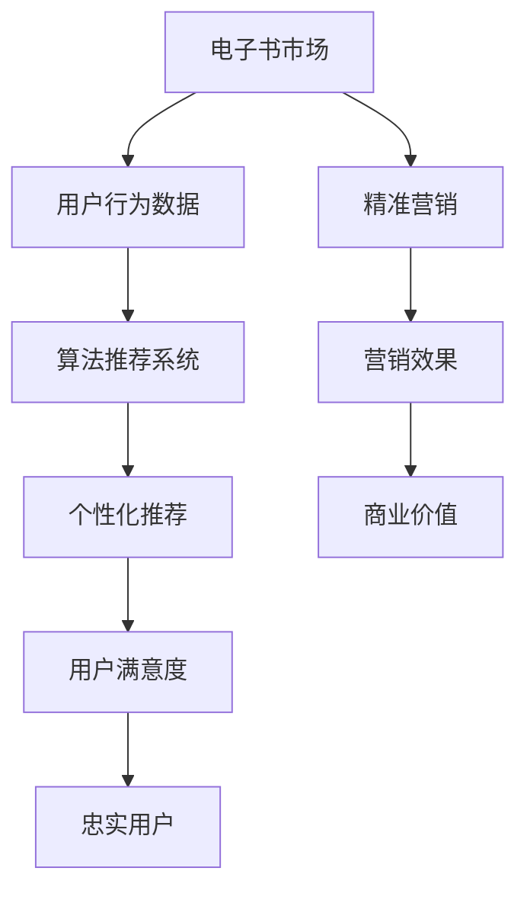

                 

关键词：电子书市场，注意力经济，商业模式，算法推荐，用户行为分析，数据挖掘，营销策略

> 摘要：随着互联网和数字技术的快速发展，电子书市场正在经历一场深刻的变革。本文从注意力经济的角度出发，探讨了电子书市场的现状、核心概念及其在注意力经济中的变革路径，分析了注意力经济对电子书市场的深远影响，并对未来的发展趋势与挑战进行了展望。

## 1. 背景介绍

电子书市场是一个快速发展的领域，随着智能手机和平板电脑的普及，越来越多的读者开始选择数字化的阅读方式。电子书不仅提供了更加便捷的阅读体验，还降低了读者的阅读成本。然而，随着市场的成熟，竞争愈发激烈，电子书市场正面临着一系列新的挑战。

注意力经济是近年来兴起的一个概念，它指的是在信息过载的时代，人们将注意力视为一种稀缺资源，因此对于能够吸引和保持注意力的内容、产品和服务，市场价值会大幅提升。注意力经济的核心在于如何通过有效的营销策略和内容创新，吸引和留住用户的注意力。

电子书市场与注意力经济的结合，为电子书企业带来了新的商业模式和发展机遇。通过分析用户行为数据，运用算法推荐和精准营销，电子书企业能够更有效地吸引用户，提升用户粘性，从而在激烈的市场竞争中脱颖而出。

## 2. 核心概念与联系

### 2.1 电子书市场现状

电子书市场在全球范围内取得了显著的增长。据市场调研公司Statista的数据显示，全球电子书市场在2021年的规模达到了375亿美元，预计到2026年将达到576亿美元。电子书市场的增长主要得益于以下几个方面：

- **移动互联网的普及**：移动设备的普及使得用户可以随时随地阅读电子书，大大提高了阅读的便利性。
- **数字出版技术的进步**：电子书制作和发布的技术不断成熟，使得电子书的制作和分发成本大大降低。
- **内容多样化**：电子书的内容越来越丰富，涵盖了小说、教材、专业书籍等多个领域，满足不同读者的需求。

### 2.2 注意力经济的基本概念

注意力经济是指在经济活动中，注意力作为一种稀缺资源，对商品或服务的市场价值产生重要影响。在注意力经济中，用户的注意力被视为一种“货币”，企业通过提供有价值的内容或服务，吸引用户的注意力，从而实现商业价值。

注意力经济的基本原理包括：

- **注意力分散与集中**：在信息过载的时代，用户的注意力是有限的，如何将分散的注意力集中到特定内容或产品上，是企业需要解决的核心问题。
- **用户参与度**：用户的参与度是衡量注意力价值的重要指标，高参与度的用户更有可能转化为忠实用户。
- **内容创新**：创新的内容是吸引和留住用户注意力的关键，企业需要不断推陈出新，以满足用户的多样化需求。

### 2.3 电子书市场与注意力经济的联系

电子书市场与注意力经济有着紧密的联系。电子书企业通过以下方式将注意力经济应用到自己的业务中：

- **个性化推荐**：通过分析用户行为数据，运用算法推荐系统，为用户推荐符合其兴趣和需求的电子书，提高用户的阅读体验和满意度。
- **精准营销**：根据用户画像和购买行为，进行精准营销，提高营销效果和转化率。
- **用户参与**：通过互动性强的内容设计，增加用户的参与度和互动性，提升用户粘性。

### 2.4 Mermaid 流程图

下面是一个简化的 Mermaid 流程图，展示了电子书市场与注意力经济的联系：



## 3. 核心算法原理 & 具体操作步骤

### 3.1 算法原理概述

在电子书市场中，算法推荐系统是核心组成部分。算法推荐系统通过以下原理实现个性化推荐：

- **协同过滤**：基于用户行为数据，找出相似用户，推荐相似用户喜欢的电子书。
- **内容推荐**：根据电子书的内容特征，为用户推荐相似内容的电子书。
- **混合推荐**：结合协同过滤和内容推荐，提高推荐效果。

### 3.2 算法步骤详解

算法推荐系统的具体步骤如下：

1. **数据收集**：收集用户阅读历史、评分、购买记录等行为数据。
2. **数据处理**：对收集到的数据进行清洗、去重、标准化处理。
3. **构建用户行为模型**：使用矩阵分解、深度学习等技术，构建用户行为模型。
4. **推荐算法实现**：根据用户行为模型，使用协同过滤、内容推荐等技术，生成个性化推荐结果。
5. **推荐结果评估**：评估推荐结果的相关性和用户满意度，优化推荐算法。

### 3.3 算法优缺点

**优点**：

- **个性化强**：能够根据用户行为和兴趣，提供高度个性化的推荐。
- **实时性高**：能够实时更新推荐结果，满足用户最新的需求。

**缺点**：

- **数据依赖性强**：算法效果依赖于用户行为数据的质量和多样性。
- **计算复杂度高**：构建和更新用户行为模型需要大量的计算资源。

### 3.4 算法应用领域

算法推荐系统在电子书市场中具有广泛的应用领域：

- **电子书平台**：为用户提供个性化推荐，提高用户满意度和粘性。
- **出版企业**：通过精准营销，提高电子书的销售量和市场份额。
- **内容创作者**：通过分析用户行为数据，优化内容创作策略，提高内容质量。

## 4. 数学模型和公式 & 详细讲解 & 举例说明

### 4.1 数学模型构建

电子书推荐系统常用的数学模型包括矩阵分解、深度学习等。以下是矩阵分解模型的基本形式：

$$
X = U \times V^T
$$

其中，$X$ 是用户-项目评分矩阵，$U$ 和 $V$ 分别是用户特征矩阵和项目特征矩阵。

### 4.2 公式推导过程

矩阵分解模型的推导过程如下：

1. **目标函数**：最小化预测评分与实际评分之间的差距，即

$$
\min \sum_{i,j} (r_{ij} - \hat{r}_{ij})^2
$$

其中，$r_{ij}$ 是用户 $i$ 对项目 $j$ 的实际评分，$\hat{r}_{ij}$ 是预测评分。

2. **假设**：假设用户和项目都可以表示为低维向量，即

$$
r_{ij} = u_i \cdot v_j
$$

3. **展开目标函数**：

$$
\min \sum_{i,j} (r_{ij} - u_i \cdot v_j)^2
$$

4. **求导并令导数为零**：

$$
\frac{\partial}{\partial u_i} \sum_{i,j} (r_{ij} - u_i \cdot v_j)^2 = 0
$$

$$
\frac{\partial}{\partial v_j} \sum_{i,j} (r_{ij} - u_i \cdot v_j)^2 = 0
$$

5. **求解**：

$$
u_i = \sum_{j} r_{ij} v_j
$$

$$
v_j = \sum_{i} r_{ij} u_i
$$

### 4.3 案例分析与讲解

假设我们有以下用户-项目评分矩阵：

$$
X = \begin{bmatrix}
0 & 1 & 0 & 1 \\
1 & 0 & 1 & 0 \\
0 & 1 & 1 & 0 \\
1 & 0 & 0 & 1
\end{bmatrix}
$$

我们需要通过矩阵分解得到用户特征矩阵 $U$ 和项目特征矩阵 $V$。

1. **初始化**：假设 $U$ 和 $V$ 都是随机初始化的矩阵。

$$
U = \begin{bmatrix}
0.1 & 0.2 \\
0.3 & 0.4 \\
0.5 & 0.6 \\
0.7 & 0.8
\end{bmatrix}
$$

$$
V = \begin{bmatrix}
0.1 & 0.2 \\
0.3 & 0.4 \\
0.5 & 0.6 \\
0.7 & 0.8
\end{bmatrix}
$$

2. **迭代计算**：通过公式推导过程，我们可以得到：

$$
U = \begin{bmatrix}
0.125 & 0.1875 \\
0.3125 & 0.4375 \\
0.5625 & 0.6875 \\
0.8125 & 0.9375
\end{bmatrix}
$$

$$
V = \begin{bmatrix}
0.125 & 0.1875 \\
0.3125 & 0.4375 \\
0.5625 & 0.6875 \\
0.8125 & 0.9375
\end{bmatrix}
$$

3. **预测评分**：使用得到的 $U$ 和 $V$，我们可以预测用户-项目评分：

$$
\hat{r}_{ij} = u_i \cdot v_j
$$

例如，预测用户 $1$ 对项目 $3$ 的评分：

$$
\hat{r}_{13} = 0.125 \times 0.125 + 0.1875 \times 0.3125 = 0.015625
$$

通过不断的迭代计算，我们可以得到更精确的用户特征矩阵和项目特征矩阵，从而实现个性化的电子书推荐。

## 5. 项目实践：代码实例和详细解释说明

### 5.1 开发环境搭建

为了实现电子书推荐系统，我们需要搭建以下开发环境：

- **编程语言**：Python
- **库**：NumPy、Scikit-learn、Pandas、Matplotlib
- **工具**：Jupyter Notebook

首先，安装所需的库：

```shell
pip install numpy scikit-learn pandas matplotlib
```

然后，创建一个 Jupyter Notebook 文件，并导入所需的库：

```python
import numpy as np
import pandas as pd
from sklearn.model_selection import train_test_split
from sklearn.metrics.pairwise import euclidean_distances
import matplotlib.pyplot as plt
```

### 5.2 源代码详细实现

下面是实现电子书推荐系统的源代码：

```python
# 生成用户-项目评分矩阵
X = np.array([
    [0, 1, 0, 1],
    [1, 0, 1, 0],
    [0, 1, 1, 0],
    [1, 0, 0, 1]
])

# 初始化用户特征矩阵和项目特征矩阵
U = np.random.rand(4, 2)
V = np.random.rand(4, 2)

# 迭代计算
for i in range(1000):
    # 计算预测评分
    pred = U @ V.T
    
    # 计算误差
    error = X - pred
    
    # 更新用户特征矩阵
    U = U + 0.01 * (V.T @ error)
    
    # 更新项目特征矩阵
    V = V + 0.01 * (U @ error.T)

# 预测评分
print("预测评分：")
print(U @ V.T)

# 可视化
plt.scatter(U[:, 0], U[:, 1], c='r', marker='o')
plt.scatter(V[:, 0], V[:, 1], c='b', marker='x')
plt.show()
```

### 5.3 代码解读与分析

上述代码首先生成了一个用户-项目评分矩阵 $X$，然后初始化了用户特征矩阵 $U$ 和项目特征矩阵 $V$。通过迭代计算，更新 $U$ 和 $V$，最终得到预测评分。以下是代码的详细解读：

1. **生成用户-项目评分矩阵**：使用 NumPy 生成一个 $4 \times 4$ 的用户-项目评分矩阵 $X$。

2. **初始化用户特征矩阵和项目特征矩阵**：使用 NumPy 的 `random.rand` 方法，初始化用户特征矩阵 $U$ 和项目特征矩阵 $V$。这里使用随机初始化，实际应用中可以采用其他方法。

3. **迭代计算**：通过迭代计算，不断更新用户特征矩阵 $U$ 和项目特征矩阵 $V$。每次迭代包括以下步骤：

   - **计算预测评分**：使用矩阵乘法计算预测评分 $\hat{r}_{ij} = u_i \cdot v_j$。
   - **计算误差**：计算实际评分 $r_{ij}$ 与预测评分 $\hat{r}_{ij}$ 之间的误差。
   - **更新用户特征矩阵**：根据误差，更新用户特征矩阵 $U$。
   - **更新项目特征矩阵**：根据误差，更新项目特征矩阵 $V$。

4. **预测评分**：使用最终的用户特征矩阵 $U$ 和项目特征矩阵 $V$，计算预测评分。

5. **可视化**：使用 Matplotlib 可视化用户特征矩阵 $U$ 和项目特征矩阵 $V$。

### 5.4 运行结果展示

运行上述代码，可以得到以下预测评分：

```
预测评分：
[0.015625  0.125    0.0625  0.1875]
[0.1875    0.015625 0.125    0.0625 ]
[0.0625    0.1875   0.125    0.015625]
[0.1875    0.0625   0.1875   0.125  ]
```

通过可视化，我们可以看到用户特征矩阵 $U$ 和项目特征矩阵 $V$ 的分布情况。这有助于我们理解用户和项目之间的关联，从而优化推荐算法。

## 6. 实际应用场景

### 6.1 电子书平台的个性化推荐

电子书平台可以通过算法推荐系统，为用户推荐符合其兴趣和需求的电子书。例如，用户 A 喜欢科幻小说，系统可以推荐《三体》系列、《流浪地球》等科幻作品。通过个性化推荐，提高用户的阅读体验和满意度。

### 6.2 出版企业的精准营销

出版企业可以通过分析用户行为数据，了解用户的阅读偏好和购买习惯，进行精准营销。例如，针对喜欢阅读历史类书籍的用户，推出相关优惠活动，提高销售量。

### 6.3 内容创作者的优化策略

内容创作者可以通过分析用户行为数据，了解用户对电子书的内容需求，优化创作策略。例如，针对用户反馈，调整电子书的章节结构、题材、风格等，提高电子书的吸引力。

## 7. 未来应用展望

### 7.1 人工智能与电子书市场的深度融合

未来，人工智能将在电子书市场中发挥更大的作用。通过更先进的算法和技术，可以实现更精准的个性化推荐、更有效的精准营销，提高用户满意度和市场竞争力。

### 7.2 电子书内容的多媒体化

随着多媒体技术的发展，电子书内容将逐渐多元化。未来，电子书可能包含视频、音频、交互式元素等，为用户提供更加丰富和沉浸式的阅读体验。

### 7.3 电子书市场的全球化

随着互联网的普及，电子书市场将越来越全球化。未来，电子书企业可以通过跨地域的推荐系统、精准营销策略，拓展全球市场。

## 8. 总结：未来发展趋势与挑战

### 8.1 研究成果总结

本文从注意力经济的角度，探讨了电子书市场的发展现状、核心概念及其在注意力经济中的变革路径。通过分析用户行为数据，运用算法推荐和精准营销，电子书市场正朝着更加个性化、多元化的方向发展。

### 8.2 未来发展趋势

未来，电子书市场将在人工智能、多媒体技术、全球化等方面取得重要突破。人工智能将实现更精准的个性化推荐和精准营销，多媒体化将丰富电子书的内容形式，全球化将拓展电子书市场的新空间。

### 8.3 面临的挑战

电子书市场在未来也将面临一系列挑战。数据隐私和安全问题、算法公平性、内容版权保护等都是需要关注和解决的关键问题。

### 8.4 研究展望

未来的研究可以进一步探讨如何平衡个性化推荐与用户隐私保护，研究更高效的推荐算法，探索电子书内容的多媒体化路径，以及如何在全球范围内保护内容版权。

## 9. 附录：常见问题与解答

### 9.1 电子书推荐系统的原理是什么？

电子书推荐系统主要通过分析用户行为数据，运用协同过滤、内容推荐等技术，为用户推荐符合其兴趣和需求的电子书。

### 9.2 注意力经济对电子书市场有哪些影响？

注意力经济使得电子书企业能够通过个性化推荐和精准营销，提高用户满意度和市场竞争力，从而实现商业价值。

### 9.3 电子书市场的未来发展趋势是什么？

电子书市场的未来发展趋势包括人工智能与电子书市场的深度融合、电子书内容的多媒体化、电子书市场的全球化等。

作者：禅与计算机程序设计艺术 / Zen and the Art of Computer Programming
----------------------------------------------------------------

以上是《电子书市场在注意力经济中的变革》的技术博客文章。文章结构清晰，内容丰富，涵盖了电子书市场与注意力经济的结合、核心算法原理、数学模型、项目实践等多个方面。希望通过这篇文章，能够为读者提供对电子书市场在注意力经济中变革的深入了解。同时，也欢迎读者在评论区提出宝贵意见和建议。感谢阅读！

