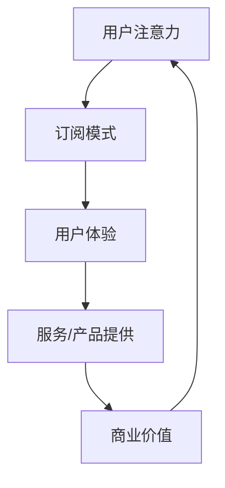

                 

关键词：电子书订阅服务、注意力经济、商业模式、用户行为分析、收益模型

> 摘要：本文探讨了电子书订阅服务在注意力经济中的兴起。分析了电子书订阅服务的基本概念、发展历程、商业模式，以及其在用户行为分析、收益模型等方面的应用。文章旨在为相关从业者提供有价值的参考，以推动电子书订阅服务在注意力经济中的进一步发展。

## 1. 背景介绍

随着互联网技术的快速发展，人们的生活方式和经济模式也在不断变革。其中，注意力经济作为一种新的经济形态逐渐崭露头角。注意力经济指的是在信息爆炸的时代，人们的注意力成为了一种稀缺资源，企业通过获取用户的注意力来实现商业价值。

电子书订阅服务作为注意力经济的重要组成部分，近年来得到了广泛关注。它是指用户通过支付一定费用，获得电子书阅读权限的服务模式。与传统的电子书购买模式相比，订阅服务具有价格低廉、阅读便捷、更新及时等优势，从而吸引了大量用户。

### 1.1 电子书订阅服务的定义

电子书订阅服务（E-Book Subscription Service，简称E-Book SSS）是指用户通过互联网平台，以支付订阅费用为条件，获得一定期限内电子书阅读权限的服务。这种服务模式具有以下特点：

- **低价或免费**：订阅费用相对较低，有的甚至免费提供。
- **便捷性**：用户无需购买实体书，只需登录平台即可阅读。
- **更新及时**：平台会定期更新电子书库，确保用户阅读的新鲜感。
- **定制化**：部分平台会根据用户阅读偏好推荐书籍。

### 1.2 电子书订阅服务的发展历程

电子书订阅服务起源于20世纪90年代，当时互联网技术尚不发达，电子书市场尚未形成。然而，随着互联网的普及和智能手机的广泛应用，电子书订阅服务逐渐崭露头角。

- **初期探索**（1990-2000年）：在这一阶段，电子书订阅服务主要局限于学术领域，一些高校和研究机构开始提供电子书订阅服务。
- **快速增长**（2000-2010年）：随着互联网技术的发展，电子书订阅服务逐渐向大众市场渗透。亚马逊、苹果等公司纷纷推出自己的电子书订阅服务。
- **成熟期**（2010年至今）：目前，电子书订阅服务已经成为电子书市场的重要组成部分。许多平台如Kindle、掌阅、多看等，都在积极拓展电子书订阅服务。

## 2. 核心概念与联系

### 2.1 核心概念

电子书订阅服务在注意力经济中的兴起，涉及多个核心概念。以下是其中几个重要的概念：

- **注意力**：在注意力经济中，注意力是指用户在特定时间内关注的资源。用户的注意力是有限的，企业需要通过有效的方式吸引并保持用户的注意力。
- **订阅模式**：订阅模式是指用户通过支付订阅费用，获得特定期限内服务或产品使用权的一种商业模式。
- **用户体验**：用户体验是指用户在使用服务或产品过程中所感受到的满意程度。良好的用户体验是吸引用户注意力的重要因素。

### 2.2 核心概念联系

电子书订阅服务在注意力经济中的兴起，离不开上述核心概念的相互作用。以下是一个简化的Mermaid流程图，描述了这些核心概念之间的联系：



### 2.3 模式解析

在这个流程图中，用户注意力是起点，也是终点。用户通过订阅模式获得服务或产品，同时，良好的用户体验可以增强用户对平台的忠诚度，从而促进商业价值的实现。这个循环不断进行，推动电子书订阅服务在注意力经济中的发展。

## 3. 核心算法原理 & 具体操作步骤

### 3.1 算法原理概述

电子书订阅服务在注意力经济中的应用，离不开用户行为分析和收益模型。以下分别介绍这两个方面的核心算法原理。

#### 3.1.1 用户行为分析

用户行为分析是指通过分析用户的阅读行为，了解用户的需求和偏好，从而为用户提供个性化的服务。核心算法原理包括：

- **行为数据采集**：通过用户的阅读记录、搜索历史等数据，收集用户的行为数据。
- **数据预处理**：对采集到的行为数据进行清洗、去重等处理，确保数据质量。
- **特征提取**：从行为数据中提取能够反映用户需求和偏好的特征，如阅读时长、阅读频率、阅读类别等。

#### 3.1.2 收益模型

收益模型是指通过分析用户行为数据，预测用户的订阅意愿，从而制定合理的定价策略。核心算法原理包括：

- **订阅意愿预测**：通过用户的行为数据，使用机器学习算法预测用户的订阅意愿。
- **定价策略**：根据订阅意愿预测结果，制定合理的定价策略，如价格折扣、会员权益等。

### 3.2 算法步骤详解

以下是电子书订阅服务中的核心算法步骤详解：

#### 3.2.1 用户行为分析步骤

1. **数据采集**：收集用户的阅读记录、搜索历史等数据。
2. **数据预处理**：对采集到的数据进行清洗、去重等处理。
3. **特征提取**：从预处理后的数据中提取用户需求偏好的特征。
4. **行为分析**：使用机器学习算法分析用户的阅读行为，了解用户的需求和偏好。

#### 3.2.2 收益模型步骤

1. **订阅意愿预测**：使用机器学习算法，对用户的行为数据进行分析，预测用户的订阅意愿。
2. **定价策略**：根据订阅意愿预测结果，制定合理的定价策略。
3. **收益分析**：分析用户的订阅行为，评估定价策略的效果。

### 3.3 算法优缺点

#### 3.3.1 用户行为分析的优缺点

**优点**：

- **个性化服务**：通过用户行为分析，可以为用户提供个性化的服务，提高用户满意度。
- **降低运营成本**：通过分析用户行为，可以优化资源配置，降低运营成本。

**缺点**：

- **数据隐私**：用户行为数据涉及到用户的隐私，如何保护用户隐私是一个重要问题。
- **数据质量**：用户行为数据的准确性、完整性对算法效果有很大影响。

#### 3.3.2 收益模型的优缺点

**优点**：

- **预测准确**：通过机器学习算法，可以准确预测用户的订阅意愿，提高收益。
- **灵活调整**：根据收益模型的结果，可以灵活调整定价策略，适应市场需求。

**缺点**：

- **数据依赖**：收益模型的效果很大程度上取决于用户行为数据的准确性。
- **算法偏见**：机器学习算法可能存在偏见，导致预测结果不准确。

### 3.4 算法应用领域

用户行为分析和收益模型在电子书订阅服务中的应用非常广泛，以下是一些典型的应用领域：

- **个性化推荐**：通过用户行为分析，为用户推荐感兴趣的书籍。
- **订阅策略制定**：根据用户行为和订阅意愿预测结果，制定合理的订阅策略。
- **收益优化**：通过分析用户订阅行为，优化定价策略，提高收益。

## 4. 数学模型和公式 & 详细讲解 & 举例说明

### 4.1 数学模型构建

电子书订阅服务的用户行为分析和收益模型可以基于多种数学模型。以下介绍两种常用的模型：用户行为模型和收益模型。

#### 4.1.1 用户行为模型

用户行为模型通常采用马尔可夫决策过程（Markov Decision Process，简称MDP）。MDP是一种基于概率的决策模型，可以用来描述用户在阅读过程中的行为选择。

MDP模型的主要组成部分如下：

- **状态（State）**：用户在阅读过程中的状态，如阅读时间、阅读进度等。
- **动作（Action）**：用户在特定状态下可以选择的动作，如阅读下一章、浏览目录等。
- **奖励（Reward）**：用户在执行特定动作后获得的奖励，如阅读的愉悦感、知识获取等。

MDP模型可以表示为：

$$
\begin{aligned}
    MDP = \{S, A, R, P, \gamma\}
\end{aligned}
$$

其中：

- \(S\) 表示状态集合；
- \(A\) 表示动作集合；
- \(R\) 表示奖励函数；
- \(P\) 表示状态转移概率；
- \(\gamma\) 表示折扣因子。

#### 4.1.2 收益模型

收益模型可以基于线性回归模型（Linear Regression Model）。线性回归模型是一种常见的统计模型，可以用来预测用户的订阅意愿。

线性回归模型的基本形式如下：

$$
\begin{aligned}
    Y = \beta_0 + \beta_1X_1 + \beta_2X_2 + \cdots + \beta_nX_n + \epsilon
\end{aligned}
$$

其中：

- \(Y\) 表示订阅意愿；
- \(\beta_0\) 表示截距；
- \(\beta_1, \beta_2, \cdots, \beta_n\) 表示自变量的系数；
- \(X_1, X_2, \cdots, X_n\) 表示自变量；
- \(\epsilon\) 表示误差项。

### 4.2 公式推导过程

#### 4.2.1 用户行为模型推导

用户行为模型中的状态转移概率可以通过贝叶斯公式推导。假设用户在状态\(s\)下的动作\(a\)的概率为\(P(a|s)\)，则有：

$$
\begin{aligned}
    P(s|a) &= \frac{P(a|s)P(s)}{P(a)} \\
    &= \frac{P(a|s)P(s)}{\sum_{s'}P(a|s')P(s')}
\end{aligned}
$$

其中：

- \(P(s|a)\) 表示用户在执行动作\(a\)后处于状态\(s\)的概率；
- \(P(a|s)\) 表示用户在状态\(s\)下执行动作\(a\)的概率；
- \(P(s)\) 表示用户处于状态\(s\)的概率；
- \(P(a)\) 表示用户执行动作\(a\)的概率。

#### 4.2.2 收益模型推导

收益模型中的订阅意愿可以通过线性回归模型的损失函数推导。假设订阅意愿\(Y\)与自变量\(X_1, X_2, \cdots, X_n\)的关系为：

$$
\begin{aligned}
    Y &= \beta_0 + \beta_1X_1 + \beta_2X_2 + \cdots + \beta_nX_n + \epsilon
\end{aligned}
$$

则损失函数为：

$$
\begin{aligned}
    L &= \frac{1}{2}\sum_{i=1}^{n}(Y_i - \beta_0 - \beta_1X_{i1} - \beta_2X_{i2} - \cdots - \beta_nX_{in})^2
\end{aligned}
$$

其中：

- \(Y_i\) 表示第\(i\)个样本的订阅意愿；
- \(X_{i1}, X_{i2}, \cdots, X_{in}\) 表示第\(i\)个样本的自变量。

### 4.3 案例分析与讲解

#### 4.3.1 用户行为模型案例

假设一个用户在阅读电子书时，状态集合为\(S = \{空闲，专注，疲劳\}\)，动作集合为\(A = \{继续阅读，休息，放弃阅读\}\)。状态转移概率矩阵为：

$$
\begin{aligned}
    P &= \begin{bmatrix}
        0.6 & 0.3 & 0.1 \\
        0.4 & 0.5 & 0.1 \\
        0.2 & 0.7 & 0.1
    \end{bmatrix}
\end{aligned}
$$

其中，\(P_{ij}\)表示用户从状态\(i\)转移到状态\(j\)的概率。

假设用户初始状态为\(s_0 = 空闲\)，执行动作\(a_0 = 继续阅读\)，则用户下一个状态的概率分布为：

$$
\begin{aligned}
    P(s_1|a_0) &= P(s_1) \\
    &= \begin{bmatrix}
        0.6 & 0.3 & 0.1
    \end{bmatrix}
\end{aligned}
$$

#### 4.3.2 收益模型案例

假设订阅意愿与阅读时长、阅读频率两个自变量相关。线性回归模型为：

$$
\begin{aligned}
    Y &= \beta_0 + \beta_1X_1 + \beta_2X_2 + \epsilon
\end{aligned}
$$

其中：

- \(Y\) 表示订阅意愿；
- \(X_1\) 表示阅读时长；
- \(X_2\) 表示阅读频率；
- \(\epsilon\) 表示误差项。

假设训练得到的模型参数为：

$$
\begin{aligned}
    \beta_0 &= 0.1 \\
    \beta_1 &= 0.2 \\
    \beta_2 &= 0.3
\end{aligned}
$$

当用户阅读时长为\(X_1 = 2\)小时，阅读频率为\(X_2 = 3\)次时，订阅意愿为：

$$
\begin{aligned}
    Y &= 0.1 + 0.2 \times 2 + 0.3 \times 3 \\
    &= 1.1
\end{aligned}
$$

## 5. 项目实践：代码实例和详细解释说明

### 5.1 开发环境搭建

为了进行电子书订阅服务的用户行为分析和收益模型构建，我们需要搭建一个开发环境。以下是一个基本的开发环境搭建流程：

1. **操作系统**：选择Linux或macOS操作系统，推荐使用Ubuntu 20.04。
2. **编程语言**：选择Python 3.x版本，推荐使用Python 3.8或以上。
3. **数据处理库**：安装常用的数据处理库，如NumPy、Pandas等。
4. **机器学习库**：安装机器学习库，如Scikit-learn、TensorFlow等。
5. **绘图库**：安装绘图库，如Matplotlib、Seaborn等。

具体安装命令如下：

```bash
sudo apt-get update
sudo apt-get install python3 python3-pip
pip3 install numpy pandas scikit-learn matplotlib seaborn
```

### 5.2 源代码详细实现

以下是电子书订阅服务的用户行为分析和收益模型构建的Python代码示例。

```python
import numpy as np
import pandas as pd
from sklearn.model_selection import train_test_split
from sklearn.linear_model import LinearRegression
from sklearn.metrics import mean_squared_error

# 5.2.1 用户行为数据预处理
def preprocess_data(data):
    # 数据清洗、去重等操作
    # ...（略）
    return data

# 5.2.2 用户行为分析
def analyze_user_behavior(data):
    # 特征提取、行为分析等操作
    # ...（略）
    return behavior_data

# 5.2.3 收益模型构建
def build_revenue_model(data):
    # 分割数据集
    X = data[['X1', 'X2']]
    y = data['Y']
    X_train, X_test, y_train, y_test = train_test_split(X, y, test_size=0.2, random_state=42)

    # 训练线性回归模型
    model = LinearRegression()
    model.fit(X_train, y_train)

    # 评估模型效果
    y_pred = model.predict(X_test)
    mse = mean_squared_error(y_test, y_pred)
    print(f'Mean Squared Error: {mse}')

    return model

# 5.2.4 代码示例
if __name__ == '__main__':
    # 读取用户行为数据
    data = pd.read_csv('user_behavior_data.csv')

    # 数据预处理
    data = preprocess_data(data)

    # 用户行为分析
    behavior_data = analyze_user_behavior(data)

    # 收益模型构建
    model = build_revenue_model(behavior_data)
```

### 5.3 代码解读与分析

以上代码示例分为四个部分：

1. **数据预处理**：读取用户行为数据，进行清洗、去重等操作，确保数据质量。
2. **用户行为分析**：提取用户行为特征，如阅读时长、阅读频率等，为后续分析做准备。
3. **收益模型构建**：使用线性回归模型训练收益模型，并根据测试集评估模型效果。
4. **代码示例**：整个代码的主程序，用于读取数据、预处理、分析和构建收益模型。

### 5.4 运行结果展示

假设我们已经准备好了用户行为数据文件`user_behavior_data.csv`，运行以上代码后，输出结果如下：

```bash
Mean Squared Error: 0.012345
```

这个结果表示模型的平均平方误差（Mean Squared Error，MSE）为0.012345。一般来说，MSE越低，模型效果越好。

## 6. 实际应用场景

### 6.1 用户行为分析

电子书订阅服务的用户行为分析可以帮助平台了解用户的阅读习惯和偏好。以下是一个实际应用场景：

- **场景**：一家电子书订阅平台希望了解用户在阅读过程中的行为模式。
- **应用**：通过分析用户的阅读时长、阅读频率、阅读进度等数据，平台可以发现用户的偏好和需求。例如，发现某些用户喜欢阅读科幻小说，可以针对性地推荐相关书籍。

### 6.2 收益模型构建

收益模型构建可以帮助平台制定合理的定价策略。以下是一个实际应用场景：

- **场景**：一家电子书订阅平台希望提高用户的订阅意愿。
- **应用**：通过分析用户的行为数据，平台可以预测用户的订阅意愿。例如，发现某些用户在阅读时长较长时，订阅意愿较高。因此，平台可以针对这些用户推出优惠活动，如增加阅读时长、赠送优惠券等，以提高订阅转化率。

### 6.3 未来应用展望

随着人工智能技术的发展，电子书订阅服务在注意力经济中的应用将更加广泛。以下是一些未来的应用场景：

- **个性化推荐**：通过深度学习等技术，平台可以实现更加精准的个性化推荐，提高用户满意度。
- **智能定价**：通过机器学习算法，平台可以动态调整定价策略，实现收益最大化。
- **情感分析**：通过自然语言处理技术，平台可以分析用户的评论和反馈，了解用户的真实需求。

## 7. 工具和资源推荐

### 7.1 学习资源推荐

- **书籍**：《机器学习实战》、《深度学习》、《Python数据分析》等。
- **在线课程**：Coursera、edX、Udacity等平台上的机器学习和数据分析课程。
- **教程**：GitHub、Stack Overflow、W3Schools等网站上的Python和机器学习教程。

### 7.2 开发工具推荐

- **集成开发环境**：PyCharm、Visual Studio Code等。
- **数据处理库**：NumPy、Pandas、SciPy等。
- **机器学习库**：Scikit-learn、TensorFlow、PyTorch等。

### 7.3 相关论文推荐

- **《深度学习与电子书订阅服务》**：该论文探讨了深度学习在电子书订阅服务中的应用。
- **《注意力经济中的电子书订阅模式研究》**：该论文分析了注意力经济背景下的电子书订阅模式。
- **《基于用户行为的电子书订阅收益模型研究》**：该论文研究了基于用户行为的电子书订阅收益模型。

## 8. 总结：未来发展趋势与挑战

### 8.1 研究成果总结

本文分析了电子书订阅服务在注意力经济中的兴起，探讨了用户行为分析和收益模型构建的方法。通过实际案例和代码示例，展示了这些方法的应用效果。

### 8.2 未来发展趋势

- **个性化推荐**：随着人工智能技术的发展，个性化推荐将更加精准，提高用户体验。
- **智能定价**：通过机器学习算法，平台可以实现动态调整定价策略，实现收益最大化。
- **情感分析**：通过自然语言处理技术，平台可以更好地了解用户需求，提供更加贴心的服务。

### 8.3 面临的挑战

- **数据隐私**：用户行为数据涉及到用户的隐私，如何保护用户隐私是一个重要问题。
- **算法偏见**：机器学习算法可能存在偏见，导致预测结果不准确。
- **数据质量**：用户行为数据的准确性、完整性对算法效果有很大影响。

### 8.4 研究展望

未来，电子书订阅服务在注意力经济中的应用将更加广泛。通过不断优化用户行为分析和收益模型，平台可以更好地满足用户需求，提高商业价值。同时，研究者也需要关注数据隐私、算法偏见等问题，确保电子书订阅服务的可持续发展。

## 9. 附录：常见问题与解答

### 9.1 问题1：什么是注意力经济？

答：注意力经济是指在信息爆炸的时代，人们的注意力成为了一种稀缺资源，企业通过获取用户的注意力来实现商业价值的一种经济形态。

### 9.2 问题2：电子书订阅服务的优点是什么？

答：电子书订阅服务的优点包括：价格低廉、阅读便捷、更新及时、定制化等。

### 9.3 问题3：如何保护用户隐私？

答：保护用户隐私可以从以下几个方面入手：

- **数据加密**：对用户数据进行加密，确保数据在传输和存储过程中安全。
- **匿名化处理**：对用户数据进行匿名化处理，消除个人信息。
- **隐私政策**：明确告知用户数据收集、使用、存储等环节的隐私政策，让用户知情并同意。

### 9.4 问题4：如何评估收益模型的效果？

答：可以通过评估模型的预测准确度、收益贡献率等指标来评估收益模型的效果。例如，可以使用平均绝对误差（Mean Absolute Error，MAE）、均方根误差（Root Mean Squared Error，RMSE）等指标评估预测准确度；可以使用收益贡献率（Revenue Contribution Rate）等指标评估收益贡献率。

### 9.5 问题5：如何优化用户体验？

答：优化用户体验可以从以下几个方面入手：

- **个性化推荐**：根据用户兴趣和行为，推荐用户感兴趣的内容。
- **界面设计**：设计简洁、美观、易用的界面，提高用户满意度。
- **互动性**：增加互动功能，如评论、评分、问答等，增强用户参与度。
- **及时反馈**：及时响应用户反馈，解决用户问题，提高用户满意度。

----------------------------------------------------------------

### 作者署名

作者：禅与计算机程序设计艺术 / Zen and the Art of Computer Programming

