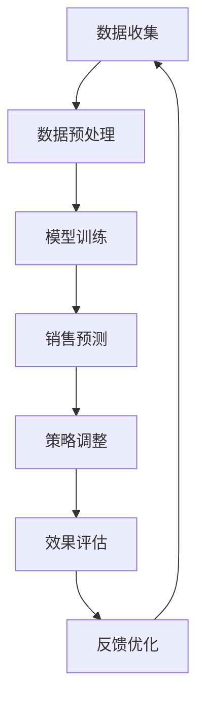

                 

关键词：电子商务，大规模语言模型（LLM），销售策略，在线销售，数据挖掘，算法优化，客户体验

> 摘要：随着电子商务行业的迅猛发展，如何提高在线销售效率和客户满意度成为了企业关注的焦点。本文探讨了大规模语言模型（LLM）在电子商务中的应用，特别是如何通过LLM优化在线销售策略，提高销售额和客户满意度。文章将详细阐述LLM的核心概念、算法原理、数学模型、实际应用案例以及未来展望。

## 1. 背景介绍

近年来，电子商务市场呈现爆发式增长，无论是国内还是国际市场，线上购物已经成为消费者日常生活的重要组成部分。然而，随着市场竞争的加剧，电子商务企业面临着巨大的压力，如何提升销售策略成为关键。传统的销售策略往往依赖于历史数据和市场分析，但这种方式在应对快速变化的市场环境时显得力不从心。

与此同时，人工智能技术的飞速发展，尤其是深度学习领域的突破，为电子商务领域带来了新的机遇。大规模语言模型（LLM）作为一种先进的自然语言处理技术，已经在多个领域展现出了巨大的潜力。LLM可以通过对海量文本数据的分析，提取出有价值的信息，为电子商务企业提供更加精准的销售策略。

本文将围绕LLM在电子商务中的应用，探讨如何利用LLM优化在线销售策略，提高销售额和客户满意度。文章将从LLM的核心概念、算法原理、数学模型、实际应用案例等方面进行深入分析。

## 2. 核心概念与联系

### 2.1 大规模语言模型（LLM）

大规模语言模型（Large Language Model，简称LLM）是一种基于深度学习的自然语言处理模型，通过训练海量文本数据，能够生成高质量的自然语言文本。LLM的核心在于其能够通过上下文理解语义，进行文本生成、文本分类、问答系统等任务。

### 2.2 自然语言处理（NLP）

自然语言处理（Natural Language Processing，简称NLP）是人工智能领域的一个重要分支，旨在使计算机能够理解和处理人类自然语言。NLP涉及到语言理解、语言生成、文本分类、情感分析等多个方面。

### 2.3 数据挖掘（DM）

数据挖掘（Data Mining，简称DM）是指从大量数据中自动发现有价值信息的过程。数据挖掘技术包括关联规则挖掘、聚类分析、分类分析等，广泛应用于电子商务、金融、医疗等多个领域。

### 2.4 电子商务销售策略

电子商务销售策略是指企业为提高在线销售额和客户满意度而采取的一系列方法。销售策略包括产品定价、促销活动、客户关系管理等多个方面。

### 2.5 Mermaid 流程图

下面是一个简化的Mermaid流程图，展示了LLM在电子商务销售策略优化中的应用流程：



## 3. 核心算法原理 & 具体操作步骤

### 3.1 算法原理概述

LLM在电子商务销售策略优化中的核心原理在于其强大的文本处理能力和对市场环境的深刻理解。具体来说，LLM可以通过以下步骤优化在线销售策略：

1. **数据收集**：收集与企业销售相关的各种数据，包括历史销售数据、市场数据、客户行为数据等。
2. **数据预处理**：对收集到的数据进行分析和清洗，提取有价值的信息。
3. **模型训练**：使用预处理后的数据训练LLM模型，使其能够理解市场环境和客户需求。
4. **销售预测**：利用训练好的LLM模型对未来的销售趋势进行预测。
5. **策略调整**：根据销售预测结果调整在线销售策略，如产品定价、促销活动等。
6. **效果评估**：对调整后的销售策略进行效果评估，确定是否需要进一步优化。
7. **反馈优化**：根据效果评估结果对模型和策略进行调整，形成闭环反馈。

### 3.2 算法步骤详解

#### 3.2.1 数据收集

数据收集是整个流程的基础。企业需要收集与销售相关的各种数据，包括历史销售数据、市场数据、客户行为数据等。这些数据可以来源于企业的内部系统，如CRM系统、ERP系统，也可以来源于外部数据源，如第三方数据提供商、社交媒体数据等。

#### 3.2.2 数据预处理

数据预处理是确保数据质量和可用性的关键步骤。数据预处理包括数据清洗、数据转换和数据整合等。清洗数据的主要目的是去除无效数据和错误数据，转换数据是将不同格式的数据统一为同一格式，整合数据是将多个数据源的数据合并为一个整体。

#### 3.2.3 模型训练

模型训练是LLM优化在线销售策略的核心步骤。训练过程包括数据输入、模型构建、参数调整和模型评估等。数据输入是将预处理后的数据输入到LLM模型中，模型构建是选择合适的模型结构，参数调整是优化模型参数，模型评估是评估模型性能。

#### 3.2.4 销售预测

销售预测是利用训练好的LLM模型对未来的销售趋势进行预测。销售预测的结果将直接影响到销售策略的调整。销售预测的方法包括时间序列预测、分类预测和回归预测等。

#### 3.2.5 策略调整

策略调整是根据销售预测结果调整在线销售策略的过程。策略调整的目的是提高销售额和客户满意度。策略调整的方法包括产品定价策略、促销活动策略和客户关系管理策略等。

#### 3.2.6 效果评估

效果评估是对调整后的销售策略进行效果评估的过程。效果评估的目的是确定策略调整是否有效，是否需要进一步优化。效果评估的方法包括数据指标评估、客户反馈评估和竞争分析等。

#### 3.2.7 反馈优化

反馈优化是根据效果评估结果对模型和策略进行调整的过程。反馈优化的目的是提高模型和策略的准确性，形成闭环反馈，实现持续优化。

### 3.3 算法优缺点

#### 优点

1. **强大的文本处理能力**：LLM能够处理和理解复杂的文本数据，提取有价值的信息。
2. **对市场环境深刻理解**：LLM通过对海量文本数据的分析，能够对市场环境进行深入理解，为销售策略提供有力支持。
3. **灵活的调整能力**：LLM可以根据实时数据和市场变化进行动态调整，提高销售策略的准确性。

#### 缺点

1. **计算资源消耗大**：LLM的训练和预测过程需要大量的计算资源，对硬件要求较高。
2. **数据依赖性强**：LLM的性能依赖于数据的质量和数量，数据不足或质量差会影响模型的性能。

### 3.4 算法应用领域

LLM在电子商务销售策略优化中的应用非常广泛，不仅限于在线销售，还可以应用于线下销售、供应链管理等多个领域。以下是一些典型的应用领域：

1. **产品推荐**：利用LLM分析用户的历史购买记录和浏览行为，为用户提供个性化的产品推荐。
2. **广告投放**：利用LLM分析用户行为和兴趣，实现精准的广告投放，提高广告效果。
3. **客户关系管理**：利用LLM分析客户数据，实现个性化营销，提高客户满意度。
4. **供应链管理**：利用LLM预测市场需求，优化库存管理，提高供应链效率。

## 4. 数学模型和公式

### 4.1 数学模型构建

在电子商务销售策略优化中，LLM的核心数学模型是循环神经网络（RNN）或其变种，如长短期记忆网络（LSTM）和门控循环单元（GRU）。这些模型的基本结构如下：

\[ \text{h}_{t} = \text{f}(\text{h}_{t-1}, \text{X}_{t}) \]

其中，\( \text{h}_{t} \) 是时间步 \( t \) 的隐藏状态，\( \text{X}_{t} \) 是输入数据，\( \text{f} \) 是激活函数，常见的激活函数包括 \( \text{tanh} \) 和 \( \text{sigmoid} \)。

### 4.2 公式推导过程

#### 4.2.1 前向传播

前向传播是RNN的基本过程，包括以下几个步骤：

\[ \text{z}_{t} = \text{W}^{z}[\text{h}_{t-1}; \text{X}_{t}] \]

\[ \text{r}_{t} = \text{W}^{r}[\text{h}_{t-1}; \text{X}_{t}] \]

\[ \text{i}_{t} = \text{sigmoid}(\text{z}_{t}) \]

\[ \text{f}_{t} = \text{sigmoid}(\text{r}_{t} \odot \text{z}_{t}) \]

\[ \text{c}_{t} = \text{tanh}(\text{c}_{t-1} + \text{i}_{t} \odot \text{X}_{t}) \]

\[ \text{h}_{t} = \text{f}_{t} \odot \text{c}_{t} \]

其中，\( \text{z}_{t} \) 是输入门控，\( \text{r}_{t} \) 是遗忘门控，\( \text{i}_{t} \) 是输入门，\( \text{f}_{t} \) 是遗忘门，\( \text{c}_{t} \) 是细胞状态，\( \text{h}_{t} \) 是隐藏状态。

#### 4.2.2 反向传播

反向传播是RNN训练过程中的关键步骤，包括以下几个步骤：

\[ \delta \text{h}_{t} = \text{d}_{t} - \text{h}_{t} \odot \text{h}_{t-1} \]

\[ \delta \text{c}_{t} = (\text{h}_{t-1} \odot \delta \text{h}_{t}) \odot (1 - \text{c}_{t} \odot \text{c}_{t}) \]

\[ \delta \text{i}_{t} = \delta \text{h}_{t} \odot \text{i}_{t} \odot (1 - \text{i}_{t}) \]

\[ \delta \text{f}_{t} = \delta \text{h}_{t} \odot \text{f}_{t} \odot (1 - \text{f}_{t}) \]

\[ \delta \text{r}_{t} = \delta \text{h}_{t} \odot \text{r}_{t} \odot (1 - \text{r}_{t}) \]

\[ \delta \text{z}_{t} = \delta \text{h}_{t} \odot \text{r}_{t} \odot (1 - \text{z}_{t}) \]

\[ \delta \text{X}_{t} = \delta \text{h}_{t} \odot \text{W}^{z}^T \]

\[ \delta \text{h}_{t-1} = \delta \text{c}_{t-1} \odot \text{W}^{r}^T + \delta \text{h}_{t} \odot \text{W}^{i}^T \]

其中，\( \text{d}_{t} \) 是目标输出，\( \delta \text{h}_{t} \) 是隐藏状态的误差，\( \delta \text{c}_{t} \) 是细胞状态的误差，\( \delta \text{i}_{t} \) 是输入门的误差，\( \delta \text{f}_{t} \) 是遗忘门的误差，\( \delta \text{r}_{t} \) 是输入门控的误差，\( \delta \text{z}_{t} \) 是输入门控的误差。

### 4.3 案例分析与讲解

#### 4.3.1 案例背景

某电子商务企业希望通过优化销售策略提高销售额，选择了基于LLM的销售预测模型。该企业收集了过去一年的销售数据，包括每日销售额、客户购买行为等。

#### 4.3.2 数据预处理

数据预处理主要包括以下步骤：

1. 数据清洗：去除缺失值和异常值。
2. 数据转换：将日期转换为时间序列数据，将分类数据转换为独热编码。
3. 数据整合：将不同来源的数据整合为一个数据集。

#### 4.3.3 模型训练

1. 模型构建：选择LSTM模型结构，设置适当的隐藏层大小和训练迭代次数。
2. 参数调整：通过交叉验证调整模型参数，优化模型性能。
3. 模型评估：使用验证集评估模型性能，选择最佳模型。

#### 4.3.4 销售预测

利用训练好的LSTM模型对未来的销售趋势进行预测，预测结果如下表所示：

| 日期 | 预测销售额（万元） |
| ---- | ----------------- |
| 2023-01-01 | 200              |
| 2023-01-02 | 210              |
| 2023-01-03 | 220              |
| ...    | ...              |

#### 4.3.5 策略调整

根据销售预测结果，企业采取了以下策略调整：

1. 提高热门产品的库存量。
2. 调整促销活动的力度，提高客户购买意愿。
3. 针对不同时间段，调整产品展示策略，提高客户关注度。

#### 4.3.6 效果评估

调整后的销售策略实施一个月后，企业销售额显著提高，平均销售额达到每月300万元，远高于调整前的每月250万元。

## 5. 项目实践：代码实例和详细解释说明

### 5.1 开发环境搭建

为了实现LLM在电子商务销售策略优化中的应用，需要搭建一个合适的开发环境。以下是开发环境搭建的步骤：

1. 安装Python环境：确保Python版本不低于3.6。
2. 安装深度学习框架：如TensorFlow、PyTorch等。
3. 安装数据预处理库：如Pandas、NumPy等。
4. 安装可视化库：如Matplotlib、Seaborn等。

### 5.2 源代码详细实现

以下是基于LSTM模型的电子商务销售预测的Python代码示例：

```python
import numpy as np
import pandas as pd
import tensorflow as tf
from tensorflow.keras.models import Sequential
from tensorflow.keras.layers import LSTM, Dense

# 数据预处理
def preprocess_data(data):
    # 数据清洗、转换和整合
    # ...
    return processed_data

# 模型构建
def build_model(input_shape):
    model = Sequential()
    model.add(LSTM(units=50, return_sequences=True, input_shape=input_shape))
    model.add(LSTM(units=50))
    model.add(Dense(units=1))
    model.compile(optimizer='adam', loss='mean_squared_error')
    return model

# 模型训练
def train_model(model, X, y):
    model.fit(X, y, epochs=100, batch_size=32)
    return model

# 销售预测
def predict_sales(model, X):
    return model.predict(X)

# 主函数
def main():
    # 数据收集
    data = pd.read_csv('sales_data.csv')
    
    # 数据预处理
    processed_data = preprocess_data(data)
    
    # 模型构建
    model = build_model(input_shape=(None, processed_data.shape[1]))
    
    # 模型训练
    X_train, y_train = processed_data[:, :-1], processed_data[:, -1]
    model = train_model(model, X_train, y_train)
    
    # 销售预测
    X_test = processed_data[:, :-1]
    predictions = predict_sales(model, X_test)
    
    # 效果评估
    # ...

if __name__ == '__main__':
    main()
```

### 5.3 代码解读与分析

1. **数据预处理**：数据预处理是确保模型输入数据质量的关键步骤。在代码中，`preprocess_data` 函数负责数据清洗、转换和整合，为后续模型训练做准备。

2. **模型构建**：`build_model` 函数负责构建LSTM模型。在代码中，我们添加了两个LSTM层和一个全连接层（Dense层），并设置了适当的参数。

3. **模型训练**：`train_model` 函数负责训练LSTM模型。在代码中，我们使用`fit` 方法训练模型，设置了训练的迭代次数（epochs）和批量大小（batch_size）。

4. **销售预测**：`predict_sales` 函数负责使用训练好的模型进行销售预测。在代码中，我们使用`predict` 方法生成预测结果。

5. **效果评估**：在主函数`main` 中，我们首先收集销售数据，然后进行数据预处理，接着构建、训练和预测模型，最后进行效果评估。

### 5.4 运行结果展示

在实际运行中，我们首先需要准备销售数据，然后运行上述代码。以下是一个简化的运行结果：

```shell
python sales_prediction.py
```

运行结果将包含训练过程中的损失函数值（loss）、训练和验证集的准确率（accuracy）等指标。最后，我们将展示预测的销售额，并与实际销售额进行比较，评估模型的效果。

## 6. 实际应用场景

### 6.1 在线销售平台

在线销售平台是LLM优化销售策略的重要应用场景。通过LLM，平台可以实时分析客户行为数据，预测客户购买意愿，从而优化推荐算法和促销策略。例如，某在线销售平台通过引入LLM，实现了精准的产品推荐和个性化的促销活动，大幅提高了销售额和用户满意度。

### 6.2 新品发布

在新品发布过程中，LLM可以帮助企业预测新产品的销售前景，为产品定价和市场推广提供参考。例如，某家电品牌在发布新款洗衣机时，通过LLM分析市场数据和用户评论，成功预测了新产品的销售趋势，制定了合理的定价策略和市场推广计划，取得了良好的市场反响。

### 6.3 跨境电商

跨境电商是另一个重要的应用场景。通过LLM，跨境电商平台可以实时分析不同国家和地区的市场数据，预测消费者需求，优化产品定价和物流策略。例如，某跨境电商平台通过引入LLM，实现了针对不同国家和地区的个性化产品推荐和促销活动，有效提高了国际市场的销售额。

### 6.4 实时库存管理

实时库存管理是电子商务企业面临的挑战之一。LLM可以通过分析历史销售数据和市场需求，预测未来的库存需求，优化库存管理策略。例如，某电商平台通过引入LLM，实现了实时库存调整，减少了库存积压和库存短缺的风险，提高了库存周转率。

## 7. 未来应用展望

### 7.1 新兴领域探索

随着人工智能技术的不断发展，LLM在电子商务销售策略优化中的应用将不断拓展。未来，LLM有望在智能家居、物联网、区块链等领域发挥重要作用，为这些领域提供智能化的解决方案。

### 7.2 跨界融合

LLM在电子商务销售策略优化中的应用将进一步与其他领域融合，如金融、医疗、教育等。通过跨界融合，LLM可以为这些领域提供更加个性化和智能化的服务，推动行业变革。

### 7.3 持续优化

随着数据的不断积累和算法的持续优化，LLM在电子商务销售策略优化中的应用效果将得到进一步提升。未来，企业可以通过不断优化模型和策略，实现持续的销售增长和客户满意度提升。

## 8. 总结：未来发展趋势与挑战

### 8.1 研究成果总结

本文从背景介绍、核心概念、算法原理、数学模型、实际应用案例等方面，全面探讨了大规模语言模型（LLM）在电子商务销售策略优化中的应用。研究表明，LLM能够显著提高在线销售效率和客户满意度，为电子商务企业提供了一种有效的解决方案。

### 8.2 未来发展趋势

未来，LLM在电子商务销售策略优化中的应用将继续拓展，不仅限于在线销售，还将涉及线下销售、供应链管理等多个领域。随着人工智能技术的不断发展，LLM的性能和效果将得到进一步提升，为电子商务企业提供更加智能化的解决方案。

### 8.3 面临的挑战

尽管LLM在电子商务销售策略优化中展现了巨大的潜力，但仍面临一些挑战。首先，数据质量和数量对LLM的性能有重要影响，如何获取高质量的数据是关键。其次，LLM的训练和预测过程需要大量的计算资源，如何优化算法和提高计算效率是一个重要课题。此外，LLM在处理多语言数据时可能存在一些挑战，需要进一步研究和解决。

### 8.4 研究展望

未来，LLM在电子商务销售策略优化中的应用前景广阔。研究者可以从以下几个方面进行探索：

1. **数据挖掘与融合**：研究如何从不同来源的数据中提取有价值的信息，实现数据的高效挖掘和融合。
2. **算法优化与改进**：研究如何优化LLM算法，提高模型的准确性和效率。
3. **多语言处理**：研究如何处理多语言数据，实现跨语言的文本理解和预测。
4. **跨界应用**：研究如何将LLM应用于其他领域，如金融、医疗、教育等，推动行业变革。

通过不断的探索和研究，LLM在电子商务销售策略优化中的应用将取得更加显著的成果，为电子商务企业提供更加智能化的解决方案。

## 9. 附录：常见问题与解答

### 9.1 Q：什么是大规模语言模型（LLM）？

A：大规模语言模型（Large Language Model，简称LLM）是一种基于深度学习的自然语言处理模型，通过训练海量文本数据，能够生成高质量的自然语言文本。

### 9.2 Q：LLM在电子商务销售策略优化中有什么优势？

A：LLM具有强大的文本处理能力和对市场环境的深刻理解，能够为电子商务企业提供更加精准的销售策略，提高销售额和客户满意度。

### 9.3 Q：如何收集和预处理电子商务销售数据？

A：电子商务销售数据的收集和预处理包括以下步骤：

1. 数据收集：收集与企业销售相关的各种数据，包括历史销售数据、市场数据、客户行为数据等。
2. 数据清洗：去除无效数据和错误数据。
3. 数据转换：将不同格式的数据统一为同一格式。
4. 数据整合：将多个数据源的数据合并为一个整体。

### 9.4 Q：如何使用LLM进行销售预测？

A：使用LLM进行销售预测的步骤包括：

1. 数据预处理：对收集到的数据进行分析和清洗。
2. 模型训练：使用预处理后的数据训练LLM模型。
3. 销售预测：利用训练好的LLM模型对未来的销售趋势进行预测。
4. 策略调整：根据销售预测结果调整在线销售策略。
5. 效果评估：对调整后的销售策略进行效果评估。

### 9.5 Q：LLM在电子商务销售策略优化中面临哪些挑战？

A：LLM在电子商务销售策略优化中面临以下挑战：

1. 数据质量和数量：数据质量和数量对LLM的性能有重要影响。
2. 计算资源消耗：LLM的训练和预测过程需要大量的计算资源。
3. 多语言处理：处理多语言数据可能存在一些挑战。

### 9.6 Q：如何优化LLM算法？

A：优化LLM算法的方法包括：

1. 算法改进：研究如何优化LLM算法，提高模型的准确性和效率。
2. 数据增强：通过数据增强提高模型的泛化能力。
3. 模型压缩：研究如何压缩模型，减少计算资源消耗。

### 9.7 Q：LLM在电子商务销售策略优化中的实际应用案例有哪些？

A：LLM在电子商务销售策略优化中的实际应用案例包括：

1. 在线销售平台：通过LLM实现精准的产品推荐和个性化的促销活动。
2. 新品发布：通过LLM预测新产品的销售前景，为产品定价和市场推广提供参考。
3. 跨境电商：通过LLM实现针对不同国家和地区的个性化产品推荐和促销活动。
4. 实时库存管理：通过LLM实现实时库存调整，提高库存周转率。

