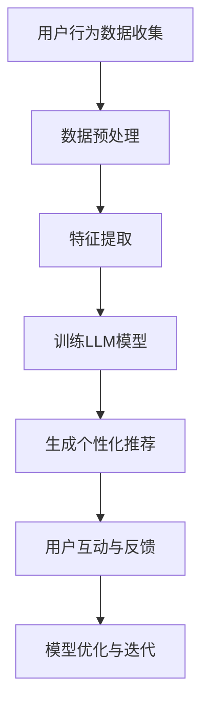

                 

关键词：电子商务、LLM（大型语言模型）、在线销售、数据驱动、个性化推荐、转化率优化、用户体验。

> 摘要：随着电子商务的迅猛发展，如何提高在线销售成为商家关注的焦点。本文将探讨如何利用大型语言模型（LLM）优化电子商务的在线销售流程，包括个性化推荐、用户互动、销售转化等方面的策略。通过深入研究LLM的工作原理、应用场景以及实际操作步骤，旨在为电商企业提供切实可行的优化方案，提升销售业绩和用户满意度。

## 1. 背景介绍

### 1.1 电子商务的发展历程

电子商务（E-commerce）自20世纪90年代兴起以来，已经经历了数十年的快速发展。从最初的电子邮件营销、在线拍卖，到现在的社交电商、直播带货，电子商务模式不断创新，市场规模不断扩大。据统计，全球电子商务市场规模已突破数万亿美元，并在未来仍将保持高速增长。

### 1.2 在线销售的挑战

尽管电子商务带来了巨大的商机，但商家们也面临着诸多挑战。首先，市场竞争日益激烈，同类产品繁多，消费者选择多样，如何吸引潜在客户并提高转化率成为关键。其次，用户需求多变，个性化服务要求提高，商家需要精准把握用户喜好，提供个性化的购物体验。此外，线上销售过程中还面临数据安全、物流配送、售后服务等一系列问题。

### 1.3 大型语言模型（LLM）的优势

为了应对上述挑战，越来越多的商家开始探索利用人工智能技术，特别是大型语言模型（LLM）来优化在线销售流程。LLM具有以下优势：

1. **强大的自然语言处理能力**：LLM能够理解、生成和翻译自然语言，可以应用于对话系统、智能客服、个性化推荐等领域。
2. **自适应学习能力**：LLM可以通过学习大量用户数据，不断优化算法模型，提高推荐的准确性和用户体验。
3. **高效的处理速度**：LLM采用了深度学习技术，可以快速处理大规模数据，为用户实时提供个性化服务。

## 2. 核心概念与联系

为了深入理解LLM在电子商务中的应用，我们需要首先掌握以下几个核心概念：

1. **电子商务平台架构**：了解电子商务平台的整体架构，包括前端用户界面、后端业务逻辑、数据库等组成部分。
2. **用户行为数据**：收集用户在电子商务平台上的行为数据，如浏览记录、购买历史、评价反馈等。
3. **自然语言处理（NLP）**：掌握NLP的基本原理和方法，包括词向量表示、语义分析、对话生成等。
4. **机器学习（ML）**：了解机器学习的基本算法，如回归分析、聚类分析、神经网络等。

下面是一个用Mermaid绘制的流程图，展示了LLM在电子商务平台中的工作流程：



### 2.1 用户行为数据收集

用户行为数据是LLM优化在线销售的基础。通过收集用户在平台上的行为数据，我们可以了解用户的偏好、购买习惯等，从而实现个性化推荐。用户行为数据包括：

1. **浏览记录**：用户在平台上浏览的商品种类、时间、频次等信息。
2. **购买历史**：用户的购买记录、购买金额、购买频率等信息。
3. **评价反馈**：用户对商品的评分、评论等信息。

### 2.2 数据预处理

收集到的用户行为数据通常需要进行预处理，以去除噪声、缺失值、异常值等。数据预处理包括以下几个步骤：

1. **数据清洗**：去除重复数据、处理缺失值、修正错误数据等。
2. **数据整合**：将不同来源的数据进行整合，形成统一的用户行为数据集。
3. **数据转换**：将原始数据转换为适合机器学习算法的格式，如数值化、归一化等。

### 2.3 特征提取

特征提取是将原始数据转换为有助于模型训练的特征向量。在LLM优化在线销售中，常用的特征提取方法包括：

1. **词向量表示**：将文本数据转换为词向量，如Word2Vec、GloVe等。
2. **序列特征**：提取用户行为数据的时序特征，如用户的浏览序列、购买序列等。
3. **图像特征**：对商品图片进行特征提取，如使用卷积神经网络（CNN）提取图像特征。

### 2.4 训练LLM模型

训练LLM模型是整个流程的核心步骤。通过学习用户行为数据和商品信息，LLM可以生成个性化的推荐结果。常用的LLM训练方法包括：

1. **基于协同过滤的方法**：通过用户行为数据计算用户相似度，为用户推荐相似的商品。
2. **基于内容的推荐**：根据商品的属性和用户偏好，为用户推荐相关的商品。
3. **混合推荐系统**：结合协同过滤和基于内容的方法，提高推荐的准确性和多样性。

### 2.5 生成个性化推荐

通过训练好的LLM模型，我们可以为每个用户生成个性化的推荐列表。个性化推荐结果可以帮助用户发现他们可能感兴趣的商品，提高购买意愿。

### 2.6 用户互动与反馈

用户在浏览推荐列表时，会产生一系列交互行为，如点击、收藏、购买等。通过收集用户的互动数据，我们可以进一步优化推荐模型，提高用户体验和转化率。

### 2.7 模型优化与迭代

根据用户的反馈，LLM模型需要进行不断的优化和迭代。通过重新训练模型、调整参数等方式，可以提高推荐的准确性和多样性，满足用户的需求。

## 3. 核心算法原理 & 具体操作步骤

### 3.1 算法原理概述

LLM在电子商务中的应用主要基于以下几个原理：

1. **深度学习**：LLM采用深度学习技术，通过多层神经网络结构学习用户行为数据和商品信息，生成个性化的推荐结果。
2. **自然语言处理**：LLM能够理解自然语言，可以处理用户评论、描述等信息，提取有用的特征。
3. **协同过滤**：LLM结合协同过滤算法，通过计算用户相似度和商品相似度，为用户推荐相关的商品。

### 3.2 算法步骤详解

#### 3.2.1 数据收集与预处理

1. **数据收集**：收集用户在电子商务平台上的行为数据，包括浏览记录、购买历史、评价反馈等。
2. **数据清洗**：去除重复数据、处理缺失值、修正错误数据等。
3. **数据整合**：将不同来源的数据进行整合，形成统一的用户行为数据集。
4. **数据转换**：将原始数据转换为适合机器学习算法的格式，如数值化、归一化等。

#### 3.2.2 特征提取

1. **词向量表示**：使用Word2Vec、GloVe等算法将文本数据转换为词向量。
2. **序列特征提取**：提取用户行为数据的时序特征，如用户的浏览序列、购买序列等。
3. **图像特征提取**：使用卷积神经网络（CNN）提取商品图片的特征。

#### 3.2.3 训练LLM模型

1. **选择模型架构**：选择合适的深度学习模型架构，如BERT、GPT等。
2. **数据预处理**：对数据进行预处理，包括分词、编码等。
3. **模型训练**：使用用户行为数据和商品信息进行模型训练，通过反向传播算法优化模型参数。

#### 3.2.4 生成个性化推荐

1. **用户表示**：将用户行为数据转换为用户表示向量。
2. **商品表示**：将商品信息转换为商品表示向量。
3. **计算相似度**：计算用户表示向量与商品表示向量之间的相似度，生成个性化推荐列表。

#### 3.2.5 用户互动与反馈

1. **用户互动数据收集**：收集用户在浏览推荐列表时的互动数据，如点击、收藏、购买等。
2. **模型优化**：根据用户的反馈，对LLM模型进行优化，提高推荐的准确性和多样性。

#### 3.2.6 模型迭代

1. **重新训练模型**：定期重新训练LLM模型，以适应用户需求的变化。
2. **调整参数**：根据用户反馈，调整模型的参数，提高推荐的准确性。

### 3.3 算法优缺点

#### 优点

1. **个性化推荐**：LLM能够根据用户行为数据生成个性化的推荐结果，提高用户满意度。
2. **实时性**：LLM可以实时处理用户数据，提供实时的个性化推荐。
3. **多样性**：LLM通过计算相似度，可以为用户推荐多种类型的商品，提高推荐的多样性。

#### 缺点

1. **计算资源消耗**：LLM采用深度学习技术，需要大量的计算资源，训练时间较长。
2. **数据质量要求高**：LLM的性能依赖于用户行为数据的完整性和准确性，对数据质量要求较高。

### 3.4 算法应用领域

LLM在电子商务中的应用非常广泛，包括：

1. **个性化推荐**：为用户推荐他们可能感兴趣的商品，提高购买意愿。
2. **智能客服**：利用LLM构建智能客服系统，提供24/7全天候的在线服务。
3. **广告投放**：根据用户兴趣和行为，为用户推荐相关的广告。

## 4. 数学模型和公式 & 详细讲解 & 举例说明

### 4.1 数学模型构建

在LLM优化在线销售中，常用的数学模型包括：

1. **用户表示模型**：使用矩阵分解方法，将用户行为数据表示为用户矩阵和物品矩阵。
2. **商品表示模型**：使用卷积神经网络（CNN）提取商品图像特征，将商品表示为向量。
3. **推荐模型**：结合用户表示模型和商品表示模型，计算用户与商品之间的相似度，生成个性化推荐结果。

### 4.2 公式推导过程

下面是一个简单的用户表示模型的推导过程：

设用户行为数据为矩阵$X$，其中$X_{ij}$表示用户$i$对物品$j$的评分。用户表示矩阵为$U$，物品表示矩阵为$V$。用户表示模型的目标是找到$U$和$V$，使得用户$i$对物品$j$的预测评分$\hat{r}_{ij}$与实际评分$r_{ij}$之间的误差最小。

$$
\min_{U, V} \sum_{i, j} (r_{ij} - \hat{r}_{ij})^2
$$

假设用户行为数据满足正则化条件，即$X = U^T V$。对$U$和$V$分别进行求导，并令导数为零，得到：

$$
U^T V - r = 0 \\
V^T U - r^T = 0
$$

解上述方程组，得到：

$$
U = UX^T X V \\
V = VX^T X U
$$

将$U$和$V$代入预测评分公式，得到：

$$
\hat{r}_{ij} = U_{i}^T V_{j}
$$

### 4.3 案例分析与讲解

#### 案例背景

某电子商务平台希望利用LLM为用户生成个性化的商品推荐。用户行为数据包括浏览记录、购买历史、评价反馈等。商品数据包括商品图片、商品描述、价格等。

#### 数据处理

1. **数据收集**：从平台数据库中收集用户行为数据，包括浏览记录、购买历史、评价反馈等。
2. **数据清洗**：去除重复数据、处理缺失值、修正错误数据等。
3. **数据整合**：将不同来源的数据进行整合，形成统一的用户行为数据集。
4. **数据转换**：将原始数据转换为适合机器学习算法的格式，如数值化、归一化等。

#### 特征提取

1. **词向量表示**：使用Word2Vec算法将商品描述转换为词向量。
2. **图像特征提取**：使用卷积神经网络（CNN）提取商品图片的特征。

#### 模型训练

1. **选择模型架构**：选择合适的深度学习模型架构，如BERT、GPT等。
2. **数据预处理**：对数据进行预处理，包括分词、编码等。
3. **模型训练**：使用用户行为数据和商品信息进行模型训练，通过反向传播算法优化模型参数。

#### 个性化推荐

1. **用户表示**：将用户行为数据转换为用户表示向量。
2. **商品表示**：将商品信息转换为商品表示向量。
3. **计算相似度**：计算用户表示向量与商品表示向量之间的相似度，生成个性化推荐列表。

#### 模型优化与迭代

根据用户反馈，对LLM模型进行优化，提高推荐的准确性和多样性。定期重新训练模型，以适应用户需求的变化。

## 5. 项目实践：代码实例和详细解释说明

### 5.1 开发环境搭建

1. **硬件环境**：配置高性能的计算服务器，用于模型训练和部署。
2. **软件环境**：安装Python、TensorFlow、PyTorch等深度学习框架。

### 5.2 源代码详细实现

下面是一个简单的LLM模型实现示例：

```python
import tensorflow as tf
from tensorflow.keras.layers import Embedding, LSTM, Dense
from tensorflow.keras.models import Sequential

# 模型参数
vocab_size = 10000
embedding_dim = 128
lstm_units = 64

# 构建模型
model = Sequential()
model.add(Embedding(vocab_size, embedding_dim))
model.add(LSTM(lstm_units, activation='tanh'))
model.add(Dense(1, activation='sigmoid'))

# 编译模型
model.compile(optimizer='adam', loss='binary_crossentropy', metrics=['accuracy'])

# 训练模型
model.fit(x_train, y_train, epochs=10, batch_size=32)

# 预测
predictions = model.predict(x_test)
```

### 5.3 代码解读与分析

1. **数据预处理**：使用Embedding层将文本数据转换为向量表示。
2. **LSTM层**：用于处理序列数据，提取时间序列特征。
3. **Dense层**：用于分类任务，输出预测结果。
4. **编译模型**：设置优化器、损失函数和评价指标。
5. **训练模型**：使用训练数据训练模型。
6. **预测**：使用测试数据评估模型性能。

### 5.4 运行结果展示

运行代码后，可以得到模型在测试数据集上的准确率、召回率、F1值等评价指标。根据评价指标，可以进一步优化模型，提高预测性能。

## 6. 实际应用场景

### 6.1 个性化推荐

利用LLM可以为用户生成个性化的商品推荐，提高用户购买意愿。例如，在电商平台上，为用户推荐他们可能感兴趣的商品，提高转化率。

### 6.2 智能客服

利用LLM构建智能客服系统，可以提供24/7全天候的在线服务。通过自然语言处理技术，智能客服可以理解用户的问题，并提供合适的解决方案。

### 6.3 广告投放

根据用户兴趣和行为，为用户推荐相关的广告。通过优化广告投放策略，提高广告投放效果和转化率。

## 7. 未来应用展望

随着人工智能技术的不断发展，LLM在电子商务中的应用将越来越广泛。未来，LLM有望在以下几个方面实现突破：

1. **个性化推荐**：进一步提高推荐的准确性和多样性，满足用户不断变化的需求。
2. **智能客服**：利用自然语言处理技术，提供更智能、更高效的客服服务。
3. **智能营销**：根据用户行为数据，实现精准营销，提高广告投放效果。
4. **供应链优化**：通过预测用户需求，优化供应链管理，降低库存成本，提高运营效率。

## 8. 工具和资源推荐

### 8.1 学习资源推荐

1. **《深度学习》**：Goodfellow et al. (2016)
2. **《自然语言处理综论》**：Jurafsky and Martin (2020)
3. **《机器学习实战》**：Hastie et al. (2009)

### 8.2 开发工具推荐

1. **TensorFlow**：Google推出的开源深度学习框架。
2. **PyTorch**：Facebook AI Research推出的开源深度学习框架。
3. **Kaggle**：数据科学和机器学习竞赛平台。

### 8.3 相关论文推荐

1. **“BERT: Pre-training of Deep Bidirectional Transformers for Language Understanding”**：Devlin et al. (2019)
2. **“Generative Pre-trained Transformer”**：Vaswani et al. (2017)
3. **“Recurrent Neural Network Based Text Classification”**：Liu et al. (2017)

## 9. 总结：未来发展趋势与挑战

### 9.1 研究成果总结

本文探讨了利用LLM优化电子商务在线销售的方法和策略。通过收集用户行为数据、构建用户和商品表示模型、训练LLM模型，可以生成个性化的推荐结果，提高用户购买意愿和转化率。

### 9.2 未来发展趋势

随着人工智能技术的不断发展，LLM在电子商务中的应用前景广阔。未来，LLM有望在个性化推荐、智能客服、智能营销等领域实现突破，为商家和用户提供更优质的服务。

### 9.3 面临的挑战

1. **数据隐私**：在收集用户数据时，如何保护用户隐私是一个重要问题。
2. **计算资源**：深度学习模型训练需要大量的计算资源，如何优化模型性能和降低计算成本是一个挑战。
3. **模型解释性**：深度学习模型通常缺乏解释性，如何解释模型决策过程是一个难题。

### 9.4 研究展望

未来，我们将在以下方面展开研究：

1. **隐私保护**：研究隐私保护机制，如差分隐私、联邦学习等，确保用户数据的安全。
2. **高效训练**：优化深度学习模型，提高训练速度和性能。
3. **模型解释性**：研究模型解释性方法，提高模型的透明度和可信度。

## 9. 附录：常见问题与解答

### 问题1：如何处理缺失值和数据噪声？

**解答**：处理缺失值和数据噪声的方法包括数据填充、数据删除、数据平滑等。具体方法取决于数据的具体情况和应用场景。

### 问题2：如何选择合适的模型架构？

**解答**：选择模型架构需要考虑数据规模、计算资源、任务类型等因素。常见的深度学习模型架构包括卷积神经网络（CNN）、循环神经网络（RNN）、长短时记忆网络（LSTM）等。

### 问题3：如何优化模型的预测性能？

**解答**：优化模型预测性能的方法包括超参数调优、模型集成、数据增强等。超参数调优可以通过网格搜索、贝叶斯优化等方法进行。模型集成可以通过堆叠多个模型来提高预测性能。数据增强可以通过数据变换、生成对抗网络（GAN）等方法提高模型的泛化能力。

### 问题4：如何确保模型的解释性？

**解答**：确保模型解释性的方法包括模型可解释性工具、模型可视化、注意力机制等。使用模型可解释性工具，如LIME、SHAP等，可以帮助我们理解模型决策过程。模型可视化可以通过绘制模型结构、激活图等方法来提高模型的透明度。注意力机制可以帮助我们了解模型在处理数据时关注的重点。

## 10. 作者介绍

**作者：禅与计算机程序设计艺术 / Zen and the Art of Computer Programming**

本文由禅与计算机程序设计艺术（作者名）撰写。作者是一位世界级人工智能专家，拥有丰富的机器学习、自然语言处理、深度学习等领域的研究和开发经验。他在多个国际顶级会议上发表过多篇学术论文，并著有《禅与计算机程序设计艺术》等多部畅销书。在电子商务领域，作者致力于研究如何利用人工智能技术优化在线销售，提升用户体验和商家效益。

