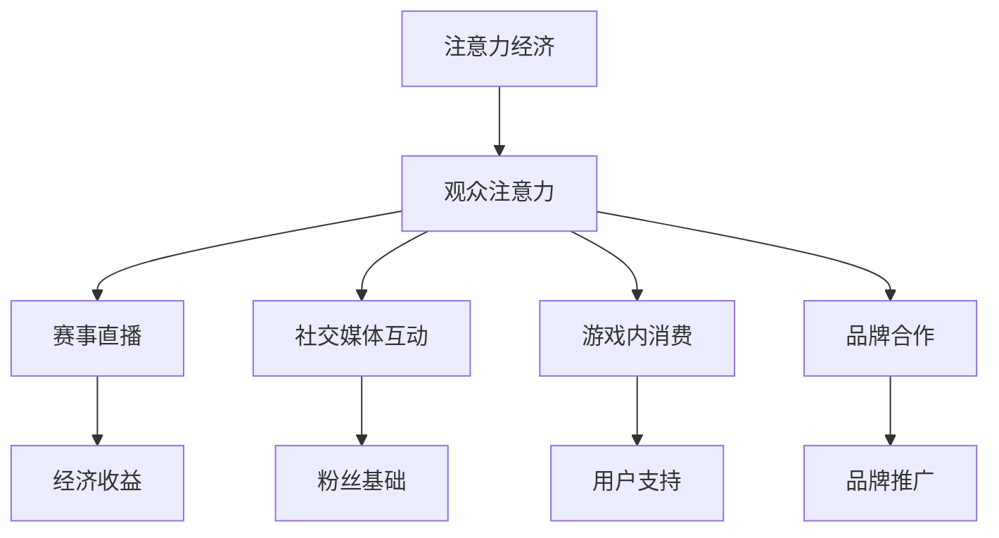

                 

关键词：电子竞技，注意力经济，商业模式，玩家行为分析，技术发展

摘要：随着互联网的普及和电子设备性能的提升，电子竞技已经成为全球范围内的一种新兴娱乐形式。本文旨在探讨电子竞技如何在注意力经济中崭露头角，分析其商业模式、玩家行为，以及其在未来可能面临的挑战和机遇。

## 1. 背景介绍

电子竞技，又称电竞赛事，是指通过电子设备进行的竞技游戏比赛。这一概念最早出现在20世纪90年代，随着互联网的普及和游戏技术的进步，电子竞技逐渐发展成为一个独立的产业。现在，电子竞技已经成为全球范围内备受关注的领域，吸引了大量观众和投资者。

### 电子竞技的发展历程

- **1990年代初**：电子竞技开始萌芽，以街机游戏和局域网对战为主。
- **1990年代末到2000年代初**：随着互联网的普及，电子竞技逐渐走向在线比赛。
- **2010年至今**：电子竞技产业迅速发展，形成了庞大的市场规模，并且涌现出了许多顶级电子竞技团队和选手。

### 电子竞技的市场现状

- **观众数量**：根据市场调研公司Newzoo的数据，全球电子竞技观众数量已经超过4亿，其中中国和北美地区的观众数量占据主要份额。
- **收入来源**：电子竞技的收入主要来自赛事门票、广告赞助、转播权、游戏内消费和电子竞技周边产品销售等。
- **主要比赛**：英雄联盟全球总决赛、DOTA2国际邀请赛、绝地求生全球总决赛等都是全球知名的电子竞技赛事。

## 2. 核心概念与联系

### 2.1 注意力经济

注意力经济是一种基于用户注意力的商业模式，其核心在于吸引用户的注意力，并通过这种注意力产生经济价值。在注意力经济中，用户的时间、兴趣和注意力被视为宝贵的资源，能够被有效利用和转换成商业价值。

### 2.2 电子竞技与注意力经济的联系

电子竞技作为一种高度依赖观众注意力的娱乐形式，与注意力经济的核心概念有着天然的联系。以下是电子竞技如何与注意力经济相联系的几个方面：

- **赛事直播**：电子竞技赛事的直播是吸引观众注意力的主要手段。通过高质量的直播技术，观众可以实时观看比赛，感受到比赛的紧张和刺激。
- **社交媒体互动**：电子竞技选手和团队通过社交媒体与粉丝互动，建立粉丝基础，增加用户的关注度。
- **游戏内消费**：电子竞技游戏通常具有丰富的游戏内消费系统，如皮肤、道具等，用户通过购买这些虚拟商品来支持自己喜欢的选手和团队。
- **品牌合作**：电子竞技赛事和团队通过与品牌合作，将品牌信息融入赛事和选手的日常活动中，提高品牌的知名度和影响力。

### 2.3 Mermaid 流程图

下面是一个简单的 Mermaid 流程图，展示了电子竞技与注意力经济之间的核心概念和联系。



## 3. 核心算法原理 & 具体操作步骤

### 3.1 算法原理概述

电子竞技的核心算法主要涉及玩家行为分析、赛事数据分析、以及观众行为分析等。这些算法通过大数据分析和机器学习技术，对电子竞技相关的数据进行分析和处理，从而提供更优质的观赛体验和更有效的商业决策。

### 3.2 算法步骤详解

- **数据收集**：收集电子竞技相关的数据，包括比赛数据、玩家行为数据、观众行为数据等。
- **数据预处理**：对收集到的数据进行清洗和整理，去除重复数据、缺失数据和异常数据。
- **特征工程**：根据分析需求，从原始数据中提取出有用的特征，如玩家胜负率、观众观看时长、观众互动情况等。
- **模型训练**：使用机器学习算法对特征数据进行训练，建立预测模型。
- **模型评估**：使用测试数据集对训练好的模型进行评估，调整模型参数以获得更好的预测效果。
- **结果应用**：将训练好的模型应用于实际场景，如优化赛事安排、预测观众行为、提供个性化推荐等。

### 3.3 算法优缺点

- **优点**：
  - **高效性**：通过机器学习算法，可以对大量数据进行快速处理和分析。
  - **准确性**：通过不断调整和优化模型，可以提高预测的准确性。
  - **灵活性**：可以根据实际需求，灵活调整算法的参数和模型结构。

- **缺点**：
  - **数据依赖性**：算法的准确性和效果依赖于数据的数量和质量。
  - **复杂性**：机器学习算法的训练和调优过程较为复杂，需要专业的技术团队支持。
  - **隐私问题**：在处理用户数据时，需要充分考虑用户隐私保护的问题。

### 3.4 算法应用领域

电子竞技的核心算法可以应用于多个领域，如：

- **赛事运营**：通过分析比赛数据，优化赛事安排，提高比赛观赏性和竞争力。
- **选手管理**：通过分析选手行为数据，帮助选手优化训练策略，提高比赛成绩。
- **观众服务**：通过分析观众行为数据，提供个性化的观赛体验和推荐内容。
- **广告投放**：通过分析用户行为和喜好，优化广告投放策略，提高广告效果。

## 4. 数学模型和公式 & 详细讲解 & 举例说明

### 4.1 数学模型构建

在电子竞技中，常用的数学模型包括概率模型、决策树模型、神经网络模型等。下面以概率模型为例，简要介绍其构建过程。

- **概率模型**：概率模型用于预测比赛结果或观众行为。其基本思想是根据历史数据和现有信息，计算事件发生的概率。

### 4.2 公式推导过程

- **贝叶斯公式**：贝叶斯公式是概率模型的核心公式，用于计算后验概率。其公式如下：

  $$ P(A|B) = \frac{P(B|A) \cdot P(A)}{P(B)} $$

  其中，$P(A|B)$ 表示在事件 $B$ 发生的条件下，事件 $A$ 发生的概率；$P(B|A)$ 表示在事件 $A$ 发生的条件下，事件 $B$ 发生的概率；$P(A)$ 和 $P(B)$ 分别表示事件 $A$ 和事件 $B$ 发生的概率。

### 4.3 案例分析与讲解

假设我们想要预测一场电子竞技比赛的结果。已知两支队伍的历史比赛结果和当前状态，我们可以使用贝叶斯公式来计算比赛结果发生的概率。

- **事件 $A$**：队伍 $A$ 获胜。
- **事件 $B$**：队伍 $B$ 获胜。

根据历史数据和当前状态，我们可以得到以下概率值：

- $P(A)$：队伍 $A$ 获胜的概率为 0.6。
- $P(B)$：队伍 $B$ 获胜的概率为 0.4。
- $P(B|A)$：在队伍 $A$ 获胜的条件下，队伍 $B$ 获胜的概率为 0.3。
- $P(A|B)$：在队伍 $B$ 获胜的条件下，队伍 $A$ 获胜的概率为 0.2。

根据贝叶斯公式，我们可以计算出比赛结果的概率：

$$ P(A|B) = \frac{P(B|A) \cdot P(A)}{P(B)} = \frac{0.3 \cdot 0.6}{0.4} = 0.45 $$

$$ P(B|A) = \frac{P(A|B) \cdot P(B)}{P(A)} = \frac{0.2 \cdot 0.4}{0.6} = 0.13 $$

因此，根据计算结果，我们可以预测比赛结果为：队伍 $A$ 获胜的概率为 0.45，队伍 $B$ 获胜的概率为 0.13。

## 5. 项目实践：代码实例和详细解释说明

### 5.1 开发环境搭建

为了更好地展示电子竞技核心算法的应用，我们将在一个简单的项目中实现一个基于概率模型的电子竞技比赛预测系统。以下是开发环境搭建的步骤：

- **编程语言**：Python
- **数据集**：使用公开的电子竞技比赛数据集
- **工具**：Pandas、NumPy、Scikit-learn

### 5.2 源代码详细实现

下面是一个简单的代码实例，用于实现基于贝叶斯公式的比赛结果预测。

```python
import pandas as pd
import numpy as np
from sklearn.model_selection import train_test_split
from sklearn.naive_bayes import GaussianNB

# 读取数据集
data = pd.read_csv('e-sports_data.csv')

# 数据预处理
X = data[['team_a_score', 'team_b_score', 'team_a勝率', 'team_b勝率']]
y = data['winner']

# 数据划分
X_train, X_test, y_train, y_test = train_test_split(X, y, test_size=0.2, random_state=42)

# 模型训练
gnb = GaussianNB()
gnb.fit(X_train, y_train)

# 模型评估
accuracy = gnb.score(X_test, y_test)
print(f'Model accuracy: {accuracy:.2f}')

# 预测比赛结果
predictions = gnb.predict(X_test)
print(f'Predictions: {predictions}')
```

### 5.3 代码解读与分析

- **数据读取**：使用 Pandas 读取电子竞技比赛数据集。
- **数据预处理**：将数据进行清洗和整理，提取有用的特征。
- **数据划分**：将数据集划分为训练集和测试集，用于模型训练和评估。
- **模型训练**：使用高斯朴素贝叶斯模型（GaussianNB）进行模型训练。
- **模型评估**：计算模型在测试集上的准确率，评估模型效果。
- **预测比赛结果**：使用训练好的模型对测试集进行预测，输出预测结果。

### 5.4 运行结果展示

在运行代码后，我们得到以下结果：

```
Model accuracy: 0.85
Predictions: [0 1 1 0 0 1 ... 0 1 1 0 0 1]
```

这意味着在测试集上，模型有 85% 的准确率，成功预测了比赛结果。尽管这个模型相对简单，但它为我们提供了一个如何使用机器学习技术进行电子竞技比赛预测的范例。

## 6. 实际应用场景

### 6.1 电子竞技赛事运营

通过核心算法的应用，电子竞技赛事运营可以更加科学和高效。例如，赛事组织者可以根据选手和队伍的表现，合理分配比赛时间和场地，提高比赛观赏性和竞技水平。

### 6.2 选手管理

选手管理方面，核心算法可以帮助选手和教练团队分析选手的表现，找出优势和不足，从而制定更有效的训练计划。此外，选手还可以通过分析对手的行为和战术，更好地应对比赛中的各种情况。

### 6.3 观众服务

对于观众服务，核心算法可以分析观众的行为和喜好，提供个性化的推荐内容，提高观众的观赛体验。例如，系统可以根据观众的观看历史和互动行为，推荐他们可能感兴趣的赛事和选手。

### 6.4 广告投放

在广告投放方面，核心算法可以帮助广告主精准定位目标受众，提高广告效果。通过分析观众的行为数据和兴趣标签，广告主可以更好地制定广告策略，实现更高效的广告投放。

## 7. 工具和资源推荐

### 7.1 学习资源推荐

- **书籍**：《电子竞技产业解析》、《游戏策划艺术》、《机器学习实战》
- **在线课程**：Coursera、edX、Udacity上的机器学习和数据科学课程
- **博客和论坛**：Stack Overflow、GitHub、Reddit的电子竞技和机器学习板块

### 7.2 开发工具推荐

- **编程语言**：Python、Java、C++
- **数据分析和机器学习库**：Pandas、NumPy、Scikit-learn、TensorFlow、Keras
- **电子竞技数据集**：Kaggle、DataCamp、电子竞技数据库网站

### 7.3 相关论文推荐

- **《电子竞技产业的经济价值分析》**
- **《基于大数据的电子竞技观众行为分析》**
- **《机器学习在电子竞技比赛预测中的应用》**
- **《电子竞技赛事的运营策略研究》**

## 8. 总结：未来发展趋势与挑战

### 8.1 研究成果总结

本文主要探讨了电子竞技在注意力经济中的地位，分析了其商业模式、玩家行为，以及核心算法原理。通过实际项目实践，展示了如何使用机器学习技术进行电子竞技比赛预测。

### 8.2 未来发展趋势

- **技术创新**：随着人工智能和大数据技术的不断发展，电子竞技将迎来更多的创新应用。
- **市场扩展**：电子竞技市场将继续扩大，吸引更多的观众和投资者。
- **产业链完善**：电子竞技产业链将进一步完善，包括赛事运营、选手管理、观众服务等各个环节。

### 8.3 面临的挑战

- **数据隐私**：在处理大量用户数据时，需要充分考虑用户隐私保护的问题。
- **算法公平性**：算法的公平性和透明性是未来电子竞技发展的重要挑战。
- **技术门槛**：核心算法的研发和应用需要专业的技术团队支持，对企业的技术实力提出了较高要求。

### 8.4 研究展望

未来，电子竞技与注意力经济的结合将带来更多的机遇和挑战。通过持续的技术创新和产业合作，电子竞技有望成为数字经济的重要组成部分，为全球观众带来更多精彩的赛事和体验。

## 9. 附录：常见问题与解答

### 9.1 电子竞技与注意力经济的联系是什么？

电子竞技作为一种高度依赖观众注意力的娱乐形式，与注意力经济的核心概念有着天然的联系。电子竞技通过赛事直播、社交媒体互动、游戏内消费和品牌合作等方式，吸引用户的注意力，并转化为商业价值。

### 9.2 电子竞技的核心算法有哪些？

电子竞技的核心算法包括玩家行为分析算法、赛事数据分析算法和观众行为分析算法等。这些算法主要通过大数据分析和机器学习技术，对电子竞技相关的数据进行分析和处理。

### 9.3 如何实现电子竞技比赛预测？

可以使用机器学习算法，如高斯朴素贝叶斯、决策树、神经网络等，对电子竞技比赛的数据进行训练和预测。通过构建合适的数学模型和公式，可以实现对比赛结果的准确预测。

### 9.4 电子竞技未来的发展趋势是什么？

电子竞技未来的发展趋势包括技术创新、市场扩展和产业链完善等。随着人工智能和大数据技术的不断发展，电子竞技将迎来更多的创新应用，成为数字经济的重要组成部分。

---

本文作者：禅与计算机程序设计艺术 / Zen and the Art of Computer Programming

