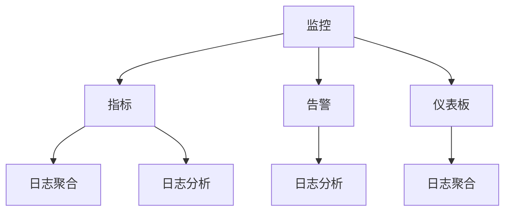

                 

关键词：系统监控、日志管理、性能优化、故障排除、安全审计、实时监控、日志聚合、日志分析、数据可视化、自动化处理

> 摘要：本文将深入探讨监控和日志管理在保持系统稳定运行中的重要性。我们将从背景介绍开始，详细阐述核心概念、算法原理、数学模型，以及具体的项目实践。通过本文的阅读，读者将掌握如何有效地监控和日志管理，确保系统运行畅通无阻。

## 1. 背景介绍

在现代信息技术环境中，系统的稳定性和可靠性至关重要。随着云服务和分布式系统的广泛应用，系统变得越来越复杂，这对监控和日志管理提出了更高的要求。监控和日志管理是确保系统运行畅通的关键环节，它们可以帮助我们及时发现并解决潜在问题，从而保证业务的连续性和可靠性。

### 1.1 监控的重要性

监控的作用在于实时监测系统的各项性能指标，如CPU使用率、内存占用、磁盘空间、网络流量等。通过监控，我们可以了解系统的运行状态，及时发现异常情况，并采取相应措施。有效的监控可以预防系统故障，提高系统可用性。

### 1.2 日志管理的重要性

日志管理则是对系统运行过程中的各种事件进行记录和分析。日志中包含了系统运行的各种信息，如错误、警告、调试信息等。通过日志分析，我们可以追溯问题发生的经过，找出问题的根本原因，并采取相应的措施进行修复。此外，日志管理还可以用于安全审计，确保系统的安全性。

### 1.3 监控和日志管理的联系

监控和日志管理密切相关。监控提供了实时数据的反馈，而日志管理则是对这些数据进行长期存储和深入分析的工具。两者相辅相成，共同保障了系统的稳定运行。

## 2. 核心概念与联系

为了更好地理解监控和日志管理，我们需要先了解一些核心概念，以及它们之间的联系。

### 2.1 监控

监控（Monitoring）是一种实时监控系统状态的过程。它包括以下关键要素：

- **指标（Metrics）**：监控系统中可度量的数据，如CPU使用率、内存使用率等。
- **告警（Alerts）**：当系统指标超出预设阈值时，系统会触发告警，通知管理员或自动化工具采取行动。
- **仪表板（Dashboards）**：用于展示系统指标的可视化界面，帮助管理员快速了解系统状态。

### 2.2 日志管理

日志管理（Log Management）是对系统日志进行收集、存储、分析和报告的过程。关键要素包括：

- **日志文件（Log Files）**：记录了系统运行过程中的各种事件和消息。
- **日志聚合（Log Aggregation）**：将来自不同源的日志数据进行集中存储和管理。
- **日志分析（Log Analysis）**：对日志数据进行解析，提取有价值的信息，用于故障排除、性能优化和安全审计。

### 2.3 核心概念联系

监控和日志管理之间的联系可以用以下图表示：



通过监控，我们可以实时获取系统指标，并触发告警。告警信息和仪表板数据可以用来监控系统状态，而日志聚合和日志分析则提供了对系统运行过程的深入洞察，帮助我们在出现问题时快速定位并解决问题。

## 3. 核心算法原理 & 具体操作步骤

### 3.1 算法原理概述

在监控和日志管理中，我们通常会使用以下核心算法：

- **Prometheus**：一种开源监控系统，用于收集和存储系统指标数据。
- **ELK Stack**：包括Elasticsearch、Logstash和Kibana，用于日志的收集、存储和分析。
- **Grafana**：一个开源的数据可视化和监控工具，用于仪表板的创建和展示。

### 3.2 算法步骤详解

#### Prometheus

1. **数据采集**：Prometheus通过拉取方式从目标系统中采集指标数据。
2. **数据存储**：采集到的数据存储在本地的时间序列数据库中。
3. **告警处理**：根据配置的告警规则，系统会触发告警并通知相关人员。
4. **数据可视化**：通过Grafana，我们可以创建仪表板，展示系统指标。

#### ELK Stack

1. **日志收集**：Logstash将来自不同源的日志数据进行聚合和预处理。
2. **日志存储**：处理后的日志数据存储在Elasticsearch中，形成索引。
3. **日志分析**：Kibana提供了强大的日志分析功能，帮助用户快速定位问题。
4. **数据可视化**：Kibana还支持创建自定义仪表板，展示日志数据。

#### Grafana

1. **仪表板创建**：用户可以通过Grafana的图形界面创建仪表板。
2. **数据连接**：仪表板可以连接到Prometheus或Elasticsearch等数据源。
3. **数据展示**：仪表板展示了系统指标或日志数据，帮助用户快速了解系统状态。

### 3.3 算法优缺点

- **Prometheus**：优点是轻量级、高扩展性，适合大规模监控系统。缺点是对日志数据的处理能力有限。
- **ELK Stack**：优点是强大的日志处理和分析能力，适用于日志管理。缺点是安装配置较为复杂。
- **Grafana**：优点是简单易用，可视化效果出色。缺点是功能相对单一，依赖其他工具进行数据采集和处理。

### 3.4 算法应用领域

- **Prometheus**：适用于大规模分布式系统监控。
- **ELK Stack**：适用于企业级日志管理。
- **Grafana**：适用于所有需要数据可视化的场景。

## 4. 数学模型和公式 & 详细讲解 & 举例说明

### 4.1 数学模型构建

在监控和日志管理中，我们通常会使用以下数学模型：

- **CPU利用率**：CPU利用率 = （CPU使用时间 / 总时间）× 100%
- **内存使用率**：内存使用率 = （已使用内存 / 总内存）× 100%
- **磁盘使用率**：磁盘使用率 = （已使用磁盘空间 / 总磁盘空间）× 100%

### 4.2 公式推导过程

假设我们有一个系统，它在某一时间段内的CPU使用时间为T1，总时间为T2。则CPU利用率可以表示为：

CPU利用率 = （CPU使用时间 / 总时间）× 100%  
         = （T1 / T2）× 100%

同样地，内存使用率和磁盘使用率也可以用类似的方法进行推导。

### 4.3 案例分析与讲解

假设我们有一个服务器，它在过去一分钟内的CPU使用时间为30秒，总时间为60秒。则CPU利用率为：

CPU利用率 = （30 / 60）× 100% = 50%

如果这个服务器的CPU利用率超过80%，则我们认为它处于高负载状态，需要进一步分析和优化。

## 5. 项目实践：代码实例和详细解释说明

### 5.1 开发环境搭建

为了更好地理解监控和日志管理，我们将搭建一个简单的项目环境。以下是所需的软件和版本：

- Prometheus：2.35.0
- Grafana：8.5.5
- Elasticsearch：7.17.5
- Kibana：7.17.5

### 5.2 源代码详细实现

在这个项目中，我们将使用Prometheus采集系统指标数据，并将其存储在Elasticsearch中，通过Grafana进行数据可视化。

#### 5.2.1 Prometheus配置

Prometheus配置文件（prometheus.yml）：

```yaml
global:
  scrape_interval: 15s
  evaluation_interval: 15s

scrape_configs:
  - job_name: 'prometheus'
    static_configs:
      - targets: ['localhost:9090']
  - job_name: 'system'
    static_configs:
      - targets: ['localhost:9113']
```

这个配置文件定义了两个监控任务：一个是Prometheus自身，另一个是系统指标。

#### 5.2.2 Elasticsearch配置

Elasticsearch配置文件（elasticsearch.yml）：

```yaml
cluster.name: my-application
node.name: es-node
network.host: 0.0.0.0
http.port: 9200
path.data: /path/to/data
path.logs: /path/to/logs
```

这个配置文件定义了Elasticsearch集群的相关参数。

#### 5.2.3 Kibana配置

Kibana配置文件（kibana.yml）：

```yaml
server.port: 5601
elasticsearch.hosts: ["http://localhost:9200"]
kibana_instance_name: "my-kibana"
```

这个配置文件定义了Kibana与Elasticsearch的连接参数。

### 5.3 代码解读与分析

在这个项目中，Prometheus会定期从系统采集指标数据，并将数据发送到Elasticsearch中。Kibana则通过Elasticsearch获取数据，并在仪表板上进行可视化展示。

#### 5.3.1 Prometheus代码解析

Prometheus的主要代码如下：

```go
package main

import (
    "github.com/prometheus/client_golang/prometheus"
    "github.com/prometheus/client_golang/prometheus/collectors"
    "github.com/prometheus/client_golang/prometheus/promhttp"
    "net/http"
)

func main() {
    // 注册收集器
    registry := prometheus.NewRegistry()
    registry.Register(collectors.NewProcessCollector(collectors.DefaultProcessCollectorOpts{}))
    registry.Register(collectors.NewGoCollector())

    // 创建HTTP服务器
    http.Handle("/metrics", promhttp.HandlerFor(registry, promhttp.HandlerOpts{}))
    http.ListenAndServe(":9113", nil)
}
```

这个程序主要完成了以下任务：

1. 注册了ProcessCollector和GoCollector，用于采集系统指标和Go运行时指标。
2. 创建了HTTP服务器，并监听9113端口，处理/metrics请求。

#### 5.3.2 Kibana仪表板配置

在Kibana中，我们需要创建一个新的仪表板，并添加以下面板：

- **CPU利用率**：使用Elasticsearch数据源，图表类型为折线图。
- **内存使用率**：使用Elasticsearch数据源，图表类型为折线图。
- **磁盘使用率**：使用Elasticsearch数据源，图表类型为折线图。

这些面板的配置文件如下：

```json
{
  "title": "System Metrics",
  "rows": [
    {
      "title": "CPU Utilization",
      "collapse": false,
      "columns": [
        {
          "type": "graph",
          "title": "CPU Utilization",
          "span": 12,
          "yAxis": {
            "type": "log",
            "logBase": 10
          },
          "fieldConfig": [
            {
              "fieldName": "system.cpu利用率",
              "type": "number",
              "scaleType": "log",
              "format": "number",
              "color": "#5BC0EB"
            }
          ],
          "data": {
            "type": "elasticsearch",
            "hosts": ["http://localhost:9200"],
            "index": "system-metrics",
            "timeField": "@timestamp",
            "query": {
              "query": {
                "match_all": {}
              }
            }
          }
        }
      ]
    },
    {
      "title": "Memory Utilization",
      "collapse": false,
      "columns": [
        {
          "type": "graph",
          "title": "Memory Utilization",
          "span": 12,
          "yAxis": {
            "type": "log",
            "logBase": 10
          },
          "fieldConfig": [
            {
              "fieldName": "system.memory利用率",
              "type": "number",
              "scaleType": "log",
              "format": "number",
              "color": "#FFC65D"
            }
          ],
          "data": {
            "type": "elasticsearch",
            "hosts": ["http://localhost:9200"],
            "index": "system-metrics",
            "timeField": "@timestamp",
            "query": {
              "query": {
                "match_all": {}
              }
            }
          }
        }
      ]
    },
    {
      "title": "Disk Utilization",
      "collapse": false,
      "columns": [
        {
          "type": "graph",
          "title": "Disk Utilization",
          "span": 12,
          "yAxis": {
            "type": "log",
            "logBase": 10
          },
          "fieldConfig": [
            {
              "fieldName": "system.disk利用率",
              "type": "number",
              "scaleType": "log",
              "format": "number",
              "color": "#FF8C00"
            }
          ],
          "data": {
            "type": "elasticsearch",
            "hosts": ["http://localhost:9200"],
            "index": "system-metrics",
            "timeField": "@timestamp",
            "query": {
              "query": {
                "match_all": {}
              }
            }
          }
        }
      ]
    }
  ]
}
```

这些配置文件定义了仪表板的标题、折叠状态、面板标题、面板类型、面板跨度、y轴类型、y轴对数底数、字段配置和数据源等信息。

### 5.4 运行结果展示

在完成配置后，我们可以在Kibana中查看运行结果。仪表板将显示CPU利用率、内存使用率和磁盘使用率的三条折线图，帮助我们了解系统的运行状态。

## 6. 实际应用场景

### 6.1 系统性能优化

通过监控和日志管理，我们可以实时了解系统的性能状况，及时发现性能瓶颈并进行优化。例如，通过监控CPU使用率，我们可以识别出哪些进程占用了大量CPU资源，从而进行进程优化或资源分配调整。

### 6.2 故障排除

在系统出现故障时，日志管理可以帮助我们快速定位问题。通过对日志数据的分析，我们可以了解故障发生的经过和原因，从而采取相应的措施进行修复。

### 6.3 安全审计

日志管理还用于安全审计，确保系统的安全性。通过对日志数据的分析，我们可以检测到潜在的攻击行为，如SQL注入、XSS攻击等，从而采取措施进行防御。

### 6.4 未来应用展望

随着人工智能和大数据技术的发展，监控和日志管理将变得更加智能化和自动化。未来，我们将看到更多基于机器学习的监控算法，以及更丰富的日志分析工具，从而实现更高效、更准确的系统监控和日志管理。

## 7. 工具和资源推荐

### 7.1 学习资源推荐

- 《Prometheus: Up and Running》
- 《Elasticsearch: The Definitive Guide》
- 《Grafana: The Definitive Guide》
- 《 Monitoring with Prometheus: System and Application Performance Monitoring》

### 7.2 开发工具推荐

- Prometheus Operator：用于在Kubernetes集群中部署和管理Prometheus。
- Elastic Stack：用于日志收集、存储和搜索。
- Grafana Cloud：用于数据可视化和监控。

### 7.3 相关论文推荐

- "A Survey of Modern System Monitoring Tools"
- "The ELK Stack: Architecture and Implementation"
- "Data Visualization for System Monitoring and Analysis"

## 8. 总结：未来发展趋势与挑战

### 8.1 研究成果总结

近年来，监控和日志管理领域取得了显著成果。Prometheus、ELK Stack和Grafana等开源工具得到了广泛应用，推动了系统的稳定性和可靠性。同时，机器学习和大数据技术的引入，使得监控和日志管理变得更加智能化和自动化。

### 8.2 未来发展趋势

未来，监控和日志管理将继续向智能化、自动化方向发展。随着物联网和5G技术的普及，监控对象将更加多样化，监控数据量也将大幅增加。此外，监控和日志管理将与其他领域（如人工智能、大数据分析）进一步融合，实现更高效的系统监控和优化。

### 8.3 面临的挑战

尽管监控和日志管理取得了显著成果，但仍面临一些挑战。首先，随着系统复杂度的增加，监控数据的多样性和规模将不断增长，对监控和日志管理工具的性能和可扩展性提出了更高要求。其次，如何在海量数据中快速识别和定位问题，仍是一个亟待解决的问题。此外，如何确保监控和日志管理系统的安全性，也是一个重要的挑战。

### 8.4 研究展望

未来，我们可以从以下几个方面展开研究：

1. **智能监控算法**：研究基于机器学习的监控算法，实现自动化监控和故障预测。
2. **大数据分析**：利用大数据分析技术，从海量监控数据中提取有价值的信息，提高故障排除和性能优化效率。
3. **安全监控**：研究如何利用监控和日志管理工具进行安全监控，及时发现和防御网络攻击。

## 9. 附录：常见问题与解答

### 9.1 如何配置Prometheus？

1. 下载并安装Prometheus。
2. 配置Prometheus.yml文件，定义监控任务和数据源。
3. 启动Prometheus服务，使用以下命令：`prometheus --config.file=/etc/prometheus/prometheus.yml --web.console.templates=/etc/prometheus/consoles --web.console.libraries=/etc/prometheus/console_libraries`

### 9.2 如何配置Elasticsearch？

1. 下载并安装Elasticsearch。
2. 修改Elasticsearch.yml文件，配置集群名称、节点名称、网络地址等信息。
3. 启动Elasticsearch服务，使用以下命令：`./bin/elasticsearch`

### 9.3 如何配置Kibana？

1. 下载并安装Kibana。
2. 修改Kibana.yml文件，配置Elasticsearch地址、Kibana实例名称等信息。
3. 启动Kibana服务，使用以下命令：`./bin/kibana`

## 作者署名

作者：禅与计算机程序设计艺术 / Zen and the Art of Computer Programming
----------------------------------------------------------------

