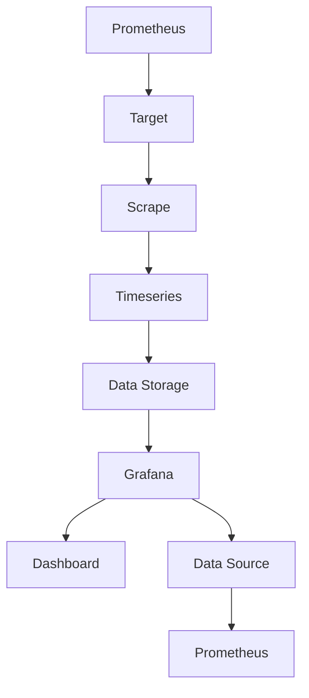

                 

关键词：监控系统，Prometheus，Grafana，实践，性能监控，云原生，时间序列数据库，可视化工具，系统运维，数据分析

> 摘要：本文将深入探讨Prometheus与Grafana在实际监控系统中的应用与实践。我们将从背景介绍、核心概念、算法原理、数学模型、项目实践以及未来展望等多个角度，详细解析这两个工具的功能与优势，帮助读者理解并掌握如何构建高效、可靠的监控系统。

## 1. 背景介绍

在现代信息化社会中，监控系统作为保障系统和数据稳定运行的关键环节，其重要性不言而喻。随着云计算、容器化技术的发展，系统架构日趋复杂，传统的监控手段已难以应对日益增长的需求。为此，开源社区涌现出了诸多优秀的监控系统，如Prometheus和Grafana。它们以其高效、灵活、可扩展的特点，逐渐成为企业级监控系统的首选。

Prometheus是一款由SoundCloud公司开发，基于拉模式（Pull-based）监控架构的开源监控系统。它采用时间序列数据库存储监控数据，支持多维数据标签，具有高效的查询性能和强大的数据聚合能力。而Grafana则是一款开源的可视化分析工具，能够将Prometheus采集的数据以图表、面板等形式展示出来，提供直观的数据分析和监控体验。

## 2. 核心概念与联系

### 2.1 Prometheus

Prometheus具有以下核心概念：

- **目标（Target）**：监控数据的来源，通常是一个HTTP服务，Prometheus通过定期发送HTTP请求来获取监控数据。
- **指标（Metric）**：以数字形式表示的监控数据，如CPU使用率、内存使用率等。
- **数据采集（Scraper）**：Prometheus通过配置文件指定的URL路径定期拉取监控数据，这些数据以PromQL（Prometheus Query Language）格式返回。
- **时间序列（Timeseries）**：由一系列时间戳和指标值组成的序列，用于存储和查询监控数据。

### 2.2 Grafana

Grafana具有以下核心概念：

- **数据源（Data Source）**：Grafana连接到Prometheus服务器以获取监控数据。
- **仪表板（Dashboard）**：用于展示监控数据的可视化面板，可以包含图表、表格、单值显示等。
- **面板（Panel）**：仪表板中的单个可视化元素，如折线图、饼图、仪表盘等。

### 2.3 Prometheus与Grafana的联系

Prometheus与Grafana之间的关系如下：

- Prometheus负责数据采集、存储和查询。
- Grafana负责将Prometheus采集到的数据以可视化的方式呈现。
- 通过配置Prometheus的配置文件，可以定义数据源和指标采集规则。
- Grafana通过连接到Prometheus，从数据源中获取监控数据，并在仪表板上展示。

以下是Prometheus与Grafana的核心概念原理和架构的Mermaid流程图：



## 3. 核心算法原理 & 具体操作步骤

### 3.1 算法原理概述

Prometheus的核心算法原理如下：

- **拉模式采集**：Prometheus通过定期拉取目标服务器的监控数据，无需依赖于目标服务器主动推送数据，从而降低了目标服务器的负担。
- **PromQL查询**：Prometheus支持PromQL，可以对时间序列数据进行复杂查询、聚合和过滤，以便更好地分析和理解监控数据。
- **告警机制**：Prometheus支持自定义告警规则，当监控数据达到特定阈值时，可以触发告警通知。

### 3.2 算法步骤详解

#### Prometheus配置步骤

1. 安装Prometheus
2. 配置prometheus.yml文件，指定目标、数据存储、告警规则等参数
3. 运行Prometheus服务，开始采集监控数据

#### Grafana配置步骤

1. 安装Grafana
2. 配置Grafana的data source，连接到Prometheus服务器
3. 创建仪表板，添加面板并配置数据源
4. 配置告警，将Prometheus的告警规则与Grafana关联

### 3.3 算法优缺点

#### Prometheus优点

- 高效的数据采集和查询性能
- 强大的告警和告警通知功能
- 开源、可扩展、易于集成

#### Prometheus缺点

- 数据存储容量受限，需要定期备份和迁移
- 需要一定的配置和维护成本

### 3.4 算法应用领域

Prometheus适用于以下领域：

- 云原生应用监控
- 容器化环境监控
- 服务器性能监控
- 网络性能监控
- 日志分析

## 4. 数学模型和公式 & 详细讲解 & 举例说明

### 4.1 数学模型构建

Prometheus的监控数据可以表示为以下数学模型：

$$
\text{监控数据} = f(\text{时间序列}, \text{指标标签})
$$

其中，时间序列表示监控数据的采集时间，指标标签表示监控数据的维度信息。

### 4.2 公式推导过程

以CPU使用率为例，其监控数据可以表示为：

$$
\text{CPU使用率} = \frac{\text{CPU用户时间} + \text{CPU核心时间}}{\text{总时间}}
$$

其中，CPU用户时间表示用户进程消耗的CPU时间，CPU核心时间表示系统进程消耗的CPU时间，总时间为监控数据的采集时间。

### 4.3 案例分析与讲解

以一个简单的Web服务器监控为例，假设我们希望监控服务器的CPU使用率、内存使用率和网络流量。我们可以在Prometheus的配置文件中添加以下规则：

```yaml
groups:
- name: webserver-metrics
  rules:
  - record: cpu_usage
    expr: (sum(rate(cpu_usage_total{instance="webserver-1"}[5m])) by (instance))
  - record: memory_usage
    expr: (sum(rate(memory_usage_total{instance="webserver-1"}[5m])) by (instance))
  - record: network_traffic
    expr: (sum(rate(network_traffic_total{instance="webserver-1"}[5m])) by (instance))
```

这些规则将采集服务器的CPU使用率、内存使用率和网络流量数据，并以时间序列的形式存储在Prometheus的时间序列数据库中。接下来，我们可以在Grafana中创建一个仪表板，将这三个指标以图表的形式展示出来，从而实现对Web服务器的实时监控。

## 5. 项目实践：代码实例和详细解释说明

### 5.1 开发环境搭建

1. 安装Docker
2. 使用Docker安装Prometheus
3. 使用Docker安装Grafana
4. 配置Prometheus和Grafana的容器化环境

### 5.2 源代码详细实现

以下是Prometheus的配置文件`prometheus.yml`的示例：

```yaml
global:
  scrape_interval: 15s
  evaluation_interval: 15s

scrape_configs:
  - job_name: 'webserver'
    static_configs:
    - targets: ['webserver:9090']
```

以下是Grafana的数据源配置示例：

```json
{
  "name": "prometheus",
  "type": "prometheus",
  "url": "http://localhost:9090",
  "access": "proxy",
  "isDefault": true
}
```

### 5.3 代码解读与分析

1. **Prometheus配置文件**：定义了监控任务的名称、采集间隔、评估间隔以及要监控的目标URL。
2. **Grafana数据源配置**：指定了Grafana连接到Prometheus服务器的URL和访问方式。

### 5.4 运行结果展示

1. **Prometheus运行结果**：在Prometheus界面上可以看到Web服务器的监控数据，包括CPU使用率、内存使用率和网络流量。
2. **Grafana运行结果**：在Grafana仪表板中，可以实时查看Web服务器的监控数据图表，方便进行数据分析和告警设置。

## 6. 实际应用场景

### 6.1 云原生应用监控

Prometheus与Grafana在云原生应用监控中具有广泛的应用。通过Prometheus可以监控Kubernetes集群中的Pod、Node、Ingress等资源，以及容器内部的CPU、内存、网络等指标。Grafana则可以以可视化的方式展示这些监控数据，帮助运维人员快速发现和解决问题。

### 6.2 容器化环境监控

容器化环境中的监控系统需要能够快速、高效地采集和展示大量监控数据。Prometheus与Grafana的组合可以满足这一需求，通过Prometheus的拉模式采集和PromQL查询功能，可以实现对容器化环境的实时监控和分析。

### 6.3 服务器性能监控

服务器性能监控是监控系统的重要应用场景之一。Prometheus可以采集服务器的CPU、内存、磁盘、网络等指标，并通过Grafana进行可视化展示，帮助运维人员及时发现问题并进行优化。

### 6.4 网络性能监控

网络性能监控是保障业务稳定运行的关键。Prometheus可以采集网络流量、延迟、丢包等指标，Grafana则可以对这些数据进行实时分析和可视化，帮助运维人员快速定位网络问题。

## 7. 工具和资源推荐

### 7.1 学习资源推荐

- Prometheus官方文档：[https://prometheus.io/docs/](https://prometheus.io/docs/)
- Grafana官方文档：[https://grafana.com/docs/grafana/latest/](https://grafana.com/docs/grafana/latest/)
- Prometheus与Grafana的GitHub仓库：[https://github.com/prometheus/prometheus](https://github.com/prometheus/prometheus)、[https://github.com/grafana/grafana](https://github.com/grafana/grafana)

### 7.2 开发工具推荐

- Docker：[https://www.docker.com/](https://www.docker.com/)
- Kubernetes：[https://kubernetes.io/](https://kubernetes.io/)

### 7.3 相关论文推荐

- "Prometheus: A Monitoring System for Dynamic Services"：[https://www.usenix.org/conference/s cac16/technical-sessions/presentation/zheng](https://www.usenix.org/conference/s cac16/technical-sessions/presentation/zheng)
- "Grafana: A Visual Analytics Tool for Real-Time Monitoring and Exploration"：[https://www.grafana.com/resources/research-report-grafana-visual-analytics-tool/](https://www.grafana.com/resources/research-report-grafana-visual-analytics-tool/)

## 8. 总结：未来发展趋势与挑战

### 8.1 研究成果总结

Prometheus与Grafana作为开源监控系统，已在企业级环境中得到广泛应用，展现了强大的性能和灵活性。未来，随着云原生、容器化技术的发展，Prometheus与Grafana在监控系统领域的地位将进一步提升。

### 8.2 未来发展趋势

1. **监控数据可视化**：随着监控数据的日益增长，如何更好地可视化监控数据，提高运维人员的工作效率，将成为未来监控系统的重要发展方向。
2. **智能告警**：结合机器学习、大数据分析等技术，实现智能告警，提前发现潜在问题，降低系统故障风险。
3. **多维度监控**：支持更多维度的监控指标，如容器内部指标、应用层指标等，以满足不同场景下的监控需求。

### 8.3 面临的挑战

1. **数据存储与处理**：随着监控数据的爆炸式增长，如何高效地存储和处理海量数据，成为监控系统面临的挑战。
2. **监控策略优化**：如何制定合理的监控策略，避免过度监控或监控不足，仍需进一步研究和优化。

### 8.4 研究展望

未来，Prometheus与Grafana在监控系统领域的发展将更加注重智能化、高效化。通过引入新的技术和方法，如实时流处理、图数据库等，可以进一步提高监控系统的性能和可靠性。同时，开放性、可扩展性也将是未来研究的重点，以适应不断变化的业务需求。

## 9. 附录：常见问题与解答

### 9.1 Prometheus配置相关问题

1. **如何配置Prometheus的数据存储？**
   Prometheus的数据存储配置在`prometheus.yml`文件中，可以通过`storage.tsdb`块进行配置。例如：
   ```yaml
   storage.tsdb:
     path: /var/lib/prometheus
     max_samples: 10000
     retention: 30d
   ```

2. **如何添加新的监控目标？**
   在`prometheus.yml`文件的`scrape_configs`块下添加新的监控任务，指定目标的URL和相关的参数。例如：
   ```yaml
   - job_name: 'new-webserver'
     static_configs:
     - targets: ['new-webserver:9090']
   ```

### 9.2 Grafana配置相关问题

1. **如何添加新的数据源？**
   在Grafana的Web界面上，进入“配置” -> “数据源” -> “添加”，选择数据源类型（如Prometheus）并填写相关参数，如URL、访问方式等。

2. **如何创建仪表板？**
   在Grafana的Web界面上，进入“仪表板” -> “添加新仪表板”，可以新建一个空白的仪表板，然后添加面板、编辑面板的样式和配置等。

### 9.3 监控数据可视化相关问题

1. **如何选择合适的图表类型？**
   根据监控数据的类型和展示需求，选择合适的图表类型。例如，折线图适合展示趋势数据，饼图适合展示占比数据。

2. **如何优化图表的显示效果？**
   可以通过调整图表的参数，如颜色、线条样式、网格线等，来优化图表的显示效果。例如，在Grafana中，可以在面板配置中调整这些参数。

---

作者：禅与计算机程序设计艺术 / Zen and the Art of Computer Programming

感谢您的阅读，希望本文能帮助您更好地理解Prometheus与Grafana在实际监控系统中的应用与实践。在后续的文章中，我们将继续探讨更多与监控系统相关的话题，敬请期待。

