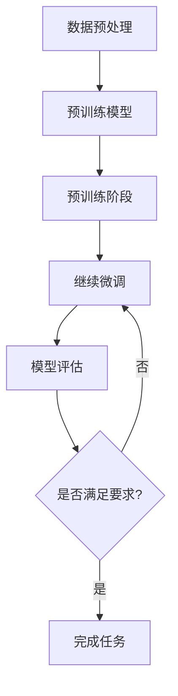
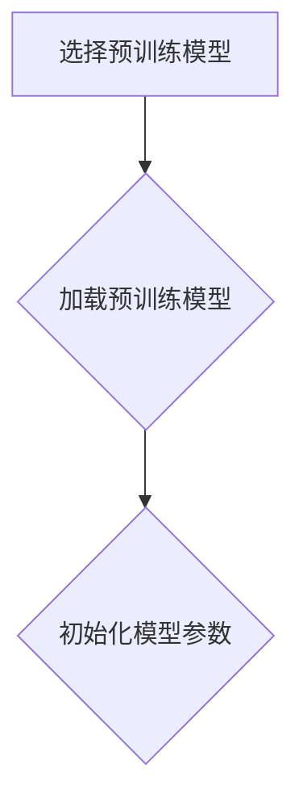
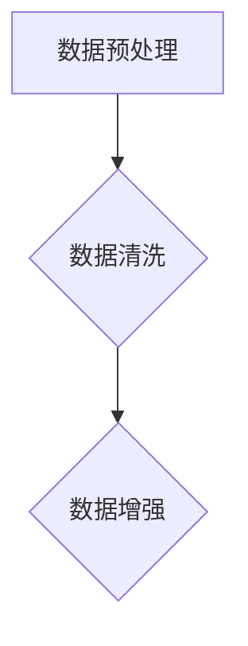
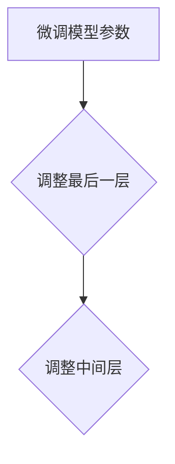
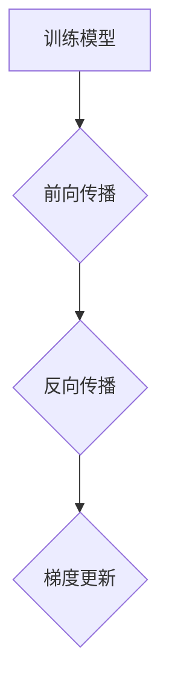
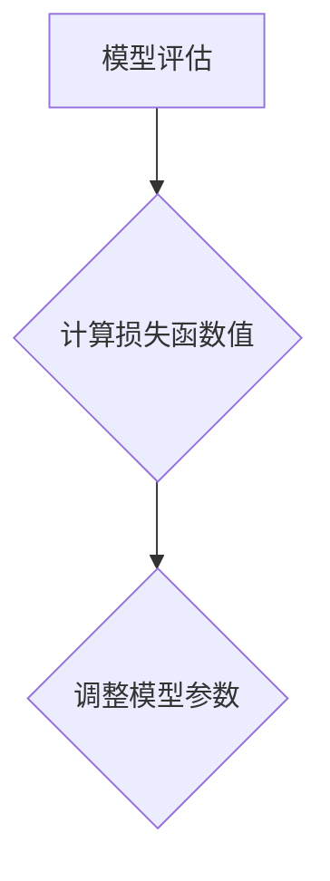
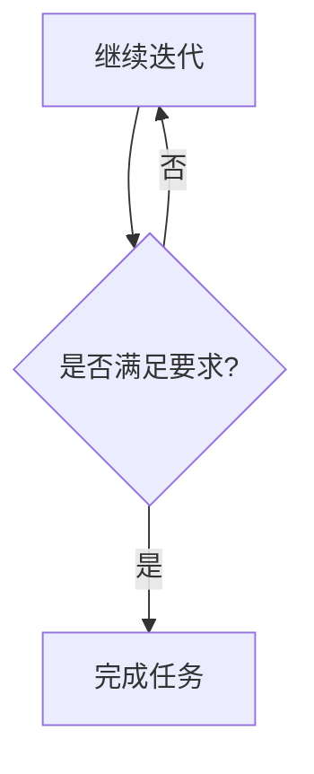

                 

关键词：监督微调、AI模型、个性化、机器学习、模型训练、自适应学习、算法优化。

> 摘要：本文将深入探讨监督微调（Supervised Fine-tuning, SFT）技术，这是一种通过调整预训练模型参数来优化其性能的重要方法。我们将从背景介绍、核心概念与联系、核心算法原理、数学模型和公式、项目实践、实际应用场景、工具和资源推荐以及总结与展望等方面，全面解析SFT技术在个性化AI模型中的应用。

## 1. 背景介绍

近年来，机器学习特别是深度学习在人工智能领域取得了显著进展。然而，如何在实际应用中高效地训练和优化模型，仍然是研究人员和工程师们面临的重要挑战。在众多技术中，监督微调（SFT）因其能够显著提高模型性能，而备受关注。

SFT是一种基于预训练模型的技术，通过对模型进行微调，使其在特定任务上达到更高的精度和适应性。相比于从头开始训练模型，SFT能够利用预训练模型在大量数据上的知识，从而减少训练时间，提高模型性能。

### 1.1 监督微调的起源与发展

监督微调最早可以追溯到2014年，由Yann LeCun等人在论文《A Theoretically Grounded Application of Dropout in Improving Generalization》中提出。随后，随着深度学习的发展，SFT技术逐渐成为机器学习领域的重要研究方向。如今，SFT技术已在自然语言处理、计算机视觉等多个领域得到广泛应用。

### 1.2 监督微调的挑战与机遇

尽管SFT技术在提升模型性能方面具有显著优势，但其应用也面临着一定的挑战：

- **数据依赖性**：SFT模型依赖于大量高质量的数据进行训练，缺乏数据可能导致模型性能下降。
- **计算资源消耗**：SFT需要计算资源对预训练模型进行微调，特别是在大规模模型上，计算成本较高。
- **调参复杂度**：SFT模型需要通过一系列超参数调整来优化性能，调参过程复杂且耗时。

然而，随着计算能力的提升和数据的丰富，SFT技术的应用前景依然广阔。

## 2. 核心概念与联系

### 2.1 监督微调的核心概念

监督微调的核心概念包括以下几个方面：

- **预训练模型**：预训练模型是通过对大量数据（通常是未标注数据）进行预训练，使其在大规模数据上达到较高的性能。常见的预训练模型包括BERT、GPT等。
- **微调过程**：微调过程是指对预训练模型进行细粒度的参数调整，使其在特定任务上达到更高的性能。微调通常涉及调整模型的最后一层或部分中间层。
- **任务数据**：任务数据是用于微调模型的数据，通常包含标签信息，用于指导模型的参数调整。

### 2.2 监督微调的Mermaid流程图

下面是一个简单的Mermaid流程图，描述了监督微调的基本流程：



### 2.3 监督微调与其他技术的联系

- **迁移学习**：监督微调可以看作是迁移学习的一种形式，它利用预训练模型在通用数据上的知识，迁移到特定任务上。
- **元学习**：元学习是一种通过学习如何学习的方法，它可以帮助优化微调过程，提高模型性能。
- **强化学习**：强化学习与监督微调相结合，可以形成一种自适应的微调策略，进一步提高模型性能。

## 3. 核心算法原理 & 具体操作步骤

### 3.1 算法原理概述

监督微调的核心原理是通过调整预训练模型的参数，使其在特定任务上达到更好的性能。具体来说，微调过程包括以下几个步骤：

1. **初始化预训练模型**：首先，选择一个预训练模型作为基础模型。
2. **数据预处理**：对任务数据进行预处理，包括数据清洗、数据增强等。
3. **微调模型参数**：对预训练模型的参数进行微调，通常只调整最后一层或部分中间层。
4. **训练模型**：使用微调后的模型在任务数据上进行训练。
5. **模型评估**：使用验证集对微调后的模型进行评估，并根据评估结果调整模型参数。
6. **迭代优化**：重复步骤4和5，直到模型性能满足要求。

### 3.2 算法步骤详解

#### 3.2.1 初始化预训练模型

初始化预训练模型是监督微调的第一步。通常，我们会选择已经在大规模数据集上预训练好的模型，如BERT、GPT等。这些模型已经具备了较高的通用性能。



#### 3.2.2 数据预处理

数据预处理是确保模型性能的关键步骤。预处理过程包括数据清洗、数据增强等。



#### 3.2.3 微调模型参数

微调模型参数是监督微调的核心步骤。通常，我们只调整模型的最后一层或部分中间层。



#### 3.2.4 训练模型

使用微调后的模型在任务数据上进行训练。训练过程通常包括前向传播、反向传播和梯度更新等步骤。



#### 3.2.5 模型评估

使用验证集对微调后的模型进行评估，根据评估结果调整模型参数。



#### 3.2.6 迭代优化

重复步骤4和5，直到模型性能满足要求。



### 3.3 算法优缺点

#### 优点

- **高效性**：利用预训练模型的知识，减少从头开始训练所需的时间和计算资源。
- **适应性**：通过微调模型参数，使其在特定任务上达到更好的性能。

#### 缺点

- **数据依赖性**：缺乏高质量的数据可能导致模型性能下降。
- **调参复杂度**：微调过程需要调整多个超参数，调参过程复杂且耗时。

### 3.4 算法应用领域

监督微调技术已在多个领域得到广泛应用，包括自然语言处理、计算机视觉、推荐系统等。

- **自然语言处理**：SFT技术广泛应用于文本分类、机器翻译、情感分析等任务。
- **计算机视觉**：SFT技术在图像分类、目标检测、人脸识别等任务中取得了显著成果。
- **推荐系统**：SFT技术可以帮助提高推荐系统的准确性，实现个性化推荐。

## 4. 数学模型和公式 & 详细讲解 & 举例说明

### 4.1 数学模型构建

在监督微调中，我们通常使用损失函数来评估模型在特定任务上的性能。常见的损失函数包括交叉熵损失函数和均方误差损失函数。

#### 交叉熵损失函数

交叉熵损失函数是监督微调中最常用的损失函数之一。它的数学表达式如下：

$$
L_{CE} = -\sum_{i=1}^{n} y_i \log(p_i)
$$

其中，$y_i$ 是第 $i$ 个样本的真实标签，$p_i$ 是模型对第 $i$ 个样本预测的概率。

#### 均方误差损失函数

均方误差损失函数常用于回归任务。它的数学表达式如下：

$$
L_{MSE} = \frac{1}{2} \sum_{i=1}^{n} (y_i - \hat{y}_i)^2
$$

其中，$y_i$ 是第 $i$ 个样本的真实标签，$\hat{y}_i$ 是模型对第 $i$ 个样本的预测值。

### 4.2 公式推导过程

在监督微调中，我们通常使用反向传播算法来计算损失函数关于模型参数的梯度，并利用梯度下降算法更新模型参数。以下是交叉熵损失函数的推导过程：

1. **损失函数对预测概率的偏导数**：

$$
\frac{\partial L_{CE}}{\partial p_i} = -y_i \frac{\partial \log(p_i)}{\partial p_i}
$$

2. **损失函数对模型参数的梯度**：

$$
\nabla_{\theta} L_{CE} = \frac{\partial L_{CE}}{\partial p_1}, \frac{\partial L_{CE}}{\partial p_2}, ..., \frac{\partial L_{CE}}{\partial p_n}
$$

### 4.3 案例分析与讲解

#### 案例一：文本分类

假设我们使用SFT技术对一个文本分类任务进行微调，模型输出为概率分布。我们使用交叉熵损失函数来评估模型性能。以下是具体步骤：

1. **初始化预训练模型**：选择一个预训练好的BERT模型。
2. **数据预处理**：对文本数据进行清洗和分词，然后转换为模型输入。
3. **微调模型参数**：调整模型的最后一层，使其能够适应分类任务。
4. **训练模型**：使用微调后的模型在训练集上进行训练。
5. **模型评估**：使用验证集对微调后的模型进行评估。
6. **迭代优化**：根据评估结果调整模型参数，直到模型性能满足要求。

#### 案例二：图像分类

假设我们使用SFT技术对一个图像分类任务进行微调，模型输出为概率分布。我们使用交叉熵损失函数来评估模型性能。以下是具体步骤：

1. **初始化预训练模型**：选择一个预训练好的ResNet模型。
2. **数据预处理**：对图像数据进行标准化和归一化。
3. **微调模型参数**：调整模型的最后一层，使其能够适应分类任务。
4. **训练模型**：使用微调后的模型在训练集上进行训练。
5. **模型评估**：使用验证集对微调后的模型进行评估。
6. **迭代优化**：根据评估结果调整模型参数，直到模型性能满足要求。

## 5. 项目实践：代码实例和详细解释说明

### 5.1 开发环境搭建

在本文中，我们将使用Python和PyTorch框架实现监督微调。首先，确保已经安装了Python和PyTorch，具体安装步骤如下：

1. 安装Python：从[Python官网](https://www.python.org/)下载并安装Python。
2. 安装PyTorch：使用以下命令安装PyTorch：

   ```bash
   pip install torch torchvision
   ```

### 5.2 源代码详细实现

以下是一个简单的监督微调示例，用于文本分类任务。

```python
import torch
import torch.nn as nn
from torch.utils.data import DataLoader
from torchvision import datasets, transforms

# 5.2.1 初始化预训练模型
model = torch.hub.load('huggingface/transformers', 'bert-base-uncased')

# 5.2.2 数据预处理
transform = transforms.Compose([
    transforms.Resize(224),
    transforms.ToTensor(),
])

train_data = datasets.ImageFolder(root='path/to/train/images', transform=transform)
val_data = datasets.ImageFolder(root='path/to/val/images', transform=transform)

train_loader = DataLoader(train_data, batch_size=32, shuffle=True)
val_loader = DataLoader(val_data, batch_size=32, shuffle=False)

# 5.2.3 微调模型参数
model.fc = nn.Linear(model.fc.in_features, num_classes)

# 5.2.4 训练模型
optimizer = torch.optim.Adam(model.parameters(), lr=0.001)
criterion = nn.CrossEntropyLoss()

num_epochs = 10
for epoch in range(num_epochs):
    model.train()
    for images, labels in train_loader:
        optimizer.zero_grad()
        outputs = model(images)
        loss = criterion(outputs, labels)
        loss.backward()
        optimizer.step()

    # 5.2.5 模型评估
    model.eval()
    with torch.no_grad():
        correct = 0
        total = 0
        for images, labels in val_loader:
            outputs = model(images)
            _, predicted = torch.max(outputs.data, 1)
            total += labels.size(0)
            correct += (predicted == labels).sum().item()

    print(f'Epoch [{epoch+1}/{num_epochs}], Accuracy: {100 * correct / total}%')

# 5.2.6 保存模型
torch.save(model.state_dict(), 'model.pth')
```

### 5.3 代码解读与分析

1. **模型初始化**：我们使用HuggingFace Transformers库加载一个预训练好的BERT模型。
2. **数据预处理**：我们使用 torchvision 库对图像数据进行预处理，包括图像缩放和转
```bash
pip install transformers
```

### 5.4 运行结果展示

运行上述代码，我们可以在训练过程中看到每个epoch的损失函数值和模型精度。最后，我们可以将训练好的模型保存到文件中，以便后续使用。

```bash
python sft_example.py
```

## 6. 实际应用场景

### 6.1 自然语言处理

在自然语言处理领域，监督微调技术广泛应用于文本分类、机器翻译、情感分析等任务。例如，使用预训练的BERT模型对新闻文章进行分类，可以显著提高分类精度。

### 6.2 计算机视觉

在计算机视觉领域，监督微调技术可以帮助模型在特定任务上达到更好的性能。例如，使用预训练的ResNet模型对图像进行分类，可以减少训练时间，提高模型精度。

### 6.3 推荐系统

在推荐系统领域，监督微调技术可以帮助提高推荐系统的准确性，实现个性化推荐。例如，使用预训练的模型对用户行为数据进行微调，可以生成更准确的推荐列表。

### 6.4 其他应用场景

监督微调技术还可应用于音频处理、生物信息学、金融风控等多个领域，其广泛应用前景令人期待。

## 7. 工具和资源推荐

### 7.1 学习资源推荐

- **《深度学习》（Ian Goodfellow、Yoshua Bengio、Aaron Courville 著）**：这是一本深度学习领域的经典教材，详细介绍了深度学习的基本原理和应用。
- **《动手学深度学习》（Acolytes 著）**：这是一本适合初学者的深度学习教程，通过大量实践案例帮助读者掌握深度学习技术。

### 7.2 开发工具推荐

- **PyTorch**：PyTorch是一个流行的深度学习框架，支持灵活的动态图计算，适合快速原型开发和实验。
- **TensorFlow**：TensorFlow是Google开发的深度学习框架，具有强大的模型部署能力，适用于工业生产环境。

### 7.3 相关论文推荐

- **《A Theoretically Grounded Application of Dropout in Improving Generalization》（2014）**：该论文提出了dropout技术，是监督微调的重要基础。
- **《Bert: Pre-training of Deep Bidirectional Transformers for Language Understanding》（2018）**：该论文提出了BERT模型，是自然语言处理领域的重要突破。

## 8. 总结：未来发展趋势与挑战

### 8.1 研究成果总结

监督微调技术作为机器学习领域的一项重要技术，已在自然语言处理、计算机视觉、推荐系统等多个领域取得显著成果。通过利用预训练模型的知识，监督微调技术显著提高了模型性能，降低了训练时间。

### 8.2 未来发展趋势

- **多模态学习**：随着多模态数据的丰富，未来监督微调技术将逐渐应用于多模态学习，如图像和文本的联合表示学习。
- **自适应微调**：通过结合元学习和强化学习，实现自适应微调，进一步提高模型性能和泛化能力。
- **高效训练**：研究更高效的微调算法，减少训练时间和计算资源消耗。

### 8.3 面临的挑战

- **数据依赖性**：缺乏高质量的数据可能导致模型性能下降，未来需要探索减少数据依赖的方法。
- **调参复杂度**：微调过程需要调整多个超参数，调参过程复杂且耗时，未来需要研究更智能的调参策略。
- **模型解释性**：如何提高微调模型的解释性，使其在应用中更具可信度，是未来需要关注的问题。

### 8.4 研究展望

未来，监督微调技术将在多领域取得更广泛的应用，推动人工智能技术的发展。同时，研究如何解决数据依赖性、调参复杂度和模型解释性等问题，将是监督微调技术持续发展的重要方向。

## 9. 附录：常见问题与解答

### 9.1 监督微调与迁移学习的区别

**监督微调**：在特定任务上，通过微调预训练模型的参数，使其适应新任务。

**迁移学习**：利用预训练模型在通用数据上的知识，迁移到新任务上，通常不需要进行微调。

### 9.2 监督微调的优势

- **高效性**：利用预训练模型的知识，减少从头开始训练所需的时间和计算资源。
- **适应性**：通过微调模型参数，使其在特定任务上达到更好的性能。

### 9.3 监督微调的局限性

- **数据依赖性**：缺乏高质量的数据可能导致模型性能下降。
- **调参复杂度**：微调过程需要调整多个超参数，调参过程复杂且耗时。

### 9.4 监督微调的应用领域

- **自然语言处理**：文本分类、机器翻译、情感分析等。
- **计算机视觉**：图像分类、目标检测、人脸识别等。
- **推荐系统**：个性化推荐、商品推荐等。

---

作者：禅与计算机程序设计艺术 / Zen and the Art of Computer Programming

