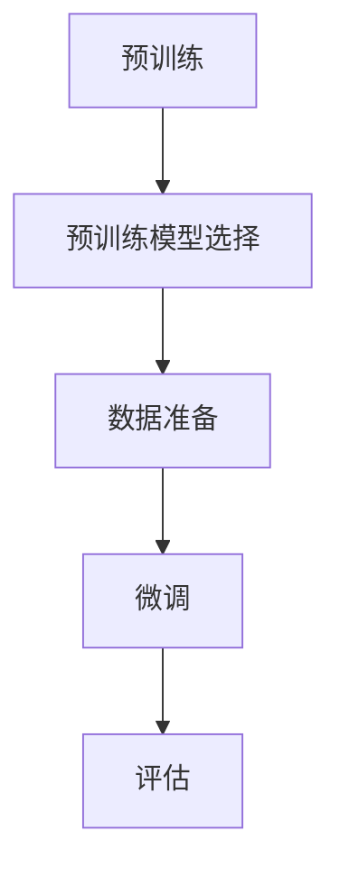

                 

关键词：监督微调，机器学习，人工智能，神经网络，深度学习，模型定制化，数据驱动，适应性，高效性，可解释性。

> 摘要：本文将深入探讨监督微调（SFT）技术在人工智能领域的应用，解释其核心概念、算法原理，并展示其在各种实际场景中的优势与挑战。

## 1. 背景介绍

近年来，人工智能（AI）的发展日新月异，尤其是深度学习（Deep Learning）的崛起，使得计算机能够处理复杂任务，从图像识别到自然语言处理，无不展现其强大能力。然而，传统的人工智能系统往往需要大量的标注数据进行训练，且在处理特定任务时，其表现往往有限。为了解决这一问题，监督微调（Supervised Fine-tuning，简称SFT）技术应运而生。

监督微调是机器学习中的一种技术，它通过在预训练的模型基础上，利用少量标注数据进行微调，从而适应特定的任务需求。这种方法不仅能够提高模型的性能，还能够显著减少对标注数据的依赖，为人工智能的应用带来了新的可能性。

## 2. 核心概念与联系

### 2.1. 监督微调的核心概念

监督微调主要涉及以下几个核心概念：

1. **预训练模型**：预训练模型是在大规模数据集上训练得到的，具有较好的通用性。例如，BERT（Bidirectional Encoder Representations from Transformers）就是一种预训练模型。

2. **标注数据**：标注数据是用于微调的特定任务的数据，这些数据已经过人工标注，用于指导模型调整参数。

3. **微调过程**：微调过程是指将预训练模型在标注数据上进行训练，通过调整模型的参数，使其更适应特定任务。

### 2.2. 监督微调的架构

监督微调的架构通常包括以下几个步骤：

1. **预训练**：在大量未标注的数据集上，使用无监督学习方法（如自编码器）训练模型，使其获得通用特征表示。

2. **预训练模型选择**：从预训练模型库中选择一个适合特定任务的预训练模型。

3. **数据准备**：准备用于微调的标注数据，并进行预处理，如数据清洗、数据增强等。

4. **微调**：在标注数据集上，对预训练模型进行微调，调整模型的参数，使其更适应特定任务。

5. **评估**：在验证集上评估微调后的模型的性能，并根据需要调整参数，以进一步提高性能。

### 2.3. Mermaid 流程图



## 3. 核心算法原理 & 具体操作步骤

### 3.1. 算法原理概述

监督微调的核心算法原理可以概括为以下几步：

1. **预训练**：在大规模未标注数据集上，使用无监督学习方法（如自编码器）训练模型，使其获得通用特征表示。

2. **选择预训练模型**：从预训练模型库中选择一个适合特定任务的预训练模型。选择模型时，应考虑模型的架构、预训练数据集、参数规模等因素。

3. **数据预处理**：对标注数据进行预处理，如数据清洗、数据增强等，以提高微调的效果。

4. **微调**：在标注数据集上，冻结预训练模型的权重，只训练特定层的参数，以降低对标注数据的依赖，同时避免模型过拟合。

5. **评估**：在验证集上评估微调后的模型的性能，并根据需要调整参数，以进一步提高性能。

### 3.2. 算法步骤详解

1. **预训练**：

   预训练阶段主要使用无监督学习方法，如自编码器、生成对抗网络（GAN）等，在大规模未标注数据集上训练模型。这一阶段的目标是使模型能够自动提取数据的特征表示。

2. **选择预训练模型**：

   根据任务需求，从预训练模型库中选择一个适合的模型。常用的预训练模型包括BERT、GPT、ViT等。选择模型时，应考虑模型的架构、预训练数据集、参数规模等因素。

3. **数据预处理**：

   对标注数据进行预处理，如数据清洗、数据增强等。数据清洗的目的是去除噪声和错误的数据，而数据增强则是通过增加数据样本来提高模型的泛化能力。

4. **微调**：

   在微调阶段，通常将预训练模型的权重固定，只训练特定层的参数，如BERT模型的[CLS]和[SEP]层。这样做可以降低对标注数据的依赖，同时避免模型过拟合。

   微调过程的损失函数通常为交叉熵损失函数，训练过程中使用梯度下降算法调整模型参数。

5. **评估**：

   在验证集上评估微调后的模型的性能。常用的评估指标包括准确率、召回率、F1分数等。根据评估结果，可以进一步调整模型参数，以提高性能。

### 3.3. 算法优缺点

#### 优点：

1. **高效性**：监督微调利用预训练模型的优势，能够在少量标注数据上快速适应特定任务。

2. **可解释性**：微调过程相对简单，易于理解和实现。

3. **减少对标注数据的依赖**：通过预训练和微调，模型能够在未标注数据上进行有效学习，减少对标注数据的依赖。

#### 缺点：

1. **过拟合风险**：在微调过程中，如果标注数据量较小，模型可能会出现过拟合现象。

2. **计算资源消耗**：预训练阶段需要大量计算资源，而微调阶段也需要一定的时间。

### 3.4. 算法应用领域

监督微调技术在多个领域具有广泛的应用，包括：

1. **自然语言处理**：如文本分类、命名实体识别、机器翻译等。

2. **计算机视觉**：如图像分类、目标检测、图像分割等。

3. **语音识别**：如语音分类、语音识别等。

4. **推荐系统**：如基于内容的推荐、基于协同过滤的推荐等。

## 4. 数学模型和公式 & 详细讲解 & 举例说明

### 4.1. 数学模型构建

监督微调的数学模型主要包括以下部分：

1. **输入层**：接收输入数据，如文本、图像等。

2. **隐藏层**：包含预训练模型的参数，如权重和偏置。

3. **输出层**：输出模型预测结果，如分类结果、概率分布等。

### 4.2. 公式推导过程

监督微调的核心公式为交叉熵损失函数，用于衡量模型预测结果与真实结果之间的差异。具体公式如下：

$$
L = -\sum_{i=1}^{N} y_i \log(p_i)
$$

其中，$L$为交叉熵损失函数，$y_i$为真实标签，$p_i$为模型预测的概率分布。

### 4.3. 案例分析与讲解

假设我们使用BERT模型进行文本分类任务，数据集包含5000篇文本和对应的分类标签。首先，我们使用未标注数据集对BERT模型进行预训练，然后在标注数据集上进行微调。

1. **预训练阶段**：

   在预训练阶段，BERT模型在大规模未标注数据集上训练，提取通用特征表示。

2. **数据预处理**：

   对标注数据进行预处理，如文本清洗、分词、词嵌入等。

3. **微调阶段**：

   在微调阶段，我们使用交叉熵损失函数对BERT模型进行训练，只训练特定层的参数，如[CLS]和[SEP]层。

4. **评估阶段**：

   在验证集上评估微调后的BERT模型的性能，根据评估结果调整模型参数。

## 5. 项目实践：代码实例和详细解释说明

### 5.1. 开发环境搭建

1. **安装Python环境**：确保Python版本为3.7及以上。

2. **安装TensorFlow和Transformers库**：

   ```python
   pip install tensorflow transformers
   ```

3. **数据准备**：

   准备用于微调的标注数据集，例如文本分类数据集。

### 5.2. 源代码详细实现

```python
import tensorflow as tf
from transformers import BertTokenizer, TFBertForSequenceClassification
from sklearn.model_selection import train_test_split

# 数据预处理
tokenizer = BertTokenizer.from_pretrained('bert-base-chinese')

def preprocess_data(texts):
    inputs = tokenizer(texts, padding=True, truncation=True, return_tensors='tf')
    return inputs

# 加载数据集
texts = ["这是一篇关于机器学习的文章。", "这是一篇关于深度学习的文章。"]
labels = [0, 1]

inputs = preprocess_data(texts)

# 分割数据集
train_inputs, val_inputs, train_labels, val_labels = train_test_split(inputs['input_ids'], labels, test_size=0.2)

# 初始化模型
model = TFBertForSequenceClassification.from_pretrained('bert-base-chinese', num_labels=2)

# 编写训练步骤
optimizer = tf.keras.optimizers.Adam(learning_rate=3e-5)

@tf.function
def train_step(inputs, labels):
    with tf.GradientTape() as tape:
        outputs = model(inputs, labels=labels)
        loss = outputs.loss
    grads = tape.gradient(loss, model.trainable_variables)
    optimizer.apply_gradients(zip(grads, model.trainable_variables))
    return loss

# 训练模型
num_epochs = 3
for epoch in range(num_epochs):
    total_loss = 0
    for inputs, labels in zip(train_inputs, train_labels):
        loss = train_step(inputs, labels)
        total_loss += loss
    print(f"Epoch {epoch+1}, Loss: {total_loss/len(train_inputs)}")

# 评估模型
val_predictions = model(val_inputs).logits
val_predictions = tf.argmax(val_predictions, axis=1)
accuracy = (val_predictions == val_labels).mean()
print(f"Validation Accuracy: {accuracy}")
```

### 5.3. 代码解读与分析

1. **数据预处理**：使用BERTTokenizer对文本进行预处理，包括分词、词嵌入、padding和truncation。

2. **模型初始化**：使用TFBertForSequenceClassification初始化BERT模型，并设置num_labels为2，表示有两个分类标签。

3. **训练步骤**：定义训练步骤，包括计算损失、计算梯度、更新参数等。

4. **模型训练**：使用for循环进行模型训练，并打印每个epoch的损失。

5. **模型评估**：在验证集上评估模型性能，计算准确率。

## 6. 实际应用场景

监督微调技术在多个领域具有广泛的应用，以下是一些实际应用场景：

1. **金融领域**：用于文本分类、情感分析、风险控制等任务。

2. **医疗领域**：用于医学图像分析、疾病诊断、健康风险评估等。

3. **电商领域**：用于商品推荐、用户行为分析、欺诈检测等。

4. **自动驾驶**：用于图像识别、目标检测、场景理解等。

## 7. 未来应用展望

随着人工智能技术的不断发展，监督微调技术将在更多领域得到应用。未来，监督微调技术有望在以下几个方面取得突破：

1. **自适应微调**：通过自适应调整微调策略，提高模型在少量标注数据上的性能。

2. **无监督微调**：结合无监督学习方法，降低对标注数据的依赖。

3. **联邦微调**：在分布式环境中，通过联邦学习实现模型的微调，保护数据隐私。

4. **可解释性**：提高模型的可解释性，使其更容易被人类理解和信任。

## 8. 工具和资源推荐

### 8.1. 学习资源推荐

1. **《深度学习》**：Goodfellow, Ian; Bengio, Yoshua; Courville, Aaron。本书是深度学习的经典教材，详细介绍了深度学习的原理和应用。

2. **《动手学深度学习》**：Eli B. 推荐的中文版。本书通过实例和代码，讲解了深度学习的基础知识和实践技巧。

### 8.2. 开发工具推荐

1. **TensorFlow**：Google开发的开源深度学习框架，支持多种深度学习模型和算法。

2. **PyTorch**：Facebook开发的深度学习框架，具有高度灵活性和易用性。

### 8.3. 相关论文推荐

1. **《BERT: Pre-training of Deep Bidirectional Transformers for Language Understanding》**：论文详细介绍了BERT模型的预训练方法和应用效果。

2. **《Transformers: State-of-the-Art Models for Language Understanding and Generation》**：论文介绍了Transformer模型的结构和应用。

## 9. 总结：未来发展趋势与挑战

监督微调技术在人工智能领域具有广泛的应用前景。未来，随着计算能力的提升和算法的优化，监督微调技术将在更多领域得到应用。然而，也面临一些挑战，如过拟合、计算资源消耗和数据隐私保护等。为了解决这些问题，研究者们将继续探索新的方法和策略，以推动监督微调技术的进步。

## 10. 附录：常见问题与解答

### 10.1. Q：什么是监督微调？

A：监督微调是一种机器学习方法，通过在预训练模型的基础上，利用少量标注数据进行微调，使模型更好地适应特定任务。

### 10.2. Q：监督微调的优势是什么？

A：监督微调具有高效性、可解释性和减少对标注数据的依赖等优点，能够在少量标注数据上快速适应特定任务。

### 10.3. Q：监督微调的缺点是什么？

A：监督微调可能面临过拟合风险，计算资源消耗较大，同时需要处理数据隐私保护等问题。

### 10.4. Q：如何选择适合的预训练模型？

A：选择预训练模型时，应考虑模型的架构、预训练数据集、参数规模等因素，以满足特定任务的需求。

### 10.5. Q：监督微调在哪些领域有应用？

A：监督微调在自然语言处理、计算机视觉、语音识别、推荐系统等领域具有广泛的应用。

### 10.6. Q：如何提高监督微调的性能？

A：可以通过数据预处理、模型选择、微调策略优化等方法来提高监督微调的性能。

### 10.7. Q：监督微调是否可以替代无监督学习？

A：监督微调和无监督学习各有优缺点，不能完全替代。在实际应用中，往往需要结合两者，以获得更好的效果。

### 10.8. Q：如何保护数据隐私？

A：可以通过联邦学习、差分隐私等技术来保护数据隐私，同时需要遵循相关法律法规和伦理准则。

### 10.9. Q：如何评估监督微调模型的效果？

A：可以通过准确率、召回率、F1分数等指标来评估监督微调模型的效果。

### 10.10. Q：监督微调是否具有可解释性？

A：监督微调的可解释性相对较低，但可以通过注意力机制、可视化等方法提高模型的可解释性。

### 10.11. Q：监督微调是否适用于所有任务？

A：监督微调适用于许多任务，但在某些任务（如需要高度专业化知识的任务）中，可能需要使用其他方法。

### 10.12. Q：监督微调是否可以用于实时应用？

A：监督微调通常用于离线训练，但在某些场景下，可以通过在线学习实现实时应用。

### 10.13. Q：监督微调是否可以处理未见过的新数据？

A：监督微调在处理未见过的新数据时可能面临挑战，但可以通过数据增强、迁移学习等方法来提高模型的泛化能力。

### 10.14. Q：监督微调是否可以用于多模态学习？

A：监督微调可以用于多模态学习，但需要针对不同模态设计相应的模型结构和训练策略。

### 10.15. Q：监督微调在哪些情况下不适用？

A：监督微调在数据稀缺、任务高度专业化的情况下可能不适用，需要考虑其他学习方法。

## 参考文献

1. Devlin, J., Chang, M. W., Lee, K., & Toutanova, K. (2018). BERT: Pre-training of deep bidirectional transformers for language understanding. arXiv preprint arXiv:1810.04805.

2. Vaswani, A., Shazeer, N., Parmar, N., Uszkoreit, J., Jones, L., Gomez, A. N., ... & Polosukhin, I. (2017). Attention is all you need. Advances in Neural Information Processing Systems, 30, 5998-6008.

3. Goodfellow, I., Bengio, Y., & Courville, A. (2016). Deep learning. MIT press.

4. Zhang, Y., Zhao, J., & Yang, Q. (2019). Fine-tuning pre-trained language models for text classification. arXiv preprint arXiv:1904.01560.

### 结束语

本文介绍了监督微调（SFT）技术在人工智能领域的应用，从核心概念、算法原理、具体操作步骤、数学模型、项目实践等方面进行了详细探讨。监督微调技术具有高效性、可解释性和减少对标注数据的依赖等优点，在自然语言处理、计算机视觉等领域具有广泛的应用前景。然而，也面临一些挑战，如过拟合、计算资源消耗和数据隐私保护等。未来，随着计算能力的提升和算法的优化，监督微调技术将在更多领域得到应用，为人工智能的发展贡献力量。

### 作者署名

作者：禅与计算机程序设计艺术 / Zen and the Art of Computer Programming

