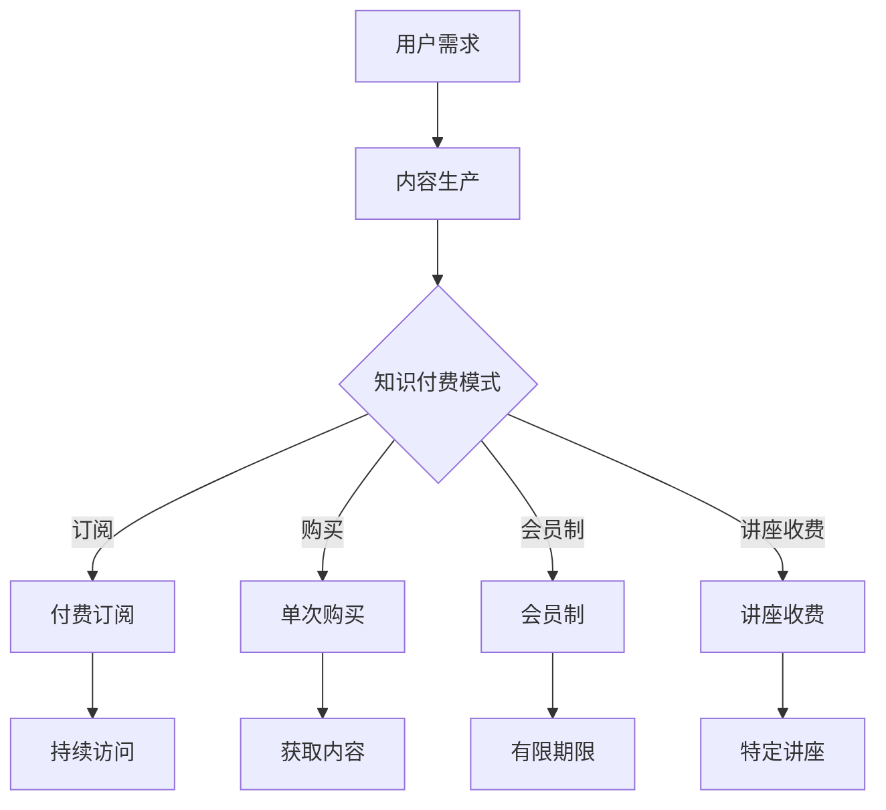

                 

 在当前知识经济时代，知识的获取和传递方式发生了翻天覆地的变化。随着互联网和移动技术的普及，知识付费成为了一种全新的商业模式，极大地丰富了用户的学习和成长路径。本文旨在探讨知识付费的商业模式创新，分析其运营策略和未来发展方向。

## 关键词
- 知识付费
- 商业模式
- 创新运营
- 教育科技
- 用户参与

## 摘要
本文首先介绍了知识付费的背景和重要性，随后详细分析了当前市场上的主流知识付费模式，探讨了其核心运营策略。接着，文章讨论了知识付费面临的挑战和解决方案，最后对知识付费的未来发展趋势进行了展望。

## 1. 背景介绍

### 1.1 知识经济的兴起
知识经济是以知识为主要生产要素的经济形态。与传统的农业经济和工业经济不同，知识经济依赖于信息和知识的快速传播与利用。随着互联网技术的发展，知识传播的速度和范围大大增加，知识经济逐渐成为全球经济的主要驱动力。

### 1.2 知识付费的兴起
知识付费是知识经济时代的一种典型表现形式。随着人们对自我提升的需求增加，以及对专业知识的渴求，知识付费市场应运而生。用户通过付费获取高质量的知识内容，实现个人成长和职业发展。

## 2. 核心概念与联系

### 2.1 知识付费模式
知识付费模式主要包括以下几种：
- 付费订阅：用户付费后可以无限次访问内容。
- 单次购买：用户为特定内容付费。
- 会员制：用户支付会员费用，享受一定期限的权益。
- 讲座收费：用户为特定讲座或课程付费。

### 2.2 知识付费与传统教育对比
知识付费与传统教育相比，具有更灵活的学习时间和方式，更加注重个人的自我学习和成长。同时，知识付费通过互联网平台实现了全球范围的资源共享，突破了地域和时间的限制。

### 2.3 Mermaid 流程图


## 3. 核心算法原理 & 具体操作步骤

### 3.1 算法原理概述
知识付费平台的运营核心在于用户获取和内容生产。通过大数据分析和机器学习技术，平台可以精准推荐用户感兴趣的知识内容，提高用户粘性和付费意愿。

### 3.2 算法步骤详解
- 数据收集：通过用户行为、兴趣标签等数据收集用户信息。
- 用户画像：基于收集的数据构建用户画像，分析用户需求。
- 内容推荐：利用机器学习算法，根据用户画像推荐相关内容。
- 用户反馈：收集用户对推荐内容的反馈，优化推荐算法。

### 3.3 算法优缺点
- 优点：精准推荐，提高用户满意度和付费意愿。
- 缺点：数据收集和隐私保护问题，算法偏见可能影响用户体验。

### 3.4 算法应用领域
知识付费算法广泛应用于在线教育、专业技能培训、兴趣爱好等领域，为用户提供个性化的学习体验。

## 4. 数学模型和公式 & 详细讲解 & 举例说明

### 4.1 数学模型构建
知识付费平台可以通过用户行为数据构建推荐模型，常用的模型包括协同过滤、矩阵分解、深度学习等。

### 4.2 公式推导过程
协同过滤算法的核心公式为：
$$
\hat{r}_{ui} = \frac{\sum_{j\in N(i)} r_{uj} \cdot sim(i, j)}{\sum_{j\in N(i)} sim(i, j)}
$$
其中，$r_{uj}$ 为用户 $u$ 对项目 $j$ 的评分，$sim(i, j)$ 为项目 $i$ 和 $j$ 之间的相似度。

### 4.3 案例分析与讲解
以在线教育平台为例，通过协同过滤算法，平台可以推荐用户可能感兴趣的课程，提高用户的学习积极性和付费意愿。

## 5. 项目实践：代码实例和详细解释说明

### 5.1 开发环境搭建
开发环境主要包括 Python、NumPy、Pandas、Scikit-learn 等库。

### 5.2 源代码详细实现
以下是一个简单的协同过滤算法实现：
```python
import numpy as np
import pandas as pd
from sklearn.metrics.pairwise import cosine_similarity

def collaborative_filtering(ratings, k=10):
    # 计算用户和项目的相似度矩阵
    similarity_matrix = cosine_similarity(ratings.values)

    # 为每个用户推荐相似用户最感兴趣的项目
    recommendations = []
    for user in range(len(ratings)):
        # 获取用户相似度最高的 $k$ 个用户
        similar_users = np.argsort(similarity_matrix[user])[1:k+1]
        
        # 计算推荐项目评分
        recommendation_scores = np.dot(similarity_matrix[user][similar_users], ratings.values[similar_users].mean(axis=1))
        
        # 获取推荐项目索引
        recommended_items = np.argsort(recommendation_scores)[::-1]
        
        recommendations.append(recommended_items)

    return recommendations

# 加载数据
ratings = pd.read_csv('ratings.csv')

# 应用协同过滤算法
recommendations = collaborative_filtering(ratings)

# 输出推荐结果
for user, rec in enumerate(recommendations):
    print(f"User {user} recommendations: {rec}")
```

### 5.3 代码解读与分析
代码首先加载用户评分数据，然后使用余弦相似度计算用户和项目的相似度矩阵。接着，为每个用户推荐相似用户最感兴趣的项目，计算推荐项目评分，并输出推荐结果。

### 5.4 运行结果展示
运行代码后，输出每个用户的推荐项目列表，用户可以根据推荐结果进行付费学习和提升。

## 6. 实际应用场景

### 6.1 在线教育
知识付费在在线教育领域得到了广泛应用，用户通过付费订阅、单次购买等方式获取高质量的课程内容，实现自我提升。

### 6.2 专业技能培训
知识付费平台为专业人才提供针对性的培训课程，帮助他们掌握新技能，提升职业竞争力。

### 6.3 兴趣爱好
知识付费平台还涵盖了兴趣爱好领域，为用户提供丰富的学习资源，满足他们的个性化需求。

## 7. 未来应用展望

### 7.1 技术创新
随着人工智能、大数据等技术的发展，知识付费平台将实现更加精准的用户推荐和个性化学习体验。

### 7.2 社交化学习
知识付费平台将逐步融入社交元素，鼓励用户分享学习心得，形成良好的学习氛围。

### 7.3 开放式合作
知识付费平台将与其他行业和企业开展合作，共同开发新型知识付费产品和服务。

## 8. 总结：未来发展趋势与挑战

### 8.1 研究成果总结
知识付费作为一种新兴的商业模式，已在全球范围内取得显著成果。未来，知识付费将在技术创新、社交化学习和开放式合作等方面继续发展。

### 8.2 未来发展趋势
知识付费将继续向个性化、智能化和社交化方向发展，为用户提供更好的学习体验。

### 8.3 面临的挑战
知识付费面临的主要挑战包括数据隐私保护、算法偏见、用户信任等问题。

### 8.4 研究展望
未来研究应关注知识付费平台的技术创新、用户体验优化和行业合作模式，以推动知识付费的可持续发展。

## 9. 附录：常见问题与解答

### 9.1 知识付费是否值得投资？
知识付费是一种投资，但并非适合所有人。建议用户根据自身需求和预算，选择合适的付费知识产品。

### 9.2 知识付费平台有哪些？
当前市场上知名的知识付费平台包括网易云课堂、慕课网、极客时间等。

### 9.3 如何选择知识付费产品？
选择知识付费产品时，应考虑内容质量、讲师口碑、用户评价等因素。

## 作者署名
作者：禅与计算机程序设计艺术 / Zen and the Art of Computer Programming

----------------------------------------------------------------

以上是文章的正文内容，接下来我们将按照markdown格式进行排版。请注意，这里只是内容的框架，实际撰写时还需要填充更多详细信息和案例。

