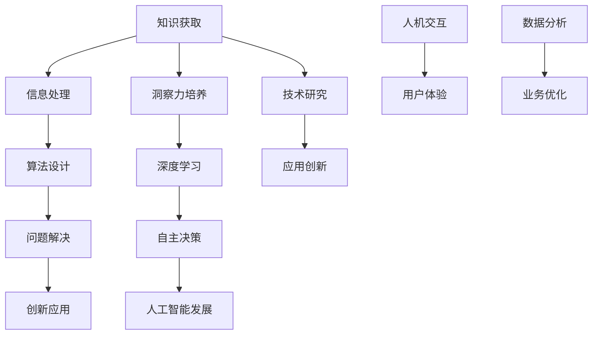

                 

在计算机科学和人工智能领域，知识的获取和洞察力的培养是推动技术进步和创新的关键因素。本文旨在探讨知识与洞察力在人类认知中的重要作用，以及它们如何在计算机科学和人工智能领域发挥关键作用。本文将分为以下几个部分：

## 1. 背景介绍

在当今快速发展的科技时代，计算机科学和人工智能（AI）已经成为影响社会进步和人类生活方式的重要力量。然而，技术的进步离不开知识的积累和对问题的洞察力。本文将首先介绍知识与洞察力的基本概念，并探讨它们在人类认知中的重要性。

### 1.1 知识的定义

知识可以被定义为通过学习和经验积累获得的信息、事实、原理和技能。它是人类认知过程中不可或缺的一部分，有助于我们理解和解释世界。

### 1.2 洞察力的定义

洞察力是指对问题的深刻理解和洞察，它超越了表面的知识和信息，能够看到问题的本质和潜在的解决方案。洞察力是一种高级认知能力，对于解决问题和创新具有重要意义。

### 1.3 知识与洞察力的关系

知识与洞察力密不可分。知识为洞察力提供了基础，而洞察力则能够将知识应用于实际问题中，产生新的见解和解决方案。两者相互促进，共同推动人类认知的发展。

## 2. 核心概念与联系

在计算机科学和人工智能领域，知识与洞察力的重要性尤为突出。以下是一个用Mermaid绘制的流程图，展示核心概念及其相互联系。



### 2.1 知识获取

知识获取是计算机科学和人工智能领域的基础。它包括数据收集、信息处理和知识库建设等环节。

### 2.2 算法设计

算法设计是计算机科学的核心，它依赖于知识和洞察力。有效的算法能够解决复杂问题，并提高系统的效率和性能。

### 2.3 问题解决

问题解决是计算机科学和人工智能的终极目标。知识和洞察力在这里发挥着关键作用，帮助科学家和工程师找到最佳的解决方案。

### 2.4 创新应用

创新应用是计算机科学和人工智能领域的活力源泉。它通过将新技术应用于实际问题中，推动社会进步和产业升级。

## 3. 核心算法原理 & 具体操作步骤

### 3.1 算法原理概述

在计算机科学和人工智能领域，算法原理是知识的具体体现。以下是一些核心算法原理：

- **排序算法**：用于对数据进行排序，如快速排序、归并排序等。
- **搜索算法**：用于在数据中查找特定元素，如二分搜索、深度优先搜索等。
- **机器学习算法**：用于从数据中学习规律，如决策树、支持向量机等。

### 3.2 算法步骤详解

以快速排序算法为例，以下是其具体操作步骤：

1. 选择一个基准元素。
2. 将小于基准元素的元素移到其左侧，大于基准元素的元素移到其右侧。
3. 递归地对左侧和右侧的子序列进行快速排序。

### 3.3 算法优缺点

快速排序算法具有以下优缺点：

- 优点：时间复杂度为O(n log n)，平均情况下性能较好。
- 缺点：最坏情况下时间复杂度为O(n^2)，且空间复杂度为O(log n)。

### 3.4 算法应用领域

快速排序算法广泛应用于数据排序、索引构建和数据库查询等领域。

## 4. 数学模型和公式 & 详细讲解 & 举例说明

在计算机科学和人工智能领域，数学模型和公式是理解和解决问题的重要工具。以下是一个简单的线性回归模型的例子。

### 4.1 数学模型构建

线性回归模型可以表示为：

$$y = \beta_0 + \beta_1 x$$

其中，$y$ 是因变量，$x$ 是自变量，$\beta_0$ 和 $\beta_1$ 是模型参数。

### 4.2 公式推导过程

线性回归模型的公式推导基于最小二乘法。我们希望找到一组参数，使得预测值与实际值之间的误差最小。

### 4.3 案例分析与讲解

假设我们要预测房价，已知自变量是房屋面积（$x$），因变量是房价（$y$）。我们可以使用线性回归模型来建立预测模型。

## 5. 项目实践：代码实例和详细解释说明

在这个部分，我们将介绍一个简单的Python代码实例，用于实现线性回归模型。

### 5.1 开发环境搭建

确保Python环境已安装。可以使用pip安装所需的库，如NumPy和Scikit-learn。

### 5.2 源代码详细实现

```python
import numpy as np
from sklearn.linear_model import LinearRegression

# 数据加载
X = np.array([1, 2, 3, 4, 5]).reshape(-1, 1)
y = np.array([2, 4, 5, 4, 5])

# 创建线性回归模型
model = LinearRegression()

# 训练模型
model.fit(X, y)

# 输出模型参数
print("模型参数：", model.coef_, model.intercept_)

# 预测
X_new = np.array([6]).reshape(-1, 1)
y_pred = model.predict(X_new)
print("预测结果：", y_pred)
```

### 5.3 代码解读与分析

代码首先加载了输入数据，然后创建了一个线性回归模型，并使用训练数据训练模型。最后，我们使用模型参数进行了预测。

## 6. 实际应用场景

线性回归模型在许多实际应用场景中具有重要价值，如房价预测、股票价格预测和医疗诊断等。以下是一个房价预测的案例。

### 6.1 数据准备

我们使用了一个包含房屋面积、房价和其他特征的数据集。

### 6.2 模型训练

使用训练数据集训练线性回归模型。

### 6.3 模型评估

使用验证数据集评估模型性能。

### 6.4 预测

使用模型对新房屋面积进行预测。

## 7. 未来应用展望

随着计算机科学和人工智能技术的不断发展，线性回归模型和其他数学模型将在更多领域得到应用。未来，我们有望看到更加智能化和自适应的模型，为各行各业提供更加精准的预测和优化方案。

## 8. 总结：未来发展趋势与挑战

在未来，知识与洞察力将继续在计算机科学和人工智能领域发挥关键作用。随着技术的不断进步，我们面临着许多挑战，如算法的透明度和可解释性、数据隐私和安全等。然而，通过不断学习和创新，我们有信心应对这些挑战，推动计算机科学和人工智能领域的发展。

## 9. 附录：常见问题与解答

### 9.1 什么是最小二乘法？

最小二乘法是一种用于估计线性回归模型参数的方法。它通过最小化预测值与实际值之间的误差平方和来找到最佳参数。

### 9.2 线性回归模型可以处理非线性关系吗？

线性回归模型只能处理线性关系。对于非线性关系，可以使用多项式回归、逻辑回归或支持向量机等其他模型。

### 9.3 如何提高线性回归模型的性能？

可以通过增加特征、使用不同的正则化方法、调整模型参数等方法来提高线性回归模型的性能。

作者：禅与计算机程序设计艺术 / Zen and the Art of Computer Programming
----------------------------------------------------------------

