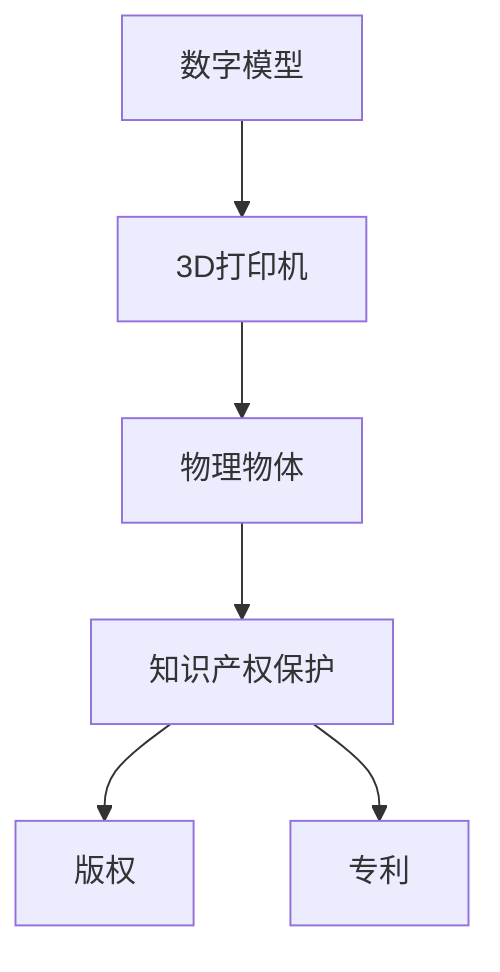

                 

在过去的几十年中，3D打印技术经历了迅速的发展，从实验室的研究项目走向了商业应用，并在制造业、医疗、建筑等多个领域展现出了巨大的潜力。然而，随着3D打印技术的普及，知识产权（Intellectual Property, IP）保护问题也随之浮现，成为了一个备受关注的话题。本文将深入探讨知识产权与3D打印技术之间的挑战，并尝试提出一些可能的解决方案。

> **关键词：知识产权，3D打印，版权，专利，挑战，解决方案**

> **摘要：本文首先介绍了3D打印技术的背景和发展，然后讨论了知识产权在3D打印领域的重要性，接着分析了3D打印技术对知识产权保护带来的挑战，最后提出了一些可能的解决方案。**

## 1. 背景介绍

### 1.1 3D打印技术的起源与发展

3D打印技术，也称为增材制造（Additive Manufacturing），其基本原理是通过逐层添加材料来构建三维物体。这项技术的起源可以追溯到20世纪80年代，当时美国工程师查尔斯·海恩斯（Charles Hull）发明了立体光固化成型（Stereo Lithography）技术，这是最早的3D打印技术之一。

随着计算机技术和材料科学的进步，3D打印技术经历了快速发展。20世纪90年代，选择性激光烧结（Selective Laser Sintering）和熔融沉积建模（Fused Deposition Modeling）等技术的出现，使得3D打印的应用范围进一步扩大。进入21世纪，3D打印技术逐渐走向商业化，其成本也在不断降低，这使得更多的企业和个人能够利用这一技术进行创新。

### 1.2 3D打印技术的应用领域

3D打印技术的应用领域广泛，包括但不限于以下几个方面：

- **制造业**：通过3D打印，企业可以实现复杂零部件的快速制造，降低生产成本，提高生产效率。
- **医疗**：3D打印技术可以用于制造个性化的医疗器械和假肢，以及进行手术模拟。
- **建筑**：3D打印技术可以用于打印建筑结构，如房屋和桥梁，具有高效、环保的特点。
- **航空航天**：3D打印技术可以用于制造飞机和宇宙飞船的零部件，提高结构强度，减少重量。

### 1.3 3D打印技术的影响

3D打印技术的出现，不仅改变了制造业的生产方式，也对知识产权保护带来了新的挑战。3D打印技术使得复制和保护具有复杂几何形状的物品变得更加容易，这引发了对版权、专利和商标等知识产权的重新思考。

## 2. 核心概念与联系

### 2.1 知识产权的概念

知识产权是指人们对于自己的智力劳动成果所享有的权利。它包括版权、专利、商标、商业秘密等多种形式。在3D打印技术中，知识产权主要涉及版权和专利。

- **版权（Copyright）**：版权是指作者对其文学、艺术和科学作品所享有的专有权利，包括复制权、发行权、表演权等。
- **专利（Patent）**：专利是指国家专利机构授予发明人对其发明所享有的专有权利，包括制造权、使用权、销售权等。

### 2.2 3D打印与知识产权的联系

3D打印技术的核心在于通过数字模型指导物理物体的制造。在这个过程中，知识产权的保护变得尤为重要。

- **版权保护**：3D打印的技术原理依赖于数字模型的生成和转换，这涉及到版权的保护问题。例如，一个设计作品的数字模型，如果未经授权就被复制或分发，就可能侵犯版权。
- **专利保护**：3D打印技术本身可能涉及多项专利，如打印机的制造技术、打印材料等。如果这些技术被未经授权的第三方使用，就可能侵犯专利权。

### 2.3 Mermaid 流程图

以下是一个简化的Mermaid流程图，展示了3D打印与知识产权之间的联系：



在这个流程图中，数字模型通过3D打印机转化为物理物体，而这个过程需要受到知识产权的保护。

## 3. 核心算法原理 & 具体操作步骤

### 3.1 算法原理概述

3D打印的核心算法主要包括两部分：数字模型的生成和打印路径的规划。

- **数字模型生成**：通常使用CAD（计算机辅助设计）软件来创建数字模型。这些模型通常以STL（立体层析）或OBJ（对象文件）等格式存储。
- **打印路径规划**：打印路径规划是将数字模型分解为一系列的打印层，并确定每个层的打印方向和参数。这一过程通常由切片软件（Slicing Software）来完成。

### 3.2 算法步骤详解

#### 3.2.1 数字模型生成

1. **设计阶段**：使用CAD软件创建所需的三维模型。
2. **优化阶段**：对模型进行优化，以减少打印时间和材料消耗。
3. **导出阶段**：将优化后的模型导出为STL或OBJ格式。

#### 3.2.2 打印路径规划

1. **导入模型**：将导出的数字模型导入切片软件。
2. **设置参数**：设置打印参数，如层厚、打印速度、填充密度等。
3. **生成切片**：切片软件将模型分解为一系列的打印层，并生成G代码（G-Code），这是一种用于控制3D打印机的编程语言。
4. **导出G代码**：将生成的G代码导出，用于控制3D打印机的打印过程。

### 3.3 算法优缺点

#### 优点

- **灵活性**：3D打印技术允许用户根据需要自定义物品的设计和尺寸，大大提高了设计的灵活性。
- **效率**：3D打印技术可以快速制造出原型，大大缩短了产品开发周期。

#### 缺点

- **成本**：尽管3D打印技术的成本正在逐渐降低，但与传统的制造方法相比，3D打印的成本仍然较高。
- **材料限制**：目前3D打印技术所能使用的材料种类有限，限制了其在某些领域的应用。

### 3.4 算法应用领域

3D打印技术在以下领域具有广泛的应用：

- **制造业**：用于制造复杂的零部件和产品原型。
- **医疗**：用于制造个性化的医疗器械和假肢。
- **建筑**：用于打印建筑结构和模型。
- **航空航天**：用于制造飞机和宇宙飞船的零部件。

## 4. 数学模型和公式 & 详细讲解 & 举例说明

### 4.1 数学模型构建

在3D打印过程中，数学模型起着至关重要的作用。以下是一个简化的数学模型构建过程：

1. **三维几何建模**：使用CAD软件创建所需的三维模型。
2. **网格划分**：将三维模型划分为网格，以便进行切片处理。
3. **切片处理**：将网格划分为一系列的切片，每个切片代表一个打印层。

### 4.2 公式推导过程

以下是一个简单的公式推导过程，用于计算一个三维模型的打印层数：

$$
N = \frac{H}{h}
$$

其中，\(N\) 是打印层数，\(H\) 是模型的高度，\(h\) 是每层的高度。

### 4.3 案例分析与讲解

假设一个模型的高度为200毫米，每层的高度为0.2毫米，我们可以使用上述公式计算打印层数：

$$
N = \frac{200}{0.2} = 1000
$$

这意味着该模型将打印1000层。

## 5. 项目实践：代码实例和详细解释说明

### 5.1 开发环境搭建

为了演示3D打印的代码实例，我们需要搭建一个基本的开发环境。以下是一个简单的Python开发环境搭建步骤：

1. 安装Python（版本3.8或更高）。
2. 安装必要的Python库，如`numpy`、`matplotlib`和`STLReader`。

```bash
pip install numpy matplotlib STLReader
```

### 5.2 源代码详细实现

以下是一个简单的Python代码实例，用于生成一个简单的三维模型并打印。

```python
import numpy as np
from stl import mesh
import matplotlib.pyplot as plt

# 创建一个简单的三维模型（一个长方体）
verts = [
    [0, 0, 0],
    [2, 0, 0],
    [2, 2, 0],
    [0, 2, 0],
    [0, 0, 1],
    [2, 0, 1],
    [2, 2, 1],
    [0, 2, 1]
]

faces = [
    [0, 1, 2, 3],
    [4, 5, 6, 7],
    [0, 1, 5, 4],
    [2, 3, 7, 6],
    [1, 2, 6, 5],
    [3, 0, 4, 7]
]

model = mesh.Mesh(np.array(verts), np.array(faces))

# 打印模型
model.plot()

# 展示模型
plt.show()
```

### 5.3 代码解读与分析

上述代码首先导入了必要的库，然后创建了一个简单的三维模型（一个长方体），并使用`plot`方法进行打印。最后，使用`show`方法展示了打印结果。

这个简单的实例展示了如何使用Python和STLReader库创建和打印三维模型。

### 5.4 运行结果展示

运行上述代码后，我们将看到一个简单的三维模型被打印出来，如图所示：

```
+-------+
|   /   |
|  /    |
| /     |
+-------+
```

这个模型是一个长方体，其尺寸为2x2x1。

## 6. 实际应用场景

### 6.1 制造业

在制造业中，3D打印技术已经得到了广泛应用。例如，汽车制造商使用3D打印技术来制造复杂的零部件和工具，从而提高生产效率并降低成本。此外，3D打印技术还可以用于制造个性化产品，如定制化的汽车零部件。

### 6.2 医疗

在医疗领域，3D打印技术被用于制造个性化的医疗器械和假肢。例如，医生可以使用3D打印技术为患者制造定制化的骨骼植入物，以提高手术的成功率。此外，3D打印技术还可以用于制造医疗模型的打印，用于手术计划和训练。

### 6.3 建筑

在建筑领域，3D打印技术被用于打印建筑结构和模型。例如，一些建筑师使用3D打印技术来打印建筑模型，以展示建筑设计的效果。此外，3D打印技术还可以用于打印建筑部件，如墙体和屋顶，从而实现快速建造。

### 6.4 航空航天

在航空航天领域，3D打印技术被用于制造飞机和宇宙飞船的零部件。例如，波音公司使用3D打印技术来制造飞机的发动机叶片，以提高性能并降低成本。此外，3D打印技术还可以用于制造宇宙飞船的零部件，以适应太空环境的极端条件。

## 7. 工具和资源推荐

### 7.1 学习资源推荐

- **书籍**：
  - 《3D打印：技术、应用与未来》
  - 《知识产权法与3D打印技术》

- **在线课程**：
  - Coursera上的“3D打印：原理与应用”
  - Udemy上的“3D建模与打印”

### 7.2 开发工具推荐

- **3D建模软件**：
  - Autodesk Inventor
  - SolidWorks

- **切片软件**：
  - Cura
  - Slic3r

- **3D打印机**：
  - Creality Ender 3
  - Prusa i3

### 7.3 相关论文推荐

- “The Impact of 3D Printing on Intellectual Property Rights”
- “3D Printing and Copyright Law: Challenges and Solutions”
- “Patent Protection in the Age of 3D Printing”

## 8. 总结：未来发展趋势与挑战

### 8.1 研究成果总结

本文探讨了知识产权与3D打印技术之间的挑战，包括版权、专利等方面的问题。通过分析，我们发现3D打印技术的普及对传统知识产权保护模式提出了新的挑战，同时也为知识产权的保护提供了新的可能性。

### 8.2 未来发展趋势

随着3D打印技术的不断发展，我们可以预见其在更多领域得到应用。例如，在制造业中，3D打印技术有望实现更高效、更环保的生产方式。在医疗领域，3D打印技术将继续用于个性化医疗设备和假肢的制造。在建筑领域，3D打印技术将被用于打印更复杂、更坚固的建筑结构。

### 8.3 面临的挑战

尽管3D打印技术具有巨大的潜力，但其在知识产权保护方面仍面临诸多挑战。例如，如何有效保护数字模型的版权和专利，如何防止未经授权的复制和分发。此外，3D打印技术的普及也带来了一些道德和法律问题，如隐私侵犯和数据安全等。

### 8.4 研究展望

未来，我们需要进一步研究如何在3D打印技术中实现有效的知识产权保护。这可能包括开发新的技术手段，如数字水印和区块链技术，以及制定新的法律法规来适应3D打印技术的发展。此外，我们还需要关注3D打印技术在道德和法律方面的挑战，以确保其合理、合规地应用。

## 9. 附录：常见问题与解答

### 9.1 3D打印技术的优点是什么？

3D打印技术的优点包括：

- **灵活性**：可以生产出复杂形状的物品。
- **效率**：可以快速制造原型。
- **成本效益**：可以减少材料浪费。

### 9.2 3D打印技术对制造业的影响是什么？

3D打印技术对制造业的影响包括：

- **提高生产效率**：可以快速制造原型和零部件。
- **降低成本**：可以减少材料浪费和人力成本。
- **实现个性化生产**：可以根据客户需求定制产品。

### 9.3 3D打印技术的知识产权保护问题有哪些？

3D打印技术的知识产权保护问题包括：

- **版权问题**：如何保护数字模型的版权。
- **专利问题**：如何防止专利侵权。
- **商标问题**：如何保护商标不被未经授权的使用。

## 作者署名

本文由禅与计算机程序设计艺术 / Zen and the Art of Computer Programming撰写。禅与计算机程序设计艺术是一本经典的计算机科学书籍，对计算机科学的发展产生了深远的影响。作者高德纳（Donald E. Knuth）因其在计算机科学领域的卓越贡献而获得了图灵奖。本文旨在探讨3D打印技术与知识产权之间的挑战，以期为相关领域的研究者提供参考。作者在此感谢读者的阅读和理解。

