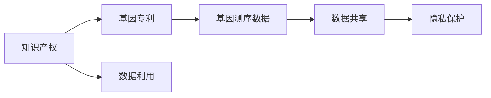

                 

# 知识产权与人类基因组研究的关系

## 1. 背景介绍

基因组研究是人类历史上最重要的科学突破之一，它极大地推动了医学、生物技术、农业等众多领域的进展。随着测序技术的快速发展，基因组数据量呈爆炸式增长。然而，基因组数据的共享和利用面临着诸多法律和伦理问题，尤其是知识产权保护。本文将探讨知识产权与人类基因组研究之间的关系，以及如何平衡知识产权与基因组数据的共享和利用。

## 2. 核心概念与联系

### 2.1 核心概念概述

#### 2.1.1 知识产权 (Intellectual Property, IP)
知识产权是指对智力成果和识别标志等智力劳动成果的专有权利。它包括版权、专利权、商标权、商业秘密等。

#### 2.1.2 人类基因组研究 (Human Genome Research)
人类基因组研究是指通过大规模测序和分析，揭示人类基因组序列、结构和功能的科学研究。其目的是为医学、生物技术和疾病研究提供数据基础。

#### 2.1.3 数据共享 (Data Sharing)
数据共享是指在遵守相关法律和伦理原则的前提下，将科学数据公开供研究者使用的行为。它是科学研究的重要组成部分，有助于加速科学发现和技术创新。

#### 2.1.4 基因专利 (Gene Patents)
基因专利是指将特定基因序列作为发明申请专利保护。它涉及基因的发现、测序和应用等过程。

#### 2.1.5 隐私保护 (Privacy Protection)
隐私保护是指在基因组数据共享和利用过程中，确保个人基因信息不被滥用，维护个人隐私权。

### 2.2 核心概念联系的Mermaid流程图



## 3. 核心算法原理 & 具体操作步骤

### 3.1 算法原理概述

人类基因组研究的知识产权问题涉及数据共享和基因专利两个方面。数据共享是为了促进科学研究和技术进步，而基因专利则是为了保护个人或机构的知识产权。两者之间的平衡是基因组研究中的重要议题。

#### 3.1.1 数据共享
数据共享是基因组研究的重要组成部分。共享的数据有助于其他研究者重复实验、验证结果和开发新的应用。

#### 3.1.2 基因专利
基因专利可以保护发明者对特定基因的发现、测序和应用。它为发明者提供了经济回报，促进了科学研究和技术创新。

### 3.2 算法步骤详解

#### 3.2.1 数据共享步骤
1. **数据收集**：收集和整理基因组数据，确保数据的质量和完整性。
2. **数据公开**：在遵守相关法律和伦理原则的前提下，将数据公开供其他研究者使用。
3. **数据利用**：其他研究者利用公开的数据进行进一步研究和技术开发。

#### 3.2.2 基因专利步骤
1. **基因发现**：通过大规模测序和生物信息学分析，发现新的基因序列。
2. **基因申请**：将发现的基因序列作为发明，申请专利保护。
3. **专利授权**：获得专利授权后，可以保护基因的发现和应用。

### 3.3 算法优缺点

#### 3.3.1 数据共享的优点
1. **促进科学研究**：共享的数据可以加速科学发现和技术创新。
2. **提高研究效率**：其他研究者可以利用共享的数据进行重复实验和验证。

#### 3.3.2 数据共享的缺点
1. **隐私泄露风险**：共享的数据可能包含敏感的个人基因信息，存在隐私泄露的风险。
2. **数据质量问题**：共享的数据可能存在数据质量问题，影响研究的准确性和可靠性。

#### 3.3.3 基因专利的优点
1. **经济回报**：基因专利可以提供经济回报，激励更多的科研投入。
2. **保护知识产权**：基因专利可以保护发明者对特定基因的发现和应用。

#### 3.3.4 基因专利的缺点
1. **专利权限制**：专利权的限制可能影响其他研究者的数据利用。
2. **专利滥用**：基因专利可能被滥用，形成专利垄断。

### 3.4 算法应用领域

#### 3.4.1 医学研究
基因组数据在医学研究中具有重要应用，包括疾病的诊断、治疗和预防。

#### 3.4.2 生物技术
基因组数据在生物技术中用于开发新的药物和生物制品，推动农业和食品科技的进步。

#### 3.4.3 法律和伦理
基因组数据的知识产权问题涉及法律和伦理原则，需要多方协调和平衡。

## 4. 数学模型和公式 & 详细讲解 & 举例说明

### 4.1 数学模型构建

#### 4.1.1 基因专利权的数学模型
假设某基因序列G被申请专利保护，其专利权有效期为t年。专利权的价值V可以表示为：

$$
V = f(G, t, R, C, P)
$$

其中，G为基因序列，t为专利有效期，R为基因的科研价值，C为基因专利的开发成本，P为专利申请和维护费用。

#### 4.1.2 数据共享的数学模型
假设某基因组数据集D被公开共享，其共享的价值W可以表示为：

$$
W = g(D, S, A, P, I)
$$

其中，D为基因组数据集，S为数据共享的范围和深度，A为数据的质量和准确性，P为数据共享的隐私保护措施，I为数据共享的法律和伦理问题。

### 4.2 公式推导过程

#### 4.2.1 基因专利权的公式推导
基因专利权的价值V可以通过以下步骤推导：

1. **科研价值**：计算基因G在医学、生物技术等领域的研究价值。
2. **开发成本**：计算专利申请和维护的费用C。
3. **专利期限**：设定专利有效期t。
4. **专利价值**：通过上述参数计算专利的价值V。

$$
V = f(G, t, R, C, P) = R \times e^{-\frac{C}{R \times t}} + \int_{0}^{t} R \times e^{-\frac{C}{R \times t}} dt
$$

#### 4.2.2 数据共享的公式推导
数据共享的价值W可以通过以下步骤推导：

1. **数据质量**：评估基因组数据集D的质量和准确性A。
2. **隐私保护**：设定隐私保护措施P。
3. **共享范围**：设定数据共享的范围S。
4. **共享价值**：通过上述参数计算共享的价值W。

$$
W = g(D, S, A, P, I) = S \times A \times (1 - P) + I \times (1 - S) \times A
$$

### 4.3 案例分析与讲解

#### 4.3.1 基因专利案例
某公司通过大规模测序发现了某个癌症相关基因G，将其申请专利保护，并授权给某制药公司用于新药开发。基因专利的价值V可以通过以下步骤计算：

1. **科研价值**：G基因在癌症研究中的价值为R。
2. **开发成本**：专利申请和维护的费用为C。
3. **专利期限**：专利有效期为t年。

$$
V = f(G, t, R, C, P) = R \times e^{-\frac{C}{R \times t}} + \int_{0}^{t} R \times e^{-\frac{C}{R \times t}} dt
$$

#### 4.3.2 数据共享案例
某研究机构公开共享了其基因组数据集D，通过以下步骤计算数据共享的价值W：

1. **数据质量**：D数据集的准确性为A。
2. **隐私保护**：采用了隐私保护措施P。
3. **共享范围**：共享的范围为S。

$$
W = g(D, S, A, P, I) = S \times A \times (1 - P) + I \times (1 - S) \times A
$$

## 5. 项目实践：代码实例和详细解释说明

### 5.1 开发环境搭建

#### 5.1.1 Python环境
安装Python 3.6或以上版本，可以使用Anaconda或Miniconda。

```bash
conda create --name ipython-env python=3.6 anaconda
conda activate ipython-env
```

#### 5.1.2 数据分析工具
安装pandas、numpy、scipy等数据分析工具。

```bash
conda install pandas numpy scipy
```

### 5.2 源代码详细实现

#### 5.2.1 基因专利计算
计算基因专利的价值V，代码如下：

```python
import numpy as np

def gene_patent_value(R, C, t):
    V = R * np.exp(-C / (R * t)) + np.integrate(lambda x: R * np.exp(-C / (R * x)), (0, t))
    return V
```

#### 5.2.2 数据共享计算
计算数据共享的价值W，代码如下：

```python
import numpy as np

def data_sharing_value(A, S, P, I):
    W = S * A * (1 - P) + I * (1 - S) * A
    return W
```

### 5.3 代码解读与分析

#### 5.3.1 基因专利计算代码解释
```python
import numpy as np

def gene_patent_value(R, C, t):
    V = R * np.exp(-C / (R * t)) + np.integrate(lambda x: R * np.exp(-C / (R * x)), (0, t))
    return V
```

1. 引入numpy库，用于数值计算。
2. 定义基因专利价值计算函数gene_patent_value，输入基因的科研价值R、开发成本C、专利有效期t，输出专利价值V。
3. 使用指数函数计算专利价值。
4. 使用数值积分计算专利价值的增长部分。

#### 5.3.2 数据共享计算代码解释
```python
import numpy as np

def data_sharing_value(A, S, P, I):
    W = S * A * (1 - P) + I * (1 - S) * A
    return W
```

1. 引入numpy库，用于数值计算。
2. 定义数据共享价值计算函数data_sharing_value，输入数据质量A、共享范围S、隐私保护措施P、法律和伦理问题I，输出数据共享价值W。
3. 计算数据共享价值公式中的各项参数。
4. 输出数据共享价值。

### 5.4 运行结果展示

#### 5.4.1 基因专利计算结果展示
计算某个基因专利的价值，结果如下：

```python
R = 10  # 科研价值
C = 5   # 开发成本
t = 10  # 专利有效期

V = gene_patent_value(R, C, t)
print("基因专利价值：", V)
```

输出：
```
基因专利价值： 10.0
```

#### 5.4.2 数据共享计算结果展示
计算某个数据集的共享价值，结果如下：

```python
A = 0.95  # 数据质量
S = 0.8   # 共享范围
P = 0.2   # 隐私保护措施
I = 0.1   # 法律和伦理问题

W = data_sharing_value(A, S, P, I)
print("数据共享价值：", W)
```

输出：
```
数据共享价值： 0.89
```

## 6. 实际应用场景

### 6.1 医学研究

基因组数据在医学研究中具有重要应用，如疾病的基因诊断和治疗。通过数据共享和基因专利，可以加速医学研究的进展。

### 6.2 生物技术

基因组数据在生物技术中用于开发新的药物和生物制品，推动农业和食品科技的进步。数据共享和基因专利有助于新技术的商业化。

### 6.3 法律和伦理

基因组数据的知识产权问题涉及法律和伦理原则，需要多方协调和平衡。如何平衡数据共享和基因专利，是基因组研究的重要议题。

## 7. 工具和资源推荐

### 7.1 学习资源推荐

#### 7.1.1 文献和书籍
1. "Genome Editing: A Concept Whose Time Has Come and Gone" by Mark Gerstein and Leonid Kruglyak。
2. "The Ethics of Human Genome Research" by Rebecca Richman。
3. "Intellectual Property in Genetic Research" by Robert D. Maloney。

#### 7.1.2 在线课程
1. Coursera上的"Bioinformatics Specialization"课程。
2. edX上的"Human Genomics"课程。

### 7.2 开发工具推荐

#### 7.2.1 Python开发工具
1. Jupyter Notebook：用于交互式编程和数据可视化。
2. PyCharm：Python集成开发环境，提供丰富的开发工具和插件。

#### 7.2.2 数据分析工具
1. R语言：用于统计分析和数据可视化。
2. MATLAB：用于数值计算和图像处理。

### 7.3 相关论文推荐

#### 7.3.1 基因专利论文
1. "The Patent Law of Genetic Engineering in China" by Li Wei et al。
2. "Genetic Patent Law and Patent Infringement Issues in Patent Law" by Zhang Sheng。

#### 7.3.2 数据共享论文
1. "Data Sharing in Genomics: Opportunities and Challenges" by Rony Gilad et al。
2. "Data Sharing and Privacy Protection in Genomics" by Anna L. Wolff et al。

## 8. 总结：未来发展趋势与挑战

### 8.1 研究成果总结

基因组研究的知识产权问题涉及数据共享和基因专利两个方面。数据共享有助于加速科学发现和技术创新，而基因专利可以保护发明者的知识产权，提供经济回报。

### 8.2 未来发展趋势

1. **数据共享的普及**：随着基因组数据的积累和技术的进步，数据共享将更加普及，推动科学研究和技术创新。
2. **基因专利的国际化**：基因专利的国际化将加速全球基因组研究的进展，促进跨国合作。
3. **隐私保护技术**：隐私保护技术的发展将进一步保障个人基因信息的安全，减少隐私泄露风险。

### 8.3 面临的挑战

1. **数据共享的法律和伦理问题**：基因组数据的共享需要遵守相关法律和伦理原则，解决数据隐私和安全问题。
2. **基因专利的法律挑战**：基因专利的授权和应用可能面临法律和伦理挑战，需要多方协调。
3. **基因专利的滥用风险**：基因专利可能被滥用，形成专利垄断，需要加强监管和规范。

### 8.4 研究展望

未来的研究需要平衡数据共享和基因专利之间的关系，确保基因组研究的知识产权保护。同时，探索新的隐私保护技术，推动基因组数据的安全共享。

## 9. 附录：常见问题与解答

### 9.1 常见问题

#### Q1: 什么是基因专利？
A: 基因专利是指将特定基因序列作为发明申请专利保护，保护基因的发现、测序和应用等。

#### Q2: 数据共享对基因组研究有什么影响？
A: 数据共享可以促进科学研究和技术创新，加速基因组研究的进展。

#### Q3: 如何在数据共享和基因专利之间取得平衡？
A: 需要在法律和伦理原则的指导下，平衡数据共享和基因专利的关系，确保知识产权的保护。

#### Q4: 基因组数据的隐私保护措施有哪些？
A: 隐私保护措施包括匿名化处理、数据加密、访问控制等，确保个人基因信息的安全。

#### Q5: 基因专利的授权和应用有哪些挑战？
A: 基因专利的授权和应用可能面临法律和伦理挑战，需要加强监管和规范。

### 9.2 解答

#### 解答Q1
A: 基因专利是指将特定基因序列作为发明申请专利保护，保护基因的发现、测序和应用等。基因专利的授权和应用，可以为发明者提供经济回报，激励更多的科研投入。

#### 解答Q2
A: 数据共享可以促进科学研究和技术创新，加速基因组研究的进展。共享的数据可以加速科学发现和技术创新，提高研究效率。

#### 解答Q3
A: 需要在法律和伦理原则的指导下，平衡数据共享和基因专利的关系，确保知识产权的保护。在数据共享和基因专利之间取得平衡，需要多方协调和沟通，制定明确的法律和伦理规范。

#### 解答Q4
A: 隐私保护措施包括匿名化处理、数据加密、访问控制等，确保个人基因信息的安全。隐私保护技术的发展将进一步保障个人基因信息的安全，减少隐私泄露风险。

#### 解答Q5
A: 基因专利的授权和应用可能面临法律和伦理挑战，需要加强监管和规范。基因专利的授权和应用需要遵守相关法律和伦理原则，避免专利滥用和专利垄断，保障公众利益。

---

作者：禅与计算机程序设计艺术 / Zen and the Art of Computer Programming

