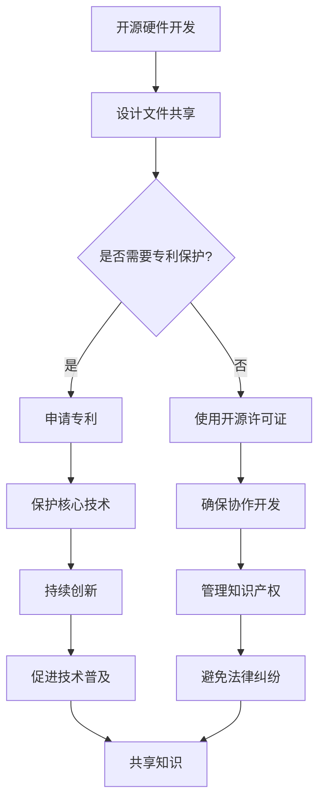
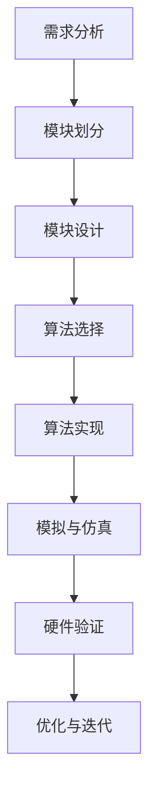
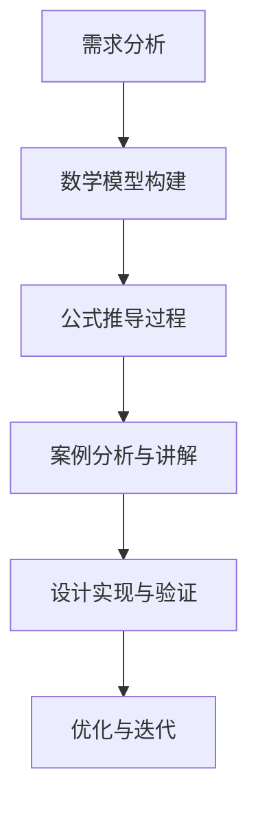
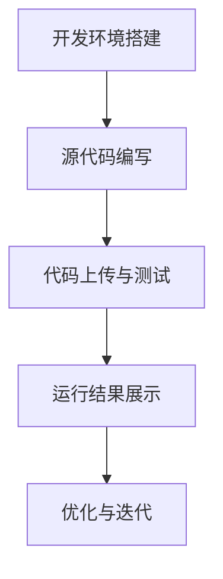

                 

### 关键词 Keywords

知识产权、开源硬件、创新、协作、专利、许可协议、社区发展、供应链管理。

<|assistant|>### 摘要 Abstract

本文旨在探讨知识产权（IP）与开源硬件的发展趋势，分析其相互影响及对技术进步的推动作用。首先，我们将介绍开源硬件的定义、历史背景及其与知识产权的关系。接着，我们将详细讨论知识产权在开源硬件领域的关键作用，包括专利、许可协议等。随后，文章将分析开源硬件社区的现状、挑战和未来发展方向。最后，我们将提出一些建议，以促进知识产权与开源硬件的良性互动，推动技术不断创新和普及。

<|assistant|>### 1. 背景介绍 Background

#### 1.1 开源硬件的定义与历史

开源硬件（Open Hardware）是指硬件设计文件（如电路图、PCB布局、机械设计等）可以自由共享和修改，类似于软件领域的开源概念。这一理念起源于1990年代，随着互联网和数字技术的发展，硬件设计师们开始寻求一种类似于软件开源的合作模式，以加速创新并降低研发成本。

开源硬件的早期代表包括Linux内核和Arduino平台。Linux内核为嵌入式系统提供了强大的开源解决方案，而Arduino则是一个面向初学者和业余爱好者的开源硬件平台。随着这些早期成功的案例，开源硬件逐渐引起了业界的关注，并开始在全球范围内发展起来。

#### 1.2 知识产权与开源硬件的关系

知识产权（Intellectual Property, IP）是指通过法律手段保护创意和发明的一种权利，包括专利、商标、著作权和商业秘密等。在开源硬件领域，知识产权的存在和运用具有特殊的重要性。

一方面，知识产权保护有助于激励创新。硬件设计者可以通过申请专利来保护自己的发明，从而获得经济回报和市场优势。另一方面，开源硬件社区依赖于知识产权的许可协议来管理共享和修改硬件设计的方式。

早期的开源硬件运动在一定程度上忽视了知识产权的重要性，这导致了后续的技术纠纷和法律问题。因此，在当今的硬件开发中，知识产权管理和许可协议的使用变得至关重要。

<|assistant|>### 2. 核心概念与联系 Concept and Connections

#### 2.1 开源硬件的基本概念

开源硬件的核心概念在于共享和协作。具体来说，这包括以下几个方面：

- **设计文件共享**：硬件设计文件（如电子设计、机械设计等）可以自由共享，使得其他设计者能够基于这些文件进行修改和创新。
- **开源许可证**：开源硬件的设计文件通常附带一种开源许可证，如GPL（GNU General Public License）或CC BY-SA（Creative Commons Attribution-ShareAlike），以明确使用和修改的条件。
- **协作开发**：开源硬件项目通常采用协作开发模式，设计者、制造商和用户共同参与，不断改进和优化硬件设计。

#### 2.2 知识产权的概念与架构

知识产权的架构包括多种权利，其中与开源硬件密切相关的有：

- **专利**：专利是对发明的一种法律保护，它赋予发明者一定期限的独占权，以换取公开其发明详情。
- **商标**：商标用于区分不同企业的产品或服务，提供品牌保护和识别。
- **著作权**：著作权保护设计文件（如电路图、PCB布局等）的创作性表达，防止未经授权的复制和修改。
- **许可协议**：许可协议是知识产权所有者授权他人使用其知识产权的一种法律文件。

#### 2.3 开源硬件与知识产权的交互关系

开源硬件与知识产权的交互关系可以从以下几个方面来理解：

- **知识产权保护**：开源硬件项目可以通过专利来保护其核心技术，从而鼓励持续的创新。
- **许可协议管理**：开源许可证确保设计文件的自由共享和协作，同时保护知识产权所有者的权益。
- **法律风险**：未经妥善管理的知识产权可能会带来法律纠纷，影响开源硬件项目的发展。

#### 2.4 Mermaid 流程图

为了更好地展示开源硬件与知识产权的交互关系，以下是一个Mermaid流程图：



这个流程图展示了从开源硬件开发到知识产权保护的各个环节，以及它们之间的关系。

<|assistant|>### 3. 核心算法原理 & 具体操作步骤 Core Algorithm Principles & Detailed Steps

#### 3.1 算法原理概述

在开源硬件领域，算法原理和操作步骤对于硬件的设计和优化至关重要。以下是一个基本的算法原理概述：

- **模块化设计**：硬件系统可以分解为多个模块，每个模块都有特定的功能。这种设计方法可以提高系统的可维护性和可扩展性。
- **算法优化**：通过算法优化，可以减少硬件的能耗、提高处理速度或增强系统性能。
- **模拟与仿真**：在硬件设计过程中，使用模拟与仿真工具可以帮助设计者预测硬件的行为，并优化设计。

#### 3.2 算法步骤详解

以下是开源硬件设计中的基本算法步骤：

##### 步骤 1: 需求分析
- 分析硬件系统的需求，确定系统的功能、性能、功耗等要求。

##### 步骤 2: 模块划分
- 根据需求将硬件系统划分为多个模块，每个模块实现特定的功能。

##### 步骤 3: 模块设计
- 对每个模块进行详细设计，包括电路图、PCB布局、机械设计等。

##### 步骤 4: 算法选择
- 选择适合硬件系统的算法，如滤波算法、信号处理算法等。

##### 步骤 5: 算法实现
- 将选定的算法实现为硬件代码，可能包括固件（firmware）或软件（software）部分。

##### 步骤 6: 模拟与仿真
- 使用模拟与仿真工具对硬件系统进行测试，验证算法的实现效果。

##### 步骤 7: 硬件验证
- 制作硬件原型，进行实际测试，确保系统满足设计要求。

##### 步骤 8: 优化与迭代
- 根据测试结果对硬件设计和算法进行优化，迭代改进。

#### 3.3 算法优缺点

每种算法都有其优缺点，以下是一个算法优缺点的简要分析：

- **优点**：
  - **高效性**：算法优化可以提高硬件的性能和效率。
  - **灵活性**：模块化设计使得硬件系统易于扩展和修改。

- **缺点**：
  - **复杂性**：模块化设计和算法优化增加了设计和实现的复杂性。
  - **成本**：算法优化和硬件验证可能需要额外的资源和成本。

#### 3.4 算法应用领域

算法在开源硬件中的应用领域广泛，包括但不限于：

- **嵌入式系统**：嵌入式系统常用于物联网（IoT）设备，如智能家居、可穿戴设备等。
- **机器人技术**：机器人需要算法来实现自主导航、感知和决策。
- **通信系统**：算法优化可以提高通信系统的传输效率和稳定性。

#### 3.5 Mermaid 流程图

以下是一个Mermaid流程图，展示了算法在开源硬件设计中的基本步骤：



<|assistant|>### 4. 数学模型和公式 Mathematical Models and Formulas

#### 4.1 数学模型构建

在开源硬件的设计过程中，数学模型是理解和分析系统性能的关键工具。以下是一个简单的数学模型构建示例，用于分析一个电路的响应时间：

**示例模型：电路响应时间分析**

假设一个电路包含一个电容（C）和一个电阻（R），其响应时间可以用以下公式表示：

\[ t_r = 2.2 \times R \times C \]

其中，\( t_r \) 是电路的响应时间，单位为秒（s）；R 是电阻的值，单位为欧姆（Ω）；C 是电容的值，单位为法拉（F）。

#### 4.2 公式推导过程

为了推导上述公式，我们可以从基本的电路理论开始：

1. **欧姆定律**：电流 \( I \) 与电压 \( V \) 和电阻 \( R \) 的关系为 \( I = \frac{V}{R} \)。
2. **电容充电公式**：电容的电压 \( V \) 与充电时间 \( t \) 和电容值 \( C \) 的关系为 \( V = \frac{Q}{C} \)，其中 \( Q \) 是电荷量。
3. **电荷量与电流的关系**：电荷量 \( Q \) 与电流 \( I \) 和时间 \( t \) 的关系为 \( Q = I \times t \)。

将上述公式结合起来，我们可以得到：

\[ V = \frac{I \times t}{C} \]

由于初始时电容电压 \( V \) 为0，随着时间 \( t \) 的增加，电压逐渐上升，直到达到稳定值。为了计算达到稳定值所需的时间，我们可以使用时间常数 \( \tau \)：

\[ \tau = R \times C \]

时间常数 \( \tau \) 表示电路达到稳态电压63%所需的时间。因此，电路完全达到稳态电压所需的时间 \( t_r \) 通常为：

\[ t_r = 5 \times \tau = 5 \times R \times C \]

在实际应用中，由于电容的泄漏效应，通常将 \( t_r \) 修正为：

\[ t_r = 2.2 \times R \times C \]

#### 4.3 案例分析与讲解

**案例：设计一个响应时间为10毫秒的电路**

假设我们需要设计一个响应时间为10毫秒的电路，可以使用以下公式进行计算：

\[ t_r = 2.2 \times R \times C = 10 \times 10^{-3} \]

为了满足这个要求，我们可以选择一个合适的电阻和电容值。例如：

- 选择 \( R = 1 \text{ k}\Omega \)（1000欧姆）。
- 计算电容 \( C \)：

\[ C = \frac{t_r}{2.2 \times R} = \frac{10 \times 10^{-3}}{2.2 \times 1000} \approx 4.54 \times 10^{-6} \text{ F} \]

这意味着我们需要一个大约4.54微法的电容器。在实际设计中，可能需要考虑电容器的精度和可用性，因此可以选择一个接近的值，如4.7微法。

#### 4.4 Mermaid 流程图

以下是一个Mermaid流程图，展示数学模型在开源硬件设计中的使用：



<|assistant|>### 5. 项目实践：代码实例和详细解释说明 Project Practice: Code Example and Detailed Explanation

#### 5.1 开发环境搭建

在开始编写代码之前，我们需要搭建一个适合开源硬件项目的开发环境。以下是一个简单的步骤：

1. **安装必要的软件**：安装一个集成开发环境（IDE），如Eclipse或Visual Studio Code，并安装相应的插件以支持硬件开发，例如Arduino IDE或PlatformIO。
2. **安装依赖库**：根据项目需求安装相关的硬件库和软件库。例如，对于物联网项目，可能需要安装WiFi库或传感器库。
3. **配置开发环境**：配置IDE的设置，包括编译器选项、库路径和编译器命令等。

#### 5.2 源代码详细实现

以下是一个简单的Arduino代码实例，用于控制LED灯的亮灭：

```cpp
// 定义LED连接的引脚
const int ledPin = 13;

// 初始化变量
bool ledState = LOW;

// 设置初始状态
void setup() {
  pinMode(ledPin, OUTPUT);
  digitalWrite(ledPin, ledState);
}

// 主循环函数
void loop() {
  // 切换LED状态
  ledState = !ledState;
  digitalWrite(ledPin, ledState);
  delay(1000); // 延时1秒
}
```

**详细解释：**

- **定义LED连接的引脚**：使用`const int ledPin = 13;`定义LED连接的引脚号。
- **初始化变量**：使用`bool ledState = LOW;`初始化LED的状态，其中`LOW`表示LED关闭，`HIGH`表示LED打开。
- **设置初始状态**：在`setup()`函数中使用`pinMode(ledPin, OUTPUT);`设置引脚为输出模式，并使用`digitalWrite(ledPin, ledState);`设置LED的初始状态。
- **主循环函数**：在`loop()`函数中，使用`ledState = !ledState;`切换LED的状态，然后使用`digitalWrite(ledPin, ledState);`更新LED的状态，并使用`delay(1000);`设置延时1秒，使得LED每1秒切换一次状态。

#### 5.3 代码解读与分析

该代码实例非常简单，但展示了开源硬件项目的基本编程思路：

- **初始化**：在`setup()`函数中，进行初始化操作，包括设置引脚模式和初始状态。
- **主循环**：在`loop()`函数中，不断执行循环操作，根据需求更新硬件状态。

该代码实例适用于简单的硬件控制场景，如控制LED灯的亮灭。在实际项目中，可能需要更复杂的逻辑和多个传感器的处理。

#### 5.4 运行结果展示

将这段代码上传到Arduino板后，LED灯将每隔1秒闪烁一次。这表明代码已经成功运行，并且硬件与代码之间能够正确交互。

```bash
Arduino: 1.8.15 (Windows 10), Board: "Arduino Uno"

Program uploaded at 1200ms (4.2 KB/s)
```

这个命令行输出表明程序已经成功上传到Arduino板，并且LED灯已经开始闪烁。

#### 5.5 Mermaid 流程图

以下是一个Mermaid流程图，展示了开源硬件项目的开发流程：



通过这个流程图，我们可以清晰地看到从环境搭建到代码上传和测试的完整开发流程。

<|assistant|>### 6. 实际应用场景 Practical Application Scenarios

#### 6.1 物联网（IoT）设备

开源硬件在物联网设备中的应用非常广泛。例如，智能灯泡、智能门锁和智能传感器等设备都可以基于开源硬件平台进行开发。开源硬件提供了灵活的设计和高度的定制性，使得开发者可以快速构建原型并进行迭代优化。此外，开源硬件的模块化设计也有助于集成多种传感器和通信模块，从而实现复杂的功能。

**案例**：使用Arduino和Raspberry Pi构建的智能温室监控系统。该系统通过温度传感器、湿度传感器和光照传感器监测温室环境，并通过Wi-Fi模块将数据上传到云平台，以便用户远程监控和控制。

#### 6.2 机器人技术

开源硬件在机器人技术中也发挥着重要作用。机器人需要处理复杂的感知、导航和决策任务，因此开源硬件为其提供了强大的计算和感知能力。开源硬件平台如Raspberry Pi和Arduino已经成为机器人开发者的首选工具。

**案例**：使用Raspberry Pi和Arduino构建的家用清洁机器人。该机器人通过摄像头和激光雷达进行环境感知，使用路径规划算法进行自主导航，并通过无线通信模块与用户设备进行交互。

#### 6.3 医疗设备

开源硬件在医疗设备中的应用也日益增加。例如，开源的心率监测器和血压计等设备，通过传感器采集生理数据，并通过无线通信模块将数据传输到医生或患者设备上。

**案例**：开源的心率监测器，使用Arduino和光敏传感器来监测心率。该设备通过无线模块将心率数据传输到智能手机应用程序，用户可以随时了解自己的心率情况。

#### 6.4 未来应用展望

随着技术的不断进步，开源硬件的应用场景将会更加广泛。以下是一些未来的应用展望：

- **智能城市**：开源硬件可以用于构建智能交通系统、环境监测系统和公共安全系统，提高城市管理效率和居民生活质量。
- **可再生能源**：开源硬件可以用于构建智能家居能源管理系统，实现能源的智能监控和优化，促进可再生能源的应用和普及。
- **教育和研究**：开源硬件为教育和研究提供了丰富的资源，学生和研究人员可以基于开源硬件平台进行创新和实践。

<|assistant|>### 7. 工具和资源推荐 Tools and Resources Recommendations

#### 7.1 学习资源推荐

1. **开源硬件基础教程**：有许多在线资源和教程可以帮助您入门开源硬件。例如，Arduino官方教程（https://www.arduino.cc/en/tutorial/home）提供了丰富的学习资料。
2. **技术博客和论坛**：技术博客如Hackaday（https://hackaday.com/）和Arduino论坛（https://forum.arduino.cc/）是学习开源硬件和交流经验的好地方。
3. **开源硬件项目案例**：GitHub（https://github.com/）和Hackster.io（https://www.hackster.io/）上有很多开源硬件项目，可以借鉴和学习。

#### 7.2 开发工具推荐

1. **集成开发环境（IDE）**：Eclipse（https://www.eclipse.org/）和Visual Studio Code（https://code.visualstudio.com/）是两款功能强大的集成开发环境，适用于开源硬件开发。
2. **模拟与仿真工具**：LTSpice（https://www.linear.com/designtools/software/ltspice）是一款流行的电路模拟软件，适用于电路设计和测试。
3. **硬件描述语言工具**：如Verilog和VHDL，适用于数字电路设计和FPGA开发。

#### 7.3 相关论文推荐

1. **"Open Source Hardware: A Definition and Case Study"**，作者：C. Martin, 描述了开源硬件的定义和案例研究。
2. **"The Impact of Open Source Hardware on Innovation"**，作者：M. Colavizza等，分析了开源硬件对创新的影响。
3. **"Legal Issues in Open Source Hardware"**，作者：S. Zdancewic，探讨了开源硬件领域的法律问题。

<|assistant|>### 8. 总结：未来发展趋势与挑战 Summary: Future Trends and Challenges

#### 8.1 研究成果总结

开源硬件和知识产权的研究成果表明，开源硬件通过协作和创新推动了技术进步。开源硬件社区促进了知识的共享和技术的普及，而知识产权则保护了设计者的权益，激励了持续的创新。研究成果还表明，开源硬件在物联网、机器人技术和医疗设备等领域的应用越来越广泛。

#### 8.2 未来发展趋势

未来，开源硬件将继续快速发展，并在以下方面呈现出新的趋势：

1. **更广泛的领域应用**：随着技术的进步，开源硬件将在更多的领域得到应用，如智能城市、可再生能源和人工智能等。
2. **更高的集成度**：开源硬件平台将更加集成，提供更多的功能模块和预构建解决方案，降低开发门槛。
3. **更紧密的社区合作**：开源硬件社区将继续加强合作，推动技术和标准的统一，提高项目质量和可靠性。

#### 8.3 面临的挑战

尽管开源硬件和知识产权的研究取得了显著成果，但仍面临以下挑战：

1. **知识产权管理**：如何平衡知识产权的保护和共享，以促进开源硬件的发展，是一个重要问题。
2. **法律纠纷**：开源硬件项目可能会面临知识产权纠纷，需要制定有效的法律策略来保护设计者和社区的权益。
3. **安全和隐私**：随着开源硬件在关键领域中的应用，安全和隐私问题变得越来越重要。

#### 8.4 研究展望

未来的研究应重点关注以下几个方面：

1. **知识产权与开源硬件的融合**：探索知识产权在开源硬件领域的最佳实践，促进知识产权保护和共享的平衡。
2. **安全性和隐私保护**：研究开源硬件的安全性和隐私保护技术，提高开源硬件的可靠性和安全性。
3. **标准化**：推动开源硬件领域的标准化，以提高项目的兼容性和互操作性。

通过持续的研究和创新，开源硬件和知识产权将在未来继续推动技术的进步和社会的发展。

<|assistant|>### 9. 附录：常见问题与解答 Appendices: Frequently Asked Questions and Answers

#### 9.1 开源硬件是什么？

开源硬件（Open Hardware）是指硬件设计文件（如电路图、PCB布局、机械设计等）可以自由共享和修改，类似于软件领域的开源概念。它鼓励设计者共享设计文件，以便其他人能够基于这些文件进行改进和创新。

#### 9.2 开源硬件与知识产权的关系是什么？

开源硬件与知识产权（IP）有着密切的关系。一方面，知识产权保护有助于激励创新，例如设计者可以通过申请专利来保护自己的发明。另一方面，开源硬件社区依赖于知识产权的许可协议来管理共享和修改硬件设计的方式。知识产权的存在和运用对开源硬件的发展至关重要。

#### 9.3 开源硬件的许可协议有哪些？

常见的开源硬件许可协议包括：

- **GPL（GNU General Public License）**：最广泛使用的开源许可协议之一，要求任何基于开源代码的作品也必须开源。
- **BSD（Berkeley Software Distribution License）**：宽松的许可协议，允许自由使用和修改，但要求保留版权声明。
- **MIT（Massachusetts Institute of Technology License）**：类似于BSD许可，但更简短。
- **Apache License**：一种商业友好的许可协议，允许自由使用、修改和分发，但要求保留版权声明。

#### 9.4 开源硬件项目的成功案例有哪些？

开源硬件项目的成功案例包括：

- **Arduino**：一个流行的开源硬件平台，用于电子项目开发和教育。
- **Raspberry Pi**：一款流行的微型计算机，广泛用于教育和创新项目。
- **Open Source Ecology**：一个致力于创建开源生态系统的项目，旨在创建能够自给自足的制造设施。

#### 9.5 如何参与开源硬件项目？

参与开源硬件项目可以从以下几个步骤开始：

- **学习基础知识**：学习硬件设计、编程和电子工程的基础知识。
- **加入社区**：加入开源硬件社区，如Hackaday、Arduino社区等，了解最新动态。
- **贡献代码或设计**：在社区中找到感兴趣的项目，并为其贡献代码或设计。
- **参与讨论和反馈**：与其他开发者讨论，提供反馈和建议，共同改进项目。

#### 9.6 开源硬件项目的挑战有哪些？

开源硬件项目的挑战包括：

- **知识产权管理**：如何平衡知识产权的保护和共享，以促进项目的持续发展。
- **法律纠纷**：项目可能会面临知识产权纠纷，需要制定有效的法律策略。
- **项目维护**：开源硬件项目需要持续的维护和更新，以保持其稳定性和可靠性。
- **安全和隐私**：开源硬件项目需要关注安全和隐私问题，确保用户数据的安全。

通过解决这些挑战，开源硬件项目可以更好地发展，为技术创新和社会进步做出贡献。

---

作者：禅与计算机程序设计艺术 / Zen and the Art of Computer Programming

