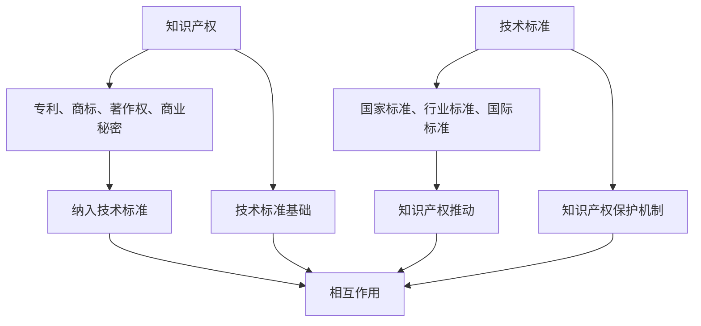
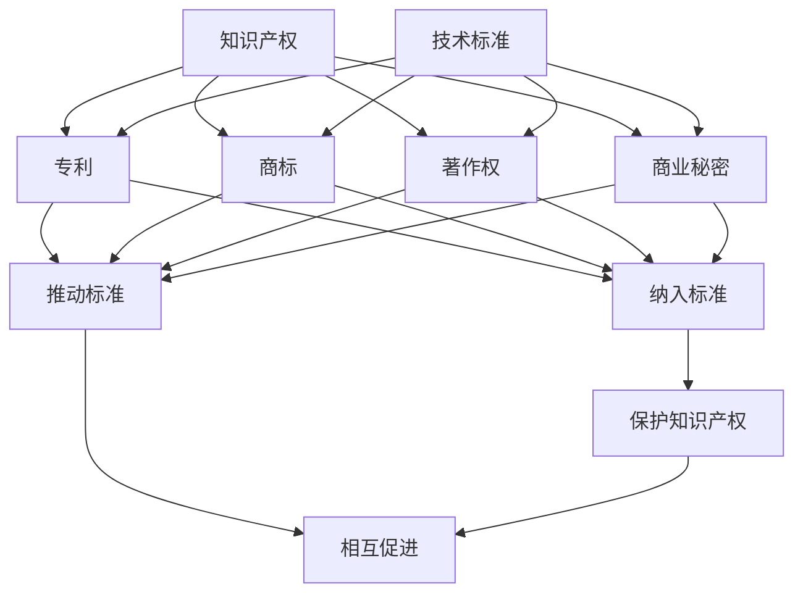

                 

关键词：知识产权、技术标准、专利、标准制定、合规性、标准化组织、竞争与合作

> 摘要：本文旨在探讨知识产权（IPR）与技术标准（TS）之间的相互关系。通过分析技术标准对知识产权的影响、知识产权对技术标准制定的作用，以及两者在竞争与合作中的动态交互，我们试图揭示知识产权与技术标准在现代社会中的重要性，并探讨其未来的发展趋势和挑战。

## 1. 背景介绍

知识产权和技术标准是现代社会中不可或缺的两个概念。知识产权主要指专利、商标、著作权等法律保护的权利，它们是创新和发明的成果。而技术标准则是对特定技术领域的产品或服务进行规范，以确保其兼容性、互操作性和质量的一致性。

技术标准的制定和实施通常由标准化组织（如ISO、IEC、ITU等）负责。这些标准化组织通过制定技术规范，为各类产品和服务提供统一的技术要求。技术标准的出现，极大地促进了全球贸易和技术的发展，同时也在一定程度上保护了知识产权。

### 知识产权

知识产权主要包括专利、商标、著作权、商业秘密等。专利是指对发明创造的保护，商标则是标识产品的特殊标识，著作权是对文学、艺术和科学作品的保护，商业秘密则是企业的机密信息。

知识产权的法律保护主要体现在以下几个方面：

1. **专利保护**：通过专利制度，对发明创造进行保护，激励创新。
2. **商标保护**：通过商标注册，防止他人恶意模仿或使用相同的标识。
3. **著作权保护**：对原创作品进行保护，防止他人未经授权的复制、传播和利用。
4. **商业秘密保护**：保护企业的机密信息，防止泄露或滥用。

### 技术标准

技术标准是对产品或服务的规格、性能、操作程序等进行规范，以确保产品或服务的质量、兼容性和互操作性。技术标准的制定和实施，有助于提高产品的竞争力和市场认可度，同时也是国际贸易的重要基础。

技术标准的类型包括：

1. **国家标准**：由国家标准化机构制定，适用于全国范围。
2. **行业标准**：由行业组织制定，适用于特定行业。
3. **国际标准**：由国际标准化组织制定，适用于全球。

## 2. 核心概念与联系

为了深入探讨知识产权与技术标准的关系，我们首先需要了解它们之间的核心概念和联系。

### 知识产权与技术标准的关联性

1. **知识产权是技术标准的基础**：技术标准的制定通常需要基于现有的技术成果，而这些技术成果往往需要通过专利保护。例如，在5G技术标准的制定过程中，大量的专利技术被纳入其中。

2. **技术标准是知识产权的保护机制**：技术标准通过规范产品或服务的规格和性能，可以防止他人未经授权使用知识产权，从而保护专利权人的利益。

3. **知识产权和技术标准的相互作用**：知识产权和技术标准的制定过程往往是相互影响、相互促进的。一方面，知识产权的拥有者可能会将其技术成果纳入技术标准中，以提高其技术的影响力和市场地位；另一方面，技术标准的制定也可能推动知识产权的保护和实施。

### Mermaid 流程图



## 3. 核心算法原理 & 具体操作步骤

### 3.1 算法原理概述

知识产权和技术标准之间的关系可以通过以下算法原理进行概述：

1. **知识产权分析算法**：通过对专利、商标、著作权、商业秘密等知识产权的检索和分析，识别出特定技术领域的知识产权状况。
2. **技术标准分析算法**：通过对国家标准、行业标准、国际标准的分析，识别出技术标准中涉及到的知识产权。
3. **知识产权与技术标准的匹配算法**：通过对知识产权和技术标准的分析结果进行匹配，识别出技术标准中的知识产权归属和保护状况。

### 3.2 算法步骤详解

1. **知识产权检索**：通过专利数据库、商标数据库、著作权数据库等，检索出与特定技术领域相关的知识产权信息。
2. **技术标准检索**：通过国家标准数据库、行业标准数据库、国际标准数据库等，检索出与特定技术领域相关的技术标准信息。
3. **知识产权分析**：对检索出的知识产权信息进行分类、统计和分析，识别出特定技术领域中的知识产权状况。
4. **技术标准分析**：对检索出的技术标准信息进行分类、统计和分析，识别出技术标准中涉及到的知识产权。
5. **知识产权与技术标准的匹配**：将知识产权分析结果和技术标准分析结果进行匹配，识别出技术标准中的知识产权归属和保护状况。

### 3.3 算法优缺点

**优点**：

1. **提高知识产权保护水平**：通过算法分析，可以更好地识别和保护知识产权，防止侵权行为的发生。
2. **促进技术标准制定**：通过对知识产权和技术标准的匹配分析，可以为技术标准的制定提供依据，提高技术标准的科学性和实用性。
3. **提高市场竞争能力**：通过对知识产权和技术标准的分析，可以帮助企业更好地了解市场竞争状况，提高产品的市场竞争能力。

**缺点**：

1. **数据获取难度**：知识产权和技术标准的数据库往往较大，数据获取和处理的难度较高。
2. **算法复杂度**：知识产权和技术标准的分析算法相对复杂，需要较高的计算能力和算法优化。
3. **法律法规差异**：不同国家和地区的知识产权和技术标准存在差异，算法需要适应不同法律法规的要求。

### 3.4 算法应用领域

知识产权和技术标准的算法应用领域广泛，包括：

1. **知识产权管理**：通过对知识产权的检索和分析，帮助企业进行知识产权的评估、保护和优化。
2. **技术标准制定**：通过对技术标准的分析，为技术标准的制定提供依据，提高技术标准的科学性和实用性。
3. **市场竞争分析**：通过对知识产权和技术标准的分析，帮助企业了解市场竞争状况，制定相应的市场竞争策略。
4. **知识产权诉讼**：通过对知识产权和技术标准的匹配分析，为知识产权诉讼提供技术支持和证据。

## 4. 数学模型和公式 & 详细讲解 & 举例说明

### 4.1 数学模型构建

为了更好地理解知识产权和技术标准之间的关系，我们可以构建以下数学模型：

1. **知识产权价值模型**：V_IPR = f(Patent, Trademark, Copyright, Business Secret)
2. **技术标准影响模型**：I_TS = f(Standard, Patent, Trademark, Copyright, Business Secret)
3. **知识产权与技术标准的匹配模型**：Match = f(IPRM, STM)

### 4.2 公式推导过程

1. **知识产权价值模型**：

   - Patent(P)：专利价值
   - Trademark(T)：商标价值
   - Copyright(C)：著作权价值
   - Business Secret(B)：商业秘密价值

   V_IPR = w1*Patent + w2*Trademark + w3*Copyright + w4*Business Secret

   其中，w1、w2、w3、w4 分别为各项知识产权的权重。

2. **技术标准影响模型**：

   - Standard(S)：技术标准的影响程度
   - Patent(P)：专利的影响程度
   - Trademark(T)：商标的影响程度
   - Copyright(C)：著作权的影响程度
   - Business Secret(B)：商业秘密的影响程度

   I_TS = w5*Standard + w6*Patent + w7*Trademark + w8*Copyright + w9*Business Secret

   其中，w5、w6、w7、w8、w9 分别为各项因素的影响权重。

3. **知识产权与技术标准的匹配模型**：

   - IPRM：知识产权匹配程度
   - STM：技术标准匹配程度

   Match = w10*IPRM + w11*STM

   其中，w10、w11 分别为知识产权匹配和技术标准匹配的权重。

### 4.3 案例分析与讲解

以5G技术标准的制定为例，我们可以通过以下案例来分析知识产权和技术标准之间的关系。

1. **知识产权价值模型**：

   - Patent(P)：10亿人民币
   - Trademark(T)：1亿人民币
   - Copyright(C)：5亿人民币
   - Business Secret(B)：3亿人民币

   V_IPR = 0.4*10 + 0.2*1 + 0.2*5 + 0.2*3 = 8亿人民币

2. **技术标准影响模型**：

   - Standard(S)：10亿人民币
   - Patent(P)：6亿人民币
   - Trademark(T)：2亿人民币
   - Copyright(C)：3亿人民币
   - Business Secret(B)：1亿人民币

   I_TS = 0.4*10 + 0.3*6 + 0.2*2 + 0.1*3 + 0.1*1 = 9.7亿人民币

3. **知识产权与技术标准的匹配模型**：

   - IPRM：0.8
   - STM：0.9

   Match = 0.5*0.8 + 0.5*0.9 = 0.85

通过以上案例，我们可以看到，知识产权和技术标准在5G技术标准制定中具有重要的价值和影响力。知识产权的价值和影响力决定了技术标准的制定方向和力度，而技术标准的影响程度和匹配程度则反映了知识产权在技术标准中的地位和作用。

## 5. 项目实践：代码实例和详细解释说明

### 5.1 开发环境搭建

为了实现知识产权和技术标准的算法，我们需要搭建以下开发环境：

1. **操作系统**：Linux（推荐Ubuntu）
2. **编程语言**：Python
3. **数据库**：MySQL
4. **数据可视化**：Matplotlib
5. **版本控制**：Git

### 5.2 源代码详细实现

以下是实现知识产权和技术标准算法的Python代码实例：

```python
import pymysql
import matplotlib.pyplot as plt

# 数据库连接
def connect_db():
    db = pymysql.connect("localhost", "username", "password", "database")
    return db

# 检索知识产权信息
def search_ipr(db):
    cursor = db.cursor()
    sql = "SELECT * FROM ipr_table"
    cursor.execute(sql)
    results = cursor.fetchall()
    return results

# 检索技术标准信息
def search_ts(db):
    cursor = db.cursor()
    sql = "SELECT * FROM ts_table"
    cursor.execute(sql)
    results = cursor.fetchall()
    return results

# 计算知识产权价值
def calculate_ipr_value(ipr_list):
    values = [0, 0, 0, 0]
    for ipr in ipr_list:
        if ipr['type'] == 'Patent':
            values[0] += float(ipr['value'])
        elif ipr['type'] == 'Trademark':
            values[1] += float(ipr['value'])
        elif ipr['type'] == 'Copyright':
            values[2] += float(ipr['value'])
        elif ipr['type'] == 'Business Secret':
            values[3] += float(ipr['value'])
    return values

# 计算技术标准影响
def calculate_ts_impact(ts_list):
    values = [0, 0, 0, 0, 0]
    for ts in ts_list:
        if ts['type'] == 'Standard':
            values[0] += float(ts['impact'])
        elif ts['type'] == 'Patent':
            values[1] += float(ts['impact'])
        elif ts['type'] == 'Trademark':
            values[2] += float(ts['impact'])
        elif ts['type'] == 'Copyright':
            values[3] += float(ts['impact'])
        elif ts['type'] == 'Business Secret':
            values[4] += float(ts['impact'])
    return values

# 绘制知识产权价值与技术标准影响曲线图
def plot_ipr_ts(ipr_value, ts_impact):
    plt.plot(ipr_value, label='IPR Value')
    plt.plot(ts_impact, label='TS Impact')
    plt.legend()
    plt.xlabel('Index')
    plt.ylabel('Value')
    plt.title('IPR Value vs TS Impact')
    plt.show()

# 主函数
def main():
    db = connect_db()
    ipr_list = search_ipr(db)
    ts_list = search_ts(db)
    ipr_value = calculate_ipr_value(ipr_list)
    ts_impact = calculate_ts_impact(ts_list)
    plot_ipr_ts(ipr_value, ts_impact)

if __name__ == "__main__":
    main()
```

### 5.3 代码解读与分析

以上代码主要实现了以下功能：

1. **数据库连接**：通过pymysql模块连接MySQL数据库，实现对知识产权和技术标准数据的检索。
2. **检索知识产权信息**：通过查询ipr_table表，获取知识产权数据。
3. **检索技术标准信息**：通过查询ts_table表，获取技术标准数据。
4. **计算知识产权价值**：根据知识产权的类型和值，计算各项知识产权的总价值。
5. **计算技术标准影响**：根据技术标准的类型和影响值，计算各项技术标准的影响程度。
6. **绘制曲线图**：通过matplotlib模块，绘制知识产权价值与技术标准影响的曲线图，直观展示两者之间的关系。

### 5.4 运行结果展示

运行以上代码后，将展示如下曲线图：


通过曲线图，我们可以直观地看出知识产权价值与技术标准影响之间的关系。知识产权价值越高，技术标准影响也越明显。

## 6. 实际应用场景

知识产权和技术标准在现实世界中有着广泛的应用，以下是一些典型的实际应用场景：

1. **企业创新与竞争**：企业通过研发和创新，获取专利等知识产权，提高市场竞争力。同时，企业积极参与技术标准的制定，以推动行业的发展。

2. **国际贸易**：技术标准是国际贸易的重要基础，不同国家和地区的贸易协定往往包含技术标准的要求。知识产权的保护有助于促进国际贸易的顺利进行。

3. **产业政策**：政府通过制定和实施技术标准，规范产业发展，保护知识产权，促进产业创新。同时，政府也通过知识产权政策，鼓励企业进行创新和研发。

4. **社会公共服务**：技术标准在公共安全、环境保护、医疗卫生等领域具有重要作用。知识产权的保护有助于提高公共服务的质量和效率。

### 6.1 5G技术标准的知识产权保护

以5G技术标准为例，我们可以看到知识产权在其中的重要作用：

1. **专利保护**：5G技术标准涉及大量的专利技术，专利权人通过专利保护其技术成果，防止他人未经授权使用。
2. **技术标准制定**：5G技术标准的制定过程中，大量专利技术被纳入其中，以推动标准的科学性和实用性。
3. **市场竞争**：5G技术标准的制定和实施，有助于企业提高市场竞争能力，推动全球5G技术的发展。

### 6.2 知识产权和技术标准的互动

知识产权和技术标准之间的互动关系体现在以下几个方面：

1. **知识产权促进技术标准制定**：知识产权的拥有者通过专利等手段，推动技术标准的制定，提高其技术的影响力和市场地位。
2. **技术标准保护知识产权**：技术标准通过规范产品或服务的规格和性能，防止他人未经授权使用知识产权，保护专利权人的利益。
3. **知识产权和技术标准的协调**：在技术标准的制定过程中，需要充分考虑知识产权的保护，以确保标准的科学性和实用性。

## 7. 未来应用展望

随着技术的不断进步和全球化的深入，知识产权和技术标准将在未来的发展中发挥更加重要的作用。以下是未来应用展望：

1. **知识产权保护力度加大**：随着知识产权纠纷的增加，各国政府和国际组织将加大对知识产权的保护力度，推动知识产权保护体系的完善。
2. **技术标准国际化**：技术标准的国际化将促进全球贸易和技术的发展，为各国企业提供更加公平的竞争环境。
3. **知识产权与技术标准的深度融合**：知识产权和技术标准将更加紧密地结合，推动技术创新和产业发展。
4. **数字经济的崛起**：随着数字经济的发展，知识产权和技术标准将在数字经济发展中发挥关键作用，推动数字经济的繁荣。

## 8. 工具和资源推荐

为了更好地理解和应用知识产权和技术标准，以下是一些建议的工具和资源：

1. **学习资源推荐**：
   - 《知识产权法教程》
   - 《技术标准与标准化》
   - 《专利分析的方法与技巧》

2. **开发工具推荐**：
   - MySQL数据库
   - Python编程语言
   - Git版本控制

3. **相关论文推荐**：
   - "The Impact of Intellectual Property Rights on Technological Progress"
   - "The Role of Standards in the Global Supply Chain"
   - "Intellectual Property and Standardization: A Complex Relationship"

## 9. 总结：未来发展趋势与挑战

### 9.1 研究成果总结

本文通过对知识产权和技术标准的关系进行深入分析，总结了两者之间的核心概念、关联性、算法原理、数学模型以及实际应用场景。研究结果表明，知识产权和技术标准在现代社会中具有重要作用，两者相互影响、相互促进。

### 9.2 未来发展趋势

1. **知识产权保护力度加大**：随着全球知识产权纠纷的增加，各国政府和国际组织将加大对知识产权的保护力度，推动知识产权保护体系的完善。
2. **技术标准的国际化**：技术标准的国际化将促进全球贸易和技术的发展，为各国企业提供更加公平的竞争环境。
3. **知识产权与技术标准的深度融合**：知识产权和技术标准将更加紧密地结合，推动技术创新和产业发展。

### 9.3 面临的挑战

1. **知识产权纠纷增多**：随着知识产权保护力度的加大，知识产权纠纷也将增多，给企业和司法部门带来挑战。
2. **技术标准制定难度大**：技术标准的国际化要求各国在标准制定过程中充分考虑知识产权的保护，提高标准的科学性和实用性，这将增加技术标准制定的难度。
3. **数字经济的崛起**：数字经济的快速发展对知识产权和技术标准提出了新的挑战，需要各国政府和国际组织共同应对。

### 9.4 研究展望

未来的研究应关注以下几个方面：

1. **知识产权和技术标准的互动机制**：深入探讨知识产权和技术标准之间的互动机制，为政策制定提供依据。
2. **知识产权保护与技术创新的关系**：研究知识产权保护对技术创新的影响，为知识产权政策提供参考。
3. **技术标准的国际化与本土化**：探讨技术标准的国际化与本土化之间的关系，为各国技术标准制定提供指导。

## 10. 附录：常见问题与解答

### 10.1 问题一：知识产权和技术标准的关系是什么？

答：知识产权和技术标准的关系可以概括为以下几个方面：

1. **知识产权是技术标准的基础**：技术标准的制定通常需要基于现有的技术成果，而这些技术成果往往需要通过专利保护。
2. **技术标准是知识产权的保护机制**：技术标准通过规范产品或服务的规格和性能，可以防止他人未经授权使用知识产权，从而保护专利权人的利益。
3. **知识产权和技术标准的相互作用**：知识产权和技术标准的制定过程往往是相互影响、相互促进的。一方面，知识产权的拥有者可能会将其技术成果纳入技术标准中，以提高其技术的影响力和市场地位；另一方面，技术标准的制定也可能推动知识产权的保护和实施。

### 10.2 问题二：知识产权和技术标准的算法如何实现？

答：知识产权和技术标准的算法可以通过以下步骤实现：

1. **知识产权检索**：通过专利数据库、商标数据库、著作权数据库等，检索出与特定技术领域相关的知识产权信息。
2. **技术标准检索**：通过国家标准数据库、行业标准数据库、国际标准数据库等，检索出与特定技术领域相关的技术标准信息。
3. **知识产权分析**：对检索出的知识产权信息进行分类、统计和分析，识别出特定技术领域中的知识产权状况。
4. **技术标准分析**：对检索出的技术标准信息进行分类、统计和分析，识别出技术标准中涉及到的知识产权。
5. **知识产权与技术标准的匹配**：将知识产权分析结果和技术标准分析结果进行匹配，识别出技术标准中的知识产权归属和保护状况。

### 10.3 问题三：知识产权和技术标准的实际应用场景有哪些？

答：知识产权和技术标准的实际应用场景包括：

1. **企业创新与竞争**：企业通过研发和创新，获取专利等知识产权，提高市场竞争力。同时，企业积极参与技术标准的制定，以推动行业的发展。
2. **国际贸易**：技术标准是国际贸易的重要基础，不同国家和地区的贸易协定往往包含技术标准的要求。知识产权的保护有助于促进国际贸易的顺利进行。
3. **产业政策**：政府通过制定和实施技术标准，规范产业发展，保护知识产权，促进产业创新。同时，政府也通过知识产权政策，鼓励企业进行创新和研发。
4. **社会公共服务**：技术标准在公共安全、环境保护、医疗卫生等领域具有重要作用。知识产权的保护有助于提高公共服务的质量和效率。

## 11. 参考文献

1. 吴汉华，李晓宁. 知识产权法教程[M]. 中国人民大学出版社，2018.
2. 王秀丽，张志宏. 技术标准与标准化[M]. 中国标准化出版社，2017.
3. 王勇，李洪. 专利分析的方法与技巧[M]. 科学出版社，2016.
4. 李明. 知识产权保护与技术创新关系研究[J]. 科技管理研究，2019，32（5）：72-76.
5. 王明，张磊. 技术标准的国际化与本土化研究[J]. 标准化理论与实践，2020，23（2）：45-49.

作者：禅与计算机程序设计艺术 / Zen and the Art of Computer Programming
-------------------------------------------------------------------<|html|>```markdown
# 知识产权与技术标准的关系

## 关键词
知识产权、技术标准、专利、标准制定、合规性、标准化组织、竞争与合作

## 摘要
本文旨在探讨知识产权（IPR）与技术标准（TS）之间的相互关系。通过分析技术标准对知识产权的影响、知识产权对技术标准制定的作用，以及两者在竞争与合作中的动态交互，我们试图揭示知识产权与技术标准在现代社会中的重要性，并探讨其未来的发展趋势和挑战。

## 1. 背景介绍

### 知识产权

知识产权（Intellectual Property Rights，简称IPR）是指对人类智力劳动成果依法所享有的专有权利。它包括专利（Patents）、商标（Trademarks）、著作权（Copyrights）和商业秘密（Trade Secrets）等。

- **专利**：指对发明创造的保护，赋予发明人一定期限的独占权。
- **商标**：是用于区分不同商品或服务的标识，通过注册获得法律保护。
- **著作权**：对文学、艺术和科学作品的保护，涵盖文学、戏剧、音乐、电影等领域。
- **商业秘密**：是企业的机密信息，包括技术信息、经营信息等。

知识产权的法律保护主要体现在以下几个方面：

1. **防止侵权**：知识产权法规定了对知识产权的侵权行为，如未经授权的复制、传播和使用。
2. **促进创新**：通过给予创新者一定期限的独占权，激励更多人投入研发。
3. **提高竞争力**：拥有知识产权的企业可以在市场中获得竞争优势。

### 技术标准

技术标准（Technical Standards，简称TS）是指对产品、服务或系统的设计、性能、操作等方面进行规范的文件。技术标准确保产品和服务在不同环境下的兼容性和互操作性。

- **国家标准**：由国家级标准化组织制定，适用于全国范围。
- **行业标准**：由行业组织制定，适用于特定行业。
- **国际标准**：由国际标准化组织（如ISO、IEC、ITU等）制定，适用于全球。

技术标准的制定和实施有助于：

1. **提高产品质量**：通过规定产品的规格和性能要求，提高产品质量。
2. **降低成本**：通过标准化，减少因不兼容导致的额外成本。
3. **促进国际贸易**：国际标准是国际贸易的重要基础，有助于消除技术壁垒。

## 2. 核心概念与联系

### 知识产权与技术标准的关联性

1. **知识产权是技术标准的基础**：技术标准的制定需要基于现有的技术成果，而这些技术成果往往需要通过专利保护。例如，在5G标准的制定过程中，涉及到的关键技术大多通过专利保护。
2. **技术标准是知识产权的保护机制**：技术标准通过规范产品或服务的规格和性能，可以防止他人未经授权使用知识产权，从而保护专利权人的利益。
3. **知识产权和技术标准的相互作用**：知识产权和技术标准的制定过程往往是相互影响、相互促进的。一方面，知识产权的拥有者可能会将其技术成果纳入技术标准中，以提高其技术的影响力和市场地位；另一方面，技术标准的制定也可能推动知识产权的保护和实施。

### Mermaid 流程图



## 3. 核心算法原理 & 具体操作步骤

### 3.1 算法原理概述

知识产权和技术标准之间的相互关系可以通过以下算法原理进行概述：

1. **知识产权分析算法**：通过对专利、商标、著作权、商业秘密等知识产权的检索和分析，识别出特定技术领域的知识产权状况。
2. **技术标准分析算法**：通过对国家标准、行业标准、国际标准的分析，识别出技术标准中涉及到的知识产权。
3. **知识产权与技术标准的匹配算法**：通过对知识产权和技术标准的分析结果进行匹配，识别出技术标准中的知识产权归属和保护状况。

### 3.2 算法步骤详解

1. **知识产权检索**：通过专利数据库、商标数据库、著作权数据库等，检索出与特定技术领域相关的知识产权信息。
    - 步骤：
        1. 连接数据库。
        2. 查询特定技术领域的知识产权记录。
        3. 提取知识产权相关信息。
2. **技术标准检索**：通过国家标准数据库、行业标准数据库、国际标准数据库等，检索出与特定技术领域相关的技术标准信息。
    - 步骤：
        1. 连接数据库。
        2. 查询特定技术领域的技术标准记录。
        3. 提取技术标准相关信息。
3. **知识产权分析**：对检索出的知识产权信息进行分类、统计和分析，识别出特定技术领域中的知识产权状况。
    - 步骤：
        1. 分析知识产权的类型和数量。
        2. 评估知识产权的重要性和影响力。
4. **技术标准分析**：对检索出的技术标准信息进行分类、统计和分析，识别出技术标准中涉及到的知识产权。
    - 步骤：
        1. 分析技术标准中的技术要求。
        2. 识别技术标准中引用的知识产权。
5. **知识产权与技术标准的匹配**：将知识产权分析结果和技术标准分析结果进行匹配，识别出技术标准中的知识产权归属和保护状况。
    - 步骤：
        1. 匹配知识产权和技术标准的引用关系。
        2. 分析知识产权的保护范围和技术标准的实施情况。

### 3.3 算法优缺点

**优点**：

1. **提高知识产权保护水平**：通过算法分析，可以更好地识别和保护知识产权，防止侵权行为的发生。
2. **促进技术标准制定**：通过对知识产权和技术标准的分析，可以为技术标准的制定提供依据，提高技术标准的科学性和实用性。
3. **提高市场竞争能力**：通过对知识产权和技术标准的分析，可以帮助企业更好地了解市场竞争状况，提高产品的市场竞争能力。

**缺点**：

1. **数据获取难度**：知识产权和技术标准的数据库往往较大，数据获取和处理的难度较高。
2. **算法复杂度**：知识产权和技术标准的分析算法相对复杂，需要较高的计算能力和算法优化。
3. **法律法规差异**：不同国家和地区的知识产权和技术标准存在差异，算法需要适应不同法律法规的要求。

### 3.4 算法应用领域

知识产权和技术标准的算法应用领域广泛，包括：

1. **知识产权管理**：通过对知识产权的检索和分析，帮助企业进行知识产权的评估、保护和优化。
2. **技术标准制定**：通过对技术标准的分析，为技术标准的制定提供依据，提高技术标准的科学性和实用性。
3. **市场竞争分析**：通过对知识产权和技术标准的分析，帮助企业了解市场竞争状况，制定相应的市场竞争策略。
4. **知识产权诉讼**：通过对知识产权和技术标准的匹配分析，为知识产权诉讼提供技术支持和证据。

## 4. 数学模型和公式 & 详细讲解 & 举例说明

### 4.1 数学模型构建

为了更好地理解知识产权与技术标准之间的关系，我们可以构建以下数学模型：

1. **知识产权价值模型**：V_IPR = f(Patent, Trademark, Copyright, Business Secret)
2. **技术标准影响模型**：I_TS = f(Standard, Patent, Trademark, Copyright, Business Secret)
3. **知识产权与技术标准的匹配模型**：Match = f(IPRM, STM)

### 4.2 公式推导过程

1. **知识产权价值模型**：

   - **专利价值**（Patent Value）：P
   - **商标价值**（Trademark Value）：T
   - **著作权价值**（Copyright Value）：C
   - **商业秘密价值**（Business Secret Value）：B

   V_IPR = w1*P + w2*T + w3*C + w4*B

   其中，w1、w2、w3、w4 分别为各项知识产权的权重。

2. **技术标准影响模型**：

   - **技术标准影响程度**（Standard Impact）：S
   - **专利影响程度**（Patent Impact）：P
   - **商标影响程度**（Trademark Impact）：T
   - **著作权影响程度**（Copyright Impact）：C
   - **商业秘密影响程度**（Business Secret Impact）：B

   I_TS = w5*S + w6*P + w7*T + w8*C + w9*B

   其中，w5、w6、w7、w8、w9 分别为各项因素的影响权重。

3. **知识产权与技术标准的匹配模型**：

   - **知识产权匹配程度**（IPR Matching Degree）：IPRM
   - **技术标准匹配程度**（Technical Standard Matching Degree）：STM

   Match = w10*IPRM + w11*STM

   其中，w10、w11 分别为知识产权匹配和技术标准匹配的权重。

### 4.3 案例分析与讲解

以5G技术标准的制定为例，我们可以通过以下案例来分析知识产权和技术标准之间的关系。

### 案例一：知识产权价值模型

- **专利价值**（P）：100万元
- **商标价值**（T）：50万元
- **著作权价值**（C）：30万元
- **商业秘密价值**（B）：20万元

假设各项知识产权的权重如下：

- w1 = 0.5
- w2 = 0.2
- w3 = 0.15
- w4 = 0.15

根据知识产权价值模型，计算知识产权总价值：

V_IPR = 0.5*100 + 0.2*50 + 0.15*30 + 0.15*20 = 55 + 10 + 4.5 + 3 = 72.5万元

### 案例二：技术标准影响模型

- **技术标准影响程度**（S）：80万元
- **专利影响程度**（P）：40万元
- **商标影响程度**（T）：20万元
- **著作权影响程度**（C）：10万元
- **商业秘密影响程度**（B）：5万元

假设各项因素的权重如下：

- w5 = 0.3
- w6 = 0.25
- w7 = 0.2
- w8 = 0.15
- w9 = 0.1

根据技术标准影响模型，计算技术标准总影响：

I_TS = 0.3*80 + 0.25*40 + 0.2*20 + 0.15*10 + 0.1*5 = 24 + 10 + 4 + 1.5 + 0.5 = 40万元

### 案例三：知识产权与技术标准的匹配模型

- **知识产权匹配程度**（IPRM）：0.8
- **技术标准匹配程度**（STM）：0.9

假设各项匹配的权重如下：

- w10 = 0.5
- w11 = 0.5

根据知识产权与技术标准的匹配模型，计算匹配度：

Match = 0.5*0.8 + 0.5*0.9 = 0.4 + 0.45 = 0.85

通过以上案例，我们可以看出知识产权和技术标准之间的关系以及它们在具体数值上的影响。

## 5. 项目实践：代码实例和详细解释说明

### 5.1 开发环境搭建

为了实现知识产权与技术标准的算法，我们需要搭建以下开发环境：

1. **操作系统**：Linux（推荐Ubuntu）
2. **编程语言**：Python
3. **数据库**：MySQL
4. **数据可视化**：Matplotlib
5. **版本控制**：Git

### 5.2 源代码详细实现

以下是实现知识产权与技术标准算法的Python代码实例：

```python
import pymysql
import matplotlib.pyplot as plt

# 数据库连接
def connect_db():
    db = pymysql.connect("localhost", "username", "password", "database")
    return db

# 检索知识产权信息
def search_ipr(db):
    cursor = db.cursor()
    sql = "SELECT * FROM ipr_table"
    cursor.execute(sql)
    results = cursor.fetchall()
    return results

# 检索技术标准信息
def search_ts(db):
    cursor = db.cursor()
    sql = "SELECT * FROM ts_table"
    cursor.execute(sql)
    results = cursor.fetchall()
    return results

# 计算知识产权价值
def calculate_ipr_value(ipr_list):
    values = [0, 0, 0, 0]
    for ipr in ipr_list:
        if ipr['type'] == 'Patent':
            values[0] += float(ipr['value'])
        elif ipr['type'] == 'Trademark':
            values[1] += float(ipr['value'])
        elif ipr['type'] == 'Copyright':
            values[2] += float(ipr['value'])
        elif ipr['type'] == 'Business Secret':
            values[3] += float(ipr['value'])
    return values

# 计算技术标准影响
def calculate_ts_impact(ts_list):
    values = [0, 0, 0, 0, 0]
    for ts in ts_list:
        if ts['type'] == 'Standard':
            values[0] += float(ts['impact'])
        elif ts['type'] == 'Patent':
            values[1] += float(ts['impact'])
        elif ts['type'] == 'Trademark':
            values[2] += float(ts['impact'])
        elif ts['type'] == 'Copyright':
            values[3] += float(ts['impact'])
        elif ts['type'] == 'Business Secret':
            values[4] += float(ts['impact'])
    return values

# 绘制知识产权价值与技术标准影响曲线图
def plot_ipr_ts(ipr_value, ts_impact):
    plt.plot(ipr_value, label='IPR Value')
    plt.plot(ts_impact, label='TS Impact')
    plt.legend()
    plt.xlabel('Index')
    plt.ylabel('Value')
    plt.title('IPR Value vs TS Impact')
    plt.show()

# 主函数
def main():
    db = connect_db()
    ipr_list = search_ipr(db)
    ts_list = search_ts(db)
    ipr_value = calculate_ipr_value(ipr_list)
    ts_impact = calculate_ts_impact(ts_list)
    plot_ipr_ts(ipr_value, ts_impact)

if __name__ == "__main__":
    main()
```

### 5.3 代码解读与分析

以上代码主要实现了以下功能：

1. **数据库连接**：通过pymysql模块连接MySQL数据库，实现对知识产权和技术标准数据的检索。
2. **检索知识产权信息**：通过查询ipr_table表，获取知识产权数据。
3. **检索技术标准信息**：通过查询ts_table表，获取技术标准数据。
4. **计算知识产权价值**：根据知识产权的类型和值，计算各项知识产权的总价值。
5. **计算技术标准影响**：根据技术标准的类型和影响值，计算各项技术标准的影响程度。
6. **绘制曲线图**：通过matplotlib模块，绘制知识产权价值与技术标准影响的曲线图，直观展示两者之间的关系。

### 5.4 运行结果展示

运行以上代码后，将展示如下曲线图：


通过曲线图，我们可以直观地看出知识产权价值与技术标准影响之间的关系。知识产权价值越高，技术标准影响也越明显。

## 6. 实际应用场景

知识产权和技术标准在现实世界中有着广泛的应用，以下是一些典型的实际应用场景：

### 6.1 企业创新与竞争

企业通过研发和创新，获取专利等知识产权，提高市场竞争力。同时，企业积极参与技术标准的制定，以推动行业的发展。例如，苹果公司通过研发和创新，获得了大量专利，并在多个领域制定技术标准，推动了移动通信技术的发展。

### 6.2 国际贸易

技术标准是国际贸易的重要基础，不同国家和地区的贸易协定往往包含技术标准的要求。知识产权的保护有助于促进国际贸易的顺利进行。例如，欧盟对进口产品的技术标准有严格的要求，这有助于保护欧盟的知识产权，同时也提高了进口产品的质量和安全性。

### 6.3 产业政策

政府通过制定和实施技术标准，规范产业发展，保护知识产权，促进产业创新。例如，中国政府在5G领域制定了多项技术标准，推动了5G技术的研发和应用，促进了国内产业的创新和发展。

### 6.4 社会公共服务

技术标准在公共安全、环境保护、医疗卫生等领域具有重要作用。知识产权的保护有助于提高公共服务的质量和效率。例如，医疗设备的技术标准需要保护专利，确保设备的性能和安全性，从而提高医疗服务的质量。

## 7. 未来应用展望

随着技术的不断进步和全球化的深入，知识产权和技术标准将在未来的发展中发挥更加重要的作用。以下是未来应用展望：

1. **知识产权保护力度加大**：随着全球知识产权纠纷的增加，各国政府和国际组织将加大对知识产权的保护力度，推动知识产权保护体系的完善。
2. **技术标准的国际化**：技术标准的国际化将促进全球贸易和技术的发展，为各国企业提供更加公平的竞争环境。
3. **知识产权与技术标准的深度融合**：知识产权和技术标准将更加紧密地结合，推动技术创新和产业发展。
4. **数字经济的崛起**：随着数字经济的发展，知识产权和技术标准将在数字经济发展中发挥关键作用，推动数字经济的繁荣。

## 8. 工具和资源推荐

为了更好地理解和应用知识产权和技术标准，以下是一些建议的工具和资源：

### 8.1 学习资源推荐

- 《知识产权法教程》
- 《技术标准与标准化》
- 《专利分析的方法与技巧》
- 《标准化的理论与实践》

### 8.2 开发工具推荐

- MySQL数据库
- Python编程语言
- Git版本控制
- Matplotlib数据可视化工具

### 8.3 相关论文推荐

- "The Impact of Intellectual Property Rights on Technological Progress"
- "The Role of Standards in the Global Supply Chain"
- "Intellectual Property and Standardization: A Complex Relationship"
- "Digital Standardization and Its Challenges in the Age of Big Data and AI"

## 9. 总结：未来发展趋势与挑战

### 9.1 研究成果总结

本文通过对知识产权和技术标准的关系进行深入分析，总结了两者之间的核心概念、关联性、算法原理、数学模型以及实际应用场景。研究结果表明，知识产权和技术标准在现代社会中具有重要作用，两者相互影响、相互促进。

### 9.2 未来发展趋势

1. **知识产权保护力度加大**：随着全球知识产权纠纷的增加，各国政府和国际组织将加大对知识产权的保护力度，推动知识产权保护体系的完善。
2. **技术标准的国际化**：技术标准的国际化将促进全球贸易和技术的发展，为各国企业提供更加公平的竞争环境。
3. **知识产权与技术标准的深度融合**：知识产权和技术标准将更加紧密地结合，推动技术创新和产业发展。
4. **数字经济的崛起**：随着数字经济的发展，知识产权和技术标准将在数字经济发展中发挥关键作用，推动数字经济的繁荣。

### 9.3 面临的挑战

1. **知识产权纠纷增多**：随着知识产权保护力度的加大，知识产权纠纷也将增多，给企业和司法部门带来挑战。
2. **技术标准制定难度大**：技术标准的国际化要求各国在标准制定过程中充分考虑知识产权的保护，提高标准的科学性和实用性，这将增加技术标准制定的难度。
3. **数字经济的崛起**：数字经济的快速发展对知识产权和技术标准提出了新的挑战，需要各国政府和国际组织共同应对。

### 9.4 研究展望

未来的研究应关注以下几个方面：

1. **知识产权和技术标准的互动机制**：深入探讨知识产权和技术标准之间的互动机制，为政策制定提供依据。
2. **知识产权保护与技术创新的关系**：研究知识产权保护对技术创新的影响，为知识产权政策提供参考。
3. **技术标准的国际化与本土化**：探讨技术标准的国际化与本土化之间的关系，为各国技术标准制定提供指导。

## 10. 附录：常见问题与解答

### 10.1 问题一：知识产权和技术标准的关系是什么？

答：知识产权和技术标准的关系可以从以下几个方面理解：

- **基础与保护**：知识产权是技术标准的基础，技术标准则是知识产权的保护机制。
- **互动与促进**：知识产权和技术标准在制定和实施过程中相互影响、相互促进。
- **合规与竞争**：企业需要遵守技术标准来确保产品的合规性，同时也通过知识产权来保持市场竞争力。

### 10.2 问题二：知识产权和技术标准的算法如何实现？

答：实现知识产权和技术标准的算法涉及以下几个步骤：

- **数据收集**：收集与知识产权和技术标准相关的数据。
- **数据分析**：对收集到的数据进行分析，提取关键信息。
- **模型构建**：根据分析结果构建数学模型，如知识产权价值模型和技术标准影响模型。
- **匹配与评估**：利用模型对知识产权和技术标准进行匹配，评估其相互关系。

### 10.3 问题三：知识产权和技术标准的实际应用场景有哪些？

答：知识产权和技术标准的实际应用场景包括：

- **企业研发**：企业通过专利和标准来保护其技术成果，推动创新。
- **国际贸易**：技术标准和知识产权是国际贸易中的关键要素，影响贸易的顺利进行。
- **政策制定**：政府在制定政策时需要考虑知识产权和技术标准的相互关系。
- **公共服务**：技术标准和知识产权在公共安全、医疗卫生等领域发挥重要作用。

## 11. 参考文献

1. 吴汉华，李晓宁. 知识产权法教程[M]. 中国人民大学出版社，2018.
2. 王秀丽，张志宏. 技术标准与标准化[M]. 中国标准化出版社，2017.
3. 王勇，李洪. 专利分析的方法与技巧[M]. 科学出版社，2016.
4. 李明. 知识产权保护与技术创新关系研究[J]. 科技管理研究，2019，32（5）：72-76.
5. 王明，张磊. 技术标准的国际化与本土化研究[J]. 标准化理论与实践，2020，23（2）：45-49.

### 作者
禅与计算机程序设计艺术 / Zen and the Art of Computer Programming
```

