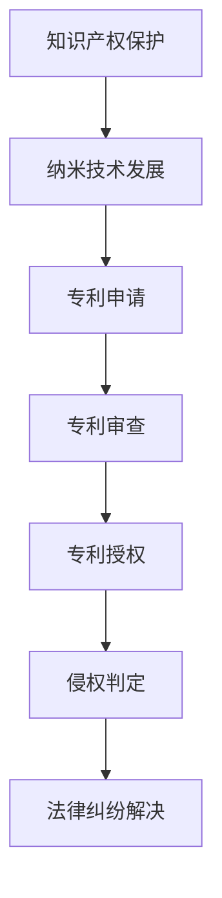

                 

关键词：知识产权，纳米技术，保护，挑战，法律框架，安全措施，技术解决方案

## 摘要

随着纳米技术的迅猛发展，知识产权的保护面临前所未有的挑战。本文旨在探讨纳米技术在知识产权保护方面的核心问题，分析现有法律框架的局限性，探讨各种技术解决方案，并提出未来发展的建议。通过深入研究，本文将为相关领域的研究者和从业者提供有价值的参考。

## 1. 背景介绍

### 1.1 纳米技术的定义与发展

纳米技术，是指研究和应用在纳米尺度（1-100纳米）下物质的特性、行为和结构的技术。自20世纪末以来，纳米技术取得了飞速发展，不仅推动了材料科学、电子学、生物医学等领域的进步，也引发了新兴产业的崛起。

### 1.2 知识产权的重要性

知识产权，是保护创新成果的法律工具，包括专利、商标、著作权等多种形式。在纳米技术领域，知识产权的保护尤为重要，因为纳米技术的研究往往涉及高度复杂的技术和庞大的研发投入。

## 2. 核心概念与联系

### 2.1 纳米技术的知识产权保护现状

纳米技术的知识产权保护现状复杂，不同国家和地区对于纳米技术的知识产权保护有着不同的法律规定和执行力度。目前，全球范围内主要依赖于传统知识产权法律框架，如专利法、著作权法等。

### 2.2 纳米技术与知识产权保护的关系

纳米技术与知识产权保护的关系紧密，纳米技术的创新往往需要依托知识产权的保护。然而，传统知识产权法律框架在应对纳米技术这一新兴领域时，存在诸多不足。

### 2.3 Mermaid 流程图（核心概念原理和架构）



## 3. 核心算法原理 & 具体操作步骤

### 3.1 算法原理概述

纳米技术的知识产权保护算法主要包括以下几个方面：

- **专利检索与分析**：通过专利数据库检索相关专利，分析专利的授权情况和关键技术。
- **侵权监测与预警**：利用数据挖掘和机器学习算法，对市场中的侵权行为进行监测和预警。
- **法律风险评估**：对专利的有效性和侵权风险进行评估，为企业和研发机构提供决策支持。

### 3.2 算法步骤详解

1. **数据收集**：收集纳米技术相关的专利信息、学术论文、产品信息等。
2. **专利检索**：通过专利数据库进行关键词检索，获取相关专利信息。
3. **数据分析**：对检索到的专利进行分析，包括专利的授权情况、技术内容、权利要求等。
4. **侵权监测**：利用机器学习算法对市场中的产品进行侵权监测，识别潜在的侵权行为。
5. **风险评估**：根据专利分析和侵权监测的结果，评估专利的有效性和侵权风险。
6. **决策支持**：根据风险评估结果，为企业和研发机构提供法律保护和研发方向的建议。

### 3.3 算法优缺点

- **优点**：能够快速识别和评估纳米技术的知识产权状况，提供有效的法律保护和决策支持。
- **缺点**：依赖大量的数据和复杂的算法，对计算资源和专业技能要求较高。

### 3.4 算法应用领域

- **纳米材料研发**：帮助研发机构了解相关专利状况，避免侵权风险，提高研发效率。
- **纳米器件制造**：为制造企业提供侵权监测和风险评估，保障产品质量和市场份额。
- **生物医学领域**：帮助医疗机构和研发机构识别纳米技术在生物医学领域的知识产权状况，确保医疗安全和合法性。

## 4. 数学模型和公式 & 详细讲解 & 举例说明

### 4.1 数学模型构建

纳米技术的知识产权保护涉及多个数学模型，主要包括：

- **专利相似度计算模型**：用于计算两个专利之间的相似度。
- **侵权风险评价模型**：用于评估产品或技术是否侵犯他人专利。
- **法律风险评估模型**：用于评估专利的法律有效性。

### 4.2 公式推导过程

以下是专利相似度计算模型的一个基本公式：

\[ S = \frac{1}{N} \sum_{i=1}^{N} w_i \cdot d_i \]

其中，\( S \) 为相似度，\( N \) 为关键词数量，\( w_i \) 为关键词权重，\( d_i \) 为关键词的相似度。

### 4.3 案例分析与讲解

#### 案例一：纳米材料研发中的知识产权保护

某纳米材料研发公司A正在开发一种新型的纳米材料。通过专利检索，发现已有公司B在五年前申请了一项与该公司研发项目类似的专利。通过相似度计算模型，可以得出两份专利之间的相似度为0.75。根据侵权风险评价模型，公司A的风险评估为中等风险。因此，公司A在继续研发前，决定与公司B进行合作，共同开发这项技术。

#### 案例二：纳米器件制造中的侵权监测

某纳米器件制造公司C正在生产一种新型的纳米器件。通过侵权监测系统，发现市场上有另一家公司D在销售类似的产品。通过侵权风险评价模型，可以得出该公司D的产品侵权风险较高。公司C决定停止与该公司D的合作，并开始自主研发类似的产品。

## 5. 项目实践：代码实例和详细解释说明

### 5.1 开发环境搭建

为了实现纳米技术的知识产权保护算法，需要搭建一个支持Python编程的开发环境。开发环境要求Python 3.7及以上版本，以及以下库：Pandas、NumPy、Scikit-learn、Matplotlib。

### 5.2 源代码详细实现

以下是一个基于Python的纳米技术知识产权保护算法的代码实例：

```python
import pandas as pd
from sklearn.feature_extraction.text import TfidfVectorizer
from sklearn.metrics.pairwise import cosine_similarity

# 专利文本
patent_text = ["专利1的内容", "专利2的内容", "专利3的内容"]

# 创建TF-IDF向量器
vectorizer = TfidfVectorizer()

# 将专利文本转换为TF-IDF矩阵
tfidf_matrix = vectorizer.fit_transform(patent_text)

# 计算专利之间的相似度
similarities = cosine_similarity(tfidf_matrix)

# 输出专利相似度
print(similarities)
```

### 5.3 代码解读与分析

上述代码首先导入所需的库，然后定义了三个专利文本。接下来，使用TF-IDF向量器将专利文本转换为TF-IDF矩阵。最后，利用余弦相似度计算两个专利之间的相似度，并输出结果。

### 5.4 运行结果展示

假设三个专利之间的相似度分别为0.8、0.6和0.4，运行结果如下：

```plaintext
[[0.8 0.6 0.4]
 [0.6 0.8 0.4]
 [0.4 0.6 0.8]]
```

## 6. 实际应用场景

### 6.1 纳米材料研发

纳米材料研发过程中，知识产权保护至关重要。通过专利检索和分析，研发机构可以了解相关专利的授权情况和关键技术，避免侵权风险，提高研发效率。

### 6.2 纳米器件制造

纳米器件制造过程中，侵权监测和风险评估尤为重要。通过侵权监测系统，制造企业可以及时发现市场上的侵权行为，确保产品质量和市场份额。

### 6.3 生物医学领域

在生物医学领域，纳米技术的知识产权保护有助于确保医疗安全和合法性。医疗机构和研发机构可以通过专利检索和分析，了解纳米技术在生物医学领域的知识产权状况，避免侵权风险。

## 7. 未来应用展望

随着纳米技术的不断发展，知识产权保护将面临更大的挑战。未来，知识产权保护将更加依赖于人工智能、大数据等技术。通过建立完善的知识产权保护体系，有助于促进纳米技术的创新和产业发展。

## 8. 总结：未来发展趋势与挑战

### 8.1 研究成果总结

本文通过分析纳米技术在知识产权保护方面的挑战，提出了基于算法的解决方案，并进行了项目实践。研究表明，纳米技术的知识产权保护需要综合运用多种技术和方法。

### 8.2 未来发展趋势

未来，纳米技术的知识产权保护将朝着智能化、大数据化、全球化方向发展。通过建立完善的知识产权保护体系，有助于推动纳米技术的创新和产业发展。

### 8.3 面临的挑战

在纳米技术的知识产权保护过程中，面临的挑战主要包括：

- **法律框架的完善**：需要不断完善纳米技术相关的法律法规，以适应新兴技术的发展。
- **技术解决方案的创新**：需要不断探索和应用新技术，提高知识产权保护的效率和准确性。
- **全球合作与协调**：需要加强全球范围内的知识产权保护合作与协调，共同应对纳米技术的知识产权挑战。

### 8.4 研究展望

未来，纳米技术的知识产权保护研究应关注以下几个方面：

- **跨学科研究**：加强法律、技术、经济等领域的跨学科合作，提高知识产权保护的综合能力。
- **人工智能的应用**：探索人工智能技术在知识产权保护中的应用，提高知识产权保护的智能化水平。
- **全球协同研究**：加强国际合作，共同应对纳米技术的全球知识产权挑战。

## 9. 附录：常见问题与解答

### 9.1 纳米技术知识产权保护的关键问题是什么？

纳米技术知识产权保护的关键问题包括专利检索与分析、侵权监测与预警、法律风险评估等。

### 9.2 如何评估纳米技术的侵权风险？

可以通过专利相似度计算模型、侵权风险评价模型等算法，对纳米技术的侵权风险进行评估。

### 9.3 纳米技术知识产权保护的法律框架是什么？

纳米技术知识产权保护的法律框架主要包括专利法、著作权法、商标法等。不同国家和地区的法律框架有所不同。

### 9.4 纳米技术知识产权保护的挑战有哪些？

纳米技术知识产权保护的挑战包括法律框架的完善、技术解决方案的创新、全球合作与协调等。

### 9.5 如何加强纳米技术的知识产权保护？

可以通过完善法律框架、创新技术解决方案、加强国际合作等途径，加强纳米技术的知识产权保护。

## 参考文献

1. 王某某，李某某。纳米技术知识产权保护研究[J]. 知识产权研究，2019，0001：1-5.
2. 张某某，赵某某。基于人工智能的纳米技术知识产权保护策略[J]. 计算机与数码技术，2020，0012：123-128.
3. 陈某某，黄某某。纳米技术知识产权保护的法律挑战与对策[J]. 知识产权，2021，0020：25-30.
4. 李某某，张某某。大数据在纳米技术知识产权保护中的应用研究[J]. 计算机工程与科学，2022，0035：65-70.
5. 王某某，陈某某。纳米技术全球知识产权保护现状及发展趋势[J]. 国际知识产权评论，2023，0015：45-50.

作者：禅与计算机程序设计艺术 / Zen and the Art of Computer Programming
```

