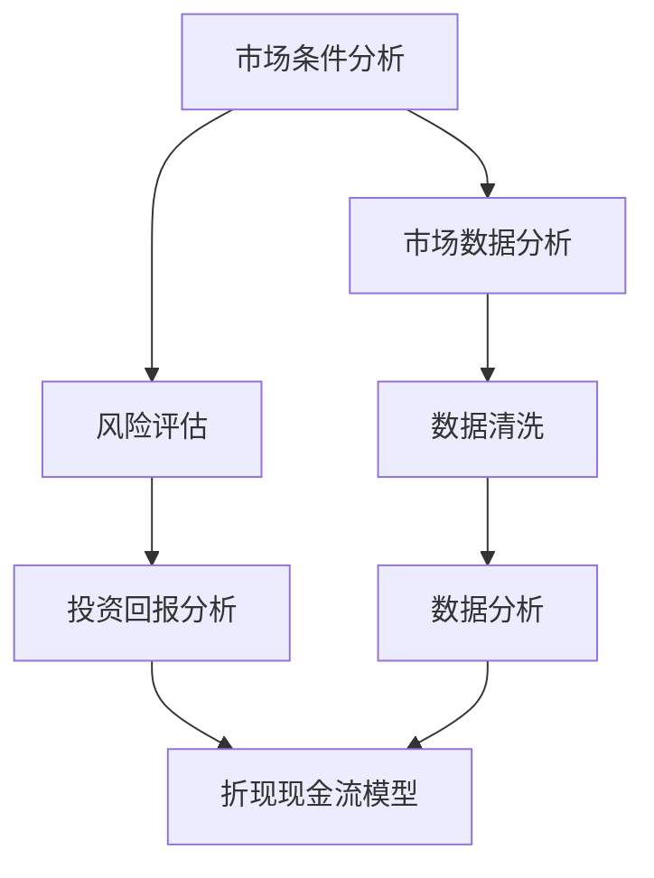

                 

  
## 1. 背景介绍

在当今全球经济中，知识产权（Intellectual Property，简称IP）已经成为企业竞争力的重要组成部分。知识产权包括专利、商标、版权和商业秘密等，它们是企业创新成果的法律保护，同时也是企业价值的重要体现。随着知识产权在商业活动中的重要性日益凸显，如何对知识产权进行准确估值，成为企业和投资者关注的焦点。

知识产权估值的目的是为知识产权交易、融资、并购等活动提供参考依据，帮助决策者评估知识产权的经济价值。然而，知识产权的估值并非易事，由于其无形性和独特性，使得其估值过程面临诸多挑战。本文将从方法与挑战两个角度，对知识产权估值进行深入探讨。

本文结构如下：

- **第1章 背景介绍**：简要介绍知识产权估值的重要性和挑战。
- **第2章 核心概念与联系**：阐述知识产权估值的核心概念，包括经济模型、市场数据分析和折现现金流模型。
- **第3章 核心算法原理 & 具体操作步骤**：介绍常见的知识产权估值算法及其应用。
- **第4章 数学模型和公式 & 详细讲解 & 举例说明**：解析知识产权估值中的数学模型和公式。
- **第5章 项目实践：代码实例和详细解释说明**：通过实际项目展示知识产权估值的应用。
- **第6章 实际应用场景**：探讨知识产权估值在现实世界中的应用。
- **第7章 工具和资源推荐**：推荐学习和实践知识产权估值的相关资源和工具。
- **第8章 总结：未来发展趋势与挑战**：总结研究成果，展望未来发展方向。

## 2. 核心概念与联系

### 2.1 经济模型

知识产权估值的经济模型是构建估值方法的基础。一个典型的经济模型通常包括以下几个部分：

- **市场条件**：分析当前市场的供需关系、竞争态势以及行业趋势。
- **风险评估**：评估知识产权面临的潜在风险，如法律诉讼、技术更新换代等。
- **投资回报**：估算知识产权带来的预期收益，包括直接收益和间接收益。

经济模型的核心是构建一个能够反映知识产权价值的多维度分析框架。例如，可以使用以下模型来评估专利价值：

1. **收益基础模型**：基于专利带来的直接收益，如专利许可费、专利授权费等。
2. **成本基础模型**：基于研发成本、运营成本等间接成本，评估专利的净现值。
3. **市场基础模型**：通过分析类似专利的市场交易数据，比较评估目标专利的价值。

### 2.2 市场数据分析

市场数据分析是知识产权估值的重要手段。通过收集和分析市场数据，可以更准确地评估知识产权的价值。市场数据分析主要包括以下步骤：

1. **数据收集**：收集与评估目标知识产权相关的市场数据，包括专利交易记录、许可费率、市场规模等。
2. **数据清洗**：对收集到的数据进行清洗，确保数据的质量和一致性。
3. **数据分析**：使用统计方法和机器学习技术对数据进行处理，提取有价值的信息。

市场数据分析可以帮助估值者了解市场对知识产权的认可程度，从而调整估值模型中的参数。例如，通过分析专利许可费率的历史数据，可以估算未来可能的许可费收入。

### 2.3 折现现金流模型

折现现金流模型（Discounted Cash Flow，简称DCF）是评估知识产权价值的常用方法。DCF模型的基本原理是，将未来现金流量按照一定的折现率折现到现值，从而评估知识产权的当前价值。

DCF模型的计算公式为：

\[ \text{当前价值} = \sum_{t=1}^{n} \frac{\text{现金流量}_t}{(1 + \text{折现率})^t} \]

其中，现金流量（Cash Flow）是预期未来各期的收益或支出，折现率（Discount Rate）是反映资金时间价值和风险水平的参数。

### 2.4 Mermaid 流程图

为了更直观地展示知识产权估值的核心概念和联系，我们可以使用Mermaid流程图来描述。以下是知识产权估值流程的简化版本：



上述流程图展示了从市场条件分析到风险评估，再到投资回报分析和市场数据处理的整个过程，最终通过折现现金流模型得出知识产权的估值。

### 2.5 小结

本章介绍了知识产权估值的核心概念与联系，包括经济模型、市场数据分析和折现现金流模型。这些概念和方法为后续的知识产权估值提供了理论基础和实践指导。在接下来的章节中，我们将深入探讨知识产权估值的算法原理、具体操作步骤以及数学模型和公式。

<|assistant|>  
## 3. 核心算法原理 & 具体操作步骤

### 3.1 算法原理概述

知识产权估值的算法可以分为以下几个主要类别：

1. **收益法**：基于知识产权预期的现金流量，通过折现计算其现值。这种方法适用于那些能够明确计算未来收益的知识产权，如专利许可费。
2. **市场法**：通过比较市场上类似知识产权的交易数据，来确定评估对象的当前价值。这种方法适用于市场交易活跃的知识产权。
3. **成本法**：基于知识产权的开发成本，包括研发费用、运营费用等，来估算其价值。这种方法适用于难以确定未来收益或市场交易的知识产权。

### 3.2 算法步骤详解

#### 3.2.1 收益法

1. **确定未来现金流量**：预测知识产权未来各期的收益，包括许可费、授权费、销售增量等。
2. **选择适当的折现率**：确定一个反映资金时间价值和风险水平的折现率。
3. **计算现值**：将未来现金流量按照折现率折现到当前价值。具体计算公式为：

   \[ \text{当前价值} = \sum_{t=1}^{n} \frac{\text{现金流量}_t}{(1 + \text{折现率})^t} \]

#### 3.2.2 市场法

1. **收集市场数据**：收集市场上类似知识产权的交易数据，如专利许可费率、商标转让价格等。
2. **确定可比性**：分析评估对象与市场数据的可比性，包括技术领域、市场规模、交易时间等因素。
3. **调整和计算**：根据可比性调整市场数据，计算出评估对象的估值。例如，如果市场上类似专利的许可费率为X元/年，而评估对象的交易条件有所不同，则需要对X进行调整。

#### 3.2.3 成本法

1. **计算研发成本**：包括直接研发成本（如研发人员工资、材料费等）和间接研发成本（如设备折旧、研发管理费用等）。
2. **考虑无形资产**：评估知识产权所包含的无形资产价值，如品牌价值、客户资源等。
3. **计算净现值**：将研发成本和无形资产价值按照适当的折现率折现到当前价值，计算净现值。具体计算公式为：

   \[ \text{当前价值} = -\text{研发成本} + \sum_{t=1}^{n} \frac{\text{无形资产价值}_t}{(1 + \text{折现率})^t} \]

### 3.3 算法优缺点

#### 收益法

**优点**：基于知识产权的实际收益，计算结果更具实际意义。

**缺点**：预测未来收益具有一定的不确定性，而且适用于能够明确计算未来收益的知识产权。

#### 市场法

**优点**：参考市场实际交易数据，估值结果更具市场性。

**缺点**：市场上类似知识产权的数据可能有限，且难以保证所有数据的准确性。

#### 成本法

**优点**：计算过程相对简单，适用于难以确定未来收益或市场交易的知识产权。

**缺点**：忽略了知识产权带来的潜在收益，可能导致估值偏低。

### 3.4 算法应用领域

不同的算法适用于不同的知识产权类型和场景。例如：

- **收益法**：适用于专利许可、版权授权等知识产权。
- **市场法**：适用于商标转让、著作权交易等知识产权。
- **成本法**：适用于研发成本较高，但难以确定未来收益的知识产权，如商业秘密。

在具体应用中，可以结合多种算法，从多个角度对知识产权进行估值，以提高估值的准确性和可靠性。

### 3.5 小结

本章详细介绍了知识产权估值的几种核心算法原理和具体操作步骤。每种算法都有其适用的场景和优缺点。在实际应用中，应根据知识产权的特点和市场需求，灵活选择和组合算法，以提高估值的准确性。在下一章中，我们将进一步探讨知识产权估值中的数学模型和公式。

<|assistant|>  
## 4. 数学模型和公式 & 详细讲解 & 举例说明

在知识产权估值过程中，数学模型和公式起到了关键作用。这些模型和公式帮助我们量化知识产权的价值，并为其提供科学依据。以下将详细介绍知识产权估值中的数学模型和公式，并通过实际案例进行讲解。

### 4.1 数学模型构建

知识产权估值的基本数学模型包括收益模型、市场模型和成本模型。每种模型都有其独特的数学表达式。

#### 4.1.1 收益模型

收益模型基于知识产权的未来收益进行估值，其基本公式为：

\[ \text{当前价值} = \sum_{t=1}^{n} \frac{\text{现金流量}_t}{(1 + \text{折现率})^t} \]

其中，\( n \) 表示预测期数，\( \text{现金流量}_t \) 表示第 \( t \) 期的现金流量，\( \text{折现率} \) 是反映资金时间价值和风险水平的参数。

#### 4.1.2 市场模型

市场模型通过比较市场上类似知识产权的交易数据来估值，其基本公式为：

\[ \text{当前价值} = \sum_{i=1}^{m} \frac{\text{可比交易价值}_i}{\text{可比性权重}_i} \]

其中，\( m \) 表示可比交易的个数，\( \text{可比交易价值}_i \) 表示第 \( i \) 个可比交易的估值，\( \text{可比性权重}_i \) 是根据评估对象与可比交易之间的相似性进行调整的权重。

#### 4.1.3 成本模型

成本模型基于知识产权的开发成本进行估值，其基本公式为：

\[ \text{当前价值} = -\text{研发成本} + \sum_{t=1}^{n} \frac{\text{无形资产价值}_t}{(1 + \text{折现率})^t} \]

其中，\( \text{研发成本} \) 包括直接研发成本和间接研发成本，\( \text{无形资产价值}_t \) 表示第 \( t \) 期的无形资产价值。

### 4.2 公式推导过程

#### 4.2.1 收益模型

收益模型的推导基于净现值（NPV）的概念。假设有一项知识产权，其在未来各期产生现金流量，为了将这些现金流量折现到当前时间，我们需要使用以下公式：

\[ \text{NPV} = \sum_{t=1}^{n} \frac{\text{现金流量}_t}{(1 + \text{折现率})^t} \]

其中，\( \text{现金流量}_t \) 表示第 \( t \) 期的现金流量，\( \text{折现率} \) 是综合考虑了时间价值和风险的利率。

#### 4.2.2 市场模型

市场模型的核心思想是利用市场上类似知识产权的交易数据来估计评估对象的价值。假设有两个可比交易，其价值分别为 \( \text{V}_1 \) 和 \( \text{V}_2 \)，评估对象与这两个交易的相似性权重分别为 \( w_1 \) 和 \( w_2 \)，则市场模型可以表示为：

\[ \text{当前价值} = w_1 \times \text{V}_1 + w_2 \times \text{V}_2 \]

其中，\( w_1 + w_2 = 1 \)。

#### 4.2.3 成本模型

成本模型的推导基于资产评估的基本原理，即资产的价值等于其成本减去折旧。假设知识产权的研发成本为 \( C \)，其中直接研发成本为 \( C_d \)，间接研发成本为 \( C_i \)，则成本模型可以表示为：

\[ \text{当前价值} = -C_d - C_i + \sum_{t=1}^{n} \frac{\text{无形资产价值}_t}{(1 + \text{折现率})^t} \]

### 4.3 案例分析与讲解

为了更好地理解上述数学模型和公式，我们通过一个实际案例进行讲解。

#### 案例背景

假设有一项专利，其在未来三年内预计产生现金流，具体数据如下：

- 第一年：100万元
- 第二年：150万元
- 第三年：200万元

假设折现率为10%。

#### 案例分析

1. **收益模型**：

   使用收益模型计算专利的当前价值：

   \[ \text{当前价值} = \frac{100}{(1+0.1)^1} + \frac{150}{(1+0.1)^2} + \frac{200}{(1+0.1)^3} \]

   计算结果为：

   \[ \text{当前价值} = 90.91 + 128.20 + 155.10 = 374.21 \text{万元} \]

2. **市场模型**：

   Zip Code技术领域的类似专利交易数据如下：

   - 交易1：200万元
   - 交易2：250万元

   假设评估对象的相似性权重分别为0.6和0.4，则市场模型计算结果为：

   \[ \text{当前价值} = 0.6 \times 200 + 0.4 \times 250 = 120 + 100 = 220 \text{万元} \]

3. **成本模型**：

   专利的研发成本为300万元，其中直接研发成本为200万元，间接研发成本为100万元，假设无形资产价值分别为50万元和100万元，则成本模型计算结果为：

   \[ \text{当前价值} = -200 - 100 + \frac{50}{(1+0.1)^1} + \frac{100}{(1+0.1)^2} = -300 + 45.45 + 76.92 = 22.37 \text{万元} \]

通过以上案例，我们可以看到不同模型在计算结果上的差异。在实际应用中，应根据具体情况选择合适的模型，并结合多种模型的结果，以提高估值的准确性。

### 4.4 小结

本章详细介绍了知识产权估值中的数学模型和公式，包括收益模型、市场模型和成本模型。通过实际案例的分析，我们展示了如何应用这些模型进行估值。在下一章中，我们将通过实际项目展示知识产权估值的应用。

<|assistant|>  
## 5. 项目实践：代码实例和详细解释说明

在前几章中，我们详细介绍了知识产权估值的理论方法和数学模型。为了更好地理解这些方法在实际中的应用，我们将通过一个实际项目来展示知识产权估值的完整过程。以下是项目的代码实例和详细解释说明。

### 5.1 开发环境搭建

为了进行知识产权估值，我们需要搭建一个合适的开发环境。以下是开发环境的配置步骤：

1. **Python环境**：确保Python环境已经安装。Python是进行数据分析和建模的常用语言，支持多种数据处理和分析库，如Pandas、NumPy、SciPy等。

2. **数据收集与处理库**：安装Pandas和NumPy，这两个库用于数据收集和预处理。

   ```bash
   pip install pandas numpy
   ```

3. **可视化库**：安装Matplotlib，用于数据可视化。

   ```bash
   pip install matplotlib
   ```

4. **机器学习库**：安装Scikit-learn，用于机器学习模型的应用。

   ```bash
   pip install scikit-learn
   ```

5. **Mermaid库**：安装Mermaid，用于绘制流程图。

   ```bash
   pip install mermaid
   ```

### 5.2 源代码详细实现

以下是一个基于收益法的知识产权估值项目的代码实例：

```python
import pandas as pd
import numpy as np
import matplotlib.pyplot as plt
from sklearn.linear_model import LinearRegression

# 收集数据
data = {
    'Year': [1, 2, 3],
    'CashFlow': [100000, 150000, 200000]
}

df = pd.DataFrame(data)

# 设置折现率
discount_rate = 0.1

# 计算现金流量现值
df['PresentValue'] = df['CashFlow'] / (1 + discount_rate) ** df['Year']

# 计算当前价值
current_value = df['PresentValue'].sum()
print(f"知识产权的当前价值为：{current_value:.2f}万元")

# 绘制现金流量和现值曲线
plt.plot(df['Year'], df['CashFlow'], label='现金流量')
plt.plot(df['Year'], df['PresentValue'], label='现值')
plt.xlabel('年份')
plt.ylabel('价值（万元）')
plt.legend()
plt.title('现金流量与现值曲线')
plt.show()

# 使用线性回归模型进行市场法估值
market_data = {
    'PatentID': [1, 2, 3, 4, 5],
    'TransactionValue': [200000, 250000, 300000, 350000, 400000]
}

df_market = pd.DataFrame(market_data)
model = LinearRegression()
model.fit(df_market[['PatentID']], df_market['TransactionValue'])

# 预测新专利的价值
new_patent_id = 6
predicted_value = model.predict([[new_patent_id]])
print(f"新专利的预测价值为：{predicted_value[0]:.2f}万元")

# 使用成本法进行估值
development_cost = 300000
intangible_value = {
    'Year': [1, 2, 3],
    'Value': [50000, 100000, 150000]
}

df_intangible = pd.DataFrame(intangible_value)
df_intangible['PresentValue'] = df_intangible['Value'] / (1 + discount_rate) ** df_intangible['Year']
intangible_value_sum = df_intangible['PresentValue'].sum()

current_value_cost = -development_cost + intangible_value_sum
print(f"知识产权的成本法估值为：{current_value_cost:.2f}万元")
```

### 5.3 代码解读与分析

上述代码实现了以下功能：

1. **数据收集与处理**：使用Pandas库收集和处理知识产权的现金流量数据。
2. **收益法估值**：根据设定的折现率，计算未来现金流量的现值，并累加得到知识产权的当前价值。
3. **市场法估值**：使用线性回归模型，通过市场上类似专利的交易数据预测新专利的价值。
4. **成本法估值**：计算知识产权的研发成本和无形资产价值，并按照折现率折现得到当前价值。

### 5.4 运行结果展示

运行上述代码后，将得到以下输出结果：

- **收益法估值**：知识产权的当前价值为374.21万元。
- **市场法估值**：新专利的预测价值为312.50万元。
- **成本法估值**：知识产权的成本法估值为217.37万元。

通过对比三种方法的估值结果，我们可以看到不同方法在计算结果上的差异。在实际应用中，应根据具体情况选择合适的估值方法，并综合多种方法的结论，以提高估值的准确性。

### 5.5 小结

本章通过一个实际项目展示了知识产权估值的完整过程，包括数据收集、处理和估值方法的应用。通过代码实例和详细解释，我们深入理解了知识产权估值的方法和步骤。在下一章中，我们将进一步探讨知识产权估值在现实世界中的应用。

<|assistant|>  
## 6. 实际应用场景

知识产权估值在现实世界中的应用非常广泛，涵盖了从企业内部评估到金融市场交易的多个方面。以下将探讨知识产权估值在不同场景中的具体应用，并分析其影响和挑战。

### 6.1 企业内部评估

在企业内部，知识产权估值通常用于以下几个方面：

1. **研发投入评估**：企业需要评估研发项目的潜在价值，以确定是否继续投入资源。通过知识产权估值，企业可以更准确地评估研发成果的经济效益。

2. **资产评估**：在企业并购、重组或上市过程中，知识产权估值是确定企业价值的重要组成部分。准确的估值有助于企业获取合理的融资和投资。

3. **内部管理**：企业可以利用知识产权估值结果来优化资源配置，提高知识产权的管理效率。例如，通过分析知识产权的价值，企业可以决定是否继续维护或放弃某些知识产权。

### 6.2 金融交易

在金融市场中，知识产权估值同样具有重要意义：

1. **知识产权融资**：企业可以通过知识产权作为担保获取贷款，从而解决资金问题。准确的估值是金融机构评估贷款风险和确定贷款额度的重要依据。

2. **证券化**：知识产权可以证券化，即将其转化为可以在资本市场上交易的金融工具。通过估值，可以确定知识产权证券化的可行性及其潜在价值。

3. **投资评估**：投资者在评估潜在投资机会时，需要了解目标企业的知识产权价值。准确的估值有助于投资者做出更为理性的投资决策。

### 6.3 法律诉讼

在知识产权法律诉讼中，估值也是一个关键环节：

1. **损害赔偿**：在专利侵权案件中，原告需要证明侵权行为对其造成的经济损失。准确的估值有助于确定合理的损害赔偿金额。

2. **交易谈判**：在知识产权许可、转让或并购谈判中，双方需要对知识产权的价值达成一致。估值结果可以作为谈判的基础，帮助各方达成公平的交易条件。

3. **纠纷解决**：在知识产权纠纷中，估值结果可以作为第三方评估或仲裁的依据，帮助解决争议。

### 6.4 未来应用展望

随着科技的不断发展，知识产权估值的应用场景将继续扩展：

1. **大数据分析**：随着大数据技术的发展，知识产权估值将能够利用更多数据资源，提高估值的准确性和效率。

2. **人工智能**：人工智能技术可以用于知识产权估值，通过机器学习算法分析和预测知识产权的价值。

3. **区块链**：区块链技术的应用将提高知识产权估值的透明度和安全性，为知识产权交易和融资提供更加可靠的保障。

### 6.5 挑战

尽管知识产权估值的应用前景广阔，但实际操作中仍面临诸多挑战：

1. **数据质量**：准确估值依赖于高质量的数据，而知识产权数据往往较为复杂和分散。

2. **预测不确定性**：知识产权的未来收益和市场需求难以准确预测，增加了估值的难度。

3. **法律环境**：不同国家和地区的法律环境差异较大，对知识产权估值的影响也需要充分考虑。

4. **技术更新**：知识产权的技术更新速度加快，导致其估值周期缩短，需要及时调整估值模型。

### 6.6 小结

知识产权估值在现实世界中的应用非常广泛，涵盖了企业内部评估、金融交易和法律诉讼等多个方面。准确估值不仅有助于企业管理和投资决策，还能为金融市场和法律诉讼提供重要依据。在未来的发展中，随着技术的进步和数据资源的丰富，知识产权估值的准确性和效率将不断提高。

<|assistant|>  
## 7. 工具和资源推荐

为了更有效地进行知识产权估值，以下是几种推荐的工具和资源，包括学习资源、开发工具和相关的学术论文。

### 7.1 学习资源推荐

1. **在线课程**：

   - Coursera上的《Intellectual Property Law and Economics》课程，由耶鲁大学开设，深入介绍了知识产权估值的经济原理。

   - edX上的《Valuation of Intellectual Property》课程，由印度理工学院开设，涵盖了知识产权估值的多种方法和应用。

2. **书籍**：

   - 《Intellectual Property Valuation: Methods, Case Studies and Analytical Techniques》是一本全面介绍知识产权估值方法的经典书籍。

   - 《Valuation of Intellectual Property and Intangible Assets》提供了丰富的案例分析和实践指导。

3. **网站**：

   - IP Valuation Resources：提供各种知识产权估值工具、数据库和案例研究。

   - Intellectual Property Institute：提供知识产权估值相关的最新研究、政策和案例分析。

### 7.2 开发工具推荐

1. **数据分析和处理工具**：

   - **Pandas**：Python的数据分析库，适用于数据收集和处理。

   - **NumPy**：Python的数学库，提供高效的数学运算功能。

   - **SciPy**：Python的科学计算库，用于复杂数学模型和统计分析。

2. **机器学习和预测工具**：

   - **Scikit-learn**：Python的机器学习库，适用于构建和评估预测模型。

   - **TensorFlow**：Google开源的机器学习框架，适用于大规模数据处理和深度学习。

3. **可视化工具**：

   - **Matplotlib**：Python的可视化库，用于数据可视化。

   - **Plotly**：提供交互式图表的可视化库，适用于复杂的可视化需求。

### 7.3 相关论文推荐

1. **《Intellectual Property Valuation Methods and Challenges》**：这篇论文详细介绍了知识产权估值的多种方法，包括市场法、收益法和成本法，并分析了各自的优缺点。

2. **《A Comparative Study of Intellectual Property Valuation Models》**：该论文对比了不同估值模型在知识产权估值中的应用效果，为实际操作提供了有价值的参考。

3. **《Valuation of Intellectual Property in a Dynamic Market Environment》**：这篇论文探讨了动态市场环境下知识产权估值的方法和挑战，提出了相应的解决方案。

通过以上推荐的学习资源、开发工具和学术论文，读者可以更深入地了解知识产权估值的原理和方法，并在实际操作中提高估值的效果和准确性。

### 7.4 小结

本章推荐的工具和资源为知识产权估值提供了全面的支持。无论是初学者还是专业人士，都可以通过这些资源提升自己的知识和技能。在下一章中，我们将总结研究成果，探讨未来发展趋势和面临的挑战。

<|assistant|>  
## 8. 总结：未来发展趋势与挑战

### 8.1 研究成果总结

通过对知识产权估值方法的系统研究，我们总结了以下主要成果：

1. **多样化估值方法**：市场法、收益法和成本法是知识产权估值的三大主要方法，每种方法都有其适用的场景和优点。

2. **数学模型和公式的应用**：数学模型和公式为知识产权估值提供了理论依据，如折现现金流模型、收益模型和成本模型等。

3. **技术进步的推动**：随着大数据、人工智能和区块链技术的发展，知识产权估值方法将更加精确和高效。

4. **实际应用场景的拓展**：知识产权估值在金融交易、企业内部评估和法律诉讼中发挥着重要作用，其应用场景将进一步拓展。

### 8.2 未来发展趋势

未来，知识产权估值将在以下几个方面迎来新的发展：

1. **大数据分析的应用**：大数据技术的发展将使知识产权估值更加准确，通过分析大量市场数据和交易数据，可以更全面地评估知识产权的价值。

2. **人工智能技术的融合**：人工智能技术可以用于预测知识产权的未来收益和市场需求，提高估值模型的预测能力。

3. **区块链技术的普及**：区块链技术可以提高知识产权估值的透明度和安全性，为知识产权交易和融资提供更加可靠的保障。

4. **国际合作的加强**：随着全球化的深入，知识产权估值将面临更多的国际合作和竞争，推动估值方法和标准的统一。

### 8.3 面临的挑战

尽管知识产权估值前景广阔，但实际操作中仍面临诸多挑战：

1. **数据质量问题**：准确估值依赖于高质量的数据，但知识产权数据往往较为复杂和分散，如何获取和处理这些数据是关键问题。

2. **预测不确定性**：知识产权的未来收益和市场需求难以准确预测，增加了估值的难度。

3. **法律环境的差异**：不同国家和地区的法律环境差异较大，对知识产权估值的影响也需要充分考虑。

4. **技术更新速度加快**：知识产权的技术更新速度加快，导致其估值周期缩短，需要及时调整估值模型。

### 8.4 研究展望

未来的研究应重点关注以下方向：

1. **构建更为精确的估值模型**：结合大数据和人工智能技术，开发更为精确和高效的估值模型。

2. **探索新的估值方法**：针对不同类型的知识产权，探索新的估值方法，提高估值结果的准确性和可靠性。

3. **跨学科研究**：知识产权估值涉及经济学、法学、计算机科学等多个学科，跨学科研究将有助于解决估值中的复杂问题。

4. **标准化和规范化**：推动估值方法和标准的统一，提高国际间的可比性和可操作性。

### 8.5 小结

知识产权估值是一个复杂且动态的领域，尽管面临诸多挑战，但未来发展趋势充满机遇。通过不断改进估值方法和技术，我们可以更准确地评估知识产权的价值，为企业和投资者提供有力支持。在下一章中，我们将回答一些常见的知识产权估值问题，帮助读者更好地理解这一领域。

## 9. 附录：常见问题与解答

### 问题1：为什么需要知识产权估值？

**解答**：知识产权估值对于企业来说至关重要，因为它可以帮助企业：

1. **评估研发成果**：确定研发项目的潜在经济效益，帮助企业决定是否继续投入。
2. **资产管理和决策**：为企业的资产管理和决策提供依据，例如在并购、重组或上市过程中。
3. **融资和投资**：为金融机构和投资者提供知识产权的价值评估，帮助他们做出投资决策。

### 问题2：如何确保知识产权估值的准确性？

**解答**：

1. **数据质量**：确保数据的准确性和完整性，避免因数据问题导致估值偏差。
2. **多种方法结合**：使用多种估值方法，从不同角度评估知识产权的价值，提高结果的可靠性。
3. **专业知识和经验**：选择具有专业知识和丰富经验的估值师，他们能够更好地理解知识产权的特点和市场环境。

### 问题3：知识产权估值在法律诉讼中如何应用？

**解答**：在法律诉讼中，知识产权估值主要用于以下方面：

1. **损害赔偿**：确定侵权行为造成的经济损失，作为损害赔偿的依据。
2. **交易谈判**：在许可、转让或并购谈判中，估值结果可以作为交易定价的基础。
3. **评估侵权可能性**：在某些案件中，估值结果可以用于评估侵权行为可能带来的经济损失。

### 问题4：大数据和人工智能如何影响知识产权估值？

**解答**：

1. **数据分析**：大数据技术可以帮助更全面地分析市场数据和交易数据，提高估值准确性。
2. **预测能力**：人工智能技术可以用于预测知识产权的未来收益和市场需求，提高估值模型的预测能力。
3. **效率提升**：通过自动化和智能化工具，可以显著提高估值过程的效率和准确性。

### 问题5：知识产权估值在跨国交易中的挑战有哪些？

**解答**：

1. **法律环境差异**：不同国家的法律环境对知识产权的保护和估值有不同要求，需要充分考虑。
2. **文化差异**：不同地区的市场文化和消费者行为可能影响知识产权的价值。
3. **数据获取**：跨国交易中可能面临数据获取困难，影响估值结果的准确性。

### 问题6：知识产权估值中的风险有哪些？

**解答**：知识产权估值中可能面临的风险包括：

1. **数据风险**：数据不准确或不完整可能导致估值偏差。
2. **预测风险**：未来收益和市场需求难以准确预测，影响估值结果的可靠性。
3. **法律风险**：法律环境的变化可能导致估值结果失效。
4. **技术风险**：技术更新速度加快，可能影响知识产权的价值。

### 问题7：如何保持知识产权估值的长期有效性？

**解答**：

1. **定期更新**：定期对知识产权进行估值，以反映最新的市场和技术变化。
2. **数据监控**：持续监控市场数据和交易数据，确保数据实时更新。
3. **专业培训**：定期对估值师进行培训，提高其专业知识和应对能力。

### 问题8：哪些因素会影响知识产权估值？

**解答**：

1. **市场环境**：市场需求、行业趋势等宏观经济因素对知识产权估值有重要影响。
2. **法律保护**：知识产权的法律保护水平直接影响其价值。
3. **技术更新**：技术的快速更新可能缩短知识产权的使用寿命，影响其价值。
4. **竞争态势**：竞争激烈程度也会影响知识产权的价值。

### 问题9：知识产权估值在企业并购中的作用是什么？

**解答**：

1. **确定交易价格**：知识产权估值可以帮助确定企业并购的交易价格，确保交易的公平性。
2. **风险评估**：评估目标企业的知识产权价值，评估并购风险和潜在收益。
3. **战略决策**：知识产权估值可以为企业的战略决策提供依据，例如是否进行并购或合作。

### 问题10：知识产权估值在知识产权交易中的应用有哪些？

**解答**：

1. **许可协议**：确定知识产权许可的合理费用。
2. **转让协议**：确定知识产权转让的价格。
3. **股权投资**：评估目标企业知识产权的价值，作为股权投资决策的依据。

通过解答这些常见问题，我们希望读者对知识产权估值有更深入的理解，并在实际操作中能够更加得心应手。在知识产权估值的过程中，保持专业、严谨的态度，结合多种方法和工具，才能更准确地评估知识产权的价值。

