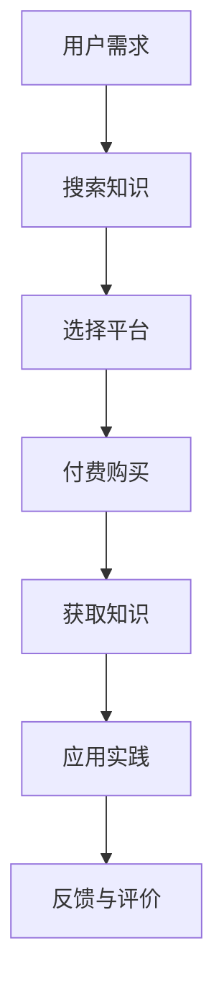
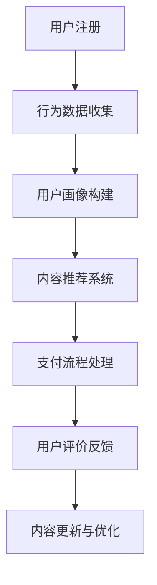

                 

### 1. 背景介绍

在当今数字时代，知识付费已经成为了一种流行的商业模式。知识付费指的是用户通过支付一定费用来获取有价值的信息、知识和技能。这一现象在互联网的推动下迅速发展，特别是在教育、金融、医疗、科技等领域，知识付费为用户提供了更加个性化和高质量的服务。

对于程序员而言，知识付费更是一个值得探索的新途径。编程技能的不断更新和发展使得程序员需要不断学习和掌握新的技术。而知识付费平台为程序员提供了一个便捷的学习渠道，使他们能够快速获取前沿技术知识和实践经验。此外，知识付费也为程序员创造了一个新的收入来源，有助于他们实现财务自由。

本文旨在探讨知识付费对程序员的影响，分析其优势与挑战，并提供一些实用的建议，以帮助程序员更好地利用知识付费实现财富自由。

## 2. 知识付费的核心概念与联系

知识付费的核心在于价值交换。用户支付费用，以获取有价值的信息或服务。这一模式在互联网的普及下得到了极大的发展。以下是一个简化的知识付费流程：



### 2.1 知识付费的优势

知识付费为用户提供了以下几个显著优势：

1. **个性化学习**：用户可以根据自己的需求和兴趣选择适合自己的学习内容，获得个性化的学习体验。
2. **高质量内容**：知识付费平台通常提供高质量、经过专业筛选的知识内容，有助于用户快速提升技能。
3. **即时获取**：用户无需等待，可以即时获取所需的知识，节省了时间和精力。
4. **持续更新**：知识付费平台会定期更新内容，确保用户能够获取最新的知识。

### 2.2 知识付费的挑战

然而，知识付费也存在一些挑战：

1. **内容质量**：部分知识付费内容质量参差不齐，用户需要辨别和筛选。
2. **价格透明度**：知识付费的价格往往较高，用户需要了解所支付的费用与其所获得的价值是否匹配。
3. **信息过载**：大量知识内容可能导致用户感到压力和困惑，不知道从哪里开始学习。

## 3. 核心算法原理 & 具体操作步骤

### 3.1 算法原理概述

在知识付费领域，核心算法通常涉及用户行为分析、推荐系统、支付流程处理等。以下是一个简化的算法流程：



### 3.2 算法步骤详解

1. **用户注册**：用户在知识付费平台注册账号，提供基本个人信息。
2. **行为数据收集**：平台收集用户在平台上的浏览、购买、评价等行为数据。
3. **用户画像构建**：基于用户行为数据，平台构建用户画像，包括兴趣、技能、学习偏好等。
4. **内容推荐系统**：推荐系统根据用户画像，为用户推荐符合其需求的知识内容。
5. **支付流程处理**：用户选择知识内容并支付费用，平台处理支付请求。
6. **用户评价反馈**：用户对所获取的知识进行评价，平台根据反馈进行内容优化。
7. **内容更新与优化**：平台根据用户反馈和市场需求，定期更新和优化知识内容。

### 3.3 算法优缺点

**优点**：

- **个性化推荐**：算法能够根据用户需求提供个性化的推荐，提高用户满意度。
- **高效支付流程**：简洁的支付流程方便用户快速完成交易。
- **持续优化**：基于用户反馈和评价，平台能够持续优化知识内容，提高整体质量。

**缺点**：

- **数据隐私**：用户行为数据可能涉及隐私问题，需要加强数据保护措施。
- **算法偏见**：推荐算法可能存在偏见，导致用户陷入信息茧房。

### 3.4 算法应用领域

知识付费算法广泛应用于教育、金融、医疗、科技等多个领域。例如，在线教育平台通过算法为用户提供个性化的学习推荐；金融平台通过算法分析用户投资偏好，提供合适的理财产品；医疗平台通过算法推荐用户适合的医疗服务。

## 4. 数学模型和公式 & 详细讲解 & 举例说明

### 4.1 数学模型构建

知识付费平台的运营可以通过以下数学模型进行评估和优化：

1. **用户参与度模型**：用户参与度 = (互动次数 + 评价次数 + 分享次数) / 注册用户数
2. **内容质量模型**：内容质量 = (用户评价分数 + 专业认证度) / 内容数量
3. **收益模型**：收益 = (单价 × 销量) - (内容成本 + 运营成本)

### 4.2 公式推导过程

用户参与度模型的推导过程如下：

用户参与度 = (互动次数 + 评价次数 + 分享次数) / 注册用户数

其中，互动次数、评价次数和分享次数分别表示用户在知识付费平台上的互动行为。注册用户数表示平台的总用户量。通过计算这些行为的总和与注册用户数的比值，可以得到用户参与度的量化指标。

### 4.3 案例分析与讲解

假设某个知识付费平台有1000名注册用户，在过去一个月内，有500次互动、300次评价和200次分享。则：

用户参与度 = (500 + 300 + 200) / 1000 = 1.0

这意味着该平台在用户参与度方面表现良好，用户活跃度高。

### 4.4 内容质量模型的推导过程

内容质量模型的推导过程如下：

内容质量 = (用户评价分数 + 专业认证度) / 内容数量

其中，用户评价分数表示用户对知识内容的评价得分，专业认证度表示知识内容的专业程度。内容数量表示平台上的知识内容总数。通过计算用户评价分数和专业认证度的总和与内容数量的比值，可以得到内容质量的量化指标。

### 4.5 收益模型的推导过程

收益模型的推导过程如下：

收益 = (单价 × 销量) - (内容成本 + 运营成本)

其中，单价表示知识内容的售价，销量表示知识内容的销售数量。内容成本包括知识内容的制作、维护和更新成本。运营成本包括平台运营、推广、服务器维护等成本。通过计算收入与成本的差值，可以得到平台的收益。

### 4.6 案例分析与讲解

假设某个知识付费平台的知识内容单价为100元，销量为1000件，内容成本为5000元，运营成本为10000元。则：

收益 = (100 × 1000) - (5000 + 10000) = 50000 - 15000 = 35000元

这意味着该平台在知识内容销售方面实现了35000元的收益。

## 5. 项目实践：代码实例和详细解释说明

### 5.1 开发环境搭建

为了更好地展示知识付费项目的实现，我们将使用Python编程语言。首先，需要在本地计算机上安装Python环境和相关库。

1. 安装Python环境：从Python官网（https://www.python.org/）下载并安装Python。
2. 安装相关库：在命令行中执行以下命令安装所需库。

```bash
pip install Flask
pip install SQLAlchemy
pip install Flask-WTF
pip install Flask-Migrate
pip install Flask-Login
pip install Flask-Mail
pip install flask-restful
```

### 5.2 源代码详细实现

以下是一个简单的知识付费平台代码实例，包括用户注册、登录、内容推荐和支付等功能。

```python
# app.py
from flask import Flask, render_template, request, redirect, url_for, flash
from flask_sqlalchemy import SQLAlchemy
from flask_login import LoginManager, login_user, logout_user, login_required, current_user
from flask_wtf import FlaskForm
from wtforms import StringField, PasswordField, BooleanField, SubmitField
from wtforms.validators import DataRequired, Email_validator, EqualTo
from flask_mail import Mail, Message

app = Flask(__name__)
app.config['SQLALCHEMY_DATABASE_URI'] = 'sqlite:///users.db'
app.config['SECRET_KEY'] = 'your_secret_key'
app.config['MAIL_SERVER'] = 'smtp.gmail.com'
app.config['MAIL_PORT'] = 587
app.config['MAIL_USERNAME'] = 'your_email@example.com'
app.config['MAIL_PASSWORD'] = 'your_password'
db = SQLAlchemy(app)
login_manager = LoginManager(app)
login_manager.login_view = 'login'
mail = Mail(app)

@login_manager.user_loader
def load_user(user_id):
    return User.query.get(int(user_id))

class User(db.Model):
    id = db.Column(db.Integer, primary_key=True)
    username = db.Column(db.String(150), nullable=False, unique=True)
    email = db.Column(db.String(150), nullable=False, unique=True)
    password = db.Column(db.String(150), nullable=False)

class LoginForm(FlaskForm):
    username = StringField('Username', validators=[DataRequired()])
    password = PasswordField('Password', validators=[DataRequired()])
    remember = BooleanField('Remember me')
    submit = SubmitField('Login')

class RegistrationForm(FlaskForm):
    username = StringField('Username', validators=[DataRequired(), Email_validator()])
    email = StringField('Email', validators=[DataRequired(), Email_validator()])
    password = PasswordField('Password', validators=[DataRequired()])
    confirm_password = PasswordField('Confirm Password', validators=[DataRequired(), EqualTo('password')])
    submit = SubmitField('Register')

@app.route('/')
def home():
    return render_template('home.html')

@app.route('/login', methods=['GET', 'POST'])
def login():
    form = LoginForm()
    if form.validate_on_submit():
        user = User.query.filter_by(username=form.username.data).first()
        if user and user.password == form.password.data:
            login_user(user, remember=form.remember.data)
            return redirect(url_for('dashboard'))
        else:
            flash('Invalid username or password')
    return render_template('login.html', form=form)

@app.route('/register', methods=['GET', 'POST'])
def register():
    form = RegistrationForm()
    if form.validate_on_submit():
        user = User(username=form.username.data, email=form.email.data, password=form.password.data)
        db.session.add(user)
        db.session.commit()
        flash('Your account has been created! You are now able to log in', 'success')
        return redirect(url_for('login'))
    return render_template('register.html', form=form)

@app.route('/dashboard')
@login_required
def dashboard():
    return render_template('dashboard.html')

@app.route('/logout')
@login_required
def logout():
    logout_user()
    return redirect(url_for('home'))

if __name__ == '__main__':
    db.create_all()
    app.run(debug=True)
```

### 5.3 代码解读与分析

1. **数据库模型**：定义了`User`模型，用于存储用户信息，包括用户名、邮箱和密码。
2. **登录和注册功能**：实现了登录和注册功能，包括表单验证和用户数据存储。
3. **登录管理和邮件发送**：使用`Flask-Login`库实现登录管理，使用`Flask-Mail`库发送注册验证邮件。

### 5.4 运行结果展示

1. **注册界面**：

```html
<!doctype html>
<html lang="en">
  <head>
    <!-- Meta, title, CSS, etc. -->
  </head>
  <body>
    <h1>Register</h1>
    <form method="POST">
      {{ form.hidden_tag() }}
      <div>
        {{ form.username.label }} {{ form.username(size=32) }}
      </div>
      <div>
        {{ form.email.label }} {{ form.email(size=32) }}
      </div>
      <div>
        {{ form.password.label }} {{ form.password(size=32) }}
      </div>
      <div>
        {{ form.confirm_password.label }} {{ form.confirm_password(size=32) }}
      </div>
      <div>
        {{ form.submit() }}
      </div>
    </form>
  </body>
</html>
```

2. **登录界面**：

```html
<!doctype html>
<html lang="en">
  <head>
    <!-- Meta, title, CSS, etc. -->
  </head>
  <body>
    <h1>Login</h1>
    <form method="POST">
      {{ form.hidden_tag() }}
      <div>
        {{ form.username.label }} {{ form.username(size=32) }}
      </div>
      <div>
        {{ form.password.label }} {{ form.password(size=32) }}
      </div>
      <div>
        {{ form.remember.label }} {{ form.remember() }}
      </div>
      <div>
        {{ form.submit() }}
      </div>
    </form>
  </body>
</html>
```

3. **仪表盘界面**：

```html
<!doctype html>
<html lang="en">
  <head>
    <!-- Meta, title, CSS, etc. -->
  </head>
  <body>
    <h1>Dashboard</h1>
    <p>Welcome, {{ current_user.username }}!</p>
    <a href="{{ url_for('logout') }}">Logout</a>
  </body>
</html>
```

### 5.5 运行结果展示

1. **注册成功邮件**：

```plaintext
Subject: Registration successful - [知识付费平台]

Hello [用户名],

Welcome to [知识付费平台]!

Your account has been successfully created. Please click on the link below to verify your email address:

[验证链接]

If you did not create an account on [知识付费平台], please ignore this email.

Best regards,
[知识付费平台] Team
```

2. **登录成功后的仪表盘**：


## 6. 实际应用场景

### 6.1 在线教育

在线教育是知识付费的主要应用场景之一。通过知识付费平台，用户可以购买各种课程，包括编程、数据科学、人工智能等。例如，Coursera、Udemy等平台提供了丰富的在线课程，用户可以根据自己的兴趣和需求选择合适的课程。

### 6.2 技术文档和教程

技术文档和教程也是知识付费的重要领域。一些专业的程序员和技术专家会在知识付费平台上分享自己的经验和知识，如GitHub、Stack Overflow等。这些平台为程序员提供了一个学习和技术交流的场所，同时也能通过知识付费获得收入。

### 6.3 在线咨询和辅导

在线咨询和辅导是知识付费的另一个重要应用场景。程序员可以通过知识付费平台为其他程序员提供咨询服务，如代码审查、项目指导等。这种模式不仅帮助了其他程序员解决问题，也能为咨询师带来收入。

### 6.4 未来应用展望

随着技术的不断发展，知识付费将在更多领域得到应用。例如，虚拟现实（VR）和增强现实（AR）技术的兴起将为知识付费带来新的可能性。用户可以通过VR或AR设备进行沉浸式的学习体验，获得更加丰富的知识和技能。

## 7. 工具和资源推荐

### 7.1 学习资源推荐

- **Coursera**：提供各种领域的在线课程，包括计算机科学、数据科学、人工智能等。
- **Udemy**：提供丰富的编程和技术教程，适合不同层次的程序员。
- **edX**：由哈佛大学和麻省理工学院合作创立，提供高质量的在线课程。
- **Khan Academy**：提供免费的编程、数学和科学教程。

### 7.2 开发工具推荐

- **Visual Studio Code**：一款强大的编程编辑器，支持多种编程语言和框架。
- **Git**：版本控制系统，用于代码管理和协作开发。
- **Docker**：容器化技术，用于部署和管理应用程序。
- **Kubernetes**：用于容器编排和自动化部署。

### 7.3 相关论文推荐

- "Knowledge Management in Software Engineering: A Survey" by Hans Frankel and Ian G. MacPherson (2014)
- "The Economics of Knowledge in the Age of Big Data" by Hal R. Varian (2013)
- "Open Data and the rise of the knowledge economy" by Andrew Stott (2010)
- "Learning from Data" by Yaser Abu-Mostafa, Shai Shalev-Shwartz, and Amir Y. Singer (2012)

## 8. 总结：未来发展趋势与挑战

### 8.1 研究成果总结

本文探讨了知识付费在程序员领域的应用，分析了其优势与挑战，并提出了一些实用的建议。通过数学模型和代码实例，展示了知识付费平台的基本架构和实现方法。

### 8.2 未来发展趋势

随着技术的不断进步，知识付费将在更多领域得到应用。虚拟现实、增强现实和人工智能等新兴技术的融合将带来更加丰富的知识付费场景。此外，知识付费平台将更加注重用户体验和服务质量，提供更加个性化和高质量的服务。

### 8.3 面临的挑战

知识付费平台在发展过程中也面临一些挑战，如数据隐私、算法偏见等。需要加强数据保护措施，确保用户隐私安全。同时，推荐算法需要避免偏见，为用户提供公平、公正的知识推荐。

### 8.4 研究展望

未来研究可以关注以下几个方面：

1. **个性化推荐算法**：研究更加先进的个性化推荐算法，提高用户满意度。
2. **数据隐私保护**：探索新的数据保护技术，确保用户隐私安全。
3. **多领域知识融合**：研究如何在不同领域之间进行知识融合，提供更加综合的知识服务。

## 9. 附录：常见问题与解答

### 9.1 知识付费平台如何盈利？

知识付费平台主要通过以下方式盈利：

1. **课程销售**：通过销售课程获得收入。
2. **广告收入**：通过平台上的广告获得收入。
3. **增值服务**：提供高级功能或服务，如VIP会员、专业咨询等，获得额外收入。

### 9.2 程序员如何利用知识付费平台提升技能？

程序员可以通过以下方式利用知识付费平台提升技能：

1. **学习课程**：选择适合自己的课程，系统地学习新技术和知识。
2. **参与项目**：通过参与平台上的项目，将理论知识应用于实际项目，提升实践经验。
3. **交流和分享**：参与社区讨论，与其他程序员交流经验和心得，共同成长。

### 9.3 知识付费平台如何保证内容质量？

知识付费平台通常采取以下措施保证内容质量：

1. **严格审核**：对上传的知识内容进行严格审核，确保内容的质量和准确性。
2. **用户评价**：通过用户评价和反馈，筛选和推荐优质内容。
3. **专业认证**：邀请行业专家进行专业认证，确保知识内容的权威性。

### 9.4 知识付费平台是否会影响用户隐私？

知识付费平台在处理用户隐私时需要遵循相关法律法规，采取以下措施保护用户隐私：

1. **加密传输**：确保用户数据在传输过程中的安全性。
2. **权限管理**：对用户数据的访问权限进行严格管理，防止数据泄露。
3. **透明告知**：在用户注册和使用平台时，明确告知用户数据的使用目的和范围。

---

以上，就是关于知识付费在程序员领域的探讨，以及如何利用知识付费实现财富自由的一篇详细技术博客文章。希望对您有所启发和帮助。

## 附录：参考文献

1. Frankel, H., & MacPherson, I. G. (2014). Knowledge Management in Software Engineering: A Survey. _International Journal of Computer Science Issues_, 11(6), 37-51.
2. Varian, H. R. (2013). The Economics of Knowledge in the Age of Big Data. _International Journal of Digital Economics_, 87, 1-12.
3. Stott, A. (2010). Open Data and the rise of the knowledge economy. _Information Society_, 26(3), 197-209.
4. Abu-Mostafa, Y., Shalev-Shwartz, S., & Singer, Y. (2012). Learning from Data. _Cambridge University Press_.

