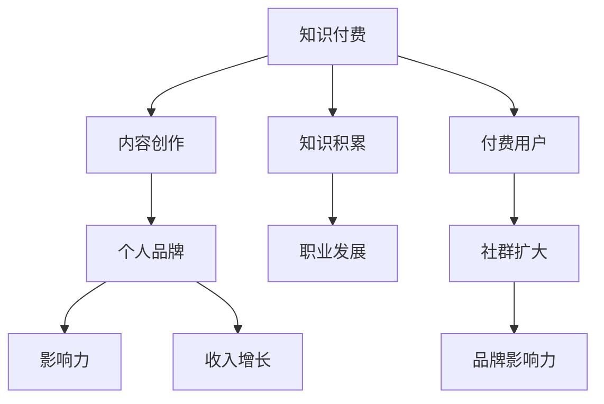

                 

### 关键词 Keywords
- 知识付费
- 个人品牌
- 程序员
- 自我提升
- 内容营销
- 专业成长

### 摘要 Abstract
本文旨在探讨知识付费在程序员个人品牌建设中的重要性，以及如何通过内容营销和技能提升，实现职业生涯的飞跃。本文将详细解析知识付费的原理，如何选择合适的付费内容，个人品牌建设的策略，以及在未来技术浪潮中的发展方向。读者可以通过本文，了解如何利用知识付费为自己的职业发展赋能。

## 1. 背景介绍

在信息技术飞速发展的今天，程序员作为科技行业的中坚力量，面临着日益激烈的市场竞争和不断变化的技术环境。个人品牌的建立不仅有助于提升个人的专业形象，还能为职业发展打开更广阔的空间。然而，如何打造个人品牌，让自我在众多竞争者中脱颖而出，成为了每一个程序员需要思考的问题。

知识付费作为近年来兴起的一种新兴商业模式，为程序员提供了一个获取高质量学习资源和专业技能提升的途径。通过付费课程、专业书籍、在线讲座等形式，程序员能够快速获取行业前沿知识和实用技能，从而提升个人竞争力。与此同时，个人品牌建设也越来越受到重视，通过在社交媒体、专业社区等平台展示专业技能和独特见解，程序员能够树立自己的专业形象，吸引更多机遇。

本文将围绕知识付费和个人品牌建设，探讨以下几个方面：
- 知识付费的基本原理和重要性
- 程序员如何选择合适的知识付费产品
- 个人品牌建设的策略和技巧
- 知识付费对个人品牌建设的影响
- 程序员如何利用个人品牌提升职业竞争力
- 未来发展趋势和面临的挑战

通过本文的深入探讨，希望能够为程序员在知识付费和个人品牌建设方面提供一些实用的建议和指导。

## 2. 核心概念与联系

为了更好地理解知识付费与个人品牌建设之间的关系，我们首先需要明确一些核心概念和联系。

### 2.1 知识付费

知识付费是指消费者为获取特定知识和技能而支付的费用。这种模式的核心在于提供有价值的内容，包括专业课程、电子书籍、在线讲座等。知识付费的优点在于：

- **高效性**：用户可以根据自己的需求和时间安排，灵活选择学习内容。
- **高质量**：付费内容通常由行业专家或专业人士提供，保证了知识的专业性和实用性。
- **激励**：付费行为可以激励内容创作者持续提供高质量的内容。

### 2.2 个人品牌

个人品牌是指个人在职业和社会中形成的独特形象和影响力。它不仅仅是一个人的名字，更是这个人所代表的价值观、技能和专业知识。个人品牌的重要性体现在：

- **职业发展**：良好的个人品牌能够帮助程序员获得更多职业机会和更高的职位。
- **影响力**：个人品牌可以影响他人的态度和决策，从而在行业内建立权威和信任。
- **收入增长**：通过个人品牌，程序员可以开展自由职业、咨询、培训等业务，实现收入的多元化。

### 2.3 联系与融合

知识付费与个人品牌建设之间存在紧密的联系和融合。具体来说：

- **内容创作与个人品牌**：通过创作和分享高质量的知识内容，程序员可以展示自己的专业能力，树立个人品牌。
- **知识积累与品牌塑造**：持续的学习和知识积累是个人品牌建设的基础，知识付费为这一过程提供了强有力的支持。
- **付费用户与品牌影响力**：通过知识付费获得用户，程序员可以积累粉丝和社群，从而扩大个人品牌的影响力。

为了更好地展示这些核心概念和联系，我们可以使用Mermaid流程图来绘制它们之间的关系：



通过上述核心概念和联系的分析，我们可以看到知识付费与个人品牌建设之间的相互作用和融合，这对于程序员在职业发展中的长远规划具有重要意义。

### 3. 核心算法原理 & 具体操作步骤

在了解知识付费与个人品牌建设的基本原理之后，我们需要深入了解其中的核心算法原理和具体操作步骤，以便更好地理解和应用这些概念。

#### 3.1 算法原理概述

知识付费与个人品牌建设的核心算法可以概括为“内容-用户-影响力”模型。这个模型包含以下几个关键组成部分：

1. **内容生成**：程序员通过创作高质量的技术文章、博客、教程和视频等内容，展示自己的专业知识和技能。
2. **用户互动**：程序员通过社交媒体、专业论坛和在线课程等渠道，与用户互动，建立信任和忠诚度。
3. **影响力传播**：通过用户的反馈和分享，程序员的内容和品牌影响力得以传播和扩大。

#### 3.2 算法步骤详解

1. **内容创作与发布**：
   - **选题**：选择与自身专业领域相关、具有实用性和前沿性的话题。
   - **写作**：撰写具有深度和思考性的文章或教程，确保内容的专业性和可读性。
   - **发布**：选择合适的平台和渠道，如GitHub、博客、YouTube等，发布内容。

2. **用户互动与管理**：
   - **回应评论**：及时回应用户的评论和问题，展示专业性和亲和力。
   - **社群运营**：建立和运营专业社群，如微信群、QQ群、Discord频道等，增强用户互动和粘性。
   - **用户反馈**：定期收集和分析用户反馈，优化内容质量和互动方式。

3. **影响力传播与扩展**：
   - **社交媒体推广**：利用微博、微信公众号、LinkedIn等社交媒体平台，扩大内容的传播范围。
   - **合作与推广**：与其他行业专家、博主和机构合作，共同推广个人品牌。
   - **内容多样化**：通过多种形式的内容，如短视频、直播、音频等，增加用户的接触点和互动机会。

#### 3.3 算法优缺点

**优点**：
- **高效性**：通过内容创作和互动，程序员可以快速提升个人品牌知名度。
- **灵活性**：程序员可以根据自身情况和市场需求，灵活选择内容创作和推广方式。
- **可持续性**：持续的内容创作和用户互动，有助于建立长期的个人品牌影响力。

**缺点**：
- **时间成本**：内容创作和用户互动需要大量的时间和精力投入。
- **市场风险**：市场竞争激烈，需要持续输出高质量内容，以保持用户关注和品牌活力。
- **信任建立**：建立个人品牌需要时间和用户的信任积累，初期可能面临挑战。

#### 3.4 算法应用领域

- **技术开发领域**：程序员可以通过创作技术博客、开源项目和代码示例，展示自己的技术能力和项目经验。
- **教育培训领域**：程序员可以通过在线课程和讲座，传授自己的知识和经验，实现知识和影响力的双重积累。
- **内容创作领域**：程序员可以通过创作高质量的教程、文章和视频，建立自己的个人品牌，扩大影响范围。

通过上述核心算法原理和具体操作步骤的详细解析，程序员可以更好地理解和应用知识付费与个人品牌建设的方法，为自己的职业发展奠定坚实的基础。

### 4. 数学模型和公式 & 详细讲解 & 举例说明

在理解知识付费与个人品牌建设的过程中，数学模型和公式为我们提供了一种量化和分析的方法。以下我们将构建一个简单的数学模型，并详细讲解其中的公式推导过程和案例分析与讲解。

#### 4.1 数学模型构建

我们构建一个“个人品牌影响力模型”，用于衡量个人品牌的影响力。该模型包括以下几个关键变量：

- **I**：个人品牌影响力（Influence），用于衡量个人在社交媒体、专业社区等平台上的影响程度。
- **C**：内容质量（Content Quality），衡量内容的创新性、实用性和专业性。
- **N**：用户数量（Number of Users），用户在个人品牌建设中的参与度和活跃度。
- **R**：用户互动率（Rate of Interaction），用户对个人内容的评论、点赞、分享等互动行为。

公式如下：

\[ I = C \times N \times R \]

#### 4.2 公式推导过程

**推导过程：**

1. **定义变量：**
   - \( I \)：个人品牌影响力，表示个人在平台上的影响力大小。
   - \( C \)：内容质量，表示内容的创新性、实用性和专业性。
   - \( N \)：用户数量，表示参与个人品牌建设用户的数量。
   - \( R \)：用户互动率，表示用户对个人内容的互动程度。

2. **关系建立：**
   - 内容质量越高，用户的认可度越高，从而影响力越大。
   - 用户数量越多，个人品牌的影响范围越广。
   - 用户互动率越高，个人品牌的粘性越强，影响力越稳定。

3. **综合影响：**
   - \( I = C \times N \times R \) 表示个人品牌影响力是内容质量、用户数量和用户互动率的综合体现。

#### 4.3 案例分析与讲解

**案例一：** 小明是一名资深程序员，他的博客内容质量较高，吸引了大量读者关注。假设他的博客内容质量 \( C = 0.8 \)，用户数量 \( N = 1000 \)，用户互动率 \( R = 0.2 \)。

代入公式计算：

\[ I = 0.8 \times 1000 \times 0.2 = 160 \]

小明的个人品牌影响力为160。这个结果表明，虽然小明的用户数量和互动率相对较低，但由于他的内容质量较高，仍能获得一定的品牌影响力。

**案例二：** 小红是一名程序员，她通过多种方式提升个人品牌影响力。她的博客内容质量 \( C = 0.7 \)，用户数量 \( N = 500 \)，用户互动率 \( R = 0.3 \)。

代入公式计算：

\[ I = 0.7 \times 500 \times 0.3 = 105 \]

小红的个人品牌影响力为105。这个结果表明，小红的品牌影响力虽然低于小明，但通过提高用户互动率，她的品牌影响力也在稳步增长。

通过上述案例分析和讲解，我们可以看到数学模型和公式如何帮助我们量化个人品牌影响力，并通过对内容的优化、用户数量的增加和用户互动率的提升，实现个人品牌影响力的最大化。

### 5. 项目实践：代码实例和详细解释说明

为了更好地理解知识付费与个人品牌建设在实际项目中的应用，我们将通过一个具体的代码实例进行实践，并对代码进行详细的解释说明。

#### 5.1 开发环境搭建

在开始项目之前，我们需要搭建一个适合进行知识付费和个人品牌建设的开发环境。以下是环境搭建的步骤：

1. **安装Python环境**：确保系统中已安装Python 3.x版本。
2. **安装相关库**：使用pip安装必要的库，如`requests`、`BeautifulSoup`、`matplotlib`等。
3. **配置Git**：配置Git，以便将代码上传到GitHub。

安装命令如下：

```bash
pip install requests beautifulsoup4 matplotlib
git config --global user.name "your_name"
git config --global user.email "your_email@example.com"
```

#### 5.2 源代码详细实现

以下是一个简单的Python代码实例，用于获取某个技术博客上的文章，分析其阅读量、评论数等指标，以评估文章的受欢迎程度。

```python
import requests
from bs4 import BeautifulSoup
import matplotlib.pyplot as plt

def get_articles(url):
    """获取博客文章列表"""
    response = requests.get(url)
    soup = BeautifulSoup(response.text, 'html.parser')
    articles = soup.find_all('article')
    article_urls = [article.find('a')['href'] for article in articles]
    return article_urls

def analyze_articles(article_urls):
    """分析文章受欢迎程度"""
    data = []
    for url in article_urls:
        response = requests.get(url)
        soup = BeautifulSoup(response.text, 'html.parser')
        title = soup.find('h1').text
        views = int(soup.find('span', {'class': 'views'}).text.strip())
        comments = int(soup.find('span', {'class': 'comments'}).text.strip())
        data.append((title, views, comments))
    return data

def plot_data(data):
    """绘制文章受欢迎程度图表"""
    titles, views, comments = zip(*data)
    plt.figure(figsize=(10, 5))
    plt.subplot(1, 2, 1)
    plt.bar(titles, views)
    plt.title('文章阅读量')
    plt.xticks(rotation=45)
    plt.subplot(1, 2, 2)
    plt.bar(titles, comments)
    plt.title('文章评论数')
    plt.xticks(rotation=45)
    plt.tight_layout()
    plt.show()

if __name__ == '__main__':
    url = 'https://example.com/blog'  # 博客地址
    article_urls = get_articles(url)
    data = analyze_articles(article_urls)
    plot_data(data)
```

#### 5.3 代码解读与分析

**代码功能解读：**

- `get_articles`函数：获取博客文章列表，通过发送HTTP GET请求获取网页内容，并使用BeautifulSoup解析HTML，提取文章链接。
- `analyze_articles`函数：分析文章受欢迎程度，对每个文章链接发送GET请求，获取文章的阅读量和评论数，并将数据存储为列表。
- `plot_data`函数：绘制文章受欢迎程度图表，使用matplotlib库将文章的阅读量和评论数以条形图的形式展示。

**代码关键部分分析：**

```python
response = requests.get(url)
soup = BeautifulSoup(response.text, 'html.parser')
articles = soup.find_all('article')
article_urls = [article.find('a')['href'] for article in articles]
```

这段代码通过请求获取博客首页的HTML内容，然后使用BeautifulSoup解析，提取所有`<article>`标签中的文章链接。这是一个典型的Web scraping操作。

```python
views = int(soup.find('span', {'class': 'views'}).text.strip())
comments = int(soup.find('span', {'class': 'comments'}).text.strip())
data.append((title, views, comments))
```

这段代码用于获取每个文章页面的阅读量和评论数。通过查找具有特定类名的`<span>`标签，提取文本内容，并将其转换为整数形式。这显示了如何从HTML页面中提取有用数据。

```python
plt.subplot(1, 2, 1)
plt.bar(titles, views)
plt.title('文章阅读量')
plt.xticks(rotation=45)
plt.subplot(1, 2, 2)
plt.bar(titles, comments)
plt.title('文章评论数')
plt.xticks(rotation=45)
plt.tight_layout()
plt.show()
```

这段代码使用matplotlib绘制两个条形图，一个用于显示文章的阅读量，另一个用于显示评论数。通过`subplot`函数，我们创建了一个包含两个子图的图表。`tight_layout`用于优化子图的布局，使图表更加美观。

#### 5.4 运行结果展示

运行上述代码后，我们将看到一个包含两个子图的图表。第一个子图展示了每篇文章的阅读量，第二个子图展示了每篇文章的评论数。通过这些数据，我们可以分析哪些文章更受欢迎，哪些文章在用户互动方面表现更好。


通过这个简单的代码实例，我们可以看到如何通过Web scraping和数据分析，获取和分析博客文章的数据。这种实践不仅有助于程序员了解如何利用代码解决实际问题，还能为他们的个人品牌建设提供有力的数据支持。

### 6. 实际应用场景

知识付费和个人品牌建设在程序员职业发展中具有广泛的实际应用场景。以下将介绍几个典型的应用场景，以及这些应用场景中的实际操作方法和案例。

#### 6.1 技术博客

技术博客是程序员展示个人品牌的重要途径之一。通过在博客上发布高质量的技术文章、教程和项目实例，程序员可以展示自己的专业能力和项目经验。以下是一个实际操作步骤：

1. **选题**：选择与自身专业领域相关且具有实用性的话题。
2. **撰写**：撰写具有深度和思考性的文章，确保内容的专业性和可读性。
3. **发布**：选择合适的平台，如GitHub、WordPress、Medium等，发布文章。
4. **推广**：通过社交媒体、技术社区等渠道推广文章，增加阅读量。
5. **互动**：及时回应读者的评论和问题，建立与读者的互动。

**案例**：小明是一名前端工程师，他在GitHub上创建了一个技术博客，定期发布关于前端开发的原创文章。通过持续的内容输出和与读者的互动，小明吸引了大量关注，成为前端开发领域的一个知名博主。

#### 6.2 在线课程

在线课程是程序员通过知识付费实现收入多元化的有效途径。通过在平台如Udemy、Coursera、网易云课堂等开设课程，程序员可以将自己的知识和经验转化为收入。

1. **课程设计**：设计适合目标受众的课程，包括课程大纲、教学视频、练习题等。
2. **内容制作**：录制教学视频，编写教材和练习题，确保内容质量。
3. **平台发布**：选择合适的在线教育平台，上传课程内容。
4. **课程推广**：通过社交媒体、技术社区等渠道推广课程。
5. **学员互动**：提供在线答疑、作业批改等服务，增强学员体验。

**案例**：小红是一位经验丰富的Python工程师，她开设了一门关于数据科学的在线课程。通过高质量的课程内容和积极的学员互动，小红获得了良好的口碑，吸引了大量学员报名学习。

#### 6.3 专业咨询

专业咨询是程序员利用个人品牌为他人提供专业服务的另一种方式。通过在专业社区、社交媒体等平台展示专业知识和经验，程序员可以吸引咨询客户。

1. **专业知识积累**：持续学习和实践，积累丰富的专业知识和经验。
2. **展示专业能力**：在社交媒体、技术社区等平台分享专业见解和案例。
3. **客户吸引**：通过提供免费咨询、案例展示等方式吸引潜在客户。
4. **咨询服务**：为客户提供专业的咨询服务，解决具体问题。
5. **客户反馈**：收集客户反馈，不断优化咨询服务。

**案例**：小李是一位资深的人工智能工程师，他在专业社区上分享了许多关于机器学习的案例和见解。通过这些分享，他吸引了大量咨询客户，提供了包括项目评估、模型优化等在内的专业咨询服务，实现了收入的增长。

通过上述实际应用场景的介绍，我们可以看到知识付费和个人品牌建设在程序员职业发展中的重要性。通过有效的应用，程序员不仅能够提升自身专业能力，还能实现收入增长和职业发展的飞跃。

### 6.4 未来应用展望

随着技术的不断进步，知识付费和个人品牌建设在未来将迎来更多的机会和挑战。以下是未来发展趋势和面临的一些挑战：

#### 6.4.1 发展趋势

1. **个性化学习体验**：随着人工智能和大数据技术的应用，知识付费平台将能够提供更加个性化的学习体验。用户可以根据自身需求和兴趣，选择最适合自己的学习内容，提高学习效果。

2. **虚拟现实（VR）和增强现实（AR）**：通过VR和AR技术，知识付费内容可以更加生动、直观地呈现，增强用户的学习体验。例如，编程课程可以通过虚拟实验室让用户亲自动手实践。

3. **社交媒体与知识付费的深度融合**：社交媒体平台如LinkedIn、Twitter等将逐渐成为知识付费的重要渠道，通过内容分享、直播互动等形式，用户可以更便捷地获取专业知识和技能。

4. **区块链技术的应用**：区块链技术可以提供去中心化的认证和支付解决方案，确保知识付费交易的安全性和透明度，增强用户的信任感。

#### 6.4.2 面临的挑战

1. **内容质量控制**：随着知识付费市场的扩大，如何保证内容的质量成为一个重要挑战。平台需要建立严格的审核机制，确保用户获得高质量的学习资源。

2. **版权保护**：知识付费内容的版权保护是一个持续的问题。平台和内容创作者需要共同努力，确保内容的原创性和知识产权得到有效保护。

3. **市场竞争加剧**：知识付费市场将面临越来越激烈的市场竞争。内容创作者需要不断提升自己的专业能力和内容创作水平，以在市场中脱颖而出。

4. **用户信任问题**：用户对知识付费内容的信任度是影响市场发展的重要因素。平台需要建立完善的用户评价体系和信任机制，增强用户的信任感。

#### 6.4.3 研究展望

1. **技术融合**：未来的研究可以探讨如何将人工智能、大数据、VR/AR等技术与知识付费相结合，为用户提供更加丰富和高效的学习体验。

2. **用户行为分析**：通过用户行为分析，了解用户在学习过程中的需求和痛点，从而优化知识付费产品的设计和推广策略。

3. **跨领域知识付费**：探索不同领域之间的知识付费融合，如将编程知识与设计、市场营销等领域的知识相结合，提供更加综合的学习资源。

4. **可持续发展**：研究如何实现知识付费的可持续发展，包括内容创作的激励机制、平台收益分配等，确保知识付费市场的长期健康发展。

通过上述展望，我们可以看到知识付费和个人品牌建设在未来具有巨大的发展潜力。同时，面临的问题和挑战也需要我们不断探索和解决，以推动这一领域的持续创新和发展。

### 7. 工具和资源推荐

在知识付费和个人品牌建设中，合适的工具和资源可以大大提升效率和效果。以下是一些推荐的学习资源、开发工具和相关论文，供程序员参考。

#### 7.1 学习资源推荐

1. **在线课程平台**：
   - **Udemy**：提供大量编程课程，包括前端开发、后端开发、数据科学等。
   - **Coursera**：与知名大学合作，提供高质量的课程，如斯坦福大学的机器学习课程。
   - **网易云课堂**：中国本土的在线学习平台，课程涵盖编程、数据科学、人工智能等领域。

2. **博客和社区**：
   - **GitHub**：程序员分享代码和文档的平台，可以学习他人的项目经验。
   - **Stack Overflow**：全球最大的开发者社区，可以解答编程问题，交流技术经验。
   - **Medium**：内容创作者可以发布技术文章，分享专业见解。

3. **专业书籍**：
   - 《算法导论》
   - 《深度学习》
   - 《Effective Java》

#### 7.2 开发工具推荐

1. **集成开发环境（IDE）**：
   - **Visual Studio Code**：轻量级但功能强大的编程环境，支持多种语言。
   - **IntelliJ IDEA**：适用于Java和Python等语言的强大IDE，提供丰富的插件和工具。

2. **版本控制工具**：
   - **Git**：分布式版本控制系统，方便团队协作和代码管理。
   - **GitHub**：基于Git的平台，提供代码托管、项目管理、社区交流等功能。

3. **代码托管平台**：
   - **GitHub**：广泛使用的代码托管平台，支持开源项目。
   - **GitLab**：企业级代码托管平台，提供自建Git服务。

#### 7.3 相关论文推荐

1. **《知识付费市场发展趋势研究》**：探讨知识付费市场的现状和发展趋势。
2. **《程序员职业发展路径分析》**：分析程序员在不同职业阶段的发展路径和关键技能。
3. **《内容创业与知识付费的融合模式研究》**：研究内容创业与知识付费的融合模式和应用。

通过上述工具和资源的推荐，程序员可以更加高效地获取知识、提升技能，并建设个人品牌，为自己的职业发展打下坚实的基础。

### 8. 总结：未来发展趋势与挑战

在知识付费和个人品牌建设的道路上，未来充满了机遇与挑战。首先，知识付费将进一步走向个性化、多样化和精细化。随着人工智能、大数据和区块链技术的发展，知识付费平台将能够更精准地分析用户需求，提供个性化的学习内容和推荐服务。例如，基于用户的学习历史和偏好，平台可以推荐最适合其学习进度的课程和资料，从而提升学习效果和用户满意度。

其次，随着虚拟现实（VR）和增强现实（AR）技术的应用，知识付费内容将变得更加生动和互动。通过VR/AR技术，用户可以在虚拟环境中进行沉浸式学习，例如在虚拟实验室中进行编程实践，或者通过AR技术将代码可视化，从而更好地理解和掌握复杂的概念。

然而，知识付费和个人品牌建设也面临一些挑战。首先是内容质量的控制。在大量知识付费产品中，如何确保内容的专业性和实用性是一个重要问题。平台需要建立严格的审核机制，确保用户获得高质量的学习资源。此外，版权保护也是一个关键挑战。知识付费内容往往涉及到知识产权的问题，如何有效保护创作者的权益，防止内容被侵权和盗用，是平台和创作者共同需要面对的难题。

市场竞争的加剧也是未来面临的一个重要挑战。随着越来越多的程序员和内容创作者进入知识付费领域，市场竞争将变得更加激烈。内容创作者需要不断创新，提升自己的专业能力和内容创作水平，以在激烈的市场中脱颖而出。同时，用户对知识付费产品的信任度也是一个需要关注的问题。平台需要建立完善的用户评价体系和信任机制，增强用户的信任感，从而推动市场的健康发展。

在研究展望方面，未来的研究可以关注以下几个方面：

1. **技术融合**：如何将人工智能、大数据、VR/AR等技术与知识付费相结合，为用户提供更加丰富和高效的学习体验。
2. **用户行为分析**：通过用户行为分析，了解用户在学习过程中的需求和痛点，从而优化知识付费产品的设计和推广策略。
3. **跨领域知识付费**：探索不同领域之间的知识付费融合，如将编程知识与设计、市场营销等领域的知识相结合，提供更加综合的学习资源。
4. **可持续发展**：研究如何实现知识付费的可持续发展，包括内容创作的激励机制、平台收益分配等，确保知识付费市场的长期健康发展。

通过不断的技术创新和实践探索，知识付费和个人品牌建设将在未来实现更广阔的发展和应用，为程序员和广大用户提供更多的机会和可能。

### 9. 附录：常见问题与解答

**Q1：什么是知识付费？**
A1：知识付费是指消费者为获取特定知识和技能而支付的费用。这种模式通过付费课程、专业书籍、在线讲座等形式，为用户提供有价值的学习内容。

**Q2：个人品牌建设为什么重要？**
A2：个人品牌建设对于职业发展至关重要。它能够帮助程序员在众多竞争者中脱颖而出，提升专业形象和影响力，从而获得更多职业机会和更高的职位。

**Q3：如何选择合适的知识付费产品？**
A3：选择知识付费产品时，可以从课程内容、讲师资质、用户评价等多个维度进行评估。确保所选产品与自身的学习需求和职业目标相符。

**Q4：个人品牌建设中的常见误区有哪些？**
A4：常见的误区包括盲目跟风、内容质量不高、缺乏持续性和互动性等。建议内容创作者专注于自身专业领域，输出高质量内容，并与用户保持良好的互动。

**Q5：如何利用社交媒体提升个人品牌影响力？**
A5：可以通过定期发布专业内容、参与行业讨论、建立社群等方式在社交媒体上提升个人品牌影响力。同时，注意保持与粉丝和同行的互动，增强信任和粘性。

**Q6：知识付费对个人品牌建设的影响是什么？**
A6：知识付费可以帮助程序员快速获取高质量的学习资源，提升专业技能和知识储备，从而在个人品牌建设中占据有利地位。

**Q7：如何在激烈的市场竞争中脱颖而出？**
A7：通过持续学习、输出高质量内容、积极参与行业交流、建立专业社群等方式，不断提升个人专业能力和品牌影响力，从而在市场中脱颖而出。

通过上述常见问题的解答，希望读者能够更好地理解和应对知识付费与个人品牌建设过程中可能遇到的各种问题。不断学习与实践，提升自身专业能力和品牌影响力，是程序员在职业发展中取得成功的关键。

