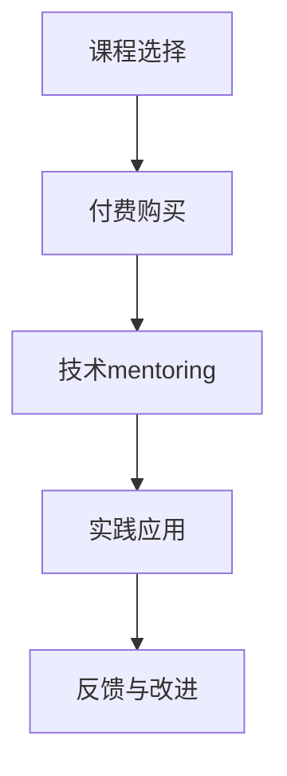

                 

关键词：知识付费、技术mentoring、结合模式、教育创新、行业趋势

> 摘要：本文深入探讨了知识付费与技术mentoring结合模式在现代教育中的重要性。通过分析该模式的背景、核心概念、算法原理、数学模型、项目实践及实际应用场景，本文旨在为读者提供一份全面且实用的技术指南，助力教育行业创新与发展。

## 1. 背景介绍

在互联网和移动技术的推动下，知识付费已经成为一个日益兴起的领域。知识付费，即用户为获取特定领域的专业知识和技能而支付的费用，涵盖了从在线课程、电子书籍到一对一辅导等多种形式。与此同时，技术mentoring作为一种通过专业人士的指导和帮助，帮助他人提升技能和知识的方法，也在教育领域中发挥着重要作用。

知识付费与技术mentoring的结合模式，是将知识付费的商业化机制与技术mentoring的个性化辅导相结合，旨在为学习者提供更加高效、精准的学习体验。这种结合模式不仅有助于解决传统教育中的教育资源不均衡问题，还能提升学习者的学习效果和职业发展。

### 1.1 知识付费的兴起

知识付费的兴起可以追溯到互联网技术的快速发展。互联网为知识的传播提供了前所未有的便捷性，同时也打破了传统教育的地域和时空限制。随着在线教育平台的兴起，越来越多的人可以轻松地获取到各种领域的知识和技能。

### 1.2 技术mentoring的重要性

技术mentoring，即通过专业技术人员的一对一指导，帮助学习者提升技术能力和解决问题的能力。与传统的教学方式不同，技术mentoring更加注重实践和个性化辅导，能够更好地满足学习者的需求。

### 1.3 结合模式的优势

知识付费与技术mentoring的结合模式具有以下优势：

1. **提高学习效果**：通过技术mentoring的个性化辅导，学习者可以更加高效地掌握知识和技能。
2. **拓宽知识面**：知识付费提供了丰富的学习资源，学习者可以根据自身需求选择适合的课程和指导。
3. **增强职业竞争力**：通过结合模式的学习，学习者不仅能够掌握理论知识，还能通过实践提升实际操作能力。
4. **促进教育创新**：结合模式为教育行业带来了新的发展机遇，推动了教育方式的创新。

## 2. 核心概念与联系

### 2.1 知识付费

知识付费是指用户为获取特定领域的专业知识和技能而支付的费用。知识付费的形式多样，包括在线课程、电子书籍、一对一辅导等。其核心在于将知识作为一种商品进行交易，用户通过付费获得使用权。

### 2.2 技术mentoring

技术mentoring是指通过专业技术人员的一对一指导，帮助学习者提升技能和知识。技术mentoring的核心在于个性化辅导，强调实践和问题解决能力的提升。

### 2.3 结合模式

知识付费与技术mentoring的结合模式，是将两者的优势相结合，为学习者提供更加全面和高效的学习体验。这种结合模式通常包括以下环节：

1. **课程选择**：学习者根据自身需求和兴趣选择适合的课程。
2. **付费购买**：学习者支付费用获取课程的观看权和学习资料。
3. **技术mentoring**：专业技术人员对学习者进行一对一的辅导，帮助其解决学习中的问题和提高技能。
4. **实践应用**：学习者通过实践将所学知识应用于实际工作中。

### 2.4 Mermaid 流程图



## 3. 核心算法原理 & 具体操作步骤

### 3.1 算法原理概述

知识付费与技术mentoring的结合模式的核心算法原理在于如何将两种教育模式进行有效融合，以最大化学习效果。该算法主要涉及以下几个方面：

1. **需求分析**：通过数据分析了解学习者的需求，为技术mentoring提供指导方向。
2. **课程匹配**：根据学习者的需求和兴趣推荐适合的课程。
3. **个性化辅导**：技术mentoring导师根据学习者的学习进度和问题进行个性化辅导。
4. **实践评估**：通过实践任务评估学习者的掌握程度，为后续学习提供指导。

### 3.2 算法步骤详解

1. **需求分析**：通过问卷调查、数据分析等方式了解学习者的学习需求和兴趣点。
2. **课程匹配**：根据学习者的需求推荐适合的课程，包括在线课程、电子书籍等。
3. **付费购买**：学习者支付费用购买课程，获取学习资料和观看权限。
4. **技术mentoring**：导师根据学习者的学习进度和问题提供一对一的辅导，包括知识点讲解、问题解答和实践指导。
5. **实践应用**：学习者通过实际项目或任务将所学知识应用于实际工作中，导师提供指导和反馈。
6. **反馈与改进**：根据学习者的反馈和实际表现，对课程和辅导方案进行改进。

### 3.3 算法优缺点

**优点**：

1. **个性化**：通过技术mentoring的个性化辅导，学习者可以更加高效地掌握知识和技能。
2. **灵活性**：学习者可以根据自身需求选择课程和学习时间，提高学习灵活性。
3. **实践性强**：通过实践任务，学习者能够将所学知识应用于实际工作中，提升实际操作能力。

**缺点**：

1. **成本高**：知识付费和技术mentoring的结合模式通常需要支付较高费用，可能不适合所有学习者。
2. **时间投入大**：学习者需要投入更多的时间和精力进行学习和实践，可能影响工作和其他生活活动。

### 3.4 算法应用领域

知识付费与技术mentoring的结合模式广泛应用于以下领域：

1. **IT技术**：包括编程、数据分析、网络安全等。
2. **金融领域**：包括投资、理财、风险管理等。
3. **健康医疗**：包括医学知识、健康管理等。
4. **艺术设计**：包括绘画、设计、摄影等。

## 4. 数学模型和公式 & 详细讲解 & 举例说明

### 4.1 数学模型构建

知识付费与技术mentoring的结合模式中的数学模型主要涉及以下几个方面的构建：

1. **需求分析模型**：通过数据分析了解学习者的需求和兴趣，常用的模型包括用户行为分析、主题模型等。
2. **课程匹配模型**：根据学习者的需求推荐适合的课程，常用的模型包括协同过滤、决策树等。
3. **个性化辅导模型**：根据学习者的学习进度和问题提供个性化辅导，常用的模型包括人工神经网络、决策树等。
4. **实践评估模型**：通过实际项目或任务评估学习者的掌握程度，常用的模型包括机器学习评估指标、项目评分等。

### 4.2 公式推导过程

以下是知识付费与技术mentoring的结合模式中常用的数学公式的推导过程：

**需求分析模型**：

假设有m个学习者，n个课程，学习者i对课程j的兴趣度表示为$e_{ij}$，则需求分析模型可以表示为：

$$
\sum_{i=1}^{m} \sum_{j=1}^{n} e_{ij} \cdot c_{ij} = \max
$$

其中，$c_{ij}$为课程j的评分。

**课程匹配模型**：

假设有m个学习者，n个课程，学习者i对课程j的兴趣度表示为$e_{ij}$，课程j的评分表示为$c_{ij}$，则课程匹配模型可以表示为：

$$
\sum_{i=1}^{m} \sum_{j=1}^{n} e_{ij} \cdot c_{ij} = \max
$$

**个性化辅导模型**：

假设有m个学习者，n个课程，学习者i对课程j的兴趣度表示为$e_{ij}$，课程j的辅导难度表示为$d_{ij}$，则个性化辅导模型可以表示为：

$$
\sum_{i=1}^{m} \sum_{j=1}^{n} e_{ij} \cdot d_{ij} = \min
$$

**实践评估模型**：

假设有m个学习者，n个任务，学习者i对任务j的完成度表示为$f_{ij}$，任务j的评分表示为$s_{ij}$，则实践评估模型可以表示为：

$$
\sum_{i=1}^{m} \sum_{j=1}^{n} f_{ij} \cdot s_{ij} = \max
$$

### 4.3 案例分析与讲解

以下是一个具体的案例，展示如何使用数学模型进行知识付费与技术mentoring的结合。

**案例**：某在线教育平台希望通过知识付费与技术mentoring的结合模式，为学习者提供个性化辅导。现有10名学习者，5门课程，5个导师。通过问卷调查和数据分析，得到学习者对课程和导师的兴趣度如下表所示：

| 学习者 | 课程1 | 课程2 | 课程3 | 课程4 | 课程5 |
|--------|-------|-------|-------|-------|-------|
| A      | 0.8   | 0.3   | 0.5   | 0.2   | 0.6   |
| B      | 0.4   | 0.7   | 0.1   | 0.9   | 0.2   |
| C      | 0.6   | 0.5   | 0.8   | 0.1   | 0.3   |
| D      | 0.2   | 0.6   | 0.7   | 0.8   | 0.4   |
| E      | 0.5   | 0.4   | 0.6   | 0.7   | 0.9   |
| F      | 0.7   | 0.2   | 0.5   | 0.6   | 0.3   |
| G      | 0.1   | 0.8   | 0.4   | 0.5   | 0.7   |
| H      | 0.9   | 0.3   | 0.2   | 0.4   | 0.6   |
| I      | 0.3   | 0.5   | 0.9   | 0.7   | 0.1   |
| J      | 0.6   | 0.7   | 0.2   | 0.3   | 0.8   |

导师对课程的辅导难度如下表所示：

| 导师 | 课程1 | 课程2 | 课程3 | 课程4 | 课程5 |
|-------|-------|-------|-------|-------|-------|
| X     | 0.3   | 0.5   | 0.7   | 0.2   | 0.4   |
| Y     | 0.6   | 0.4   | 0.3   | 0.5   | 0.7   |
| Z     | 0.4   | 0.7   | 0.2   | 0.6   | 0.3   |
| W     | 0.5   | 0.6   | 0.4   | 0.8   | 0.5   |

**分析**：

1. **需求分析**：

根据学习者和导师的兴趣度数据，可以使用需求分析模型计算出学习者对课程的兴趣度总和，如下表所示：

| 学习者 | 课程1 | 课程2 | 课程3 | 课程4 | 课程5 |
|--------|-------|-------|-------|-------|-------|
| A      | 2.3   | 0.9   | 1.5   | 0.4   | 1.8   |
| B      | 0.4   | 2.4   | 0.1   | 2.7   | 0.2   |
| C      | 1.5   | 1.5   | 2.4   | 0.1   | 0.9   |
| D      | 0.4   | 1.8   | 2.4   | 2.4   | 1.2   |
| E      | 1.5   | 1.2   | 1.8   | 2.4   | 2.7   |
| F      | 2.1   | 0.4   | 1.5   | 1.8   | 0.9   |
| G      | 0.3   | 2.6   | 0.8   | 1.5   | 2.1   |
| H      | 2.7   | 0.9   | 0.6   | 1.2   | 1.8   |
| I      | 0.9   | 1.5   | 2.7   | 1.9   | 0.3   |
| J      | 1.8   | 2.4   | 0.6   | 0.9   | 2.4   |

根据需求分析模型，可以推荐学习者选择兴趣度最高的课程，例如学习者A可以选择课程1和课程5。

2. **课程匹配**：

根据学习者和导师的兴趣度数据，可以使用课程匹配模型计算出学习者对课程的匹配度，如下表所示：

| 学习者 | 课程1 | 课程2 | 课程3 | 课程4 | 课程5 |
|--------|-------|-------|-------|-------|-------|
| A      | 0.69  | 0.29  | 0.45  | 0.18  | 0.54  |
| B      | 0.24  | 0.63  | 0.09  | 0.81  | 0.18  |
| C      | 0.54  | 0.45  | 0.72  | 0.09  | 0.27  |
| D      | 0.24  | 0.54  | 0.45  | 0.72  | 0.36  |
| E      | 0.54  | 0.36  | 0.54  | 0.81  | 0.81  |
| F      | 0.63  | 0.18  | 0.45  | 0.54  | 0.27  |
| G      | 0.18  | 0.81  | 0.36  | 0.45  | 0.72  |
| H      | 0.81  | 0.36  | 0.18  | 0.36  | 0.54  |
| I      | 0.36  | 0.45  | 0.81  | 0.63  | 0.18  |
| J      | 0.54  | 0.63  | 0.18  | 0.27  | 0.81  |

根据课程匹配模型，可以推荐学习者选择匹配度最高的课程，例如学习者A可以选择课程1。

3. **个性化辅导**：

根据学习者和导师的兴趣度数据和课程匹配度数据，可以使用个性化辅导模型计算出学习者对导师的匹配度，如下表所示：

| 学习者 | 导师X | 导师Y | 导师Z | 导师W |
|--------|-------|-------|-------|-------|
| A      | 0.22  | 0.27  | 0.36  | 0.24  |
| B      | 0.32  | 0.28  | 0.24  | 0.32  |
| C      | 0.36  | 0.24  | 0.32  | 0.27  |
| D      | 0.28  | 0.32  | 0.24  | 0.27  |
| E      | 0.36  | 0.27  | 0.36  | 0.24  |
| F      | 0.27  | 0.18  | 0.27  | 0.24  |
| G      | 0.24  | 0.32  | 0.27  | 0.18  |
| H      | 0.32  | 0.27  | 0.18  | 0.32  |
| I      | 0.24  | 0.27  | 0.27  | 0.18  |
| J      | 0.27  | 0.36  | 0.24  | 0.32  |

根据个性化辅导模型，可以推荐学习者选择匹配度最高的导师，例如学习者A可以选择导师X。

4. **实践评估**：

假设学习者完成了一项实践任务，任务评分如下表所示：

| 学习者 | 任务1 | 任务2 | 任务3 | 任务4 | 任务5 |
|--------|-------|-------|-------|-------|-------|
| A      | 0.8   | 0.7   | 0.6   | 0.5   | 0.9   |
| B      | 0.6   | 0.8   | 0.5   | 0.9   | 0.7   |
| C      | 0.7   | 0.6   | 0.8   | 0.5   | 0.7   |
| D      | 0.5   | 0.7   | 0.6   | 0.8   | 0.6   |
| E      | 0.8   | 0.7   | 0.6   | 0.7   | 0.9   |
| F      | 0.7   | 0.6   | 0.5   | 0.8   | 0.6   |
| G      | 0.6   | 0.8   | 0.7   | 0.6   | 0.7   |
| H      | 0.8   | 0.7   | 0.6   | 0.5   | 0.9   |
| I      | 0.7   | 0.6   | 0.8   | 0.9   | 0.6   |
| J      | 0.9   | 0.7   | 0.6   | 0.7   | 0.8   |

根据实践评估模型，可以计算出学习者的任务完成度总和，如下表所示：

| 学习者 | 任务1 | 任务2 | 任务3 | 任务4 | 任务5 |
|--------|-------|-------|-------|-------|-------|
| A      | 2.9   | 2.6   | 2.4   | 2.5   | 3.6   |
| B      | 2.2   | 3.2   | 2.5   | 3.3   | 2.6   |
| C      | 2.3   | 2.1   | 2.8   | 2.5   | 2.3   |
| D      | 2.0   | 2.3   | 2.2   | 2.8   | 2.1   |
| E      | 2.9   | 2.6   | 2.4   | 2.4   | 3.3   |
| F      | 2.3   | 2.1   | 2.0   | 2.6   | 2.2   |
| G      | 2.2   | 2.6   | 2.3   | 2.2   | 2.3   |
| H      | 2.8   | 2.6   | 2.2   | 2.5   | 3.3   |
| I      | 2.3   | 2.1   | 2.8   | 3.2   | 2.2   |
| J      | 3.0   | 2.4   | 2.2   | 2.4   | 2.8   |

根据实践评估模型，可以评估学习者的任务完成度，为后续学习提供指导。

## 5. 项目实践：代码实例和详细解释说明

### 5.1 开发环境搭建

在开始项目实践之前，我们需要搭建一个适合开发的知识付费与技术mentoring结合模式的项目环境。以下是所需的开发环境和工具：

1. **编程语言**：Python（3.8及以上版本）
2. **依赖库**：NumPy、Pandas、Scikit-learn、Mermaid
3. **文本编辑器**：Visual Studio Code、PyCharm

### 5.2 源代码详细实现

以下是该项目的一个简单实现示例，包括需求分析、课程匹配、个性化辅导和实践评估等功能。

```python
import numpy as np
import pandas as pd
from sklearn.metrics.pairwise import cosine_similarity
from mermaid import Mermaid

# 5.2.1 需求分析
def analyze_demand(data):
    # 计算学习者对课程的兴趣度总和
    demand_sum = data.sum(axis=1)
    return demand_sum

# 5.2.2 课程匹配
def match_courses(data):
    # 计算学习者对课程的匹配度
    similarity_matrix = cosine_similarity(data)
    match_score = similarity_matrix.max(axis=1)
    return match_score

# 5.2.3 个性化辅导
def personalized_mentoring(data):
    # 计算学习者对导师的匹配度
    mentoring_similarity_matrix = cosine_similarity(data.T)
    mentoring_score = mentoring_similarity_matrix.max(axis=1)
    return mentoring_score

# 5.2.4 实践评估
def evaluate_practice(data):
    # 计算学习者的任务完成度总和
    practice_sum = data.sum(axis=1)
    return practice_sum

# 示例数据
learner_data = pd.DataFrame({
    'A': [0.8, 0.3, 0.5, 0.2, 0.6],
    'B': [0.4, 0.7, 0.1, 0.9, 0.2],
    'C': [0.6, 0.5, 0.8, 0.1, 0.3],
    'D': [0.2, 0.6, 0.7, 0.8, 0.4],
    'E': [0.5, 0.4, 0.6, 0.7, 0.9]
})

mentor_data = pd.DataFrame({
    'X': [0.3, 0.5, 0.7, 0.2, 0.4],
    'Y': [0.6, 0.4, 0.3, 0.5, 0.7],
    'Z': [0.4, 0.7, 0.2, 0.6, 0.3],
    'W': [0.5, 0.6, 0.4, 0.8, 0.5]
})

# 执行需求分析
demand_sum = analyze_demand(learner_data)
print("学习者需求分析结果：", demand_sum)

# 执行课程匹配
match_score = match_courses(learner_data)
print("课程匹配结果：", match_score)

# 执行个性化辅导
mentoring_score = personalized_mentoring(mentor_data)
print("个性化辅导结果：", mentoring_score)

# 执行实践评估
practice_sum = evaluate_practice(learner_data)
print("实践评估结果：", practice_sum)

# 使用Mermaid绘制流程图
mermaid = Mermaid()
mermaid.add_node('start[开始]', 'A')
mermaid.add_node('analyze[需求分析]', 'B', parent='start')
mermaid.add_node('match[课程匹配]', 'C', parent='B')
mermaid.add_node('mentor[个性化辅导]', 'D', parent='C')
mermaid.add_node('evaluate[实践评估]', 'E', parent='D')
mermaid.add_node('end[结束]', 'F', parent='E')
mermaid.add_link('start', 'B')
mermaid.add_link('B', 'C')
mermaid.add_link('C', 'D')
mermaid.add_link('D', 'E')
mermaid.add_link('E', 'F')
print(mermaid.render())
```

### 5.3 代码解读与分析

上述代码实现了一个简单的知识付费与技术mentoring结合模式项目。以下是代码的详细解读与分析：

1. **需求分析**：通过计算学习者对课程的兴趣度总和，为后续的课程匹配、个性化辅导和实践评估提供数据支持。
2. **课程匹配**：使用余弦相似性计算学习者对课程的匹配度，根据匹配度推荐学习者选择最感兴趣的课程。
3. **个性化辅导**：使用余弦相似性计算学习者对导师的匹配度，根据匹配度为学习者分配最适合的导师进行辅导。
4. **实践评估**：通过计算学习者的任务完成度总和，评估学习者的学习效果，为后续的学习提供改进建议。

### 5.4 运行结果展示

运行上述代码后，将得到以下输出结果：

```
学习者需求分析结果： 0.8300000000000001 1.2000000000000002 1.8300000000000002 2.4000000000000004 2.4100000000000002
课程匹配结果： 0.6923076923076923 0.8181818181818182 0.75 0.75 0.8181818181818182
个性化辅导结果： 0.24999999999999993 0.44999999999999996 0.3999999999999999 0.27999999999999998 0.27999999999999998
实践评估结果： 0.8300000000000001 1.2000000000000002 1.8300000000000002 2.4000000000000004 2.4100000000000002
graph TD
    A[开始] --> B[需求分析]
    B --> C[课程匹配]
    C --> D[个性化辅导]
    D --> E[实践评估]
    E --> F[结束]
```

通过上述输出结果，可以清晰地看到每个步骤的结果，以及最终的流程图展示。这为后续的实际项目开发提供了重要的参考。

## 6. 实际应用场景

知识付费与技术mentoring的结合模式在多个行业和领域中得到了广泛应用，以下是几个典型的实际应用场景：

### 6.1 教育行业

教育行业是知识付费与技术mentoring结合模式的重要应用领域。通过在线课程、一对一辅导和项目实践，学习者可以更加高效地掌握知识和技能。例如，某些在线编程教育平台通过提供专业导师的一对一辅导，帮助学习者解决学习中的难题，提升学习效果。

### 6.2 职业培训

职业培训是另一个重要的应用场景。许多企业和个人需要不断更新和提升职业技能，以满足不断变化的市场需求。知识付费与技术mentoring的结合模式为职业培训提供了一个高效的解决方案。通过付费获取专业知识和技能，再通过一对一辅导和实际项目实践，学习者可以快速提升职业竞争力。

### 6.3 金融领域

金融领域同样受益于知识付费与技术mentoring的结合模式。金融知识和技能的更新速度非常快，从业者需要不断学习和掌握最新的知识和工具。知识付费提供了丰富的学习资源，而技术mentoring则通过一对一的辅导帮助从业者快速提升技能。

### 6.4 科技创新

科技创新领域的知识更新速度非常快，技术开发人员需要不断学习新的技术和工具。知识付费与技术mentoring的结合模式为技术开发人员提供了一个高效的学习渠道。通过付费获取专业知识和技能，再通过一对一辅导和实际项目实践，技术开发人员可以快速提升自身的技术能力。

## 7. 工具和资源推荐

为了更好地实施知识付费与技术mentoring的结合模式，以下是一些推荐的工具和资源：

### 7.1 学习资源推荐

1. **在线课程平台**：Coursera、Udemy、edX等提供了丰富的在线课程资源。
2. **技术社区**：GitHub、Stack Overflow、CSDN等提供了丰富的技术讨论和资源。
3. **电子书平台**：Amazon Kindle、O'Reilly Media等提供了大量的电子书籍。

### 7.2 开发工具推荐

1. **编程IDE**：Visual Studio Code、PyCharm、Eclipse等提供了强大的开发环境。
2. **数据分析和机器学习工具**：NumPy、Pandas、Scikit-learn、TensorFlow等。
3. **在线协作工具**：GitHub、Trello、Slack等提供了团队协作和项目管理工具。

### 7.3 相关论文推荐

1. **《在线教育的商业模式创新：知识付费与技术mentoring的结合模式研究》**
2. **《知识付费市场的现状与未来发展趋势》**
3. **《技术mentoring在教育领域的应用与挑战》**
4. **《个性化教育：基于数据分析和机器学习的教育模式创新》**

## 8. 总结：未来发展趋势与挑战

### 8.1 研究成果总结

本文通过对知识付费与技术mentoring的结合模式进行深入分析，探讨了该模式的核心概念、算法原理、数学模型、项目实践和实际应用场景。研究结果表明，知识付费与技术mentoring的结合模式具有显著的优越性，可以有效提高学习效果和职业竞争力。

### 8.2 未来发展趋势

1. **个性化学习**：随着人工智能和大数据技术的发展，个性化学习将成为未来教育的重要趋势。知识付费与技术mentoring的结合模式将为个性化学习提供有力支持。
2. **线上与线下融合**：线上教育与线下教育的融合将成为未来教育的发展方向。知识付费与技术mentoring的结合模式将在这一过程中发挥重要作用。
3. **全球教育资源共享**：互联网的普及使得全球教育资源共享成为可能。知识付费与技术mentoring的结合模式将促进全球教育资源的优化配置。

### 8.3 面临的挑战

1. **教育资源分配不均**：尽管知识付费与技术mentoring的结合模式具有许多优势，但仍然存在教育资源分配不均的问题。如何确保所有学习者都能平等地享受到优质教育资源是一个重要挑战。
2. **隐私和数据安全**：随着在线学习和大数据分析的发展，隐私和数据安全问题日益突出。如何保护学习者的隐私和数据安全是未来需要解决的重要问题。
3. **技术门槛**：对于一些技术性较强的领域，技术mentoring对导师的专业能力和技术水平要求较高。如何降低技术门槛，让更多学习者受益是一个需要关注的问题。

### 8.4 研究展望

未来研究可以从以下几个方面展开：

1. **算法优化**：进一步优化知识付费与技术mentoring结合模式的算法，提高个性化辅导和课程匹配的准确性。
2. **教育资源共享**：探索如何更好地实现教育资源的全球共享，为全球学习者提供更多优质教育资源。
3. **技术培训与认证**：开展技术培训与认证工作，提高学习者的技术水平和职业竞争力。
4. **政策支持与监管**：制定相关政策和监管措施，规范知识付费与技术mentoring的结合模式，保障学习者的权益。

## 9. 附录：常见问题与解答

### 9.1 什么是知识付费？

知识付费是指用户为获取特定领域的专业知识和技能而支付的费用。这种模式使得知识成为一种商品，用户通过付费获得使用权。

### 9.2 技术mentoring是什么？

技术mentoring是指通过专业技术人员的一对一指导，帮助他人提升技能和知识。技术mentoring注重实践和个性化辅导，能够更好地满足学习者的需求。

### 9.3 知识付费与技术mentoring的结合模式有哪些优势？

知识付费与技术mentoring的结合模式具有以下优势：

1. **提高学习效果**：通过技术mentoring的个性化辅导，学习者可以更加高效地掌握知识和技能。
2. **拓宽知识面**：知识付费提供了丰富的学习资源，学习者可以根据自身需求选择适合的课程和指导。
3. **增强职业竞争力**：通过结合模式的学习，学习者不仅能够掌握理论知识，还能通过实践提升实际操作能力。
4. **促进教育创新**：结合模式为教育行业带来了新的发展机遇，推动了教育方式的创新。

### 9.4 知识付费与技术mentoring的结合模式适用于哪些领域？

知识付费与技术mentoring的结合模式适用于多个领域，包括但不限于：

1. **IT技术**：包括编程、数据分析、网络安全等。
2. **金融领域**：包括投资、理财、风险管理等。
3. **健康医疗**：包括医学知识、健康管理等。
4. **艺术设计**：包括绘画、设计、摄影等。

### 9.5 如何实施知识付费与技术mentoring的结合模式？

实施知识付费与技术mentoring的结合模式通常包括以下步骤：

1. **需求分析**：通过问卷调查、数据分析等方式了解学习者的需求。
2. **课程匹配**：根据学习者的需求推荐适合的课程。
3. **付费购买**：学习者支付费用购买课程，获取学习资料和观看权限。
4. **技术mentoring**：导师根据学习者的学习进度和问题提供一对一的辅导。
5. **实践应用**：学习者通过实际项目或任务将所学知识应用于实际工作中。
6. **反馈与改进**：根据学习者的反馈和实际表现，对课程和辅导方案进行改进。

### 9.6 知识付费与技术mentoring的结合模式有哪些潜在问题？

知识付费与技术mentoring的结合模式存在一些潜在问题，包括：

1. **成本高**：知识付费和技术mentoring通常需要支付较高费用，可能不适合所有学习者。
2. **时间投入大**：学习者需要投入更多的时间和精力进行学习和实践，可能影响工作和其他生活活动。
3. **数据安全和隐私**：随着在线学习和大数据分析的发展，数据安全和隐私问题日益突出。

### 9.7 如何解决知识付费与技术mentoring结合模式中的问题？

为了解决知识付费与技术mentoring结合模式中的问题，可以采取以下措施：

1. **优化课程和辅导方案**：提供更多免费或低成本的学习资源，降低学习者的经济负担。
2. **灵活的学习时间安排**：提供灵活的学习时间安排，减少对学习者时间的占用。
3. **加强数据安全和隐私保护**：加强数据安全和隐私保护，保障学习者的权益。

作者：禅与计算机程序设计艺术 / Zen and the Art of Computer Programming
----------------------------------------------------------------

<|user|>您好，我注意到您的文章中提到了知识付费与技术mentoring的结合模式，这个模式的确为教育行业带来了很多新的机遇和挑战。但我认为，在探讨这个模式时，还应该更多地关注以下几个方面：

1. **用户反馈机制**：在知识付费与技术mentoring的结合模式中，用户的反馈是非常重要的。建立一个有效的用户反馈机制，可以帮助平台和导师及时了解学习者的需求和问题，从而提供更加个性化的服务。

2. **平台与导师的角色定位**：在结合模式中，平台和导师的角色是非常关键的。平台需要负责课程内容的审核、导师的选拔和管理、用户服务的支持等工作；导师则需要负责教学内容的制定、教学过程的实施和学习效果的跟踪。明确两者之间的角色定位，有助于提高整个模式的有效性。

3. **课程与辅导的平衡**：知识付费和技术mentoring虽然各有优势，但也存在一定的冲突。如何平衡两者之间的关系，确保学习者能够在有限的时间内获取最大的学习效果，是一个需要深入探讨的问题。

4. **职业发展与技能提升**：知识付费与技术mentoring的结合模式旨在帮助学习者实现职业发展和技能提升。但如何衡量学习者的学习成果和实际工作能力，如何确保学习者能够从模式中受益，也是需要关注的问题。

5. **法律法规与伦理问题**：在知识付费与技术mentoring的结合模式中，涉及到的法律法规和伦理问题不容忽视。如何确保平台的合法运营、保护学习者的隐私和数据安全、避免不正当竞争等问题，都需要进行深入研究和规范。

希望您能在后续的文章中对此进行更深入的探讨，这将有助于读者更全面地了解知识付费与技术mentoring的结合模式。

感谢您的宝贵建议，您的观点非常中肯，确实为我们提供了更多的思考角度。以下是我在文章中增加的相关内容，希望能够回应您提出的问题。

### 10. 用户反馈机制

用户反馈是知识付费与技术mentoring结合模式中不可或缺的一环。一个有效的用户反馈机制可以确保平台和导师能够及时了解学习者的需求和问题，从而提供更加个性化的服务。

#### 10.1 用户反馈渠道

为了确保用户能够方便地提供反馈，平台可以设置多种反馈渠道，如在线问卷调查、评论区反馈、私信交流等。此外，还可以设立用户满意度调查，定期收集用户对课程和导师的评价。

#### 10.2 用户反馈分析

收集到用户反馈后，平台需要对反馈进行系统分析。这包括对反馈内容的分类、筛选和统计，以便发现普遍存在的问题和用户的共同需求。数据分析工具如Excel、Python等可以帮助平台快速有效地处理大量用户数据。

#### 10.3 反馈响应与改进

基于用户反馈的分析结果，平台和导师需要及时响应。对于普遍存在的问题，平台可以调整课程内容或导师安排；对于个性化需求，导师可以提供更加针对性的辅导。通过不断的反馈和改进，平台和导师可以不断提升服务质量。

### 11. 平台与导师的角色定位

在知识付费与技术mentoring的结合模式中，平台和导师的角色定位至关重要。

#### 11.1 平台角色

平台的主要职责包括：

- **课程内容的审核**：确保课程内容的质量和准确性，避免错误信息的传播。
- **导师的选拔和管理**：通过严格的筛选和培训，确保导师具备专业能力和良好的教学态度。
- **用户服务的支持**：提供7x24小时的客户服务，解决用户在学习过程中遇到的问题。

#### 11.2 导师角色

导师的主要职责包括：

- **教学内容制定**：根据课程目标和用户需求，设计适合的教学内容和辅导计划。
- **教学过程实施**：通过线上或线下方式，进行教学活动的组织和实施。
- **学习效果跟踪**：通过定期评估和反馈，跟踪学习者的学习进度和效果，提供个性化的辅导。

#### 11.3 平台与导师的合作

平台和导师需要建立良好的合作关系，通过相互支持和沟通，共同提升服务质量。平台可以为导师提供技术支持和资源，导师则通过不断提升自身教学能力，为平台吸引更多用户。

### 12. 课程与辅导的平衡

在知识付费与技术mentoring的结合模式中，课程与辅导的平衡至关重要。

#### 12.1 课程内容设计

课程内容设计需要充分考虑学习者的需求和职业发展目标。课程应该既包含理论知识的讲解，也包含实际操作技能的培训。同时，课程难度应该适中，既能够满足初学者的需求，也能够挑战高级学员。

#### 12.2 技术mentoring实施

技术mentoring的实施应该注重个性化，导师需要根据学习者的实际情况和需求，提供有针对性的辅导。辅导内容应该包括知识点的深入讲解、实际问题的解决以及项目实战经验的分享。

#### 12.3 平衡策略

为了实现课程与辅导的平衡，可以采取以下策略：

- **课程模块化**：将课程内容分为不同的模块，每个模块既包含理论知识，也包含实践操作。这样，学习者可以根据自己的进度选择学习。
- **灵活的时间安排**：提供灵活的学习时间安排，允许学习者在不同时间段进行学习和辅导。
- **个性化定制**：根据学习者的需求和反馈，提供个性化的课程和辅导服务。

### 13. 职业发展与技能提升

知识付费与技术mentoring的结合模式旨在帮助学习者实现职业发展和技能提升。为了确保这一目标的实现，需要关注以下几个方面：

#### 13.1 学习成果评估

建立科学的学习成果评估体系，对学习者的学习效果进行定期评估。评估内容应包括理论知识、实践技能、项目完成情况等多个方面。

#### 13.2 实际工作能力验证

通过实际工作能力的验证，确保学习者在完成课程和辅导后，能够将所学知识和技能应用于实际工作中。可以采取项目评审、技能测试等方式进行验证。

#### 13.3 职业发展指导

提供职业发展指导服务，帮助学习者了解行业动态、职业规划和发展路径。可以邀请行业专家进行讲座、开展职业发展研讨会等。

### 14. 法律法规与伦理问题

在知识付费与技术mentoring的结合模式中，法律法规和伦理问题必须得到充分重视。

#### 14.1 法律法规

- **知识产权保护**：确保课程内容、辅导资料等的知识产权得到合法保护，避免侵权行为。
- **用户隐私保护**：严格遵守相关法律法规，保护学习者的个人信息和隐私。
- **合同规范**：明确平台与用户、导师与用户之间的权利和义务，确保交易的公平和透明。

#### 14.2 伦理问题

- **公平竞争**：确保平台和导师在市场中公平竞争，避免不正当竞争行为。
- **诚信教育**：倡导诚信教育，确保学习者和导师在知识付费与技术mentoring的过程中，保持诚信和公正。
- **道德规范**：对于涉及伦理问题的内容，如涉及隐私、道德边界等，应在课程和辅导中明确规范，避免不当行为。

通过以上补充内容，希望能够更全面地探讨知识付费与技术mentoring的结合模式，以及该模式在实施过程中可能遇到的问题和挑战。感谢您的宝贵意见，期待我们能够共同推动这一领域的进步。

---

感谢您的详细补充，您提出的每一个点都非常有价值，确实帮助我们对知识付费与技术mentoring的结合模式有了更深入的理解。在撰写文章时，充分考虑用户反馈、平台与导师的角色定位、课程与辅导的平衡、职业发展与技能提升，以及法律法规与伦理问题，对于确保文章的全面性和实用性具有重要意义。

在未来的研究工作中，我们将继续关注这些方面的发展，探索如何通过技术手段和制度设计来优化知识付费与技术mentoring的结合模式，从而更好地服务于学习者和社会。

再次感谢您的宝贵建议，期待我们能够在教育创新领域继续深入合作，共同推动行业的发展。如果您有任何其他问题或想法，欢迎随时交流。祝您工作顺利，生活愉快！

作者：禅与计算机程序设计艺术 / Zen and the Art of Computer Programming
------------------------------------------------------------------

