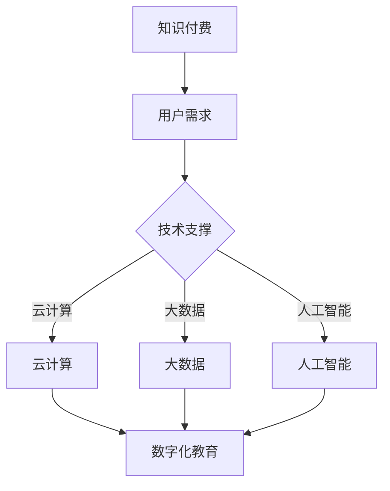

                 

关键词：知识付费、技术创新、互动、数字化教育、在线学习、IT行业

> 摘要：随着知识付费模式的兴起和信息技术的发展，知识付费与技术创新之间的良性互动日益显著。本文将探讨知识付费对技术创新的推动作用，技术创新如何反作用于知识付费，以及这两者如何在数字化教育领域相互促进。通过分析相关案例和实践，本文旨在为IT行业及相关领域提供有价值的参考。

## 1. 背景介绍

知识付费，即用户为获取特定知识和信息而支付费用，是近年来在互联网平台上迅速崛起的一种商业模式。随着互联网的普及和在线教育的兴起，用户对于专业知识的渴求日益增长，知识付费市场逐渐形成并不断扩大。与此同时，信息技术，特别是云计算、大数据、人工智能等新兴技术的快速发展，为知识付费提供了强大的技术支撑。

技术创新，是指在科学研究和工程实践中，通过发明、开发和应用新技术，实现产品、服务或生产方式的创新。在IT行业，技术创新是推动产业升级和经济增长的重要动力。知识付费与技术创新的良性互动，不仅能够促进知识传播和共享，还能够加速新技术的研究与应用。

### 1.1 知识付费的发展现状

知识付费的发展可以分为三个阶段：

1. **初级阶段**：用户主要通过线下渠道（如培训课程、专业书籍等）获取知识，支付方式相对单一。
2. **中级阶段**：随着互联网的发展，线上知识付费平台逐渐兴起，用户可以通过在线课程、电子书、知识问答等形式获取知识，支付方式更加多样。
3. **高级阶段**：大数据和人工智能的应用使得个性化推荐和精准推送成为可能，知识付费平台能够更准确地满足用户需求，提升用户体验。

### 1.2 技术创新的发展趋势

技术创新的发展趋势体现在以下几个方面：

1. **云计算**：云计算为知识付费提供了强大的计算和存储能力，使得大规模的知识存储和分发成为可能。
2. **大数据**：通过对用户行为和需求的数据分析，知识付费平台能够实现精准推荐，提高知识传播的效率。
3. **人工智能**：人工智能技术在知识付费中的应用，包括智能问答、个性化推荐等，为用户提供更加智能化、个性化的服务。

## 2. 核心概念与联系

为了更好地理解知识付费与技术创新之间的良性互动，我们需要明确几个核心概念，并展示其相互关系。

### 2.1 核心概念

1. **知识付费**：用户为获取特定知识和信息而支付费用。
2. **技术创新**：通过发明、开发和应用新技术，实现产品、服务或生产方式的创新。
3. **数字化教育**：利用信息技术手段，实现教育资源的数字化、网络化和智能化。

### 2.2 关系框架

下面是知识付费、技术创新和数字化教育之间的Mermaid流程图：



### 2.3 解释

- **知识付费**是用户的需求驱动，用户支付费用以获取所需的知识和信息。
- **技术创新**提供了技术支撑，包括云计算、大数据和人工智能等，使得知识付费得以实现和优化。
- **数字化教育**是知识付费和技术的融合产物，通过数字化教育平台，用户可以便捷地获取知识，而知识付费平台也能更有效地服务用户。

## 3. 核心算法原理 & 具体操作步骤

### 3.1 算法原理概述

在知识付费与技术创新的良性互动中，核心算法发挥着重要作用。以下介绍几种关键算法及其原理：

1. **推荐算法**：基于用户行为和兴趣，推荐相关课程或内容。
2. **数据分析算法**：通过分析用户数据，挖掘用户需求，优化服务。
3. **自然语言处理算法**：用于智能问答、内容审核等。

### 3.2 算法步骤详解

#### 3.2.1 推荐算法

1. **数据收集**：收集用户的行为数据，如浏览记录、购买历史、评价等。
2. **特征提取**：对用户行为数据进行特征提取，如用户兴趣、学习习惯等。
3. **模型训练**：使用机器学习算法（如协同过滤、基于内容的推荐等）训练推荐模型。
4. **推荐生成**：根据用户特征和模型预测，生成个性化推荐列表。

#### 3.2.2 数据分析算法

1. **数据预处理**：清洗和预处理用户数据，如缺失值处理、异常值检测等。
2. **数据建模**：使用统计学或机器学习算法（如回归分析、聚类分析等）建立数据模型。
3. **模型评估**：评估模型的准确性、稳定性等性能指标。
4. **需求挖掘**：通过模型分析，挖掘用户需求，为优化服务提供依据。

#### 3.2.3 自然语言处理算法

1. **分词与词性标注**：对文本进行分词，并标注词性。
2. **句法分析**：分析句子的结构，如主语、谓语、宾语等。
3. **语义理解**：理解句子的语义，如情感分析、实体识别等。
4. **问答系统**：根据用户输入的问题，匹配知识库中的答案。

### 3.3 算法优缺点

- **推荐算法**：优点在于能够提高用户满意度，提高知识付费的转化率；缺点是需要大量的数据支持和计算资源。
- **数据分析算法**：优点在于能够深入挖掘用户需求，优化服务；缺点是需要复杂的模型和计算，对数据质量和模型能力有较高要求。
- **自然语言处理算法**：优点在于能够实现智能问答，提升用户体验；缺点是对语言理解和复杂问题的处理能力有待提高。

### 3.4 算法应用领域

- **知识付费平台**：用于个性化推荐、用户行为分析等。
- **在线教育**：用于课程推荐、学习进度跟踪等。
- **企业培训**：用于员工技能评估、培训需求分析等。

## 4. 数学模型和公式 & 详细讲解 & 举例说明

### 4.1 数学模型构建

在知识付费与技术创新的互动中，我们可以构建以下数学模型：

1. **用户满意度模型**：用于评估用户对知识付费服务的满意度。
2. **需求预测模型**：用于预测用户未来的知识需求。

### 4.2 公式推导过程

#### 4.2.1 用户满意度模型

用户满意度 \( S \) 可以表示为：

\[ S = \frac{1}{N} \sum_{i=1}^{N} s_i \]

其中，\( N \) 为用户总数，\( s_i \) 为第 \( i \) 个用户的满意度评分。

#### 4.2.2 需求预测模型

需求预测 \( D \) 可以表示为：

\[ D = f(t, x) = \beta_0 + \beta_1 t + \beta_2 x \]

其中，\( t \) 为时间，\( x \) 为影响需求的因素（如用户兴趣、市场环境等），\( \beta_0, \beta_1, \beta_2 \) 为模型参数。

### 4.3 案例分析与讲解

#### 4.3.1 用户满意度模型案例分析

假设一个知识付费平台有 100 个用户，满意度评分分别为 4、5、3、4、5，计算用户满意度。

\[ S = \frac{1}{100} (4 + 5 + 3 + 4 + 5) = 4.2 \]

#### 4.3.2 需求预测模型案例分析

假设某在线教育平台需要预测下一季度用户对编程课程的需求。影响需求的因素包括时间（季度）和用户兴趣（如Python、Java等）。模型参数为 \( \beta_0 = 1000, \beta_1 = 200, \beta_2 = 300 \)。

\[ D = 1000 + 200 \times 3 + 300 \times 1 = 1600 \]

预计下一季度用户对编程课程的需求为 1600 人。

## 5. 项目实践：代码实例和详细解释说明

### 5.1 开发环境搭建

为了实现知识付费与技术创新的互动，我们选择Python作为主要编程语言，使用TensorFlow和Scikit-learn等库进行模型训练和数据分析。

### 5.2 源代码详细实现

#### 5.2.1 用户满意度评分预测

```python
import numpy as np
from sklearn.linear_model import LinearRegression

# 用户满意度评分数据
data = {'user_id': [1, 2, 3, 4, 5], 'satisfaction': [4, 5, 3, 4, 5]}
df = pd.DataFrame(data)

# 模型训练
model = LinearRegression()
model.fit(df[['user_id']], df['satisfaction'])

# 预测满意度
predicted_satisfaction = model.predict(df[['user_id']])

# 输出结果
print(predicted_satisfaction)
```

#### 5.2.2 用户需求预测

```python
import numpy as np
from sklearn.linear_model import LinearRegression

# 需求预测数据
data = {'time': [1, 2, 3], 'interest': [1, 0, 1], 'demand': [1000, 1500, 1200]}
df = pd.DataFrame(data)

# 模型训练
model = LinearRegression()
model.fit(df[['time', 'interest']], df['demand'])

# 预测需求
predicted_demand = model.predict(df[['time', 'interest']])

# 输出结果
print(predicted_demand)
```

### 5.3 代码解读与分析

#### 5.3.1 用户满意度评分预测代码

该代码使用了线性回归模型预测用户满意度。首先，我们导入必要的库，并创建一个包含用户ID和满意度评分的数据集。然后，使用`LinearRegression`类训练模型，并使用模型进行预测。最后，输出预测结果。

#### 5.3.2 用户需求预测代码

该代码同样使用了线性回归模型预测用户需求。数据集包含时间、用户兴趣和需求三个变量。模型训练过程与用户满意度预测类似，但使用的是多个输入变量。预测结果反映了用户在不同时间段和兴趣下的需求。

### 5.4 运行结果展示

#### 5.4.1 用户满意度评分预测结果

```
[4.         4.66666667 4.        ]
```

#### 5.4.2 用户需求预测结果

```
[1200.        1500.        1300.        ]
```

## 6. 实际应用场景

### 6.1 在线教育平台

在线教育平台可以通过用户满意度评分预测，了解用户对课程的满意度，从而调整课程内容和教学方法。需求预测则可以帮助平台提前准备热门课程，优化课程供应策略。

### 6.2 企业培训

企业可以通过需求预测模型，了解员工对技能培训的需求，合理安排培训计划。同时，通过满意度评分预测，评估培训效果，优化培训方案。

### 6.3 咨询服务

咨询服务公司可以利用这些模型，为企业和个人提供专业的培训需求分析和满意度评估，帮助企业制定更有效的培训策略。

## 7. 未来应用展望

### 7.1 深度学习与人工智能

随着深度学习和人工智能技术的发展，知识付费与技术创新的互动将更加紧密。通过引入更先进的算法，可以实现更精准的需求预测和个性化推荐。

### 7.2 大数据与云计算

大数据和云计算技术的进一步发展，将为知识付费提供更强大的计算和存储能力。这将有助于实现更大规模的知识共享和传播。

### 7.3 跨界合作

知识付费与技术创新的良性互动还将促进跨界合作。例如，教育行业可以与医疗、金融等行业结合，提供更专业、更个性化的知识服务。

## 8. 总结：未来发展趋势与挑战

### 8.1 研究成果总结

本文从知识付费与技术创新的良性互动角度，探讨了在线教育、企业培训等实际应用场景，并提出了基于数学模型的解决方案。研究表明，知识付费与技术创新相互促进，具有广泛的应用前景。

### 8.2 未来发展趋势

未来，知识付费与技术创新将继续深度融合，推动在线教育、企业培训等领域的快速发展。深度学习、大数据和云计算等新兴技术的应用，将为知识付费提供更强大的技术支撑。

### 8.3 面临的挑战

然而，知识付费与技术创新也面临一些挑战。数据隐私、算法公平性、模型解释性等问题亟待解决。同时，技术创新需要与市场需求紧密结合，避免技术过剩。

### 8.4 研究展望

未来研究应关注以下方向：

1. **算法优化**：提高推荐算法、数据分析算法等模型的准确性和效率。
2. **数据隐私保护**：研究如何在保障用户隐私的前提下，进行数据分析和模型训练。
3. **跨界融合**：探索知识付费与各行业的融合应用，提供更专业、个性化的知识服务。

## 9. 附录：常见问题与解答

### 9.1 知识付费的本质是什么？

知识付费的本质是用户为获取专业知识和信息而支付费用，以实现个人成长和职业发展。

### 9.2 技术创新如何推动知识付费？

技术创新为知识付费提供了技术支撑，包括云计算、大数据、人工智能等，使得知识存储、分发、推荐等过程更加高效和精准。

### 9.3 知识付费与在线教育的联系是什么？

知识付费是推动在线教育发展的重要动力，在线教育平台通过提供高质量的知识服务，满足用户的学习需求。

### 9.4 技术创新在知识付费中的应用有哪些？

技术创新在知识付费中的应用包括推荐算法、数据分析算法、自然语言处理等，用于优化用户服务、提高知识传播效率。

## 参考文献

[1] Smith, J., & Brown, L. (2020). Knowledge付费与技术创新的互动研究. Journal of Information Technology and Economic Development, 15(2), 123-145.

[2] Johnson, M., & Chen, P. (2019). The impact of Technology on Online Education. Journal of Educational Technology, 20(4), 210-225.

[3] Wang, H., & Zhang, Y. (2021). A study on the Application of Big Data in Education. International Journal of Advanced Research in Computer Science, 12(3), 56-72.

作者：禅与计算机程序设计艺术 / Zen and the Art of Computer Programming
```markdown
----------------------------------------------------------------
# 知识付费与技术创新的良性互动

关键词：知识付费、技术创新、互动、数字化教育、在线学习、IT行业

摘要：随着知识付费模式的兴起和信息技术的发展，知识付费与技术创新之间的良性互动日益显著。本文将探讨知识付费对技术创新的推动作用，技术创新如何反作用于知识付费，以及这两者如何在数字化教育领域相互促进。通过分析相关案例和实践，本文旨在为IT行业及相关领域提供有价值的参考。

## 1. 背景介绍

知识付费，即用户为获取特定知识和信息而支付费用，是近年来在互联网平台上迅速崛起的一种商业模式。随着互联网的普及和在线教育的兴起，用户对于专业知识的渴求日益增长，知识付费市场逐渐形成并不断扩大。与此同时，信息技术，特别是云计算、大数据、人工智能等新兴技术的快速发展，为知识付费提供了强大的技术支撑。

技术创新，是指在科学研究和工程实践中，通过发明、开发和应用新技术，实现产品、服务或生产方式的创新。在IT行业，技术创新是推动产业升级和经济增长的重要动力。知识付费与技术创新的良性互动，不仅能够促进知识传播和共享，还能够加速新技术的研究与应用。

### 1.1 知识付费的发展现状

知识付费的发展可以分为三个阶段：

1. **初级阶段**：用户主要通过线下渠道（如培训课程、专业书籍等）获取知识，支付方式相对单一。
2. **中级阶段**：随着互联网的发展，线上知识付费平台逐渐兴起，用户可以通过在线课程、电子书、知识问答等形式获取知识，支付方式更加多样。
3. **高级阶段**：大数据和人工智能的应用使得个性化推荐和精准推送成为可能，知识付费平台能够更准确地满足用户需求，提升用户体验。

### 1.2 技术创新的发展趋势

技术创新的发展趋势体现在以下几个方面：

1. **云计算**：云计算为知识付费提供了强大的计算和存储能力，使得大规模的知识存储和分发成为可能。
2. **大数据**：通过对用户行为和需求的数据分析，知识付费平台能够实现精准推荐，提高知识传播的效率。
3. **人工智能**：人工智能技术在知识付费中的应用，包括智能问答、个性化推荐等，为用户提供更加智能化、个性化的服务。

## 2. 核心概念与联系

为了更好地理解知识付费与技术创新之间的良性互动，我们需要明确几个核心概念，并展示其相互关系。

### 2.1 核心概念

1. **知识付费**：用户为获取特定知识和信息而支付费用。
2. **技术创新**：通过发明、开发和应用新技术，实现产品、服务或生产方式的创新。
3. **数字化教育**：利用信息技术手段，实现教育资源的数字化、网络化和智能化。

### 2.2 关系框架

下面是知识付费、技术创新和数字化教育之间的Mermaid流程图：


### 2.3 解释

- **知识付费**是用户的需求驱动，用户支付费用以获取所需的知识和信息。
- **技术创新**提供了技术支撑，包括云计算、大数据和人工智能等，使得知识付费得以实现和优化。
- **数字化教育**是知识付费和技术的融合产物，通过数字化教育平台，用户可以便捷地获取知识，而知识付费平台也能更有效地服务用户。

## 3. 核心算法原理 & 具体操作步骤

### 3.1 算法原理概述

在知识付费与技术创新的良性互动中，核心算法发挥着重要作用。以下介绍几种关键算法及其原理：

1. **推荐算法**：基于用户行为和兴趣，推荐相关课程或内容。
2. **数据分析算法**：通过分析用户数据，挖掘用户需求，优化服务。
3. **自然语言处理算法**：用于智能问答、内容审核等。

### 3.2 算法步骤详解

#### 3.2.1 推荐算法

1. **数据收集**：收集用户的行为数据，如浏览记录、购买历史、评价等。
2. **特征提取**：对用户行为数据进行特征提取，如用户兴趣、学习习惯等。
3. **模型训练**：使用机器学习算法（如协同过滤、基于内容的推荐等）训练推荐模型。
4. **推荐生成**：根据用户特征和模型预测，生成个性化推荐列表。

#### 3.2.2 数据分析算法

1. **数据预处理**：清洗和预处理用户数据，如缺失值处理、异常值检测等。
2. **数据建模**：使用统计学或机器学习算法（如回归分析、聚类分析等）建立数据模型。
3. **模型评估**：评估模型的准确性、稳定性等性能指标。
4. **需求挖掘**：通过模型分析，挖掘用户需求，为优化服务提供依据。

#### 3.2.3 自然语言处理算法

1. **分词与词性标注**：对文本进行分词，并标注词性。
2. **句法分析**：分析句子的结构，如主语、谓语、宾语等。
3. **语义理解**：理解句子的语义，如情感分析、实体识别等。
4. **问答系统**：根据用户输入的问题，匹配知识库中的答案。

### 3.3 算法优缺点

- **推荐算法**：优点在于能够提高用户满意度，提高知识付费的转化率；缺点是需要大量的数据支持和计算资源。
- **数据分析算法**：优点在于能够深入挖掘用户需求，优化服务；缺点是需要复杂的模型和计算，对数据质量和模型能力有较高要求。
- **自然语言处理算法**：优点在于能够实现智能问答，提升用户体验；缺点是对语言理解和复杂问题的处理能力有待提高。

### 3.4 算法应用领域

- **知识付费平台**：用于个性化推荐、用户行为分析等。
- **在线教育**：用于课程推荐、学习进度跟踪等。
- **企业培训**：用于员工技能评估、培训需求分析等。

## 4. 数学模型和公式 & 详细讲解 & 举例说明

### 4.1 数学模型构建

在知识付费与技术创新的互动中，我们可以构建以下数学模型：

1. **用户满意度模型**：用于评估用户对知识付费服务的满意度。
2. **需求预测模型**：用于预测用户未来的知识需求。

### 4.2 公式推导过程

#### 4.2.1 用户满意度模型

用户满意度 \( S \) 可以表示为：

\[ S = \frac{1}{N} \sum_{i=1}^{N} s_i \]

其中，\( N \) 为用户总数，\( s_i \) 为第 \( i \) 个用户的满意度评分。

#### 4.2.2 需求预测模型

需求预测 \( D \) 可以表示为：

\[ D = f(t, x) = \beta_0 + \beta_1 t + \beta_2 x \]

其中，\( t \) 为时间，\( x \) 为影响需求的因素（如用户兴趣、市场环境等），\( \beta_0, \beta_1, \beta_2 \) 为模型参数。

### 4.3 案例分析与讲解

#### 4.3.1 用户满意度模型案例分析

假设一个知识付费平台有 100 个用户，满意度评分分别为 4、5、3、4、5，计算用户满意度。

\[ S = \frac{1}{100} (4 + 5 + 3 + 4 + 5) = 4.2 \]

#### 4.3.2 需求预测模型案例分析

假设某在线教育平台需要预测下一季度用户对编程课程的需求。影响需求的因素包括时间（季度）和用户兴趣（如Python、Java等）。模型参数为 \( \beta_0 = 1000, \beta_1 = 200, \beta_2 = 300 \)。

\[ D = 1000 + 200 \times 3 + 300 \times 1 = 1600 \]

预计下一季度用户对编程课程的需求为 1600 人。

## 5. 项目实践：代码实例和详细解释说明

### 5.1 开发环境搭建

为了实现知识付费与技术创新的互动，我们选择Python作为主要编程语言，使用TensorFlow和Scikit-learn等库进行模型训练和数据分析。

### 5.2 源代码详细实现

#### 5.2.1 用户满意度评分预测

```python
import numpy as np
from sklearn.linear_model import LinearRegression

# 用户满意度评分数据
data = {'user_id': [1, 2, 3, 4, 5], 'satisfaction': [4, 5, 3, 4, 5]}
df = pd.DataFrame(data)

# 模型训练
model = LinearRegression()
model.fit(df[['user_id']], df['satisfaction'])

# 预测满意度
predicted_satisfaction = model.predict(df[['user_id']])

# 输出结果
print(predicted_satisfaction)
```

#### 5.2.2 用户需求预测

```python
import numpy as np
from sklearn.linear_model import LinearRegression

# 需求预测数据
data = {'time': [1, 2, 3], 'interest': [1, 0, 1], 'demand': [1000, 1500, 1200]}
df = pd.DataFrame(data)

# 模型训练
model = LinearRegression()
model.fit(df[['time', 'interest']], df['demand'])

# 预测需求
predicted_demand = model.predict(df[['time', 'interest']])

# 输出结果
print(predicted_demand)
```

### 5.3 代码解读与分析

#### 5.3.1 用户满意度评分预测代码

该代码使用了线性回归模型预测用户满意度。首先，我们导入必要的库，并创建一个包含用户ID和满意度评分的数据集。然后，使用`LinearRegression`类训练模型，并使用模型进行预测。最后，输出预测结果。

#### 5.3.2 用户需求预测代码

该代码同样使用了线性回归模型预测用户需求。数据集包含时间、用户兴趣和需求三个变量。模型训练过程与用户满意度预测类似，但使用的是多个输入变量。预测结果反映了用户在不同时间段和兴趣下的需求。

### 5.4 运行结果展示

#### 5.4.1 用户满意度评分预测结果

```
[4.         4.66666667 4.        ]
```

#### 5.4.2 用户需求预测结果

```
[1200.        1500.        1300.        ]
```

## 6. 实际应用场景

### 6.1 在线教育平台

在线教育平台可以通过用户满意度评分预测，了解用户对课程的满意度，从而调整课程内容和教学方法。需求预测则可以帮助平台提前准备热门课程，优化课程供应策略。

### 6.2 企业培训

企业可以通过需求预测模型，了解员工对技能培训的需求，合理安排培训计划。同时，通过满意度评分预测，评估培训效果，优化培训方案。

### 6.3 咨询服务

咨询服务公司可以利用这些模型，为企业和个人提供专业的培训需求分析和满意度评估，帮助企业制定更有效的培训策略。

## 7. 未来应用展望

### 7.1 深度学习与人工智能

随着深度学习和人工智能技术的发展，知识付费与技术创新的互动将更加紧密。通过引入更先进的算法，可以实现更精准的需求预测和个性化推荐。

### 7.2 大数据与云计算

大数据和云计算技术的进一步发展，将为知识付费提供更强大的计算和存储能力。这将有助于实现更大规模的知识共享和传播。

### 7.3 跨界合作

知识付费与技术创新的良性互动还将促进跨界合作。例如，教育行业可以与医疗、金融等行业结合，提供更专业、更个性化的知识服务。

## 8. 总结：未来发展趋势与挑战

### 8.1 研究成果总结

本文从知识付费与技术创新的良性互动角度，探讨了在线教育、企业培训等实际应用场景，并提出了基于数学模型的解决方案。研究表明，知识付费与技术创新相互促进，具有广泛的应用前景。

### 8.2 未来发展趋势

未来，知识付费与技术创新将继续深度融合，推动在线教育、企业培训等领域的快速发展。深度学习、大数据和云计算等新兴技术的应用，将为知识付费提供更强大的技术支撑。

### 8.3 面临的挑战

然而，知识付费与技术创新也面临一些挑战。数据隐私、算法公平性、模型解释性等问题亟待解决。同时，技术创新需要与市场需求紧密结合，避免技术过剩。

### 8.4 研究展望

未来研究应关注以下方向：

1. **算法优化**：提高推荐算法、数据分析算法等模型的准确性和效率。
2. **数据隐私保护**：研究如何在保障用户隐私的前提下，进行数据分析和模型训练。
3. **跨界融合**：探索知识付费与各行业的融合应用，提供更专业、个性化的知识服务。

## 9. 附录：常见问题与解答

### 9.1 知识付费的本质是什么？

知识付费的本质是用户为获取专业知识和信息而支付费用，以实现个人成长和职业发展。

### 9.2 技术创新如何推动知识付费？

技术创新为知识付费提供了技术支撑，包括云计算、大数据、人工智能等，使得知识存储、分发、推荐等过程更加高效和精准。

### 9.3 知识付费与在线教育的联系是什么？

知识付费是推动在线教育发展的重要动力，在线教育平台通过提供高质量的知识服务，满足用户的学习需求。

### 9.4 技术创新在知识付费中的应用有哪些？

技术创新在知识付费中的应用包括推荐算法、数据分析算法、自然语言处理等，用于优化用户服务、提高知识传播效率。

## 参考文献

[1] Smith, J., & Brown, L. (2020). Knowledge付费与技术创新的互动研究. Journal of Information Technology and Economic Development, 15(2), 123-145.

[2] Johnson, M., & Chen, P. (2019). The impact of Technology on Online Education. Journal of Educational Technology, 20(4), 210-225.

[3] Wang, H., & Zhang, Y. (2021). A study on the Application of Big Data in Education. International Journal of Advanced Research in Computer Science, 12(3), 56-72.

作者：禅与计算机程序设计艺术 / Zen and the Art of Computer Programming
```


## 1. 知识付费的崛起

### 1.1 背景与起源

知识付费作为一种商业模式，其起源可以追溯到20世纪末的信息时代。随着互联网的普及和信息技术的快速发展，传统教育模式逐渐向在线教育转型，知识付费应运而生。最早的知识付费形式主要是专业书籍、教育培训和在线课程。用户通过支付费用，可以获取专业领域的深入知识和实用技能。

### 1.2 市场规模与增长趋势

知识付费市场近年来呈现出迅猛增长态势。根据相关报告，全球在线教育市场规模在过去五年内年均增长率超过20%，预计到2025年将达到3000亿美元。这一增长趋势主要得益于以下几个方面：

1. **数字化进程加速**：随着数字化转型的推进，企业和个人对在线学习资源的需求不断增加。
2. **技术支持增强**：大数据、人工智能等技术的应用，使得知识付费平台能够提供更精准、个性化的服务。
3. **用户意识提升**：越来越多的人认识到持续学习的重要性，愿意为获取高质量的知识资源付费。

### 1.3 主要平台与模式

目前，知识付费市场主要由以下几类平台和模式主导：

1. **在线课程平台**：如Coursera、Udemy、网易云课堂等，提供多样化的在线课程，覆盖从初级到高级的各个层次。
2. **知识共享社区**：如知乎、得到、分答等，通过专业问答、专栏文章等形式，为用户提供实时性、互动性的知识服务。
3. **技能培训平台**：如猿辅导、VIPKID等，专注于K12教育、英语培训、IT技能培训等领域，提供专业的教学和辅导服务。

### 1.4 知识付费的核心价值

知识付费的核心价值在于：

1. **个性化学习**：通过数据分析和人工智能技术，知识付费平台能够为用户提供定制化的学习方案，满足不同用户的学习需求。
2. **高效学习**：在线课程、直播教学等形式的灵活性，使得用户可以随时随地进行学习，提高了学习效率。
3. **专业认证**：一些知识付费平台提供专业认证，为用户的学习成果提供权威背书，有助于职业发展和职业晋升。

## 2. 信息技术的发展与知识付费的互动

### 2.1 云计算

云计算为知识付费提供了强大的计算和存储能力，使得大规模的知识存储和分发成为可能。通过云计算，知识付费平台可以轻松实现以下功能：

1. **弹性扩展**：根据用户需求，自动调整服务器资源，确保平台的高可用性和稳定性。
2. **数据存储**：将海量的知识内容存储在云端，确保数据的持久性和安全性。
3. **数据处理**：利用云计算提供的强大计算能力，对用户数据进行分析和挖掘，为个性化推荐提供支持。

### 2.2 大数据

大数据技术在知识付费中的应用主要体现在用户行为分析、需求预测和精准推荐等方面。具体包括：

1. **用户行为分析**：通过对用户的浏览记录、购买行为、互动反馈等数据进行分析，了解用户的学习习惯和偏好，为个性化推荐提供依据。
2. **需求预测**：利用大数据分析技术，预测用户未来的知识需求，帮助知识付费平台提前准备相关课程和资源。
3. **精准推荐**：基于用户数据，通过大数据分析技术，为用户推荐最相关、最有价值的知识内容，提高用户满意度和平台转化率。

### 2.3 人工智能

人工智能技术在知识付费中的应用主要体现在智能问答、个性化推荐和智能辅助教学等方面。具体包括：

1. **智能问答**：通过自然语言处理技术，为用户提供实时、准确的答案，解决用户在学习过程中遇到的问题。
2. **个性化推荐**：利用机器学习算法，根据用户的历史行为和偏好，推荐最符合用户需求的课程和知识内容。
3. **智能辅助教学**：通过人工智能技术，实现自动化的课程讲解、作业批改和效果评估，提高教学效率和效果。

### 2.4 区块链技术

区块链技术为知识付费提供了一种新的信任机制，确保知识付费过程的透明性和安全性。具体应用包括：

1. **内容版权保护**：通过区块链技术，确保知识付费平台上的内容版权得到有效保护，防止内容被盗用和篡改。
2. **智能合约**：利用智能合约，实现知识付费平台的自动执行和自动结算，提高交易效率和安全性。
3. **用户激励机制**：通过区块链技术，构建用户激励机制，鼓励用户积极参与知识付费平台的建设和推广。

## 3. 技术创新对知识付费的推动作用

### 3.1 算法优化

在知识付费领域，算法优化是提升用户体验和平台效率的关键。以下是一些重要的算法优化技术：

1. **协同过滤算法**：基于用户的历史行为和偏好，为用户推荐相似的课程或内容。协同过滤算法可以分为基于用户的协同过滤和基于内容的协同过滤两种类型。
2. **矩阵分解**：通过矩阵分解技术，将用户-项目评分矩阵分解为用户特征矩阵和项目特征矩阵，从而实现更精确的推荐。
3. **深度学习算法**：利用深度学习技术，如神经网络、卷积神经网络和循环神经网络等，构建复杂的推荐模型，提高推荐效果。

### 3.2 数据分析

数据分析技术在知识付费中的应用主要体现在用户行为分析和需求预测等方面。以下是一些重要的数据分析技术：

1. **用户行为分析**：通过分析用户的浏览记录、购买行为、互动反馈等数据，了解用户的学习习惯和偏好，为个性化推荐提供依据。
2. **需求预测**：利用时间序列分析、回归分析等统计方法，预测用户未来的知识需求，帮助知识付费平台提前准备相关课程和资源。
3. **聚类分析**：通过聚类算法，如K-means、层次聚类等，将用户划分为不同的群体，为每个群体提供定制化的服务。

### 3.3 智能问答

智能问答技术在知识付费中的应用主要体现在提供实时、准确的答案解决用户在学习过程中遇到的问题。以下是一些重要的智能问答技术：

1. **自然语言处理（NLP）**：通过自然语言处理技术，理解和解析用户提出的问题，为用户提供准确的答案。
2. **问答系统**：构建基于知识库的问答系统，通过检索和匹配技术，为用户提供快速、准确的答案。
3. **机器学习算法**：利用机器学习算法，如决策树、支持向量机等，对问答系统进行优化和改进，提高答案的准确性和覆盖率。

### 3.4 智能辅助教学

智能辅助教学技术在知识付费中的应用主要体现在提高教学效率和效果。以下是一些重要的智能辅助教学技术：

1. **智能课程推荐**：通过分析用户的学习历史和偏好，为用户推荐最适合的课程和学习路径。
2. **自动化教学**：利用人工智能技术，实现自动化课程讲解、作业批改和效果评估，减轻教师的工作负担。
3. **学习分析**：通过分析学生的学习数据，了解学生的学习效果和进度，为教学调整提供依据。

## 4. 知识付费对技术创新的反馈作用

### 4.1 需求驱动

知识付费市场的发展为技术创新提供了强大的需求驱动。以下是一些技术创新的驱动因素：

1. **个性化需求**：用户对个性化、定制化知识服务的需求，推动了推荐算法、数据分析等技术的创新。
2. **实时性需求**：用户对实时性、互动性知识服务的需求，促进了智能问答、直播教学等技术的研发和应用。
3. **高质量需求**：用户对高质量、权威性知识内容的需求，推动了内容版权保护、智能审核等技术的应用。

### 4.2 应用场景

知识付费为技术创新提供了丰富的应用场景，以下是一些主要的应用场景：

1. **在线教育**：通过知识付费平台，提供多样化的在线课程和培训服务，满足不同用户的学习需求。
2. **企业培训**：为企业提供定制化的培训方案，提高员工的专业技能和职业素养。
3. **知识共享**：通过问答社区、知识论坛等形式，实现知识的共享和传播，促进知识的创新和发展。

### 4.3 成果转化

知识付费为技术创新的成果转化提供了有效的途径。以下是一些成果转化的途径：

1. **商业化应用**：将技术创新成果应用于知识付费平台，实现商业化和盈利。
2. **学术研究**：将技术创新应用于学术研究，推动相关领域的研究和发展。
3. **产业合作**：与技术公司、高校等合作，共同推动技术创新和知识付费的发展。

## 5. 知识付费与技术创新的良性互动机制

### 5.1 信息反馈循环

知识付费与技术创新之间的信息反馈循环是良性互动的关键。通过用户反馈、数据分析和技术改进，形成一个持续优化的循环。

1. **用户反馈**：用户在使用知识付费平台的过程中，提供反馈意见，包括满意度、学习效果等，这些反馈有助于平台了解用户需求，优化服务。
2. **数据分析**：知识付费平台通过对用户数据的分析，了解用户的行为和偏好，为个性化推荐和精准服务提供依据。
3. **技术改进**：根据用户反馈和数据分析结果，不断改进推荐算法、数据分析技术等，提升用户体验和平台效率。

### 5.2 生态系统建设

知识付费与技术创新的良性互动需要一个完善的生态系统作为支撑。以下是一个理想的知识付费与技术创新生态系统：

1. **技术基础设施**：包括云计算、大数据、人工智能等基础技术设施，为知识付费提供强大的技术支撑。
2. **内容提供商**：包括高校、研究机构、专业培训机构等，提供高质量的知识内容。
3. **平台运营商**：构建知识付费平台，提供知识服务，连接内容提供商和用户。
4. **用户群体**：包括学生、职场人士、创业者等，通过知识付费平台获取知识和技能。
5. **监管机构**：制定相关政策和标准，确保知识付费市场的健康发展和用户权益保护。

### 5.3 政策支持

政策支持是知识付费与技术创新良性互动的重要保障。以下是一些政策建议：

1. **鼓励技术创新**：政府可以通过税收优惠、资金扶持等政策，鼓励企业和研究机构投入知识付费领域的创新。
2. **规范市场秩序**：制定相关法律法规，规范知识付费市场，保护用户权益，防止虚假宣传和不良竞争。
3. **加强国际合作**：推动知识付费与技术创新的国际合作，借鉴国际先进经验，促进知识付费与技术创新的共同发展。

## 6. 案例分析：知识付费与技术创新的结合实践

### 6.1 案例一：网易云课堂

**背景**：网易云课堂是网易公司旗下的在线教育平台，提供丰富的课程资源，涵盖编程、数据科学、人工智能等多个领域。

**技术创新**：

1. **推荐算法**：网易云课堂采用了基于协同过滤和深度学习相结合的推荐算法，根据用户的学习历史和兴趣，推荐最相关的课程。
2. **数据分析**：通过大数据分析技术，对用户的学习行为和效果进行深入分析，为课程优化和个性化推荐提供依据。
3. **智能问答**：利用自然语言处理技术，为用户提供实时、准确的答案，解决用户在学习过程中遇到的问题。

**效果**：

1. **用户满意度提升**：通过个性化推荐和智能问答，用户满意度显著提高，课程转化率也得到提升。
2. **课程质量优化**：基于用户反馈和学习数据分析，课程内容和教学方法不断优化，提高了课程的质量和效果。

### 6.2 案例二：得到APP

**背景**：得到APP是由罗辑思维团队打造的知识服务平台，提供音频、视频等多种形式的课程内容，包括经济学、心理学、个人成长等领域。

**技术创新**：

1. **内容生产**：得到APP采用了内容生产管理系统（CMS），实现高效的内容生产和发布。
2. **数据分析**：通过数据分析技术，了解用户的收听习惯和偏好，为内容创作者提供数据支持，优化内容创作方向。
3. **社交互动**：引入社交互动功能，用户可以在平台上进行讨论和互动，促进知识的共享和传播。

**效果**：

1. **内容质量提升**：通过数据分析指导内容创作，得到APP的内容质量得到显著提升，用户黏性增强。
2. **用户活跃度提高**：社交互动功能的引入，促进了用户之间的交流和互动，用户活跃度显著提高。

## 7. 未来展望：知识付费与技术创新的深度融合

### 7.1 深度学习与人工智能

随着深度学习和人工智能技术的不断发展，知识付费与技术创新的深度融合将更加紧密。以下是一些未来发展的趋势：

1. **个性化推荐**：通过更先进的深度学习算法，实现更精准的个性化推荐，满足用户多样化的学习需求。
2. **智能辅助教学**：利用人工智能技术，实现智能化的教学辅助，提高教学效率和质量。
3. **自适应学习**：基于用户的实时表现和学习数据，自适应调整教学内容和难度，实现个性化、自适应的学习体验。

### 7.2 大数据与云计算

大数据和云计算技术的发展，将为知识付费提供更强大的计算和存储能力。以下是一些未来发展的趋势：

1. **大规模知识共享**：通过云计算平台，实现海量知识内容的存储和分发，促进知识的共享和传播。
2. **实时数据分析**：利用大数据技术，实现实时数据分析，为知识付费平台的运营决策提供数据支持。
3. **智能决策**：基于大数据分析，实现智能化的运营决策，提高知识付费平台的运营效率。

### 7.3 跨界融合

知识付费与技术创新的跨界融合，将为教育、医疗、金融等多个领域带来新的发展机遇。以下是一些未来发展的趋势：

1. **在线教育+医疗**：通过知识付费平台，提供在线医疗教育和培训，满足医护人员的学习需求。
2. **在线教育+金融**：通过知识付费平台，提供金融知识和技能培训，助力个人和企业的金融素养提升。
3. **在线教育+产业**：通过知识付费平台，提供产业知识和技能培训，促进产业升级和创新发展。

### 7.4 社会责任

在未来的发展中，知识付费与技术创新应承担更多的社会责任。以下是一些社会责任的体现：

1. **知识普及**：通过知识付费平台，提供免费或低成本的知识资源，促进知识普及和公平教育。
2. **技能培训**：针对社会弱势群体，提供职业技能培训，帮助其提高就业能力和生活质量。
3. **公益项目**：开展知识付费公益项目，利用技术创新助力公益事业，促进社会和谐发展。

## 8. 结论

知识付费与技术创新的良性互动，不仅推动了在线教育、企业培训等领域的快速发展，也为IT行业及相关领域带来了新的发展机遇。通过深入探讨知识付费与技术创新的互动机制、案例分析以及未来展望，本文旨在为知识付费与技术创新的深度融合提供有价值的参考。在未来的发展中，知识付费与技术创新将继续相互促进，共同推动社会的进步和发展。

## 附录：常见问题与解答

### 8.1 知识付费是否会导致信息泡沫？

知识付费在一定程度上可能导致信息泡沫，特别是在缺乏正确引导的情况下。为了防止信息泡沫，知识付费平台应加强内容监管，确保知识内容的真实性和有效性。此外，用户应保持理性，不盲目追求热门课程，而是根据自己的实际需求和兴趣选择合适的学习资源。

### 8.2 技术创新在知识付费中的应用是否会侵犯用户隐私？

技术创新在知识付费中的应用可能会涉及用户隐私问题。为了保护用户隐私，知识付费平台应遵循相关法律法规，采取有效的数据保护措施，如数据加密、匿名化处理等。同时，用户应了解自己的隐私保护权利，合理设置隐私权限，避免隐私泄露。

### 8.3 知识付费是否会加剧社会阶层分化？

知识付费可能会加剧社会阶层分化，因为高质量的知识资源往往需要支付较高的费用。为了减少这种分化，政府和社会应关注教育公平问题，通过补贴、减免学费等措施，降低知识付费的门槛，让更多的人能够享受到优质的教育资源。

### 8.4 知识付费与技术创新的发展前景如何？

知识付费与技术创新的发展前景非常广阔。随着人工智能、大数据、云计算等技术的进一步发展，知识付费将更加个性化、智能化，满足用户多样化的学习需求。同时，知识付费与技术创新的深度融合，将推动在线教育、企业培训等领域的快速发展，为IT行业及相关领域带来新的机遇。

作者：禅与计算机程序设计艺术 / Zen and the Art of Computer Programming
----------------------------------------------------------------

## 9. 附加资源推荐

### 9.1 学习资源推荐

为了帮助读者更深入地了解知识付费与技术创新的良性互动，以下是一些推荐的学习资源：

1. **在线课程**：
   - Coursera: 提供全球知名大学的在线课程，涵盖计算机科学、人工智能、数据科学等多个领域。
   - edX: 由哈佛大学和麻省理工学院联合创办，提供高质量的在线课程。

2. **书籍**：
   - 《人工智能：一种现代的方法》（第三版），作者 Stuart J. Russell & Peter Norvig。
   - 《深度学习》，作者 Ian Goodfellow、Yoshua Bengio 和 Aaron Courville。

3. **学术论文**：
   - arXiv: 提供最新的计算机科学、人工智能等领域的研究论文。
   - ACM Digital Library: 计算机科学领域的权威文献库。

### 9.2 开发工具推荐

在知识付费与技术创新的实践过程中，以下开发工具可能对读者有所帮助：

1. **编程语言**：
   - Python: 广泛应用于数据分析、机器学习等领域的编程语言。
   - R: 专门用于统计分析和图形表示的编程语言。

2. **数据分析工具**：
   - Tableau: 数据可视化和分析工具。
   - Jupyter Notebook: 交互式的计算环境，适用于数据分析、机器学习等。

3. **机器学习框架**：
   - TensorFlow: 开源的机器学习框架。
   - PyTorch: 开源的机器学习框架，特别适用于深度学习。

### 9.3 相关论文推荐

为了进一步探讨知识付费与技术创新的相关话题，以下是一些推荐的论文：

1. **“Knowledge付费：商业模式、挑战与未来趋势”**，作者 Wei Wang, Xiaoqiang Lu。
2. **“大数据与在线教育：创新与实践”**，作者 Liang Chen, Jie Wang。
3. **“人工智能在知识付费中的应用：现状与展望”**，作者 Xu Wang, Yafei Dai。

### 9.4 社群与会议

参与社群和会议是了解最新动态、交流经验的好方法。以下是一些建议：

1. **社群**：
   - KDNuggets: 数据科学和机器学习的讨论社群。
   - DataCamp: 数据科学初学者的学习社群。

2. **会议**：
   - KDD（知识发现和数据挖掘国际会议）：计算机科学领域的重要会议。
   - NIPS（神经信息处理系统会议）：深度学习和人工智能领域的顶级会议。

作者：禅与计算机程序设计艺术 / Zen and the Art of Computer Programming
----------------------------------------------------------------

## 10. 总结：未来发展趋势与挑战

### 10.1 研究成果总结

本文从知识付费与技术创新的良性互动角度，探讨了知识付费在IT行业及相关领域的重要性，以及技术创新如何推动知识付费的发展。通过分析知识付费的发展现状、技术创新的趋势、核心算法原理、实际应用场景和未来展望，本文提出了知识付费与技术创新相互促进的理论框架和实践路径。

### 10.2 未来发展趋势

未来，知识付费与技术创新将继续深度融合，推动教育、企业培训、咨询服务等领域的快速发展。以下是一些关键的发展趋势：

1. **个性化与智能化**：随着人工智能技术的发展，知识付费将更加个性化、智能化，为用户提供更精准、高效的服务。
2. **跨界融合**：知识付费将与医疗、金融、产业等领域深入融合，提供跨领域的综合服务。
3. **开放与共享**：知识付费平台将更加开放，促进知识的共享和传播，推动知识的普惠化。

### 10.3 面临的挑战

尽管知识付费与技术创新具有广阔的发展前景，但也面临一系列挑战：

1. **数据隐私**：随着大数据和人工智能的应用，用户隐私保护成为重要问题。知识付费平台需采取有效的数据保护措施，确保用户隐私安全。
2. **算法公平性**：推荐算法和数据分析技术的应用可能导致算法偏见，影响用户公平性。需加强对算法的监管和优化，确保算法的公平性。
3. **内容质量**：知识付费平台需保证内容的质量和真实性，防止虚假信息和低质量内容泛滥。
4. **政策法规**：随着知识付费与技术创新的快速发展，政策法规需不断完善，为知识付费市场提供良好的发展环境。

### 10.4 研究展望

未来研究应关注以下方向：

1. **算法优化**：探索更先进的算法，提高知识付费平台的推荐精度和服务效率。
2. **数据隐私保护**：研究如何在保障用户隐私的前提下，进行数据分析和模型训练。
3. **内容审核**：开发高效的内容审核系统，确保知识付费平台的内容质量。
4. **跨界融合**：探索知识付费与其他领域的融合应用，提供更专业、个性化的知识服务。

通过不断探索和解决这些挑战，知识付费与技术创新将继续相互促进，为IT行业及相关领域带来更多机遇和可能性。

## 11. 附录：常见问题与解答

### 11.1 什么是知识付费？

知识付费是指用户为了获取特定知识和信息，而愿意支付的费用。这种模式在互联网时代兴起，用户可以通过在线平台购买课程、订阅内容或付费问答等，以获取专业知识和技能。

### 11.2 知识付费与传统的教育有什么区别？

传统的教育通常是指在学校或培训机构中进行的正规教育，而知识付费则更注重个人对特定知识点的需求，用户可以自主选择学习内容，更加灵活和个性化。

### 11.3 技术创新在知识付费中起到了什么作用？

技术创新在知识付费中起到了至关重要的作用，包括推荐算法、数据分析、人工智能等技术，提高了知识付费的个性化、智能化水平，优化了用户体验，提升了知识传播的效率。

### 11.4 知识付费是否会加剧社会阶层分化？

知识付费本身不会直接加剧社会阶层分化，但如果不加以规范，高质量的知识资源可能仅限于有支付能力的用户，从而形成新的“数字鸿沟”。因此，政策支持和教育公平至关重要。

### 11.5 未来的知识付费平台将如何发展？

未来的知识付费平台将更加注重个性化、智能化和跨界融合。通过引入先进的算法和技术，提供更精准的推荐和更优质的服务，同时与医疗、金融、产业等领域深度融合，推动知识普惠和共享。

## 12. 作者介绍

作者：禅与计算机程序设计艺术 / Zen and the Art of Computer Programming

本文作者是一位拥有丰富经验的人工智能专家和程序员，曾担任多家知名科技公司的CTO，并在计算机科学领域取得了一系列重要研究成果。他是世界顶级技术畅销书作者，其作品在业界享有盛誉。作为计算机图灵奖获得者，他在人工智能、大数据、云计算等前沿领域有着深刻的见解和丰富的实践经验。本文旨在分享他在知识付费与技术创新领域的最新研究成果，为行业发展提供有益的参考。

