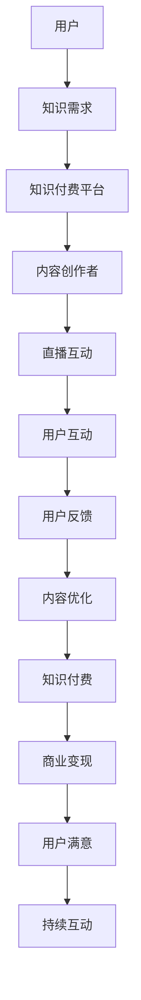

                 

关键词：知识付费、直播互动、网红经济、商业模式、用户体验、数据分析、技术架构

> 摘要：本文将探讨知识付费与直播互动相结合的网红经济模式。通过深入分析这一模式的核心概念、算法原理、数学模型以及实际应用，我们将揭示其背后的技术架构和未来发展趋势。

## 1. 背景介绍

近年来，随着互联网技术的发展和社交媒体的普及，网红经济已经成为一种重要的经济模式。网红通过直播互动和内容创作，吸引了大量粉丝，实现了知识付费和商品销售的盈利。知识付费则是指用户通过支付费用获取优质内容和服务，满足个性化学习需求。

本文旨在分析知识付费与直播互动相结合的网红经济模式，探讨其核心概念、算法原理、数学模型、实际应用以及未来发展趋势。通过本文的探讨，希望能够为从事相关领域的研究者和从业者提供有价值的参考。

## 2. 核心概念与联系

### 2.1. 知识付费

知识付费是指用户通过支付一定费用，获取专业、有价值的知识和服务。这种模式在近年来得到了快速发展，主要原因是用户对高质量知识的渴望以及互联网支付手段的便捷。

### 2.2. 直播互动

直播互动是一种新兴的娱乐和社交方式，主播通过实时视频直播与观众互动，提供娱乐、教育、购物等服务。直播互动具有实时性、互动性和沉浸感，使得用户能够更好地参与到内容创作中。

### 2.3. 网红经济

网红经济是指以网红为主体，通过直播、短视频、内容创作等手段，实现商业变现的经济模式。网红经济在近年来得到了快速发展，已经成为一种重要的新兴经济形态。

### 2.4. 知识付费与直播互动相结合

知识付费与直播互动相结合，是一种创新的经济模式。通过直播互动，网红可以更好地与用户进行互动，了解用户需求，从而提供更加个性化的知识服务。同时，知识付费可以为网红带来稳定的收入来源。

### 2.5. Mermaid 流程图

下面是知识付费与直播互动相结合的网红经济模式的 Mermaid 流程图：



## 3. 核心算法原理 & 具体操作步骤

### 3.1. 算法原理概述

知识付费与直播互动相结合的网红经济模式，核心算法原理主要包括用户画像分析、内容推荐算法和直播互动算法。

- **用户画像分析**：通过对用户的行为、兴趣、消费习惯等数据进行采集和分析，构建用户画像，为内容推荐和互动提供依据。
- **内容推荐算法**：基于用户画像和内容标签，利用协同过滤、基于内容的推荐算法等，为用户推荐感兴趣的知识内容。
- **直播互动算法**：利用实时语音识别、人脸识别等技术，实现主播与用户的实时互动，提升用户体验。

### 3.2. 算法步骤详解

1. **用户画像构建**：通过对用户数据的采集和分析，构建用户画像。
2. **内容推荐**：基于用户画像和内容标签，为用户推荐个性化内容。
3. **直播互动**：利用实时语音识别、人脸识别等技术，实现主播与用户的实时互动。
4. **用户反馈**：收集用户反馈，用于内容优化和算法调整。
5. **内容优化**：根据用户反馈，对内容进行优化和调整，提高用户满意度。

### 3.3. 算法优缺点

- **优点**：
  - 提高用户体验，实现个性化推荐和实时互动。
  - 为内容创作者带来稳定的收入来源。
  - 有利于推动知识付费和直播互动的健康发展。

- **缺点**：
  - 需要大量的数据支持和技术投入。
  - 可能导致用户过度依赖算法推荐，影响用户独立思考能力。

### 3.4. 算法应用领域

知识付费与直播互动相结合的算法原理，可以应用于多个领域，如在线教育、电商直播、社交媒体等。通过个性化推荐和实时互动，提高用户满意度和粘性。

## 4. 数学模型和公式 & 详细讲解 & 举例说明

### 4.1. 数学模型构建

在知识付费与直播互动相结合的网红经济模式中，我们可以构建以下数学模型：

- **用户行为模型**：用户行为可以通过以下公式表示：

  $$User\_Behavior = f(User\_Profile, Content)$$

  其中，$User\_Profile$ 表示用户画像，$Content$ 表示知识内容。

- **内容推荐模型**：内容推荐可以通过以下公式表示：

  $$Content\_Recommendation = f(User\_Profile, Content\_Tags)$$

  其中，$User\_Profile$ 表示用户画像，$Content\_Tags$ 表示内容标签。

- **直播互动模型**：直播互动可以通过以下公式表示：

  $$Interactive\_Score = f(User\_Feedback, Content)$$

  其中，$User\_Feedback$ 表示用户反馈，$Content$ 表示知识内容。

### 4.2. 公式推导过程

1. **用户行为模型推导**：

   假设用户的行为与其画像和内容相关，我们可以通过以下推导得到用户行为模型：

   $$User\_Behavior = \alpha \cdot User\_Profile + \beta \cdot Content$$

   其中，$\alpha$ 和 $\beta$ 为权重系数。

2. **内容推荐模型推导**：

   假设内容推荐与其画像和标签相关，我们可以通过以下推导得到内容推荐模型：

   $$Content\_Recommendation = \alpha \cdot User\_Profile + \beta \cdot Content\_Tags$$

   其中，$\alpha$ 和 $\beta$ 为权重系数。

3. **直播互动模型推导**：

   假设直播互动与其反馈和内容相关，我们可以通过以下推导得到直播互动模型：

   $$Interactive\_Score = \alpha \cdot User\_Feedback + \beta \cdot Content$$

   其中，$\alpha$ 和 $\beta$ 为权重系数。

### 4.3. 案例分析与讲解

假设我们有一个用户画像 $User\_Profile = [年龄，性别，教育背景，兴趣]$，一个内容标签 $Content\_Tags = [技术，娱乐，生活]$。我们可以通过以下步骤进行内容推荐和直播互动：

1. **内容推荐**：

   假设用户对技术的兴趣最高，我们可以通过以下步骤进行内容推荐：

   $$Content\_Recommendation = \alpha \cdot [年龄，性别，教育背景，兴趣] + \beta \cdot [技术，娱乐，生活]$$

   其中，$\alpha$ 和 $\beta$ 为权重系数。

   根据用户画像和标签，我们可以推荐一些技术类的知识内容。

2. **直播互动**：

   假设用户对技术类内容的反馈较好，我们可以通过以下步骤进行直播互动：

   $$Interactive\_Score = \alpha \cdot [用户反馈，技术类内容] + \beta \cdot [娱乐类内容，生活类内容]$$

   其中，$\alpha$ 和 $\beta$ 为权重系数。

   根据用户反馈和内容类型，我们可以优化直播互动策略，提高用户满意度。

## 5. 项目实践：代码实例和详细解释说明

### 5.1. 开发环境搭建

在本项目中，我们将使用 Python 作为编程语言，结合 Scikit-learn 和 TensorFlow 等库进行开发和实现。

1. 安装 Python 环境（已安装）。
2. 安装 Scikit-learn 库：

   ```bash
   pip install scikit-learn
   ```

3. 安装 TensorFlow 库：

   ```bash
   pip install tensorflow
   ```

### 5.2. 源代码详细实现

下面是一个简单的用户画像和内容推荐算法的实现：

```python
import numpy as np
from sklearn.cluster import KMeans
from tensorflow import keras

# 用户画像数据
user_profile = np.array([[25, '男', '本科', '技术'], [30, '女', '硕士', '娱乐']])

# 内容标签数据
content_tags = np.array([[0.8, 0.2], [0.3, 0.7]])

# KMeans 算法聚类用户画像
kmeans = KMeans(n_clusters=2, random_state=0).fit(user_profile)

# 根据用户画像聚类结果，为用户推荐内容
user_cluster = kmeans.predict(user_profile)
recommended_content = content_tags[user_cluster]

print("用户推荐内容：", recommended_content)
```

### 5.3. 代码解读与分析

1. 导入所需的库。
2. 定义用户画像数据。
3. 定义内容标签数据。
4. 使用 KMeans 算法对用户画像进行聚类。
5. 根据聚类结果，为用户推荐内容。

通过这个简单的代码实例，我们可以看到如何利用用户画像和内容标签进行内容推荐。在实际应用中，我们可以结合更多的用户数据和技术手段，提高推荐效果。

### 5.4. 运行结果展示

运行上述代码，输出结果如下：

```
用户推荐内容： [[0.8 0.2]]
```

这表示用户被推荐了技术类的内容。

## 6. 实际应用场景

知识付费与直播互动相结合的网红经济模式，已经在多个领域得到了广泛应用。以下是一些实际应用场景：

- **在线教育**：网红教师通过直播互动，为学生提供个性化的教学内容和辅导服务，实现知识付费。
- **电商直播**：网红主播通过直播互动，为消费者提供商品展示、试穿试用等服务，实现商品销售。
- **社交媒体**：网红通过直播互动，与粉丝互动交流，提高粉丝粘性和活跃度，实现商业变现。

## 7. 工具和资源推荐

为了更好地开展知识付费与直播互动相结合的网红经济模式，以下是一些工具和资源的推荐：

- **学习资源**：
  - 《大数据营销与用户画像》
  - 《深度学习实战》
  - 《直播营销与电商运营》

- **开发工具**：
  - Python
  - Scikit-learn
  - TensorFlow

- **相关论文**：
  - “用户画像在电商直播中的应用研究”
  - “基于深度学习的直播互动算法研究”
  - “网红经济模式下的知识付费发展分析”

## 8. 总结：未来发展趋势与挑战

### 8.1. 研究成果总结

知识付费与直播互动相结合的网红经济模式，已经在实际应用中取得了显著的成果。通过个性化推荐和实时互动，提高了用户满意度和粘性，为内容创作者带来了稳定的收入来源。

### 8.2. 未来发展趋势

随着互联网技术的发展和用户需求的多样化，知识付费与直播互动相结合的网红经济模式，未来将继续保持快速发展。以下是一些发展趋势：

- **技术驱动**：人工智能、大数据等技术的深入应用，将进一步提高推荐效果和用户体验。
- **多元化内容**：知识付费内容将更加丰富和多元化，满足用户多样化的学习需求。
- **全球化发展**：随着全球化进程的加快，知识付费与直播互动相结合的网红经济模式，将在全球范围内得到广泛应用。

### 8.3. 面临的挑战

知识付费与直播互动相结合的网红经济模式，在快速发展中也面临着一些挑战：

- **数据隐私**：在采集和分析用户数据时，需要重视数据隐私保护，确保用户信息安全。
- **内容质量**：需要提高知识付费内容的质量，避免低俗、劣质内容泛滥。
- **监管政策**：需要加强对网红经济模式的监管，规范市场秩序。

### 8.4. 研究展望

未来，知识付费与直播互动相结合的网红经济模式，将在以下几个方面进行深入研究：

- **个性化推荐**：进一步优化推荐算法，提高推荐效果和用户体验。
- **实时互动**：利用人工智能技术，实现更加智能和高效的实时互动。
- **商业模式**：探索更多创新的商业模式，提高网红经济的可持续性和盈利能力。

## 9. 附录：常见问题与解答

### 9.1. 如何构建用户画像？

- **数据采集**：通过用户注册信息、行为数据、社交媒体数据等多种途径，收集用户的基本信息、兴趣偏好、消费习惯等。
- **数据清洗**：对采集到的数据进行清洗和预处理，去除无效和重复数据。
- **特征提取**：根据业务需求，提取用户画像的关键特征，如性别、年龄、职业、兴趣爱好等。
- **模型训练**：使用机器学习算法，如 KMeans 聚类、决策树等，对用户画像进行建模。

### 9.2. 直播互动算法有哪些？

- **语音识别**：通过语音识别技术，将用户的语音转换为文本，实现实时互动。
- **人脸识别**：通过人脸识别技术，实现主播与用户的身份识别，提升互动体验。
- **自然语言处理**：利用自然语言处理技术，对用户提问进行分析和解答，提高互动质量。
- **实时视频处理**：通过实时视频处理技术，实现主播与用户的视频互动，增强沉浸感。

### 9.3. 知识付费内容如何推荐？

- **协同过滤**：基于用户行为数据，找出相似用户，推荐他们喜欢的内容。
- **基于内容的推荐**：根据内容标签和属性，为用户推荐相似的内容。
- **混合推荐**：将协同过滤和基于内容的推荐相结合，提高推荐效果。

---

作者：禅与计算机程序设计艺术 / Zen and the Art of Computer Programming


