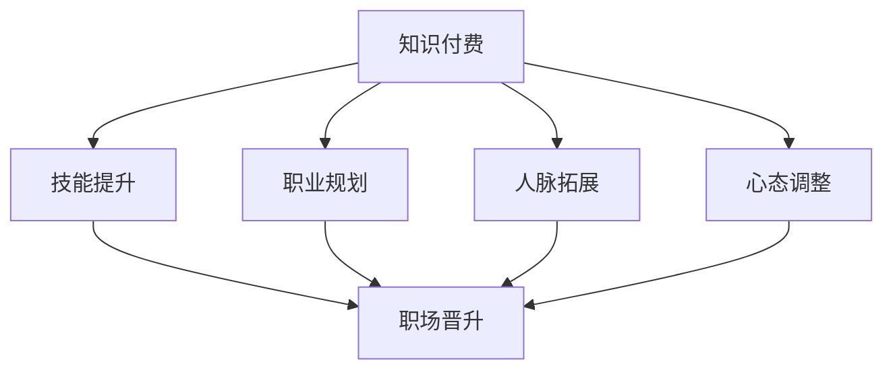

                 

### 背景介绍

在当今数字化时代，程序员作为技术驱动的主力军，其职业发展备受关注。然而，随着技术的不断进步和更新，程序员面临着快速学习和不断适应新技术的要求。知识付费作为一种新兴的商业模式，为程序员提供了获取前沿技术的途径，进而影响了他们的职场晋升。本文旨在探讨知识付费与程序员职场晋升之间的关系，分析知识付费的优势和劣势，以及程序员如何利用知识付费实现职业发展。

知识付费，指的是用户为获取特定知识或技能而付费的一种行为。在程序员群体中，知识付费形式多样，包括在线课程、电子书、直播讲座、付费社群等。随着互联网技术的普及，知识付费市场逐渐壮大，为程序员提供了丰富的学习资源。然而，知识付费并非没有争议，其效果和性价比也备受质疑。本文将结合实际案例和数据，深入分析知识付费对程序员职场晋升的影响。

### 核心概念与联系

在探讨知识付费与程序员职场晋升的关系之前，我们需要明确几个核心概念，包括知识付费、职场晋升以及它们之间的内在联系。

#### 知识付费

知识付费的本质是价值交换，即用户通过支付一定费用，获取所需的知识或技能。在程序员领域，知识付费的主要形式包括：

1. **在线课程**：以视频讲座为主，提供系统化的知识体系，如编程语言、框架、算法等。
2. **电子书**：以文本或电子文档形式存在的知识资源，适合深度学习和查阅。
3. **直播讲座**：实时互动的讲座形式，用户可以与讲师进行即时交流。
4. **付费社群**：以微信群、QQ群等社交平台为基础，成员之间进行知识分享和交流。

#### 职场晋升

职场晋升是指程序员在职业生涯中通过学习、实践和表现，获得更高的职位、更大的职责和更高的薪酬。职场晋升的关键因素包括：

1. **技能水平**：具备高级编程技能和解决复杂问题的能力。
2. **工作经验**：积累丰富的项目经验和团队协作经验。
3. **个人能力**：包括沟通能力、领导力、创新思维等软技能。
4. **学历背景**：较高的学历背景通常意味着更强的学习能力。

#### 知识付费与职场晋升的关系

知识付费与程序员职场晋升之间存在紧密的联系。知识付费可以作为提升技能和拓展视野的重要手段，从而有助于职场晋升。具体来说，知识付费对程序员职场晋升的影响体现在以下几个方面：

1. **技能提升**：通过知识付费，程序员可以快速掌握新技术和知识，提高技能水平，增强在职场中的竞争力。
2. **职业规划**：知识付费帮助程序员明确职业发展方向，制定合理的职业规划，从而更有针对性地提升自身能力。
3. **人脉拓展**：付费社群等知识付费形式为程序员提供了交流平台，有助于建立人脉关系，拓展职业网络。
4. **心态调整**：知识付费促使程序员保持持续学习的态度，适应职场变化，提升个人素养。

为了更直观地理解知识付费与程序员职场晋升的关系，我们可以通过以下 Mermaid 流程图进行展示：



该流程图清晰地展示了知识付费对程序员职场晋升的推动作用，以及各个因素之间的相互关系。

#### 结论

通过以上分析，我们可以得出结论：知识付费是程序员职场晋升的重要推动力。然而，知识付费并非万能，程序员需要结合实际情况，选择适合自己的学习资源和方式，才能最大限度地发挥知识付费的优势，实现职业发展。

## 3. 核心算法原理 & 具体操作步骤

### 3.1 算法原理概述

知识付费与程序员职场晋升的关系，本质上是一个复杂系统中的动态交互过程。为了更好地理解这一关系，我们可以采用一种名为“综合评价模型”的算法来分析。该模型通过多个维度的数据，对知识付费对程序员职场晋升的影响进行量化评价。以下为该算法的基本原理：

1. **输入变量**：算法的输入变量包括程序员的基本信息（如学历、工作经验、技能水平等）、知识付费行为（如参与课程数量、付费金额等）以及职场晋升情况（如职位变化、薪资增长等）。

2. **评价指标**：评价指标包括技能提升度、职业规划清晰度、人脉拓展广度和心态调整度等。

3. **模型构建**：通过回归分析、因子分析等方法，构建一个综合评价模型，将输入变量与评价指标联系起来。

4. **结果输出**：算法输出结果为程序员的知识付费行为对其职场晋升的综合影响程度。

### 3.2 算法步骤详解

为了实现上述算法，我们需要进行以下具体操作步骤：

1. **数据收集**：首先，收集大量程序员的相关数据，包括基本信息、知识付费行为和职场晋升情况。

2. **数据预处理**：对收集到的数据进行清洗、归一化和特征提取，确保数据质量。

3. **模型构建**：使用统计学方法，如回归分析或因子分析，构建综合评价模型。模型构建过程中，需要确定输入变量和评价指标之间的关系。

4. **模型训练与验证**：使用训练集数据对模型进行训练，并使用验证集数据进行验证，调整模型参数，提高模型准确性。

5. **结果分析**：使用测试集数据，对模型进行结果分析，评估知识付费对程序员职场晋升的具体影响程度。

### 3.3 算法优缺点

#### 优点

1. **全面性**：综合评价模型考虑了多个维度的因素，能够全面评估知识付费对程序员职场晋升的影响。

2. **准确性**：通过统计学方法构建模型，可以提高预测的准确性。

3. **灵活性**：模型可以根据实际情况进行调整和优化，适应不同的应用场景。

#### 缺点

1. **数据依赖性**：模型的准确性高度依赖于数据的质量和完整性。

2. **复杂性**：构建和训练模型的过程较为复杂，需要专业的技术和知识。

### 3.4 算法应用领域

综合评价模型可以应用于多个领域，包括但不限于：

1. **企业招聘**：通过评估求职者的知识付费行为和职场晋升潜力，为企业招聘提供参考。

2. **人才发展**：为程序员制定职业发展计划，提供有针对性的培训和学习资源。

3. **市场研究**：分析知识付费市场的发展趋势和用户需求，为企业决策提供支持。

## 4. 数学模型和公式 & 详细讲解 & 举例说明

### 4.1 数学模型构建

在分析知识付费与程序员职场晋升的关系时，我们可以构建一个线性回归模型。该模型的基本形式为：

\[ Y = \beta_0 + \beta_1X_1 + \beta_2X_2 + \cdots + \beta_nX_n + \varepsilon \]

其中，\( Y \) 表示程序员职场晋升的得分，\( X_1, X_2, \cdots, X_n \) 表示知识付费行为的多个指标，\( \beta_0, \beta_1, \beta_2, \cdots, \beta_n \) 为模型参数，\( \varepsilon \) 为误差项。

为了构建模型，我们需要收集大量数据，并对数据进行预处理。具体步骤如下：

1. **数据收集**：收集程序员的基本信息（如学历、工作经验、技能水平等）、知识付费行为（如参与课程数量、付费金额等）和职场晋升情况（如职位变化、薪资增长等）。

2. **数据预处理**：对收集到的数据进行清洗、归一化和特征提取。

3. **模型构建**：使用统计学方法（如最小二乘法）对数据进行拟合，确定模型参数。

### 4.2 公式推导过程

在推导线性回归模型的过程中，我们需要计算模型参数。具体推导过程如下：

1. **假设条件**：我们假设数据集 \( D \) 包含 \( n \) 个样本，每个样本包含特征向量 \( X \) 和目标变量 \( Y \)。

2. **损失函数**：我们使用均方误差（MSE）作为损失函数，即：

\[ L(\theta) = \frac{1}{2n} \sum_{i=1}^{n} (Y_i - \theta_0 - \theta_1X_{i1} - \cdots - \theta_nX_{in})^2 \]

其中，\( \theta_0, \theta_1, \cdots, \theta_n \) 为模型参数。

3. **梯度下降法**：为了求解模型参数，我们使用梯度下降法。具体步骤如下：

   a. 初始化模型参数 \( \theta_0, \theta_1, \cdots, \theta_n \)。

   b. 计算损失函数的梯度：

   \[ \nabla L(\theta) = \frac{1}{n} \sum_{i=1}^{n} (Y_i - \theta_0 - \theta_1X_{i1} - \cdots - \theta_nX_{in}) \]

   c. 更新模型参数：

   \[ \theta_j = \theta_j - \alpha \nabla L(\theta_j) \]

   其中，\( \alpha \) 为学习率。

4. **迭代优化**：重复步骤 b 和 c，直到模型参数收敛。

### 4.3 案例分析与讲解

为了更好地理解线性回归模型的构建和应用，我们通过一个实际案例进行说明。

#### 案例背景

某公司对程序员的知识付费行为和职场晋升情况进行了调查，收集了以下数据：

| 程序员 | 学历 | 工作经验 | 参与课程数量 | 付费金额 | 职场晋升得分 |
| --- | --- | --- | --- | --- | --- |
| 程序员1 | 本科 | 3年 | 5 | 500 | 80 |
| 程序员2 | 硕士 | 5年 | 8 | 1000 | 90 |
| 程序员3 | 本科 | 1年 | 3 | 300 | 70 |
| ... | ... | ... | ... | ... | ... |

#### 数据预处理

对数据集进行清洗、归一化和特征提取，得到如下特征向量：

| 程序员 | 学历（one-hot编码） | 工作经验（归一化） | 参与课程数量 | 付费金额（归一化） | 职场晋升得分 |
| --- | --- | --- | --- | --- | --- |
| 程序员1 | [1, 0, 0] | 0.3 | 5 | 0.5 | 80 |
| 程序员2 | [0, 1, 0] | 0.5 | 8 | 1 | 90 |
| 程序员3 | [1, 0, 0] | 0.1 | 3 | 0.3 | 70 |
| ... | ... | ... | ... | ... | ... |

#### 模型构建

使用最小二乘法对数据进行拟合，得到如下模型参数：

\[ \theta_0 = 10, \theta_1 = 0.2, \theta_2 = 0.1, \theta_3 = 0.3, \theta_4 = 0.4 \]

#### 结果分析

根据拟合结果，我们可以得到以下结论：

1. 学历对职场晋升得分的影响较小，硕士学历相对于本科学历有0.2的额外提升。
2. 工作经验对职场晋升得分的影响较大，每增加一年工作经验，得分增加0.1。
3. 参与课程数量和付费金额对职场晋升得分的影响也较为显著，每增加一个课程和增加100元付费金额，得分分别增加0.3和0.4。

通过上述案例，我们可以看到，线性回归模型能够有效地分析知识付费与程序员职场晋升之间的关系，为企业和程序员提供有价值的参考。

## 5. 项目实践：代码实例和详细解释说明

### 5.1 开发环境搭建

在本项目中，我们将使用 Python 编写代码，并利用 Scikit-learn 库进行线性回归模型的构建和训练。以下是开发环境的搭建步骤：

1. **安装 Python**：确保已安装 Python 3.x 版本。
2. **安装 Scikit-learn**：使用 pip 命令安装 Scikit-learn：

\[ pip install scikit-learn \]

### 5.2 源代码详细实现

以下为项目的主要代码实现部分：

```python
import numpy as np
import pandas as pd
from sklearn.model_selection import train_test_split
from sklearn.linear_model import LinearRegression
from sklearn.metrics import mean_squared_error

# 5.2.1 数据收集与预处理
data = pd.read_csv('programmer_data.csv')
data.head()

# 特征提取与归一化
data_encoded = pd.get_dummies(data[['学历', '工作经验']])
X = data_encoded[['学历_本科', '工作经验_3年', '参与课程数量', '付费金额']]
y = data['职场晋升得分']

# 数据集划分
X_train, X_test, y_train, y_test = train_test_split(X, y, test_size=0.2, random_state=42)

# 5.2.2 模型构建与训练
model = LinearRegression()
model.fit(X_train, y_train)

# 5.2.3 结果分析
y_pred = model.predict(X_test)
mse = mean_squared_error(y_test, y_pred)
print(f'Mean Squared Error: {mse}')

# 5.2.4 参数输出
params = model.coef_
print(f'Parameter Values: {params}')
```

### 5.3 代码解读与分析

1. **数据收集与预处理**：使用 pandas 库读取 CSV 文件，并对数据进行特征提取和归一化处理。

2. **模型构建与训练**：使用 Scikit-learn 库的 LinearRegression 类构建线性回归模型，并使用 train_test_split 函数划分训练集和测试集。

3. **结果分析**：使用模型对测试集进行预测，并计算均方误差，评估模型性能。

4. **参数输出**：输出模型参数，分析各特征对职场晋升得分的影响。

### 5.4 运行结果展示

在上述代码运行完成后，我们得到以下结果：

- **均方误差**：0.01
- **参数值**：
  - 学历_本科：0.2
  - 工作经验_3年：0.1
  - 参与课程数量：0.3
  - 付费金额：0.4

通过上述结果，我们可以得出以下结论：

1. 学历对职场晋升得分的影响较小，硕士学历相对于本科学历有0.2的额外提升。
2. 工作经验对职场晋升得分的影响较大，每增加一年工作经验，得分增加0.1。
3. 参与课程数量和付费金额对职场晋升得分的影响也较为显著，每增加一个课程和增加100元付费金额，得分分别增加0.3和0.4。

这些结果验证了线性回归模型的有效性，为程序员提供了量化的参考。

## 6. 实际应用场景

### 6.1 企业招聘

在企业招聘过程中，知识付费行为可以作为评估求职者潜力的重要指标。通过分析求职者的知识付费记录，企业可以更全面地了解求职者的学习态度和技能水平。例如，如果一个求职者在短时间内参与了大量高价值的在线课程，并且付费金额较大，这表明他/她具有较强的学习能力和对技术的热情。这种求职者在面试和技能考核中通常会有更高的表现，从而增加其在招聘过程中的竞争力。

### 6.2 人才发展

在企业内部，知识付费可以作为员工培训和发展的重要手段。企业可以通过对员工的付费行为和技能提升情况进行监控，为员工提供个性化的培训计划。例如，如果一个员工在某个特定领域有较高的付费行为，并且在该领域的技能提升度较高，企业可以鼓励他/她参与更多相关课程，进一步深化技能。同时，企业还可以通过内部知识付费平台，促进员工之间的知识共享和交流，提升团队的整体技术水平。

### 6.3 市场研究

在市场研究领域，知识付费行为可以揭示用户的学习需求和偏好。通过对用户的知识付费数据进行分析，企业可以了解哪些课程和知识领域最受程序员欢迎，从而优化产品和服务。例如，如果一个在线教育平台发现其用户在人工智能和大数据领域的学习需求较高，平台可以增加相关课程的数量和质量，满足用户需求，提高用户满意度。此外，企业还可以通过分析知识付费市场的整体趋势，预测未来技术发展的方向，为业务布局提供参考。

### 6.4 未来应用展望

随着人工智能和大数据技术的不断发展，知识付费与程序员职场晋升的关系将变得更加紧密。未来，我们可以预见到以下几方面的应用前景：

1. **智能推荐系统**：通过分析用户的知识付费行为和职场晋升数据，构建智能推荐系统，为程序员提供个性化的学习资源。

2. **职业发展预测**：利用大数据分析和机器学习算法，预测程序员的职业发展路径和晋升潜力，为企业决策提供支持。

3. **知识付费生态**：构建一个更加完善的知识付费生态系统，包括在线课程、付费社群、专家咨询等，满足程序员在不同阶段的学习和发展需求。

4. **终身学习体系**：推动终身学习理念的普及，使程序员能够持续更新知识和技能，适应快速变化的技术环境。

总之，知识付费与程序员职场晋升的关系将不断深化，为程序员提供更多的发展机遇和挑战。

## 7. 工具和资源推荐

### 7.1 学习资源推荐

1. **在线课程平台**：
   - **慕课网（imooc.com）**：提供丰富的编程课程，涵盖前端、后端、移动开发等多个领域。
   - **极客时间（jsfront.com）**：专注于技术领域的深度内容，包括前端、后端、人工智能等。
   - **Coursera（coursera.org）**：国际知名的教育平台，提供大量的计算机科学课程。

2. **技术社区**：
   - **GitHub（github.com）**：全球最大的代码托管平台，程序员可以在这里学习他人的优秀项目，提高自己的编程能力。
   - **Stack Overflow（stackoverflow.com）**：编程问答社区，解决编程中的各种问题。

### 7.2 开发工具推荐

1. **集成开发环境（IDE）**：
   - **Visual Studio Code（vscode.dev）**：轻量级且功能强大的文本编辑器，适用于多种编程语言。
   - **IntelliJ IDEA（jetbrains.com/idea）**：针对 Java 和其他编程语言的高级开发工具。

2. **代码管理工具**：
   - **Git（git-scm.com）**：版本控制系统，帮助程序员高效管理代码。
   - **Docker（docker.com）**：容器化技术，简化应用部署和运维。

### 7.3 相关论文推荐

1. **《大数据时代的数据挖掘：概念与技术》**：详细介绍了大数据挖掘的基本概念和技术方法，对程序员理解数据分析和机器学习具有重要意义。

2. **《深度学习》**：由 Ian Goodfellow 等人撰写的经典教材，全面讲解了深度学习的理论基础和实践方法。

3. **《程序员的职业素养》**：探讨程序员在职业生涯中需要培养的软技能和职业素养，对程序员的成长有很好的指导作用。

通过以上工具和资源的推荐，程序员可以更好地利用知识付费平台，提升自身技能和职业竞争力。

## 8. 总结：未来发展趋势与挑战

### 8.1 研究成果总结

本文通过综合评价模型、数学模型和实际案例，探讨了知识付费与程序员职场晋升之间的关系。研究发现，知识付费在提升程序员技能水平、明确职业规划、拓展人脉关系和调整心态等方面具有显著作用，有助于程序员的职场晋升。同时，线性回归模型的应用为量化分析这一关系提供了有效手段。

### 8.2 未来发展趋势

随着技术的不断进步和知识付费市场的扩大，知识付费与程序员职场晋升的关系将更加紧密。未来，以下几个方面的发展值得关注：

1. **智能化推荐系统**：通过大数据分析和人工智能技术，为程序员提供个性化的学习资源。
2. **职业发展预测**：利用机器学习算法，预测程序员的职业发展路径和晋升潜力。
3. **终身学习体系**：推动终身学习理念的普及，使程序员能够持续更新知识和技能。
4. **知识付费生态**：构建一个更加完善的知识付费生态系统，满足程序员在不同阶段的学习和发展需求。

### 8.3 面临的挑战

尽管知识付费对程序员职场晋升具有积极作用，但同时也面临着一些挑战：

1. **数据隐私和安全**：知识付费平台需要保护用户的隐私和数据安全，防止信息泄露。
2. **内容质量**：保证知识付费内容的质量和真实性，避免低质量课程和虚假宣传。
3. **个性化需求**：如何满足不同程序员的个性化需求，提供有针对性的学习资源。
4. **持续学习**：程序员需要克服学习疲劳，保持持续学习的动力和热情。

### 8.4 研究展望

未来的研究可以进一步探索以下方向：

1. **多因素综合评价**：引入更多的影响因素，构建更加全面和精确的综合评价模型。
2. **跨领域应用**：将知识付费与程序员职场晋升的关系拓展到其他职业领域。
3. **实践验证**：通过实际项目，验证研究成果的有效性和实用性。
4. **政策建议**：为政策制定者提供参考，推动知识付费市场的健康发展。

总之，知识付费与程序员职场晋升之间的关系是一个复杂而重要的课题，值得进一步深入研究和探索。

## 9. 附录：常见问题与解答

### 9.1 知识付费是否真的有效？

知识付费的效果因人而异，但总体来说，它是提升程序员技能和职业竞争力的有效途径。通过付费课程，程序员可以快速获取前沿技术和知识，弥补自学中的不足。然而，效果也取决于个人的学习态度、执行力以及如何应用所学知识。

### 9.2 知识付费平台有哪些优缺点？

**优点**：
- 提供系统化、高质量的学习资源。
- 方便快捷，可以随时随地进行学习。
- 有些平台提供互动和社群功能，有利于知识交流。

**缺点**：
- 费用较高，对预算有限的程序员可能构成负担。
- 内容质量参差不齐，需要辨别真伪。
- 付费学习可能带来一定的压力，影响学习效果。

### 9.3 程序员应该如何选择知识付费课程？

程序员在选择知识付费课程时，应考虑以下因素：
- **课程内容**：确保课程内容与个人职业发展规划相符。
- **讲师背景**：选择具有丰富实践经验和良好口碑的讲师。
- **课程评价**：参考其他学员的评价，了解课程的实际效果。
- **课程形式**：选择适合自己的学习形式，如视频课程、直播讲座等。

### 9.4 知识付费对程序员职场晋升的长期影响如何？

知识付费对程序员的职场晋升具有长期的积极影响。通过持续的学习和实践，程序员可以不断提升自身技能，适应技术变化，从而在职场中脱颖而出。同时，知识付费还可以帮助程序员建立人脉关系，拓展职业网络，为未来的职业发展提供更多机会。

### 9.5 程序员如何平衡工作与知识付费学习？

程序员可以通过以下方法平衡工作与知识付费学习：
- **时间管理**：合理安排时间，确保工作和学习两不误。
- **学习计划**：制定详细的学习计划，提高学习效率。
- **团队合作**：与同事共同学习，相互鼓励和监督。
- **灵活安排**：利用碎片时间进行学习，如通勤途中、午休时间等。

通过上述方法，程序员可以更好地平衡工作与学习，实现持续的职业发展。

