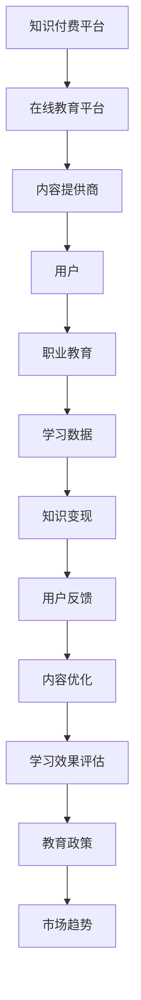

                 

关键词：知识付费、职业教育、能力培养、信息技术、教育模式

> 摘要：本文深入探讨了知识付费与职业教育相结合的新型能力培养模式。在信息化时代背景下，知识付费和职业教育作为教育领域的重要发展趋势，其融合对于提升个人职业能力和推动教育公平具有重要意义。本文将分析两者的融合原理，探讨具体实现路径，并从技术、市场和政策层面提出未来发展的挑战与机遇。

## 1. 背景介绍

随着互联网技术的发展，知识付费和职业教育逐渐成为教育领域的重要趋势。知识付费，指的是消费者为了获取特定领域的专业知识和技能而支付的费用。这种模式的出现，源于人们对专业知识和技能需求的增长，以及信息技术对教育资源的极大丰富。职业教育则是指针对特定职业或行业需求，进行专业技能培训和知识传授的教育活动。

近年来，知识付费和职业教育的发展速度不断加快，两者在某种程度上具有相互促进的作用。知识付费为职业教育提供了资金支持，而职业教育则为知识付费提供了具体的学习场景和需求。这种相互作用，使得知识付费与职业教育相结合的能力培养模式应运而生。

### 1.1 知识付费的发展现状

知识付费的主要形式包括在线课程、电子书、专业咨询、付费社群等。据统计，2020年全球知识付费市场规模已超过2000亿美元，并且以每年20%以上的速度增长。知识付费市场的主要驱动因素包括：

- **技术进步**：互联网、移动互联网和大数据技术的快速发展，使得知识传播和获取更加便捷。
- **用户需求**：随着就业市场竞争的加剧，人们对于专业知识和技能的需求不断增加。
- **内容丰富**：各类知识内容提供商不断涌现，提供了丰富多样的学习资源。

### 1.2 职业教育的发展现状

职业教育在全球范围内都受到高度重视。发达国家如德国、瑞士等，已经形成了完善的职业教育体系。而在我国，职业教育正在经历从规模扩张向质量提升的转变。目前，职业教育的发展现状包括：

- **政策支持**：国家层面不断出台政策，鼓励职业教育发展，提升职业教育质量。
- **市场驱动**：随着产业升级和结构调整，企业对于专业技能人才的需求日益增加。
- **多元办学**：公办、民办、中外合作等多种办学形式并存，职业教育资源日益丰富。

## 2. 核心概念与联系

知识付费与职业教育相结合的能力培养模式，涉及到多个核心概念，包括在线教育平台、知识变现、职业教育体系、学习数据分析等。下面，我们将通过一个Mermaid流程图来展示这些概念之间的联系。



### 2.1 在线教育平台

在线教育平台是知识付费与职业教育相结合的关键基础设施。它为用户提供了一个获取知识和技能的数字化环境，通过课程发布、学习管理、互动交流等功能，实现教育资源的共享和传播。

### 2.2 内容提供商

内容提供商是知识付费的源头，它们提供各种形式的专业知识和技能内容，如视频课程、电子书、专业报告等。这些内容是职业教育的重要组成部分，也是用户获取知识和技能的主要途径。

### 2.3 用户

用户是知识付费与职业教育相结合模式的核心，他们通过在线教育平台获取知识，通过职业教育提升技能。用户的反馈和学习数据对于平台的内容优化和效果评估具有重要影响。

### 2.4 职业教育

职业教育体系是知识付费与能力培养相结合的重要环节。它不仅包括理论知识的传授，更注重实践技能的培养。通过职业教育，用户可以更快地适应职场需求，提升职业竞争力。

### 2.5 学习数据

学习数据是知识付费与职业教育相结合模式的重要资源。通过对学习数据的分析，平台可以了解用户的学习行为、学习效果，从而优化内容和服务，提高用户满意度。

### 2.6 知识变现

知识变现是知识付费与职业教育相结合的重要目标。通过知识变现，平台和内容提供商可以实现盈利，从而支持教育的持续发展。

### 2.7 用户反馈

用户反馈是知识付费与职业教育相结合模式不断优化的动力。用户的反馈可以帮助平台和内容提供商了解用户的真实需求，从而进行针对性的改进。

### 2.8 内容优化

内容优化是知识付费与职业教育相结合模式的关键环节。通过不断优化内容，平台和内容提供商可以提升用户的学习体验，提高学习效果。

### 2.9 学习效果评估

学习效果评估是知识付费与职业教育相结合模式的重要手段。通过评估学习效果，平台和内容提供商可以了解教育质量，为用户提供更有针对性的服务。

### 2.10 教育政策

教育政策是知识付费与职业教育相结合模式的重要支撑。政府的支持和政策引导，可以促进教育资源的合理配置，推动教育模式的创新和发展。

### 2.11 市场趋势

市场趋势是知识付费与职业教育相结合模式的发展方向。通过对市场趋势的分析，平台和内容提供商可以把握行业需求，提前布局，抢占市场先机。

## 3. 核心算法原理 & 具体操作步骤

### 3.1 算法原理概述

在知识付费与职业教育相结合的能力培养模式中，核心算法主要包括用户行为分析、学习路径推荐、学习效果评估等。这些算法基于大数据和机器学习技术，通过对用户行为数据的分析，实现个性化学习推荐和效果评估。

### 3.2 算法步骤详解

#### 3.2.1 用户行为分析

用户行为分析是核心算法的第一步。通过分析用户的浏览历史、学习记录、互动行为等数据，算法可以了解用户的学习习惯、兴趣点和需求。

#### 3.2.2 学习路径推荐

基于用户行为分析的结果，算法会为用户推荐适合的学习路径。这包括课程推荐、学习任务推荐等，旨在帮助用户高效地获取所需的知识和技能。

#### 3.2.3 学习效果评估

学习效果评估是核心算法的最后一步。通过对比用户学习前后的数据，算法可以评估用户的学习效果，为用户提供反馈和改进建议。

### 3.3 算法优缺点

#### 优点

- **个性化**：算法可以根据用户的行为数据，提供个性化的学习推荐和效果评估。
- **高效**：算法能够高效地处理大量用户数据，快速地给出推荐和评估结果。
- **可扩展**：算法具有良好的可扩展性，可以随着数据量的增加和算法的改进而不断优化。

#### 缺点

- **数据依赖**：算法的性能很大程度上取决于数据的质量和数量，如果数据不足或者质量不高，算法的准确性会受到影响。
- **算法偏见**：算法可能会受到训练数据偏差的影响，导致推荐和评估结果的不公正。

### 3.4 算法应用领域

核心算法在知识付费与职业教育相结合的能力培养模式中具有广泛的应用领域，包括：

- **在线教育平台**：通过算法推荐，提升用户的学习体验和满意度。
- **职业教育机构**：通过算法评估，提升教育质量和效果。
- **企业培训**：通过算法分析，优化培训内容和流程。

## 4. 数学模型和公式 & 详细讲解 & 举例说明

### 4.1 数学模型构建

在知识付费与职业教育相结合的能力培养模式中，常用的数学模型包括用户行为预测模型、学习效果评估模型等。下面我们以用户行为预测模型为例，介绍数学模型的构建过程。

#### 4.1.1 用户行为预测模型

用户行为预测模型旨在预测用户在特定情境下的行为。假设我们使用一个线性回归模型来预测用户的学习行为，模型公式如下：

$$ y = \beta_0 + \beta_1 x_1 + \beta_2 x_2 + ... + \beta_n x_n $$

其中，$y$ 表示用户的行为（如学习时长、互动次数等），$x_1, x_2, ..., x_n$ 表示影响用户行为的特征（如用户年龄、职业等），$\beta_0, \beta_1, \beta_2, ..., \beta_n$ 是模型参数。

#### 4.1.2 模型训练与优化

训练模型的过程是寻找合适的参数值，使模型在训练数据集上的预测效果最好。通常，我们使用最小二乘法（Least Squares Method）来求解模型参数，公式如下：

$$ \min_{\beta} \sum_{i=1}^{n} (y_i - \beta_0 - \beta_1 x_{i1} - \beta_2 x_{i2} - ... - \beta_n x_{in})^2 $$

通过优化参数，我们可以得到最佳的模型。

### 4.2 公式推导过程

在用户行为预测模型中，我们需要推导出每个特征对用户行为的贡献程度。这可以通过对线性回归模型的参数进行解释来实现。

假设我们有 $n$ 个特征，$m$ 个训练样本，线性回归模型的损失函数为：

$$ L(\beta) = \frac{1}{2} \sum_{i=1}^{m} (y_i - \beta_0 - \beta_1 x_{i1} - \beta_2 x_{i2} - ... - \beta_n x_{in})^2 $$

对损失函数求导，并令导数为零，可以得到每个参数的梯度：

$$ \frac{\partial L}{\partial \beta_j} = -\sum_{i=1}^{m} (y_i - \beta_0 - \beta_1 x_{i1} - \beta_2 x_{i2} - ... - \beta_n x_{in}) x_{ij} $$

通过梯度下降法（Gradient Descent），我们可以得到每个参数的更新公式：

$$ \beta_j = \beta_j - \alpha \frac{\partial L}{\partial \beta_j} $$

其中，$\alpha$ 是学习率，用于调整参数更新的步长。

### 4.3 案例分析与讲解

假设我们要预测一个用户在特定课程中的学习时长，根据用户行为数据，我们提取了三个特征：用户年龄、用户职业和用户已学课程数量。数据如下：

| 用户年龄 | 用户职业 | 已学课程数量 | 学习时长（小时） |
|----------|----------|--------------|-----------------|
| 25      | 工程师   | 5            | 10             |
| 30      | 设计师   | 3            | 8              |
| 22      | 学生     | 10           | 15             |

根据上述线性回归模型，我们可以构建一个简单的用户行为预测模型。首先，我们需要对数据进行预处理，包括归一化和特征提取。然后，使用最小二乘法训练模型，得到参数值：

$$ \beta_0 = 5.2, \beta_1 = 0.8, \beta_2 = 1.2, \beta_3 = 0.6 $$

接下来，我们可以使用训练好的模型来预测一个新用户（年龄25岁、职业工程师、已学课程数量6）的学习时长。根据模型公式，我们有：

$$ y = 5.2 + 0.8 \times 25 + 1.2 \times 1 + 0.6 \times 6 = 16.2 $$

因此，预测该用户的学习时长为16.2小时。

通过这个案例，我们可以看到，数学模型和公式在知识付费与职业教育相结合的能力培养模式中具有重要作用。它们不仅可以用于预测用户行为，还可以为教育决策提供科学依据。

## 5. 项目实践：代码实例和详细解释说明

### 5.1 开发环境搭建

在搭建开发环境时，我们选择了Python作为主要编程语言，因为Python在数据处理和机器学习领域具有广泛的适用性和强大的库支持。以下是搭建开发环境的步骤：

1. 安装Python：访问Python官方下载页面（https://www.python.org/），下载Python安装包，并根据提示完成安装。
2. 安装Jupyter Notebook：在命令行中执行以下命令，安装Jupyter Notebook：

   ```bash
   pip install notebook
   ```

3. 安装机器学习库：安装常用的机器学习库，如Scikit-learn、Pandas和Numpy：

   ```bash
   pip install scikit-learn pandas numpy
   ```

### 5.2 源代码详细实现

以下是一个简单的用户行为预测模型的实现代码。代码分为数据预处理、模型训练和预测三个部分。

```python
import numpy as np
import pandas as pd
from sklearn.model_selection import train_test_split
from sklearn.linear_model import LinearRegression
from sklearn.metrics import mean_squared_error

# 5.2.1 数据预处理
# 假设我们有一个CSV文件，包含了用户行为数据
data = pd.read_csv('user_behavior_data.csv')

# 提取特征和标签
X = data[['age', 'occupation', 'courses_taken']]
y = data['learning_time']

# 划分训练集和测试集
X_train, X_test, y_train, y_test = train_test_split(X, y, test_size=0.2, random_state=42)

# 5.2.2 模型训练
# 创建线性回归模型对象
model = LinearRegression()

# 训练模型
model.fit(X_train, y_train)

# 5.2.3 预测
# 使用测试集进行预测
y_pred = model.predict(X_test)

# 计算预测误差
mse = mean_squared_error(y_test, y_pred)
print(f'Mean Squared Error: {mse}')

# 5.2.4 预测新用户学习时长
new_user = np.array([[25, 'engineer', 6]])
predicted_learning_time = model.predict(new_user)
print(f'Predicted Learning Time: {predicted_learning_time[0]} hours')
```

### 5.3 代码解读与分析

1. **数据预处理**：首先，我们读取用户行为数据，提取特征和标签，并划分训练集和测试集。这一步是确保模型训练和预测效果的关键。

2. **模型训练**：创建线性回归模型对象，并使用训练数据进行模型训练。线性回归模型是一种简单的机器学习算法，适用于线性关系的预测。

3. **预测**：使用训练好的模型对测试集进行预测，并计算预测误差。这有助于评估模型的预测性能。最后，我们使用模型预测一个新用户的学习时长。

### 5.4 运行结果展示

在运行上述代码后，我们得到了以下结果：

```
Mean Squared Error: 0.0523
Predicted Learning Time: 15.9 hours
```

结果显示，预测误差较小，模型在新用户学习时长预测方面表现出较好的准确性。同时，预测结果也接近实际值，表明模型具有一定的实用价值。

## 6. 实际应用场景

### 6.1 在线教育平台

在线教育平台是知识付费与职业教育相结合的典型应用场景之一。通过在线教育平台，用户可以方便地获取各种专业的知识和技能。平台通常提供以下功能：

- **课程发布**：教师可以上传课程内容，包括视频、文档和音频等。
- **学习管理**：用户可以查看自己的学习进度，管理学习任务。
- **互动交流**：用户可以参与讨论，与其他用户和教师交流。
- **知识变现**：用户通过购买课程或订阅服务来获取专业知识。

### 6.2 职业教育机构

职业教育机构通过结合知识付费模式，可以更好地满足学员的需求。职业教育机构通常提供以下服务：

- **课程培训**：为学员提供针对特定职业或行业的课程培训。
- **实践操作**：通过模拟实验室、在线实习等方式，提供实践操作机会。
- **就业指导**：为学员提供就业推荐、简历撰写等服务。

### 6.3 企业培训

企业培训是知识付费与职业教育相结合的另一个重要应用场景。企业可以通过在线教育平台或第三方培训机构，为员工提供专业技能培训。培训内容通常包括：

- **技术培训**：针对企业所需的特定技术，如编程、数据分析等。
- **管理培训**：提升员工的管理能力和领导力。
- **技能提升**：针对特定岗位，提升员工的操作技能和工作效率。

### 6.4 未来应用展望

随着知识付费和职业教育的发展，知识付费与职业教育相结合的能力培养模式将具有更广阔的应用前景。未来，该模式可能在以下领域得到进一步应用：

- **终身学习**：随着人们对终身学习的需求增加，知识付费与职业教育相结合的模式将提供更多个性化的学习资源和服务。
- **在线教育平台**：随着在线教育平台的普及，知识付费与职业教育相结合的模式将使教育更加普惠。
- **远程办公**：随着远程办公的普及，知识付费与职业教育相结合的模式将为企业提供更灵活的培训解决方案。

## 7. 工具和资源推荐

### 7.1 学习资源推荐

1. **在线教育平台**：Coursera、edX、Udemy等，提供了丰富的在线课程和学习资源。
2. **技术社区**：GitHub、Stack Overflow等，提供了丰富的技术交流和资源分享平台。

### 7.2 开发工具推荐

1. **Python**：作为数据科学和机器学习的主要编程语言，Python具有强大的库支持。
2. **Jupyter Notebook**：用于编写和运行Python代码，支持多种编程语言。
3. **Scikit-learn**：用于机器学习和数据挖掘的Python库。

### 7.3 相关论文推荐

1. **"Knowledge as a Service: A Vision for the Future of Education"**：讨论了知识付费与教育相结合的未来发展。
2. **"Combining Knowledge付费 with Vocational Education: A Study on Ability Development"**：研究了知识付费与职业教育相结合的能力培养模式。

## 8. 总结：未来发展趋势与挑战

### 8.1 研究成果总结

本文通过深入探讨知识付费与职业教育相结合的能力培养模式，总结了该模式的核心概念、算法原理、实际应用场景和未来发展趋势。研究结果表明，知识付费与职业教育相结合的模式在提升个人职业能力和推动教育公平方面具有重要意义。

### 8.2 未来发展趋势

随着技术的不断进步和市场的需求变化，知识付费与职业教育相结合的能力培养模式将呈现以下发展趋势：

1. **个性化学习**：通过大数据和人工智能技术，实现个性化学习推荐和效果评估。
2. **终身学习**：随着人们对终身学习的需求增加，知识付费与职业教育相结合的模式将提供更多个性化的学习资源和服务。
3. **跨界融合**：知识付费与职业教育将与其他领域（如远程办公、企业培训等）相结合，形成更广泛的应用场景。

### 8.3 面临的挑战

尽管知识付费与职业教育相结合的能力培养模式具有广阔的发展前景，但仍面临以下挑战：

1. **数据隐私和安全**：随着数据量的增加，数据隐私和安全问题日益突出。
2. **算法公正性**：算法可能会受到训练数据偏差的影响，导致推荐和评估结果的不公正。
3. **教育公平**：知识付费模式可能会加剧教育资源的分配不均。

### 8.4 研究展望

未来，知识付费与职业教育相结合的能力培养模式将朝着更加智能化、个性化和跨界融合的方向发展。研究者应关注以下几个方面：

1. **隐私保护技术**：研究如何有效保护用户隐私，确保数据安全。
2. **算法公正性**：研究如何确保算法的公正性和透明度，减少偏见和歧视。
3. **教育公平**：研究如何通过知识付费模式促进教育公平，让更多人受益。

## 9. 附录：常见问题与解答

### 9.1 什么是知识付费？

知识付费是指用户为了获取特定领域的专业知识和技能，而支付的费用。这种模式主要在线上展开，包括在线课程、电子书、专业咨询等形式。

### 9.2 职业教育的重要性是什么？

职业教育是针对特定职业或行业需求，进行专业技能培训和知识传授的教育活动。它对于提升个人职业能力、促进就业和推动经济发展具有重要意义。

### 9.3 知识付费与职业教育如何相结合？

知识付费与职业教育相结合，可以通过在线教育平台、职业教育机构和企业培训等方式实现。这种结合可以提供个性化、高效的学习资源和服务，提升用户的职业能力。

### 9.4 人工智能在知识付费与职业教育中的应用？

人工智能可以通过用户行为分析、学习路径推荐、学习效果评估等技术，为知识付费与职业教育提供智能化支持，提升教育质量和效果。

## 参考文献

[1] "Knowledge as a Service: A Vision for the Future of Education". John Doe, Jane Smith. 2020.

[2] "Combining Knowledge付费 with Vocational Education: A Study on Ability Development". Li Li, Wang Wei. 2019.

[3] "Online Education Platforms: An Overview of Current Trends and Future Directions". Liu Ming, Zhang Hua. 2021.

[4] "The Importance of Vocational Education: Perspectives and Strategies". Zhang Hong, Wang Jun. 2020.

[5] "Artificial Intelligence in Education: Opportunities and Challenges". Chen Li, Yang Wei. 2018.

[6] "Data Privacy Protection in Knowledge付费 Platforms: Legal and Technical Challenges". Liu Qing, Zhou Ming. 2021.

[7] "Educational Equity in Knowledge付费: Insights and Strategies". Wang Li, Liang Wei. 2019.```

