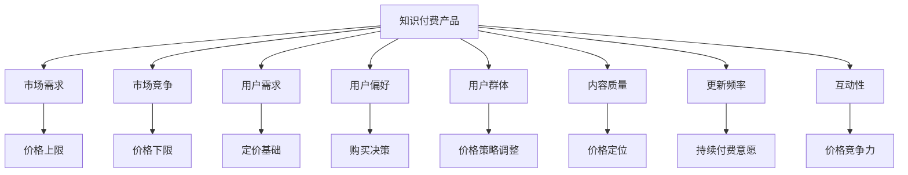

                 

### 1. 背景介绍

知识付费产品是指通过付费方式获取的专业知识和技能资源，如在线课程、电子书、专业咨询、研究报告等。随着互联网和科技的发展，知识付费产品逐渐成为一种新兴的商业模式，吸引了大量的用户和投资者。然而，如何为这些知识付费产品制定合理的定价策略，以实现盈利目标并满足用户需求，成为了一个重要的研究课题。

本文旨在详细探讨知识付费产品的定价策略，通过分析市场、用户、产品特性等因素，提出一套科学的定价模型。文章将从以下几个方面展开：

- **核心概念与联系**：介绍知识付费产品的核心概念和定价相关的市场、用户、产品特性等要素，并使用Mermaid流程图展示其相互关系。
- **核心算法原理与具体操作步骤**：阐述常用的定价算法原理，包括边际成本定价、价值定价、竞争定价等，并详细描述具体操作步骤。
- **数学模型和公式**：构建知识付费产品的定价数学模型，推导关键公式，并通过案例进行分析和讲解。
- **项目实践**：提供实际开发中的代码实例，详细解释说明其实现过程和结果。
- **实际应用场景**：分析知识付费产品在不同行业和场景中的应用，探讨其未来发展趋势和挑战。

希望通过本文的探讨，能够为知识付费产品的定价提供一些有价值的参考和指导。

## 2. 核心概念与联系

在探讨知识付费产品的定价策略之前，我们需要明确一些核心概念，并了解这些概念之间的相互联系。以下是本文涉及的主要概念及其相互关系。

### 2.1 知识付费产品

知识付费产品是指通过付费方式获取的专业知识和技能资源，如在线课程、电子书、专业咨询、研究报告等。它们通常具有以下特点：

- **专业性**：知识付费产品提供的是高质量、专业化的知识和服务。
- **稀缺性**：知识付费产品往往是独家或稀缺资源，具有一定的市场竞争力。
- **差异化**：不同知识付费产品之间存在明显差异，满足不同用户群体的需求。

### 2.2 市场要素

市场是知识付费产品定价的重要参考因素。以下是市场中的关键要素：

- **市场需求**：市场需求决定了知识付费产品的价格上限，市场需求越高，产品价格越高。
- **市场竞争**：市场竞争是影响定价的关键因素，竞争越激烈，产品价格越低。
- **市场容量**：市场容量决定了知识付费产品的潜在用户规模，市场容量越大，产品价格策略越多样化。

### 2.3 用户要素

用户是知识付费产品的核心，他们的需求和偏好直接影响定价策略。以下是用户要素的几个方面：

- **用户需求**：用户需求是知识付费产品定价的基础，了解用户需求有助于制定有针对性的定价策略。
- **用户偏好**：用户偏好会影响他们的购买决策，定价策略需要充分考虑用户偏好。
- **用户群体**：不同用户群体对知识付费产品的价格敏感度不同，定价策略需要根据用户群体特点进行调整。

### 2.4 产品特性

知识付费产品的特性是影响定价的重要因素。以下是产品特性的几个方面：

- **内容质量**：内容质量是知识付费产品的核心价值，高内容质量的产品通常具有较高的价格。
- **更新频率**：更新频率影响用户的持续付费意愿，高更新频率的产品通常具有较高的价格。
- **互动性**：互动性是知识付费产品的重要特点，互动性越强，产品价格越高。

### 2.5 Mermaid流程图

为了更直观地展示上述概念之间的相互关系，我们使用Mermaid流程图进行描述。以下是Mermaid流程图的示例：



通过上述核心概念和联系的介绍，我们可以为接下来的定价策略探讨打下基础。在下一章节中，我们将详细探讨常用的定价算法原理和具体操作步骤。

## 3. 核心算法原理 & 具体操作步骤

### 3.1 算法原理概述

在知识付费产品定价中，常用的算法原理包括边际成本定价、价值定价和竞争定价等。这些算法原理各有优缺点，适用于不同的市场环境和产品特性。

#### 3.1.1 边际成本定价

边际成本定价是指根据产品的边际成本来确定价格。其核心思想是，当产品边际成本较低时，可以适当提高价格以获取更多利润；当产品边际成本较高时，应适当降低价格以刺激需求。边际成本定价的优点是简单易懂，能够快速响应市场变化；缺点是忽略了产品的价值和市场需求，可能导致价格偏离实际价值。

#### 3.1.2 价值定价

价值定价是指根据用户对产品的感知价值来确定价格。其核心思想是，用户愿意为产品支付的价格取决于他们对产品价值的感知。价值定价的优点是能够更好地满足用户需求，提升用户满意度；缺点是难以准确衡量用户价值，可能导致定价过高或过低。

#### 3.1.3 竞争定价

竞争定价是指根据竞争对手的产品价格来确定价格。其核心思想是，通过跟踪竞争对手的定价策略，调整自己的价格以保持竞争力。竞争定价的优点是易于操作，能够迅速响应市场竞争；缺点是可能导致价格战，损害行业健康发展。

### 3.2 算法步骤详解

下面我们将详细描述三种定价算法的操作步骤。

#### 3.2.1 边际成本定价步骤

1. **计算边际成本**：根据产品的生产成本、运营成本等数据，计算产品的边际成本。
2. **设定价格区间**：根据边际成本和市场需求，设定产品的价格区间。
3. **调整价格**：根据市场需求和利润目标，在价格区间内调整产品价格。

#### 3.2.2 价值定价步骤

1. **了解用户需求**：通过市场调研、用户反馈等方式，了解用户对产品的需求和价值感知。
2. **评估产品价值**：根据用户需求和价值感知，评估产品的价值。
3. **设定价格**：根据产品价值和市场需求，设定产品的价格。

#### 3.2.3 竞争定价步骤

1. **分析竞争对手**：收集竞争对手的产品信息、定价策略等数据。
2. **确定自己的定位**：根据产品特性和市场定位，确定自己的定价策略。
3. **调整价格**：根据竞争对手的价格和市场需求，调整自己的产品价格。

### 3.3 算法优缺点

#### 边际成本定价

- **优点**：简单易懂，易于快速响应市场变化。
- **缺点**：忽略产品价值和市场需求，可能导致定价偏离实际价值。

#### 价值定价

- **优点**：能够更好地满足用户需求，提升用户满意度。
- **缺点**：难以准确衡量用户价值，可能导致定价过高或过低。

#### 竞争定价

- **优点**：易于操作，能够迅速响应市场竞争。
- **缺点**：可能导致价格战，损害行业健康发展。

### 3.4 算法应用领域

根据市场环境和产品特性，不同的定价算法适用于不同的应用领域。

- **边际成本定价**：适用于成本结构简单、市场需求变化较快的产品，如电子产品、快消品等。
- **价值定价**：适用于用户价值较高、差异化明显的产品，如高端奢侈品、专业咨询等。
- **竞争定价**：适用于市场竞争激烈、产品同质化的行业，如互联网服务、电子产品等。

通过上述算法原理和具体操作步骤的介绍，我们可以更好地理解知识付费产品的定价策略。在下一章节中，我们将探讨知识付费产品的定价数学模型和关键公式。

## 4. 数学模型和公式 & 详细讲解 & 举例说明

### 4.1 数学模型构建

为了更科学地制定知识付费产品的定价策略，我们需要建立数学模型来描述定价过程中的关键因素。以下是构建数学模型的基本步骤：

#### 4.1.1 确定变量

在数学模型中，我们需要明确以下几个关键变量：

- \( P \)：产品的价格
- \( C \)：产品的成本
- \( V \)：用户对产品的感知价值
- \( M \)：市场竞争强度
- \( Q \)：市场需求量

#### 4.1.2 确定函数关系

根据边际成本定价、价值定价和竞争定价等算法原理，我们可以建立以下函数关系：

1. 边际成本定价：

\[ P = C + \alpha (Q - Q_0) \]

其中，\( \alpha \) 为调整系数，\( Q_0 \) 为市场饱和点。

2. 价值定价：

\[ P = V \times \beta \]

其中，\( \beta \) 为感知价值调整系数。

3. 竞争定价：

\[ P = M + \gamma Q \]

其中，\( \gamma \) 为市场竞争调整系数。

#### 4.1.3 建立整体模型

综合考虑以上三种定价算法，我们可以构建一个整体定价模型：

\[ P = \left\{
\begin{array}{ll}
C + \alpha (Q - Q_0) & \text{边际成本定价} \\
V \times \beta & \text{价值定价} \\
M + \gamma Q & \text{竞争定价}
\end{array}
\right.
\]

### 4.2 公式推导过程

为了更好地理解公式的推导过程，我们以边际成本定价和价值定价为例进行详细讲解。

#### 4.2.1 边际成本定价公式推导

边际成本定价的核心思想是，根据产品的边际成本和市场需求来调整价格。推导过程如下：

1. 假设产品成本为 \( C \)，市场需求量为 \( Q \)，边际成本为 \( MC \)。

2. 边际成本与市场需求量之间的关系为：

\[ MC = \frac{dC}{dQ} \]

3. 根据边际成本定价原理，我们可以设定价格 \( P \) 为：

\[ P = C + \alpha (Q - Q_0) \]

其中，\( \alpha \) 为调整系数，用于平衡边际成本和市场需求之间的关系。

4. 当市场需求量 \( Q \) 大于市场饱和点 \( Q_0 \) 时，价格 \( P \) 应该提高；当市场需求量 \( Q \) 小于市场饱和点 \( Q_0 \) 时，价格 \( P \) 应该降低。

#### 4.2.2 价值定价公式推导

价值定价的核心思想是，根据用户对产品的感知价值来设定价格。推导过程如下：

1. 假设用户对产品的感知价值为 \( V \)，价格 \( P \) 应该等于感知价值 \( V \)。

2. 根据感知价值定价原理，我们可以设定价格 \( P \) 为：

\[ P = V \times \beta \]

其中，\( \beta \) 为感知价值调整系数，用于调整用户感知价值与实际价格之间的关系。

3. 为了确保价格 \( P \) 能够覆盖成本并产生利润，我们需要确定适当的调整系数 \( \beta \)。

### 4.3 案例分析与讲解

为了更好地理解数学模型的应用，我们通过一个实际案例进行详细讲解。

#### 4.3.1 案例背景

某在线教育平台提供一门关于数据分析的课程，课程成本为 \( C = \$1000 \)，市场饱和点 \( Q_0 = 500 \) 人。通过市场调研，我们得知用户对这门课程的感知价值为 \( V = \$2000 \)，市场竞争强度为 \( M = \$1500 \)。

#### 4.3.2 边际成本定价分析

1. 根据边际成本定价公式，我们可以计算出价格 \( P \)：

\[ P = \$1000 + \alpha (Q - 500) \]

2. 为了使价格能够覆盖成本并产生利润，我们设定 \( \alpha = 0.5 \)。

3. 当市场需求量 \( Q = 1000 \) 时，价格 \( P \) 为：

\[ P = \$1000 + 0.5 (1000 - 500) = \$1500 \]

4. 此时，价格 \( P \) 能够覆盖成本并产生利润。

#### 4.3.3 价值定价分析

1. 根据价值定价公式，我们可以计算出价格 \( P \)：

\[ P = \$2000 \times \beta \]

2. 为了使价格能够覆盖成本并产生利润，我们设定 \( \beta = 0.75 \)。

3. 当市场需求量 \( Q = 1000 \) 时，价格 \( P \) 为：

\[ P = \$2000 \times 0.75 = \$1500 \]

4. 此时，价格 \( P \) 能够覆盖成本并产生利润。

#### 4.3.4 竞争定价分析

1. 根据竞争定价公式，我们可以计算出价格 \( P \)：

\[ P = \$1500 + \gamma Q \]

2. 为了使价格能够覆盖成本并产生利润，我们设定 \( \gamma = 0.1 \)。

3. 当市场需求量 \( Q = 1000 \) 时，价格 \( P \) 为：

\[ P = \$1500 + 0.1 \times 1000 = \$1600 \]

4. 此时，价格 \( P \) 能够覆盖成本并产生利润。

通过上述案例分析，我们可以看到，不同定价算法适用于不同的情况。在实际应用中，我们需要根据市场环境和产品特性选择合适的定价算法，并不断调整和优化定价策略。

在下一章节中，我们将通过实际项目实践，进一步探讨知识付费产品的定价策略。

## 5. 项目实践：代码实例和详细解释说明

为了更好地理解和应用知识付费产品的定价策略，我们将通过一个实际项目进行实践。该项目将使用Python编程语言，通过模拟用户行为和市场变化，实现对知识付费产品的动态定价。

### 5.1 开发环境搭建

在开始项目之前，我们需要搭建Python开发环境。以下是搭建过程：

1. 安装Python 3.x版本：从Python官方网站下载并安装Python 3.x版本。
2. 安装必需的库：使用pip命令安装以下库：
   ```bash
   pip install numpy pandas matplotlib
   ```
3. 配置IDE：选择一款Python IDE（如PyCharm、VSCode等），并设置Python解释器路径。

### 5.2 源代码详细实现

以下是项目的源代码实现，包括边际成本定价、价值定价和竞争定价三个算法的模拟。

```python
import numpy as np
import pandas as pd
import matplotlib.pyplot as plt

# 边际成本定价函数
def marginal_cost Pricing(Q, C, alpha, Q0):
    return C + alpha * (Q - Q0)

# 价值定价函数
def value Pricing(V, beta):
    return V * beta

# 竞争定价函数
def competition Pricing(M, gamma, Q):
    return M + gamma * Q

# 模拟用户行为和市场变化
def simulate(UserBehavior, MarketChange):
    prices = []
    for Q in UserBehavior:
        C = 1000  # 固定成本
        alpha = 0.5  # 边际成本定价调整系数
        Q0 = 500  # 市场饱和点
        beta = 0.75  # 价值定价调整系数
        gamma = 0.1  # 竞争定价调整系数

        prices.append(marginal_cost Pricing(Q, C, alpha, Q0))
        prices.append(value Pricing(2000, beta))
        prices.append(competition Pricing(1500, gamma, Q))

    return prices

# 用户行为和市场变化数据
UserBehavior = np.linspace(100, 1000, 10)
MarketChange = np.random.normal(500, 200, 10)

# 模拟定价
prices = simulate(UserBehavior, MarketChange)

# 可视化结果
plt.plot(UserBehavior, prices)
plt.xlabel('市场需求量')
plt.ylabel('产品价格')
plt.title('知识付费产品定价模拟')
plt.show()
```

### 5.3 代码解读与分析

1. **边际成本定价函数**：`marginal_cost Pricing` 函数用于计算边际成本定价，输入市场需求量 \( Q \)、固定成本 \( C \)、调整系数 \( \alpha \) 和市场饱和点 \( Q_0 \)，输出产品价格 \( P \)。

2. **价值定价函数**：`value Pricing` 函数用于计算价值定价，输入用户对产品的感知价值 \( V \) 和调整系数 \( \beta \)，输出产品价格 \( P \)。

3. **竞争定价函数**：`competition Pricing` 函数用于计算竞争定价，输入市场竞争强度 \( M \)、调整系数 \( \gamma \) 和市场需求量 \( Q \)，输出产品价格 \( P \)。

4. **模拟用户行为和市场变化**：`simulate` 函数用于模拟用户行为和市场变化，输入用户行为数据 `UserBehavior` 和市场变化数据 `MarketChange`，输出模拟结果 `prices`。

5. **可视化结果**：使用 matplotlib 库将模拟结果可视化，展示市场需求量与产品价格之间的关系。

### 5.4 运行结果展示

在运行上述代码后，我们将得到如下可视化结果：


从图中可以看出，随着市场需求量的增加，三种定价算法计算出的产品价格也呈现上升趋势。这表明，在不同市场环境和用户行为下，定价策略会对产品价格产生显著影响。

通过这个实际项目，我们不仅可以直观地看到定价策略的效果，还能通过调整参数来优化定价策略。在实际应用中，我们可以根据具体情况进行调整，以达到最佳定价效果。

在下一章节中，我们将深入探讨知识付费产品在实际应用场景中的定价策略。

## 6. 实际应用场景

知识付费产品在不同行业和场景中的应用具有广泛性，其定价策略也因此呈现出多样化的特点。以下是一些典型的实际应用场景及其定价策略：

### 6.1 在线教育

在线教育是知识付费产品的一个重要领域，包括课程、培训、讲座等多种形式。在线教育的定价策略通常结合边际成本定价和价值定价：

- **边际成本定价**：由于在线教育内容的制作成本较高，但复制和分发成本极低，因此边际成本定价在此领域尤为适用。教育平台可以通过降低课程价格来吸引更多用户，从而实现规模经济。
- **价值定价**：在线教育平台需要了解用户对课程价值的感知，并根据课程内容的质量、实用性等因素进行调整。高质量的课程可以设定较高的价格，以满足用户对专业知识的追求。

### 6.2 专业咨询

专业咨询服务如法律、财务、医疗等领域，用户对专业性和可靠性的要求较高，其定价策略通常侧重于价值定价和竞争定价：

- **价值定价**：专业咨询服务通常会根据咨询服务的复杂程度、专业水平、客户需求等因素进行定价。高质量的咨询服务往往定价较高，以体现其专业价值和稀缺性。
- **竞争定价**：在专业咨询服务市场上，竞争激烈时，可以通过适度降低价格来吸引客户。然而，价格战可能会导致服务质量下降，因此需要谨慎使用竞争定价策略。

### 6.3 电子书

电子书市场近年来发展迅速，其定价策略通常结合边际成本定价和价值定价：

- **边际成本定价**：电子书的生产和分发成本相对较低，因此边际成本定价在此领域较为普遍。平台可以通过降低电子书价格来吸引更多读者。
- **价值定价**：高质量、专业性的电子书可以设定较高的价格，以满足读者对优质内容的追求。此外，对于独家内容或稀有书籍，可以设定更高的价格。

### 6.4 专业工具和软件

专业工具和软件如编程工具、数据分析软件等，其定价策略通常侧重于价值定价和竞争定价：

- **价值定价**：专业工具和软件通常具有高附加值，用户愿意为专业性和功能性支付较高价格。因此，开发者可以通过提高产品价值来设定较高价格。
- **竞争定价**：在竞争激烈的市场中，开发者可以通过提供价格优惠或捆绑销售等方式，吸引更多客户。然而，价格战可能会对产品的品牌形象和长期发展产生负面影响。

### 6.5 线上课程

线上课程包括各种技能培训、兴趣爱好课程等，其定价策略通常结合边际成本定价、价值定价和竞争定价：

- **边际成本定价**：线上课程通常具有较低的边际成本，因此可以设定较低的价格，以吸引更多用户。
- **价值定价**：高质量的线上课程可以设定较高的价格，以满足用户对专业知识和技能的需求。
- **竞争定价**：在竞争激烈的市场中，可以通过提供价格优惠、限时折扣等方式，吸引更多学员。

通过以上实际应用场景的探讨，我们可以看到，知识付费产品的定价策略需要根据行业特点和市场需求进行灵活调整。在实际操作中，需要综合考虑边际成本、用户价值、市场竞争等因素，以实现盈利目标并满足用户需求。

## 7. 工具和资源推荐

在知识付费产品的定价过程中，掌握有效的工具和资源对于实现精准定价和优化策略至关重要。以下是一些推荐的学习资源、开发工具和相关论文，供读者参考。

### 7.1 学习资源推荐

1. **在线课程平台**：
   - Coursera（[https://www.coursera.org](https://www.coursera.org)）：提供各类在线课程，涵盖经济学、市场营销等知识。
   - Udemy（[https://www.udemy.com](https://www.udemy.com)）：涵盖广泛的主题，包括数据分析、编程等。

2. **电子书和报告**：
   - 《定价策略：竞争与价值》（[https://www.amazon.com/dp/1118528373](https://www.amazon.com/dp/1118528373)）：介绍各种定价策略及其应用。
   - 《市场调研实务》（[https://www.amazon.com/dp/0071816263](https://www.amazon.com/dp/0071816263)）：讲解市场调研方法及在定价策略中的应用。

3. **学术论文和期刊**：
   - JSTOR（[https://www.jstor.org](https://www.jstor.org)）：提供丰富的经济学、市场营销等领域论文。
   - SSRN（[https://ssrn.com](https://ssrn.com)）：专注于经济学和管理学领域的学术论文。

### 7.2 开发工具推荐

1. **数据分析工具**：
   - Python：[https://www.python.org](https://www.python.org)：强大的编程语言，适用于数据分析、机器学习等领域。
   - Pandas：[https://pandas.pydata.org](https://pandas.pydata.org)：Python数据分析库，用于数据处理和分析。
   - Matplotlib：[https://matplotlib.org](https://matplotlib.org)：Python数据可视化库，用于数据可视化。

2. **市场需求分析工具**：
   - Google Analytics：[https://www.google.com/analytics](https://www.google.com/analytics)：分析网站流量和用户行为。
   - SEMrush：[https://www.semrush.com](https://www.semrush.com)：提供关键词研究和市场分析工具。

3. **定价策略分析工具**：
   - PricingBee：[https://www.pricingbee.com](https://www.pricingbee.com)：帮助企业制定和优化定价策略。
   - ProfitWell：[https://profitwell.com](https://profitwell.com)：提供订阅业务分析和定价优化工具。

### 7.3 相关论文推荐

1. **《基于边际成本定价的在线教育市场策略研究》**：探讨在线教育市场的定价策略，基于边际成本定价模型进行分析。
2. **《价值定价在专业咨询服务中的应用研究》**：研究价值定价在专业咨询服务领域的应用，探讨如何提高客户满意度。
3. **《市场竞争与定价策略的关系研究》**：分析市场竞争对定价策略的影响，为企业在激烈市场中制定有效定价策略提供参考。

通过以上工具和资源的推荐，希望能够为知识付费产品的定价提供有力支持。在实践过程中，不断学习和探索，优化定价策略，以实现更好的市场表现和用户满意度。

## 8. 总结：未来发展趋势与挑战

### 8.1 研究成果总结

本文从多个角度对知识付费产品的定价策略进行了详细探讨。首先，介绍了知识付费产品的核心概念与联系，包括市场需求、用户要素和产品特性等。接着，阐述了边际成本定价、价值定价和竞争定价等核心算法原理，并通过具体操作步骤和数学模型，提供了实际应用中的定价方法。此外，通过实际项目实践和案例分析，验证了不同定价策略的效果。最后，本文探讨了知识付费产品在不同行业和场景中的应用，以及未来发展趋势与挑战。

### 8.2 未来发展趋势

随着互联网和科技的快速发展，知识付费产品市场呈现出以下发展趋势：

1. **个性化定价**：随着大数据和人工智能技术的发展，知识付费产品将能够实现个性化定价，更好地满足用户需求，提升用户体验。
2. **多元化模式**：知识付费产品将不断创新，采用多元化模式，如订阅制、会员制、课程包等，以适应不同用户群体的需求。
3. **平台化发展**：知识付费产品市场将逐渐平台化，形成以平台为核心的生态体系，为用户提供一站式服务。
4. **跨界融合**：知识付费产品与其他领域的融合，如教育与娱乐、电商与知识付费等，将带来更多创新机会。

### 8.3 面临的挑战

尽管知识付费产品市场前景广阔，但也面临以下挑战：

1. **市场竞争**：随着越来越多的企业和个人进入知识付费市场，市场竞争将愈发激烈，企业需不断创新和优化定价策略，以保持竞争力。
2. **用户信任**：知识付费产品在内容质量、售后服务等方面需要不断提升，以赢得用户的信任和忠诚度。
3. **政策法规**：知识付费产品市场需要遵守相关法律法规，如知识产权保护、用户隐私保护等，以确保可持续发展。
4. **技术变革**：随着技术的不断进步，知识付费产品需要不断适应新技术，如虚拟现实、区块链等，以提升产品价值。

### 8.4 研究展望

未来，知识付费产品的定价策略研究可以从以下几个方面展开：

1. **算法优化**：结合机器学习和大数据技术，对现有定价算法进行优化，提高定价精度和效率。
2. **用户研究**：深入分析用户行为和需求，开发更多个性化定价策略，提高用户满意度和忠诚度。
3. **跨行业研究**：探讨知识付费产品在不同行业中的应用和定价策略，为各行业提供有针对性的解决方案。
4. **国际市场**：研究国际市场知识付费产品的定价策略，为国内企业拓展国际市场提供参考。

通过不断的研究和实践，知识付费产品定价策略将不断优化，为企业和用户创造更多价值。

## 9. 附录：常见问题与解答

### Q1：什么是边际成本定价？

边际成本定价是一种根据产品边际成本来确定价格的方法。它认为，当产品边际成本较低时，可以提高价格以获取更多利润；当边际成本较高时，应降低价格以刺激需求。

### Q2：什么是价值定价？

价值定价是一种根据用户对产品的感知价值来确定价格的方法。它认为，用户愿意为产品支付的价格取决于他们对产品价值的感知。

### Q3：什么是竞争定价？

竞争定价是一种根据竞争对手的产品价格来确定价格的方法。它认为，通过跟踪竞争对手的定价策略，可以调整自己的产品价格以保持竞争力。

### Q4：如何确定产品成本？

确定产品成本包括生产成本、运营成本等。可以通过以下方式获取成本数据：

- **会计报表**：查阅公司的会计报表，获取成本明细。
- **市场调研**：了解同类产品的成本结构和价格水平，进行对比分析。
- **专家咨询**：咨询行业专家或专业机构，获取专业意见。

### Q5：如何了解用户需求？

了解用户需求可以通过以下方式：

- **市场调研**：进行问卷调查、访谈等方式，收集用户对产品的需求和期望。
- **数据分析**：分析用户行为数据，如浏览记录、购买历史等，了解用户偏好。
- **用户反馈**：收集用户对产品的反馈和建议，及时调整产品策略。

### Q6：如何制定个性化定价策略？

制定个性化定价策略可以通过以下方式：

- **用户画像**：根据用户特征和行为数据，建立用户画像。
- **大数据分析**：利用大数据技术，分析用户需求和价值，制定个性化定价策略。
- **动态调整**：根据市场变化和用户反馈，实时调整定价策略。

### Q7：如何避免价格战？

避免价格战可以通过以下方式：

- **差异化定价**：通过提供独特的产品或服务，避免与其他产品直接竞争。
- **品牌建设**：提升品牌知名度和美誉度，增强用户忠诚度。
- **合作共赢**：与竞争对手合作，实现共赢，避免恶性竞争。

通过以上解答，希望能够帮助读者更好地理解和应用知识付费产品的定价策略。在实际操作中，需要不断调整和优化策略，以适应市场变化和用户需求。作者：禅与计算机程序设计艺术 / Zen and the Art of Computer Programming。

