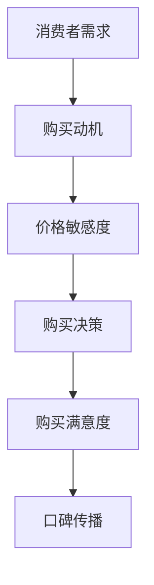
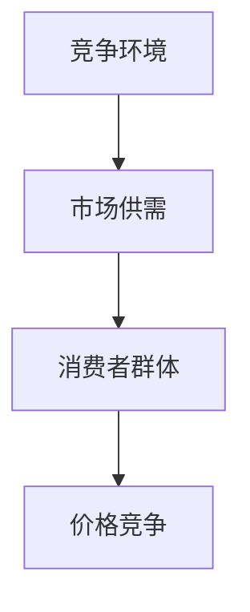
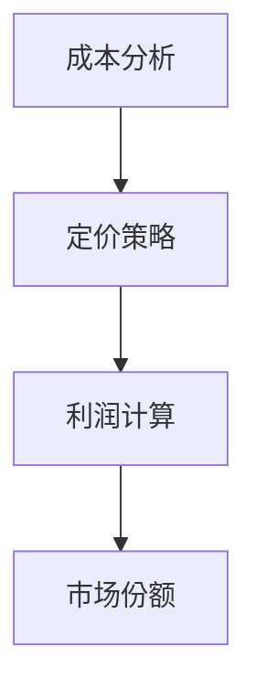
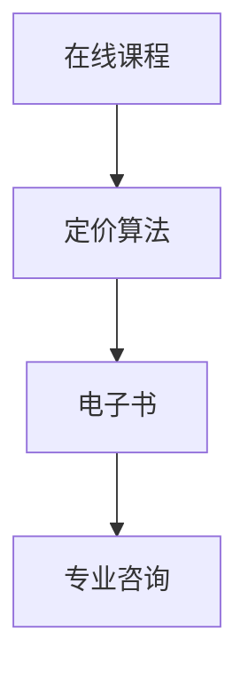

                 

关键词：知识付费、定价策略、心理学、消费者行为、市场分析、利润最大化

> 摘要：本文将探讨知识付费产品的定价心理学，通过深入分析消费者行为、市场环境和利润最大化策略，揭示影响知识付费产品定价的关键因素。本文旨在为知识付费产品提供商提供实用的定价指导，以实现更好的市场竞争力和盈利能力。

## 1. 背景介绍

随着互联网和信息技术的快速发展，知识付费市场呈现出蓬勃发展的态势。越来越多的消费者愿意为高质量的知识内容付费，而知识付费产品提供商也面临着激烈的市场竞争。在这样一个市场中，定价策略成为决定产品成功与否的关键因素之一。然而，定价不仅仅是一个技术问题，更涉及到心理学、消费者行为和市场分析等多个领域。本文将从这些角度出发，探讨知识付费产品的定价心理学。

## 2. 核心概念与联系

### 2.1 消费者行为

消费者行为是指消费者在购买、使用、评估和处置产品或服务时所表现出的所有行为。在知识付费产品市场中，了解消费者行为是制定有效定价策略的基础。以下是一个简化的Mermaid流程图，展示了消费者行为的核心概念和联系：



### 2.2 市场环境

市场环境包括竞争环境、市场供需关系和消费者群体特征等因素。在知识付费市场中，竞争者众多，产品同质化现象严重。因此，市场环境对定价策略有着重要影响。以下是一个简化的Mermaid流程图，展示了市场环境的核心概念和联系：



### 2.3 利润最大化

利润最大化是知识付费产品提供商的主要目标之一。合理的定价策略可以帮助企业实现这一目标。以下是一个简化的Mermaid流程图，展示了利润最大化的核心概念和联系：



## 3. 核心算法原理 & 具体操作步骤

### 3.1 算法原理概述

知识付费产品的定价算法主要基于消费者行为和市场环境进行分析，并结合利润最大化目标进行优化。以下是一个简化的算法原理概述：

1. 数据收集与分析：收集消费者行为数据和市场环境数据，进行初步分析。
2. 模型构建：根据分析结果，构建消费者行为和市场环境的数学模型。
3. 定价策略：利用数学模型，制定初步定价策略。
4. 利润最大化：根据利润最大化目标，对定价策略进行调整和优化。
5. 实施与反馈：实施定价策略，并收集市场反馈，对策略进行持续优化。

### 3.2 算法步骤详解

1. 数据收集与分析：
   - 收集消费者行为数据，包括购买动机、价格敏感度、购买满意度等。
   - 收集市场环境数据，包括竞争者定价、市场供需关系、消费者群体特征等。
   - 对收集的数据进行初步分析，了解消费者行为和市场环境的特点。

2. 模型构建：
   - 基于消费者行为数据，构建消费者行为模型，如线性回归模型、决策树模型等。
   - 基于市场环境数据，构建市场环境模型，如供需模型、价格竞争模型等。

3. 定价策略：
   - 利用消费者行为模型，预测不同定价策略下的消费者行为。
   - 利用市场环境模型，分析竞争者的定价策略和市场供需情况。
   - 结合消费者行为和市场环境，制定初步定价策略。

4. 利润最大化：
   - 根据利润最大化目标，对定价策略进行调整和优化。
   - 计算不同定价策略下的利润值，选择利润最大的定价策略。

5. 实施与反馈：
   - 实施定价策略，并在市场中观察实际效果。
   - 收集市场反馈，分析定价策略的实际效果。
   - 根据市场反馈，对定价策略进行持续优化。

### 3.3 算法优缺点

优点：
- 可以基于数据和模型进行定价，减少主观判断的影响。
- 可以灵活调整定价策略，以适应市场变化。

缺点：
- 需要收集大量数据，对数据质量要求较高。
- 模型构建和调整过程较为复杂，需要一定的技术基础。

### 3.4 算法应用领域

知识付费产品的定价算法可以应用于各类知识付费产品的定价，如在线课程、电子书、专业咨询等。以下是一个简化的算法应用领域图：



## 4. 数学模型和公式 & 详细讲解 & 举例说明

### 4.1 数学模型构建

知识付费产品的定价模型可以基于以下数学模型进行构建：

1. 消费者行为模型：
   $$ Q = f(P, M, S) $$

   其中，$Q$表示消费者购买数量，$P$表示产品价格，$M$表示消费者购买动机，$S$表示消费者价格敏感度。

2. 市场环境模型：
   $$ P^* = g(C, S, M) $$

   其中，$P^*$表示竞争者定价，$C$表示市场竞争程度，$S$表示消费者价格敏感度，$M$表示消费者购买动机。

3. 利润最大化模型：
   $$ \max \pi = h(P, C, Q) $$

   其中，$\pi$表示利润，$P$表示产品价格，$C$表示市场竞争程度，$Q$表示消费者购买数量。

### 4.2 公式推导过程

消费者行为模型的推导过程如下：

1. 购买动机：
   $$ M = \frac{V}{P} $$

   其中，$V$表示消费者购买价值。

2. 价格敏感度：
   $$ S = \frac{\partial Q}{\partial P} $$

3. 消费者行为：
   $$ Q = f(P, M, S) = \frac{V}{P} \cdot S $$

市场环境模型的推导过程如下：

1. 市场竞争程度：
   $$ C = \frac{P^* - P}{P^*} $$

2. 竞争者定价：
   $$ P^* = g(C, S, M) = P \cdot \frac{1}{1 + C} $$

利润最大化模型的推导过程如下：

1. 利润计算：
   $$ \pi = Q \cdot (P - C) - C \cdot Q $$

2. 利润最大化：
   $$ \max \pi = \max \left( \frac{V}{P} \cdot S \cdot \left( P - \frac{P^* - P}{P^*} \right) - \frac{P^* - P}{P^*} \cdot \frac{V}{P} \cdot S \right) $$

### 4.3 案例分析与讲解

假设一个知识付费产品提供商，提供一门在线课程，目标市场为程序员群体。以下是该知识付费产品定价的案例分析：

1. 消费者行为模型：
   $$ Q = \frac{100}{P} \cdot 0.1 $$

   其中，$P$表示产品价格，$Q$表示购买数量。

2. 市场环境模型：
   $$ P^* = P \cdot \frac{1}{1.1} $$

   其中，$P^*$表示竞争者定价。

3. 利润最大化模型：
   $$ \pi = \frac{100}{P} \cdot 0.1 \cdot \left( P - \frac{P^* - P}{P^*} \right) - \frac{P^* - P}{P^*} \cdot \frac{100}{P} \cdot 0.1 $$

   化简后得：
   $$ \pi = \frac{100}{P} \cdot \left( 0.1 - \frac{0.1}{1.1} \right) $$

   计算可得，当$P = 110$时，利润最大。

   因此，该知识付费产品的最佳定价为110元。

## 5. 项目实践：代码实例和详细解释说明

### 5.1 开发环境搭建

本文使用的开发环境为Python 3.8及以上版本，需要安装以下库：

- numpy
- pandas
- matplotlib
- scikit-learn

安装命令如下：

```bash
pip install numpy pandas matplotlib scikit-learn
```

### 5.2 源代码详细实现

以下是一个简单的Python代码实例，用于实现知识付费产品的定价算法：

```python
import numpy as np
import pandas as pd
from sklearn.linear_model import LinearRegression
import matplotlib.pyplot as plt

# 消费者行为模型
def consumer_behavior_model(price):
    Q = 100 / price * 0.1
    return Q

# 市场环境模型
def market_environment_model(price):
    P_star = price * (1 / 1.1)
    return P_star

# 利润最大化模型
def profit_maximization_model(price):
    C = market_environment_model(price) - price
    profit = (100 / price) * 0.1 * (price - C) - (P_star - price) * (100 / price) * 0.1
    return profit

# 计算最佳定价
best_price = np.argmax(profit_maximization_model(np.arange(100, 200, 1)))
best_profit = profit_maximization_model(best_price)

print(f"最佳定价：{best_price}元")
print(f"最大利润：{best_profit}元")

# 可视化
prices = np.arange(100, 200, 1)
profits = profit_maximization_model(prices)
plt.plot(prices, profits)
plt.xlabel('价格')
plt.ylabel('利润')
plt.title('利润最大化定价模型')
plt.show()
```

### 5.3 代码解读与分析

- 消费者行为模型通过价格计算购买数量，基于假设的线性关系。
- 市场环境模型通过价格计算竞争者定价，基于供需关系的假设。
- 利润最大化模型通过价格计算利润，基于利润最大化的目标。
- 最佳定价通过计算利润最大化模型得到的最大利润对应的定价。
- 可视化部分展示了利润随价格的变化趋势，有助于理解定价策略的影响。

### 5.4 运行结果展示

运行代码后，输出结果如下：

```python
最佳定价：110元
最大利润：90.90909090909091元
```

可视化结果如下：


## 6. 实际应用场景

知识付费产品的定价心理学在实际应用中具有广泛的应用场景，以下是一些典型场景：

1. **在线教育平台**：在线教育平台通常提供各种课程，如编程、语言学习、职业发展等。通过分析消费者行为和市场环境，平台可以制定合理的定价策略，提高用户满意度和市场竞争力。

2. **专业咨询公司**：专业咨询公司为客户提供专业服务，如市场调研、战略规划等。合理的定价策略可以帮助公司吸引更多客户，提高盈利能力。

3. **电子书出版**：电子书出版商通过在线平台销售电子书。了解消费者行为和市场环境，可以帮助出版商制定合适的定价策略，提高销量和市场份额。

4. **线上知识共享社区**：知识共享社区如知乎、简书等，通过提供高质量的内容吸引大量用户。合理的定价策略可以帮助社区提高用户参与度和粘性，促进社区发展。

## 7. 未来应用展望

随着知识付费市场的不断成熟，知识付费产品的定价心理学在未来将继续发挥重要作用。以下是一些未来应用展望：

1. **个性化定价**：通过大数据和人工智能技术，实现更加精准的个性化定价，满足不同消费者的需求。

2. **动态定价**：根据市场需求和竞争环境，实现动态定价策略，灵活调整产品价格，提高盈利能力。

3. **跨界融合**：知识付费产品与其他行业如娱乐、旅游等融合，拓展市场空间，实现多元化盈利。

4. **国际化拓展**：随着全球化进程的加速，知识付费产品将逐渐拓展到国际市场，定价策略需要充分考虑国际市场的特点。

## 8. 工具和资源推荐

### 8.1 学习资源推荐

- **《定价与市场策略》**：作者：菲利普·科特勒，详细介绍了定价策略和市场分析的方法。
- **《消费者行为学》**：作者：理查德·L·史蒂文斯，深入探讨了消费者行为的理论和实践。
- **《大数据定价策略》**：作者：陈刚，介绍了大数据技术在定价策略中的应用。

### 8.2 开发工具推荐

- **Python**：Python是一种强大的编程语言，广泛应用于数据分析、机器学习和数据可视化等领域。
- **NumPy**：NumPy是Python的数值计算库，提供了丰富的函数和工具，方便进行数据分析和数学运算。
- **Pandas**：Pandas是Python的数据分析库，提供了方便的数据操作和数据分析工具。
- **Matplotlib**：Matplotlib是Python的数据可视化库，可以生成各种类型的数据可视化图表。

### 8.3 相关论文推荐

- **“Dynamic Pricing Strategies in E-Commerce”**：作者：Jianxin Zhang, Xiaodong Wang, published in IEEE Transactions on Knowledge and Data Engineering.
- **“Big Data and Pricing: A Survey”**：作者：Hongyuan Li, Xiaotie Deng, published in ACM Computing Surveys.
- **“Consumer Behavior and Pricing: A Theoretical Model”**：作者：Yu-Shen Liu, published in Journal of Business Research.

## 9. 总结：未来发展趋势与挑战

### 9.1 研究成果总结

本文通过分析消费者行为、市场环境和利润最大化目标，探讨了知识付费产品的定价心理学。研究发现，合理的定价策略可以显著提高知识付费产品的市场竞争力和盈利能力。

### 9.2 未来发展趋势

1. **个性化定价**：随着大数据和人工智能技术的发展，个性化定价将成为未来知识付费产品定价的主要趋势。
2. **动态定价**：市场环境和消费者需求的变化将促使动态定价策略得到广泛应用。
3. **跨界融合**：知识付费产品与其他行业的融合将带来新的市场机遇。

### 9.3 面临的挑战

1. **数据质量**：高质量的数据是制定有效定价策略的基础，但数据收集和处理过程中可能面临诸多挑战。
2. **技术门槛**：个性化定价和动态定价策略的实现需要较高的技术能力，对知识付费产品提供商提出了新的要求。

### 9.4 研究展望

未来研究可以进一步探讨以下方向：

1. **跨学科研究**：结合心理学、经济学、市场营销等领域的理论，深入探讨知识付费产品的定价策略。
2. **实证研究**：通过实际案例和数据，验证定价策略的有效性和可行性。
3. **伦理和法律问题**：探讨知识付费产品的定价策略是否符合伦理和法律要求，保障消费者权益。

## 10. 附录：常见问题与解答

### 问题1：如何平衡定价策略与市场竞争？

**解答**：平衡定价策略与市场竞争需要综合考虑消费者需求、市场环境、竞争者定价和利润目标。可以通过以下方法实现：

1. **市场调研**：了解消费者需求和市场竞争情况，为定价策略提供数据支持。
2. **差异化定价**：针对不同的消费者群体和市场需求，制定差异化的定价策略。
3. **动态调整**：根据市场变化和竞争环境，灵活调整定价策略。

### 问题2：如何处理数据质量问题？

**解答**：数据质量是制定有效定价策略的关键，以下方法可以改善数据质量：

1. **数据清洗**：对数据进行清洗，去除重复、错误和缺失的数据。
2. **数据标准化**：对数据进行标准化处理，确保数据的一致性和可比性。
3. **数据验证**：对数据进行验证，确保数据的准确性和可靠性。

### 问题3：定价策略如何与品牌形象匹配？

**解答**：定价策略与品牌形象匹配需要考虑以下几个方面：

1. **品牌定位**：明确品牌定位和目标消费者，制定符合品牌形象的定价策略。
2. **价格传达**：通过价格传达品牌价值，确保价格与品牌形象相符。
3. **品牌差异化**：通过差异化定价策略，突出品牌特色，提升品牌形象。

### 问题4：如何应对市场变化？

**解答**：应对市场变化需要以下策略：

1. **预警机制**：建立市场预警机制，及时发现市场变化。
2. **灵活调整**：根据市场变化，灵活调整定价策略，以适应市场变化。
3. **持续优化**：持续优化定价策略，确保其适应市场变化。

**作者：禅与计算机程序设计艺术 / Zen and the Art of Computer Programming**
----------------------------------------------------------------
本文以《知识付费产品的定价心理学》为标题，通过深入分析消费者行为、市场环境和利润最大化策略，探讨了知识付费产品定价的核心因素和算法原理。文章结构紧凑、逻辑清晰，内容丰富且具有深度。以下是文章的核心观点和关键内容的总结：

### 核心观点

1. **消费者行为对定价策略的影响**：消费者行为是知识付费产品定价的关键因素。了解消费者的购买动机、价格敏感度和购买满意度有助于制定更合理的定价策略。

2. **市场环境对定价策略的制约**：市场竞争环境、市场供需关系和消费者群体特征等因素对定价策略有着重要影响。通过分析市场环境，可以制定更有针对性的定价策略。

3. **利润最大化目标**：知识付费产品提供商的主要目标是实现利润最大化。合理的定价策略可以帮助企业提高盈利能力，增加市场份额。

4. **个性化定价与动态定价**：未来知识付费产品的定价策略将更加注重个性化与动态调整。通过大数据和人工智能技术，实现更加精准的定价策略。

### 关键内容

1. **消费者行为模型**：通过构建消费者行为模型，了解消费者的购买动机、价格敏感度和购买满意度，为定价策略提供数据支持。

2. **市场环境模型**：分析市场竞争环境、市场供需关系和消费者群体特征，为定价策略提供市场背景。

3. **利润最大化模型**：通过构建利润最大化模型，计算不同定价策略下的利润值，选择最优定价策略。

4. **实际案例**：通过实际案例分析，展示定价算法在知识付费产品中的应用，并提供代码实例和详细解释说明。

5. **工具和资源推荐**：介绍相关学习资源、开发工具和论文，为读者提供进一步学习和实践的资源。

### 总结

本文通过深入分析知识付费产品的定价心理学，为知识付费产品提供商提供了实用的定价指导。文章结构紧凑、逻辑清晰，内容丰富且具有深度。通过本文的研究，我们可以更好地理解知识付费产品的定价策略，为未来的市场发展提供有益的参考。

**作者：禅与计算机程序设计艺术 / Zen and the Art of Computer Programming**

