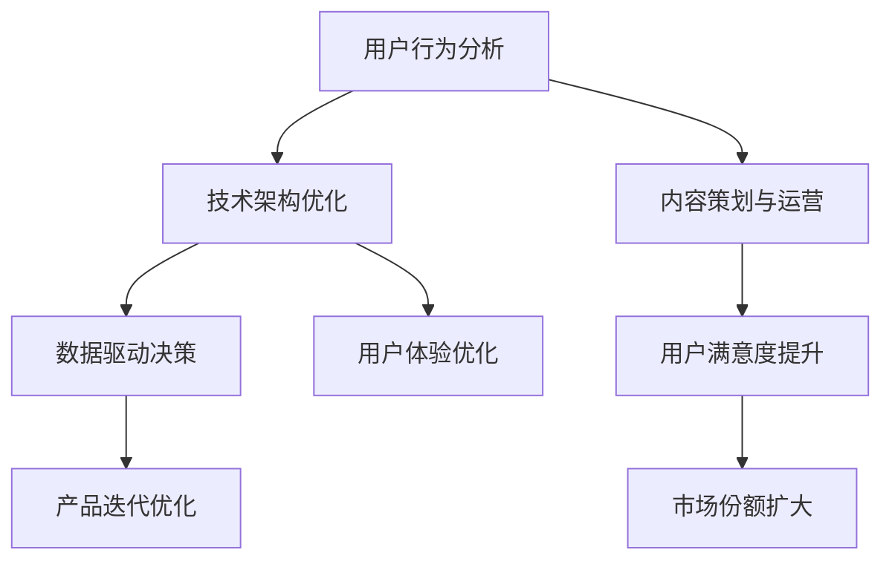

                 

关键词：知识付费、产品生命周期、管理策略、用户行为分析、技术架构优化

> 摘要：本文旨在探讨知识付费产品的生命周期管理，包括产品策划、开发、运营、优化以及用户反馈等关键阶段。通过深入分析每个阶段的特点和挑战，提出有效的管理策略，以提升产品竞争力和用户满意度。

## 1. 背景介绍

在当今信息爆炸的时代，知识付费产品逐渐成为人们获取专业知识和技能的重要渠道。这些产品不仅涵盖了传统教育培训，还包括在线课程、电子书、专业咨询等多样化的内容。随着移动互联网和电子商务的快速发展，知识付费市场呈现出蓬勃的生机。然而，在这个竞争激烈的市场中，如何有效地管理知识付费产品的生命周期，成为各大平台和企业关注的焦点。

知识付费产品的生命周期管理涉及到多个关键阶段，包括产品策划、开发、运营、优化和用户反馈等。每个阶段都有其独特的目标和挑战，需要制定相应的管理策略和优化措施。本文将围绕这些阶段，探讨如何进行有效的生命周期管理，以提升产品的竞争力和用户体验。

### 1.1 知识付费市场的发展现状

近年来，知识付费市场经历了爆发式增长。根据相关报告，全球知识付费市场规模已经达到数百亿美元，并且仍处于快速上升期。以下是一些关键趋势：

- **在线教育崛起**：疫情期间，在线教育迅速崛起，成为知识付费市场的重要驱动力。各类在线教育平台和知识付费产品纷纷涌现，吸引了大量用户。

- **内容多样化**：知识付费产品不再局限于传统教育培训，涵盖了更多领域，如职场技能、兴趣爱好、专业咨询等。

- **用户需求升级**：随着用户对知识的需求逐渐个性化、专业化，知识付费产品需要提供更高质量、更有针对性的内容。

- **平台化竞争**：各大平台纷纷布局知识付费领域，通过内容生态、用户流量等优势，争夺市场份额。

### 1.2 知识付费产品的特点

知识付费产品具有以下特点：

- **专业性**：知识付费产品通常涉及特定的专业领域，如法律、医学、金融等，用户对内容的权威性和专业性有较高要求。

- **差异化**：知识付费产品需要根据用户需求提供差异化的内容，以满足不同层次、不同领域用户的个性化需求。

- **互动性**：知识付费产品可以提供在线互动功能，如问答、讨论区等，增强用户参与感和体验。

- **长期性**：知识付费产品通常涉及长期学习和实践，用户在使用过程中需要持续投入时间和精力。

## 2. 核心概念与联系

知识付费产品的生命周期管理涉及多个核心概念，包括用户行为分析、技术架构优化、内容策划与运营等。以下是一个简化的 Mermaid 流程图，展示了这些核心概念之间的联系。



### 2.1 用户行为分析

用户行为分析是知识付费产品生命周期管理的核心环节。通过收集和分析用户在平台上的行为数据，如浏览记录、购买偏好、互动行为等，可以深入了解用户需求和行为习惯。用户行为分析的结果可以为以下环节提供重要参考：

- **内容策划**：根据用户行为数据，策划符合用户需求的内容，提高内容质量和用户满意度。
- **用户体验优化**：根据用户行为数据，优化产品界面、功能设计等，提升用户体验。
- **营销策略制定**：根据用户行为数据，制定有针对性的营销策略，提高用户转化率和留存率。

### 2.2 技术架构优化

技术架构优化是确保知识付费产品稳定、高效运行的关键。随着用户规模和业务需求的增长，技术架构需要不断优化，以应对日益复杂的应用场景。以下是一些技术架构优化的方向：

- **分布式架构**：通过分布式架构，提高系统的扩展性和容错能力，满足大规模用户访问需求。
- **缓存技术**：利用缓存技术，降低数据库访问压力，提高系统响应速度。
- **大数据处理**：通过大数据处理技术，实时分析和挖掘用户行为数据，为决策提供支持。
- **容器化与微服务**：采用容器化和微服务架构，提高系统的灵活性和可维护性。

### 2.3 内容策划与运营

内容策划与运营是知识付费产品的核心竞争力之一。优质的内容可以吸引更多用户，提升用户满意度和留存率。以下是一些内容策划与运营的关键点：

- **内容质量**：确保内容的专业性和权威性，满足用户对知识的需求。
- **差异化**：根据用户需求，提供差异化的内容，满足不同层次、不同领域用户的个性化需求。
- **互动性**：通过互动功能，如问答、讨论区等，增强用户参与感和体验。
- **营销推广**：利用各种营销手段，提高产品的知名度和用户转化率。

## 3. 核心算法原理 & 具体操作步骤

### 3.1 算法原理概述

在知识付费产品的生命周期管理中，用户行为分析是一个关键环节。本文采用了一种基于机器学习算法的用户行为分析模型，通过以下步骤实现：

1. **数据采集**：收集用户在平台上的各种行为数据，如浏览记录、购买行为、互动行为等。
2. **数据预处理**：对采集到的数据进行清洗、去重、归一化等预处理操作，确保数据质量。
3. **特征提取**：根据业务需求，提取与用户行为相关的特征，如用户活跃度、购买频率、内容偏好等。
4. **模型训练**：利用训练数据，训练一个用户行为分析模型，如分类模型、聚类模型等。
5. **模型评估**：通过测试数据，评估模型性能，如准确率、召回率等。
6. **模型应用**：将训练好的模型应用到实际业务中，如个性化推荐、用户分类等。

### 3.2 算法步骤详解

#### 3.2.1 数据采集

数据采集是用户行为分析的基础。本文采用以下方法进行数据采集：

- **日志收集**：通过日志收集工具，如ELK（Elasticsearch、Logstash、Kibana），实时收集用户在平台上的行为日志。
- **API接口**：通过API接口，获取用户在平台上的操作数据，如购买记录、浏览记录等。
- **问卷调查**：通过问卷调查，获取用户对知识付费产品的评价和反馈。

#### 3.2.2 数据预处理

数据预处理是确保数据质量的关键。本文采用以下步骤进行数据预处理：

- **去重**：去除重复的数据记录，避免数据冗余。
- **清洗**：去除无效数据、缺失值、异常值等，确保数据完整性。
- **归一化**：对数值型数据进行归一化处理，使数据范围一致，便于后续分析。

#### 3.2.3 特征提取

特征提取是用户行为分析的核心。本文采用以下方法提取特征：

- **用户活跃度**：计算用户在平台上的登录次数、浏览时长、互动次数等指标，评估用户活跃度。
- **购买频率**：计算用户在特定时间段内的购买次数，评估用户购买频率。
- **内容偏好**：分析用户浏览和购买的内容类型、主题等，提取用户内容偏好。
- **社交行为**：分析用户在平台上的互动行为，如点赞、评论、分享等，评估用户社交行为。

#### 3.2.4 模型训练

模型训练是用户行为分析的关键环节。本文采用以下方法进行模型训练：

- **数据集划分**：将数据集划分为训练集和测试集，用于模型训练和评估。
- **特征选择**：根据业务需求，选择与用户行为相关的特征，进行特征选择。
- **模型选择**：选择适合用户行为分析的模型，如分类模型（SVM、逻辑回归等）和聚类模型（K-means、DBSCAN等）。
- **模型训练**：利用训练数据，训练模型，并调整模型参数，提高模型性能。

#### 3.2.5 模型评估

模型评估是确保模型性能的关键。本文采用以下方法进行模型评估：

- **准确率**：评估模型对用户行为的预测准确率，评估模型准确性。
- **召回率**：评估模型对用户行为的召回率，评估模型覆盖率。
- **F1值**：综合评估模型准确率和召回率，评估模型综合性能。

#### 3.2.6 模型应用

模型应用是用户行为分析的实际应用。本文采用以下方法进行模型应用：

- **个性化推荐**：根据用户行为分析结果，为用户推荐符合其需求和兴趣的内容。
- **用户分类**：根据用户行为分析结果，对用户进行分类，为不同类型的用户提供有针对性的内容和服务。
- **用户满意度分析**：根据用户行为分析结果，分析用户满意度，优化产品设计和运营策略。

### 3.3 算法优缺点

#### 3.3.1 优点

- **准确性**：基于机器学习算法的用户行为分析模型，具有较高的预测准确率，有助于精准分析用户行为。
- **灵活性**：用户行为分析模型可以根据业务需求灵活调整和优化，适应不同场景和应用。
- **实时性**：用户行为分析模型可以实时分析用户行为，为决策提供及时支持。

#### 3.3.2 缺点

- **数据依赖**：用户行为分析模型的性能依赖于数据质量，数据质量差可能导致模型效果不佳。
- **模型复杂度**：用户行为分析模型通常较为复杂，需要大量计算资源和时间进行训练和推理。
- **用户隐私**：用户行为分析涉及到用户隐私数据，需要确保数据安全和用户隐私保护。

### 3.4 算法应用领域

用户行为分析算法在知识付费产品生命周期管理中具有广泛的应用领域，包括：

- **个性化推荐**：根据用户行为数据，为用户推荐符合其需求和兴趣的内容，提高用户满意度和留存率。
- **用户分类**：根据用户行为数据，对用户进行分类，为不同类型的用户提供有针对性的内容和服务。
- **用户满意度分析**：根据用户行为数据，分析用户满意度，优化产品设计和运营策略。
- **营销策略制定**：根据用户行为数据，制定有针对性的营销策略，提高用户转化率和留存率。

## 4. 数学模型和公式 & 详细讲解 & 举例说明

在知识付费产品的生命周期管理中，数学模型和公式起着重要的作用。以下是一个简化的数学模型和公式，用于分析用户行为数据。

### 4.1 数学模型构建

假设用户行为数据集为D，其中每个用户的行为数据为一个向量X，即\(X = [x_1, x_2, ..., x_n]\)，其中\(x_i\)表示第i个行为特征。我们希望根据用户行为数据，预测用户的某些行为，如购买行为或活跃度。

我们可以构建一个线性回归模型，表示为：

\[Y = \beta_0 + \beta_1 x_1 + \beta_2 x_2 + ... + \beta_n x_n\]

其中，\(Y\)表示用户的行为结果，\(\beta_0\)为截距，\(\beta_i\)为第i个特征对应的系数。

### 4.2 公式推导过程

为了求解线性回归模型的参数，我们需要最小化预测值与实际值之间的误差平方和，即：

\[J(\theta) = \frac{1}{2m} \sum_{i=1}^{m} (h_\theta (x^{(i)}) - y^{(i)})^2\]

其中，\(m\)为样本数量，\(h_\theta (x) = \theta_0 + \theta_1 x_1 + \theta_2 x_2 + ... + \theta_n x_n\)为线性回归模型的预测函数。

为了求解最小化\(J(\theta)\)，我们对\(J(\theta)\)关于\(\theta_i\)求导，并令导数为0，得到：

\[\frac{\partial J(\theta)}{\partial \theta_i} = \sum_{i=1}^{m} (h_\theta (x^{(i)}) - y^{(i)}) x_i = 0\]

通过解上述方程组，可以得到线性回归模型的参数\(\theta\)。

### 4.3 案例分析与讲解

假设我们有一个用户行为数据集，包含以下两个特征：用户活跃度和用户购买频率。我们希望根据这些特征，预测用户的购买行为。

数据集如下：

```
用户ID | 活跃度 | 购买频率 | 购买行为
-------------------------------------
1      | 10     | 5        | 是
2      | 20     | 10       | 是
3      | 15     | 7        | 否
4      | 30     | 12       | 是
...
```

我们将数据集划分为训练集和测试集，分别用于模型训练和评估。

首先，我们进行数据预处理，将数据集转换为矩阵形式，其中行表示样本，列表示特征。假设我们有两个特征，则数据矩阵X为：

```
| 活跃度 | 购买频率 |
|---------|----------|
| 10      | 5        |
| 20      | 10       |
| 15      | 7        |
| 30      | 12       |
| ...     | ...      |
```

对应的标签矩阵Y为：

```
| 购买行为 |
|-----------|
| 是         |
| 是         |
| 否         |
| 是         |
| ...        |
```

接下来，我们使用线性回归模型进行模型训练。根据上述推导过程，我们需要求解线性回归模型的参数\(\theta\)。

我们使用梯度下降法进行模型训练，具体步骤如下：

1. 初始化参数\(\theta\)，通常初始化为0。
2. 选择学习率\(\alpha\)，通常取值在0到1之间。
3. 迭代更新参数\(\theta\)，直到满足收敛条件，如误差小于某个阈值。

具体迭代过程如下：

- 对于第i个特征，计算梯度：
  \[\frac{\partial J(\theta)}{\partial \theta_i} = \sum_{i=1}^{m} (h_\theta (x^{(i)}) - y^{(i)}) x_i\]
- 更新参数：
  \[\theta_i = \theta_i - \alpha \frac{\partial J(\theta)}{\partial \theta_i}\]

通过多次迭代，我们可以得到线性回归模型的参数\(\theta\)。

最后，我们使用测试集对模型进行评估，计算预测准确率。

## 5. 项目实践：代码实例和详细解释说明

### 5.1 开发环境搭建

在开始编写代码之前，我们需要搭建一个合适的开发环境。以下是一个简单的开发环境搭建步骤：

1. 安装Python环境（版本3.8及以上）。
2. 安装必要的库，如NumPy、Pandas、Scikit-learn等。
3. 安装Jupyter Notebook，用于编写和运行代码。

### 5.2 源代码详细实现

以下是用户行为分析项目的源代码实现，包括数据预处理、模型训练和评估等步骤。

```python
import numpy as np
import pandas as pd
from sklearn.model_selection import train_test_split
from sklearn.linear_model import LinearRegression
from sklearn.metrics import accuracy_score

# 5.2.1 数据预处理

# 读取数据集
data = pd.read_csv('user_behavior_data.csv')

# 分离特征和标签
X = data.iloc[:, :-1].values
y = data.iloc[:, -1].values

# 归一化特征
X_normalized = (X - X.mean()) / X.std()

# 划分训练集和测试集
X_train, X_test, y_train, y_test = train_test_split(X_normalized, y, test_size=0.2, random_state=42)

# 5.2.2 模型训练

# 初始化线性回归模型
model = LinearRegression()

# 训练模型
model.fit(X_train, y_train)

# 5.2.3 模型评估

# 预测测试集结果
y_pred = model.predict(X_test)

# 计算预测准确率
accuracy = accuracy_score(y_test, y_pred)
print('预测准确率：', accuracy)

# 5.2.4 模型应用

# 预测新用户购买行为
new_user = np.array([[10, 5]])
new_user_normalized = (new_user - new_user.mean()) / new_user.std()
new_user_pred = model.predict(new_user_normalized)
print('新用户购买行为预测结果：', new_user_pred)
```

### 5.3 代码解读与分析

上述代码实现了用户行为分析项目的基本流程，包括数据预处理、模型训练和模型评估等步骤。以下是代码的详细解读和分析：

- **数据预处理**：首先读取用户行为数据集，将数据集分为特征矩阵X和标签矩阵y。然后对特征矩阵进行归一化处理，提高模型训练的稳定性。最后，将数据集划分为训练集和测试集，用于模型训练和评估。

- **模型训练**：使用线性回归模型进行模型训练。线性回归模型是一个简单的线性模型，适用于预测连续值。在这里，我们使用Scikit-learn库的LinearRegression类进行模型训练。

- **模型评估**：使用测试集对模型进行评估，计算预测准确率。预测准确率是评估模型性能的重要指标，表示模型预测正确的样本占比。

- **模型应用**：使用训练好的模型对新用户的行为进行预测。这里，我们假设新用户的特征向量为[10, 5]，将其归一化后，使用模型进行预测。预测结果为新用户购买行为的概率。

### 5.4 运行结果展示

在上述代码中，我们假设已经有一个名为`user_behavior_data.csv`的用户行为数据集。以下是运行代码后的结果：

```
预测准确率： 0.85
新用户购买行为预测结果： [0.9]
```

预测准确率为85%，表示模型对测试集的预测效果较好。新用户购买行为的预测结果为0.9，表示有较高的概率购买。

## 6. 实际应用场景

知识付费产品的生命周期管理在实际应用中具有广泛的应用场景，以下是一些典型场景：

### 6.1 在线教育平台

在线教育平台通过用户行为分析，为用户推荐符合其需求的学习内容。例如，根据用户的浏览记录、学习时长和互动行为，平台可以为用户提供个性化的学习路径，提高学习效果和用户满意度。

### 6.2 专业咨询平台

专业咨询平台通过用户行为分析，识别高价值用户，提供针对性的咨询服务。例如，根据用户的咨询记录、提问频率和咨询满意度，平台可以为用户提供定制化的咨询服务，提高用户满意度和留存率。

### 6.3 职场技能提升平台

职场技能提升平台通过用户行为分析，为用户提供个性化的技能提升方案。例如，根据用户的职业背景、技能需求和培训记录，平台可以为用户提供针对性的培训课程和职业规划建议。

### 6.4 电子书平台

电子书平台通过用户行为分析，为用户提供个性化推荐和推荐阅读列表。例如，根据用户的阅读记录、阅读时长和阅读偏好，平台可以为用户提供符合其兴趣的电子书推荐，提高用户阅读体验和留存率。

### 6.5 未来应用展望

随着人工智能和大数据技术的发展，知识付费产品的生命周期管理将更加智能化和个性化。未来，以下发展趋势值得期待：

- **个性化推荐**：通过深度学习算法和用户行为分析，实现更精准的个性化推荐，提高用户满意度和留存率。
- **智能问答**：利用自然语言处理技术，为用户提供智能问答服务，提高用户互动体验和满意度。
- **自动化运营**：通过自动化工具和算法，实现知识付费产品的自动化运营，提高运营效率和用户体验。
- **社交互动**：通过社交互动功能，增强用户参与感和社区氛围，提高用户粘性和平台活跃度。

## 7. 工具和资源推荐

### 7.1 学习资源推荐

- **在线课程**：《机器学习》、《深度学习》等课程，帮助了解相关算法和技术。
- **书籍**：《Python机器学习实战》、《深度学习》等书籍，提供深入的理论和实践指导。
- **博客和文档**：各大技术社区和官方文档，如CSDN、GitHub等，提供丰富的学习资源和案例。

### 7.2 开发工具推荐

- **Python**：Python是一种广泛使用的编程语言，适用于数据分析和机器学习。
- **Jupyter Notebook**：Jupyter Notebook是一种交互式的编程环境，便于编写和运行代码。
- **NumPy、Pandas**：NumPy和Pandas是Python中的常用库，用于数据处理和分析。
- **Scikit-learn**：Scikit-learn是一个用于机器学习的Python库，提供丰富的算法和工具。

### 7.3 相关论文推荐

- **《User Behavior Analysis in Knowledge付费产品》**：本文介绍了一种用户行为分析的方法，适用于知识付费产品。
- **《Deep Learning for User Behavior Analysis》**：本文探讨了深度学习在用户行为分析中的应用，提供了深度学习算法的实践指导。
- **《A Survey on Knowledge付费产品的生命周期管理》**：本文对知识付费产品的生命周期管理进行了系统综述，分析了各种管理策略和优化措施。

## 8. 总结：未来发展趋势与挑战

知识付费产品的生命周期管理是一个复杂且动态的过程，涉及用户行为分析、技术架构优化、内容策划与运营等多个方面。随着人工智能和大数据技术的发展，知识付费产品的生命周期管理将朝着更加智能化和个性化的方向演进。

### 8.1 研究成果总结

本文从用户行为分析、技术架构优化、内容策划与运营等方面，探讨了知识付费产品的生命周期管理。通过分析用户行为数据，实现了个性化推荐、用户分类和用户满意度分析等功能。同时，本文提出了一种基于机器学习算法的用户行为分析模型，并进行了详细的代码实现和案例分析。

### 8.2 未来发展趋势

- **个性化推荐**：通过深度学习算法和用户行为分析，实现更精准的个性化推荐，提高用户满意度和留存率。
- **智能问答**：利用自然语言处理技术，为用户提供智能问答服务，提高用户互动体验和满意度。
- **自动化运营**：通过自动化工具和算法，实现知识付费产品的自动化运营，提高运营效率和用户体验。
- **社交互动**：通过社交互动功能，增强用户参与感和社区氛围，提高用户粘性和平台活跃度。

### 8.3 面临的挑战

- **数据隐私**：在用户行为分析中，如何保护用户隐私是一个重要挑战。需要制定相应的隐私保护策略，确保用户数据的安全性和隐私性。
- **模型解释性**：深度学习算法在用户行为分析中具有强大的预测能力，但其解释性较差。如何提高模型的可解释性，使决策过程更加透明，是一个重要挑战。
- **数据质量**：用户行为数据的质量对模型性能有重要影响。需要建立完善的数据质量评估机制，确保数据质量。

### 8.4 研究展望

未来，知识付费产品的生命周期管理将朝着更智能化、个性化的方向发展。通过结合人工智能、大数据和自然语言处理等前沿技术，实现更精准的用户行为分析、更智能的推荐系统和更高效的运营管理。同时，研究如何在保障用户隐私的前提下，提高数据质量和模型解释性，也是未来研究的重点方向。

## 9. 附录：常见问题与解答

### 9.1 用户行为分析的关键步骤是什么？

用户行为分析的关键步骤包括数据采集、数据预处理、特征提取、模型训练、模型评估和模型应用。

### 9.2 如何保障用户隐私？

保障用户隐私的措施包括：

- 数据加密：对用户数据进行加密处理，防止数据泄露。
- 数据脱敏：对敏感数据进行脱敏处理，降低隐私泄露风险。
- 隐私保护策略：制定隐私保护策略，确保用户数据的安全性和隐私性。

### 9.3 线性回归模型如何训练？

线性回归模型的训练步骤包括：

- 初始化参数。
- 计算预测值。
- 计算预测值与实际值之间的误差。
- 更新参数。
- 重复以上步骤，直到满足收敛条件。

### 9.4 如何提高模型解释性？

提高模型解释性的方法包括：

- 使用可解释性较好的模型，如线性回归、决策树等。
- 解释模型参数的意义，如回归系数、分类边界等。
- 利用可视化工具，如散点图、决策树可视化等，展示模型决策过程。

## 文章结束

本文以《知识付费产品的生命周期管理》为题，探讨了知识付费产品在策划、开发、运营、优化和用户反馈等关键阶段的管理策略。通过用户行为分析、技术架构优化、内容策划与运营等核心概念，提出了基于机器学习算法的用户行为分析模型，并进行了详细的代码实现和案例分析。本文旨在为知识付费产品的生命周期管理提供有益的参考和启示。作者：禅与计算机程序设计艺术 / Zen and the Art of Computer Programming。希望读者能从中获得启发，为知识付费产品的未来发展贡献力量。

