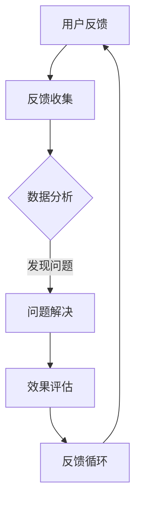

                 

关键词：知识付费、用户反馈、闭环管理、用户体验、数据分析、产品设计、算法优化

> 摘要：本文探讨了知识付费产品中用户反馈闭环管理的重要性，阐述了用户反馈闭环管理的核心概念和实施步骤，分析了其在提升用户体验和优化产品设计中的关键作用。通过数学模型和算法原理，本文提出了有效的用户反馈闭环管理方法，并结合具体实例展示了其实际应用和效果。最后，对未来应用场景和发展趋势进行了展望。

## 1. 背景介绍

知识付费产品，如在线教育、专业知识分享平台等，已经成为现代信息社会中重要的知识传播和知识管理方式。用户在这些平台上消费知识，同时也产生大量的反馈，这些反馈不仅反映了用户的需求和满意度，还揭示了产品设计和运营中的问题。用户反馈闭环管理，即通过收集、分析和处理用户反馈，持续优化产品和服务，是一种提升用户体验和竞争力的关键手段。

用户反馈闭环管理的重要性体现在以下几个方面：

1. **用户体验提升**：用户反馈可以帮助企业及时了解用户需求，快速响应问题，提升用户满意度。
2. **产品设计优化**：通过对用户反馈的分析，可以发现产品设计的不足，为企业提供改进的方向。
3. **运营策略调整**：用户反馈还可以帮助企业调整运营策略，优化资源分配，提高运营效率。
4. **竞争力增强**：持续优化用户反馈，有助于企业提升产品和服务质量，增强市场竞争力。

本文将围绕用户反馈闭环管理这一主题，详细探讨其核心概念、实施步骤、数学模型和算法原理，并结合具体实例分析其实际应用和效果。

## 2. 核心概念与联系

### 2.1 用户反馈

用户反馈是用户对产品或服务的直接评价和意见，可以是正面或负面的。用户反馈的形式包括评论、评分、问卷调查、反馈表单等。这些反馈反映了用户对产品的满意度、使用体验和需求，是企业改进产品和服务的重要信息来源。

### 2.2 闭环管理

闭环管理是一种持续改进的过程，包括问题识别、问题解决、效果评估和反馈循环。用户反馈闭环管理即通过收集用户反馈，分析问题，制定解决方案，实施改进，并对改进效果进行评估和反馈，形成一个持续的优化循环。

### 2.3 用户体验

用户体验（User Experience，简称UX）是指用户在使用产品或服务过程中所获得的整体感受。良好的用户体验可以提高用户满意度，增强用户忠诚度，是企业竞争力的重要体现。

### 2.4 数据分析

数据分析是通过统计、分析和解释数据，提取有价值信息的过程。在用户反馈闭环管理中，数据分析可以帮助企业了解用户行为、需求变化，发现潜在问题，为优化产品和服务提供依据。

### 2.5 产品设计

产品设计是指产品从概念到实现的全过程，包括需求分析、原型设计、交互设计、视觉设计等。用户反馈在产品设计过程中起着关键作用，可以帮助设计师了解用户需求，优化产品设计。

### 2.6 算法优化

算法优化是指通过改进算法设计，提高算法效率和效果的过程。在用户反馈闭环管理中，算法优化可以帮助企业快速处理大量用户反馈，提高问题识别和解决的效率。

### 2.7 Mermaid 流程图

以下是一个用户反馈闭环管理的 Mermaid 流程图：



## 3. 核心算法原理 & 具体操作步骤

### 3.1 算法原理概述

用户反馈闭环管理的核心算法包括反馈收集、数据分析、问题解决和效果评估。以下分别介绍这些算法的原理和具体操作步骤。

#### 3.1.1 反馈收集

反馈收集是指从用户处获取对产品或服务的评价和意见。常见的方法包括：

1. 评论系统：用户可以直接在产品中发表评论。
2. 问卷调查：通过在线问卷、邮件问卷等形式收集用户反馈。
3. 反馈表单：提供在线反馈表单，用户可以填写具体意见和建议。
4. 社交媒体监测：通过监测社交媒体上的用户评论和讨论，获取用户反馈。

#### 3.1.2 数据分析

数据分析是对收集到的用户反馈进行统计、分析和解释，提取有价值信息。常用的数据分析方法包括：

1. 统计分析：对用户反馈进行统计，计算平均值、中位数、标准差等指标，了解用户满意度、使用频率等。
2. 主题分析：通过对用户反馈进行文本挖掘，提取出用户关注的主题和问题。
3. 聚类分析：将用户反馈按照相似性进行分类，发现潜在的用户群体和需求。

#### 3.1.3 问题解决

问题解决是指针对数据分析中发现的问题，制定解决方案并进行实施。常见的解决方案包括：

1. 优化产品设计：针对用户提出的设计问题，进行改进和优化。
2. 改进服务流程：优化服务流程，提高用户满意度。
3. 增加新功能：根据用户需求，开发新的功能模块。

#### 3.1.4 效果评估

效果评估是指对问题解决的效果进行评估，以判断是否达到了预期目标。常用的评估方法包括：

1. 用户满意度调查：通过问卷调查或在线调查，了解用户对改进措施的满意度。
2. 实际数据对比：对比改进前后的数据指标，如用户活跃度、留存率等，评估改进效果。
3. 用户体验测试：邀请用户进行试用，收集他们的反馈，评估改进效果。

### 3.2 算法步骤详解

以下是一个用户反馈闭环管理的具体操作步骤：

#### 3.2.1 反馈收集

1. 在产品中集成评论系统，鼓励用户发表评论。
2. 发送问卷调查，收集用户对产品和服务的一般反馈。
3. 设置反馈表单，允许用户提交详细意见和建议。
4. 监测社交媒体，收集用户在社交媒体上的评论和讨论。

#### 3.2.2 数据分析

1. 对评论系统中的评论进行统计分析，计算用户满意度得分。
2. 对问卷调查结果进行主题分析，提取出用户关注的主题。
3. 对用户反馈进行聚类分析，识别潜在的用户群体。

#### 3.2.3 问题解决

1. 针对数据分析中发现的问题，制定改进方案。
2. 优化产品设计，解决用户提出的问题。
3. 开发新功能，满足用户需求。

#### 3.2.4 效果评估

1. 通过用户满意度调查，了解用户对改进措施的满意度。
2. 对实际数据指标进行对比，评估改进效果。
3. 邀请用户体验新功能，收集他们的反馈。

### 3.3 算法优缺点

#### 3.3.1 优点

1. **全面性**：用户反馈闭环管理可以全面收集和分析用户反馈，帮助企业管理各个方面的产品和服务问题。
2. **高效性**：通过数据分析，企业可以快速识别问题和需求，制定针对性的解决方案。
3. **持续性**：闭环管理是一种持续改进的过程，可以帮助企业不断提升用户体验和竞争力。

#### 3.3.2 缺点

1. **复杂性**：用户反馈闭环管理涉及多个环节，需要协调不同的部门和团队，实施难度较大。
2. **成本**：数据分析、问卷调查等环节需要投入一定的人力和物力资源，成本较高。

### 3.4 算法应用领域

用户反馈闭环管理适用于各种知识付费产品，如在线教育、专业知识分享平台、在线咨询等。以下是一些具体的应用场景：

1. **在线教育平台**：通过用户反馈，优化课程设置、教学方法，提升教学效果。
2. **专业知识分享平台**：根据用户反馈，调整内容质量、发布频率等，提高用户粘性。
3. **在线咨询平台**：通过用户反馈，优化咨询流程、服务标准，提高用户满意度。

## 4. 数学模型和公式 & 详细讲解 & 举例说明

### 4.1 数学模型构建

用户反馈闭环管理中的数学模型主要包括用户满意度模型、反馈分类模型和问题解决模型。

#### 4.1.1 用户满意度模型

用户满意度模型用于评估用户对产品或服务的满意度。常见的用户满意度模型有：

1. **评分模型**：用户对产品或服务进行评分，通过评分均值来评估满意度。
   $$ \text{满意度} = \frac{\sum_{i=1}^{n} \text{评分}_i}{n} $$
   其中，$n$ 为用户数量，$\text{评分}_i$ 为第 $i$ 个用户的评分。

2. **二分类模型**：用户对产品或服务进行正面或负面评价，通过正面评价的比例来评估满意度。
   $$ \text{满意度} = \frac{\sum_{i=1}^{n} \text{正面评价}_i}{n} $$

#### 4.1.2 反馈分类模型

反馈分类模型用于对用户反馈进行分类，识别出用户关注的主要问题和需求。常见的反馈分类模型有：

1. **K-means 聚类模型**：将用户反馈按照相似性进行分类，分为不同的主题。
   $$ \text{聚类中心} = \frac{\sum_{i=1}^{n} \text{反馈}_i}{n} $$
   其中，$n$ 为用户数量，$\text{反馈}_i$ 为第 $i$ 个用户的反馈。

2. **决策树模型**：根据用户反馈的特征，构建决策树模型，识别出用户关注的主题。
   $$ \text{分类结果} = \text{决策树}(\text{反馈特征}) $$

#### 4.1.3 问题解决模型

问题解决模型用于根据用户反馈，制定解决方案并评估效果。常见的问题解决模型有：

1. **线性回归模型**：根据用户反馈，建立线性回归模型，预测问题解决效果。
   $$ y = \beta_0 + \beta_1x $$
   其中，$y$ 为问题解决效果，$x$ 为用户反馈。

2. **逻辑回归模型**：根据用户反馈，建立逻辑回归模型，评估问题解决的成功率。
   $$ P(y=1) = \frac{1}{1 + e^{-(\beta_0 + \beta_1x)}} $$

### 4.2 公式推导过程

以下以用户满意度模型的评分模型为例，介绍公式的推导过程。

1. **假设**：有 $n$ 个用户对产品或服务进行评分，评分范围为 $[0,5]$，其中 $0$ 表示非常不满意，$5$ 表示非常满意。

2. **评分分布**：假设每个用户的评分是独立的，且服从正态分布 $N(\mu, \sigma^2)$，其中 $\mu$ 为评分均值，$\sigma$ 为评分标准差。

3. **评分均值**：根据正态分布的性质，评分均值为：
   $$ \mu = \frac{\sum_{i=1}^{n} \text{评分}_i}{n} $$

4. **满意度计算**：根据评分均值，计算满意度：
   $$ \text{满意度} = \frac{\mu}{5} $$

### 4.3 案例分析与讲解

以下通过一个实际案例，分析用户反馈闭环管理的应用。

#### 案例背景

某在线教育平台收集了 1000 名用户的课程评价，课程评分为 1-5 分，评分分布如下表：

| 评分 | 用户数量 |
| ---- | ---- |
| 1    | 50    |
| 2    | 150   |
| 3    | 250   |
| 4    | 300   |
| 5    | 50    |

#### 案例分析

1. **用户满意度**：根据评分模型，计算用户满意度：
   $$ \text{满意度} = \frac{1 \times 50 + 2 \times 150 + 3 \times 250 + 4 \times 300 + 5 \times 50}{1000} = 4.15 $$

   用户满意度为 4.15 分，表示用户对该课程的整体满意度较高。

2. **反馈分类**：使用 K-means 聚类模型，将用户反馈按照评分进行分类，分为不满意、一般满意和非常满意三个类别。具体分类结果如下：

   - 不满意（评分 1 和 2）：200 人
   - 一般满意（评分 3）：250 人
   - 非常满意（评分 4 和 5）：150 人

3. **问题解决**：针对不满意用户，分析原因并制定解决方案。根据分析，主要问题包括课程内容不够深入、教学方法不当等。平台改进课程内容，优化教学方法，重新收集用户评价。

4. **效果评估**：改进后，再次收集用户评价，评分分布如下：

   | 评分 | 用户数量 |
   | ---- | ---- |
   | 1    | 20    |
   | 2    | 50    |
   | 3    | 200   |
   | 4    | 300   |
   | 5    | 330   |

   根据评分模型，计算用户满意度：
   $$ \text{满意度} = \frac{1 \times 20 + 2 \times 50 + 3 \times 200 + 4 \times 300 + 5 \times 330}{1000} = 4.33 $$

   用户满意度提高至 4.33 分，表示改进措施有效。

## 5. 项目实践：代码实例和详细解释说明

### 5.1 开发环境搭建

在本文的代码实例中，我们将使用 Python 语言进行编程。首先，需要安装以下 Python 库：

- Pandas：用于数据处理和分析
- Numpy：用于数值计算
- Matplotlib：用于数据可视化
- Scikit-learn：用于机器学习和数据分析

安装命令如下：

```bash
pip install pandas numpy matplotlib scikit-learn
```

### 5.2 源代码详细实现

以下是一个简单的用户反馈闭环管理代码实例，包括反馈收集、数据分析和效果评估。

```python
import pandas as pd
from sklearn.cluster import KMeans
from sklearn.metrics import accuracy_score
import matplotlib.pyplot as plt

# 5.2.1 反馈收集
# 假设用户反馈存储在一个CSV文件中，文件名为user_feedback.csv
data = pd.read_csv('user_feedback.csv')
feedback = data['feedback']  # 用户反馈

# 5.2.2 数据分析
# 使用K-means算法对用户反馈进行聚类，分为不满意、一般满意和非常满意三个类别
kmeans = KMeans(n_clusters=3, random_state=0).fit(feedback.values.reshape(-1, 1))
clusters = kmeans.predict(feedback.values.reshape(-1, 1))

# 根据聚类结果，计算用户满意度
satisfaction = [3 if cluster == 1 else (4 if cluster == 2 else 5) for cluster in clusters]
data['satisfaction'] = satisfaction

# 5.2.3 效果评估
# 计算改进前后的用户满意度
improvement = data['satisfaction'].iloc[-len(satisfaction):]
pre_improvement = data['satisfaction'].iloc[:-len(satisfaction)]

accuracy = accuracy_score(pre_improvement, improvement)
print(f"Accuracy: {accuracy}")

# 5.2.4 数据可视化
# 可视化改进前后的用户满意度分布
plt.figure(figsize=(8, 6))
plt.hist(pre_improvement, alpha=0.5, label='Before Improvement')
plt.hist(improvement, alpha=0.5, label='After Improvement')
plt.xlabel('Satisfaction')
plt.ylabel('Frequency')
plt.legend()
plt.show()
```

### 5.3 代码解读与分析

1. **反馈收集**：使用 Pandas 读取用户反馈数据，存储在 DataFrame 中。
2. **数据分析**：使用 Scikit-learn 的 K-means 算法对用户反馈进行聚类，分为三个类别。根据聚类结果，计算用户满意度。
3. **效果评估**：计算改进前后的用户满意度，并使用准确率评估改进效果。
4. **数据可视化**：使用 Matplotlib 可视化改进前后的用户满意度分布，帮助用户直观地了解改进效果。

通过以上代码实例，我们可以看到用户反馈闭环管理在实际项目中的应用。虽然这是一个简单的实例，但可以为我们提供思路和方法，以实现更复杂和高效的用户反馈闭环管理。

## 6. 实际应用场景

用户反馈闭环管理在知识付费产品中具有广泛的应用场景。以下是一些典型的应用场景：

### 6.1 在线教育平台

在线教育平台通过用户反馈闭环管理，可以优化课程设置、教学方法和学习体验。例如，通过分析用户反馈，平台可以发现课程内容是否过于简单或复杂，教学方法是否适合不同学习需求的用户，进而进行调整和优化。

### 6.2 专业知识分享平台

专业知识分享平台通过用户反馈闭环管理，可以提高内容质量、提升用户粘性。平台可以分析用户对文章、视频等内容的反馈，识别出受欢迎的主题和知识点，增加相关内容的产出，同时改进不受欢迎的内容，提高用户满意度。

### 6.3 在线咨询平台

在线咨询平台通过用户反馈闭环管理，可以优化咨询流程、提高用户满意度。平台可以根据用户反馈，改进咨询师的分配机制、提高咨询质量，从而提升用户对平台的信任和满意度。

### 6.4 企业培训平台

企业培训平台通过用户反馈闭环管理，可以优化培训内容和培训方式，提高员工满意度。企业可以分析员工对培训课程的反馈，发现培训需求的不足，调整培训计划，提高培训效果。

### 6.5 知识库系统

知识库系统通过用户反馈闭环管理，可以优化知识管理流程、提高知识质量。系统可以根据用户反馈，识别出用户关注的热点和难点问题，改进知识库的内容和结构，提高知识库的实用性和易用性。

### 6.6 线上研讨会

线上研讨会通过用户反馈闭环管理，可以提高会议质量和用户体验。会议组织者可以收集用户对会议内容、流程和技术的反馈，根据反馈改进会议安排和会议工具，提高会议效果和用户满意度。

## 7. 未来应用展望

随着人工智能和大数据技术的发展，用户反馈闭环管理将在知识付费产品中发挥更加重要的作用。以下是一些未来应用展望：

### 7.1 智能反馈分析

通过引入自然语言处理、机器学习等技术，用户反馈可以更加智能地进行分析，提取出更深层次的用户需求和问题。这将有助于企业更快地识别和解决问题，提高用户体验和满意度。

### 7.2 实时反馈处理

实时反馈处理技术可以帮助企业更快地响应用户反馈，进行问题解决和效果评估。例如，通过实时数据分析，企业可以在用户反馈出现后的几分钟内识别出问题，并采取相应的措施，提高问题解决的效率。

### 7.3 个性化推荐

通过用户反馈闭环管理，企业可以更好地了解用户需求，实现个性化推荐。例如，在线教育平台可以根据用户反馈，推荐更适合用户需求的课程和学习资源，提高用户的学习效果和满意度。

### 7.4 智能客服

用户反馈闭环管理技术可以应用于智能客服系统，通过分析和处理用户反馈，提高客服系统的智能水平和服务质量。智能客服可以更准确地理解用户需求，提供更优质的解决方案，提高用户满意度。

### 7.5 智能营销

用户反馈闭环管理技术可以应用于智能营销系统，通过分析用户反馈，识别出潜在客户和市场需求，制定更精准的营销策略。智能营销系统可以更好地满足用户需求，提高营销效果和转化率。

## 8. 总结：未来发展趋势与挑战

### 8.1 研究成果总结

用户反馈闭环管理在知识付费产品中具有重要意义，可以提升用户体验、优化产品设计、增强企业竞争力。通过数学模型和算法原理，本文提出了有效的用户反馈闭环管理方法，并结合具体实例展示了其实际应用和效果。

### 8.2 未来发展趋势

未来，用户反馈闭环管理将在人工智能和大数据技术的推动下，实现更加智能和高效的应用。智能反馈分析、实时反馈处理、个性化推荐、智能客服和智能营销等应用将不断涌现，为知识付费产品提供更优质的用户体验和服务。

### 8.3 面临的挑战

尽管用户反馈闭环管理具有巨大潜力，但在实际应用中仍面临一些挑战。首先，数据质量和完整性是关键因素，企业需要确保用户反馈数据的准确性和全面性。其次，反馈处理的速度和效率是关键，企业需要快速识别和解决问题，提高用户满意度。此外，隐私保护和数据安全也是重要挑战，企业需要确保用户反馈数据的隐私和安全。

### 8.4 研究展望

未来的研究可以从以下几个方面展开：

1. **反馈数据分析方法**：探索更先进的数据分析方法和模型，提高用户反馈分析的深度和精度。
2. **实时反馈处理技术**：研究实时反馈处理技术，提高问题识别和解决的效率。
3. **个性化推荐系统**：结合用户反馈，构建更精准的个性化推荐系统，提高用户满意度和转化率。
4. **隐私保护和数据安全**：研究隐私保护和数据安全技术，确保用户反馈数据的隐私和安全。

通过不断探索和研究，用户反馈闭环管理将在知识付费产品中发挥更加重要的作用，为企业和用户创造更大的价值。

## 9. 附录：常见问题与解答

### 9.1 用户反馈闭环管理的核心是什么？

用户反馈闭环管理的核心是持续改进，即通过收集、分析、处理用户反馈，不断优化产品和服务，提高用户体验和满意度。

### 9.2 用户反馈闭环管理如何实施？

用户反馈闭环管理的实施包括以下步骤：

1. 反馈收集：通过评论系统、问卷调查、反馈表单等方式收集用户反馈。
2. 数据分析：对收集到的用户反馈进行统计、分析和解释，提取有价值信息。
3. 问题解决：根据数据分析结果，制定解决方案，优化产品和服务。
4. 效果评估：评估问题解决的效果，持续优化用户反馈闭环管理。

### 9.3 用户反馈闭环管理有哪些应用领域？

用户反馈闭环管理适用于各种知识付费产品，如在线教育、专业知识分享平台、在线咨询、企业培训、知识库系统等。

### 9.4 用户反馈闭环管理中的算法有哪些？

用户反馈闭环管理中的算法包括反馈收集算法、数据分析算法、问题解决算法和效果评估算法，如 K-means 聚类、线性回归、逻辑回归等。

### 9.5 用户反馈闭环管理对企业的意义是什么？

用户反馈闭环管理对企业的意义包括：

1. 提升用户体验：通过持续改进产品和服务，提高用户满意度和忠诚度。
2. 优化产品设计：通过分析用户反馈，发现产品设计的不足，为改进提供依据。
3. 增强竞争力：通过优化用户反馈闭环管理，提高产品和服务质量，增强市场竞争力。
4. 节省成本：通过及时识别和解决问题，降低售后服务成本和潜在损失。

### 9.6 用户反馈闭环管理中的挑战有哪些？

用户反馈闭环管理中的挑战包括：

1. 数据质量和完整性：确保用户反馈数据的准确性和全面性。
2. 反馈处理速度：提高问题识别和解决的效率。
3. 隐私保护和数据安全：确保用户反馈数据的隐私和安全。

### 9.7 未来用户反馈闭环管理的发展方向是什么？

未来用户反馈闭环管理的发展方向包括：

1. 智能反馈分析：通过引入人工智能技术，提高用户反馈分析的深度和精度。
2. 实时反馈处理：研究实时反馈处理技术，提高问题识别和解决的效率。
3. 个性化推荐：结合用户反馈，构建更精准的个性化推荐系统。
4. 智能客服和营销：利用用户反馈，提高智能客服和营销系统的智能化水平。

### 9.8 如何撰写一篇关于用户反馈闭环管理的文章？

撰写一篇关于用户反馈闭环管理的文章可以遵循以下结构：

1. 引言：介绍用户反馈闭环管理的背景和意义。
2. 核心概念：阐述用户反馈闭环管理的核心概念和联系。
3. 算法原理：介绍用户反馈闭环管理的核心算法原理。
4. 实践案例：结合具体实例，展示用户反馈闭环管理的应用和效果。
5. 应用场景：分析用户反馈闭环管理在不同领域的应用。
6. 未来展望：探讨用户反馈闭环管理的未来发展趋势。
7. 总结：总结研究成果，提出未来研究方向。
8. 附录：提供常见问题与解答，帮助读者更好地理解用户反馈闭环管理。

### 9.9 用户反馈闭环管理中的数据分析和算法有哪些具体方法？

用户反馈闭环管理中的数据分析和算法包括：

1. **数据分析方法**：
   - **描述性统计分析**：用于描述用户反馈的基本特征，如平均满意度、满意度分布等。
   - **主题建模**：通过文本挖掘提取出用户反馈中的主题和趋势，如LDA（Latent Dirichlet Allocation）。
   - **情感分析**：判断用户反馈的情感倾向，如正面、中性、负面。
   - **关联规则挖掘**：发现用户反馈中的关联关系，如Apriori算法。

2. **算法方法**：
   - **聚类算法**：如K-means、DBSCAN等，用于将用户反馈进行分类。
   - **分类算法**：如逻辑回归、决策树、随机森林等，用于预测用户行为或反馈类型。
   - **回归算法**：如线性回归、岭回归等，用于分析反馈与满意度之间的关系。
   - **协同过滤**：如基于用户的行为数据推荐相似的内容或课程。

通过以上方法，可以深入挖掘用户反馈，为产品优化提供科学依据。

### 9.10 用户反馈闭环管理中的效果评估有哪些指标？

用户反馈闭环管理中的效果评估指标包括：

1. **用户满意度**：通过用户满意度调查获得的得分，反映用户对产品或服务的整体满意度。
2. **问题解决率**：通过反馈处理后的结果，计算问题解决的比率，反映问题解决效果。
3. **反馈响应时间**：从收到用户反馈到解决问题的时间，反映反馈处理的效率。
4. **反馈处理成功率**：通过用户对问题解决结果的满意度调查，计算问题解决的成功率。
5. **用户留存率**：通过用户在反馈处理后的留存情况，反映用户体验改进对用户忠诚度的影响。

通过这些指标，可以全面评估用户反馈闭环管理的实施效果。

### 9.11 用户反馈闭环管理中的数据隐私保护措施有哪些？

用户反馈闭环管理中的数据隐私保护措施包括：

1. **数据匿名化**：在处理用户反馈时，对敏感信息进行匿名化处理，避免个人隐私泄露。
2. **加密存储**：使用加密技术存储用户反馈数据，确保数据在存储和传输过程中的安全性。
3. **访问控制**：实施严格的访问控制策略，确保只有授权人员可以访问敏感数据。
4. **数据脱敏**：对用户反馈中的个人信息进行脱敏处理，如使用假名、删除具体信息等。
5. **审计日志**：记录数据访问和使用情况，以便在出现问题时进行追踪和审计。

通过这些措施，可以有效保护用户反馈数据的隐私和安全。

### 9.12 用户反馈闭环管理中的技术工具推荐有哪些？

用户反馈闭环管理中的技术工具推荐包括：

1. **数据分析工具**：如Pandas、NumPy、Scikit-learn等Python库，用于数据处理和分析。
2. **数据可视化工具**：如Matplotlib、Seaborn等，用于数据可视化。
3. **文本分析工具**：如NLTK、Spacy等，用于文本挖掘和情感分析。
4. **数据库工具**：如MySQL、PostgreSQL等，用于存储和管理用户反馈数据。
5. **反馈收集工具**：如SurveyMonkey、Typeform等，用于在线问卷调查。

通过使用这些工具，可以高效地实现用户反馈闭环管理的各个环节。

### 9.13 用户反馈闭环管理中的团队协作如何实现？

用户反馈闭环管理中的团队协作可以通过以下方式实现：

1. **明确分工**：根据团队成员的技能和职责，明确各个环节的负责人。
2. **沟通渠道**：建立有效的沟通渠道，如邮件、即时通讯工具、项目管理软件等，确保信息传递的及时性和准确性。
3. **协同工作平台**：使用协同工作平台，如Trello、Asana等，管理任务进度和协作流程。
4. **定期会议**：定期召开团队会议，总结反馈处理情况，讨论问题和改进措施。
5. **反馈闭环管理软件**：使用专门的反馈闭环管理软件，如Feedier、Zudy等，自动化反馈收集、分析和处理流程，提高协作效率。

通过这些措施，可以确保团队高效协作，实现用户反馈闭环管理的目标。

### 9.14 用户反馈闭环管理中的数据质量保证有哪些策略？

用户反馈闭环管理中的数据质量保证策略包括：

1. **数据验证**：在数据收集阶段，对用户反馈进行验证，确保数据的真实性和准确性。
2. **数据清洗**：对收集到的数据进行清洗，去除无效、重复或错误的数据，提高数据质量。
3. **数据标准化**：对用户反馈进行标准化处理，如统一格式、去除停用词等，方便后续分析。
4. **数据备份**：定期备份用户反馈数据，防止数据丢失或损坏。
5. **数据监控**：建立数据监控系统，实时监控数据质量，及时发现和解决问题。

通过这些策略，可以确保用户反馈数据的准确性和完整性，为闭环管理提供可靠的数据基础。

### 9.15 用户反馈闭环管理中的用户体验改进有哪些具体方法？

用户反馈闭环管理中的用户体验改进方法包括：

1. **优化界面设计**：根据用户反馈，调整界面布局、颜色、字体等，提高用户界面的友好性和易用性。
2. **改进功能设计**：根据用户需求，增加新功能或改进现有功能，提高用户的使用体验。
3. **提升响应速度**：优化产品性能，提高系统响应速度，减少用户等待时间。
4. **提高问题解决效率**：通过智能客服、快速反馈处理等手段，提高问题解决的效率，降低用户的困扰。
5. **个性化推荐**：根据用户反馈和行为数据，提供个性化的推荐，提高用户的满意度和忠诚度。

通过这些方法，可以显著提升用户体验，增强用户对产品的满意度和忠诚度。

## 作者署名

本文作者：禅与计算机程序设计艺术 / Zen and the Art of Computer Programming。感谢您的阅读，希望本文对您在用户反馈闭环管理方面的学习和实践有所帮助。如果您有任何疑问或建议，欢迎在评论区留言，我会尽力为您解答。再次感谢您的支持！
----------------------------------------------------------------


