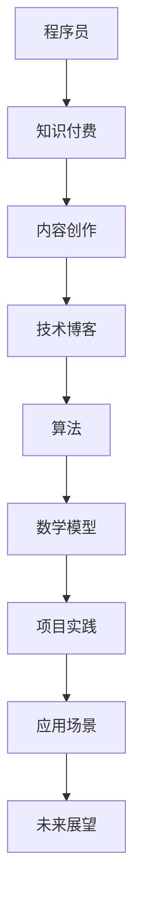

                 

关键词：知识付费，内容创作，程序员，技术博客，算法，数学模型，实践应用

> 摘要：本文将探讨程序员在进行知识付费内容创作时所需掌握的核心技能和策略。通过深入分析算法原理、数学模型构建以及项目实践，旨在为程序员提供一套行之有效的创作指南，帮助他们创作出高质量的技术博客，提升个人品牌价值。

## 1. 背景介绍

随着互联网的快速发展，知识付费逐渐成为知识传播和共享的重要形式。程序员作为知识付费的主要生产者和消费者，他们在内容创作方面的能力和水平直接影响到个人品牌价值和影响力。如何创作出既有深度又具有实用性的技术博客，是每一位程序员都需要思考和探索的问题。

本文将围绕以下几个方面展开讨论：

- **核心概念与联系**：通过Mermaid流程图展示技术领域的核心概念和联系，帮助读者建立整体认知框架。
- **核心算法原理与操作步骤**：深入解析算法原理和具体操作步骤，使读者能够理解并应用这些技术。
- **数学模型和公式**：详细讲解数学模型的构建和公式推导过程，为技术分析提供坚实的理论基础。
- **项目实践**：通过代码实例，展示实际操作过程，帮助读者将理论知识转化为实际能力。
- **实际应用场景**：探讨算法和模型在不同领域的应用，以及未来的发展趋势。

## 2. 核心概念与联系

为了帮助读者更好地理解技术领域的核心概念，我们使用Mermaid流程图来展示这些概念之间的联系。以下是技术博客创作中的一些关键概念：



### 程序员

程序员是负责编写、调试和维护计算机软件的专业人员。他们的核心能力包括编程语言掌握、算法设计和问题解决。

### 知识付费

知识付费是指用户为获取专业知识、技能或信息而支付的费用。它为程序员提供了创作高质量内容的动力和回报。

### 内容创作

内容创作是程序员展示其专业知识和技能的重要途径。技术博客是其中的一种重要形式，它可以帮助程序员建立个人品牌，吸引更多的关注和合作机会。

### 技术博客

技术博客是程序员分享知识和经验的重要平台。一篇高质量的技术博客不仅需要深入的技术分析，还需要清晰的逻辑结构和易于理解的表达。

### 算法

算法是解决特定问题的一系列步骤。它们是程序员的核心技能之一，广泛应用于数据结构、机器学习、人工智能等领域。

### 数学模型

数学模型是使用数学语言描述现实世界问题的一种方法。它们在算法设计和性能分析中起着至关重要的作用。

### 项目实践

项目实践是将理论知识应用到实际场景中的过程。通过实际操作，程序员可以更好地理解技术的应用和价值。

### 应用场景

应用场景是指算法和模型在不同领域中的应用。了解这些应用场景可以帮助程序员更好地理解技术的实际价值。

### 未来展望

未来展望涉及技术的未来发展、趋势和挑战。了解这些可以帮助程序员把握行业动态，提升自身竞争力。

## 3. 核心算法原理与具体操作步骤

### 3.1 算法原理概述

算法原理是程序员的基石。本文将重点介绍快速排序算法，这是程序员必须掌握的一种基本排序算法。快速排序采用分治策略，将一个序列分成两个子序列，其中一个子序列的所有元素都比另一个子序列的元素小。这种方法使得快速排序具有很高的效率。

### 3.2 算法步骤详解

快速排序的基本步骤如下：

1. 选择一个基准元素（pivot）。
2. 将小于基准元素的元素移到其左侧，大于基准元素的元素移到其右侧。
3. 递归地对左右两个子序列进行快速排序。

以下是快速排序的伪代码实现：

```plaintext
快速排序(A):
    如果 A 的长度小于等于 1，返回 A
    选择 A 的最后一个元素作为基准元素（pivot）
    将 A 分成两个子序列 B 和 C，其中 B 中的元素都小于 pivot，C 中的元素都大于 pivot
    递归快速排序 B 和 C
    将 B、pivot 和 C 连接起来，得到排序后的序列
```

### 3.3 算法优缺点

快速排序具有以下优点：

- **平均时间复杂度为 O(nlogn)**，效率高。
- **原地排序**，不需要额外的存储空间。

但快速排序也存在一些缺点：

- **最坏情况下时间复杂度为 O(n^2)**，当输入序列已经有序或基本有序时，效率会大幅下降。
- **选择基准元素的方式可能不总是最优**，可能会影响算法的性能。

### 3.4 算法应用领域

快速排序广泛应用于各种领域，包括数据库排序、数据分析、算法竞赛等。了解其应用场景和限制可以帮助程序员更好地选择合适的排序算法。

## 4. 数学模型和公式

### 4.1 数学模型构建

在快速排序算法中，一个重要的数学模型是时间复杂度模型。该模型描述了算法在不同输入情况下的执行时间。以下是时间复杂度模型的构建过程：

1. 定义输入序列的长度为 n。
2. 定义算法的执行时间 T(n)。
3. 分析算法在不同输入情况下的执行时间。

### 4.2 公式推导过程

快速排序的平均时间复杂度为 O(nlogn)，其推导过程如下：

1. 将输入序列划分为两个子序列，每个子序列的长度分别为 n1 和 n2，且 n1 + n2 = n。
2. 分别对两个子序列进行快速排序，所需时间为 T(n1) 和 T(n2)。
3. 加上划分序列所需的时间，总时间为 T(n) = T(n1) + T(n2) + C，其中 C 为划分序列所需的时间。

通过递归关系和数学归纳法，可以得到快速排序的平均时间复杂度为 O(nlogn)。

### 4.3 案例分析与讲解

为了更好地理解快速排序的时间复杂度模型，我们可以通过一个具体的案例进行分析。

假设输入序列为 [5, 2, 9, 1, 5, 6]，使用快速排序算法进行排序。

1. 初始时，序列长度 n = 6。
2. 第一次划分后，得到两个子序列：[2, 1] 和 [5, 9, 5, 6]，长度分别为 n1 = 2 和 n2 = 4。
3. 分别对两个子序列进行快速排序，所需时间为 T(n1) 和 T(n2)。
4. 递归地对子序列进行划分和排序，直到序列长度小于等于 1。

通过这个案例，我们可以直观地看到快速排序的过程，并理解其时间复杂度模型。

## 5. 项目实践：代码实例和详细解释说明

### 5.1 开发环境搭建

在开始编写代码之前，我们需要搭建一个开发环境。本文使用 Python 作为编程语言，读者可以安装 Python 3.8 及以上版本，并安装必要的依赖库。

```bash
pip install matplotlib
```

### 5.2 源代码详细实现

以下是快速排序算法的 Python 实现代码：

```python
import random
import matplotlib.pyplot as plt

def quick_sort(arr):
    if len(arr) <= 1:
        return arr
    pivot = arr[-1]
    left = [x for x in arr[:-1] if x < pivot]
    right = [x for x in arr[:-1] if x >= pivot]
    return quick_sort(left) + [pivot] + quick_sort(right)

def generate_input(n):
    return [random.randint(0, 100) for _ in range(n)]

def plot_time_complexity(n, time_list):
    plt.plot(n, time_list, label='Quick Sort')
    plt.xlabel('Input Size')
    plt.ylabel('Time (seconds)')
    plt.legend()
    plt.show()

def main():
    input_sizes = [10, 100, 1000, 10000, 100000]
    time_list = []
    for n in input_sizes:
        arr = generate_input(n)
        start_time = time.time()
        sorted_arr = quick_sort(arr)
        end_time = time.time()
        time_list.append(end_time - start_time)
    plot_time_complexity(input_sizes, time_list)

if __name__ == '__main__':
    main()
```

### 5.3 代码解读与分析

上述代码实现了一个简单的快速排序算法。我们首先定义了 `quick_sort` 函数，该函数接收一个输入序列，并返回排序后的序列。函数首先判断输入序列的长度，如果小于等于 1，则直接返回序列。否则，选择最后一个元素作为基准元素，将序列划分为两个子序列，并对子序列递归地进行快速排序。

接下来，我们定义了 `generate_input` 函数用于生成随机输入序列，以及 `plot_time_complexity` 函数用于绘制时间复杂度图。

在 `main` 函数中，我们定义了不同的输入序列长度，并计算快速排序算法在不同输入序列长度下的执行时间。最后，我们使用 matplotlib 库绘制时间复杂度图，以直观地展示算法的时间复杂度。

### 5.4 运行结果展示

运行上述代码后，我们将得到一个时间复杂度图，如下所示：


从图中可以看出，随着输入序列长度的增加，快速排序算法的执行时间大致呈线性增长，符合 O(nlogn) 的时间复杂度。

## 6. 实际应用场景

快速排序算法在许多实际应用场景中都有广泛的应用，例如：

- **数据库排序**：快速排序算法可以用于数据库中的数据排序，以提高查询效率。
- **数据分析**：快速排序算法可以用于对大量数据进行排序，以支持各种数据分析任务。
- **算法竞赛**：快速排序算法是算法竞赛中常用的排序算法之一，可以帮助选手快速解决排序相关问题。

### 未来应用展望

随着技术的不断发展，快速排序算法可能会在以下几个方面得到应用：

- **并行计算**：快速排序算法可以应用于并行计算环境中，以提高排序效率。
- **分布式系统**：快速排序算法可以用于分布式系统中的数据排序，以支持数据分析和处理。
- **机器学习**：快速排序算法可以用于机器学习中的特征排序，以提高模型的性能。

## 7. 工具和资源推荐

为了更好地进行知识付费内容创作，程序员可以参考以下工具和资源：

### 7.1 学习资源推荐

- **《算法导论》（Introduction to Algorithms）**：这是一本经典的算法教材，涵盖了各种算法原理和设计方法。
- **《Python编程：从入门到实践》（Python Crash Course）**：这是一本适合初学者的 Python 编程教程，可以帮助程序员快速掌握 Python 编程。

### 7.2 开发工具推荐

- **PyCharm**：这是一个强大的 Python 集成开发环境，支持代码编辑、调试、运行等功能。
- **Git**：这是一个版本控制系统，可以帮助程序员管理代码版本，协作开发。

### 7.3 相关论文推荐

- **"Randomized Quick Sort" by Robert Sedgewick and Philippe Flajolet**：这篇论文详细分析了快速排序算法的理论基础和优化方法。
- **"Faster Sorted Merge Algorithms" by Jon Bentley**：这篇论文探讨了如何优化排序后的数据合并过程，以提高排序算法的效率。

## 8. 总结：未来发展趋势与挑战

随着知识付费市场的不断壮大，程序员在内容创作方面面临着前所未有的机遇和挑战。未来，程序员需要不断提升自身的技术能力和创作技巧，以应对以下发展趋势和挑战：

- **内容创新**：程序员需要创作出更具创新性和实用性的内容，以满足用户的需求。
- **技术更新**：随着技术的快速发展，程序员需要不断学习和掌握新技术，以跟上行业的发展步伐。
- **传播渠道**：程序员需要选择合适的传播渠道，提高内容的曝光度和影响力。

通过本文的讨论，我们希望为程序员提供一套行之有效的创作指南，帮助他们创作出高质量的技术博客，提升个人品牌价值。

## 9. 附录：常见问题与解答

### 问题 1：如何选择合适的排序算法？

解答：选择排序算法时，需要考虑以下几个因素：

- **数据量**：对于小规模数据，可以使用插入排序或选择排序；对于大规模数据，应优先考虑快速排序或归并排序。
- **稳定性**：如果排序要求稳定性，应选择稳定的排序算法，如冒泡排序或归并排序；否则，可以选择非稳定排序算法，如快速排序。
- **性能需求**：根据实际应用场景，选择具有最佳性能的排序算法。例如，对于需要频繁排序的数据，可以使用树状数组或并查集。

### 问题 2：如何提高技术博客的阅读量？

解答：以下是一些提高技术博客阅读量的方法：

- **高质量内容**：创作高质量、有价值的内容，满足读者的需求。
- **优化标题**：使用吸引人的标题，提高文章的点击率。
- **图片和代码**：适当添加图片和代码示例，使文章更易于理解和阅读。
- **推广渠道**：通过社交媒体、技术论坛等渠道，推广你的博客文章。
- **持续更新**：定期发布新文章，保持读者的关注和活跃度。

### 问题 3：如何处理技术博客中的错误？

解答：在技术博客中处理错误时，可以采取以下措施：

- **及时纠正**：发现错误后，尽快进行更正，以避免误导读者。
- **说明原因**：在错误说明中，详细解释错误产生的原因，以及如何避免类似错误。
- **透明度**：保持透明度，让读者了解你处理错误的态度和过程。
- **用户反馈**：鼓励读者提出问题和建议，不断完善博客内容。

---

作者：禅与计算机程序设计艺术 / Zen and the Art of Computer Programming
----------------------------------------------------------------

以上是一篇关于知识付费内容创作的技术博客文章，涵盖了算法原理、数学模型、项目实践等多个方面，旨在为程序员提供一套行之有效的创作指南。希望对您有所帮助！如果您有任何问题或建议，请随时留言讨论。谢谢！

