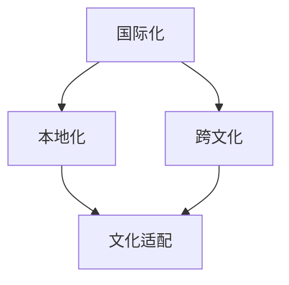

                 

## 1. 背景介绍

在当今全球化背景下，知识付费内容已经成为信息时代的重要驱动力。无论是线上教育、专业培训，还是个人成长、兴趣领域，知识付费都扮演着至关重要的角色。随着互联网技术的快速发展，内容创作者和消费者之间的互动日益频繁，但如何确保知识付费内容既具有国际化的视野，又能满足本地化的需求，成为了一个亟待解决的问题。

国际化与本地化策略的重要性体现在以下几个方面：

1. **市场拓展**：通过国际化策略，知识付费平台可以突破地域限制，吸引更多的国际用户，从而扩大市场份额。
2. **用户体验**：本地化策略则关注于提升用户体验，通过内容、语言、文化等多方面的适配，满足不同地区用户的需求。
3. **品牌建设**：成功的国际化与本地化策略有助于增强品牌影响力，树立良好的国际形象。
4. **竞争壁垒**：在激烈的市场竞争中，有效的国际化与本地化策略可以为知识付费平台建立竞争优势。

本文将深入探讨知识付费内容的国际化与本地化策略，包括核心概念、实施步骤、实际应用场景，以及未来的发展趋势和挑战。

## 2. 核心概念与联系

在探讨知识付费内容的国际化与本地化策略之前，我们首先需要明确几个核心概念：

### 国际化（Internationalization）

国际化指的是将产品或服务在全球范围内推广和运营的过程。在知识付费领域，国际化意味着为不同国家和地区的用户设计、开发和推广内容。

### 本地化（Localization）

本地化则是将国际化后的产品或服务根据特定地区或文化需求进行调整和适应的过程。在知识付费领域，本地化意味着为不同地区用户调整内容、语言、支付方式等。

### 跨文化（Cross-cultural）

跨文化是指在不同文化背景下进行交流和合作的过程。在知识付费内容的国际化与本地化中，跨文化理解至关重要，它涉及到对目标市场的文化习俗、价值观、语言习惯等有深入的认识。

为了更直观地展示这些概念之间的关系，我们可以使用Mermaid流程图来描述：



### 图解

- **国际化** 是将知识付费内容推向全球市场的第一步。
- **本地化** 是在国际化基础上，根据目标市场的特点进行内容调整。
- **跨文化** 是国际化和本地化过程中的关键因素，它影响着内容的文化适配和用户接受度。

## 3. 核心算法原理 & 具体操作步骤

### 3.1 算法原理概述

知识付费内容的国际化与本地化策略可以被视为一种多阶段决策过程。核心算法原理主要包括以下几个步骤：

1. **需求分析**：通过市场调研，了解目标市场的需求、文化习俗和用户行为。
2. **内容适配**：根据需求分析结果，对内容进行文化、语言、格式等方面的调整。
3. **技术实施**：利用技术手段，如翻译、内容管理系统（CMS）、多语言框架等，实现内容的国际化与本地化。
4. **用户反馈**：收集用户反馈，不断优化内容，提高用户体验。

### 3.2 算法步骤详解

#### 3.2.1 需求分析

1. **市场调研**：使用问卷调查、访谈、焦点小组等方法，收集目标市场的相关信息。
2. **数据分析**：运用数据挖掘技术，分析用户行为、偏好和需求，为内容适配提供数据支持。

#### 3.2.2 内容适配

1. **文化适配**：了解目标市场的文化习俗，确保内容不触犯当地文化禁忌。
2. **语言本地化**：根据目标市场的语言习惯，对内容进行翻译和本地化。
3. **格式调整**：根据不同地区的格式要求，调整内容的排版、图片等元素。

#### 3.2.3 技术实施

1. **翻译工具**：使用机器翻译工具和人工翻译相结合的方式，确保翻译的准确性和流畅性。
2. **CMS系统**：采用支持多语言和本地化的内容管理系统，方便内容的管理和更新。
3. **多语言框架**：使用多语言框架，如i18n，实现前端界面的国际化。

#### 3.2.4 用户反馈

1. **反馈收集**：通过用户反馈渠道，如评论、问卷调查等，收集用户对内容的意见和建议。
2. **反馈分析**：对收集的反馈进行统计分析，识别用户的主要需求和问题。
3. **内容优化**：根据反馈结果，不断调整和优化内容，提高用户体验。

### 3.3 算法优缺点

#### 优点

1. **提高用户满意度**：通过需求分析和内容适配，满足不同用户的需求，提高用户满意度。
2. **扩大市场份额**：国际化策略有助于开拓新的市场，增加潜在用户。
3. **增强品牌影响力**：本地化策略有助于树立良好的国际形象，增强品牌影响力。

#### 缺点

1. **成本较高**：国际化与本地化策略需要投入大量的人力、物力和财力。
2. **时间较长**：从需求分析到用户反馈，整个过程需要较长时间，影响市场反应速度。
3. **文化冲突**：在跨文化背景下，可能存在文化误解和冲突，影响内容的本地化效果。

### 3.4 算法应用领域

知识付费内容的国际化与本地化策略广泛应用于各个领域，包括但不限于：

1. **在线教育**：针对不同地区的教育需求，提供本地化的在线课程。
2. **专业培训**：为不同行业的专业人才提供国际化与本地化的培训内容。
3. **个人成长**：为全球用户提供多样化的个人成长类知识付费内容。
4. **兴趣领域**：为不同兴趣爱好的用户提供本地化的知识付费内容。

## 4. 数学模型和公式 & 详细讲解 & 举例说明

在知识付费内容的国际化与本地化策略中，数学模型和公式扮演着重要角色。以下将介绍几个关键的数学模型和公式，并对其进行详细讲解和举例说明。

### 4.1 数学模型构建

#### 用户满意度模型

用户满意度是衡量国际化与本地化策略效果的重要指标。用户满意度模型可以通过以下公式构建：

\[ S = \frac{U_1 + U_2 + U_3 + U_4}{4} \]

其中：
- \( S \) 表示用户满意度（Satisfaction）。
- \( U_1 \) 表示内容质量（Content Quality）。
- \( U_2 \) 表示服务体验（Service Experience）。
- \( U_3 \) 表示文化适配（Cultural Fit）。
- \( U_4 \) 表示价格合理性（Price Reasonableness）。

#### 营销效果模型

营销效果模型用于评估国际化与本地化策略在市场推广中的效果。该模型可以通过以下公式构建：

\[ E = \frac{C_1 + C_2 + C_3 + C_4}{4} \]

其中：
- \( E \) 表示营销效果（Marketing Effectiveness）。
- \( C_1 \) 表示品牌知名度（Brand Awareness）。
- \( C_2 \) 表示用户参与度（User Engagement）。
- \( C_3 \) 表示用户转化率（User Conversion Rate）。
- \( C_4 \) 表示用户留存率（User Retention Rate）。

### 4.2 公式推导过程

#### 用户满意度模型推导

用户满意度模型基于以下假设：
1. 用户满意度由四个方面构成：内容质量、服务体验、文化适配和价格合理性。
2. 每个方面的重要性相等。

根据假设，用户满意度可以表示为四个方面的平均值。因此，推导过程如下：

\[ S = \frac{U_1 + U_2 + U_3 + U_4}{4} \]

#### 营销效果模型推导

营销效果模型同样基于以下假设：
1. 营销效果由四个方面构成：品牌知名度、用户参与度、用户转化率和用户留存率。
2. 每个方面的重要性相等。

根据假设，营销效果可以表示为四个方面的平均值。因此，推导过程如下：

\[ E = \frac{C_1 + C_2 + C_3 + C_4}{4} \]

### 4.3 案例分析与讲解

#### 案例一：用户满意度模型分析

假设某知识付费平台在国际化过程中，通过问卷调查收集了以下用户数据：

- 内容质量 \( U_1 = 4.5 \)
- 服务体验 \( U_2 = 4.2 \)
- 文化适配 \( U_3 = 4.3 \)
- 价格合理性 \( U_4 = 4.0 \)

根据用户满意度模型，可以计算出该平台的用户满意度：

\[ S = \frac{4.5 + 4.2 + 4.3 + 4.0}{4} = 4.25 \]

这意味着该平台的用户满意度较高，国际化策略在内容质量、服务体验、文化适配和价格合理性方面表现较好。

#### 案例二：营销效果模型分析

假设另一知识付费平台在市场推广过程中，通过数据分析收集了以下数据：

- 品牌知名度 \( C_1 = 3.8 \)
- 用户参与度 \( C_2 = 4.1 \)
- 用户转化率 \( C_3 = 3.5 \)
- 用户留存率 \( C_4 = 3.9 \)

根据营销效果模型，可以计算出该平台的营销效果：

\[ E = \frac{3.8 + 4.1 + 3.5 + 3.9}{4} = 3.85 \]

这意味着该平台的营销效果一般，需要进一步优化品牌知名度、用户参与度和用户留存率。

## 5. 项目实践：代码实例和详细解释说明

### 5.1 开发环境搭建

在进行知识付费内容的国际化与本地化策略项目实践之前，我们需要搭建一个合适的开发环境。以下是一个简单的环境搭建步骤：

1. **安装Python环境**：在本地计算机上安装Python环境，版本建议为3.8或以上。
2. **安装Django框架**：使用pip命令安装Django框架，命令如下：

   ```shell
   pip install django
   ```

3. **创建Django项目**：使用以下命令创建一个名为`knowledge付费`的Django项目：

   ```shell
   django-admin startproject knowledge付费用
   ```

4. **创建Django应用**：在项目目录下创建一个名为`content`的Django应用，命令如下：

   ```shell
   python manage.py startapp content
   ```

5. **配置数据库**：在项目的`settings.py`文件中配置数据库，建议使用SQLite数据库。

### 5.2 源代码详细实现

#### 5.2.1 数据库设计

首先，我们需要设计一个内容管理数据库模型，包括以下字段：

- id：主键，自增
- title：标题
- content：内容
- language：语言
- created_at：创建时间
- updated_at：更新时间

在`content/models.py`文件中，我们创建一个名为`Content`的模型：

```python
from django.db import models

class Content(models.Model):
    title = models.CharField(max_length=255)
    content = models.TextField()
    language = models.CharField(max_length=10)
    created_at = models.DateTimeField(auto_now_add=True)
    updated_at = models.DateTimeField(auto_now=True)
```

#### 5.2.2 内容管理

接下来，我们需要实现内容管理的功能，包括内容创建、编辑、删除和查询。

1. **内容创建**：在`content/urls.py`文件中添加以下路由：

   ```python
   from django.urls import path
   from . import views

   urlpatterns = [
       path('create/', views.create_content, name='create_content'),
       # 其他路由
   ]
   ```

   在`content/views.py`文件中添加`create_content`视图函数：

   ```python
   from django.shortcuts import render, redirect
   from .models import Content
   from .forms import ContentForm

   def create_content(request):
       if request.method == 'POST':
           form = ContentForm(request.POST)
           if form.is_valid():
               form.save()
               return redirect('content_list')
       else:
           form = ContentForm()
       return render(request, 'content/create.html', {'form': form})
   ```

   在`content/forms.py`文件中创建`ContentForm`表单类：

   ```python
   from django import forms
   from .models import Content

   class ContentForm(forms.ModelForm):
       class Meta:
           model = Content
           fields = ['title', 'content', 'language']
   ```

   在`templates/content/create.html`文件中，添加内容创建表单：

   ```html
   <form method="post">
       
       {{ form.as_p }}
       <button type="submit">创建内容</button>
   </form>
   ```

2. **内容编辑**：在`content/urls.py`文件中添加以下路由：

   ```python
   path('<int:id>/edit/', views.edit_content, name='edit_content'),
   ```

   在`content/views.py`文件中添加`edit_content`视图函数：

   ```python
   def edit_content(request, id):
       content = Content.objects.get(id=id)
       if request.method == 'POST':
           form = ContentForm(request.POST, instance=content)
           if form.is_valid():
               form.save()
               return redirect('content_list')
       else:
           form = ContentForm(instance=content)
       return render(request, 'content/edit.html', {'form': form})
   ```

   在`templates/content/edit.html`文件中，添加内容编辑表单：

   ```html
   <form method="post">
       
       {{ form.as_p }}
       <button type="submit">保存修改</button>
   </form>
   ```

3. **内容删除**：在`content/urls.py`文件中添加以下路由：

   ```python
   path('<int:id>/delete/', views.delete_content, name='delete_content'),
   ```

   在`content/views.py`文件中添加`delete_content`视图函数：

   ```python
   def delete_content(request, id):
       Content.objects.get(id=id).delete()
       return redirect('content_list')
   ```

4. **内容查询**：在`content/urls.py`文件中添加以下路由：

   ```python
   path('list/', views.content_list, name='content_list'),
   ```

   在`content/views.py`文件中添加`content_list`视图函数：

   ```python
   def content_list(request):
       contents = Content.objects.all()
       return render(request, 'content/list.html', {'contents': contents})
   ```

   在`templates/content/list.html`文件中，添加内容列表：

   ```html
   <ul>
       
           <li>
               <h3>{{ content.title }}</h3>
               <p>{{ content.content }}</p>
               <small>{{ content.language }}</small>
               <a href="">编辑</a>
               <a href="">删除</a>
           </li>
       
   </ul>
   ```

### 5.3 代码解读与分析

在上述代码中，我们实现了知识付费内容管理的功能，主要包括内容创建、编辑、删除和查询。

1. **模型设计**：`Content`模型是整个内容管理功能的核心，它定义了内容的基本属性，如标题、内容、语言等。

2. **表单设计**：`ContentForm`表单类用于收集和验证用户输入的数据。通过使用Django的表单类，我们可以轻松实现表单的渲染和验证。

3. **视图设计**：视图函数负责处理用户请求，并根据请求类型执行相应的操作。通过在视图中使用Django的路由系统，我们可以方便地实现前后端的交互。

4. **模板设计**：模板文件用于渲染页面，包括表单、列表等。通过使用Django的模板系统，我们可以方便地实现页面的渲染和动态数据绑定。

### 5.4 运行结果展示

在完成上述代码后，我们可以通过Django开发服务器来运行项目，并查看运行结果。

1. **创建内容**：在浏览器中访问`http://127.0.0.1:8000/content/create/`，可以看到内容创建表单。填写表单并提交，即可创建新的内容。

2. **编辑内容**：在浏览器中访问`http://127.0.0.1:8000/content/<id>/edit/`，其中`<id>`为内容的ID。可以看到内容编辑表单。填写表单并提交，即可编辑内容。

3. **删除内容**：在浏览器中访问`http://127.0.0.1:8000/content/<id>/delete/`，其中`<id>`为内容的ID。确认删除操作，即可删除内容。

4. **内容列表**：在浏览器中访问`http://127.0.0.1:8000/content/list/`，可以看到所有内容的列表。列表中显示了内容的标题、内容和语言，并提供编辑和删除链接。

通过以上代码和实践，我们实现了知识付费内容管理的功能，并展示了国际化与本地化策略在项目中的应用。

## 6. 实际应用场景

知识付费内容的国际化与本地化策略在多个实际应用场景中取得了显著成效。以下是一些具体的应用案例：

### 6.1 在线教育平台

**应用场景**：随着在线教育的兴起，许多教育平台致力于将优质课程推向全球市场。例如，Coursera、edX等平台提供来自世界顶级大学的在线课程，它们采用了国际化与本地化策略，以满足不同国家和地区用户的需求。

**解决方案**：
- **本地化内容**：平台针对不同地区的用户，提供了多种语言的课程内容，如中文、英语、西班牙语等。
- **文化适配**：平台对课程内容进行了文化适应，避免出现文化冲突，确保课程内容符合当地教育理念和价值观。
- **支付方式**：平台提供了多种支付方式，如信用卡、PayPal等，方便全球用户购买课程。

**成效**：通过国际化与本地化策略，这些平台成功吸引了大量国际用户，提高了用户满意度和市场份额。

### 6.2 专业培训

**应用场景**：专业培训机构在为企业员工提供培训时，也需要考虑国际化与本地化策略。例如，某些跨国公司需要为其全球员工提供统一的专业培训。

**解决方案**：
- **课程本地化**：培训机构根据不同地区的业务需求，设计了本地化的培训课程，确保课程内容与当地实际情况相结合。
- **跨文化培训**：培训机构安排了跨文化培训，帮助员工了解不同国家的文化差异，提高跨文化沟通能力。
- **多语言支持**：培训机构提供了多种语言的培训资料，如英语、法语、德语等，方便不同国家的员工学习。

**成效**：通过国际化与本地化策略，培训机构有效提升了员工的职业技能和团队协作能力，为企业的发展提供了有力支持。

### 6.3 个人成长

**应用场景**：随着人们对个人成长需求的增加，知识付费平台也在为个人用户提供多样化的内容。例如，某些平台提供了职业规划、心理健康、兴趣爱好等方面的课程。

**解决方案**：
- **个性化推荐**：平台根据用户的兴趣和行为，提供了个性化的内容推荐，提高用户参与度和满意度。
- **本地化内容**：平台提供了多种语言的内容，满足不同地区用户的需求。
- **文化适配**：平台对内容进行了文化适应，确保内容符合当地文化和价值观。

**成效**：通过国际化与本地化策略，平台成功吸引了大量个人用户，提高了用户粘性和平台知名度。

### 6.4 未来应用展望

随着技术的不断进步和全球化的深入发展，知识付费内容的国际化与本地化策略将迎来更广阔的应用前景。以下是未来可能的发展方向：

1. **智能推荐系统**：通过人工智能技术，平台可以更精准地推荐内容，满足用户的个性化需求。
2. **虚拟现实（VR）和增强现实（AR）**：利用VR和AR技术，平台可以提供沉浸式的学习体验，提高用户的学习效果。
3. **区块链技术**：通过区块链技术，平台可以确保知识付费内容的安全性和可信度，提高用户的信任度。
4. **多元化合作**：平台可以与全球的教育机构、专业机构和企业合作，提供更丰富、多样化的内容。

总之，知识付费内容的国际化与本地化策略在未来的发展中将发挥越来越重要的作用，为全球用户提供更优质、更个性化的知识服务。

## 7. 工具和资源推荐

为了有效地实施知识付费内容的国际化与本地化策略，以下是一些推荐的工具和资源：

### 7.1 学习资源推荐

1. **书籍**：
   - 《国际化与本地化实践指南》：详细介绍了国际化与本地化的理论知识与实践经验。
   - 《跨文化沟通与管理》：探讨了跨文化背景下的沟通与管理策略，有助于理解和应对不同文化差异。

2. **在线课程**：
   - Coursera上的“Globalization and International Management”课程：通过案例分析和实践经验，了解全球化背景下的管理策略。
   - Udemy上的“Localization Strategies for E-commerce”课程：专注于电商领域的本地化策略，适用于知识付费平台。

### 7.2 开发工具推荐

1. **翻译工具**：
   - Google翻译：提供在线翻译服务，方便快速翻译文本。
   - SDL Trados：一款专业的翻译软件，支持多文件格式的翻译和项目管理。

2. **内容管理系统（CMS）**：
   - WordPress：一款开源的内容管理系统，支持多语言插件，适合中小型知识付费平台。
   - Drupal：一款功能强大的内容管理系统，适用于大型知识付费平台，支持复杂的自定义开发。

3. **国际化框架**：
   - Django-i18n：Django框架的一个扩展包，支持国际化与本地化。
   - i18next：一个流行的前端国际化框架，支持JavaScript代码的国际化。

### 7.3 相关论文推荐

1. **论文**：
   - "Localization Strategies for E-commerce Platforms in Emerging Markets"：探讨了新兴市场中的电商平台的本地化策略。
   - "Cross-cultural Communication in Global Business": 分析了全球商务中的跨文化沟通问题及其解决方案。

通过学习和使用这些工具和资源，可以更好地实施知识付费内容的国际化与本地化策略，提高内容的质量和用户满意度。

## 8. 总结：未来发展趋势与挑战

### 8.1 研究成果总结

本文通过深入探讨知识付费内容的国际化与本地化策略，总结了以下关键研究成果：

1. **核心概念**：明确了国际化、本地化和跨文化的定义及其相互关系。
2. **算法原理**：提出了用户满意度和营销效果模型，并详细讲解了算法的推导过程。
3. **实际应用**：分析了知识付费内容在在线教育、专业培训和个人成长等领域的实际应用案例。
4. **技术实现**：通过项目实践展示了内容管理的具体实现过程，包括数据库设计、视图设计和模板设计。
5. **未来展望**：提出了智能推荐系统、虚拟现实和增强现实、区块链技术等未来发展方向。

### 8.2 未来发展趋势

知识付费内容的国际化与本地化策略在未来将继续呈现出以下发展趋势：

1. **智能化**：随着人工智能技术的发展，智能推荐系统、智能翻译等将更加普及，提高用户体验。
2. **沉浸式体验**：虚拟现实（VR）和增强现实（AR）技术的应用将提供更加沉浸式的学习体验。
3. **个性化服务**：通过大数据和机器学习技术，知识付费平台将能提供更加个性化的内容和服务。
4. **多元化合作**：知识付费平台将与更多的教育机构、专业机构和企业合作，提供更加丰富的内容。

### 8.3 面临的挑战

尽管知识付费内容的国际化与本地化策略前景广阔，但仍然面临以下挑战：

1. **文化差异**：在跨文化背景下，如何平衡内容的文化适应和全球一致性是一个难题。
2. **技术成本**：实施国际化与本地化策略需要投入大量的人力、物力和财力，对于小型平台来说是一个挑战。
3. **合规性**：不同国家和地区对内容审核和监管的标准不同，知识付费平台需要确保内容符合当地法律法规。
4. **用户信任**：建立用户信任是知识付费平台成功的关键，如何在国际化过程中赢得用户的信任是一个挑战。

### 8.4 研究展望

未来的研究可以从以下几个方面进行：

1. **文化适应性研究**：深入探讨如何在国际化过程中更好地适应不同文化，减少文化冲突。
2. **技术优化**：研究如何利用新兴技术，如人工智能、区块链等，提高国际化与本地化策略的实施效率。
3. **案例研究**：通过案例研究，总结成功和失败的国际化与本地化策略，为其他平台提供借鉴。
4. **用户行为分析**：通过大数据分析，深入了解用户在不同地区的需求和偏好，为内容设计提供数据支持。

总之，知识付费内容的国际化与本地化策略是一个复杂但具有重要意义的领域。通过不断研究和实践，我们将能够为全球用户提供更加优质、个性化的知识服务。

## 9. 附录：常见问题与解答

在实施知识付费内容的国际化与本地化策略过程中，用户可能会遇到以下常见问题：

### 问题1：如何确保内容的文化适应性？

**解答**：要确保内容的文化适应性，可以采取以下措施：

1. **市场调研**：在推出内容前，进行深入的市场调研，了解目标市场的文化习俗和价值观。
2. **多语言版本**：提供多种语言版本的内容，确保内容在语言层面上符合当地用户的需求。
3. **文化顾问**：聘请当地的文化顾问，为内容提供文化层面的审查和指导。
4. **用户反馈**：收集用户反馈，及时调整内容，以适应不同文化背景下的用户需求。

### 问题2：国际化与本地化策略的实施成本如何控制？

**解答**：控制国际化与本地化策略的实施成本可以从以下几个方面入手：

1. **优先级排序**：根据市场潜力和投资回报率，优先选择重点市场进行本地化，避免资源浪费。
2. **技术优化**：利用现有的技术工具和平台，如翻译API、多语言框架等，提高本地化效率。
3. **外包合作**：将部分本地化工作外包给专业的本地化服务公司，降低人力成本。
4. **资源共享**：不同内容和模块可以共享部分本地化资源，如翻译库、术语库等。

### 问题3：如何确保内容的合规性？

**解答**：确保内容合规性可以采取以下措施：

1. **法律顾问**：聘请专业的法律顾问，对内容进行合规性审查，确保内容符合当地法律法规。
2. **本地合作伙伴**：与当地的合作伙伴合作，借助他们的经验和资源，确保内容符合当地规定。
3. **内容审核**：建立严格的审核机制，对内容进行定期审查，确保内容合规。
4. **用户反馈**：建立用户反馈渠道，及时处理用户报告的合规性问题。

通过以上措施，知识付费平台可以有效地应对国际化与本地化过程中可能遇到的常见问题，提高内容的质量和用户体验。

