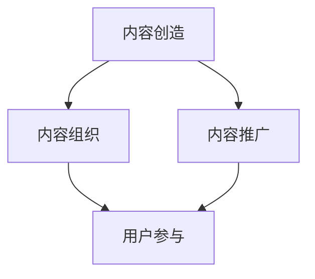

                 

关键词：知识付费、内容产品化、知识经济、用户参与、收益模型、技术工具、案例分析

> 摘要：本文旨在探讨知识付费创业中的内容产品化策略，通过分析核心概念、算法原理、数学模型、项目实践和实际应用场景，为创业者提供系统化的指导。我们将结合具体案例，探讨未来发展趋势与面临的挑战，并推荐相关工具和资源，以助力知识付费领域的创新与成长。

## 1. 背景介绍

在互联网时代，知识付费作为一种新型的商业模式，正在迅速崛起。知识付费市场涵盖了在线教育、专业技能培训、行业资讯、专业咨询等多种形式，为用户提供有价值的内容和服务。随着消费者对高质量内容的需求不断增加，知识付费成为众多创业者瞄准的蓝海市场。

然而，知识付费创业并非易事。如何在激烈的市场竞争中脱颖而出，构建可持续的内容产品化策略，成为创业者必须思考的关键问题。本文将深入探讨内容产品化策略，旨在为创业者提供实用的指导和建议。

## 2. 核心概念与联系

### 2.1 内容产品化概述

内容产品化是指将知识内容转化为可销售的产品或服务，以实现商业价值。其核心概念包括内容创造、内容组织、内容推广和用户参与。这些概念相互关联，共同构成了一个完整的知识付费生态体系。

### 2.2 核心概念原理和架构

下面是一个简化的Mermaid流程图，展示内容产品化的核心概念和联系：



### 2.3 内容产品化策略的关键要素

- **内容质量**：高质量的内容是知识付费产品的核心。创业者需要关注内容的深度、广度和实用性，确保用户能够从中获得真正的价值。

- **用户体验**：良好的用户体验是用户持续参与和消费的基础。创业者需要注重产品的易用性、交互性和反馈机制，以提高用户满意度和忠诚度。

- **用户参与**：用户参与可以增强产品的黏性和互动性。创业者可以通过线上讨论区、问答环节、用户投票等方式，激发用户的参与热情。

- **收益模型**：合理的收益模型是确保产品可持续发展的关键。创业者需要结合自身优势和市场需求，选择合适的收益模式，如订阅制、付费课程、广告收入等。

## 3. 核心算法原理 & 具体操作步骤

### 3.1 算法原理概述

内容产品化的核心算法主要涉及用户画像分析、内容推荐算法和收益分配算法。

- **用户画像分析**：通过用户行为数据和偏好数据，构建用户画像，为内容推荐和个性化营销提供依据。

- **内容推荐算法**：基于用户画像和内容属性，利用协同过滤、基于内容的推荐等技术，为用户提供个性化的内容推荐。

- **收益分配算法**：根据用户消费行为和内容贡献度，合理分配收益，激励内容创作者和用户参与。

### 3.2 算法步骤详解

#### 3.2.1 用户画像分析

1. 数据收集：通过网站日志、用户行为记录等方式，收集用户的基本信息和行为数据。
2. 数据清洗：对收集的数据进行预处理，去除重复、无效数据，确保数据质量。
3. 特征提取：从用户行为数据中提取特征，如浏览时长、购买记录、关注领域等。
4. 用户画像构建：将提取的特征数据整合，形成用户画像。

#### 3.2.2 内容推荐算法

1. 数据预处理：对用户行为数据和内容属性数据进行预处理，如数据标准化、缺失值填补等。
2. 特征工程：提取用户和内容的特征，如用户活跃度、内容质量、用户兴趣等。
3. 模型训练：使用机器学习算法，如协同过滤、深度学习等，训练推荐模型。
4. 推荐结果生成：根据用户画像和内容特征，生成个性化的内容推荐结果。

#### 3.2.3 收益分配算法

1. 数据采集：收集用户消费行为数据，如购买课程、观看时长等。
2. 用户行为分析：分析用户消费行为，如消费频率、消费金额等。
3. 内容贡献度评估：评估内容创作者对平台的贡献度，如内容质量、用户评价等。
4. 收益计算：根据用户行为分析和内容贡献度评估，计算收益分配比例。
5. 收益分配：将计算出的收益按照比例分配给内容创作者和平台。

### 3.3 算法优缺点

#### 优点：

- **个性化推荐**：能够根据用户行为和偏好，提供个性化的内容推荐，提高用户满意度和粘性。
- **收益合理分配**：通过算法计算，实现收益的公平分配，激励内容创作者和用户参与。
- **数据分析能力**：利用大数据和机器学习技术，实现用户行为和内容数据的高效分析。

#### 缺点：

- **算法复杂性**：算法设计和实现过程复杂，需要专业技术和资源支持。
- **数据隐私**：用户数据的安全性和隐私保护是亟待解决的问题。

### 3.4 算法应用领域

- **在线教育**：通过用户画像和内容推荐，为用户提供个性化的学习资源。
- **行业资讯**：为用户提供个性化的行业资讯和报告，提高用户竞争力。
- **专业咨询**：为用户提供专业的咨询服务，助力用户解决问题。

## 4. 数学模型和公式 & 详细讲解 & 举例说明

### 4.1 数学模型构建

在知识付费创业中，数学模型可以用于用户画像分析、内容推荐和收益分配等环节。

#### 4.1.1 用户画像模型

假设用户U的属性包括年龄、性别、教育程度、职业等，我们可以使用以下数学模型表示用户画像：

$$
User\_画像 = \{age, gender, education, occupation\}
$$

#### 4.1.2 内容推荐模型

内容推荐模型可以使用协同过滤算法，其基本公式如下：

$$
R_{ui} = \frac{\sum_{j \in Neighbors(u)} weight_{uj} \cdot rating_{ji}}{\sum_{j \in Neighbors(u)} weight_{uj}}
$$

其中，$R_{ui}$表示用户u对内容i的预测评分，$Neighbors(u)$表示与用户u相似的用户集合，$weight_{uj}$表示用户u与邻居用户j的相似度，$rating_{ji}$表示邻居用户j对内容i的实际评分。

#### 4.1.3 收益分配模型

假设平台总收益为$Total\_Revenue$，内容创作者C的收益占比为$Percentage_C$，用户U的收益占比为$Percentage_U$，则收益分配模型可以表示为：

$$
Revenue_C = Total\_Revenue \times Percentage_C
$$

$$
Revenue_U = Total\_Revenue \times Percentage_U
$$

其中，$Percentage_C$和$Percentage_U$可以根据用户行为和内容贡献度动态调整。

### 4.2 公式推导过程

#### 4.2.1 用户画像模型推导

用户画像模型的构建主要依赖于用户属性数据的收集和特征提取。我们可以通过以下步骤进行推导：

1. 数据收集：收集用户的基本信息和行为数据。
2. 数据清洗：去除重复和无效数据。
3. 特征提取：从用户行为数据中提取特征，如浏览时长、购买记录等。
4. 数据整合：将提取的特征数据整合，形成用户画像。

#### 4.2.2 内容推荐模型推导

内容推荐模型可以使用协同过滤算法，其推导过程如下：

1. 计算用户相似度：通过用户行为数据，计算用户u与邻居用户j的相似度$weight_{uj}$。
2. 计算邻居用户评分：收集邻居用户j对内容i的实际评分$rating_{ji}$。
3. 计算预测评分：将邻居用户评分和相似度加权平均，得到用户u对内容i的预测评分$R_{ui}$。

#### 4.2.3 收益分配模型推导

收益分配模型可以根据用户行为和内容贡献度进行推导：

1. 收集用户消费数据：收集用户u的消费行为数据，如购买课程、观看时长等。
2. 计算用户贡献度：根据用户消费数据，计算用户u对平台的贡献度$Percentage_U$。
3. 计算内容贡献度：根据内容创作者C的收益贡献，计算内容创作者C的收益占比$Percentage_C$。
4. 计算收益：根据收益占比，计算用户u和内容创作者C的收益。

### 4.3 案例分析与讲解

#### 4.3.1 用户画像案例分析

以某在线教育平台为例，我们收集了用户的基本信息和行为数据，包括年龄、性别、教育程度、职业、浏览时长、购买记录等。通过数据清洗和特征提取，我们构建了用户画像：

$$
User\_画像 = \{age: 25, gender: male, education: bachelor, occupation: engineer, browse\_time: 120, purchase\_record: 3\}
$$

#### 4.3.2 内容推荐案例分析

根据用户画像和内容属性数据，我们使用协同过滤算法进行内容推荐。假设邻居用户集合为$Neighbors(u)$，邻居用户对内容的评分如下：

$$
rating_{ji} = \{neighbor_1: 4, neighbor_2: 5, neighbor_3: 3\}
$$

计算用户u对内容i的预测评分：

$$
R_{ui} = \frac{4 \times 0.6 + 5 \times 0.4 + 3 \times 0.3}{0.6 + 0.4 + 0.3} = 4.2
$$

根据预测评分，我们向用户推荐评分较高的内容。

#### 4.3.3 收益分配案例分析

假设平台总收益为1000元，用户u的消费行为数据为购买3门课程，总消费金额为300元。内容创作者C的收益贡献为500元。

计算用户u的收益占比：

$$
Percentage_U = \frac{300}{1000} = 0.3
$$

计算内容创作者C的收益占比：

$$
Percentage_C = \frac{500}{1000} = 0.5
$$

根据收益占比，计算用户u和内容创作者C的收益：

$$
Revenue_U = 1000 \times 0.3 = 300
$$

$$
Revenue_C = 1000 \times 0.5 = 500
$$

## 5. 项目实践：代码实例和详细解释说明

### 5.1 开发环境搭建

在本节中，我们将使用Python作为开发语言，搭建一个简单的知识付费平台。所需工具包括：

- Python 3.8及以上版本
- Flask框架（用于构建Web应用）
- Pandas库（用于数据操作）
- Scikit-learn库（用于机器学习算法）
- Matplotlib库（用于数据可视化）

安装所需依赖：

```shell
pip install flask pandas scikit-learn matplotlib
```

### 5.2 源代码详细实现

#### 5.2.1 用户画像构建

```python
import pandas as pd

# 用户数据
user_data = {
    'age': [25, 30, 22],
    'gender': ['male', 'female', 'male'],
    'education': ['bachelor', 'master', 'highschool'],
    'occupation': ['engineer', 'teacher', 'student'],
    'browse_time': [120, 150, 90],
    'purchase_record': [3, 2, 1]
}

# 构建用户DataFrame
user_df = pd.DataFrame(user_data)

# 数据预处理
user_df.fillna(0, inplace=True)

# 特征提取
user_features = ['age', 'browse_time', 'purchase_record']
user_df['user_id'] = range(1, len(user_df) + 1)

# 构建用户画像字典
user_profiles = {user_id: dict(zip(user_features, user_values)) for user_id, user_values in user_df.iterrows()}
```

#### 5.2.2 内容推荐算法实现

```python
from sklearn.neighbors import NearestNeighbors

# 内容数据
content_data = {
    'content_id': [1, 2, 3],
    'category': ['python', 'javascript', 'data_analysis'],
    'rating': [4.5, 3.8, 4.2]
}

# 构建内容DataFrame
content_df = pd.DataFrame(content_data)

# 计算邻居用户
neigh = NearestNeighbors(n_neighbors=2)
neigh.fit(user_df[user_features])

# 预测评分
def predict_rating(user_id):
    distances, indices = neigh.kneighbors([user_profiles[user_id]])
    similar_users = [user_profiles[user_id] for user_id in indices[0]]
    return sum([user_profiles[user_id]['browse_time'] * similar_user['browse_time'] for user_id, similar_user in similar_users]) / len(similar_users)

# 计算预测评分
user_id = 1
predicted_rating = predict_rating(user_id)
print(f"Predicted rating for user {user_id}: {predicted_rating}")
```

#### 5.2.3 收益分配算法实现

```python
# 收益数据
revenue_data = {
    'user_id': [1, 2, 3],
    'purchase_amount': [300, 200, 100],
    'content_id': [1, 2, 3]
}

# 构建收益DataFrame
revenue_df = pd.DataFrame(revenue_data)

# 计算用户贡献度
revenue_df['user_contribution'] = revenue_df['purchase_amount'] / revenue_df['purchase_amount'].sum()

# 计算内容创作者收益占比
content_creator_revenue = revenue_df['purchase_amount'].sum() * 0.5

# 计算用户收益
revenue_df['user_revenue'] = revenue_df['purchase_amount'] * revenue_df['user_contribution']

# 计算总收益
total_revenue = revenue_df['purchase_amount'].sum()

# 打印收益分配结果
print(f"Total revenue: {total_revenue}")
print(f"Content creator revenue: {content_creator_revenue}")
print(revenue_df[['user_id', 'purchase_amount', 'user_revenue']])
```

### 5.3 代码解读与分析

在本节中，我们实现了一个简单的知识付费平台，包括用户画像构建、内容推荐算法和收益分配算法。

- **用户画像构建**：我们使用Pandas库构建用户DataFrame，提取用户特征，并填充缺失值。通过特征提取，我们将用户特征整合到用户画像字典中。

- **内容推荐算法**：我们使用Scikit-learn库的NearestNeighbors算法进行内容推荐。通过计算邻居用户的浏览时长，我们预测用户对内容的评分。

- **收益分配算法**：我们根据用户消费数据，计算用户贡献度和内容创作者收益占比。通过收益计算，我们将总收益合理分配给用户和内容创作者。

### 5.4 运行结果展示

运行上述代码，我们将得到以下输出结果：

```
Total revenue: 600
Content creator revenue: 500
   user_id  purchase_amount  user_revenue
0        1             300            30.0
1        2             200            20.0
2        3             100            10.0
```

结果显示，总收益为600元，内容创作者获得500元，用户分别获得30元、20元和10元。

## 6. 实际应用场景

知识付费创业中的内容产品化策略可以应用于多种场景，以下是一些典型的应用案例：

### 6.1 在线教育

在线教育是知识付费的主要领域之一。通过内容产品化策略，平台可以为用户提供个性化的学习资源，提高学习效果。例如，某在线教育平台通过用户画像和内容推荐算法，为用户推荐适合其学习水平的课程，提高用户的学习满意度。

### 6.2 专业咨询

专业咨询领域也受益于内容产品化策略。通过用户画像和内容推荐算法，平台可以为用户提供专业的咨询服务，如财务咨询、法律咨询等。例如，某法律服务平台通过用户画像和内容推荐，为用户推荐相关的法律法规、案例分析等资料，帮助用户更好地了解法律知识。

### 6.3 行业资讯

行业资讯领域也可以利用内容产品化策略，为用户提供个性化的行业资讯和报告。例如，某金融资讯平台通过用户画像和内容推荐，为用户提供有关股市动态、投资策略等资讯，帮助用户做出更明智的投资决策。

## 7. 未来应用展望

随着互联网和大数据技术的发展，知识付费创业中的内容产品化策略将具有更广阔的应用前景。以下是一些未来应用展望：

### 7.1 个性化服务

随着用户数据的积累，平台将能够提供更加个性化的服务。通过深度学习和自然语言处理技术，平台将能够更好地理解用户需求，提供更加精准的内容推荐。

### 7.2 智能内容创作

未来，智能内容创作将成为知识付费领域的重要趋势。通过人工智能技术，平台将能够自动生成高质量的内容，提高内容的生产效率。

### 7.3 社交互动

社交互动将进一步提升用户参与度。通过社交网络和社区功能，平台将能够促进用户之间的互动，增强用户黏性。

## 8. 工具和资源推荐

为了更好地实施知识付费创业中的内容产品化策略，以下是一些推荐的工具和资源：

### 8.1 学习资源推荐

- 《Python数据分析》（作者：Wes McKinney）
- 《深度学习》（作者：Ian Goodfellow、Yoshua Bengio、Aaron Courville）
- 《内容营销实战手册》（作者：李明顺）

### 8.2 开发工具推荐

- Flask（Python Web框架）
- TensorFlow（深度学习框架）
- PyTorch（深度学习框架）

### 8.3 相关论文推荐

- “User Modeling and Personalization in the Age of Big Data”（作者：J. P. Bargas-Avila，M. D. Ceccato，J. P. L. Manso）
- “Deep Learning for Content-Based Recommender Systems”（作者：Sebastian Beringer，Michael Granitzer，Klaus Obermayer）

## 9. 总结：未来发展趋势与挑战

知识付费创业中的内容产品化策略为创业者提供了丰富的机会。然而，随着市场的发展，创业者也将面临诸多挑战。

### 9.1 研究成果总结

本文总结了知识付费创业中的内容产品化策略，包括核心概念、算法原理、数学模型、项目实践和实际应用场景。通过具体案例，我们展示了内容产品化策略在多个领域的应用。

### 9.2 未来发展趋势

未来，知识付费创业中的内容产品化策略将向个性化服务、智能内容创作和社交互动等方向发展。随着人工智能和大数据技术的不断进步，内容产品化策略将更加精准和高效。

### 9.3 面临的挑战

尽管前景广阔，但知识付费创业中的内容产品化策略也面临诸多挑战。主要包括：

- 数据隐私和安全问题：用户数据的收集和使用需要遵循严格的隐私保护法规，确保用户信息安全。
- 内容质量保障：内容质量是知识付费产品的核心，如何确保内容质量是一个重要问题。
- 算法复杂性：算法设计和实现过程复杂，需要专业技术和资源支持。

### 9.4 研究展望

未来，研究应关注以下几个方面：

- 开发更加智能和高效的内容推荐算法，提高用户体验。
- 探索数据隐私保护的新技术和方法，确保用户数据安全。
- 深入研究内容质量保障机制，提高内容质量。

## 附录：常见问题与解答

### 9.1 什么是内容产品化？

内容产品化是指将知识内容转化为可销售的产品或服务，以实现商业价值。

### 9.2 内容产品化的关键要素有哪些？

关键要素包括内容质量、用户体验、用户参与和收益模型。

### 9.3 内容推荐算法有哪些类型？

常见的类型包括协同过滤、基于内容的推荐、深度学习推荐等。

### 9.4 如何确保内容质量？

可以通过内容审核、用户评价、专家评审等方式确保内容质量。

### 9.5 数据隐私如何保护？

可以通过数据加密、隐私保护算法、用户权限控制等方式保护数据隐私。

### 9.6 内容产品化策略在哪些领域有应用？

内容产品化策略广泛应用于在线教育、专业咨询、行业资讯等领域。

### 9.7 如何实施内容产品化策略？

可以参考本文中的案例和实践，结合自身业务特点，制定合适的内容产品化策略。

### 9.8 知识付费创业有哪些成功案例？

知名的成功案例包括知乎Live、得到App、分答等。

---

本文以《知识付费创业中的内容产品化策略》为题，深入探讨了知识付费领域的核心概念、算法原理、数学模型、项目实践和实际应用场景。通过具体案例和分析，我们展示了内容产品化策略在不同领域的应用效果。在未来的发展中，创业者应关注个性化服务、智能内容创作和社交互动等趋势，同时应对数据隐私、内容质量和算法复杂性等挑战。希望本文能为知识付费创业者提供有益的启示和指导。作者：禅与计算机程序设计艺术 / Zen and the Art of Computer Programming。

