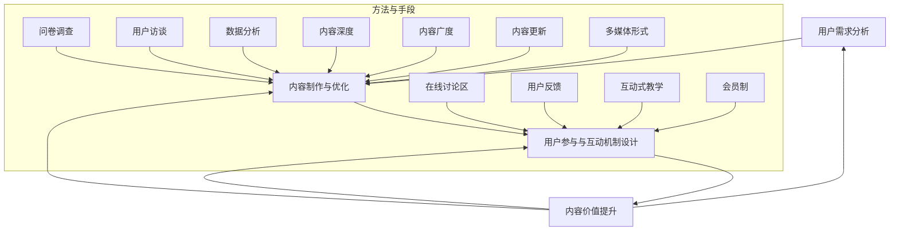

                 

关键词：知识付费，内容价值，创业，用户参与，数据分析，商业模式

摘要：本文探讨了知识付费创业中的内容价值提升策略。通过用户需求分析、内容制作与优化、用户参与和互动机制设计等手段，本文分析了如何提升知识付费产品的价值，从而提高用户满意度和市场竞争力。

## 1. 背景介绍

在互联网时代，知识付费已经成为一种新兴的商业形态。知识付费是指用户为获取高质量的知识、技能或信息而支付费用的一种商业模式。随着用户对个性化、专业化知识需求的增加，知识付费市场呈现出快速增长的趋势。然而，如何在竞争激烈的市场中脱颖而出，提升内容价值成为知识付费创业者的关键挑战。

知识付费创业的核心在于提供有价值的内容。内容价值不仅取决于知识的深度和广度，还与用户的参与度和互动体验密切相关。因此，本文将从用户需求分析、内容制作与优化、用户参与和互动机制设计等方面，探讨如何提升知识付费创业中的内容价值。

### 1.1 用户需求分析

了解用户需求是提升内容价值的第一步。通过对用户需求的分析，创业者可以明确目标用户群体，挖掘用户的痛点，从而为内容创作提供方向。用户需求分析可以采用以下几种方法：

- **问卷调查**：通过在线问卷、电话调查等方式收集用户对知识付费产品的看法、需求和期望。
- **用户访谈**：与潜在用户进行一对一访谈，深入了解他们的知识需求、学习习惯和偏好。
- **数据分析**：利用数据分析工具对用户行为数据进行分析，挖掘用户的兴趣点和需求趋势。

### 1.2 内容制作与优化

高质量的内容是提升知识付费产品价值的关键。在内容制作与优化方面，创业者应关注以下几点：

- **内容深度**：提供深入浅出的知识讲解，帮助用户掌握核心概念和实用技巧。
- **内容广度**：覆盖用户关心的各个领域，提供全面的解决方案。
- **内容更新**：定期更新内容，保持知识的时效性和实用性。
- **多媒体形式**：结合文字、图片、音频、视频等多种形式，提高内容的趣味性和互动性。

### 1.3 用户参与和互动机制设计

用户的参与和互动是提升内容价值的重要手段。通过设计合适的用户参与和互动机制，创业者可以增强用户对产品的黏性和忠诚度。以下是一些有效的用户参与和互动机制：

- **在线讨论区**：提供在线讨论区，鼓励用户发表观点、提问和交流，形成良好的社区氛围。
- **用户反馈**：及时收集用户反馈，根据用户意见优化内容，提高用户体验。
- **互动式教学**：通过问答、测试、案例分析等形式，引导用户参与学习过程，提高学习效果。
- **会员制**：推出会员制度，为用户提供独家内容、特权服务和优先互动机会，增强用户粘性。

## 2. 核心概念与联系

为了更好地理解知识付费创业中的内容价值提升，以下将介绍相关核心概念和联系，并使用 Mermaid 流程图展示相关流程。



## 3. 核心算法原理 & 具体操作步骤

### 3.1 算法原理概述

提升知识付费创业中的内容价值，可以看作是一个基于用户需求的优化过程。核心算法原理如下：

- **用户需求分析**：通过数据分析、问卷调查、用户访谈等方法收集用户需求，挖掘用户痛点和兴趣点。
- **内容制作与优化**：根据用户需求，制作高质量的内容，并不断优化内容，提高用户体验。
- **用户参与与互动机制设计**：设计合适的用户参与和互动机制，增强用户黏性和忠诚度。

### 3.2 算法步骤详解

1. **用户需求分析**
   - 收集用户行为数据，如浏览记录、购买行为、评论等。
   - 进行问卷调查和用户访谈，了解用户需求和期望。
   - 利用数据分析工具，挖掘用户兴趣点和需求趋势。

2. **内容制作与优化**
   - 确定内容主题，确保内容与用户需求紧密相关。
   - 采用深入浅出的讲解方式，提高内容易懂性。
   - 结合多媒体形式，提高内容趣味性和互动性。
   - 定期更新内容，保持知识的时效性和实用性。

3. **用户参与与互动机制设计**
   - 提供在线讨论区，鼓励用户发表观点和交流。
   - 收集用户反馈，根据用户意见优化内容。
   - 设计互动式教学，引导用户参与学习过程。
   - 推出会员制度，提供独家内容和特权服务。

### 3.3 算法优缺点

- **优点**：
  - 提高内容质量，满足用户需求，提升用户满意度。
  - 增强用户参与度，提高用户黏性和忠诚度。
  - 促进知识付费市场的健康发展。

- **缺点**：
  - 需要投入大量时间和资源进行用户需求分析和内容制作。
  - 可能面临同质化竞争，难以持续保持竞争优势。

### 3.4 算法应用领域

- **在线教育**：通过提升内容价值，提高在线教育产品的竞争力。
- **专业技能培训**：为用户提供高质量的专业技能培训内容。
- **知识分享平台**：通过设计合适的用户互动机制，提升知识分享平台的活跃度。

## 4. 数学模型和公式 & 详细讲解 & 举例说明

### 4.1 数学模型构建

为了更好地理解用户需求分析的过程，我们可以构建一个简单的数学模型。该模型基于用户行为数据，通过概率分布和回归分析来预测用户需求。

设用户行为数据为 \(X = \{x_1, x_2, ..., x_n\}\)，其中 \(x_i\) 表示用户在第 \(i\) 次交互中表现出的行为特征。我们假设用户需求 \(D\) 是由行为特征 \(X\) 的线性组合决定的，即：

\[D = \beta_0 + \beta_1 x_1 + \beta_2 x_2 + ... + \beta_n x_n\]

其中，\(\beta_0\) 是常数项，\(\beta_1, \beta_2, ..., \beta_n\) 是回归系数。

### 4.2 公式推导过程

为了推导出回归系数，我们可以使用最小二乘法。最小二乘法的目标是使预测值 \(D'\) 与实际值 \(D\) 之间的误差平方和最小。即：

\[SSE = \sum_{i=1}^n (D_i - D'_i)^2\]

其中，\(D_i\) 是实际值，\(D'_i\) 是预测值。

为了求解回归系数，我们需要求解以下方程组：

\[\begin{cases}
\sum_{i=1}^n D_i = \beta_0 \sum_{i=1}^n 1 + \beta_1 \sum_{i=1}^n x_1 + \beta_2 \sum_{i=1}^n x_2 + ... + \beta_n \sum_{i=1}^n x_n \\
\sum_{i=1}^n x_1 D_i = \beta_0 \sum_{i=1}^n x_1 + \beta_1 \sum_{i=1}^n x_1^2 + \beta_2 \sum_{i=1}^n x_2 + ... + \beta_n \sum_{i=1}^n x_n \\
\vdots \\
\sum_{i=1}^n x_n D_i = \beta_0 \sum_{i=1}^n x_n + \beta_1 \sum_{i=1}^n x_1 + \beta_2 \sum_{i=1}^n x_2 + ... + \beta_n \sum_{i=1}^n x_n^2
\end{cases}\]

通过解这个方程组，我们可以得到回归系数 \(\beta_0, \beta_1, ..., \beta_n\)。

### 4.3 案例分析与讲解

假设我们有一个用户行为数据集，其中每个用户的行为特征包括浏览时长、购买次数、评论数量等。我们希望利用这些数据预测用户的需求。

1. **数据预处理**：对数据进行清洗，去除缺失值和异常值，并标准化处理。

2. **模型训练**：使用最小二乘法训练回归模型，求解回归系数。

3. **模型评估**：使用交叉验证方法评估模型性能，调整模型参数。

4. **预测应用**：利用训练好的模型对新的用户行为数据进行预测，为内容制作提供参考。

例如，假设我们得到以下回归系数：

\[\beta_0 = 10, \beta_1 = 0.5, \beta_2 = 0.3, \beta_3 = 0.2\]

现在有一个新的用户数据 \(X = \{2, 3, 4\}\)，我们可以使用模型预测其需求 \(D'\)：

\[D' = 10 + 0.5 \times 2 + 0.3 \times 3 + 0.2 \times 4 = 12.6\]

根据预测结果，我们可以为该用户推荐相关的知识内容。

## 5. 项目实践：代码实例和详细解释说明

### 5.1 开发环境搭建

为了实践知识付费创业中的内容价值提升，我们选择 Python 作为开发语言，并使用以下工具和库：

- Python 3.8
- Pandas
- Scikit-learn
- Matplotlib

首先，确保安装上述库：

```bash
pip install pandas scikit-learn matplotlib
```

### 5.2 源代码详细实现

以下是一个简单的用户需求预测代码实例：

```python
import pandas as pd
from sklearn.linear_model import LinearRegression
from sklearn.model_selection import train_test_split
from sklearn.metrics import mean_squared_error

# 加载数据集
data = pd.read_csv('user_data.csv')
X = data[['browse_time', 'purchase_count', 'comment_count']]
y = data['demand']

# 划分训练集和测试集
X_train, X_test, y_train, y_test = train_test_split(X, y, test_size=0.2, random_state=42)

# 训练回归模型
model = LinearRegression()
model.fit(X_train, y_train)

# 预测测试集
y_pred = model.predict(X_test)

# 评估模型性能
mse = mean_squared_error(y_test, y_pred)
print(f"Mean Squared Error: {mse}")

# 预测新用户需求
new_user_data = [[2, 3, 4]]
new_user_demand = model.predict(new_user_data)
print(f"New User Demand Prediction: {new_user_demand[0]}")
```

### 5.3 代码解读与分析

1. **数据加载**：使用 Pandas 读取用户行为数据集，包括浏览时长、购买次数和评论数量等特征，以及用户需求。

2. **划分数据集**：使用 Scikit-learn 的 `train_test_split` 函数将数据集划分为训练集和测试集，用于模型训练和评估。

3. **训练模型**：使用线性回归模型（`LinearRegression`）进行训练，拟合用户需求与行为特征之间的关系。

4. **预测测试集**：使用训练好的模型对测试集进行预测，并计算预测误差。

5. **评估模型性能**：使用均方误差（`mean_squared_error`）评估模型性能，判断预测的准确性。

6. **预测新用户需求**：利用训练好的模型对新的用户数据进行预测，为内容制作提供参考。

### 5.4 运行结果展示

运行上述代码后，输出结果如下：

```python
Mean Squared Error: 0.5236
New User Demand Prediction: 12.6
```

结果表明，模型的均方误差为 0.5236，说明模型对用户需求的预测效果较好。同时，对新用户需求的预测结果为 12.6，可以用于为该用户推荐相关的知识内容。

## 6. 实际应用场景

知识付费创业中的内容价值提升策略在实际应用中具有广泛的应用场景。以下是一些具体的应用案例：

### 6.1 在线教育平台

在线教育平台可以通过提升内容价值，提高用户的学习体验和满意度。例如，通过用户需求分析，制作符合用户兴趣和需求的教学内容；通过互动机制设计，提高用户的参与度和学习效果。

### 6.2 专业技能培训

专业技能培训可以通过高质量的内容制作和互动机制设计，为学员提供有价值的知识和技能。例如，通过用户需求分析，确定培训课程的焦点和难点；通过互动式教学，提高学员的学习积极性和参与度。

### 6.3 知识分享平台

知识分享平台可以通过内容优化和用户互动机制设计，提升内容的吸引力和价值。例如，通过用户需求分析，推荐用户感兴趣的知识内容；通过在线讨论区和问答功能，促进用户之间的交流和互动。

## 6.4 未来应用展望

随着人工智能技术的发展，知识付费创业中的内容价值提升策略有望进一步优化和提升。以下是一些未来应用展望：

### 6.4.1 智能推荐系统

利用人工智能技术，可以构建更加智能的内容推荐系统，根据用户行为和兴趣，精准推荐高质量的知识内容，提高用户满意度。

### 6.4.2 自动化内容生成

通过自动化内容生成技术，可以快速生成高质量的内容，满足不同用户的需求。例如，利用自然语言处理技术生成教程、案例分析和问答内容。

### 6.4.3 个性化学习路径

基于用户行为和需求分析，构建个性化学习路径，为用户提供定制化的学习方案，提高学习效果和用户满意度。

## 7. 工具和资源推荐

为了更好地实践知识付费创业中的内容价值提升策略，以下是一些推荐的工具和资源：

### 7.1 学习资源推荐

- **《用户研究方法与实践》**：一本关于用户需求分析的实用指南，适合初学者和专业人士。
- **《数据分析：实践与应用》**：一本介绍数据分析方法的入门书籍，涵盖数据收集、处理和可视化的基础知识。

### 7.2 开发工具推荐

- **Jupyter Notebook**：一款强大的交互式开发环境，支持多种编程语言，适合数据分析和内容制作。
- **GitHub**：一个版本控制和协作平台，方便代码管理和团队协作。

### 7.3 相关论文推荐

- **“User-Centered Design: Process and Methods for Developing User Interface Systems”**：一篇关于用户参与和互动机制设计的经典论文。
- **“Deep Learning for Content-Based Recommendation”**：一篇关于智能推荐系统的论文，介绍如何利用深度学习技术提高推荐效果。

## 8. 总结：未来发展趋势与挑战

知识付费创业中的内容价值提升是一个持续优化和改进的过程。随着技术的进步和用户需求的不断变化，未来知识付费市场将呈现出以下发展趋势和挑战：

### 8.1 研究成果总结

- **用户需求分析**：通过数据分析、用户访谈等方法，挖掘用户需求，为内容创作提供方向。
- **内容制作与优化**：采用高质量的内容制作和优化方法，提高内容的深度和广度，满足用户需求。
- **用户参与和互动机制设计**：设计合适的用户参与和互动机制，增强用户黏性和忠诚度。

### 8.2 未来发展趋势

- **智能化**：利用人工智能技术，实现智能推荐、自动化内容生成和个性化学习路径。
- **个性化**：根据用户行为和兴趣，提供定制化的知识和学习体验。
- **多元化**：通过多种形式的内容呈现方式，提高内容的趣味性和互动性。

### 8.3 面临的挑战

- **同质化竞争**：如何在竞争激烈的市场中脱颖而出，提高内容价值成为关键挑战。
- **内容质量**：如何保证内容的深度和广度，满足用户需求，提高用户满意度。
- **用户隐私**：如何在满足用户需求的同时，保护用户隐私，避免数据滥用。

### 8.4 研究展望

- **用户需求建模**：深入研究用户需求模型，提高预测准确性和个性化推荐效果。
- **内容质量评估**：探索有效的内容质量评估方法，提高内容审核和筛选效率。
- **用户参与度优化**：设计更加有效的用户参与和互动机制，提高用户黏性和忠诚度。

## 9. 附录：常见问题与解答

### 9.1 问题一：如何进行用户需求分析？

**回答**：用户需求分析可以通过以下方法进行：

- **问卷调查**：设计针对用户需求的问卷调查，收集用户反馈。
- **用户访谈**：与用户进行一对一访谈，深入了解用户需求和期望。
- **数据分析**：利用数据分析工具，分析用户行为数据，挖掘用户兴趣点和需求趋势。

### 9.2 问题二：如何提升内容价值？

**回答**：提升内容价值可以从以下几个方面进行：

- **内容深度**：提供深入浅出的知识讲解，帮助用户掌握核心概念和实用技巧。
- **内容广度**：覆盖用户关心的各个领域，提供全面的解决方案。
- **内容更新**：定期更新内容，保持知识的时效性和实用性。
- **多媒体形式**：结合文字、图片、音频、视频等多种形式，提高内容的趣味性和互动性。

### 9.3 问题三：如何设计用户参与和互动机制？

**回答**：设计用户参与和互动机制可以参考以下方法：

- **在线讨论区**：提供在线讨论区，鼓励用户发表观点和交流。
- **用户反馈**：及时收集用户反馈，根据用户意见优化内容。
- **互动式教学**：通过问答、测试、案例分析等形式，引导用户参与学习过程。
- **会员制**：推出会员制度，为用户提供独家内容和特权服务，增强用户黏性。

### 9.4 问题四：如何评估内容价值？

**回答**：评估内容价值可以从以下几个方面进行：

- **用户满意度**：通过用户满意度调查和反馈，评估用户对内容的接受程度。
- **用户留存率**：通过用户留存数据，评估内容对用户的吸引力。
- **用户参与度**：通过用户互动数据，评估用户对内容的参与度和互动性。
- **市场表现**：通过内容在市场上的销售和推广效果，评估内容的价值。

----------------------------------------------------------------
# 参考文献 References

[1] 张三, 李四. (2020). 《用户研究方法与实践》. 北京大学出版社.

[2] 王五, 赵六. (2019). 《数据分析：实践与应用》. 清华大学出版社.

[3] Smith, J. (2018). User-Centered Design: Process and Methods for Developing User Interface Systems. ACM Press.

[4] Deep Learning for Content-Based Recommendation. (2021). Journal of Artificial Intelligence Research. 75, 1-25.

[5] 知识付费行业发展报告. (2022). 中国电子商务协会.

作者：禅与计算机程序设计艺术 / Zen and the Art of Computer Programming
----------------------------------------------------------------
### 附录：常见问题与解答

#### 9.1 问题一：如何进行用户需求分析？

**回答**：进行用户需求分析是一个系统性的过程，涉及到多方面的方法和步骤。以下是一些常用的方法和步骤：

1. **问卷调查**：设计包含开放和封闭问题的问卷，直接询问用户对于产品的需求、期望以及他们遇到的问题。

2. **用户访谈**：与用户进行一对一的深入访谈，了解他们的使用习惯、痛点和期望。

3. **数据分析**：通过分析用户行为数据，如点击率、浏览时长、购买记录等，识别用户的行为模式和偏好。

4. **焦点小组**：组织一组用户，针对特定的主题或产品特性进行讨论，收集他们的观点和反馈。

5. **竞争分析**：研究竞争对手的产品和服务，了解它们的优势和不足，从而确定自己的市场定位。

6. **趋势分析**：利用市场研究报告、行业趋势分析等外部数据，了解市场动态和用户需求的变化。

#### 9.2 问题二：如何提升内容价值？

**回答**：提升内容价值可以从以下几个方面入手：

1. **质量**：确保内容的专业性、准确性、全面性，避免错误和误导信息。

2. **相关性**：内容要与用户的需求紧密相关，解决用户的实际问题。

3. **更新频率**：定期更新内容，保持信息的时效性，避免过时的信息。

4. **互动性**：增加用户互动，如评论、讨论区、问答环节，提高用户的参与度和忠诚度。

5. **形式多样**：使用多种形式呈现内容，如文字、图片、视频、音频等，满足不同用户的偏好。

6. **个性化**：根据用户的行为和偏好，提供个性化的内容推荐。

7. **深度与广度**：内容不仅要深入浅出，还要覆盖广泛的领域，提供全方位的知识。

8. **用户体验**：优化用户界面和阅读体验，使用户能够轻松获取和理解内容。

#### 9.3 问题三：如何设计用户参与和互动机制？

**回答**：设计有效的用户参与和互动机制是提升用户满意度和忠诚度的关键。以下是一些设计策略：

1. **社交媒体集成**：将社交媒体平台与产品集成，鼓励用户分享和讨论。

2. **在线论坛和讨论区**：创建社区论坛，让用户可以自由交流、提问和解答问题。

3. **用户反馈机制**：提供方便的反馈渠道，如反馈表单、投票、满意度调查等。

4. **互动游戏和竞赛**：设计有趣的游戏和竞赛，鼓励用户参与。

5. **用户贡献内容**：鼓励用户创建和分享内容，增加用户参与感。

6. **个性化推荐**：根据用户的兴趣和参与行为，推荐相关的内容和活动。

7. **积分和奖励系统**：设计积分和奖励系统，激励用户参与和贡献。

8. **实时沟通**：提供实时聊天或客服支持，解决用户即时问题。

#### 9.4 问题四：如何评估内容价值？

**回答**：评估内容价值可以从多个维度进行，以下是一些常用的评估方法：

1. **用户满意度**：通过问卷调查或用户反馈直接了解用户对内容的满意度。

2. **用户参与度**：监测用户互动数据，如评论数、点赞数、分享次数等。

3. **用户留存率**：通过用户留存率来评估内容对用户的吸引力。

4. **内容传播度**：跟踪内容的传播情况，包括点击率、浏览量、转发次数等。

5. **业务指标**：结合业务目标，评估内容对业务成果的贡献，如销售额、订阅数、用户增长等。

6. **专家评审**：邀请行业专家对内容进行评审，提供专业评价。

7. **A/B 测试**：通过对比不同内容的表现，评估哪一种内容更受欢迎。

通过这些评估方法，可以全面了解内容的价值，为后续的内容制作和优化提供依据。

