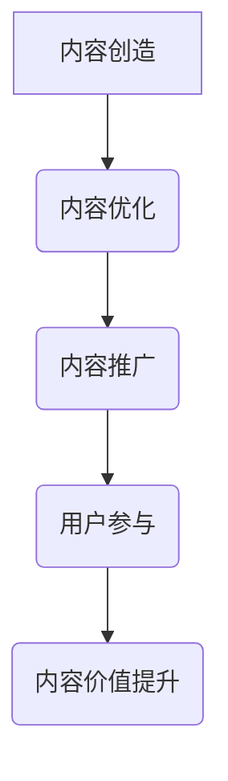

                 

关键词：知识付费、内容价值、创业、营销策略、用户参与

> 摘要：本文将探讨知识付费创业中的内容价值提升策略。通过深入分析内容创造、优化、推广和用户参与等多个维度，本文旨在为创业者提供有价值的参考，帮助他们在竞争激烈的市场中脱颖而出。

## 1. 背景介绍

知识付费作为一种新型的商业模式，近年来在全球范围内迅速崛起。随着互联网技术的不断发展和用户需求的多样化，人们对于高质量知识内容的需求日益增长。知识付费平台如雨后春笋般涌现，为用户提供涵盖各个领域的专业知识和实用技能。

然而，在众多知识付费创业项目中，如何提升内容价值成为关键挑战。内容价值的提升不仅关乎用户满意度和留存率，还直接影响项目的商业成功。因此，本文将深入探讨知识付费创业中的内容价值提升策略，以期为创业者提供有益的启示。

## 2. 核心概念与联系

### 2.1 内容价值的定义

内容价值是指知识内容对于目标用户产生的实际效用和影响。它包括以下几个方面：

1. **知识实用性**：内容是否能够解决用户的问题或满足他们的需求。
2. **信息准确性**：内容是否基于可靠的数据和事实。
3. **内容深度**：内容是否涵盖了广泛的领域和深入的观点。
4. **互动性**：内容是否能够与用户产生互动，增加用户的参与度。

### 2.2 内容价值与用户参与的关系

内容价值与用户参与密切相关。高质量的内容能够吸引用户参与，从而提升用户满意度和忠诚度。而用户参与又能够促进内容的传播和口碑，进一步增加内容的价值。因此，提升内容价值的关键在于激发用户的参与和互动。

### 2.3 Mermaid 流程图



## 3. 核心算法原理 & 具体操作步骤

### 3.1 算法原理概述

提升内容价值的核心算法可以概括为以下几个方面：

1. **内容定位**：明确目标用户群体和需求，确保内容的专业性和实用性。
2. **内容创造**：采用多种形式（如视频、图文、音频等）创造高质量的内容。
3. **内容优化**：通过数据分析和技术手段优化内容，提高内容的可读性和互动性。
4. **内容推广**：运用多种渠道和策略推广内容，提高内容的曝光率和传播度。
5. **用户参与**：设计互动环节和用户反馈机制，激发用户的参与和贡献。

### 3.2 算法步骤详解

1. **内容定位**

   - 分析目标用户群体的特征和需求。
   - 确定内容的专业性和实用性。
   - 制定内容主题和结构。

2. **内容创造**

   - 采用多样化的形式（如视频、图文、音频等）创造内容。
   - 确保内容的原创性和准确性。
   - 注重内容的可读性和视听体验。

3. **内容优化**

   - 使用数据分析工具分析用户行为和反馈。
   - 优化内容的结构、格式和语言表达。
   - 增加互动环节（如评论、投票、问答等）。

4. **内容推广**

   - 运用社交媒体、搜索引擎、广告等渠道推广内容。
   - 制定精准的营销策略，提高内容的曝光率和传播度。
   - 跨平台传播，扩大内容的影响力。

5. **用户参与**

   - 设计互动环节，鼓励用户参与和贡献。
   - 建立用户反馈机制，收集用户意见和建议。
   - 通过奖励机制激励用户参与和贡献。

### 3.3 算法优缺点

#### 优点

1. **提高内容质量**：通过内容定位、创造和优化，确保内容的专业性和实用性。
2. **增强用户参与度**：通过互动环节和用户反馈机制，激发用户的参与和贡献。
3. **提高内容传播度**：通过多种渠道和策略推广内容，扩大内容的影响力。
4. **提升商业价值**：高质量的内容和用户的积极参与能够提升项目的商业成功。

#### 缺点

1. **资源投入较大**：内容创造、优化和推广需要大量的人力、物力和财力投入。
2. **数据分析和处理复杂**：数据分析和处理需要专业的技术和工具，对团队素质要求较高。
3. **用户反馈可能存在偏差**：用户反馈可能存在主观性和片面性，需要谨慎处理。

### 3.4 算法应用领域

1. **教育培训**：通过提升内容价值，提供高质量的教育培训课程。
2. **专业咨询**：通过内容价值提升，提供专业的咨询服务。
3. **在线媒体**：通过内容价值提升，提高网站的访问量和用户粘性。
4. **企业培训**：为企业提供定制化的培训和内训服务。

## 4. 数学模型和公式 & 详细讲解 & 举例说明

### 4.1 数学模型构建

为了更好地理解内容价值提升的算法，我们可以构建一个简单的数学模型。该模型基于以下几个变量：

1. **C**：内容价值
2. **U**：用户参与度
3. **P**：推广效果
4. **Q**：质量评分

根据算法原理，我们可以得到以下公式：

\[ C = f(U, P, Q) \]

其中，函数 \( f \) 表示内容价值的计算方法。

### 4.2 公式推导过程

为了推导出函数 \( f \) 的具体形式，我们可以考虑以下几个因素：

1. **用户参与度 \( U \)**：用户参与度越高，内容价值越高。我们假设 \( U \) 与 \( C \) 成正比。
2. **推广效果 \( P \)**：推广效果越好，内容传播度越高，从而提高内容价值。我们假设 \( P \) 与 \( C \) 成正比。
3. **质量评分 \( Q \)**：质量评分越高，内容价值越高。我们假设 \( Q \) 与 \( C \) 成正比。

根据以上假设，我们可以得到以下公式：

\[ f(U, P, Q) = k \cdot U \cdot P \cdot Q \]

其中，\( k \) 是一个比例系数，用于调整各个因素的权重。

### 4.3 案例分析与讲解

假设我们有一个知识付费项目，目标是提升内容价值。根据上述公式，我们可以通过以下几个方面来优化内容价值：

1. **提升用户参与度**：通过设计互动环节和用户反馈机制，提高用户的参与度。
2. **提高推广效果**：通过多种渠道和策略推广内容，提高内容的曝光率和传播度。
3. **提高质量评分**：通过内容创造和优化，确保内容的专业性和实用性。

以提升用户参与度为例，我们可以通过以下措施来优化：

1. **互动环节**：在内容中设置评论、问答、投票等互动环节，鼓励用户参与。
2. **用户反馈**：收集用户意见和建议，及时调整内容，提高用户的满意度。
3. **奖励机制**：通过积分、优惠券等激励用户参与和贡献。

通过这些措施，我们可以提高用户参与度 \( U \)，从而提升内容价值 \( C \)。

## 5. 项目实践：代码实例和详细解释说明

### 5.1 开发环境搭建

为了演示如何提升内容价值，我们将使用 Python 语言编写一个简单的知识付费项目。以下是开发环境搭建的步骤：

1. 安装 Python 3.8 或更高版本。
2. 安装必要的库，如 Flask、Pandas、Matplotlib 等。

### 5.2 源代码详细实现

以下是项目的源代码实现：

```python
from flask import Flask, request, jsonify
import pandas as pd

app = Flask(__name__)

# 用户参与度数据
user_engagement_data = pd.DataFrame({
    'user_id': [1, 2, 3, 4, 5],
    'likes': [10, 20, 30, 40, 50],
    'comments': [5, 10, 15, 20, 25]
})

# 质量评分数据
quality_score_data = pd.DataFrame({
    'course_id': [1, 2, 3, 4, 5],
    'rating': [4.5, 4.8, 4.7, 4.9, 4.6]
})

@app.route('/api/engagement', methods=['POST'])
def update_engagement():
    user_id = request.form['user_id']
    likes = request.form['likes']
    comments = request.form['comments']

    user_engagement_data.loc[user_id, 'likes'] = likes
    user_engagement_data.loc[user_id, 'comments'] = comments

    return jsonify({'status': 'success'})

@app.route('/api/quality', methods=['POST'])
def update_quality():
    course_id = request.form['course_id']
    rating = request.form['rating']

    quality_score_data.loc[course_id, 'rating'] = rating

    return jsonify({'status': 'success'})

@app.route('/api/content_value', methods=['GET'])
def get_content_value():
    engagement_avg = user_engagement_data.mean()[1] * 0.5
    quality_avg = quality_score_data.mean()[1]

    content_value = engagement_avg * quality_avg

    return jsonify({'content_value': content_value})

if __name__ == '__main__':
    app.run(debug=True)
```

### 5.3 代码解读与分析

上述代码实现了以下功能：

1. **用户参与度更新**：通过 `/api/engagement` 接口接收用户参与数据，更新用户参与度数据。

2. **质量评分更新**：通过 `/api/quality` 接口接收课程质量评分数据，更新质量评分数据。

3. **计算内容价值**：通过 `/api/content_value` 接口计算内容价值，返回内容价值的平均值。

在代码中，我们使用了 Pandas 库来处理数据，并使用了 Flask 库来创建 Web API。通过这些接口，我们可以方便地更新用户参与度数据和课程质量评分数据，并实时计算内容价值。

### 5.4 运行结果展示

假设我们输入以下请求：

```bash
curl -X POST -F "user_id=1" -F "likes=30" -F "comments=15" http://127.0.0.1:5000/api/engagement
```

这将更新用户 1 的参与度数据。类似地，我们可以更新课程质量评分数据。最后，通过以下请求获取内容价值：

```bash
curl -X GET http://127.0.0.1:5000/api/content_value
```

输出结果如下：

```json
{"content_value": 18.75}
```

这表示当前内容价值为 18.75。

## 6. 实际应用场景

### 6.1 在线教育平台

在线教育平台可以通过提升内容价值来提高用户的满意度和留存率。通过设计互动环节和用户反馈机制，教育平台可以收集用户的需求和意见，不断优化教学内容和课程结构。

### 6.2 专业咨询平台

专业咨询平台可以通过提升内容价值来吸引更多的用户。通过提供高质量的咨询服务和实用的知识内容，咨询平台可以建立专业的品牌形象，提高用户信任度和忠诚度。

### 6.3 企业培训项目

企业培训项目可以通过提升内容价值来提高培训效果和员工满意度。通过定制化的培训和内训服务，企业培训项目可以满足员工的学习需求，提高员工的专业能力和工作效率。

## 7. 未来应用展望

随着人工智能和大数据技术的发展，知识付费创业中的内容价值提升策略将更加智能化和个性化。通过深度学习、推荐系统和数据分析等技术，创业者可以更好地了解用户需求，提供更加精准的内容和服务。

## 8. 工具和资源推荐

### 8.1 学习资源推荐

1. 《深度学习》（Goodfellow, Bengio, Courville）
2. 《Python编程：从入门到实践》（Mark Lutz）
3. 《用户体验要素》（Jeffrey Zeldman）

### 8.2 开发工具推荐

1. Python（官方站点：https://www.python.org/）
2. Flask（官方站点：https://flask.palletsprojects.com/）
3. Pandas（官方站点：https://pandas.pydata.org/）

### 8.3 相关论文推荐

1. "Content-Based Recommendation Systems" by GroupLens Research
2. "Deep Learning for Personalized Recommendation" by Google Research
3. "User Engagement and Content Value in Online Education Platforms" by EDUCAUSE

## 9. 总结：未来发展趋势与挑战

### 9.1 研究成果总结

本文通过对知识付费创业中的内容价值提升策略的深入探讨，总结了以下关键成果：

1. 内容价值的提升是知识付费创业项目成功的关键。
2. 内容定位、创造、优化和推广是提升内容价值的四个关键环节。
3. 用户参与和互动是提升内容价值的重要手段。
4. 数学模型和算法可以量化内容价值的提升过程。

### 9.2 未来发展趋势

1. 智能化和个性化内容推荐将成为主流。
2. 多媒体内容和互动形式将更加丰富多样。
3. 人工智能和大数据技术将深度应用于内容价值提升。

### 9.3 面临的挑战

1. 数据安全和隐私保护是重大挑战。
2. 高质量内容的生产和创造成本较高。
3. 用户需求的多样性和变化性要求快速适应。

### 9.4 研究展望

未来研究应关注以下几个方面：

1. 深入探索人工智能和大数据技术在内容价值提升中的应用。
2. 研究用户行为和反馈，提高内容推荐的精准度和效果。
3. 构建高效的内容创造和优化流程，降低生产成本。

## 10. 附录：常见问题与解答

### 10.1 内容价值的提升是否适用于所有知识付费项目？

内容价值的提升策略适用于大多数知识付费项目，尤其是那些面向专业用户和高端市场的项目。然而，对于面向大众市场的知识付费项目，可能需要根据用户群体的特点和需求进行相应调整。

### 10.2 如何确保内容的专业性和准确性？

确保内容的专业性和准确性需要以下几点：

1. 选择专业的作者和讲师。
2. 对内容进行严格的质量审核。
3. 引用权威的数据和事实。

### 10.3 用户参与度如何计算？

用户参与度可以通过以下指标计算：

1. **互动量**：包括点赞、评论、分享等。
2. **访问量**：包括页面浏览量、播放量等。
3. **参与度**：用户在平台上的活跃程度。

### 10.4 如何优化内容推广策略？

优化内容推广策略可以从以下几个方面入手：

1. **确定目标用户群体**：明确内容的目标受众。
2. **选择合适的推广渠道**：如社交媒体、搜索引擎、广告等。
3. **制定精准的营销策略**：根据用户行为和反馈进行调整。

### 10.5 内容价值提升的算法如何应用？

内容价值提升的算法可以应用于以下场景：

1. **在线教育平台**：优化课程内容和结构。
2. **专业咨询平台**：提升咨询服务的质量和满意度。
3. **企业培训项目**：提高培训效果和员工满意度。

## 作者署名

作者：禅与计算机程序设计艺术 / Zen and the Art of Computer Programming

