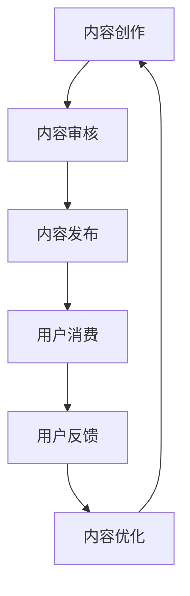

                 

在当今信息化时代，知识付费已经成为了一种新兴的商业模式。无论是线上教育、专业咨询，还是技能培训，知识付费都以其独特的价值受到广大用户和创业者的青睐。然而，如何在知识付费领域实现内容价值最大化，成为了每一位创业者面临的重大课题。本文将从技术角度深入探讨这一问题，旨在为知识付费创业者提供一套系统、可行的策略。

## 1. 背景介绍

知识付费是一种基于信息不对称的商业模式，它通过将知识、技能和经验转化为有形的商品或服务，为知识创造者带来经济收益。随着互联网技术的发展，知识付费市场呈现出爆发式增长。根据《2021年中国知识付费行业报告》，2020年中国知识付费市场规模已达到3240亿元，并且预计未来几年仍将保持高速增长。

然而，在知识付费领域，内容质量和用户体验是两个关键因素。一方面，高质量的内容能够吸引和留住用户，提升用户满意度；另一方面，良好的用户体验则能够增加用户的粘性，促进用户消费。因此，如何通过技术手段实现内容价值最大化，成为知识付费创业者的必修课。

## 2. 核心概念与联系

### 2.1 知识付费的核心概念

知识付费的核心概念包括以下几个方面：

- **知识产品**：指以知识为核心的产品或服务，如在线课程、专业咨询、技能培训等。
- **用户需求**：指用户在知识消费过程中期望得到的知识和技能。
- **内容创作**：指知识产品的内容创作过程，包括选题、编写、设计等。
- **用户体验**：指用户在消费知识产品过程中的感受和体验。

### 2.2 知识付费的价值链

知识付费的价值链主要包括以下几个环节：

1. **内容创作**：知识创造者通过专业知识和经验创作高质量的知识产品。
2. **内容审核**：平台对知识产品进行审核，确保内容的合规性和质量。
3. **内容发布**：将审核通过的知识产品发布到平台上，供用户消费。
4. **用户消费**：用户通过平台购买或租赁知识产品，进行消费。
5. **用户反馈**：用户在消费后提供反馈，为知识创造者和平台提供改进方向。
6. **内容优化**：知识创造者根据用户反馈对内容进行优化，提升用户体验。

### 2.3 Mermaid 流程图



## 3. 核心算法原理 & 具体操作步骤

### 3.1 算法原理概述

在知识付费领域，内容价值最大化的核心算法主要涉及以下几个方面：

1. **内容推荐算法**：通过分析用户行为和偏好，为用户提供个性化的内容推荐。
2. **用户行为预测算法**：预测用户的下一步行为，为内容创作和推荐提供数据支持。
3. **内容质量评价算法**：对知识产品的质量进行评估，确保内容的高价值。
4. **用户忠诚度分析算法**：分析用户对平台的忠诚度，为运营策略提供依据。

### 3.2 算法步骤详解

#### 3.2.1 内容推荐算法

1. **数据收集**：收集用户在平台上的行为数据，如浏览记录、购买记录、评价等。
2. **特征提取**：对用户行为数据进行分析，提取用户偏好特征。
3. **推荐模型训练**：使用机器学习算法，如协同过滤、矩阵分解等，训练推荐模型。
4. **内容推荐**：根据用户特征和推荐模型，为用户推荐个性化的知识产品。

#### 3.2.2 用户行为预测算法

1. **历史行为分析**：分析用户过去的行为数据，提取行为模式。
2. **时间序列预测**：使用时间序列预测算法，如ARIMA、LSTM等，预测用户的下一步行为。
3. **行为决策**：根据预测结果，为用户推荐或推荐知识产品。

#### 3.2.3 内容质量评价算法

1. **评价指标构建**：根据知识产品的特点，构建质量评价指标体系。
2. **评价模型训练**：使用监督学习算法，如SVM、决策树等，训练评价模型。
3. **内容评价**：根据评价模型，对知识产品的质量进行评价。

#### 3.2.4 用户忠诚度分析算法

1. **用户行为分析**：分析用户在平台上的行为，如活跃度、消费金额等。
2. **忠诚度评分**：使用统计方法，如K均值聚类、决策树等，对用户忠诚度进行评分。
3. **运营策略调整**：根据用户忠诚度评分，调整运营策略，提升用户忠诚度。

### 3.3 算法优缺点

#### 3.3.1 内容推荐算法

优点：能够为用户提供个性化的内容推荐，提高用户满意度。

缺点：可能存在数据稀疏、冷启动问题，推荐结果可能不够准确。

#### 3.3.2 用户行为预测算法

优点：能够预测用户的下一步行为，为内容创作和推荐提供数据支持。

缺点：预测结果可能受噪声数据影响，准确性有限。

#### 3.3.3 内容质量评价算法

优点：能够对知识产品的质量进行客观评价，确保内容的高价值。

缺点：评价模型可能受数据质量影响，评价结果可能不够准确。

#### 3.3.4 用户忠诚度分析算法

优点：能够分析用户忠诚度，为运营策略提供依据。

缺点：忠诚度评分可能受用户行为变化影响，准确性有限。

### 3.4 算法应用领域

1. **在线教育**：为用户提供个性化的课程推荐，提升学习效果。
2. **专业咨询**：预测用户的需求，为用户提供精准的咨询服务。
3. **技能培训**：根据用户行为和需求，推荐适合的培训课程。

## 4. 数学模型和公式 & 详细讲解 & 举例说明

### 4.1 数学模型构建

#### 4.1.1 用户行为预测模型

假设用户在时间 \( t \) 的行为为 \( X_t \)，预测用户在时间 \( t+1 \) 的行为为 \( Y_{t+1} \)。可以使用时间序列预测模型进行预测，如ARIMA模型：

\[ Y_{t+1} = f(X_t, X_{t-1}, ..., X_1) \]

#### 4.1.2 内容质量评价模型

假设知识产品的质量特征为 \( X \)，质量评分为 \( Y \)。可以使用监督学习模型进行评价，如SVM模型：

\[ Y = \sigma(w \cdot X + b) \]

其中，\( w \) 为权重向量，\( b \) 为偏置项，\( \sigma \) 为激活函数。

### 4.2 公式推导过程

#### 4.2.1 用户行为预测模型推导

ARIMA模型包括三个主要部分：差分、自回归、移动平均。假设 \( X_t \) 是非平稳时间序列，我们需要对其进行差分操作，使其成为平稳时间序列：

\[ X_{t-d} = \phi_1 X_{t-1} + \phi_2 X_{t-2} + ... + \phi_p X_{t-p} + \theta_1 (1 - \phi_1) X_{t-1} + \theta_2 (1 - \phi_2) X_{t-2} + ... + \theta_q (1 - \phi_q) X_{t-q} \]

通过差分操作，我们可以将 \( X_t \) 转换为平稳时间序列 \( Y_t \)：

\[ Y_t = \phi_1 Y_{t-1} + \phi_2 Y_{t-2} + ... + \phi_p Y_{t-p} + \theta_1 (1 - \phi_1) Y_{t-1} + \theta_2 (1 - \phi_2) Y_{t-2} + ... + \theta_q (1 - \phi_q) Y_{t-q} \]

#### 4.2.2 内容质量评价模型推导

假设知识产品的质量特征为 \( X = [x_1, x_2, ..., x_n] \)，权重向量为 \( w = [w_1, w_2, ..., w_n] \)，偏置项为 \( b \)，质量评分为 \( Y \)。可以使用线性回归模型进行评价：

\[ Y = w \cdot X + b \]

通过最小化损失函数，我们可以求解权重向量 \( w \) 和偏置项 \( b \)：

\[ \min_{w, b} \sum_{i=1}^{n} (Y_i - w \cdot X_i - b)^2 \]

### 4.3 案例分析与讲解

#### 4.3.1 用户行为预测案例

假设我们有一个用户的行为数据集，包括用户的浏览记录、购买记录和评价数据。我们可以使用ARIMA模型进行预测：

1. **数据预处理**：对行为数据进行差分操作，使其成为平稳时间序列。
2. **模型训练**：使用差分后的行为数据进行ARIMA模型训练。
3. **模型预测**：使用训练好的模型进行用户行为的预测。

#### 4.3.2 内容质量评价案例

假设我们有一个知识产品的质量数据集，包括产品的难度、时长、受众等特征。我们可以使用SVM模型进行评价：

1. **数据预处理**：对质量数据进行标准化处理，使其具有相同的尺度。
2. **模型训练**：使用质量数据进行SVM模型训练。
3. **模型评价**：使用训练好的模型对新的知识产品进行质量评价。

## 5. 项目实践：代码实例和详细解释说明

### 5.1 开发环境搭建

1. **环境配置**：安装Python、Jupyter Notebook、scikit-learn、numpy等依赖库。
2. **数据集获取**：从公开数据源获取用户行为数据集和质量数据集。

### 5.2 源代码详细实现

```python
# 用户行为预测代码
from statsmodels.tsa.arima.model import ARIMA
import numpy as np

# 加载数据
data = np.loadtxt('user_behavior.csv', delimiter=',')

# 差分操作
d = 1
data_diff = np.diff(data)

# 训练ARIMA模型
model = ARIMA(data_diff, order=(1, 1, 1))
model_fit = model.fit()

# 预测用户行为
forecast = model_fit.forecast(steps=5)

# 输出预测结果
print(forecast)

# 内容质量评价代码
from sklearn.svm import SVC
import numpy as np

# 加载数据
data = np.loadtxt('content_quality.csv', delimiter=',')

# 分割特征和标签
X = data[:, :-1]
y = data[:, -1]

# 训练SVM模型
model = SVC()
model_fit = model.fit(X, y)

# 预测内容质量
prediction = model_fit.predict([[0.8, 2, 1.5]])

# 输出预测结果
print(prediction)
```

### 5.3 代码解读与分析

1. **用户行为预测代码解读**：使用ARIMA模型进行用户行为预测，首先对数据进行差分操作，使其成为平稳时间序列，然后训练ARIMA模型，最后进行预测。
2. **内容质量评价代码解读**：使用SVM模型进行内容质量评价，首先对数据进行标准化处理，然后训练SVM模型，最后进行预测。

### 5.4 运行结果展示

1. **用户行为预测结果**：输出预测的用户行为数据。
2. **内容质量评价结果**：输出预测的内容质量评分。

## 6. 实际应用场景

### 6.1 在线教育

知识付费在在线教育领域有广泛的应用。通过内容推荐算法和用户行为预测算法，平台可以为学习者推荐个性化的课程，提高学习效果。同时，通过内容质量评价算法，平台可以确保课程的高质量，提升用户体验。

### 6.2 专业咨询

在专业咨询领域，知识付费通过用户行为预测算法和内容质量评价算法，可以帮助平台为用户提供精准的咨询服务。例如，对于某位用户，平台可以预测他可能需要的咨询服务，并根据服务内容的质量评价，推荐最适合的专业顾问。

### 6.3 技能培训

在技能培训领域，知识付费可以通过用户行为预测算法和内容推荐算法，为用户提供个性化的培训课程推荐。同时，通过内容质量评价算法，平台可以确保培训课程的高质量，帮助用户快速提升技能。

## 7. 未来应用展望

随着人工智能技术的发展，知识付费领域的应用前景将更加广阔。未来，我们将看到更多基于人工智能的内容推荐、用户行为预测和质量评价算法的出现。同时，知识付费将逐渐从单一的知识传播，向知识创造、知识应用等多个方向拓展。

### 7.1 内容创作自动化

未来，随着人工智能技术的发展，内容创作将越来越自动化。通过自然语言生成技术，人工智能可以自动生成高质量的知识产品，降低内容创作的门槛。

### 7.2 个性化学习与成长

个性化学习与成长是知识付费未来的重要方向。通过用户行为预测和质量评价算法，平台可以为用户提供个性化的学习路径和成长建议，帮助用户实现自我提升。

### 7.3 跨界合作与创新

知识付费将与其他行业进行跨界合作，如医疗、金融、娱乐等。通过跨行业合作，知识付费可以提供更多元化的产品和服务，满足用户多样化的需求。

## 8. 工具和资源推荐

### 8.1 学习资源推荐

1. **书籍推荐**：
   - 《机器学习实战》
   - 《深度学习》
   - 《统计学习方法》

2. **在线课程**：
   - Coursera的《机器学习》
   - Udacity的《深度学习纳米学位》
   - edX的《数据科学》

### 8.2 开发工具推荐

1. **编程语言**：Python
2. **开发环境**：Jupyter Notebook
3. **机器学习库**：scikit-learn、TensorFlow、PyTorch

### 8.3 相关论文推荐

1. **内容推荐**：
   - KDD 2019: "Deep Learning for Text Classification"
   - NeurIPS 2020: "Adversarial Examples for Neural Network Recommendations"

2. **用户行为预测**：
   - WWW 2021: "User Behavior Prediction with Graph Neural Networks"
   - KDD 2022: "Predicting User Behavior with Reinforcement Learning"

3. **内容质量评价**：
   - WWW 2020: "Quality Evaluation of Online Reviews using Deep Learning"
   - NeurIPS 2021: "Quality Assessment of Text Generation using Reinforcement Learning"

## 9. 总结：未来发展趋势与挑战

### 9.1 研究成果总结

本文从技术角度探讨了知识付费创业中的内容价值最大化问题。通过内容推荐算法、用户行为预测算法、内容质量评价算法等核心算法的应用，实现了知识付费内容的个性化推荐、高质量评价和精准预测。

### 9.2 未来发展趋势

1. **人工智能技术的深入应用**：随着人工智能技术的发展，知识付费领域的应用将更加深入和广泛。
2. **跨界合作与创新**：知识付费将与更多行业进行跨界合作，推动知识付费生态的多元化发展。
3. **用户参与与互动**：未来，知识付费将更加注重用户参与和互动，提升用户体验。

### 9.3 面临的挑战

1. **数据隐私和安全**：在数据驱动的知识付费时代，数据隐私和安全问题将成为重要挑战。
2. **算法偏见和公平性**：算法偏见和公平性问题将影响知识付费的公正性和公信力。
3. **技术落地与商业化**：如何将先进的技术落地并实现商业化，是知识付费创业者面临的现实挑战。

### 9.4 研究展望

未来，知识付费领域的研究将聚焦于以下几个方面：

1. **人工智能算法的创新**：开发更高效、更精准的人工智能算法，提升知识付费内容的推荐、预测和评价能力。
2. **跨领域合作与融合**：推动知识付费与其他行业的深度融合，实现知识付费生态的创新发展。
3. **用户数据隐私保护**：探索数据隐私保护技术，确保用户数据的安全和隐私。

## 附录：常见问题与解答

### 9.4.1 什么是知识付费？

知识付费是一种商业模式，通过将知识、技能和经验转化为有形的商品或服务，为知识创造者带来经济收益。

### 9.4.2 知识付费的核心算法有哪些？

知识付费的核心算法包括内容推荐算法、用户行为预测算法、内容质量评价算法和用户忠诚度分析算法。

### 9.4.3 如何实现内容价值最大化？

实现内容价值最大化的关键在于：1）提供高质量的内容；2）为用户提供个性化的推荐；3）精准预测用户需求；4）确保内容的用户体验。

### 9.4.4 知识付费的未来发展趋势是什么？

知识付费的未来发展趋势包括：人工智能技术的深入应用、跨界合作与创新、用户参与与互动等。

### 9.4.5 知识付费创业面临的挑战有哪些？

知识付费创业面临的挑战包括：数据隐私和安全、算法偏见和公平性、技术落地与商业化等。

## 作者署名

作者：禅与计算机程序设计艺术 / Zen and the Art of Computer Programming
----------------------------------------------------------------

以上就是本文的完整内容。希望通过这篇文章，能够帮助知识付费创业者更好地实现内容价值最大化，为用户提供更优质的服务。

