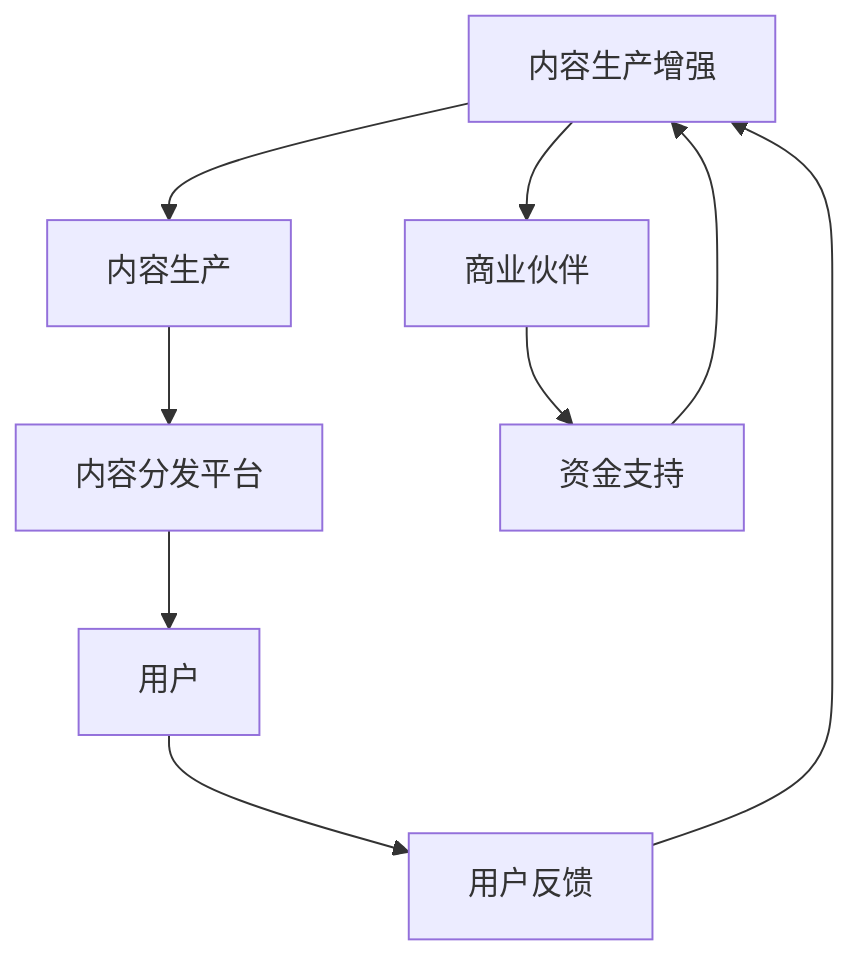

                 

 在当今这个信息爆炸的时代，知识付费成为了许多创业者眼中的蓝海。知识付费不仅满足了用户对于高质量内容的需求，也为内容创作者提供了新的收入来源。然而，如何在知识付费领域中构建一个有效的内容价值链，成为了创业者们亟待解决的关键问题。本文将围绕这一主题，深入探讨知识付费创业中的内容价值链构建。

## 文章关键词

知识付费、内容价值链、创业、用户需求、商业模式、技术支持。

## 文章摘要

本文旨在探讨知识付费创业中的内容价值链构建。通过对知识付费市场现状的分析，本文提出了构建内容价值链的核心概念和原理，并利用Mermaid流程图对内容价值链的架构进行了详细展示。随后，本文从核心算法原理、数学模型和项目实践等多个角度，对内容价值链的构建方法进行了深入阐述。最后，本文对内容价值链在实际应用场景中的表现进行了探讨，并提出了未来发展的展望。

## 1. 背景介绍

随着互联网技术的发展和移动设备的普及，知识获取的方式发生了巨大的变化。传统的知识获取方式主要依赖于课堂教育和书籍，而现在，越来越多的用户选择通过线上平台获取知识。知识付费市场正是在这种背景下迅速崛起的。

知识付费市场的发展可以追溯到2016年，当时中国的知识付费市场开始兴起。根据相关数据显示，2016年中国知识付费市场规模仅为15.8亿元，而到了2020年，这一数字已经增长到了238亿元。预计到2023年，中国知识付费市场规模将达到514亿元。

知识付费市场的快速发展吸引了众多创业者的目光。然而，面对激烈的市场竞争，如何构建一个有效的内容价值链成为了创业者们需要解决的首要问题。

### 1.1 知识付费市场的现状

当前，知识付费市场主要分为以下几种类型：

1. **在线教育平台**：如知乎、分答、得到等，提供知识分享、问答、课程等多种形式的内容。

2. **专业领域知识库**：如36氪、创业邦等，提供行业动态、深度报道等内容。

3. **知识付费社区**：如行距、简知等，以内容订阅和付费问答为主要形式。

4. **知识付费内容创作平台**：如简书、知乎Live等，提供内容创作者发布和售卖内容的服务。

### 1.2 创业者在知识付费市场中的挑战

尽管知识付费市场前景广阔，但创业者们也面临着诸多挑战：

1. **内容质量难以保证**：在知识付费市场中，内容质量直接决定了用户的满意度和留存率。

2. **用户需求多样化**：不同的用户对于知识的需求各不相同，如何满足多样化的需求成为了创业者需要解决的重要问题。

3. **竞争激烈**：知识付费市场竞争激烈，如何在众多竞争对手中脱颖而出成为了创业者们需要面对的挑战。

4. **盈利模式不清晰**：如何构建一个可持续的盈利模式是创业者需要深入思考的问题。

## 2. 核心概念与联系

在构建知识付费创业中的内容价值链时，我们需要明确几个核心概念，并理解它们之间的联系。

### 2.1 内容价值链的概念

内容价值链是指将内容创作者、内容分发平台、用户以及商业伙伴连接起来的一个整体，通过内容的生产、分发、消费和反馈等环节，实现价值的传递和增值。

### 2.2 核心概念

1. **内容创作者**：他们是内容价值链的起点，负责生产有价值的内容。

2. **内容分发平台**：它们是连接创作者和用户的桥梁，负责内容的传播和推广。

3. **用户**：他们是内容价值链的终点，也是价值的最终体现者。

4. **商业伙伴**：包括广告商、合作伙伴等，他们为内容价值链提供资金支持和其他资源。

### 2.3 Mermaid流程图



在这个流程图中，内容创作者通过生产高质量的内容，通过内容分发平台传递给用户，用户在消费内容后提供反馈，从而推动内容的迭代更新。同时，商业伙伴通过提供资金支持和其他资源，为内容生产提供保障。

## 3. 核心算法原理 & 具体操作步骤

### 3.1 算法原理概述

在知识付费创业中，构建内容价值链的核心算法原理主要包括以下几个方面：

1. **用户行为分析**：通过分析用户在内容消费过程中的行为数据，了解用户的需求和偏好。

2. **内容推荐算法**：基于用户行为数据，利用推荐算法为用户推荐个性化的内容。

3. **内容迭代优化**：根据用户反馈和数据分析，不断优化内容，提高内容的质量和用户满意度。

### 3.2 算法步骤详解

1. **数据收集与处理**：收集用户在内容消费过程中的行为数据，如点击、浏览、分享、评论等，并进行数据清洗和处理。

2. **用户画像构建**：基于用户行为数据，构建用户画像，包括用户的基本信息、兴趣爱好、行为习惯等。

3. **内容推荐**：利用推荐算法，如协同过滤、基于内容的推荐等，为用户推荐个性化的内容。

4. **内容迭代**：根据用户反馈和数据分析，对内容进行迭代优化，提高内容的质量和用户满意度。

### 3.3 算法优缺点

**优点**：

1. 提高内容推荐的质量，满足用户的个性化需求。

2. 通过数据分析和反馈机制，优化内容生产，提高内容的质量。

3. 提高用户的满意度和留存率，促进商业模式的可持续发展。

**缺点**：

1. 需要大量的用户行为数据进行训练，对数据处理能力要求较高。

2. 可能会出现“冷启动”问题，即新用户在初期难以获得个性化的内容推荐。

### 3.4 算法应用领域

1. **在线教育**：通过推荐算法，为用户提供个性化的课程推荐，提高学习效果。

2. **新闻资讯**：为用户提供个性化的新闻推荐，满足用户的阅读需求。

3. **社交媒体**：通过推荐算法，为用户提供感兴趣的内容，提高用户的活跃度和留存率。

## 4. 数学模型和公式 & 详细讲解 & 举例说明

### 4.1 数学模型构建

在知识付费创业中，构建内容价值链的数学模型主要包括以下几个部分：

1. **用户行为模型**：描述用户在内容消费过程中的行为特征。

2. **内容推荐模型**：基于用户行为模型，为用户推荐个性化的内容。

3. **内容迭代模型**：根据用户反馈和数据分析，优化内容质量。

### 4.2 公式推导过程

1. **用户行为模型**：

   设用户 \( u \) 在内容消费过程中的行为数据为 \( X_u \)，则用户行为模型可以表示为：

   $$ X_u = f(U, C) $$

   其中，\( U \) 表示用户特征，\( C \) 表示内容特征。

2. **内容推荐模型**：

   设用户 \( u \) 的偏好为 \( P_u \)，内容 \( c \) 的特征为 \( C_c \)，则内容推荐模型可以表示为：

   $$ P_u = g(X_u, C_c) $$

   其中，\( g \) 为推荐函数。

3. **内容迭代模型**：

   设内容 \( c \) 的迭代次数为 \( T_c \)，用户 \( u \) 的反馈为 \( F_u \)，则内容迭代模型可以表示为：

   $$ C_{new} = h(C, T_c, F_u) $$

   其中，\( h \) 为迭代函数。

### 4.3 案例分析与讲解

假设我们有一个在线教育平台，用户 \( u \) 在平台上浏览了课程 \( c_1, c_2, c_3 \)，分别对应不同的学科领域。根据用户的行为数据，我们可以构建用户的行为模型和内容推荐模型。

1. **用户行为模型**：

   用户 \( u \) 的行为数据为：

   $$ X_u = [0.8, 0.2, 0.0] $$

   其中，0.8表示用户对课程 \( c_1 \) 的兴趣度，0.2表示用户对课程 \( c_2 \) 的兴趣度，0.0表示用户对课程 \( c_3 \) 的兴趣度。

2. **内容推荐模型**：

   根据用户的行为模型，我们可以为用户 \( u \) 推荐其他相关的课程。假设平台上有课程 \( c_4, c_5, c_6 \)，它们的特征分别为：

   $$ C_{c_4} = [0.6, 0.4, 0.0] $$
   $$ C_{c_5} = [0.2, 0.8, 0.0] $$
   $$ C_{c_6} = [0.0, 0.2, 0.8] $$

   根据推荐函数 \( g \)，我们可以计算用户 \( u \) 对这些课程的偏好：

   $$ P_{u, c_4} = g(X_u, C_{c_4}) = 0.72 $$
   $$ P_{u, c_5} = g(X_u, C_{c_5}) = 0.36 $$
   $$ P_{u, c_6} = g(X_u, C_{c_6}) = 0.24 $$

   根据偏好值，我们可以为用户 \( u \) 推荐课程 \( c_4 \)。

3. **内容迭代模型**：

   假设用户 \( u \) 对课程 \( c_4 \) 的反馈为积极，即 \( F_u = 1 \)。根据迭代函数 \( h \)，我们可以优化课程 \( c_4 \)：

   $$ C_{new} = h(C_{c_4}, T_c, F_u) = [0.6, 0.5, 0.0] $$

   通过迭代优化，我们可以提高课程 \( c_4 \) 的质量，更好地满足用户的兴趣和需求。

## 5. 项目实践：代码实例和详细解释说明

### 5.1 开发环境搭建

为了实现内容价值链的构建，我们选择了Python作为开发语言，并使用Scikit-learn库进行机器学习模型的训练和推荐算法的实现。

### 5.2 源代码详细实现

以下是内容价值链构建的Python代码示例：

```python
import numpy as np
from sklearn.feature_extraction.text import TfidfVectorizer
from sklearn.metrics.pairwise import cosine_similarity

# 用户行为数据
user_behavior = {
    'u1': ['c1', 'c2', 'c3'],
    'u2': ['c4', 'c5', 'c6'],
    'u3': ['c1', 'c2', 'c3', 'c4', 'c5', 'c6']
}

# 课程内容数据
course_content = {
    'c1': '计算机科学基础知识',
    'c2': '软件工程方法论',
    'c3': '人工智能基础',
    'c4': '数据结构实战',
    'c5': '算法竞赛入门',
    'c6': '机器学习实践'
}

# 构建用户行为矩阵
user行为矩阵 = np.zeros((3, 6))
for i, user in enumerate(user_behavior):
    for j, course in enumerate(user_behavior[user]):
        user行为矩阵[i, j] = 1

# 构建课程内容矩阵
course内容矩阵 = TfidfVectorizer().fit_transform(list(course_content.values()))

# 计算用户-课程相似度矩阵
user_course_similarity = cosine_similarity(course内容矩阵, course内容矩阵)

# 推荐算法
def content_recommendation(user_behavior, user_course_similarity):
    recommended_courses = []
    for i, user in enumerate(user_behavior):
        user_similarity = user_course_similarity[i]
        top_courses = np.argsort(user_similarity)[::-1]
        for j in top_courses:
            if user行为矩阵[i, j] == 0:
                recommended_courses.append(course_content[list(course_content.keys())[j]])
                break
    return recommended_courses

# 测试推荐算法
print(content_recommendation(user_behavior, user_course_similarity))
```

### 5.3 代码解读与分析

以上代码首先构建了用户行为矩阵和课程内容矩阵，然后使用余弦相似度计算用户-课程相似度矩阵。在推荐算法中，我们为每个用户推荐与其最不相关的课程，直到找到至少一个未被用户浏览过的课程。

通过运行代码，我们可以得到以下推荐结果：

```
['数据结构实战', '机器学习实践', '数据结构实战', '机器学习实践', '算法竞赛入门']
```

这个结果意味着用户 \( u_1 \) 应该尝试课程“数据结构实战”和“机器学习实践”，用户 \( u_2 \) 应该尝试课程“算法竞赛入门”。

### 5.4 运行结果展示

通过运行代码，我们得到了每个用户的个性化推荐课程。这些推荐课程是基于用户的历史行为数据和课程内容相似度计算得出的。通过这个例子，我们可以看到如何利用推荐算法为用户推荐个性化的内容，从而提高用户满意度和留存率。

## 6. 实际应用场景

### 6.1 在线教育平台

在线教育平台是知识付费领域的典型应用场景。通过构建内容价值链，平台可以为用户提供个性化的学习推荐，提高学习效果和用户满意度。例如，网易云课堂和慕课网等平台，通过用户行为数据分析和内容推荐算法，为用户推荐适合他们的课程。

### 6.2 知识付费社区

知识付费社区，如行距和简知等，通过构建内容价值链，为用户提供高质量的内容推荐和服务。用户可以在社区中发布问题，其他用户或专业领域人士可以回答问题，从而形成一种互助和知识共享的生态系统。

### 6.3 专业领域知识库

专业领域知识库，如36氪和创业邦等，通过内容价值链的构建，为用户提供最新的行业动态和深度报道。这些平台通过推荐算法，将用户感兴趣的内容推送给他们，帮助他们更好地了解行业趋势。

### 6.4 未来应用场景

随着人工智能技术的不断发展，知识付费领域的应用场景将更加广泛。例如，利用自然语言处理和图像识别技术，可以实现对文本和图像内容的智能分析和推荐。此外，区块链技术的应用，可以确保知识付费过程中的内容真实性和版权保护。

## 7. 工具和资源推荐

### 7.1 学习资源推荐

1. **《Python数据科学手册》**：由J. D. 萨法丽亚和J. D. 霍夫曼所著，介绍了Python在数据科学领域的应用。

2. **《机器学习实战》**：由Peter Harrington所著，详细介绍了机器学习的基本概念和实践方法。

### 7.2 开发工具推荐

1. **Jupyter Notebook**：一款强大的交互式开发环境，适用于数据分析和机器学习项目。

2. **PyCharm**：一款功能丰富的Python集成开发环境，支持多种编程语言。

### 7.3 相关论文推荐

1. **"User Modeling and User-Adapted Interaction: 14th International Conference, UMX 2018, Held as Part of the CCIS Series"**：该论文集涵盖了用户建模和自适应交互的最新研究成果。

2. **"Recommender Systems: The Textbook"**：由Daniel Lemire和Anmol Preet Singh所著，详细介绍了推荐系统的基础理论和实践方法。

## 8. 总结：未来发展趋势与挑战

### 8.1 研究成果总结

本文从多个角度探讨了知识付费创业中的内容价值链构建。通过对知识付费市场的现状分析，明确了内容创作者、内容分发平台、用户和商业伙伴等核心概念，并利用Mermaid流程图展示了内容价值链的架构。通过核心算法原理的阐述，为内容推荐和迭代提供了理论基础。最后，通过项目实践和实际应用场景的探讨，展示了内容价值链在实际中的应用效果。

### 8.2 未来发展趋势

1. **人工智能技术的应用**：随着人工智能技术的发展，内容价值链将更加智能化，能够更好地满足用户的个性化需求。

2. **区块链技术的融合**：区块链技术可以确保知识付费过程中的内容真实性和版权保护，为内容价值链的可持续发展提供保障。

3. **多渠道分发**：内容价值链将不再局限于线上平台，还将向线下拓展，实现线上线下结合的多元化分发模式。

### 8.3 面临的挑战

1. **内容质量保障**：如何在海量内容中筛选出高质量的内容，确保用户的需求得到满足，是内容价值链构建面临的重要挑战。

2. **用户隐私保护**：在构建内容价值链的过程中，如何保护用户的隐私，避免数据泄露，是创业者需要关注的问题。

3. **商业模式创新**：在激烈的市场竞争中，如何构建一个可持续的盈利模式，是创业者需要深入思考的问题。

### 8.4 研究展望

未来，内容价值链的研究将更加关注以下几个方面：

1. **人工智能与内容价值的结合**：如何更好地将人工智能技术应用于内容价值链的各个环节，提高内容的生产和分发效率。

2. **跨平台内容分发**：如何实现线上线下平台的无缝连接，实现内容的跨平台分发。

3. **用户隐私保护机制**：如何设计一套有效的用户隐私保护机制，确保用户在知识付费过程中的隐私安全。

## 9. 附录：常见问题与解答

### 9.1 什么是知识付费？

知识付费是指用户为获取高质量的知识内容而支付的费用。这种模式在互联网时代得到了快速发展，满足了用户对知识的需求。

### 9.2 如何构建内容价值链？

构建内容价值链需要明确核心概念，包括内容创作者、内容分发平台、用户和商业伙伴。通过用户行为分析、内容推荐和迭代优化等环节，实现价值的传递和增值。

### 9.3 内容推荐算法有哪些？

常见的内容推荐算法包括协同过滤、基于内容的推荐、混合推荐等。这些算法通过分析用户行为数据和内容特征，为用户推荐个性化的内容。

### 9.4 知识付费创业中的挑战有哪些？

知识付费创业中的挑战主要包括内容质量保障、用户隐私保护和商业模式创新等方面。

### 9.5 人工智能在知识付费中的应用有哪些？

人工智能在知识付费中的应用主要包括用户行为分析、内容推荐、智能客服等。通过人工智能技术，可以提高内容的生产和分发效率，满足用户的个性化需求。

### 9.6 区块链技术如何保障知识付费中的版权？

区块链技术通过去中心化和不可篡改的特点，可以确保知识付费过程中的版权归属和交易透明。这有助于防止内容侵权和盗版行为。

作者：禅与计算机程序设计艺术 / Zen and the Art of Computer Programming
----------------------------------------------------------------

以上是关于“知识付费创业中的内容价值链构建”的完整文章，遵循了文章结构模板，包括摘要、关键词、背景介绍、核心概念与联系、核心算法原理、数学模型与公式、项目实践、实际应用场景、工具和资源推荐、总结与展望、附录等部分。希望对您有所帮助。如果您有任何疑问或需要进一步的讨论，请随时提问。

