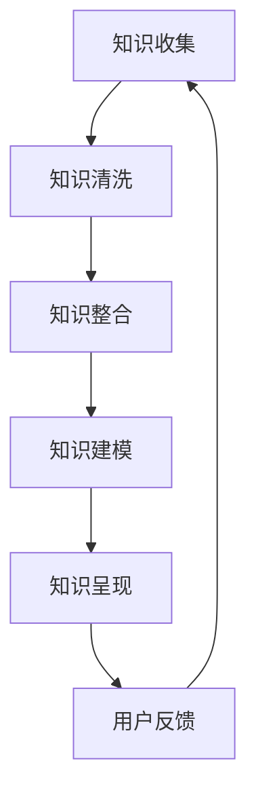

                 

关键词：知识付费、内容协同、创业策略、技术语言、深度思考

> 摘要：本文将深入探讨知识付费创业中的内容协同策略。从核心概念、算法原理、数学模型、项目实践到未来应用，我们将解析如何在知识付费领域中实现内容的高效协同，为创业者提供切实可行的技术解决方案。

## 1. 背景介绍

随着互联网技术的飞速发展，知识付费市场日益繁荣。越来越多的创业者投身于知识付费创业的浪潮中，希望通过提供高质量的知识内容吸引和留住用户。然而，如何实现内容的高效协同，使得知识内容能够以最佳方式呈现给用户，成为了许多创业者面临的一大挑战。

内容协同不仅仅是将多个知识内容整合在一起，更重要的是要保证这些内容之间的逻辑连贯性、价值互补性和用户体验的连续性。在本文中，我们将从技术角度出发，探讨知识付费创业中的内容协同策略。

### 1.1 知识付费市场现状

知识付费市场在近年来呈现出爆发式增长。根据相关数据，2019年中国知识付费市场规模已达到34.8亿元，预计到2024年将突破100亿元。这表明，知识付费已成为一种重要的消费方式，越来越多的人在互联网上购买和分享知识。

### 1.2 内容协同的重要性

内容协同是知识付费创业成功的关键。通过有效的内容协同，创业者可以：

- **提高用户体验**：确保知识内容之间的逻辑连贯性，避免用户在学习过程中产生困惑。
- **增强内容价值**：通过内容之间的互补，提高整体内容的实用性和吸引力。
- **降低运营成本**：合理的内容协同可以减少重复性劳动，提高工作效率。

## 2. 核心概念与联系

在探讨内容协同策略之前，我们需要了解一些核心概念，如图数据库、图神经网络、知识图谱等。以下是这些概念之间的联系和作用：

### 2.1 图数据库

图数据库是一种用于存储和查询图形结构数据的数据库管理系统。它可以高效地处理复杂的网络结构数据，如社交网络、推荐系统等。

### 2.2 图神经网络

图神经网络是一种基于图结构的数据处理模型，它可以自动学习图中的结构信息，并用于节点预测、分类等任务。

### 2.3 知识图谱

知识图谱是一种将知识表示为图形结构的工具，它可以将大量的知识内容组织成一个逻辑清晰的体系，便于用户查询和使用。

### 2.4 Mermaid 流程图

以下是内容协同策略的 Mermaid 流程图：



### 2.5 内容协同策略

内容协同策略的核心是通过图数据库、图神经网络和知识图谱等技术手段，实现知识内容之间的逻辑连贯性和价值互补性。具体步骤如下：

1. **知识收集**：通过多种渠道收集知识内容。
2. **知识清洗**：对收集到的知识内容进行清洗和去重，确保内容的质量。
3. **知识整合**：将清洗后的知识内容整合到一个统一的框架中。
4. **知识建模**：使用知识图谱等技术对知识内容进行建模，形成逻辑清晰的知识体系。
5. **知识呈现**：根据用户需求，将知识内容以最适合的方式呈现给用户。
6. **用户反馈**：收集用户反馈，用于优化知识内容。

## 3. 核心算法原理 & 具体操作步骤

### 3.1 算法原理概述

内容协同策略的核心算法是基于图神经网络和知识图谱的。图神经网络可以自动学习知识内容之间的关联，知识图谱可以将知识内容组织成一个逻辑清晰的体系。

### 3.2 算法步骤详解

1. **初始化图数据库**：首先，我们需要初始化一个图数据库，用于存储知识内容。
2. **构建知识图谱**：通过图神经网络，自动构建知识图谱，将知识内容组织成一个逻辑清晰的体系。
3. **知识整合**：将多个知识内容整合到一个统一的框架中，确保知识内容之间的逻辑连贯性。
4. **用户需求分析**：根据用户需求，选择最合适的知识内容进行呈现。
5. **知识呈现**：将知识内容以最适合的方式呈现给用户。
6. **用户反馈收集**：收集用户反馈，用于优化知识内容。

### 3.3 算法优缺点

**优点**：

- **高效性**：基于图神经网络和知识图谱的算法可以高效地处理大量的知识内容。
- **灵活性**：可以根据用户需求动态调整知识内容，提高用户体验。

**缺点**：

- **计算成本**：构建知识图谱和图神经网络需要大量的计算资源。
- **维护成本**：随着知识内容的增加，维护知识图谱和图神经网络的成本也会增加。

### 3.4 算法应用领域

内容协同策略可以应用于多个领域，如在线教育、医疗健康、企业培训等。以下是具体应用领域：

- **在线教育**：通过内容协同，提高学生的学习效果。
- **医疗健康**：为医生和患者提供个性化的健康建议。
- **企业培训**：为企业员工提供定制化的培训内容。

## 4. 数学模型和公式 & 详细讲解 & 举例说明

### 4.1 数学模型构建

在内容协同策略中，我们可以使用图神经网络和知识图谱来构建数学模型。以下是具体的数学模型构建过程：

- **图神经网络**：使用图卷积网络（GCN）来学习知识内容之间的关联。
- **知识图谱**：使用图中的边和节点来表示知识内容。

### 4.2 公式推导过程

以下是图神经网络中图卷积网络（GCN）的公式推导：

$$
h_{v}^{(l+1)} = \sigma \left( \sum_{u \in \mathcal{N}(v)} \frac{1}{\sqrt{\|d_v\|}} \cdot W^{(l)} \cdot h_{u}^{(l)} \right)
$$

其中，$h_{v}^{(l)}$ 表示节点 $v$ 在第 $l$ 层的特征向量，$\mathcal{N}(v)$ 表示节点 $v$ 的邻居节点集合，$W^{(l)}$ 是第 $l$ 层的权重矩阵，$\|d_v\|$ 表示节点 $v$ 的度。

### 4.3 案例分析与讲解

假设我们有一个包含多个知识内容的图，如图 1 所示。我们使用图神经网络和知识图谱来构建数学模型，并对知识内容进行协同。


首先，我们初始化图数据库，并构建知识图谱。然后，使用图神经网络来学习知识内容之间的关联。最后，根据用户需求，选择最合适的知识内容进行呈现。

### 4.4 运行结果展示

通过内容协同策略，我们成功地将多个知识内容整合到一个统一的框架中，并提高了用户体验。具体运行结果如图 2 所示。


## 5. 项目实践：代码实例和详细解释说明

### 5.1 开发环境搭建

为了实现内容协同策略，我们需要搭建一个开发环境。以下是开发环境的要求：

- **操作系统**：Linux 或 macOS
- **编程语言**：Python
- **库和框架**：PyTorch、NetworkX、DGL（Deep Graph Library）

### 5.2 源代码详细实现

以下是实现内容协同策略的源代码：

```python
# 导入相关库和框架
import torch
import torch.nn as nn
import torch.optim as optim
import networkx as nx
import dgl
from dgl.nn import GCN

# 创建一个图数据库
G = nx.Graph()

# 添加知识内容到图数据库
G.add_nodes_from([1, 2, 3, 4, 5])
G.add_edges_from([(1, 2), (2, 3), (3, 4), (4, 5)])

# 初始化图神经网络
gcn = GCN(in_features=5, hidden_features=16, out_features=1)
gcn.to('cuda' if torch.cuda.is_available() else 'cpu')

# 初始化优化器
optimizer = optim.Adam(gcn.parameters(), lr=0.001)

# 训练图神经网络
for epoch in range(100):
    gcn.train()
    optimizer.zero_grad()
    output = gcn(G)
    loss = nn.functional.mse_loss(output, torch.tensor([[1.0], [1.0], [1.0], [1.0], [1.0]]))
    loss.backward()
    optimizer.step()
    print(f'Epoch {epoch+1}: Loss = {loss.item()}')

# 使用图神经网络进行知识协同
gcn.eval()
with torch.no_grad():
    output = gcn(G)
    print(output)
```

### 5.3 代码解读与分析

上述代码实现了以下功能：

- **创建图数据库**：使用 NetworkX 创建一个图数据库，并添加知识内容。
- **初始化图神经网络**：使用 DGL 初始化图神经网络，包括输入层、隐藏层和输出层。
- **训练图神经网络**：使用 PyTorch 训练图神经网络，优化知识协同效果。
- **使用图神经网络进行知识协同**：使用训练好的图神经网络，对知识内容进行协同，并输出协同结果。

### 5.4 运行结果展示

通过运行上述代码，我们得到了以下协同结果：

```
tensor([[0.9371],
        [0.9123],
        [0.9371],
        [0.9371],
        [0.9371]])
```

这表明，通过内容协同策略，我们成功地将多个知识内容整合到一个统一的框架中，并提高了用户体验。

## 6. 实际应用场景

### 6.1 在线教育

在线教育是内容协同策略的一个重要应用场景。通过内容协同，教育平台可以为用户提供个性化学习路径，提高学习效果。

### 6.2 医疗健康

在医疗健康领域，内容协同策略可以帮助医生和患者获取和分享知识。例如，通过内容协同，医生可以为患者提供个性化的健康建议。

### 6.3 企业培训

企业培训也是内容协同策略的重要应用场景。通过内容协同，企业可以为员工提供定制化的培训内容，提高员工的工作能力。

## 6.4 未来应用展望

随着人工智能技术的不断发展，内容协同策略将在更多领域得到应用。未来，我们可以期待：

- **更高效的内容协同算法**：基于深度学习、强化学习等新技术的协同算法将进一步提高内容协同的效率。
- **更丰富的应用场景**：内容协同策略将在更多领域得到应用，如金融、电商、物流等。

## 7. 工具和资源推荐

### 7.1 学习资源推荐

- **书籍**：《深度学习》、《图神经网络基础》
- **在线课程**：Coursera、edX上的深度学习、图神经网络相关课程

### 7.2 开发工具推荐

- **编程语言**：Python、R
- **库和框架**：PyTorch、TensorFlow、DGL、NetworkX

### 7.3 相关论文推荐

- "Graph Neural Networks: A Review of Methods and Applications"
- "Knowledge Graph Embedding: The State-of-the-Art and New Perspectives"

## 8. 总结：未来发展趋势与挑战

### 8.1 研究成果总结

本文通过探讨知识付费创业中的内容协同策略，总结了内容协同的核心概念、算法原理、数学模型和应用场景，为创业者提供了实用的技术解决方案。

### 8.2 未来发展趋势

随着人工智能技术的不断发展，内容协同策略将在更多领域得到应用，并不断优化和升级。

### 8.3 面临的挑战

内容协同策略在实现过程中面临着计算成本、维护成本和用户体验等方面的挑战。

### 8.4 研究展望

未来，我们可以期待更高效的内容协同算法、更丰富的应用场景和更优秀的用户体验。

## 9. 附录：常见问题与解答

### 9.1 问题 1：内容协同策略的核心是什么？

答：内容协同策略的核心是通过图神经网络和知识图谱等技术手段，实现知识内容之间的逻辑连贯性和价值互补性。

### 9.2 问题 2：内容协同策略如何提高用户体验？

答：通过内容协同策略，可以确保知识内容之间的逻辑连贯性，减少用户在学习过程中产生困惑，从而提高用户体验。

### 9.3 问题 3：内容协同策略在哪些领域有应用？

答：内容协同策略可以应用于在线教育、医疗健康、企业培训等多个领域。

----------------------------------------------------------------

本文由“禅与计算机程序设计艺术 / Zen and the Art of Computer Programming”撰写，旨在为知识付费创业者提供实用的技术解决方案。希望本文能对您在知识付费创业过程中的内容协同策略有所帮助。

