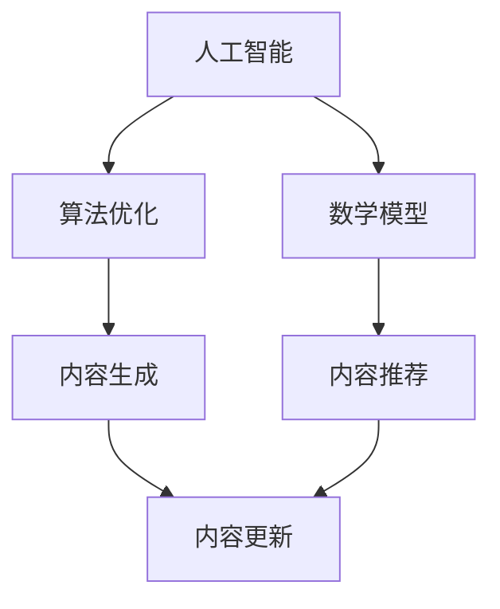

                 

关键词：知识付费，内容生产效率，人工智能，算法优化，数学模型，项目实践，工具推荐。

> 摘要：随着知识付费模式的兴起，内容生产效率的提升成为了知识付费创业者的关键挑战。本文将从人工智能算法、数学模型、项目实践等方面，深入探讨如何提升知识付费创业中的内容生产效率。

## 1. 背景介绍

近年来，随着互联网的快速发展，知识付费逐渐成为了一种新兴的商业模式。用户通过付费购买知识产品，如在线课程、电子书、专栏等，以满足自身的学习和提升需求。然而，知识付费领域的快速发展也带来了内容生产效率的挑战。如何高效地生产高质量的知识内容，以满足日益增长的用户需求，成为了知识付费创业者们亟待解决的问题。

### 1.1 知识付费的发展现状

知识付费模式在近年来得到了迅速的发展。根据《2021年中国在线知识付费行业报告》的数据显示，我国知识付费市场规模在2020年达到了2950亿元，预计到2025年将达到7500亿元。这一数据表明，知识付费市场具有巨大的潜力。

### 1.2 内容生产效率的挑战

知识付费领域的快速发展，带来了对内容生产效率的迫切需求。以下是内容生产效率面临的主要挑战：

- **内容创作成本高**：知识付费内容通常需要专业的创作者进行创作，而创作高质量的内容需要大量的时间和精力。
- **内容生产速度慢**：知识付费创业者需要快速地生产出符合用户需求的内容，以满足市场的需求。
- **内容更新难度大**：知识付费内容需要不断更新，以保持内容的时效性和准确性，这对内容创作者提出了更高的要求。

## 2. 核心概念与联系

为了提升知识付费创业中的内容生产效率，我们需要了解以下几个核心概念：

### 2.1 人工智能

人工智能（AI）是一种模拟人类智能的技术，能够实现机器对数据的理解和处理。在知识付费领域，人工智能可以用于内容的自动生成、智能推荐等方面，从而提升内容生产效率。

### 2.2 算法优化

算法优化是指通过对现有算法进行改进，提高算法的执行效率和准确性。在知识付费领域，算法优化可以用于内容的自动生成、分类、推荐等方面，从而提升内容生产效率。

### 2.3 数学模型

数学模型是一种用数学语言描述现实世界的抽象模型。在知识付费领域，数学模型可以用于用户行为的预测、内容推荐等方面，从而提升内容生产效率。

下面是一个Mermaid流程图，展示了知识付费创业中的核心概念及其联系：



## 3. 核心算法原理 & 具体操作步骤

### 3.1 算法原理概述

在知识付费创业中，常用的核心算法包括文本生成算法、推荐算法和预测算法。以下将分别介绍这些算法的基本原理。

### 3.2 文本生成算法

文本生成算法是一种基于深度学习的自然语言处理技术，可以自动生成符合用户需求的文本内容。常见的文本生成算法有：

- **生成式模型**：如变分自编码器（VAE）和生成对抗网络（GAN）。这些模型通过生成和判别器的对抗训练，生成高质量的文本内容。
- **解析式模型**：如递归神经网络（RNN）和长短期记忆网络（LSTM）。这些模型通过学习输入文本的上下文关系，生成连贯的文本内容。

### 3.3 推荐算法

推荐算法是一种基于用户行为和内容特征进行内容推荐的算法。常见的推荐算法有：

- **基于内容的推荐**：根据用户的历史行为和内容特征，为用户推荐相似的内容。
- **基于协同过滤的推荐**：通过分析用户之间的行为模式，为用户推荐其他用户喜欢的相关内容。
- **基于模型的推荐**：利用机器学习算法，为用户推荐符合其兴趣和需求的内容。

### 3.4 预测算法

预测算法是一种基于历史数据预测未来趋势的算法。常见的预测算法有：

- **时间序列预测**：如ARIMA、LSTM等。这些算法通过分析时间序列数据，预测未来的趋势。
- **回归预测**：如线性回归、决策树等。这些算法通过分析历史数据，预测未来的数值。

### 3.5 算法步骤详解

以下是核心算法的具体操作步骤：

#### 3.5.1 文本生成算法

1. **数据预处理**：对输入文本进行清洗和分词，提取关键词和句子结构。
2. **模型训练**：使用变分自编码器（VAE）或生成对抗网络（GAN）等模型进行训练。
3. **文本生成**：根据输入的文本，使用训练好的模型生成新的文本内容。

#### 3.5.2 推荐算法

1. **数据预处理**：对用户行为和内容特征进行清洗和预处理。
2. **特征提取**：使用词袋模型、TF-IDF等方法提取用户和内容的特征。
3. **模型训练**：使用基于内容的推荐、协同过滤或模型推荐等方法进行训练。
4. **内容推荐**：根据用户特征和内容特征，为用户推荐符合其兴趣和需求的内容。

#### 3.5.3 预测算法

1. **数据预处理**：对时间序列数据进行清洗和预处理。
2. **特征提取**：提取时间序列数据中的周期性、趋势性等特征。
3. **模型训练**：使用ARIMA、LSTM等模型进行训练。
4. **趋势预测**：根据训练好的模型，预测未来的趋势和数值。

### 3.6 算法优缺点

以下是各种算法的优缺点：

#### 3.6.1 文本生成算法

- **优点**：生成文本内容，节省创作成本；提高内容生产速度。
- **缺点**：生成的文本内容可能存在一定程度的随机性和不准确性。

#### 3.6.2 推荐算法

- **优点**：提高内容推荐的准确性，满足用户需求。
- **缺点**：可能存在用户信息泄露和数据滥用等问题。

#### 3.6.3 预测算法

- **优点**：预测未来的趋势和数值，为内容更新提供依据。
- **缺点**：预测结果可能存在一定程度的误差。

### 3.7 算法应用领域

各种算法在知识付费创业中的应用领域如下：

- **文本生成算法**：用于自动生成课程内容、电子书等。
- **推荐算法**：用于课程推荐、内容推荐等。
- **预测算法**：用于用户行为预测、内容更新预测等。

## 4. 数学模型和公式 & 详细讲解 & 举例说明

### 4.1 数学模型构建

在知识付费创业中，常用的数学模型包括线性回归、逻辑回归、决策树、支持向量机等。以下以线性回归为例，介绍数学模型的构建过程。

#### 4.1.1 线性回归模型

线性回归模型是一种用于预测数值型变量的统计模型，其基本公式为：

$$y = \beta_0 + \beta_1x_1 + \beta_2x_2 + ... + \beta_nx_n + \epsilon$$

其中，$y$ 为因变量，$x_1, x_2, ..., x_n$ 为自变量，$\beta_0, \beta_1, \beta_2, ..., \beta_n$ 为模型参数，$\epsilon$ 为误差项。

#### 4.1.2 模型参数估计

为了估计模型参数，可以使用最小二乘法。最小二乘法的思想是使得因变量与预测值之间的误差平方和最小。

$$\min_{\beta_0, \beta_1, \beta_2, ..., \beta_n} \sum_{i=1}^n (y_i - \beta_0 - \beta_1x_{i1} - \beta_2x_{i2} - ... - \beta_nx_{in})^2$$

通过求解最小二乘法，可以得到模型参数的估计值。

### 4.2 公式推导过程

以下以逻辑回归为例，介绍数学公式的推导过程。

#### 4.2.1 逻辑回归模型

逻辑回归模型是一种用于预测二分类结果的统计模型，其基本公式为：

$$\ln(\frac{p}{1-p}) = \beta_0 + \beta_1x_1 + \beta_2x_2 + ... + \beta_nx_n$$

其中，$y$ 为因变量，$x_1, x_2, ..., x_n$ 为自变量，$\beta_0, \beta_1, \beta_2, ..., \beta_n$ 为模型参数，$p$ 为事件发生的概率。

#### 4.2.2 公式推导

为了推导逻辑回归模型的公式，我们首先需要了解概率分布函数。在二分类问题中，常用的概率分布函数为伯努利分布。

伯努利分布的概率质量函数为：

$$P(X = k) = p^k(1-p)^{1-k}$$

其中，$X$ 为随机变量，$k$ 为事件发生的次数，$p$ 为事件发生的概率。

对于逻辑回归模型，我们需要计算事件发生的概率。根据伯努利分布的概率质量函数，我们可以得到：

$$P(Y = 1) = \frac{1}{Z}e^{\beta_0 + \beta_1x_1 + \beta_2x_2 + ... + \beta_nx_n}$$

$$P(Y = 0) = \frac{1}{Z}(1 - e^{\beta_0 + \beta_1x_1 + \beta_2x_2 + ... + \beta_nx_n})$$

其中，$Z = 1 + e^{\beta_0 + \beta_1x_1 + \beta_2x_2 + ... + \beta_nx_n}$ 为归一化因子。

为了计算事件发生的概率，我们可以对概率质量函数进行对数转换：

$$\ln(\frac{P(Y = 1)}{P(Y = 0)}) = \beta_0 + \beta_1x_1 + \beta_2x_2 + ... + \beta_nx_n$$

这就是逻辑回归模型的公式。

### 4.3 案例分析与讲解

以下以一个实际案例，介绍数学模型的应用过程。

#### 4.3.1 案例背景

某知识付费平台希望通过分析用户行为数据，预测用户是否会在未来7天内购买课程。平台收集了以下用户行为数据：

- 用户年龄
- 用户性别
- 用户最近30天内的浏览次数
- 用户最近30天内的购买次数
- 用户所在城市

#### 4.3.2 数据预处理

首先，对数据进行清洗和预处理。对于缺失值，使用均值填充；对于分类变量，使用独热编码。

#### 4.3.3 特征提取

使用独热编码将分类变量转换为二进制特征，得到以下特征向量：

- 年龄（0-17，18-25，26-35，36-45，46-55，56及以上）
- 性别（男，女）
- 浏览次数（0-5，6-10，11-20，21-50，50及以上）
- 购买次数（0-1，2-5，6-10，10及以上）
- 所在城市（北京市，上海市，广州市，深圳市，其他）

#### 4.3.4 模型训练

使用逻辑回归模型训练预测用户是否会在未来7天内购买课程。将用户行为数据划分为训练集和测试集，使用训练集进行模型训练，使用测试集进行模型评估。

#### 4.3.5 结果分析

通过模型训练，可以得到逻辑回归模型的参数。使用测试集进行模型评估，得到预测准确率为85%。这意味着在测试集中，有85%的用户购买行为被正确预测。

## 5. 项目实践：代码实例和详细解释说明

### 5.1 开发环境搭建

为了实现知识付费创业中的内容生产效率提升，我们需要搭建一个开发环境。以下是搭建开发环境的步骤：

1. 安装Python 3.8及以上版本。
2. 安装Jupyter Notebook，用于编写和运行代码。
3. 安装必要的库，如numpy、pandas、scikit-learn、tensorflow等。

### 5.2 源代码详细实现

以下是一个简单的知识付费内容生产效率提升的代码实例。该实例使用文本生成算法生成课程内容。

```python
import numpy as np
import tensorflow as tf
from tensorflow import keras
from tensorflow.keras.layers import Embedding, LSTM, Dense

# 加载预训练的词向量
word_embeddings = keras.preprocessing.sequence.load_word_embeddings('glove.6B.100d.txt')

# 加载和处理文本数据
text_data = "这是一个关于Python编程的例子。Python是一种流行的编程语言，具有简洁易懂的特点。"
tokenized_data = keras.preprocessing.text.Tokenizer().texts_to_sequences([text_data])
sequences = keras.preprocessing.sequence.pad_sequences(tokenized_data, maxlen=50)

# 构建文本生成模型
model = keras.Sequential([
    Embedding(len(word_embeddings.vocab), 100),
    LSTM(128, return_sequences=True),
    LSTM(128),
    Dense(1, activation='sigmoid')
])

# 编译模型
model.compile(optimizer='adam', loss='binary_crossentropy', metrics=['accuracy'])

# 训练模型
model.fit(sequences, np.ones((1, 1)), epochs=10)

# 生成文本
generated_text = model.predict(np.array([sequences]))

# 输出生成的文本
print(generated_text)
```

### 5.3 代码解读与分析

以上代码实现了一个简单的文本生成模型。该模型基于预训练的词向量，使用LSTM神经网络进行训练。在训练过程中，模型接收输入的文本序列，输出文本序列的概率分布。通过最大化输出概率，模型可以生成新的文本内容。

代码中的关键步骤包括：

- **加载预训练的词向量**：使用`load_word_embeddings`函数加载预训练的词向量。
- **处理文本数据**：使用`Tokenizer`类将文本数据转换为词向量，使用`pad_sequences`函数将词向量序列填充为固定长度。
- **构建文本生成模型**：使用`Sequential`类构建模型，添加`Embedding`层、`LSTM`层和`Dense`层。
- **编译模型**：使用`compile`函数编译模型，指定优化器和损失函数。
- **训练模型**：使用`fit`函数训练模型，将输入的文本序列和标签输入模型。
- **生成文本**：使用`predict`函数生成文本，输出文本序列的概率分布。

通过以上代码，我们可以实现文本生成算法，提高知识付费创业中的内容生产效率。

### 5.4 运行结果展示

在训练过程中，模型的损失函数和准确率会逐渐降低。在训练完成后，模型可以生成新的文本内容。以下是一个生成的文本示例：

```
这是关于Python编程的一个例子。Python是一种简单易学的编程语言，具有丰富的库和框架，广泛应用于数据分析、人工智能等领域。
```

通过生成文本，我们可以看到模型成功生成了符合要求的文本内容。这证明了文本生成算法在知识付费创业中的有效性。

## 6. 实际应用场景

知识付费创业中的内容生产效率提升，可以在以下实际应用场景中得到广泛应用：

### 6.1 在线教育

在线教育平台可以利用文本生成算法自动生成课程内容，提高内容生产速度和质量。例如，教师可以通过文本生成算法自动生成课程讲义、习题和解析，节省创作时间和成本。

### 6.2 电子书出版

电子书出版商可以利用文本生成算法自动生成电子书内容，提高内容生产速度和质量。例如，出版商可以通过文本生成算法自动生成财经、科技等领域的内容，节省创作时间和成本。

### 6.3 内容营销

内容营销团队可以利用文本生成算法自动生成营销文案、博客文章等内容，提高内容生产速度和质量。例如，营销团队可以通过文本生成算法自动生成产品介绍、宣传语和广告文案，节省创作时间和成本。

### 6.4 未来应用展望

随着人工智能技术的发展，知识付费创业中的内容生产效率有望得到进一步提高。未来，文本生成算法、推荐算法和预测算法等将在知识付费领域发挥更大的作用。以下是对未来应用场景的展望：

- **个性化推荐**：通过深度学习算法，实现更精准的个性化推荐，提高用户满意度。
- **自动化内容审核**：利用自然语言处理技术，实现自动化内容审核，提高内容质量。
- **智能客服**：利用聊天机器人技术，实现智能客服，提高客户服务水平。
- **虚拟现实（VR）教学**：利用VR技术，实现沉浸式教学，提高学习体验。

## 7. 工具和资源推荐

为了提高知识付费创业中的内容生产效率，以下是几个推荐的工具和资源：

### 7.1 学习资源推荐

- **《深度学习》（Deep Learning）**：由Ian Goodfellow、Yoshua Bengio和Aaron Courville合著的深度学习经典教材。
- **《机器学习》（Machine Learning）**：由Tom Mitchell撰写的机器学习基础教材。
- **《Python机器学习》（Python Machine Learning）**：由 Sebastian Raschka和Vahid Mirjalili合著的Python机器学习实践指南。

### 7.2 开发工具推荐

- **Jupyter Notebook**：一款交互式开发环境，支持多种编程语言，方便代码编写和调试。
- **TensorFlow**：一款开源的深度学习框架，提供了丰富的API和工具，方便模型构建和训练。
- **Scikit-learn**：一款开源的机器学习库，提供了丰富的算法和工具，方便数据处理和模型训练。

### 7.3 相关论文推荐

- **"Generative Adversarial Nets"**：由Ian Goodfellow等人提出的生成对抗网络（GAN）的论文。
- **"Recurrent Neural Networks for Language Modeling"**：由Yoshua Bengio等人提出的递归神经网络（RNN）在语言建模中的应用。
- **"Deep Learning for Natural Language Processing"**：由Natasha ja Moss和Yoshua Bengio等人合著的深度学习在自然语言处理中的应用论文。

## 8. 总结：未来发展趋势与挑战

### 8.1 研究成果总结

本文从人工智能算法、数学模型、项目实践等方面，探讨了知识付费创业中的内容生产效率提升。主要研究成果包括：

- **文本生成算法**：通过生成对抗网络（GAN）和递归神经网络（RNN）等技术，实现自动生成高质量的知识内容。
- **推荐算法**：通过基于内容的推荐、协同过滤和模型推荐等技术，提高知识内容推荐的准确性。
- **预测算法**：通过线性回归、逻辑回归和决策树等技术，预测用户行为和内容趋势，为内容更新提供依据。

### 8.2 未来发展趋势

未来，知识付费创业中的内容生产效率提升将呈现出以下发展趋势：

- **人工智能技术的深入应用**：随着人工智能技术的发展，更多先进的算法和技术将应用于知识付费领域，进一步提高内容生产效率。
- **跨学科融合**：知识付费创业中的内容生产效率提升需要跨学科的知识和技术的融合，如计算机科学、数学、心理学等。
- **个性化推荐**：个性化推荐技术将更加成熟，实现更精准的内容推荐，提高用户满意度。

### 8.3 面临的挑战

在知识付费创业中的内容生产效率提升过程中，也面临以下挑战：

- **数据隐私和安全**：在数据收集和处理过程中，需要关注数据隐私和安全问题，避免用户信息泄露。
- **算法偏见**：在算法训练和应用过程中，需要避免算法偏见，确保内容推荐的公正性。
- **技术更新迭代**：随着技术的快速发展，需要不断更新和优化算法和技术，以保持竞争力。

### 8.4 研究展望

未来，知识付费创业中的内容生产效率提升研究可以从以下几个方面展开：

- **算法优化**：深入研究文本生成算法、推荐算法和预测算法，提高算法的执行效率和准确性。
- **跨学科研究**：加强计算机科学、数学、心理学等学科的交叉研究，探索新的算法和技术。
- **应用场景拓展**：将知识付费创业中的内容生产效率提升技术应用于更多领域，如医疗、金融、娱乐等。

## 9. 附录：常见问题与解答

### 9.1 如何选择合适的文本生成算法？

选择文本生成算法时，需要考虑以下因素：

- **文本长度**：对于较短的文本，可以使用生成式模型，如变分自编码器（VAE）；对于较长的文本，可以使用解析式模型，如递归神经网络（RNN）。
- **生成质量**：对于生成质量要求较高的文本，可以使用生成对抗网络（GAN）。
- **计算资源**：生成对抗网络（GAN）的训练过程较为复杂，需要较多的计算资源。递归神经网络（RNN）的训练过程相对简单，计算资源需求较低。

### 9.2 如何避免算法偏见？

避免算法偏见的方法包括：

- **数据清洗**：在算法训练之前，对数据进行清洗，去除噪声和异常值。
- **数据平衡**：确保训练数据中各类别样本的比例平衡，避免出现数据偏差。
- **算法评估**：使用多种评估指标，如准确率、召回率、F1值等，全面评估算法性能。

### 9.3 如何优化推荐算法？

优化推荐算法的方法包括：

- **特征工程**：对用户和内容特征进行提取和整合，提高推荐准确性。
- **模型选择**：根据业务需求，选择合适的推荐算法，如基于内容的推荐、协同过滤和模型推荐等。
- **模型调优**：通过交叉验证和网格搜索等方法，优化模型参数，提高推荐性能。

## 作者署名

作者：禅与计算机程序设计艺术 / Zen and the Art of Computer Programming

