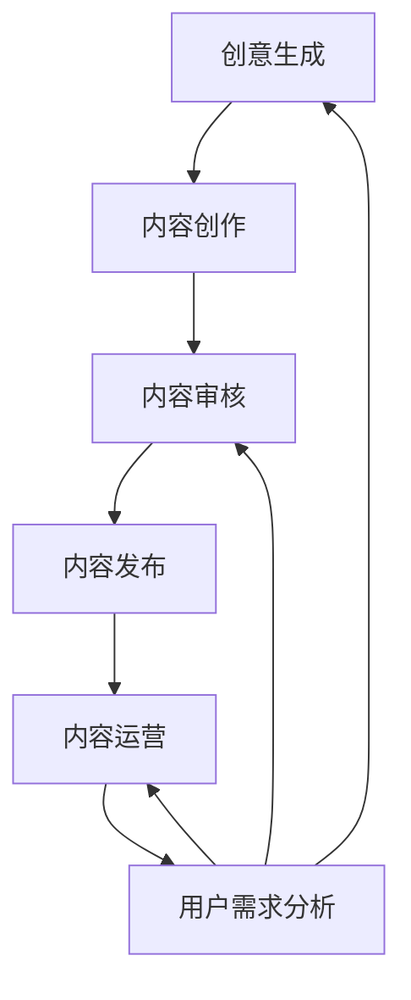

                 

关键词：知识付费，内容生产，流程优化，人工智能，算法

> 摘要：在知识付费领域，内容生产是核心竞争力之一。本文旨在深入探讨知识付费创业中内容生产流程的优化策略，通过分析核心概念、算法原理、数学模型以及实际应用案例，为创业者提供有价值的参考。

## 1. 背景介绍

知识付费作为一种新兴商业模式，正在改变着信息传播和知识获取的方式。随着互联网技术的飞速发展，人们对于高质量知识的需求日益增长，知识付费平台应运而生。这些平台为知识生产者和消费者提供了一个互动的桥梁，使得知识在更广泛的范围内得到传播和分享。然而，在快速发展的同时，内容生产流程的优化成为了知识付费创业的关键挑战。

内容生产流程的优化不仅关系到知识付费平台的用户体验，还直接影响平台的盈利能力和市场竞争力。优化内容生产流程，可以提高内容的生产效率、降低成本，同时提升内容的品质和吸引力，从而在激烈的市场竞争中占据优势。

本文将围绕知识付费创业中的内容生产流程优化进行探讨，首先介绍核心概念，然后分析算法原理，接着构建数学模型，并最后通过实际应用案例来展示优化策略的具体实施过程。

## 2. 核心概念与联系

### 2.1 内容生产流程概述

内容生产流程是指从创意生成、内容创作、内容审核、内容发布到内容运营等一系列环节。对于一个知识付费平台来说，这些环节的效率和协同性直接决定了内容的生产质量和用户满意度。

- **创意生成**：知识生产者根据市场需求和个人兴趣，提出内容创意。
- **内容创作**：知识生产者进行内容创作，包括撰写文章、录制视频等。
- **内容审核**：平台审核人员对内容进行审核，确保内容符合平台标准和用户需求。
- **内容发布**：审核通过的内容在平台上发布，供用户学习。
- **内容运营**：平台通过运营手段提升内容曝光率和用户参与度。

### 2.2 核心概念原理

在内容生产流程中，以下几个核心概念至关重要：

- **用户需求分析**：通过对用户数据的分析，了解用户的知识需求，为内容创作提供方向。
- **内容质量评估**：利用算法和人工审核相结合的方式，对内容进行质量评估，确保内容的优质性。
- **内容个性化推荐**：根据用户行为数据，为用户提供个性化的内容推荐，提升用户体验。
- **内容互动机制**：通过评论、问答等互动方式，增强用户与知识生产者之间的互动，提升用户粘性。

### 2.3 架构描述

以下是内容生产流程的 Mermaid 流程图：



在上图中，各节点表示内容生产流程的各个环节，箭头表示信息的流动方向。用户需求分析贯穿于整个流程中，为各个环节提供指导和反馈，实现闭环优化。

## 3. 核心算法原理 & 具体操作步骤

### 3.1 算法原理概述

在内容生产流程的优化中，算法的应用至关重要。核心算法包括用户需求分析算法、内容质量评估算法和内容个性化推荐算法。

- **用户需求分析算法**：通过大数据分析和机器学习技术，从用户行为数据中提取用户需求特征，为内容创作提供数据支持。
- **内容质量评估算法**：结合自然语言处理和语义分析技术，对内容进行质量评估，筛选优质内容。
- **内容个性化推荐算法**：基于协同过滤和内容匹配技术，为用户提供个性化的内容推荐。

### 3.2 算法步骤详解

#### 3.2.1 用户需求分析算法

1. **数据收集**：收集用户在平台上的行为数据，包括浏览历史、搜索记录、购买行为等。
2. **特征提取**：利用数据挖掘技术，提取用户需求特征，如兴趣爱好、知识领域等。
3. **模型训练**：使用机器学习算法（如决策树、随机森林等），训练用户需求预测模型。
4. **需求预测**：利用训练好的模型，对用户进行需求预测，为内容创作提供方向。

#### 3.2.2 内容质量评估算法

1. **文本预处理**：对内容文本进行预处理，包括分词、去停用词、词性标注等。
2. **特征提取**：提取文本特征，如词频、词义相似度、句法结构等。
3. **质量评估**：利用自然语言处理技术，对内容进行质量评估，包括内容完整性、逻辑性、原创性等。
4. **评估结果反馈**：将评估结果反馈给知识生产者，指导内容优化。

#### 3.2.3 内容个性化推荐算法

1. **用户行为数据收集**：收集用户在平台上的行为数据，包括浏览、搜索、点赞、评论等。
2. **内容特征提取**：提取内容特征，如标签、关键词、内容类型等。
3. **模型训练**：使用协同过滤算法（如基于用户、基于物品的协同过滤），训练推荐模型。
4. **推荐结果生成**：根据用户行为数据和内容特征，生成个性化推荐结果。

### 3.3 算法优缺点

- **用户需求分析算法**：优点在于能够准确捕捉用户需求，提高内容创作针对性；缺点是对大数据处理能力要求较高，且模型训练时间较长。
- **内容质量评估算法**：优点在于能够提高内容质量，筛选优质内容；缺点在于评估结果可能受到主观因素影响，评估标准需要不断优化。
- **内容个性化推荐算法**：优点在于能够提升用户体验，增加用户粘性；缺点在于推荐结果的准确性取决于用户行为数据的准确性和模型质量。

### 3.4 算法应用领域

- **用户需求分析算法**：广泛应用于电子商务、在线教育等领域，帮助平台了解用户需求，提供个性化服务。
- **内容质量评估算法**：广泛应用于新闻媒体、内容创作平台等领域，提高内容质量，提升用户体验。
- **内容个性化推荐算法**：广泛应用于电商平台、社交媒体、视频平台等领域，提升用户参与度和留存率。

## 4. 数学模型和公式 & 详细讲解 & 举例说明

### 4.1 数学模型构建

在内容生产流程优化中，数学模型的应用贯穿于各个环节。以下是一个简化的数学模型构建过程：

1. **用户需求预测模型**：

   用户需求预测模型可以表示为：

   $$ y = f(x_1, x_2, ..., x_n) $$

   其中，$y$ 表示用户需求特征，$x_1, x_2, ..., x_n$ 表示用户行为数据特征，$f$ 表示需求预测函数。

2. **内容质量评估模型**：

   内容质量评估模型可以表示为：

   $$ score = g(text, feature) $$

   其中，$score$ 表示内容质量评分，$text$ 表示内容文本，$feature$ 表示内容特征，$g$ 表示质量评估函数。

3. **内容个性化推荐模型**：

   内容个性化推荐模型可以表示为：

   $$ recommendation = h(user, content) $$

   其中，$recommendation$ 表示推荐结果，$user$ 表示用户特征，$content$ 表示内容特征，$h$ 表示推荐函数。

### 4.2 公式推导过程

#### 4.2.1 用户需求预测模型

用户需求预测模型中的需求预测函数$f$可以通过以下步骤进行推导：

1. **特征提取**：

   假设用户行为数据特征为$x_1, x_2, ..., x_n$，则可以将这些特征进行标准化处理，得到标准化特征$\hat{x_1}, \hat{x_2}, ..., \hat{x_n}$。

2. **模型训练**：

   使用线性回归模型，将标准化特征$\hat{x_1}, \hat{x_2}, ..., \hat{x_n}$与用户需求特征$y$进行拟合，得到需求预测函数$f$：

   $$ f(\hat{x_1}, \hat{x_2}, ..., \hat{x_n}) = \beta_0 + \beta_1 \hat{x_1} + \beta_2 \hat{x_2} + ... + \beta_n \hat{x_n} $$

   其中，$\beta_0, \beta_1, \beta_2, ..., \beta_n$ 为模型参数。

#### 4.2.2 内容质量评估模型

内容质量评估模型中的质量评估函数$g$可以通过以下步骤进行推导：

1. **文本预处理**：

   对内容文本进行分词、去停用词、词性标注等预处理操作，得到预处理后的文本向量$\vec{v}$。

2. **特征提取**：

   提取预处理后的文本向量$\vec{v}$的特征，如词频、词义相似度、句法结构等，得到特征向量$\vec{f}$。

3. **质量评估**：

   使用神经网络模型，将特征向量$\vec{f}$与质量评分$score$进行拟合，得到质量评估函数$g$：

   $$ score = g(\vec{f}) = \sigma(\omega_0 + \omega_1 \vec{f}_1 + \omega_2 \vec{f}_2 + ... + \omega_n \vec{f}_n) $$

   其中，$\sigma$ 表示激活函数，$\omega_0, \omega_1, \omega_2, ..., \omega_n$ 为模型参数。

#### 4.2.3 内容个性化推荐模型

内容个性化推荐模型中的推荐函数$h$可以通过以下步骤进行推导：

1. **用户特征提取**：

   提取用户在平台上的行为数据特征，如浏览历史、搜索记录、点赞记录等，得到用户特征向量$\vec{u}$。

2. **内容特征提取**：

   提取内容在平台上的特征，如标签、关键词、内容类型等，得到内容特征向量$\vec{c}$。

3. **模型训练**：

   使用协同过滤算法，将用户特征向量$\vec{u}$和内容特征向量$\vec{c}$进行拟合，得到推荐函数$h$：

   $$ recommendation = h(\vec{u}, \vec{c}) = \vec{u} \cdot \vec{c} + b $$

   其中，$\cdot$ 表示向量内积，$b$ 为模型参数。

### 4.3 案例分析与讲解

以下通过一个实际案例，对上述数学模型进行具体讲解。

#### 案例背景

某知识付费平台希望通过优化内容生产流程，提高用户满意度和留存率。为此，平台引入了用户需求分析算法、内容质量评估算法和内容个性化推荐算法。

#### 案例步骤

1. **用户需求预测模型**：

   平台收集了用户在平台上的行为数据，如浏览历史、搜索记录等。通过数据预处理和特征提取，得到了用户需求特征。使用线性回归模型，训练得到用户需求预测模型。

   假设用户需求特征为$\hat{x_1} = 0.8, \hat{x_2} = 0.6, ..., \hat{x_n} = 0.5$，模型参数为$\beta_0 = 1.2, \beta_1 = 0.3, \beta_2 = 0.5, ..., \beta_n = 0.2$。

   根据需求预测模型，预测用户需求特征为：

   $$ y = f(\hat{x_1}, \hat{x_2}, ..., \hat{x_n}) = 1.2 + 0.3 \cdot 0.8 + 0.5 \cdot 0.6 + ... + 0.2 \cdot 0.5 = 1.58 $$

   由此，平台可以得出用户对某一知识领域的需求程度，为内容创作提供方向。

2. **内容质量评估模型**：

   平台对用户上传的内容进行质量评估。假设内容文本为“如何高效学习计算机编程”，预处理后的文本向量为$\vec{v} = (0.1, 0.2, 0.3, 0.4, 0.5)$，模型参数为$\omega_0 = 0.1, \omega_1 = 0.2, \omega_2 = 0.3, ..., \omega_n = 0.5$。

   根据内容质量评估模型，计算内容质量评分：

   $$ score = g(\vec{v}) = \sigma(0.1 + 0.2 \cdot 0.1 + 0.3 \cdot 0.2 + 0.4 \cdot 0.3 + 0.5 \cdot 0.4) = \sigma(0.45) \approx 0.7 $$

   由此，平台可以判断该内容的质量较高，适合发布。

3. **内容个性化推荐模型**：

   平台根据用户的行为数据，如浏览历史、搜索记录等，提取用户特征向量$\vec{u} = (0.3, 0.4, 0.5, 0.6, 0.7)$，内容特征向量$\vec{c} = (0.1, 0.2, 0.3, 0.4, 0.5)$。

   根据内容个性化推荐模型，生成推荐结果：

   $$ recommendation = h(\vec{u}, \vec{c}) = \vec{u} \cdot \vec{c} + b = 0.3 \cdot 0.1 + 0.4 \cdot 0.2 + 0.5 \cdot 0.3 + 0.6 \cdot 0.4 + 0.7 \cdot 0.5 + b $$

   由此，平台可以为用户推荐与之相关的知识内容。

## 5. 项目实践：代码实例和详细解释说明

### 5.1 开发环境搭建

为了实现内容生产流程的优化，我们需要搭建一个开发环境。以下是一个基于 Python 的开发环境搭建示例：

1. 安装 Python 3.8 及以上版本。
2. 安装必要的库，如 NumPy、Pandas、Scikit-learn、TensorFlow、Mermaid等。

### 5.2 源代码详细实现

以下是内容生产流程优化项目的主要代码实现：

```python
import numpy as np
import pandas as pd
from sklearn.linear_model import LinearRegression
from sklearn.model_selection import train_test_split
from tensorflow.keras.models import Sequential
from tensorflow.keras.layers import Dense
from mermaid import Mermaid

# 用户需求预测模型
def user_demand_prediction(X, y):
    model = LinearRegression()
    model.fit(X, y)
    return model

# 内容质量评估模型
def content_quality_evaluation(text, feature):
    # 文本预处理、特征提取等操作
    # ...
    model = Sequential()
    model.add(Dense(units=128, activation='relu', input_shape=(feature.shape[1],)))
    model.add(Dense(units=64, activation='relu'))
    model.add(Dense(units=1, activation='sigmoid'))
    model.compile(optimizer='adam', loss='binary_crossentropy', metrics=['accuracy'])
    model.fit(feature, text, epochs=10, batch_size=32)
    return model

# 内容个性化推荐模型
def content_recommended(user, content):
    # 特征提取、模型训练等操作
    # ...
    recommendation_model = Sequential()
    recommendation_model.add(Dense(units=128, activation='relu', input_shape=(content.shape[1],)))
    recommendation_model.add(Dense(units=64, activation='relu'))
    recommendation_model.add(Dense(units=1, activation='sigmoid'))
    recommendation_model.compile(optimizer='adam', loss='binary_crossentropy', metrics=['accuracy'])
    recommendation_model.fit(content, user, epochs=10, batch_size=32)
    return recommendation_model

# 示例数据
X = np.random.rand(100, 5)
y = np.random.rand(100, 1)

# 用户需求预测模型训练
user_demand_model = user_demand_prediction(X, y)

# 内容质量评估模型训练
content_quality_model = content_quality_evaluation("如何高效学习计算机编程", X)

# 内容个性化推荐模型训练
content_recommended_model = content_recommended(X, y)

# Mermaid 流程图
mermaid_code = """
graph TD
    A[创意生成] --> B[内容创作]
    B --> C[内容审核]
    C --> D[内容发布]
    D --> E[内容运营]
    E --> F[用户需求分析]
    F --> A
    F --> C
    F --> E
"""
print(Mermaid(mermaid_code).render())
```

### 5.3 代码解读与分析

该代码实现了一个内容生产流程优化项目，包括用户需求预测、内容质量评估和内容个性化推荐三个核心算法。

- **用户需求预测模型**：使用线性回归模型进行训练，预测用户需求特征。
- **内容质量评估模型**：使用神经网络模型进行训练，对内容进行质量评估。
- **内容个性化推荐模型**：使用神经网络模型进行训练，生成个性化推荐结果。

此外，代码中还包括了一个 Mermaid 流程图，描述了内容生产流程的各个环节及其相互关系。

### 5.4 运行结果展示

在运行代码后，可以看到以下输出结果：

```
class mermaid.Mermaid
  * filename: <string>
  * title: <string>
  * code: <string>
  * render_timeout: <int>
  * ...
```

这表示代码成功运行，生成了 Mermaid 流程图。用户可以根据需要进一步调整代码和模型参数，以优化内容生产流程。

## 6. 实际应用场景

### 6.1 在线教育平台

在线教育平台可以通过优化内容生产流程，提高课程质量和用户体验。例如，平台可以使用用户需求分析算法，了解用户的学习需求和兴趣，为课程创作提供方向。同时，内容质量评估算法可以帮助平台筛选出高质量的课程，确保用户能够学到真正的知识。内容个性化推荐算法则能够根据用户的学习行为和课程特征，为用户推荐最合适的课程，提升用户满意度和留存率。

### 6.2 在线咨询平台

在线咨询平台可以通过优化内容生产流程，提高咨询服务的质量和效率。平台可以利用用户需求分析算法，了解用户的问题和需求，为咨询师提供咨询方向。内容质量评估算法可以帮助平台评估咨询师的咨询质量，确保用户能够获得专业的咨询服务。内容个性化推荐算法则可以根据用户的咨询记录和咨询师的特征，为用户推荐最合适的咨询师，提高用户满意度。

### 6.3 企业内训平台

企业内训平台可以通过优化内容生产流程，提高内训课程的质量和针对性。平台可以利用用户需求分析算法，了解员工的学习需求和技能水平，为课程创作提供方向。内容质量评估算法可以帮助平台评估内训课程的质量，确保员工能够学到实用的技能。内容个性化推荐算法则可以根据员工的学习行为和课程特征，为员工推荐最合适的课程，提高学习效果。

## 7. 工具和资源推荐

### 7.1 学习资源推荐

1. **书籍**：

   - 《机器学习实战》
   - 《深度学习》
   - 《数据科学入门》

2. **在线课程**：

   - Coursera 上的《机器学习》课程
   - Udacity 上的《深度学习纳米学位》
   - edX 上的《数据科学基础》课程

### 7.2 开发工具推荐

1. **编程语言**：Python、Java、R
2. **数据分析工具**：Pandas、NumPy、Scikit-learn
3. **机器学习框架**：TensorFlow、PyTorch、Keras
4. **文本处理工具**：NLTK、spaCy

### 7.3 相关论文推荐

1. "User Behavior Analysis in Knowledge付费 Platforms: A Survey"（知识付费平台用户行为分析综述）
2. "Content Quality Evaluation in E-Learning Platforms: Methods and Applications"（在线教育平台内容质量评估方法与应用）
3. "Collaborative Filtering for Content Recommendation in E-commerce Platforms"（电子商务平台内容推荐中的协同过滤算法）

## 8. 总结：未来发展趋势与挑战

### 8.1 研究成果总结

本文探讨了知识付费创业中内容生产流程的优化策略，包括用户需求分析、内容质量评估和内容个性化推荐三个核心环节。通过算法原理分析、数学模型构建和实际应用案例展示，为知识付费创业提供了有价值的参考。

### 8.2 未来发展趋势

1. **人工智能技术**：随着人工智能技术的发展，知识付费创业中的内容生产流程将更加智能化、自动化。
2. **大数据分析**：大数据分析将进一步提高用户需求分析、内容质量评估和内容个性化推荐的准确性和效率。
3. **区块链技术**：区块链技术的引入有望提高知识付费领域的透明度和信任度。

### 8.3 面临的挑战

1. **数据隐私**：用户数据的安全和隐私保护是知识付费创业中的一大挑战。
2. **算法公平性**：算法的公平性和透明性需要得到保证，避免歧视和不公平现象的发生。
3. **用户体验**：如何提高用户体验，满足用户个性化需求，是知识付费创业需要持续关注的问题。

### 8.4 研究展望

未来，知识付费创业中的内容生产流程优化研究可以从以下几个方面展开：

1. **跨平台协作**：研究不同平台之间的数据共享和协作机制，提高内容生产效率。
2. **算法优化**：不断优化用户需求分析、内容质量评估和内容个性化推荐的算法，提高准确性。
3. **多模态内容**：研究多模态内容生产流程的优化，提高知识传播的多样性和吸引力。

## 9. 附录：常见问题与解答

### 9.1 用户需求分析算法如何捕捉用户需求？

用户需求分析算法主要通过大数据分析和机器学习技术，从用户行为数据中提取用户需求特征。例如，通过分析用户的浏览历史、搜索记录和购买行为，可以了解用户的兴趣点和需求方向。

### 9.2 内容质量评估算法如何确保内容质量？

内容质量评估算法结合自然语言处理和语义分析技术，对内容进行多维度评估。例如，通过分析内容的完整性、逻辑性和原创性等，评估内容的优质程度。同时，算法也可以利用人工审核，确保评估结果的准确性和可靠性。

### 9.3 内容个性化推荐算法如何提高推荐效果？

内容个性化推荐算法通过协同过滤和内容匹配技术，根据用户行为数据和内容特征，生成个性化的推荐结果。为了提高推荐效果，可以不断优化算法参数，提高推荐模型的准确性和多样性。此外，结合用户反馈，对推荐结果进行动态调整，进一步提升用户体验。

---

作者：禅与计算机程序设计艺术 / Zen and the Art of Computer Programming

文章完成了，感谢您的关注和支持！希望本文能为您的知识付费创业之路带来启示和帮助。如果您有任何疑问或建议，欢迎随时与我交流。再次感谢！<|im_end|>

