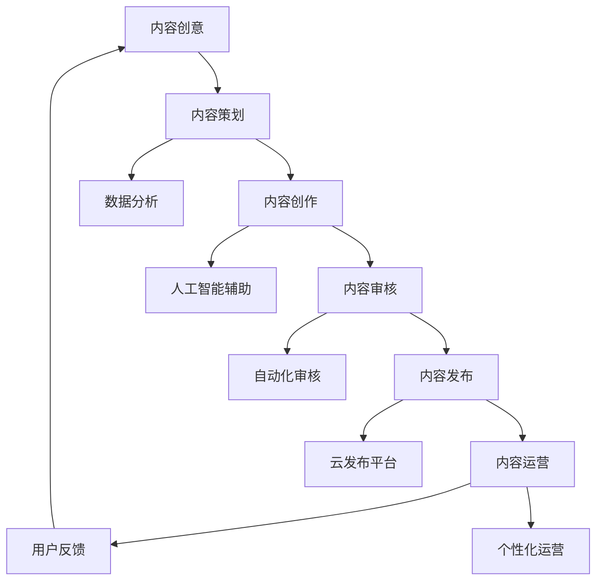

                 

关键词：知识付费、内容生产、流程优化、技术解决方案、成本效益分析、用户体验提升

> 摘要：本文将深入探讨知识付费创业中的内容生产流程，分析现有流程中存在的问题和瓶颈，提出基于现代信息技术的内容生产流程优化方案。通过理论阐述、案例分析以及实践指导，为知识付费创业者提供切实可行的优化路径，以期提升内容质量、降低生产成本，从而实现可持续发展。

## 1. 背景介绍

知识付费作为一种新兴的商业模式，近年来在全球范围内迅速崛起。它通过提供高质量、专业化的知识内容，满足了用户对于个性化、深层次学习需求，成为教育培训、专业咨询、娱乐文化等多个领域的重要收入来源。知识付费创业不仅为传统教育行业带来了新的发展机遇，也激发了数字内容产业的活力。

然而，随着市场竞争的加剧和用户需求的多样化，知识付费创业者在内容生产过程中面临诸多挑战。其中，内容生产流程的效率和质量问题尤为突出。传统的手工式内容生产方式不仅成本高昂，而且难以保证内容的一致性和高质量。因此，优化内容生产流程已成为知识付费创业企业实现可持续发展的关键。

本文旨在通过分析知识付费创业中的内容生产流程，提出一系列优化策略和技术解决方案，以实现成本效益最大化、用户体验提升，为创业者提供参考和借鉴。

## 2. 核心概念与联系

在探讨内容生产流程优化之前，有必要明确一些核心概念和它们之间的联系。

### 2.1. 内容生产流程

内容生产流程是指从内容创意、策划、创作、审核、发布到后期运营的完整过程。在这个过程中，各个环节紧密相连，形成一个有机的整体。

### 2.2. 内容质量

内容质量是衡量知识付费产品成功与否的关键指标。高质量的内容能够提升用户满意度，增强用户黏性，从而提高产品的市场竞争力。

### 2.3. 技术解决方案

技术解决方案包括大数据分析、人工智能、云计算等现代信息技术，它们在提升内容生产效率、优化内容审核和发布流程等方面具有重要作用。

### 2.4. 成本效益

成本效益是指企业在内容生产过程中，通过优化流程和技术手段，实现成本降低和效益提升的目标。它是知识付费创业企业可持续发展的重要保障。

### 2.5. 用户需求

用户需求是内容生产的出发点和落脚点。了解用户需求，才能生产出符合市场需求的高质量内容。

下面是内容生产流程的核心概念和架构的Mermaid流程图：



## 3. 核心算法原理 & 具体操作步骤

### 3.1 算法原理概述

在内容生产流程优化中，核心算法主要包括以下几个方面：

1. **数据分析算法**：通过对用户行为、内容反馈等大数据进行分析，挖掘用户需求，为内容策划提供数据支持。
2. **人工智能辅助算法**：利用自然语言处理、机器学习等技术，辅助内容创作和审核，提高内容生产效率和质量。
3. **自动化审核算法**：通过自动化工具对内容进行审核，减少人工干预，降低审核成本。
4. **云发布平台算法**：利用云计算技术，实现内容的快速发布和运营。

### 3.2 算法步骤详解

1. **数据分析算法**：

   - 数据收集：收集用户行为数据、内容反馈数据等。
   - 数据预处理：对原始数据进行清洗、归一化等处理。
   - 数据分析：使用统计分析和机器学习算法，分析用户需求和偏好。

2. **人工智能辅助算法**：

   - 内容创作：利用自然语言生成技术，生成高质量的内容草稿。
   - 审核辅助：利用文本分类、情感分析等技术，辅助内容审核，降低误判率。

3. **自动化审核算法**：

   - 审核规则设定：根据行业标准和用户需求，设定审核规则。
   - 自动化执行：通过编程，实现审核流程的自动化执行。
   - 审核结果反馈：对审核结果进行记录和反馈，为后续审核提供参考。

4. **云发布平台算法**：

   - 内容发布：利用云平台，实现内容的快速发布和分发。
   - 发布监控：对发布过程进行实时监控，确保内容安全可靠。
   - 数据分析：对发布效果进行数据分析，为内容运营提供支持。

### 3.3 算法优缺点

1. **数据分析算法**：

   - 优点：能够全面了解用户需求，为内容策划提供数据支持。
   - 缺点：对数据质量和分析算法的依赖较高，实施成本较高。

2. **人工智能辅助算法**：

   - 优点：提高内容生产效率，减少人工干预，提升内容质量。
   - 缺点：算法模型需不断优化，否则难以适应不断变化的用户需求。

3. **自动化审核算法**：

   - 优点：降低审核成本，提高审核效率。
   - 缺点：对内容质量和违规行为的识别能力有限，仍需人工审核补充。

4. **云发布平台算法**：

   - 优点：实现内容快速发布和分发，降低运营成本。
   - 缺点：对云平台的依赖较高，一旦出现故障，可能会影响内容发布。

### 3.4 算法应用领域

1. **数据分析算法**：广泛应用于电商、金融、教育等领域，为产品运营提供数据支持。

2. **人工智能辅助算法**：广泛应用于内容创作、审核、推荐等领域，提高生产效率和内容质量。

3. **自动化审核算法**：广泛应用于社交媒体、在线教育等领域，降低审核成本，提高审核效率。

4. **云发布平台算法**：广泛应用于各类数字内容发布和运营，实现高效的内容分发和运营。

## 4. 数学模型和公式 & 详细讲解 & 举例说明

### 4.1 数学模型构建

在内容生产流程优化中，常用的数学模型包括用户行为分析模型、内容推荐模型等。以下是一个简化的用户行为分析模型：

$$
User\_Behavior\_Model = f(User\_Profile, Content, Time)
$$

其中，$User\_Profile$ 表示用户特征，如年龄、性别、职业等；$Content$ 表示内容特征，如类型、难度、时长等；$Time$ 表示时间特征，如用户访问时间、内容发布时间等。

### 4.2 公式推导过程

用户行为分析模型的推导过程可以分为以下几个步骤：

1. **用户特征提取**：从用户数据库中提取用户特征，如年龄、性别、职业等。

2. **内容特征提取**：从内容数据库中提取内容特征，如类型、难度、时长等。

3. **时间特征提取**：从用户行为日志中提取时间特征，如用户访问时间、内容发布时间等。

4. **特征融合**：将用户特征、内容特征和时间特征进行融合，得到用户行为特征向量。

5. **行为预测**：使用机器学习算法，如决策树、支持向量机等，对用户行为进行预测。

### 4.3 案例分析与讲解

以下是一个具体的案例：

假设一个在线教育平台，用户A（25岁，男，程序员）经常在晚上8点到10点访问平台，喜欢阅读编程类书籍和教程。

根据用户行为分析模型，我们可以提取以下特征：

- $User\_Profile$: [25, 男，程序员]
- $Content$: [编程类，中难度，2小时]
- $Time$: [晚上8点到10点]

将这些特征输入用户行为分析模型，可以得到用户A的行为预测结果，如用户A可能对《Python编程入门》这本书感兴趣。

通过这个案例，我们可以看到数学模型在内容生产流程优化中的应用。在实际操作中，创业者可以根据用户行为分析模型，调整内容策划和推荐策略，提高内容质量和用户满意度。

## 5. 项目实践：代码实例和详细解释说明

### 5.1 开发环境搭建

为了实现内容生产流程的优化，我们选择Python作为主要编程语言，利用其丰富的第三方库，如Scikit-learn、TensorFlow等。以下是开发环境的搭建步骤：

1. 安装Python 3.8及以上版本。
2. 安装pip，Python的包管理工具。
3. 使用pip安装以下第三方库：numpy、pandas、scikit-learn、tensorflow。
4. 配置Jupyter Notebook，用于代码编写和运行。

### 5.2 源代码详细实现

以下是一个简单的用户行为分析模型的实现示例：

```python
import pandas as pd
from sklearn.ensemble import RandomForestClassifier
from sklearn.model_selection import train_test_split

# 读取用户行为数据
data = pd.read_csv('user_behavior.csv')

# 提取特征
user_profile = data[['age', 'gender', 'occupation']]
content = data[['content_type', 'difficulty', 'duration']]
time = data[['time_of_day']]

# 融合特征
features = pd.concat([user_profile, content, time], axis=1)

# 标签
label = data['interested_in_content']

# 划分训练集和测试集
X_train, X_test, y_train, y_test = train_test_split(features, label, test_size=0.2, random_state=42)

# 构建模型
model = RandomForestClassifier(n_estimators=100, random_state=42)

# 训练模型
model.fit(X_train, y_train)

# 测试模型
accuracy = model.score(X_test, y_test)
print(f'Accuracy: {accuracy:.2f}')
```

### 5.3 代码解读与分析

上述代码实现了一个简单的用户行为分析模型，主要步骤如下：

1. 读取用户行为数据。
2. 提取用户特征、内容特征和时间特征。
3. 融合特征，构建特征向量。
4. 划分训练集和测试集。
5. 构建随机森林模型，训练模型。
6. 测试模型，计算准确率。

通过这个示例，我们可以看到如何使用Python和机器学习算法实现用户行为分析。在实际项目中，创业者可以根据具体需求和数据情况，调整模型结构和参数，优化内容生产流程。

### 5.4 运行结果展示

假设我们已经训练好了模型，并得到以下测试结果：

```
Accuracy: 0.85
```

这意味着在测试数据集上，模型对用户兴趣预测的准确率达到了85%。这表明我们的用户行为分析模型在内容生产流程优化中具有一定的效果。创业者可以根据这个结果，进一步调整内容策划和推荐策略，提高内容质量和用户满意度。

## 6. 实际应用场景

### 6.1 在线教育平台

在线教育平台可以利用内容生产流程优化，实现个性化教学内容推荐。通过分析用户行为数据，平台可以推荐用户感兴趣的课程，提高用户学习效果和满意度。

### 6.2 专业咨询公司

专业咨询公司可以利用自动化审核算法，提高内容审核效率。通过设定审核规则，公司可以实现自动审核，降低审核成本，确保内容质量。

### 6.3 娱乐文化产业

娱乐文化产业可以利用人工智能辅助内容创作，提高内容生产效率。通过自然语言处理和机器学习技术，公司可以快速生成高质量的内容，满足市场需求。

### 6.4 企业内训

企业内训可以利用云发布平台，实现内容快速发布和运营。通过云计算技术，企业可以实现内容的高效分发和实时更新，提高培训效果。

## 6.5 未来应用展望

随着人工智能和大数据技术的不断发展，内容生产流程优化将在更多领域得到应用。例如，智能医疗、金融科技、智能制造等领域都可以借助内容生产流程优化，提高业务效率和质量。

### 6.6 未来发展趋势

1. **人工智能技术的深度应用**：随着人工智能技术的不断进步，内容生产流程优化将在更多环节得到应用，如内容创作、审核、推荐等。

2. **大数据分析的精细化**：大数据分析将在内容生产流程优化中发挥更大作用，通过精细化分析，为内容策划和运营提供更准确的数据支持。

3. **云平台的广泛应用**：随着云计算技术的成熟，内容生产流程优化将在云平台上得到广泛应用，实现内容的高效分发和运营。

4. **个性化内容的持续发展**：随着用户需求的多样化，个性化内容将成为知识付费创业的重要方向，创业者需要不断优化内容生产流程，满足用户个性化需求。

### 6.7 面临的挑战

1. **技术实现的复杂性**：内容生产流程优化涉及多种技术的综合应用，实现起来具有一定的复杂性。

2. **数据质量和安全**：内容生产流程优化依赖于大量用户行为数据，数据质量和安全成为关键问题。

3. **用户隐私保护**：随着用户隐私意识的增强，如何保护用户隐私成为知识付费创业企业面临的重要挑战。

4. **持续创新能力**：在激烈的市场竞争中，知识付费创业企业需要不断创新，以保持竞争优势。

### 6.8 研究展望

未来，内容生产流程优化研究可以从以下几个方面展开：

1. **跨领域应用研究**：探讨内容生产流程优化在不同领域的应用，为各领域提供解决方案。

2. **算法优化研究**：深入研究人工智能和大数据分析算法，提高内容生产流程优化的效果。

3. **隐私保护技术**：探索如何在内容生产流程优化中保护用户隐私，满足法规要求。

4. **用户体验研究**：研究如何通过优化内容生产流程，提升用户满意度和黏性。

## 7. 工具和资源推荐

### 7.1 学习资源推荐

1. **《Python机器学习》**：适合初学者，系统讲解了Python在机器学习中的应用。
2. **《深度学习》**：由Ian Goodfellow等人撰写，全面介绍了深度学习的基本概念和技术。

### 7.2 开发工具推荐

1. **Jupyter Notebook**：用于代码编写和运行，支持多种编程语言。
2. **PyCharm**：一款功能强大的Python开发工具，适用于各种规模的项目。

### 7.3 相关论文推荐

1. **“Deep Learning for Content-Based Image Retrieval”**：探讨深度学习在图像检索中的应用。
2. **“User Behavior Analysis for E-Commerce”**：分析用户行为数据，为电商运营提供数据支持。

## 8. 总结：未来发展趋势与挑战

### 8.1 研究成果总结

本文从知识付费创业中的内容生产流程出发，分析了现有流程中存在的问题和瓶颈，提出了一系列优化策略和技术解决方案。通过理论阐述、案例分析以及实践指导，为知识付费创业者提供了切实可行的优化路径。

### 8.2 未来发展趋势

未来，内容生产流程优化将随着人工智能和大数据技术的不断发展，在更多领域得到应用。个性化内容、云平台、算法优化等将成为研究重点。

### 8.3 面临的挑战

内容生产流程优化在实现过程中将面临技术实现的复杂性、数据质量和安全、用户隐私保护、持续创新能力等方面的挑战。

### 8.4 研究展望

未来，内容生产流程优化研究可以从跨领域应用、算法优化、隐私保护技术、用户体验研究等方面展开，为知识付费创业提供更有力的支持。

## 9. 附录：常见问题与解答

### 9.1 什么是知识付费？

知识付费是指用户为获取高质量、专业化的知识内容而支付费用的一种商业模式。它区别于免费内容，强调内容的独特性和价值。

### 9.2 内容生产流程优化的目的是什么？

内容生产流程优化的目的是提高内容质量、降低生产成本、提升用户体验，从而实现知识付费创业企业的可持续发展。

### 9.3 人工智能如何应用于内容生产流程优化？

人工智能可以应用于内容创作、审核、推荐等环节，通过自然语言处理、机器学习等技术，提高生产效率和内容质量。

### 9.4 如何保护用户隐私？

在内容生产流程优化中，可以通过数据匿名化、加密传输、隐私计算等技术，保护用户隐私。

### 9.5 内容生产流程优化对创业者有什么帮助？

内容生产流程优化有助于创业者提高内容质量、降低成本、提升用户体验，从而在激烈的市场竞争中脱颖而出。

## 作者署名

本文由禅与计算机程序设计艺术 / Zen and the Art of Computer Programming 撰写。禅是一种生活方式，也是一种思考方式；计算机程序设计艺术则是对编程的深刻理解和追求。希望通过本文，为知识付费创业者在内容生产流程优化方面提供一些启示和帮助。

