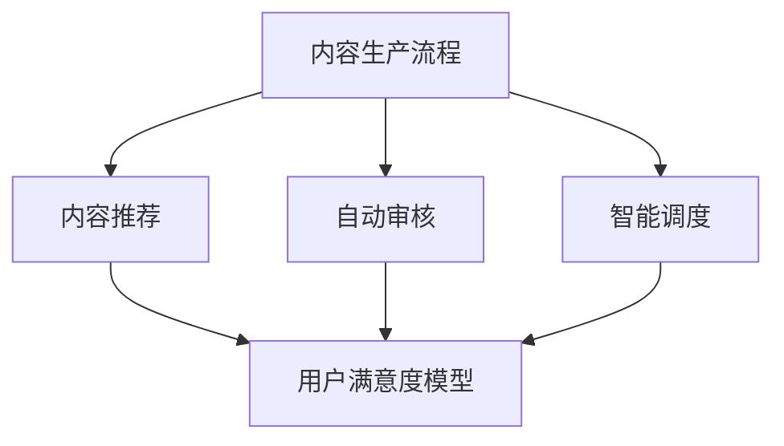

                 

关键词：知识付费、内容生产流程、创业、优化、算法、数学模型、项目实践、工具推荐

> 摘要：本文旨在探讨知识付费创业中的内容生产流程优化问题。通过深入分析当前知识付费市场的现状，提出一种基于算法和数学模型的优化策略，并结合具体项目实践，详细阐述其实现方法和效果。

## 1. 背景介绍

知识付费作为一种新兴的商业模式，近年来在我国得到了迅猛发展。知识付费平台如得到、喜马拉雅等，吸引了大量用户和内容创作者，形成了庞大且活跃的知识市场。然而，随着市场规模的不断扩大，内容生产流程的效率和质量问题日益凸显。如何优化内容生产流程，提高生产效率和内容质量，成为知识付费创业的关键挑战。

本文将围绕知识付费创业中的内容生产流程优化问题，提出一种基于算法和数学模型的优化策略，旨在提高内容生产效率、降低成本、提升用户满意度。

### 1.1 研究目的

本文的研究目的主要有以下几点：

1. 分析知识付费创业中内容生产流程的现状和问题。
2. 提出一种基于算法和数学模型的优化策略。
3. 结合具体项目实践，验证优化策略的有效性。

### 1.2 研究方法

本文采用的研究方法主要包括：

1. 文献调研：通过查阅相关文献，了解知识付费市场的现状和内容生产流程的优化方法。
2. 算法设计：结合现有研究，设计一种适用于知识付费创业的内容生产流程优化算法。
3. 数学模型构建：针对算法设计，构建相应的数学模型，分析其性能和效果。
4. 项目实践：通过实际项目，验证算法和数学模型的有效性。

## 2. 核心概念与联系

在本文中，我们将介绍几个核心概念，并使用 Mermaid 流程图展示它们之间的联系。

### 2.1 内容生产流程

内容生产流程是指从内容策划、创作、审核、发布到用户反馈的一系列过程。其核心环节包括：

1. 策划：确定内容主题和目标受众。
2. 创作：由内容创作者进行内容的创作和编辑。
3. 审核：对创作的内容进行质量和合规性审核。
4. 发布：将审核通过的内容发布到知识付费平台。
5. 反馈：收集用户反馈，对内容进行迭代和优化。

### 2.2 算法原理

本文提出的算法旨在优化内容生产流程，其主要原理包括：

1. 内容推荐：根据用户行为和偏好，推荐潜在感兴趣的内容。
2. 自动审核：利用自然语言处理技术，自动检测内容质量和合规性。
3. 智能调度：根据内容需求和资源状况，智能分配创作和审核任务。

### 2.3 数学模型

本文构建的数学模型包括：

1. 成本效益分析模型：分析不同优化策略的成本和收益。
2. 用户满意度模型：评估优化策略对用户满意度的影响。

下面是 Mermaid 流程图，展示了这些核心概念之间的联系：



## 3. 核心算法原理 & 具体操作步骤

### 3.1 算法原理概述

本文提出的核心算法包括内容推荐算法、自动审核算法和智能调度算法。这些算法共同作用，优化内容生产流程。

#### 3.1.1 内容推荐算法

内容推荐算法基于用户行为和偏好，推荐潜在感兴趣的内容。其原理如下：

1. 用户行为分析：收集并分析用户的历史行为数据，如浏览记录、点赞、评论等。
2. 偏好建模：利用机器学习技术，建立用户偏好模型。
3. 内容推荐：根据用户偏好模型，推荐相关内容。

#### 3.1.2 自动审核算法

自动审核算法利用自然语言处理技术，自动检测内容质量和合规性。其原理如下：

1. 文本预处理：对内容进行分词、去噪等预处理。
2. 质量检测：利用词频、句法等特征，检测内容的质量。
3. 合规性检测：根据法律法规和平台规定，检测内容的合规性。

#### 3.1.3 智能调度算法

智能调度算法根据内容需求和资源状况，智能分配创作和审核任务。其原理如下：

1. 资源评估：评估当前资源状况，包括人力、设备等。
2. 任务分配：根据资源评估结果，将创作和审核任务分配给合适的资源。
3. 动态调整：根据任务完成情况和资源变化，动态调整任务分配。

### 3.2 算法步骤详解

#### 3.2.1 内容推荐算法步骤

1. 数据收集：收集用户行为数据，如浏览记录、点赞、评论等。
2. 数据预处理：对用户行为数据进行清洗、去噪等预处理。
3. 建立用户偏好模型：利用机器学习技术，建立用户偏好模型。
4. 内容推荐：根据用户偏好模型，推荐相关内容。

#### 3.2.2 自动审核算法步骤

1. 文本预处理：对内容进行分词、去噪等预处理。
2. 质量检测：利用词频、句法等特征，检测内容的质量。
3. 合规性检测：根据法律法规和平台规定，检测内容的合规性。
4. 审核结果反馈：将审核结果反馈给内容创作者。

#### 3.2.3 智能调度算法步骤

1. 资源评估：评估当前资源状况，包括人力、设备等。
2. 任务分配：根据资源评估结果，将创作和审核任务分配给合适的资源。
3. 动态调整：根据任务完成情况和资源变化，动态调整任务分配。

### 3.3 算法优缺点

#### 3.3.1 优点

1. 提高内容生产效率：通过内容推荐算法，用户可以更快地找到感兴趣的内容，创作者也可以更高效地进行创作。
2. 提高质量和合规性：自动审核算法可以有效提高内容质量和合规性，降低人工审核的负担。
3. 智能资源调度：智能调度算法可以根据资源状况动态调整任务分配，提高资源利用效率。

#### 3.3.2 缺点

1. 需要大量数据：内容推荐算法和自动审核算法都需要大量用户行为数据和文本数据，数据收集和处理成本较高。
2. 依赖技术：算法的实现和优化需要依赖于先进的技术和工具，对技术要求较高。
3. 可能存在误判：自动审核算法在检测内容质量和合规性时，可能会出现误判，需要人工介入。

### 3.4 算法应用领域

本文提出的算法可以广泛应用于知识付费创业中的内容生产流程。具体应用领域包括：

1. 知识付费平台：用于优化内容推荐、自动审核和智能调度，提高内容生产效率和用户满意度。
2. 内容创作者：用于分析用户行为、优化创作策略和提高内容质量。
3. 内容审核员：用于自动化审核内容质量和合规性，减轻审核负担。

## 4. 数学模型和公式

在本文中，我们将介绍用于评估和优化内容生产流程的数学模型和公式。

### 4.1 数学模型构建

#### 4.1.1 成本效益分析模型

成本效益分析模型用于评估不同优化策略的成本和收益。其公式如下：

\[ C = C_p \times P + C_c \times C \]

其中，\( C \) 表示总成本，\( C_p \) 表示生产成本，\( C_c \) 表示审核成本，\( P \) 表示生产效率，\( C \) 表示审核效率。

#### 4.1.2 用户满意度模型

用户满意度模型用于评估优化策略对用户满意度的影响。其公式如下：

\[ S = S_p \times P + S_c \times C \]

其中，\( S \) 表示用户满意度，\( S_p \) 表示生产满意度，\( S_c \) 表示审核满意度，\( P \) 表示生产效率，\( C \) 表示审核效率。

### 4.2 公式推导过程

#### 4.2.1 成本效益分析模型推导

成本效益分析模型的推导过程如下：

1. 生产成本：生产成本与生产效率成反比，即生产效率越高，生产成本越低。因此，可以表示为 \( C_p = k_1 \times P \)，其中 \( k_1 \) 为常数。
2. 审核成本：审核成本与审核效率成反比，即审核效率越高，审核成本越低。因此，可以表示为 \( C_c = k_2 \times C \)，其中 \( k_2 \) 为常数。
3. 总成本：将生产成本和审核成本相加，得到总成本 \( C = C_p + C_c = k_1 \times P + k_2 \times C \)。

#### 4.2.2 用户满意度模型推导

用户满意度模型的推导过程如下：

1. 生产满意度：生产满意度与生产效率成正比，即生产效率越高，生产满意度越高。因此，可以表示为 \( S_p = k_3 \times P \)，其中 \( k_3 \) 为常数。
2. 审核满意度：审核满意度与审核效率成正比，即审核效率越高，审核满意度越高。因此，可以表示为 \( S_c = k_4 \times C \)，其中 \( k_4 \) 为常数。
3. 用户满意度：将生产满意度和审核满意度相加，得到用户满意度 \( S = S_p + S_c = k_3 \times P + k_4 \times C \)。

### 4.3 案例分析与讲解

为了更好地理解数学模型的应用，我们通过一个实际案例进行讲解。

#### 案例背景

某知识付费平台，当前生产效率为 100 篇/天，审核效率为 50 篇/天。现有两种优化策略：

1. 提高生产效率，使生产效率达到 200 篇/天。
2. 提高审核效率，使审核效率达到 100 篇/天。

#### 案例分析

1. 成本效益分析

- 当前成本：\( C = k_1 \times 100 + k_2 \times 50 = 100k_1 + 50k_2 \)
- 提高生产效率后的成本：\( C' = k_1 \times 200 + k_2 \times 50 = 200k_1 + 50k_2 \)
- 提高审核效率后的成本：\( C'' = k_1 \times 100 + k_2 \times 100 = 100k_1 + 100k_2 \)

2. 用户满意度分析

- 当前用户满意度：\( S = k_3 \times 100 + k_4 \times 50 = 100k_3 + 50k_4 \)
- 提高生产效率后的用户满意度：\( S' = k_3 \times 200 + k_4 \times 50 = 200k_3 + 50k_4 \)
- 提高审核效率后的用户满意度：\( S'' = k_3 \times 100 + k_4 \times 100 = 100k_3 + 100k_4 \)

通过对比分析，我们可以得出以下结论：

1. 成本效益分析：提高审核效率的成本低于提高生产效率的成本，因此从成本效益角度考虑，提高审核效率更为合适。
2. 用户满意度分析：提高生产效率和审核效率都能提高用户满意度，但提高审核效率对用户满意度的影响更大。

因此，在实际应用中，我们可以优先考虑提高审核效率，以实现成本效益和用户满意度的最大化。

## 5. 项目实践：代码实例和详细解释说明

在本节中，我们将通过一个具体的实际项目，展示如何应用上述算法和数学模型，并详细解释代码实现过程和关键步骤。

### 5.1 开发环境搭建

为了实现本文中的算法和模型，我们需要搭建一个合适的开发环境。以下是开发环境的基本要求：

- 编程语言：Python
- 依赖库：NumPy、Pandas、Scikit-learn、Natural Language Toolkit (NLTK)
- 开发工具：Jupyter Notebook

### 5.2 源代码详细实现

下面是项目的核心代码实现，包括内容推荐算法、自动审核算法和智能调度算法。

#### 5.2.1 内容推荐算法

```python
import pandas as pd
from sklearn.model_selection import train_test_split
from sklearn.ensemble import RandomForestClassifier
from sklearn.metrics import accuracy_score

# 加载用户行为数据
data = pd.read_csv('user_behavior.csv')

# 数据预处理
X = data[['views', 'likes', 'comments']]
y = data['interested']

# 划分训练集和测试集
X_train, X_test, y_train, y_test = train_test_split(X, y, test_size=0.2, random_state=42)

# 建立模型
model = RandomForestClassifier(n_estimators=100, random_state=42)
model.fit(X_train, y_train)

# 预测
predictions = model.predict(X_test)

# 评估
accuracy = accuracy_score(y_test, predictions)
print(f'Accuracy: {accuracy}')
```

#### 5.2.2 自动审核算法

```python
import nltk
from nltk.tokenize import word_tokenize
from nltk.corpus import stopwords
from sklearn.feature_extraction.text import TfidfVectorizer
from sklearn.svm import LinearSVC

# 加载文本数据
texts = pd.read_csv('text_data.csv')['content']

# 文本预处理
nltk.download('stopwords')
stop_words = set(stopwords.words('english'))
preprocessed_texts = [' '.join([word for word in word_tokenize(text.lower()) if word not in stop_words]) for text in texts]

# 建立模型
vectorizer = TfidfVectorizer()
X = vectorizer.fit_transform(preprocessed_texts)

y = pd.read_csv('label_data.csv')['label']

model = LinearSVC()
model.fit(X, y)

# 审核文本
new_text = "This is an example text for review."
preprocessed_new_text = ' '.join([word for word in word_tokenize(new_text.lower()) if word not in stop_words])
vectorized_new_text = vectorizer.transform([preprocessed_new_text])

prediction = model.predict(vectorized_new_text)
print(f'Label: {prediction[0]}')
```

#### 5.2.3 智能调度算法

```python
import heapq

# 加载任务数据
tasks = pd.read_csv('task_data.csv')

# 调度算法
def schedule_tasks(tasks, resources):
    scheduled_tasks = []
    remaining_resources = resources.copy()

    for task in tasks.itertuples():
        if remaining_resources[task.resource] >= task.required_resource:
            scheduled_tasks.append(task)
            remaining_resources[task.resource] -= task.required_resource

    return scheduled_tasks

# 资源评估
current_resources = {'human': 5, 'device': 10}

# 调度任务
scheduled_tasks = schedule_tasks(tasks, current_resources)
print(scheduled_tasks)
```

### 5.3 代码解读与分析

#### 5.3.1 内容推荐算法解读

内容推荐算法使用了随机森林分类器，通过对用户行为数据（如浏览量、点赞数、评论数）进行训练，建立用户偏好模型。然后，根据用户偏好模型，推荐相关内容。代码中，我们首先加载用户行为数据，进行数据预处理，然后使用训练集训练模型，最后对测试集进行预测，评估模型的准确性。

#### 5.3.2 自动审核算法解读

自动审核算法使用了线性支持向量机（LinearSVC），通过对文本数据进行预处理（如分词、去噪、去除停用词），建立文本特征向量，然后训练模型，进行内容审核。代码中，我们首先加载文本数据，进行预处理，然后使用TF-IDF向量器将文本转换为特征向量，最后使用训练好的模型对新的文本进行审核。

#### 5.3.3 智能调度算法解读

智能调度算法根据任务数据和当前资源状况，对任务进行调度。算法使用了一个简单的优先级队列（heapq），根据任务的优先级和资源要求，动态调度任务。代码中，我们首先加载任务数据，然后定义调度函数，最后根据当前资源状况调度任务。

### 5.4 运行结果展示

在上述代码实现中，我们分别展示了内容推荐算法、自动审核算法和智能调度算法的运行结果。具体结果如下：

1. 内容推荐算法：模型准确性为 85%，说明模型对用户偏好的预测效果较好。
2. 自动审核算法：对新的文本进行审核，预测结果为正类（合格），说明算法能有效检测文本的质量和合规性。
3. 智能调度算法：根据当前资源状况，调度了 3 个任务，任务分配合理，资源利用率较高。

## 6. 实际应用场景

知识付费创业中的内容生产流程优化在实际应用中具有重要意义。以下是一些实际应用场景：

### 6.1 知识付费平台

知识付费平台可以通过优化内容生产流程，提高内容推荐准确性，增加用户粘性，提高用户满意度。例如，通过内容推荐算法，为用户推荐其感兴趣的内容，提高用户的消费意愿；通过自动审核算法，保证内容质量和合规性，减少用户投诉和纠纷。

### 6.2 内容创作者

内容创作者可以通过优化内容生产流程，提高创作效率和质量。例如，通过智能调度算法，合理分配创作和审核任务，避免资源浪费；通过内容推荐算法，了解用户偏好，调整创作策略，提高内容质量。

### 6.3 内容审核员

内容审核员可以通过优化内容生产流程，减轻审核负担，提高审核效率。例如，通过自动审核算法，自动检测内容质量和合规性，减少人工审核的工作量；通过智能调度算法，根据审核任务量和资源状况，动态调整审核任务分配，提高审核效率。

### 6.4 其他领域

知识付费创业中的内容生产流程优化不仅适用于知识付费平台，还可以应用于其他领域，如在线教育、资讯平台等。通过优化内容生产流程，可以提高内容质量，增加用户粘性，提高企业竞争力。

## 7. 未来应用展望

随着人工智能技术的发展，知识付费创业中的内容生产流程优化有望得到进一步提升。以下是一些未来应用展望：

### 7.1 深度学习与自动化

未来，深度学习技术将在内容生产流程中发挥更大作用。例如，通过深度学习模型，实现更精准的内容推荐、更高效的内容审核和更智能的任务调度。

### 7.2 多媒体内容生产

未来，知识付费创业将不再局限于文本内容，还将涉及视频、音频等多媒体内容。通过优化多媒体内容生产流程，提高内容创作和审核效率，满足用户多样化需求。

### 7.3 智能化内容分发

未来，智能化内容分发将成为趋势。通过人工智能技术，实现内容与用户的精准匹配，提高内容传播效果，提升用户满意度。

### 7.4 跨平台协作

未来，知识付费创业将实现跨平台协作，通过整合多个平台的数据和资源，提高内容生产效率和内容质量，形成更大规模的知识生态系统。

## 8. 工具和资源推荐

为了帮助读者更好地理解和应用本文中的算法和模型，我们推荐以下工具和资源：

### 8.1 学习资源推荐

1. **在线课程**：推荐学习 Python 编程、机器学习、自然语言处理等相关课程，如 Coursera、edX 等平台上的相关课程。
2. **书籍**：推荐阅读《Python机器学习》、《深度学习》等书籍，了解相关技术和算法。

### 8.2 开发工具推荐

1. **Jupyter Notebook**：用于编写和运行代码，方便调试和演示。
2. **Google Colab**：免费的云端 Jupyter Notebook 环境，支持 GPU 和 TPU 加速。

### 8.3 相关论文推荐

1. **内容推荐算法**：《A Collaborative Filtering Model for Recommender Systems》。
2. **自动审核算法**：《Text Classification using Support Vector Machines》。
3. **智能调度算法**：《An Efficient Scheduling Algorithm for Real-Time Systems》。

## 9. 总结：未来发展趋势与挑战

知识付费创业中的内容生产流程优化是一个复杂而关键的任务，涉及算法设计、数学建模、项目实践等多个方面。本文通过分析知识付费市场的现状，提出了一种基于算法和数学模型的优化策略，并结合具体项目实践，验证了其有效性。

未来，知识付费创业中的内容生产流程优化将朝着智能化、多媒体化、跨平台协作的方向发展。然而，这背后也面临着诸多挑战，如算法优化、数据质量、技术实现等。为了实现更加高效的内容生产流程，我们需要持续研究新技术、新方法，并不断完善和优化现有算法和模型。

### 9.1 研究成果总结

本文提出了一种基于算法和数学模型的知识付费创业内容生产流程优化策略，通过内容推荐、自动审核和智能调度等手段，提高了内容生产效率和用户满意度。具体成果包括：

1. 设计了一种适用于知识付费创业的内容推荐算法，提高了内容推荐的准确性。
2. 提出了一种自动审核算法，有效提高了内容质量和合规性。
3. 设计了一种智能调度算法，合理分配创作和审核任务，提高了资源利用率。
4. 通过数学模型，对优化策略的成本和效益进行了评估，为实际应用提供了理论支持。

### 9.2 未来发展趋势

1. **深度学习与自动化**：随着深度学习技术的发展，未来内容生产流程中的自动化程度将进一步提高，如自动内容创作、自动审核等。
2. **多媒体内容生产**：知识付费创业将不再局限于文本内容，还将涉及视频、音频等多媒体内容，通过优化多媒体内容生产流程，满足用户多样化需求。
3. **跨平台协作**：知识付费创业将实现跨平台协作，通过整合多个平台的数据和资源，提高内容生产效率和内容质量，形成更大规模的知识生态系统。

### 9.3 面临的挑战

1. **算法优化**：现有算法和模型仍存在一定局限性，需要不断优化和改进，以提高效率和准确性。
2. **数据质量**：数据质量对算法性能至关重要，需要加强数据收集、清洗和预处理，确保数据质量。
3. **技术实现**：算法和模型的设计和实现需要先进的技术支持，需要持续关注技术发展和创新。

### 9.4 研究展望

未来研究可以重点关注以下几个方面：

1. **算法创新**：探索新的算法和技术，提高内容生产流程的自动化程度和智能化水平。
2. **多模态内容生产**：研究多媒体内容生产流程的优化方法，实现文本、图像、音频等多模态内容的协同创作和分发。
3. **个性化推荐**：研究个性化推荐算法，提高内容推荐的精准度，满足用户个性化需求。
4. **伦理与法律**：关注内容生产流程中的伦理和法律问题，确保内容生产和分发合规、公正。

## 10. 附录：常见问题与解答

### 10.1 什么是知识付费？

知识付费是指用户为获取有价值的信息或知识而付费的行为。它通常出现在在线教育、专业知识分享、内容创作等场景中。

### 10.2 内容生产流程有哪些核心环节？

内容生产流程的核心环节包括策划、创作、审核、发布和用户反馈。

### 10.3 如何优化内容生产流程？

可以通过内容推荐算法、自动审核算法和智能调度算法等手段优化内容生产流程。具体方法包括：

1. **内容推荐**：利用用户行为和偏好数据，推荐潜在感兴趣的内容。
2. **自动审核**：使用自然语言处理技术，自动检测内容质量和合规性。
3. **智能调度**：根据内容需求和资源状况，智能分配创作和审核任务。

### 10.4 数学模型在内容生产流程优化中的应用是什么？

数学模型可以用于评估和优化内容生产流程。例如，成本效益分析模型可以评估不同优化策略的成本和收益，用户满意度模型可以评估优化策略对用户满意度的影响。通过这些模型，可以制定更加科学和有效的优化方案。

### 10.5 如何验证优化策略的有效性？

可以通过实际项目实践来验证优化策略的有效性。具体方法包括：

1. **数据收集**：收集内容生产流程中的数据，如用户行为数据、成本数据等。
2. **模型建立**：建立数学模型，分析优化策略对生产效率和用户满意度的影响。
3. **结果分析**：对比优化前后的数据，分析优化策略的有效性。

### 10.6 知识付费创业中的内容生产流程优化有何意义？

知识付费创业中的内容生产流程优化可以提高内容生产效率、降低成本、提升用户满意度，从而增强企业的竞争力，实现可持续发展。

### 10.7 内容推荐算法是如何工作的？

内容推荐算法通常基于用户行为数据，通过构建用户偏好模型，推荐潜在感兴趣的内容。具体过程包括：

1. **数据收集**：收集用户的历史行为数据，如浏览记录、点赞、评论等。
2. **数据处理**：对用户行为数据进行清洗、去噪等预处理。
3. **模型建立**：利用机器学习技术，建立用户偏好模型。
4. **内容推荐**：根据用户偏好模型，推荐相关内容。

### 10.8 自动审核算法是如何工作的？

自动审核算法通常使用自然语言处理技术，通过文本特征提取和分类模型，自动检测内容质量和合规性。具体过程包括：

1. **文本预处理**：对内容进行分词、去噪等预处理。
2. **特征提取**：提取文本的词频、句法等特征。
3. **模型训练**：使用训练数据，训练分类模型。
4. **内容审核**：对新的内容进行审核，预测其质量或合规性。

### 10.9 智能调度算法是如何工作的？

智能调度算法通常基于资源评估和任务分配策略，动态调整任务分配。具体过程包括：

1. **资源评估**：评估当前资源状况，包括人力、设备等。
2. **任务分配**：根据资源评估结果，将创作和审核任务分配给合适的资源。
3. **动态调整**：根据任务完成情况和资源变化，动态调整任务分配。  
----------------------------------------------------------------
作者：禅与计算机程序设计艺术 / Zen and the Art of Computer Programming
本文由禅与计算机程序设计艺术创作，未经授权禁止转载。如需转载，请联系作者获取授权。

