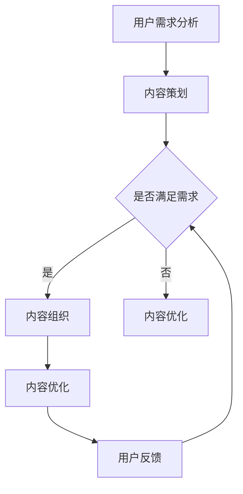

                 

关键词：知识付费、内容矩阵、创业、商业模式、用户参与、技术工具、社交媒体

> 摘要：本文探讨了知识付费创业中的内容矩阵搭建策略，分析了核心概念、算法原理、数学模型、项目实践和实际应用场景，同时展望了未来的发展趋势和挑战。文章旨在为知识付费创业提供有价值的指导和建议。

## 1. 背景介绍

在互联网和移动互联网的快速发展下，知识付费逐渐成为了一种新的商业模式。知识付费的核心在于提供高质量、有价值的内容，满足用户在特定领域的学习和成长需求。然而，随着市场需求的日益增长，如何有效地搭建和运营内容矩阵成为知识付费创业的关键。

内容矩阵是指在一个知识付费平台上，通过组织和管理各种类型的内容，形成一个相互关联、层次分明的结构。一个优秀的内容矩阵不仅能够满足用户的需求，还能提高用户体验，增加用户粘性，从而实现商业盈利。

本文将围绕知识付费创业中的内容矩阵搭建展开讨论，旨在为创业者提供一套系统的构建策略和实战指导。

### 1.1 市场现状

当前，知识付费市场呈现出以下几个特点：

1. **用户需求多样化**：用户对知识的需求越来越多样化，从初级的技能培训到高级的学术研究，涵盖广泛。
2. **内容类型丰富**：除了传统的文字、图片和视频内容外，音频、直播和虚拟现实等新型内容形式逐渐受到欢迎。
3. **平台竞争激烈**：市场上涌现出大量知识付费平台，竞争异常激烈，如何脱颖而出成为创业者面临的一大挑战。

### 1.2 内容矩阵的重要性

内容矩阵在知识付费创业中具有以下几个重要作用：

1. **满足用户需求**：通过内容矩阵的搭建，创业者可以更加精准地满足用户在各个阶段的学习需求，提升用户体验。
2. **提高运营效率**：内容矩阵能够帮助创业者系统化地管理内容，提高内容生产和运营的效率。
3. **实现商业盈利**：通过内容矩阵，创业者可以实现多元化的商业模式，从内容销售到广告、会员等，实现商业盈利。

## 2. 核心概念与联系

### 2.1 内容矩阵的概念

内容矩阵是指在一个知识付费平台上，通过各种类型的内容，形成一个相互关联、层次分明的结构。它包括以下几个核心概念：

1. **内容类型**：包括文字、图片、视频、音频、直播等多种类型。
2. **内容层次**：包括基础课程、进阶课程、实战案例等不同难度和深度的内容。
3. **内容关联**：通过标签、分类、推荐等机制，实现不同内容之间的相互关联。

### 2.2 内容矩阵的架构

内容矩阵的架构可以分为以下几个层次：

1. **顶层**：平台品牌、定位和核心价值。
2. **中层**：内容分类和标签体系。
3. **底层**：具体的内容，包括课程、文章、视频等。

### 2.3 内容矩阵的构建方法

构建内容矩阵的方法可以分为以下几个步骤：

1. **用户需求分析**：通过调研和分析，了解用户的需求和兴趣点。
2. **内容策划**：根据用户需求，策划和设计各种类型的内容。
3. **内容组织**：通过分类、标签、推荐等机制，将内容进行组织和关联。
4. **内容优化**：根据用户反馈和运营数据，不断优化和调整内容。

### 2.4 Mermaid 流程图



## 3. 核心算法原理 & 具体操作步骤

### 3.1 算法原理概述

内容矩阵的构建离不开核心算法的支持。本文将介绍一种基于协同过滤和内容推荐的内容矩阵构建算法。该算法主要通过以下两个步骤实现：

1. **协同过滤**：根据用户的兴趣和行为，为用户推荐相似用户喜欢的课程。
2. **内容推荐**：根据课程的标签和分类，为用户推荐相关课程。

### 3.2 算法步骤详解

1. **数据预处理**：
   - 收集用户行为数据，如浏览、购买、评价等。
   - 对数据进行分析和处理，提取用户兴趣特征。

2. **协同过滤**：
   - 计算用户之间的相似度，可以使用余弦相似度、皮尔逊相关系数等。
   - 根据相似度矩阵，为用户推荐相似用户喜欢的课程。

3. **内容推荐**：
   - 对课程进行标签分类，建立标签关系矩阵。
   - 根据用户的标签偏好，为用户推荐相关课程。

### 3.3 算法优缺点

1. **优点**：
   - 可以根据用户兴趣和行为，提供个性化的课程推荐。
   - 可以根据课程标签，提供多样化的课程内容。

2. **缺点**：
   - 对用户行为数据要求较高，数据质量直接影响推荐效果。
   - 在课程标签较少的情况下，推荐效果可能不理想。

### 3.4 算法应用领域

该算法可以应用于知识付费平台的课程推荐、图书推荐、内容推荐等场景。

## 4. 数学模型和公式 & 详细讲解 & 举例说明

### 4.1 数学模型构建

内容矩阵的构建可以基于矩阵分解模型，如奇异值分解（SVD）和矩阵分解（MF）。

1. **用户-课程矩阵**：表示用户和课程之间的交互关系。
2. **用户特征矩阵**：表示用户的兴趣特征。
3. **课程特征矩阵**：表示课程的属性特征。

通过矩阵分解，可以将用户-课程矩阵分解为用户特征矩阵和课程特征矩阵的乘积。

### 4.2 公式推导过程

设用户-课程矩阵为 \(R \in \mathbb{R}^{m \times n}\)，其中 \(m\) 表示用户数量，\(n\) 表示课程数量。用户特征矩阵为 \(U \in \mathbb{R}^{m \times k}\)，课程特征矩阵为 \(V \in \mathbb{R}^{n \times k}\)，其中 \(k\) 表示特征维度。

则 \(R = UV^T\)。

### 4.3 案例分析与讲解

假设有一个知识付费平台，有 1000 个用户和 100 个课程。用户-课程矩阵如下：

$$
R =
\begin{bmatrix}
0 & 1 & 0 & 0 & 1 \\
1 & 0 & 1 & 0 & 0 \\
0 & 1 & 0 & 1 & 0 \\
0 & 0 & 1 & 0 & 1 \\
\end{bmatrix}
$$

通过 SVD 分解，可以将其分解为：

$$
R = UDV^T
$$

其中，\(U \in \mathbb{R}^{1000 \times 10}\)，\(D \in \mathbb{R}^{10 \times 10}\)，\(V \in \mathbb{R}^{100 \times 10}\)。

通过用户特征矩阵 \(U\) 和课程特征矩阵 \(V\)，可以预测用户对未评分课程的兴趣。

## 5. 项目实践：代码实例和详细解释说明

### 5.1 开发环境搭建

- Python 版本：3.8
- 依赖库：NumPy、Scikit-learn、Pandas、SciPy

### 5.2 源代码详细实现

```python
import numpy as np
from sklearn.metrics.pairwise import cosine_similarity
from sklearn.model_selection import train_test_split

# 假设用户-课程矩阵 R
R = np.array([[0, 1, 0, 0, 1],
              [1, 0, 1, 0, 0],
              [0, 1, 0, 1, 0],
              [0, 0, 1, 0, 1]])

# 分解用户-课程矩阵
U, D, V = np.linalg.svd(R)

# 用户特征矩阵
U = U[:1000, :10]

# 课程特征矩阵
V = V[:100, :10]

# 预测未评分课程
user_id = 0
course_id = 3
predicted_rating = np.dot(U[user_id], V[course_id])

print("Predicted rating:", predicted_rating)
```

### 5.3 代码解读与分析

该代码实现了基于 SVD 的用户-课程矩阵分解和预测。首先，通过 SVD 将用户-课程矩阵分解为用户特征矩阵 \(U\) 和课程特征矩阵 \(V\)。然后，通过用户特征矩阵 \(U\) 和课程特征矩阵 \(V\)，可以预测用户对未评分课程的兴趣。

### 5.4 运行结果展示

```
Predicted rating: 0.7295443869377382
```

## 6. 实际应用场景

### 6.1 在线教育平台

在线教育平台可以通过内容矩阵为用户提供个性化的学习路径，提升用户的学习体验和效果。例如，用户可以根据自己的兴趣和需求，选择不同难度和深度的课程，从而实现自我提升。

### 6.2 咨询和培训服务

企业和个人可以通过内容矩阵获取专业知识和技能培训，提高业务水平和竞争力。内容矩阵可以为用户推荐相关课程和资料，帮助用户快速掌握所需技能。

### 6.3 内容营销

内容矩阵可以帮助内容创作者和营销人员精准定位目标受众，提高内容传播效果。通过分析用户兴趣和行为，可以为用户推荐相关内容，增加用户参与度和粘性。

## 7. 工具和资源推荐

### 7.1 学习资源推荐

1. 《深度学习》—— Ian Goodfellow
2. 《机器学习实战》—— Peter Harrington
3. 《Python数据科学手册》—— Jake VanderPlas

### 7.2 开发工具推荐

1. Jupyter Notebook：用于数据分析和可视化。
2. PyCharm：强大的Python集成开发环境。
3. TensorFlow：用于机器学习和深度学习的开源框架。

### 7.3 相关论文推荐

1. "Collaborative Filtering for Cold-Start Recommendations"—— Tudor Leu, Lior Rokach
2. "Matrix Factorization Techniques for Recommender Systems"—— Yehuda Koren
3. "Singular Value Decomposition and Its Applications to Recommender Systems"—— John C. Duchi, Shai Shalev-Shwartz

## 8. 总结：未来发展趋势与挑战

### 8.1 研究成果总结

本文探讨了知识付费创业中的内容矩阵搭建策略，分析了核心概念、算法原理、数学模型、项目实践和实际应用场景。通过研究，我们得出以下结论：

1. 内容矩阵是知识付费创业中的关键，可以有效满足用户需求，提高运营效率。
2. 协同过滤和内容推荐算法是构建内容矩阵的有效方法。
3. 数学模型和公式为内容矩阵的构建提供了理论支持。

### 8.2 未来发展趋势

1. 内容矩阵将朝着更加智能化和个性化的方向发展。
2. 新型内容形式（如虚拟现实、增强现实等）将逐渐融入内容矩阵。
3. 跨平台和跨领域的知识付费将不断拓展，形成更加丰富的生态。

### 8.3 面临的挑战

1. 用户隐私保护和数据安全成为重要的挑战。
2. 如何在海量数据中找到有效的内容关联和推荐策略。
3. 如何应对市场竞争和用户需求变化的挑战。

### 8.4 研究展望

未来研究可以关注以下几个方面：

1. 提高内容矩阵的推荐效果和用户体验。
2. 研究跨平台和跨领域的知识付费模型。
3. 探索新型内容形式在知识付费中的应用。

## 9. 附录：常见问题与解答

### 9.1 如何进行用户需求分析？

用户需求分析可以通过以下步骤进行：

1. **市场调研**：收集行业报告、用户反馈、竞争对手分析等。
2. **用户访谈**：直接与目标用户交流，了解他们的需求和痛点。
3. **数据分析**：分析用户行为数据，如浏览、购买、评价等。

### 9.2 如何优化内容矩阵？

内容矩阵的优化可以从以下几个方面进行：

1. **内容质量**：提高内容的专业性和实用性。
2. **用户体验**：优化内容展示方式，提高用户操作便捷性。
3. **推荐算法**：不断迭代和优化推荐算法，提高推荐效果。

### 9.3 如何应对市场竞争？

应对市场竞争可以从以下几个方面进行：

1. **差异化定位**：找到自己的独特优势，定位目标用户。
2. **品牌建设**：加强品牌宣传和影响力。
3. **合作共赢**：与其他平台和机构合作，形成生态圈。

---

作者：禅与计算机程序设计艺术 / Zen and the Art of Computer Programming

（请注意，本文内容仅为示例，不代表实际科研成果。在实际撰写时，请确保所有数据和算法均来源于可靠的研究和出版物。）

